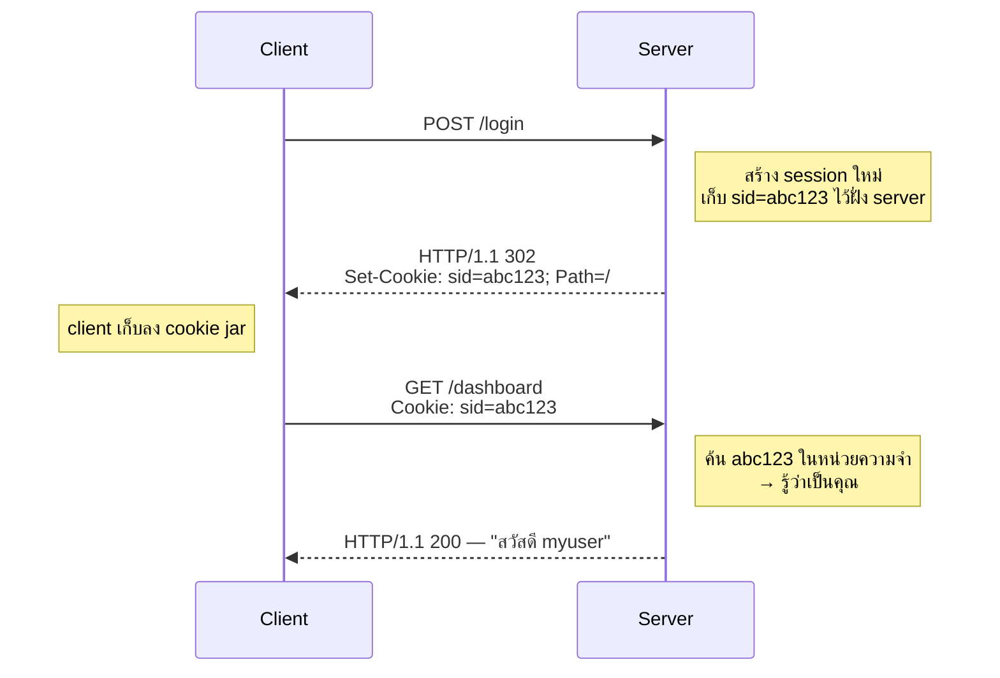
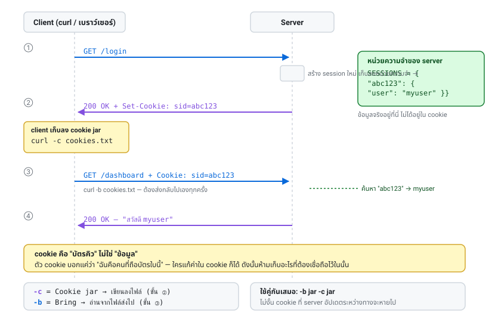
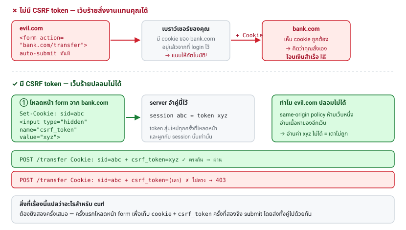

# บทที่ 4 · Cookie และ Session

> จำได้ไหมว่า[บทที่ 1](01-http-basics.md) บอกว่า HTTP ไม่มีความจำ
> บทนี้คือคำตอบว่าเว็บ "จำ" คุณได้อย่างไร

## 4.1 Cookie คืออะไร {#s4-1}

Cookie คือข้อความสั้น ๆ ที่ server ฝากไว้กับ client แล้วบอกว่า "ครั้งหน้าส่งกลับมาด้วยนะ"



จุดสำคัญ: **cookie เป็นแค่ "บัตรคิว"** ข้อมูลจริงอยู่ฝั่ง server
ตัว cookie บอกแค่ว่า "ฉันคือคนที่ถือบัตรใบนี้"

- ทิศทางขาลง: header ชื่อ `Set-Cookie` (server → client) — หนึ่ง cookie ต่อหนึ่งบรรทัด
- ทิศทางขาขึ้น: header ชื่อ `Cookie` (client → server) — รวมทุก cookie ไว้บรรทัดเดียว คั่นด้วย `; `



## 4.2 Attribute ของ cookie {#s4-2}

```
Set-Cookie: sid=abc123; Path=/; Domain=example.com; Max-Age=3600;
            HttpOnly; Secure; SameSite=Lax
```

| Attribute | ความหมาย | เกี่ยวอะไรกับความปลอดภัย |
|-----------|----------|--------------------------|
| `Path=/` | ส่งเมื่อ path ขึ้นต้นด้วยค่านี้ | จำกัดขอบเขต |
| `Domain=` | โดเมนไหนบ้างที่ได้รับ | ถ้าตั้งกว้างไป subdomain ที่ถูกแฮ็กจะขโมยได้ |
| `Expires=` / `Max-Age=` | หมดอายุเมื่อไร | ไม่ใส่ = หายเมื่อปิดเบราว์เซอร์ (session cookie) |
| `HttpOnly` | JavaScript อ่านไม่ได้ | **กัน XSS ขโมย session** |
| `Secure` | ส่งเฉพาะบน HTTPS | กันดักฟังบน HTTP |
| `SameSite=Strict/Lax/None` | ส่งข้าม site ได้ไหม | **กัน CSRF** |

`SameSite` อธิบายเพิ่ม:

- `Strict` — ไม่ส่งเลยเวลามาจากเว็บอื่น (ปลอดภัยสุด แต่กด link จากอีเมลแล้วเหมือนยังไม่ login)
- `Lax` — ค่าเริ่มต้นของเบราว์เซอร์สมัยใหม่ ส่งเฉพาะ GET ที่เป็นการ navigate
- `None` — ส่งทุกกรณี **ต้องมี `Secure` ด้วย** ใช้เมื่อจำเป็นจริง ๆ เท่านั้น

> **สำหรับ mobile API ที่คุณทำอยู่**: ปกติ mobile app ไม่ใช้ cookie แต่ใช้ Bearer token
> ([บทที่ 9](09-authentication.md)-11) เพราะไม่มี cookie jar อัตโนมัติแบบเบราว์เซอร์ และ CSRF ไม่ใช่ปัญหา
> ของ native app แต่ถ้าใช้ WebView ต้องคิดเรื่อง cookie ด้วย

## 4.3 curl กับ cookie: `-c` และ `-b` {#s4-3}

จำง่าย ๆ:

- **`-c` = Cookie jar** → **เขียน** cookie ที่ได้รับลงไฟล์
- **`-b` = Bring cookie** → **อ่าน** cookie จากไฟล์ส่งไปด้วย

```bash
curl -c cookies.txt URL              # รับ cookie มาเก็บ
curl -b cookies.txt URL              # ส่ง cookie ที่มีไป
curl -b cookies.txt -c cookies.txt URL   # ทั้งส่งและอัปเดต ← ใช้ตัวนี้เกือบตลอด
```

**ต้องใส่ทั้ง `-b` และ `-c` ทุกครั้งในสายเดียวกัน** ไม่งั้น cookie ที่ server อัปเดตระหว่างทาง
จะหายไป (เช่น session ที่หมุนใหม่หลัง login)

`-b` ยังรับ cookie แบบพิมพ์ตรง ๆ ได้ด้วย:

```bash
curl -b 'sid=abc123; theme=dark' URL
```

## 4.4 หน้าตาไฟล์ cookie jar {#s4-4}

curl ใช้ **Netscape cookie file format** ซึ่งเป็น TSV (คั่นด้วย tab):

```
# Netscape HTTP Cookie File
127.0.0.1	FALSE	/	FALSE	0	sid	5661bc9f6a1c...
```

เจ็ดคอลัมน์ตามลำดับ:

| # | คอลัมน์ | ตัวอย่าง | ความหมาย |
|---|---------|----------|----------|
| 1 | domain | `127.0.0.1` | โดเมนของ cookie |
| 2 | include subdomains | `FALSE` | subdomain ได้รับด้วยไหม |
| 3 | path | `/` | path |
| 4 | secure | `FALSE` | ต้องใช้ HTTPS ไหม |
| 5 | expires | `0` | Unix timestamp (0 = session cookie) |
| 6 | name | `sid` | ชื่อ |
| 7 | value | `5661bc...` | ค่า |

รู้ format นี้ไว้เพราะ **[บทที่ 18](18-playwright-cookies-to-curl.md) เราจะเขียนไฟล์นี้ขึ้นมาเองจาก cookie ของ Playwright**

ถ้าบรรทัดขึ้นต้นด้วย `#HttpOnly_` แปลว่า cookie นั้นมี flag HttpOnly

> ⚠️ คอลัมน์คั่นด้วย **tab จริง ๆ** ไม่ใช่ space ถ้าเขียนเองแล้ว curl ไม่อ่าน
> ให้เช็คตรงนี้ก่อนเลย (`cat -A cookies.txt` จะเห็น `^I` แทน tab)

## 4.5 Session คืออะไร (ต่างจาก cookie ยังไง) {#s4-5}

คนสับสนสองคำนี้บ่อยมาก

| | Cookie | Session |
|---|--------|---------|
| อยู่ที่ไหน | ฝั่ง client | ฝั่ง server |
| เก็บอะไร | แค่ ID | ข้อมูลจริง (user id, สิทธิ์, ตะกร้าสินค้า) |
| ใครแก้ได้ | client แก้ได้ (จึงห้ามเชื่อ) | server เท่านั้น |

ใน [lab/server.py](../lab/server.py) จะเห็นชัด:

```python
SESSIONS = {}   # sid -> {"csrf": ..., "auth": ..., "user": ...}
```

cookie ที่ส่งให้ client มีแค่ `sid` ส่วนข้อมูลจริงทั้งหมดอยู่ใน `SESSIONS` บน server

**บทเรียนสำคัญ: อย่าเก็บข้อมูลที่เชื่อถือได้ใน cookie**
ถ้าคุณส่ง `Set-Cookie: role=admin` client แก้เป็นอะไรก็ได้

## 4.6 CSRF — ทำไมต้องมี token {#s4-6}

**CSRF (Cross-Site Request Forgery)** คือการที่เว็บร้าย หลอกให้เบราว์เซอร์คุณ
ยิง request ไปเว็บดี **พร้อม cookie ของคุณ** โดยที่คุณไม่รู้ตัว

```html
<!-- อยู่ในเว็บของคนร้าย -->
<form action="https://bank.com/transfer" method="POST" id="f">
  <input name="to" value="attacker"><input name="amount" value="100000">
</form>
<script>document.getElementById('f').submit()</script>
```

เบราว์เซอร์แนบ cookie ของ bank.com ไปให้อัตโนมัติ → ธนาคารคิดว่าคุณสั่งเอง

**ทางแก้: CSRF token** — server ใส่ค่าสุ่มไว้ใน form ที่ผูกกับ session
เว็บของคนร้ายอ่านค่านี้ไม่ได้ (เพราะ same-origin policy) จึงปลอมไม่ได้

```
GET /login  →  Set-Cookie: sid=abc  +  <input name="csrf_token" value="xyz">
                                                    │
                     server จำไว้ว่า session abc คู่กับ token xyz
                                                    │
POST /login  →  Cookie: sid=abc  +  csrf_token=xyz  ✓ ตรงกัน ผ่าน
POST /login  →  Cookie: sid=abc  +  csrf_token=???  ✗ ไม่ตรง 403
```



## 4.7 ทำ flow เต็มด้วยมือ {#s4-7}

```bash
JAR=$(mktemp)

# ขั้นที่ 1 — โหลดหน้า login: ได้ทั้ง cookie และ csrf token
curl -s -c "$JAR" http://127.0.0.1:8080/login -o /tmp/form.html
TOKEN=$(grep -oP 'name="csrf_token" value="\K[^"]+' /tmp/form.html)

echo "cookie ที่ได้:"; cat "$JAR"
echo "csrf token: $TOKEN"

# ขั้นที่ 2 — submit พร้อม cookie เดิม + token
# (ไม่ใส่ -X POST เพราะ -d ทำให้เป็น POST อยู่แล้ว และ -X จะทำให้ตาม redirect ผิด — บทที่ 5.3)
curl -s -b "$JAR" -c "$JAR" -L \
    http://127.0.0.1:8080/login \
    -d "csrf_token=$TOKEN" -d 'username=myuser' -d 'password=mypass' \
    | grep -o 'สวัสดี.*'

# ขั้นที่ 3 — เข้าหน้าที่ต้อง login ได้แล้ว
curl -s -b "$JAR" http://127.0.0.1:8080/dashboard | grep -o 'session id.*'
```

ลองผิดดูบ้างเพื่อให้เห็นว่าอะไรพัง:

```bash
# ไม่ส่ง cookie → server ไม่รู้จัก session
curl -s -X POST http://127.0.0.1:8080/login \
    -d "csrf_token=$TOKEN" -d 'username=myuser' -d 'password=mypass'
# → 403 ไม่มี session cookie

# ส่ง cookie แต่ token มั่ว
curl -s -b "$JAR" -X POST http://127.0.0.1:8080/login \
    -d 'csrf_token=มั่ว' -d 'username=myuser' -d 'password=mypass'
# → 403 CSRF token ไม่ถูกต้อง
```

## 4.8 กับดักที่เจอบ่อย {#s4-8}

| อาการ | สาเหตุ |
|-------|--------|
| ได้ 403 ทั้งที่ token ถูก | ลืม `-b` ส่ง cookie ไปด้วย หรือใช้ token จากคนละ session |
| login แล้วแต่หน้าถัดไปยังไม่ login | ลืม `-c` ตอน POST → cookie ใหม่หลัง login หายไป |
| cookie jar ว่างเปล่า | server ตั้ง cookie ที่ path/domain ไม่ตรง หรือใช้ `Secure` บน HTTP |
| ใช้ได้ครั้งแรก ครั้งต่อไปพัง | token เป็นแบบใช้ครั้งเดียว ต้องโหลดหน้า form ใหม่ทุกครั้ง |

ดู cookie ที่ server พยายามตั้งได้ด้วย:

```bash
curl -sv http://127.0.0.1:8080/login 2>&1 | grep -i 'set-cookie'
```

## แบบฝึกหัด

1. รัน flow ใน[ข้อ 4.7](#s4-7) ให้ผ่าน แล้วเปิดไฟล์ cookie jar ดูว่ามีกี่คอลัมน์
   ใช้ `cat -A "$JAR"` เพื่อยืนยันว่าคั่นด้วย tab
2. login สำเร็จแล้ว ลองเอา `sid` จาก jar ไปใส่ `-b 'sid=...'` ตรง ๆ แทนไฟล์ ได้ผลเหมือนกันไหม
3. แก้ค่า `sid` ในไฟล์ jar ให้ผิดไป 1 ตัวอักษร แล้วยิง `/dashboard` — ได้ status อะไร
4. หลัง login สำเร็จ ลองยิง `/login` ใหม่แล้วดูว่า CSRF token เปลี่ยนไหม
   (ดูโค้ดใน `post_login` ว่าทำไม)
5. เขียนสคริปต์ login ให้จบใน 1 ไฟล์ (เฉลย: `lab/solutions/login-flow.sh`)

***
[⬅ HTML form → curl](03-html-forms.md) · [สารบัญ](../README.md) · [Redirect และ Header ➡](05-redirects-and-headers.md)
