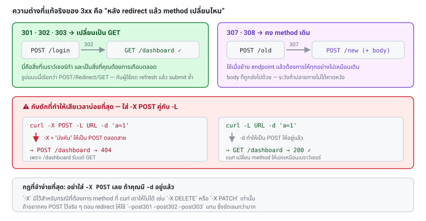

# บทที่ 5 · Redirect และ Header

## 5.1 Redirect คืออะไร

server ตอบว่า "ของที่คุณหาไม่ได้อยู่ตรงนี้ ไปที่นี่แทน" ด้วย status 3xx + header `Location`

```bash
curl -i -X POST http://127.0.0.1:8080/login -d ... 
```

```http
HTTP/1.1 302 Found
Location: /dashboard
```

curl **ไม่ตามให้อัตโนมัติ** (ต่างจากเบราว์เซอร์) ต้องสั่งด้วย `-L`

```bash
curl -L ...
```

## 5.2 3xx แต่ละตัวต่างกันตรงไหน

ความต่างที่สำคัญคือ **หลัง redirect แล้ว method เปลี่ยนไหม**

| Code | ชื่อ | POST → ปลายทางกลายเป็น | ใช้เมื่อ |
|------|------|------------------------|---------|
| 301 | Moved Permanently | GET (ในทางปฏิบัติ) | ย้าย URL ถาวร |
| 302 | Found | GET (ในทางปฏิบัติ) | ย้ายชั่วคราว — ที่เจอบ่อยสุด |
| 303 | See Other | **GET เสมอ** (ตาม spec) | หลัง POST สำเร็จ ให้ไปดูผลที่อื่น |
| 307 | Temporary Redirect | **POST เหมือนเดิม** | ย้ายชั่วคราวโดยคงทุกอย่าง |
| 308 | Permanent Redirect | **POST เหมือนเดิม** | ย้ายถาวรโดยคงทุกอย่าง |
| 304 | Not Modified | — | cache ยังใช้ได้ ไม่ต้องส่ง body |

**pattern ที่ควรรู้จัก: POST/Redirect/GET**
form submit → POST → 302/303 → GET หน้าผล
มีไว้เพื่อไม่ให้ผู้ใช้กด refresh แล้ว submit ซ้ำ — lab server ก็ใช้ pattern นี้ที่ `/login`

## 5.3 `-X POST` + `-L` = กับดัก

```bash
# ผิด: บังคับ POST ทำให้ตอนตาม redirect ไป /dashboard ก็ยัง POST อยู่
curl -X POST -L URL -d 'a=1'

# ถูก: ปล่อยให้ curl จัดการ method เอง
curl -L URL -d 'a=1'
```

พอมี `-d` curl จะใช้ POST ให้อยู่แล้ว และเมื่อเจอ 301/302/303 มันจะ**เปลี่ยนเป็น GET**
ตอนตาม redirect ซึ่งตรงกับที่เบราว์เซอร์ทำ แต่ถ้าคุณใส่ `-X POST` เป็นการ**บังคับ**
curl จะ POST ซ้ำไปที่ปลายทางด้วย

ถ้าต้องการควบคุมชัด ๆ:

```bash
--post301  --post302  --post303    # บังคับให้คง POST ไว้
```



## 5.4 ตรวจสอบเส้นทาง redirect

```bash
# ดูว่าจบที่ไหน และผ่านกี่ทอด
curl -sL -o /dev/null -w 'final=%{url_effective} hops=%{num_redirects}\n' URL

# เห็นทุกทอด
curl -sIL URL | grep -iE '^(HTTP|location)'

# จำกัดจำนวนทอด กัน redirect loop
curl -L --max-redirs 5 URL
```

## 5.5 Header ที่ต้องรู้จัก

### ขาส่ง (request headers)

| Header | ทำอะไร | curl |
|--------|--------|------|
| `Host` | บอกว่าขอเว็บไหน (หนึ่ง IP มีหลายเว็บได้) | ใส่ให้อัตโนมัติ |
| `User-Agent` | บอกว่าเป็น client อะไร | `-A 'ข้อความ'` |
| `Accept` | อยากได้ content type ไหน | `-H 'Accept: application/json'` |
| `Accept-Language` | ภาษาที่ต้องการ | `-H 'Accept-Language: th-TH'` |
| `Accept-Encoding` | รับการบีบอัดแบบไหนได้ | `--compressed` |
| `Content-Type` | body ที่ส่งไปเป็นชนิดอะไร | ตั้งอัตโนมัติตาม `-d`/`-F` หรือ `-H` |
| `Referer` | มาจากหน้าไหน (สะกดผิดตั้งแต่ปี 1996) | `-e 'URL'` |
| `Origin` | โดเมนต้นทาง (สำคัญกับ CORS) | `-H 'Origin: ...'` |
| `Authorization` | ข้อมูลยืนยันตัวตน | `-u` หรือ `-H` ([บทที่ 9](09-authentication.md)) |
| `Cookie` | cookie | `-b` ([บทที่ 4](04-cookies-sessions.md)) |
| `X-Requested-With` | มักใช้บอกว่าเป็น AJAX | `-H 'X-Requested-With: XMLHttpRequest'` |

### ขากลับ (response headers)

| Header | ความหมาย |
|--------|----------|
| `Content-Type` | ชนิดข้อมูล + charset |
| `Content-Length` | ขนาด body |
| `Set-Cookie` | ตั้ง cookie |
| `Location` | ปลายทาง redirect |
| `Cache-Control` / `ETag` | กติกาการ cache |
| `WWW-Authenticate` | วิธี auth ที่ต้องใช้ (มากับ 401) |
| `Retry-After` | ให้รอกี่วินาทีก่อนลองใหม่ (มากับ 429/503) |
| `Access-Control-Allow-*` | กติกา CORS ([บทที่ 12](12-api-design-practices.md)) |
| `Strict-Transport-Security` | บังคับ HTTPS |

## 5.6 `--compressed` — ที่คนลืมบ่อย

server หลายเจ้าบีบอัด response ด้วย gzip/brotli แต่จะส่งมาก็ต่อเมื่อคุณบอกว่ารับได้

```bash
curl --compressed URL      # ส่ง Accept-Encoding แล้วคลายให้อัตโนมัติ
```

ถ้าไม่ใส่แล้วเจอข้อมูลอ่านไม่ออก (ตัวอักษรมั่ว) นั่นแหละคืออาการ

## 5.7 User-Agent — header ที่มีผลกับ anti-bot มากที่สุด

ค่าเริ่มต้นของ curl คือ:

```
User-Agent: curl/8.5.0
```

ประกาศตัวเองชัดเจนว่าเป็นบอท เว็บที่มีระบบ anti-bot มักบล็อกทันที

```bash
curl -A 'Mozilla/5.0 (X11; Linux x86_64) AppleWebKit/537.36 (KHTML, like Gecko) Chrome/120.0 Safari/537.36' URL
```

> จะพูดถึงเรื่องนี้ในเชิงจริยธรรมและข้อจำกัดใน[บทที่ 15](15-captcha-and-antibot.md) และ 22
> การเปลี่ยน User-Agent ให้ตรงกับ client จริงของคุณเอง (เช่น `MyApp/1.2 (Android 14)`)
> เป็นเรื่องปกติและควรทำ — ต่างจากการปลอมเป็นเบราว์เซอร์เพื่อหลบระบบของคนอื่น

**สำหรับ API ของคุณเอง**: ตั้ง User-Agent ของ mobile app ให้มีชื่อแอป + เวอร์ชัน + platform
เพราะมันช่วยให้คุณ debug ฝั่ง server ได้มหาศาล และใช้บังคับให้อัปเดตเวอร์ชันขั้นต่ำได้

```
User-Agent: MyApp/2.3.1 (Android 14; Pixel 7)
```

## 5.8 ส่ง header หลายตัว

```bash
curl -H 'Accept: application/json' \
     -H 'Accept-Language: th' \
     -H 'X-Client-Version: 2.3.1' \
     URL

# อ่านจากไฟล์ (curl 7.55+) — ดีเวลามีความลับ
curl -H @headers.txt URL

# ลบ header ที่ curl ใส่ให้อัตโนมัติ
curl -H 'Accept:' URL          # ใส่ชื่อแล้วตามด้วย : เปล่า ๆ
```

## 5.9 ทดลองกับ lab

endpoint `/headers` สะท้อนทุก header กลับมา:

```bash
curl -s -A 'MyApp/2.3.1 (Android 14)' \
     -H 'Accept-Language: th-TH' \
     -e 'https://example.com/from' \
     http://127.0.0.1:8080/headers | jq '.headers'
```

## แบบฝึกหัด

1. ยิง POST `/login` โดย**ไม่ใส่** `-L` แล้วดู status กับ `Location` ด้วย `-i`
2. ยิงใหม่ใส่ `-L` แล้วใช้ `-w '%{url_effective} %{num_redirects}\n'` ดูว่าจบที่ไหน
3. เติม `-X POST` เข้าไปในข้อ 2 แล้วดูว่าผลลัพธ์เปลี่ยนไปอย่างไร (อ่าน 5.3 ประกอบ)
4. ยิง `/headers` แล้วนับ header ที่ curl ใส่ให้เองโดยคุณไม่ได้สั่ง
5. ลบ header `Accept` ออกด้วย `-H 'Accept:'` แล้วยืนยันผ่าน `/headers` ว่าหายไปจริง

***
[⬅ Cookie และ Session](04-cookies-sessions.md) · [สารบัญ](../README.md) · [Encoding, ภาษาไทย และ base64 ➡](06-encoding-and-charset.md)
