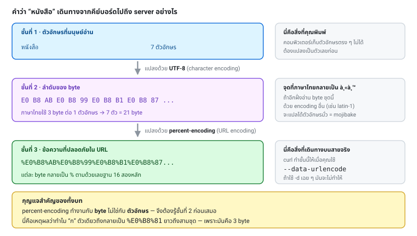

# บทที่ 6 · Encoding, ภาษาไทย และ base64

> บทนี้แก้ปัญหา "ทำไมภาษาไทยกลายเป็น หน" และ "ทำไม + กลายเป็น space"
> ซึ่งเป็นบั๊กที่กินเวลา debug มากที่สุดเรื่องหนึ่ง

## 6.1 สามชั้นที่ต้องแยกให้ออก

คนสับสนเพราะเอาสามเรื่องนี้มาปนกัน:

```
ข้อความ "หนังสือ"
      │
      │ (1) Character encoding — ข้อความ → bytes
      ▼
bytes: E0 B8 AB E0 B8 99 E0 B8 B1 ...   (UTF-8)
      │
      │ (2) Percent-encoding — bytes → ข้อความที่ปลอดภัยใน URL
      ▼
"%E0%B8%AB%E0%B8%99%E0%B8%B1..."
      │
      │ (3) Transfer encoding — บีบอัดระหว่างทาง (gzip)
      ▼
bytes ที่ส่งจริงบนสาย
```

- ชั้น (1) **UTF-8** คือมาตรฐานปัจจุบัน ใช้ 1-4 byte ต่อตัวอักษร ภาษาไทยใช้ 3 byte/ตัว
- ชั้น (2) **percent-encoding** ทำงานกับ *bytes* ไม่ใช่ตัวอักษร — จึงต้องรู้ (1) ก่อนเสมอ
- ชั้น (3) จัดการด้วย `--compressed` ([บทที่ 5](05-redirects-and-headers.md))



## 6.2 Percent-encoding (URL encoding)

กติกา: ตัวอักษรที่ "ไม่ปลอดภัย" ถูกแทนด้วย `%` ตามด้วยเลขฐาน 16 ของแต่ละ byte

ตัวที่**ไม่ต้อง** encode (unreserved): `A-Z a-z 0-9 - . _ ~`

ตัวที่**ต้อง** encode และความหมายพิเศษของมัน:

| ตัว | encode เป็น | ถ้าไม่ encode จะถูกตีความว่า |
|-----|-------------|------------------------------|
| space | `%20` หรือ `+` | ตัวคั่น / จบ URL |
| `&` | `%26` | คั่น field |
| `=` | `%3D` | คั่นชื่อกับค่า |
| `+` | `%2B` | **space** ← พลาดบ่อยมาก |
| `?` | `%3F` | เริ่ม query string |
| `#` | `%23` | เริ่ม fragment (ไม่ถูกส่งไป server!) |
| `/` | `%2F` | คั่น path |
| `%` | `%25` | ตัวเริ่ม escape เอง |

### `%20` กับ `+` ต่างกันตรงไหน

- ใน **path**: space = `%20` เท่านั้น (`+` คือเครื่องหมายบวกจริง ๆ)
- ใน **query string / form body**: ได้ทั้งคู่ แต่ `+` = space ตามมาตรฐาน form

นี่คือเหตุผลที่ `-d 'query=1+1'` ทำให้ server เห็น `1 1`

## 6.3 ให้ curl encode ให้

```bash
# วิธีที่ถูกและง่ายที่สุด
curl --data-urlencode 'query=หนังสือ ราคาถูก & ส่งฟรี' URL

# GET ก็ใช้ได้ ด้วย -G
curl -G 'http://127.0.0.1:8080/api/books' --data-urlencode 'tag=หนังสือ'
```

encode/decode ด้วยมือเมื่อจำเป็น:

```bash
# encode ด้วย python
python3 -c "import urllib.parse,sys; print(urllib.parse.quote(sys.argv[1]))" 'หนังสือ ก'

# decode
python3 -c "import urllib.parse,sys; print(urllib.parse.unquote(sys.argv[1]))" '%E0%B8%81'

# jq ก็ทำได้
jq -rn --arg s 'a b&c' '$s|@uri'
```

## 6.4 charset ในการตอบกลับ

```
Content-Type: text/html; charset=utf-8
```

ถ้า server ไม่บอก `charset` client ต้องเดา และมักเดาผิด → ได้ `หน`

**อาการ mojibake ที่พบบ่อยและสาเหตุ:**

| เห็นอะไร | แปลว่า |
|----------|--------|
| `หนัง` | UTF-8 ถูกอ่านเป็น latin-1 |
| `???` | ถูกแปลงเป็น charset ที่ไม่มีตัวอักษรไทย |
| `ห` แบบมี `Â` แทรก | encode UTF-8 ซ้ำสองรอบ |
| กล่องสี่เหลี่ยม `□` | encoding ถูก แต่ font ไม่มีตัวอักษร (ไม่ใช่บั๊กจริง) |

**ถ้าคุณทำ API เอง: ใส่ `charset=utf-8` เสมอ** — ทั้งใน `Content-Type` ของ response
และตั้ง DB/connection เป็น `utf8mb4` (สำหรับ MySQL — `utf8` ธรรมดาของ MySQL
เก็บ emoji ไม่ได้ เพราะรองรับแค่ 3 byte)

ตรวจดูว่า byte จริงเป็นอะไร:

```bash
curl -s URL | hexdump -C | head
curl -s URL | file -        # เดาว่าเป็น encoding อะไร
curl -sI URL | grep -i content-type
```

## 6.5 base64 — ไม่ใช่การเข้ารหัส

base64 แปลง binary เป็นข้อความ ASCII 64 ตัว เพื่อให้ส่งผ่านช่องที่รับแต่ข้อความได้

**ที่คุณจะเจอในคอร์สนี้:**

- Basic auth: `Authorization: Basic base64(user:pass)` ([บทที่ 9](09-authentication.md))
- JWT: 3 ส่วนคั่นด้วย `.` แต่ละส่วนเป็น base64url ([บทที่ 10](10-jwt-deep-dive.md))
- **ALTCHA payload: base64 ของ JSON** ([บทที่ 16](16-altcha-pow.md)) ← สำคัญมาก

```bash
echo -n 'myuser:mypass' | base64          # bXl1c2VyOm15cGFzcw==
echo 'bXl1c2VyOm15cGFzcw==' | base64 -d   # myuser:mypass
```

`-n` สำคัญมาก — `echo` ธรรมดาเติม newline ทำให้ผลลัพธ์ผิด

### base64 vs base64url

| | ตัวที่ 62 | ตัวที่ 63 | padding |
|---|---------|-----------|---------|
| base64 มาตรฐาน | `+` | `/` | `=` |
| **base64url** | `-` | `_` | มักตัดทิ้ง |

base64url ใช้ใน JWT และ URL เพราะ `+` และ `/` มีความหมายพิเศษใน URL

```bash
# decode base64url ด้วย python
python3 -c "
import base64,sys
s = sys.argv[1]
s += '=' * (-len(s) % 4)          # เติม padding กลับ
print(base64.urlsafe_b64decode(s).decode())
" 'eyJhbGciOiJIUzI1NiJ9'
```

> **ย้ำ: base64 ไม่ใช่การเข้ารหัส** ใครก็ decode ได้ ไม่ต้องมีกุญแจ
> อย่าเอาไป "ซ่อน" ความลับเด็ดขาด

## 6.6 JSON escaping — อีกชั้นที่ต้องระวัง

ภายใน JSON string มีกติกาของตัวเอง:

```json
{"note": "เขา \"พูด\" ว่า\nบรรทัดใหม่", "path": "C:\\temp"}
```

**อย่าประกอบ JSON ด้วยการต่อ string ใน bash** เพราะถ้าค่ามี `"` หรือ `\` จะพัง
(และเปิดช่องโหว่ injection ด้วย)

```bash
# ผิด — พังทันทีถ้า $NAME มี " หรือ \
curl -d "{\"name\":\"$NAME\"}" URL

# ถูก — ให้ jq escape ให้
BODY=$(jq -nc --arg n "$NAME" '{name: $n}')
curl -d "$BODY" URL
```

`jq -n` = ไม่อ่าน input, `-c` = บรรทัดเดียว, `--arg` = ส่งตัวแปรเข้าไปแบบปลอดภัย

ในบท 16 (`lab/solutions/pow-flow.sh`) เราใช้เทคนิคนี้กับ payload ของ ALTCHA

## 6.7 ชื่อไฟล์และ header ที่มีภาษาไทย

HTTP header เป็น ASCII เท่านั้น ถ้าต้องใส่ชื่อไฟล์ภาษาไทย:

```
Content-Disposition: attachment; filename="book.pdf"; filename*=UTF-8''%E0%B8%AB%E0%B8%99%E0%B8%B1%E0%B8%87%E0%B8%AA%E0%B8%B7%E0%B8%AD.pdf
```

`filename*=UTF-8''...` คือรูปแบบตาม RFC 5987 — ใส่ทั้งสองแบบเพื่อรองรับ client เก่า

## แบบฝึกหัด

1. ค้นหาคำว่า `หนังสือ` ผ่าน `/search` ด้วย `--data-urlencode` แล้วดูว่าหน้าผลบอกว่ากี่ตัวอักษร
   (ควรได้ 7)
2. ทำแบบเดียวกันด้วย `-d 'query=หนังสือ'` — ได้เท่าไร ทำไม
3. ส่ง `query=1+1` ด้วย `-d` แล้วดูผล จากนั้นเปลี่ยนเป็น `--data-urlencode` เทียบกัน
4. ใช้ `-v` ดู body ที่ส่งไปจริงตอนใช้ `--data-urlencode 'query=a b&c'`
5. encode คำว่า `ก` เป็น percent-encoding ด้วยมือ แล้วเทียบกับผลจาก python
   (คำใบ้: `ก` = U+0E01 → UTF-8 = `E0 B8 81`)
6. decode payload ALTCHA จริงจาก lab:
   ```bash
   curl -s http://127.0.0.1:8080/api/challenge | python3 lab/solve_pow.py | base64 -d | jq
   ```

***
[⬅ Redirect และ Header](05-redirects-and-headers.md) · [สารบัญ](../README.md) · [TLS และ HTTPS ➡](07-tls-https.md)
