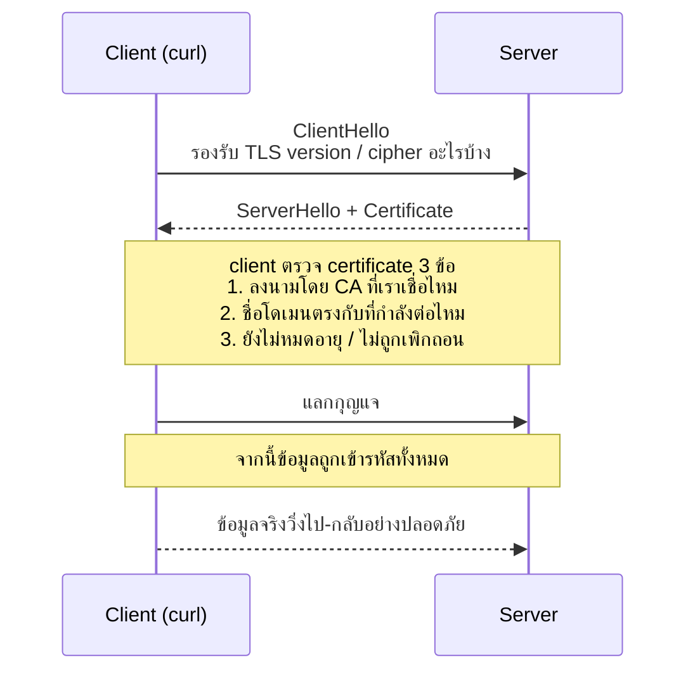
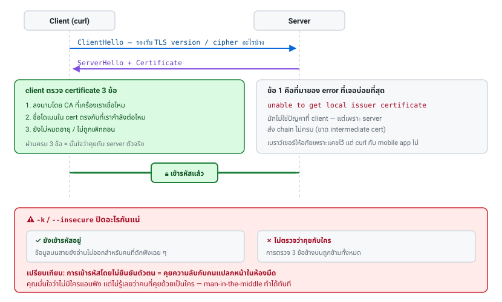

# บทที่ 7 · TLS และ HTTPS

> ถ้าคุณกำลังทำ API ให้ mobile app บทนี้ไม่ใช่ทางเลือก
> เพราะ token ทุกใบที่คุณออกจะเดินทางผ่านชั้นนี้

## 7.1 HTTPS ให้อะไรบ้าง (3 อย่าง)

| ให้อะไร | แปลว่า | ถ้าไม่มี |
|---------|--------|----------|
| **Confidentiality** | คนกลางอ่านไม่ได้ | password/token ถูกดักได้ตรง ๆ |
| **Integrity** | คนกลางแก้ไม่ได้ | ถูกยัด JS อันตรายเข้ามาได้ |
| **Authentication** | ยืนยันว่าคุยกับ server ตัวจริง | ถูกปลอมตัวเป็น server ได้ |

ข้อ 3 คือส่วนที่คนมองข้ามที่สุด และเป็นเหตุผลที่ certificate มีอยู่

## 7.2 Handshake โดยย่อ



TLS 1.3 (ปัจจุบัน) เร็วกว่า 1.2 เพราะ handshake ใช้ round-trip น้อยลง
**อย่าเปิด TLS 1.0/1.1 บน server ของคุณ** — มันถูกประกาศเลิกใช้แล้ว



## 7.3 ดู certificate ด้วย curl

```bash
curl -vI https://example.com 2>&1 | grep -E 'SSL|subject|issuer|expire|ALPN'
```

หรือดูละเอียดด้วย openssl:

```bash
openssl s_client -connect example.com:443 -servername example.com < /dev/null 2>/dev/null \
  | openssl x509 -noout -subject -issuer -dates -ext subjectAltName
```

`-servername` คือ **SNI** — บอกว่าจะขอ cert ของโดเมนไหน (เพราะ IP เดียวโฮสต์หลายเว็บได้)
ถ้าลืม จะได้ cert ผิดตัว

เช็ควันหมดอายุแบบเร็ว ๆ:

```bash
curl -sIv https://example.com 2>&1 | grep -i 'expire date'
```

## 7.4 `-k` / `--insecure` — เข้าใจให้ถูกว่ามันปิดอะไร

```bash
curl -k https://self-signed.example.com     # ข้ามการตรวจ cert
```

`-k` **ไม่ได้ปิดการเข้ารหัส** — ข้อมูลยังถูกเข้ารหัสอยู่
สิ่งที่มันปิดคือ **การตรวจว่าคุณคุยกับใคร** ซึ่งทำให้ man-in-the-middle ทำได้ทันที

> การเข้ารหัสโดยไม่ยืนยันตัวตน = คุยความลับกับคนแปลกหน้าในห้องมืด
> คุณมั่นใจว่าไม่มีใครแอบฟัง แต่ไม่รู้เลยว่าคนที่คุยด้วยเป็นใคร

**ที่ยอมรับได้:** ทดสอบบน localhost, dev environment ที่ใช้ self-signed cert
**ที่ยอมรับไม่ได้:** production, script ที่ส่ง credential, ฝังไว้ใน mobile app

วิธีที่ถูกต้องกว่าเมื่อเจอ cert ที่ระบบไม่รู้จัก — บอก curl ว่าให้เชื่อ CA ใบนี้:

```bash
curl --cacert /path/to/my-ca.pem https://internal.example.com
curl --capath /etc/ssl/certs https://example.com
```

## 7.5 error ที่เจอบ่อยและวิธีอ่าน

| ข้อความ | สาเหตุ | แก้ยังไง |
|---------|--------|----------|
| `certificate has expired` | cert หมดอายุ | ต่ออายุ cert (ตั้ง auto-renew) |
| `self-signed certificate` | ไม่ได้ออกโดย CA สาธารณะ | `--cacert` ใส่ CA ของคุณ |
| `unable to get local issuer certificate` | ขาด **intermediate cert** | server ต้องส่ง full chain ไม่ใช่แค่ leaf |
| `subject alternative name does not match` | โดเมนไม่ตรงกับใน cert | ออก cert ให้ตรงชื่อ / ตรวจ SNI |
| `SSL_ERROR_SYSCALL` / exit 35 | handshake ล้ม | version/cipher ไม่ตรงกัน หรือ firewall ตัด |

**`unable to get local issuer certificate` คือปัญหาอันดับหนึ่ง** และมักไม่ใช่ที่ client
แต่เป็นเพราะ server ตั้งค่าไม่ครบ — เบราว์เซอร์ให้อภัยเพราะมันเก็บ intermediate ไว้แล้ว
แต่ curl กับ mobile app ไม่ให้อภัย ทดสอบด้วย:

```bash
openssl s_client -connect example.com:443 -servername example.com -showcerts < /dev/null
```

ถ้าเห็น cert แค่ใบเดียว = ขาด chain

## 7.6 Certificate pinning (สำคัญกับ mobile)

ปกติ app เชื่อ CA ทุกใบที่ OS เชื่อ (มีเป็นร้อย) ถ้า CA ใดใบหนึ่งถูกเจาะ
หรือมีคนติดตั้ง CA ปลอมลงเครื่อง → ดัก traffic ของ app คุณได้

**Pinning** = app ยอมรับเฉพาะ cert/public key ที่กำหนดไว้ล่วงหน้าเท่านั้น

```bash
# curl ก็ pin ได้
curl --pinnedpubkey 'sha256//base64hash=' https://example.com

# หาค่า hash
openssl s_client -connect example.com:443 -servername example.com < /dev/null 2>/dev/null \
  | openssl x509 -pubkey -noout \
  | openssl pkey -pubin -outform der \
  | openssl dgst -sha256 -binary | base64
```

**ข้อควรระวังสำหรับ mobile app:**

- ✅ ควร pin ถ้าแอปจัดการข้อมูลอ่อนไหว (การเงิน, สุขภาพ)
- ⚠️ **pin ที่ public key ไม่ใช่ที่ cert** — cert เปลี่ยนทุกครั้งที่ต่ออายุ (Let's Encrypt = 90 วัน)
  แต่ public key คงเดิมได้ถ้าใช้ key เดิม
- ⚠️ **ต้องมี backup pin เสมอ** — ถ้า key เดียวแล้วต้องเปลี่ยนกะทันหัน แอปทุกเครื่องจะใช้ไม่ได้
  และแก้ได้ทางเดียวคือให้ผู้ใช้อัปเดตแอป
- ⚠️ pinning จะทำให้คุณ**ดัก traffic ตัวเองด้วย mitmproxy ไม่ได้** (บทที่ 19)
  ให้ทำ build variant สำหรับ debug ที่ปิด pinning

## 7.7 HSTS

```
Strict-Transport-Security: max-age=31536000; includeSubDomains
```

บอกเบราว์เซอร์ว่า "ต่อจากนี้ห้ามคุยกับฉันผ่าน HTTP อีกเลยเป็นเวลา 1 ปี"
กันการโจมตีแบบ downgrade (บังคับให้กลับไปใช้ HTTP)

**ตั้งบน API server ของคุณด้วย** และอย่าเปิด endpoint ที่รับ token บน HTTP เด็ดขาด

## 7.8 checklist สำหรับ API server ของคุณ

- [ ] TLS 1.2 ขั้นต่ำ (แนะนำ 1.3)
- [ ] ส่ง full certificate chain (leaf + intermediate)
- [ ] cert ต่ออายุอัตโนมัติ + มี alert ก่อนหมดอายุ 30 วัน
- [ ] เปิด HSTS
- [ ] redirect HTTP → HTTPS ทั้งหมด (หรือปิด port 80 ไปเลยสำหรับ API)
- [ ] ตรวจคะแนนที่ [SSL Labs](https://www.ssllabs.com/ssltest/) ให้ได้ A ขึ้นไป
- [ ] ไม่มี `-k` / `trustAllCerts` หลงเหลือในโค้ด production
- [ ] ถ้า pin: มี backup pin + มีแผนหมุน key

## แบบฝึกหัด

1. ดู certificate ของเว็บที่คุณใช้บ่อย ๆ ว่าออกโดย CA ไหน หมดอายุเมื่อไร
2. ยิง `curl -v https://expired.badssl.com` — error ว่าอะไร exit code เท่าไร
3. ลองเว็บทดสอบเหล่านี้แล้วเทียบ error กัน:
   `https://self-signed.badssl.com`, `https://wrong.host.badssl.com`,
   `https://untrusted-root.badssl.com`
4. หา public key pin ของเว็บหนึ่งด้วยคำสั่งในข้อ 7.6 แล้วลองใช้ `--pinnedpubkey`
   จากนั้นลองใส่ค่ามั่ว ๆ ดูว่า error ต่างกันอย่างไร
5. ตอบตัวเอง: ถ้าแอปคุณใช้ `-k` แล้วมีคนตั้ง Wi-Fi ปลอมในร้านกาแฟ จะเกิดอะไรขึ้น

***
[⬅ Encoding, ภาษาไทย และ base64](06-encoding-and-charset.md) · [สารบัญ](../README.md) · [JSON API และ jq ➡](08-json-api-and-jq.md)
