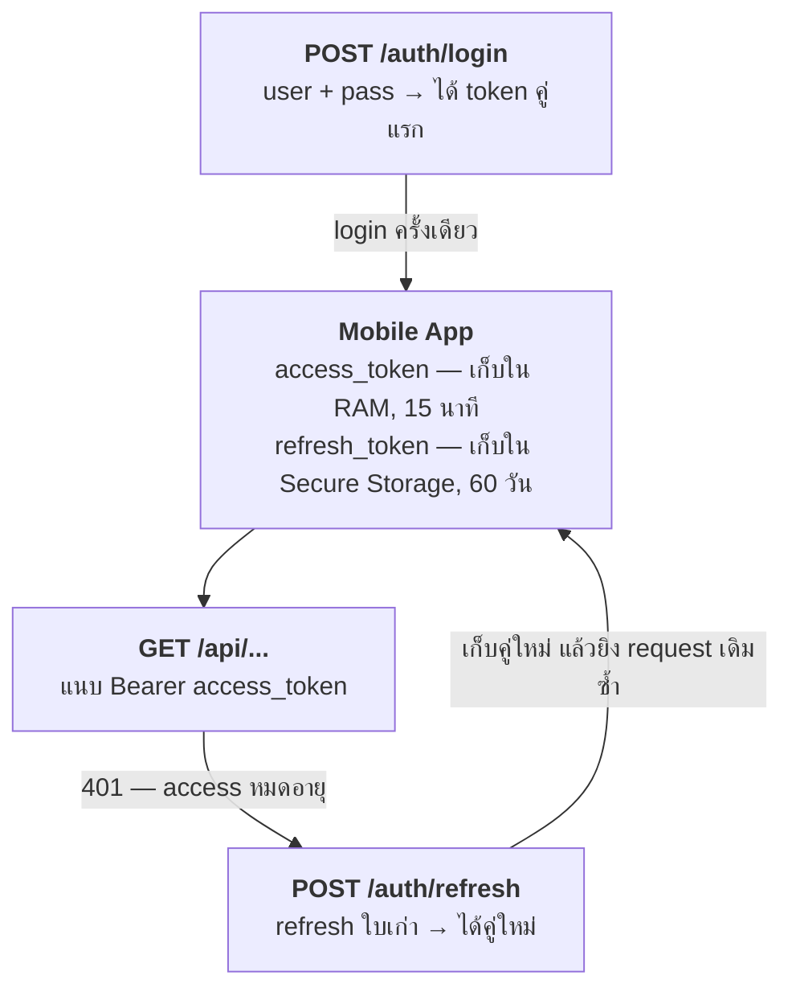
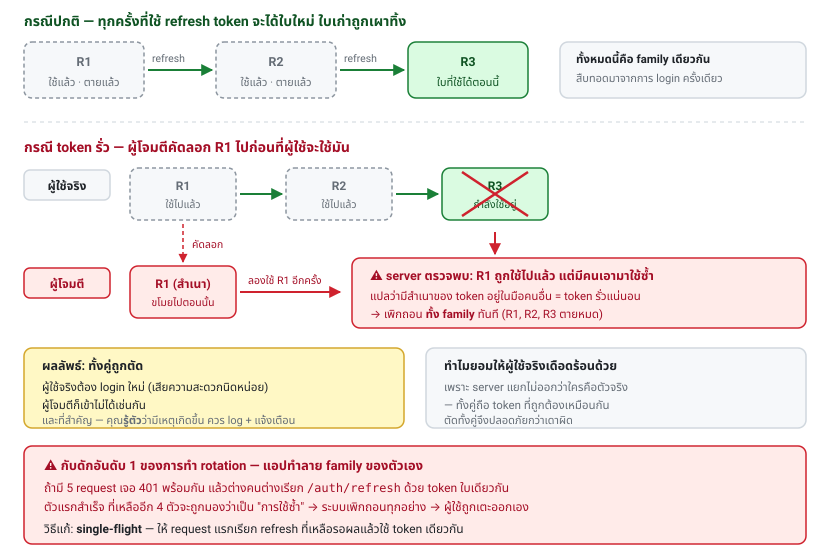
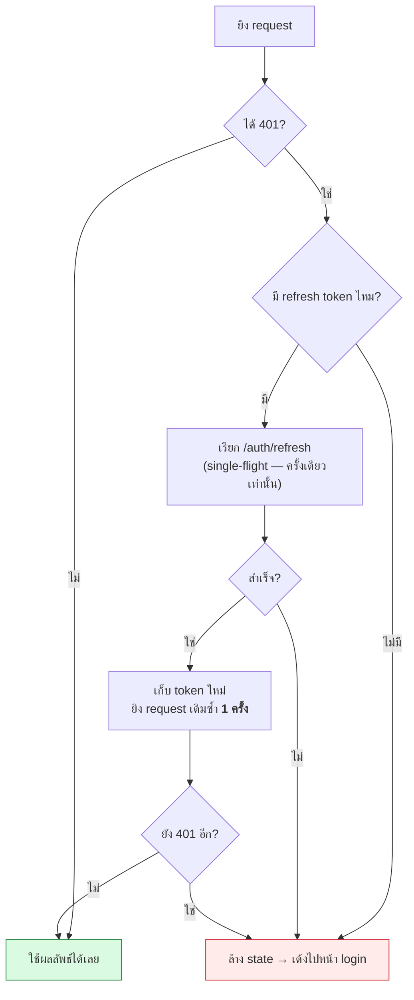

# บทที่ 11 · ออกแบบ Authentication ให้ Mobile API

> บทนี้ตอบคำถามตรง ๆ ว่า "จะทำ API ให้ mobile app เชื่อมต่ออย่างไรให้ดี
> และต้อง renew key อย่างไร"

## 11.1 ทำไม mobile ต่างจากเว็บ

| | เว็บ (เบราว์เซอร์) | Mobile app |
|---|-------------------|------------|
| เก็บ credential | cookie จัดการให้อัตโนมัติ | **คุณต้องเขียนเอง** |
| ผู้ใช้ login บ่อยแค่ไหน | ยอมรับได้ทุกวัน | ต้องอยู่ได้เป็นเดือน ไม่งั้นผู้ใช้เลิกใช้ |
| CSRF | ต้องกัน | ไม่มีปัญหา (ไม่มี cookie อัตโนมัติ) |
| เก็บความลับในตัว client | ไม่ได้เลย | ไม่ได้เช่นกัน (แกะ APK ได้) |
| อัปเดตโค้ด | รีเฟรชหน้าก็ได้เวอร์ชันใหม่ | **ผู้ใช้อาจไม่อัปเดตเป็นปี** |
| เครือข่าย | เสถียร | หลุด ๆ ติด ๆ สลับ Wi-Fi/4G |

สองข้อล่างสำคัญมากกับการออกแบบ: **API ของคุณต้องรองรับแอปเวอร์ชันเก่า**
และ **ต้องทนกับ request ที่ขาดกลางคัน**

## 11.2 สถาปัตยกรรมที่แนะนำ



**หลักการ 3 ข้อ:**

1. **access token อายุสั้น** (15 นาที) — ถ้ารั่ว ความเสียหายจำกัด ใช้ทุก request
2. **refresh token อายุยาว** (30-90 วัน) — ใช้เฉพาะตอนขอ access ใหม่ เก็บอย่างดี
3. **refresh token หมุนทุกครั้งที่ใช้ (rotation)** — ใบเก่าใช้ไม่ได้อีก

## 11.3 ทำไมต้องมีสองใบ

ถ้ามีใบเดียว คุณติดกับดัก:

- อายุสั้น → ผู้ใช้ต้อง login ใหม่ทุก 15 นาที (ไม่มีใครทน)
- อายุยาว → token รั่วแล้วผู้โจมตีใช้ได้เป็นเดือน

การแยกสองใบทำให้ได้ทั้งความปลอดภัยและความสะดวก:

| | access token | refresh token |
|---|-------------|---------------|
| ส่งบ่อยแค่ไหน | ทุก request | เฉลี่ยชั่วโมงละครั้ง |
| โอกาสรั่ว | สูง (ส่งบ่อย, ผ่าน log ได้) | ต่ำ |
| อายุ | 15 นาที | 30-90 วัน |
| เก็บที่ไหน | หน่วยความจำ (ไม่ต้องเขียนลง disk) | Keychain / Keystore |
| revoke ได้ | ไม่จำเป็น (หมดเองเร็ว) | **ต้องได้** |
| ส่งไป endpoint ไหน | ทุก endpoint | เฉพาะ `/auth/refresh` |

## 11.4 Refresh token rotation + reuse detection

นี่คือหัวใจของคำถาม "renew key อย่างไร"

### กฎ

1. ทุกครั้งที่ใช้ refresh token → ออก**คู่ใหม่ทั้งคู่** และ**เผาใบเก่าทิ้ง**
2. ถ้ามีคนเอาใบที่ใช้ไปแล้วมาใช้ซ้ำ → แปลว่ามีสำเนาหลุด → **เพิกถอนทั้งสาย (family)**

### ทำไมข้อ 2 ถึงจำเป็น

```
กรณีปกติ:
  R1 → (ใช้) → R2 → (ใช้) → R3 ...     ใบเก่าตายไปเรื่อย ๆ

กรณี token ถูกขโมย:
  ผู้ใช้จริง:   R1 → R2 → R3
  ผู้โจมตี:     R1 (สำเนา) → ✗ ตรวจพบว่า R1 ถูกใช้ไปแล้ว!
                            → เพิกถอนทั้ง family (R1,R2,R3 ตายหมด)
                            → ทั้งคู่ต้อง login ใหม่
```

ถ้าผู้โจมตีใช้ก่อน ผู้ใช้จริงจะเป็นคนไปชนกำแพงแทน — ผลลัพธ์เดียวกันคือ
**ถูกตัดทั้งคู่ และคุณรู้ตัวว่ามีเหตุ** (ควร log + แจ้งเตือนผู้ใช้)

ทางเลือกที่นุ่มกว่า: ยอมให้ใช้ใบเก่าได้ภายใน grace period 10-30 วินาที
(เพราะบางทีเน็ตหลุดตอน response ขากลับ แอปเลยไม่ได้ใบใหม่)
ปกติทำโดย: ตอบใบใหม่ใบเดิมซ้ำ ไม่ใช่ออกใบใหม่อีกใบ



### ลองของจริงใน lab

```bash
B=http://127.0.0.1:8080

# login
P=$(curl -s --json '{"username":"myuser","password":"mypass"}' $B/api/token)
R1=$(echo "$P" | jq -r .refresh_token)

# refresh → ได้คู่ใหม่
P2=$(curl -s --json "$(jq -nc --arg r "$R1" '{refresh_token:$r}')" $B/api/refresh)
R2=$(echo "$P2" | jq -r .refresh_token)
echo "R2 = ${R2:0:12}..."

# ผู้โจมตีเอา R1 มาใช้ซ้ำ
curl -s --json "$(jq -nc --arg r "$R1" '{refresh_token:$r}')" $B/api/refresh | jq -r .detail

# R2 ก็ตายไปด้วย
curl -s --json "$(jq -nc --arg r "$R2" '{refresh_token:$r}')" $B/api/refresh | jq -r .detail
```

โค้ดฝั่ง server อยู่ที่ `post_refresh` ใน [lab/server.py](../lab/server.py) ลองอ่านประกอบ

## 11.5 เก็บ token บนเครื่องผู้ใช้ยังไง

| ที่เก็บ | Android | iOS | ปลอดภัยไหม |
|---------|---------|-----|------------|
| **ที่ควรใช้** | EncryptedSharedPreferences / Keystore | Keychain (`kSecAttrAccessibleAfterFirstUnlock`) | ✅ |
| SharedPreferences / UserDefaults ธรรมดา | ❌ | ❌ | อ่านได้ถ้าเครื่อง root/jailbreak |
| ไฟล์ธรรมดาใน app storage | ❌ | ❌ | เหมือนกัน |
| SQLite ไม่เข้ารหัส | ❌ | ❌ | เหมือนกัน |
| ฝังใน source code | ❌❌❌ | ❌❌❌ | แกะ APK ได้ใน 30 วินาที |

Cross-platform:

- **Flutter**: `flutter_secure_storage`
- **React Native**: `react-native-keychain` หรือ `expo-secure-store`

**access token ไม่ต้องเขียนลง disk เลย** — เก็บใน memory พอ
แอปถูกปิดก็ขอใหม่จาก refresh token ได้

**ถ้าต้องการความปลอดภัยระดับสูง**: ผูก refresh token กับ biometric
(ต้องสแกนนิ้ว/หน้าก่อนถึงจะอ่าน key ออกจาก Keystore ได้)

## 11.6 การจัดการ 401 ในฝั่งแอป (interceptor pattern)



**สามกับดักที่ต้องระวัง:**

1. **วนไม่รู้จบ** — ต้องยิงซ้ำได้แค่ **ครั้งเดียว** ต่อ request ใส่ flag กันไว้
   ถ้ายิงซ้ำแล้วยัง 401 อีก = ให้ล้มเลย อย่าวน
2. **refresh ซ้อนกัน** — ถ้ามี 5 request เจอ 401 พร้อมกัน จะเรียก refresh 5 ครั้ง
   ซึ่งกับ rotation = **ทำลาย family ตัวเอง** ต้องมี **mutex/single-flight**:
   request แรกเรียก refresh ที่เหลือรอผลแล้วใช้ token เดียวกัน
   > นี่คือบั๊กอันดับหนึ่งที่คนทำ refresh rotation เจอ
3. **แยก 401 กับ 403** — 403 ห้าม refresh (บทที่ 9)

**Proactive refresh** (ดีกว่ารอ 401): ถ้า access token เหลืออายุ < 60 วินาที
ให้ refresh ก่อนยิง ลดโอกาสเจอ 401 กลางคัน

## 11.7 Endpoint ที่ควรมี

| Endpoint | ทำอะไร | หมายเหตุ |
|----------|--------|----------|
| `POST /auth/register` | สมัคร | rate limit หนัก + ยืนยันอีเมล |
| `POST /auth/login` | user/pass → token คู่ | rate limit ตาม IP **และ** ตาม username |
| `POST /auth/refresh` | หมุน token | ไม่ต้องใช้ access token |
| `POST /auth/logout` | เพิกถอน refresh ใบปัจจุบัน | |
| `POST /auth/logout-all` | เพิกถอนทุก family ของ user | "ออกจากระบบทุกอุปกรณ์" |
| `GET /auth/sessions` | ดูอุปกรณ์ที่ login อยู่ | ชื่อเครื่อง, IP, เวลาล่าสุด |
| `DELETE /auth/sessions/{id}` | เตะอุปกรณ์ตัวเดียวออก | |
| `POST /auth/password/forgot` | ขอลิงก์ตั้งรหัสใหม่ | **ตอบเหมือนกันเสมอ** ไม่ว่ามีอีเมลนั้นไหม |
| `POST /auth/password/reset` | ตั้งรหัสใหม่ | ต้อง **logout-all** หลังเปลี่ยนรหัส |
| `GET /me` | ข้อมูลผู้ใช้ปัจจุบัน | ให้แอปเช็คว่า token ใช้ได้ไหม |

## 11.8 เก็บ password ยังไง

**ห้ามเก็บ password ตรง ๆ และห้ามใช้ MD5/SHA1/SHA256 เปล่า ๆ**
(SHA256 เร็วเกินไป — GPU ลองได้พันล้านครั้งต่อวินาที)

ใช้ algorithm ที่ออกแบบมาให้ช้าโดยเจตนา:

| algorithm | ตั้งค่าแนะนำ | หมายเหตุ |
|-----------|--------------|----------|
| **Argon2id** | m=19MB, t=2, p=1 | ✅ ตัวเลือกที่ดีที่สุดตอนนี้ |
| **bcrypt** | cost 12 | ✅ ใช้ได้ดี แพร่หลาย (จำกัด 72 byte) |
| **scrypt** | N=2^17, r=8, p=1 | ✅ ใช้ได้ |
| PBKDF2-SHA256 | 600,000 รอบ | ⚠️ ใช้เมื่อต้องการ FIPS |

```python
# ตัวอย่าง: argon2-cffi
from argon2 import PasswordHasher
ph = PasswordHasher()
hashed = ph.hash(password)          # เก็บค่านี้ลง DB (มี salt ในตัวแล้ว)
ph.verify(hashed, password_input)   # ตรวจ - โยน exception ถ้าไม่ตรง
```

ข้ออื่นที่ควรทำ:

- ตรวจ password กับรายการที่รั่วแล้ว ([Have I Been Pwned API](https://haveibeenpwned.com/API/v3#PwnedPasswords) ใช้ k-anonymity ปลอดภัย)
- **ความยาวขั้นต่ำ 8-12 ตัว สำคัญกว่ากฎ "ต้องมีอักขระพิเศษ"** (ตาม NIST SP 800-63B)
- อย่าจำกัดความยาวสูงสุดต่ำกว่า 64 ตัว
- อย่าห้าม paste (ทำให้คนใช้ password manager ไม่ได้)

## 11.9 Rate limiting สำหรับ endpoint auth

จุดที่ต้องจำกัดหนักที่สุด:

| Endpoint | จำกัดอย่างไร |
|----------|--------------|
| `/auth/login` | ตาม IP **และ** ตาม username แยกกัน + หน่วงเวลาเพิ่มขึ้นเรื่อย ๆ |
| `/auth/refresh` | ตาม user (ปกติไม่ควรถี่กว่านาทีละครั้ง) |
| `/auth/password/forgot` | ตามอีเมล (กันสแปมเมล) |
| `/auth/register` | ตาม IP หนัก ๆ |

**ทำไมต้องจำกัดตาม username ด้วย**: ถ้าจำกัดแค่ IP ผู้โจมตีที่มี IP หลายพันตัว
(botnet, residential proxy) จะเดารหัสของ user คนเดียวได้เรื่อย ๆ
กลับกัน ถ้าจำกัดแค่ username ผู้โจมตีจะ lock บัญชีคนอื่นเล่นได้ (DoS)

ตอบด้วย `429` + `Retry-After` เสมอ (บทที่ 12)

## 11.10 กติกาสำคัญอื่น ๆ

**ตอบ error เท่ากันเสมอ**

```json
// login ผิด - ตอบแบบนี้ทั้งกรณี user ไม่มี และ password ผิด
{"error": "invalid_credentials", "message": "อีเมลหรือรหัสผ่านไม่ถูกต้อง"}
```

ถ้าแยกกัน ("ไม่พบอีเมลนี้" vs "รหัสผ่านผิด") ผู้โจมตีจะ**ไล่หาว่าอีเมลไหนมีในระบบ**
(user enumeration) แล้วเอาไปใช้ต่อ เวลาตอบก็ควรใกล้เคียงกันด้วย
(ถ้าไม่พบ user ก็ยัง hash ทิ้งเปล่า ๆ หนึ่งครั้งเพื่อให้เวลาเท่ากัน)

**Device binding** — ผูก refresh token กับอุปกรณ์

```json
{"device_id": "uuid-ของเครื่อง", "device_name": "Pixel 7", "platform": "android"}
```

ช่วยให้ทำหน้า "อุปกรณ์ที่ login อยู่" ได้ และตรวจจับความผิดปกติได้
(refresh token ของ Pixel 7 จู่ ๆ มาจากอีกประเทศ)

**Minimum version enforcement**

```json
// เมื่อแอปเวอร์ชันเก่าเกินไป
HTTP 426 Upgrade Required
{"error": "app_update_required", "min_version": "2.0.0", "store_url": "..."}
```

จำเป็นเพราะคุณบังคับให้ผู้ใช้อัปเดตแอปไม่ได้ ต้องมีทางบอกแอปเก่าให้หยุดทำงาน

**2FA / OTP** — ถ้าจะทำ:

- TOTP (Google Authenticator) ดีกว่า SMS มาก (SIM swap เป็นเรื่องจริง)
- ให้ recovery code สำรอง 8-10 ชุด
- ตอน login สำเร็จขั้นแรก ให้ token ชั่วคราวที่ใช้ได้แค่ endpoint ยืนยัน OTP เท่านั้น

## 11.11 Checklist ก่อนขึ้น production

**Transport & storage**
- [ ] HTTPS ทุก endpoint + HSTS (บทที่ 7)
- [ ] token เก็บใน Keychain/Keystore ไม่ใช่ SharedPreferences
- [ ] ไม่มี secret ฝังใน APK/IPA

**Token**
- [ ] access token ≤ 15 นาที
- [ ] refresh token rotation + reuse detection
- [ ] revoke ทำงานจริง (ทดสอบด้วยการ logout แล้วยิงซ้ำ)
- [ ] logout-all ทำงาน และถูกเรียกอัตโนมัติเมื่อเปลี่ยนรหัสผ่าน
- [ ] token สร้างด้วย CSPRNG (`secrets` ไม่ใช่ `random`)

**Password**
- [ ] Argon2id / bcrypt cost 12+
- [ ] ตอบ error เหมือนกันทุกกรณี login ล้มเหลว
- [ ] เวลาตอบใกล้เคียงกันไม่ว่าจะมี user นั้นหรือไม่

**การป้องกัน**
- [ ] rate limit ที่ login/refresh/forgot ทั้งตาม IP และตาม account
- [ ] ตอบ 429 + `Retry-After`
- [ ] log ทุกเหตุการณ์ auth (login สำเร็จ/ล้มเหลว, refresh, reuse detected)
      โดย **ไม่ log ตัว token หรือ password**

**ฝั่งแอป**
- [ ] interceptor ยิงซ้ำได้ครั้งเดียว
- [ ] single-flight ป้องกัน refresh ซ้อน
- [ ] แยก 401 (refresh) กับ 403 (ไม่ refresh)
- [ ] มีทางรับมือ 426 app_update_required

## แบบฝึกหัด

1. รัน flow ในข้อ 11.4 ให้เห็น reuse detection ทำงานด้วยตาตัวเอง
2. อ่าน `issue_token_pair` และ `post_refresh` ใน [lab/server.py](../lab/server.py)
   แล้วอธิบายว่า `family` ถูกใช้ทำอะไร
3. เพิ่ม endpoint `POST /api/logout` ใน lab ที่ลบ refresh token ใบปัจจุบัน
4. เพิ่ม `POST /api/logout-all` ที่ลบทุก token ของ user นั้น
5. เพิ่ม grace period 10 วินาที: ถ้าใช้ refresh ใบเก่าซ้ำภายใน 10 วินาที
   ให้ตอบคู่เดิมกลับไปแทนที่จะเพิกถอน family
6. วาดผังลำดับ (sequence diagram) ของ interceptor ที่จัดการ 401 พร้อม single-flight

***
[⬅ JWT เจาะลึก](10-jwt-deep-dive.md) · [สารบัญ](../README.md) · [API Design ที่ดี ➡](12-api-design-practices.md)
