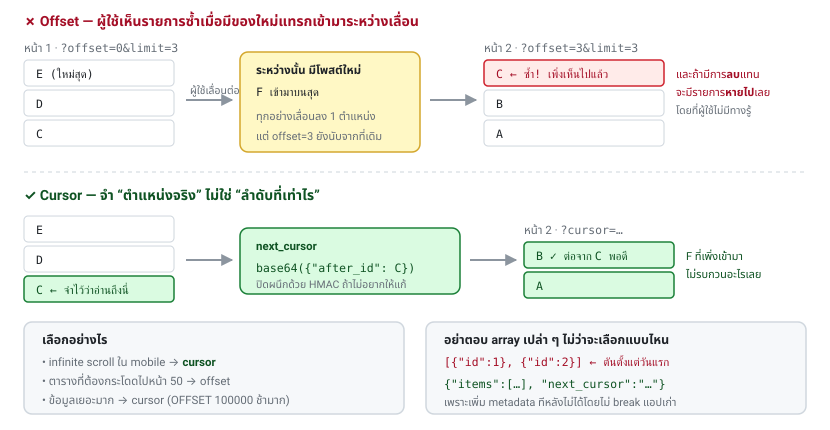
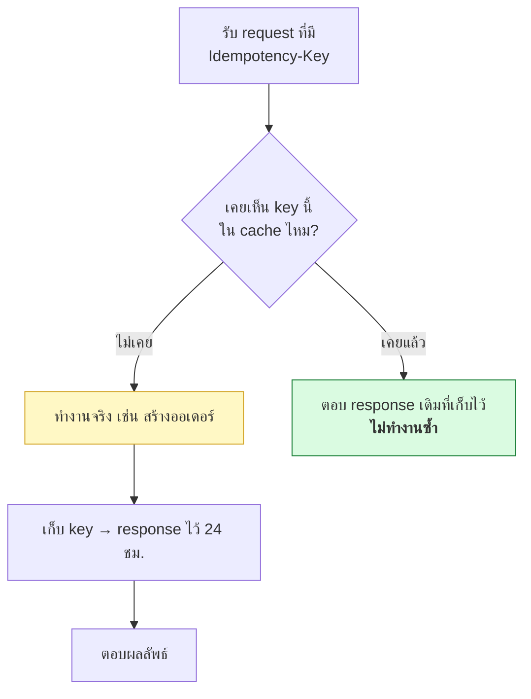

# บทที่ 12 · API Design ที่ดี

> เรื่องที่ต้องตัดสินใจตอนออกแบบ API ให้ mobile app
> ตัดสินใจผิดตอนต้น แก้ทีหลังยากมาก เพราะแอปเก่ายังอยู่ในมือผู้ใช้

## 12.1 Versioning {#s12-1}

แอปเวอร์ชันเก่าจะอยู่กับคุณไปอีกนาน **ต้องมี version ตั้งแต่วันแรก**

| วิธี | ตัวอย่าง | ความเห็น |
|------|----------|----------|
| ใน path | `/v1/users` | ✅ ง่ายที่สุด เห็นชัด ใช้กันมากสุด |
| ใน header | `Accept: application/vnd.myapp.v1+json` | ถูกหลักกว่า แต่ debug ยากกว่า |
| ใน query | `?version=1` | ❌ หลีกเลี่ยง |

**แนะนำ: `/v1/` ใน path** เพราะ `curl` ทดสอบง่าย ดู log ง่าย และคนอ่านเข้าใจทันที

### อะไรคือ breaking change

| ✅ เพิ่มได้ ไม่ต้องขึ้น version | ❌ ต้องขึ้น version ใหม่ |
|--------------------------------|--------------------------|
| เพิ่ม field ใหม่ใน response | ลบ/เปลี่ยนชื่อ field |
| เพิ่ม endpoint ใหม่ | เปลี่ยนชนิดข้อมูล (`"1"` → `1`) |
| เพิ่ม optional field ใน request | ทำให้ field ที่เคย optional เป็น required |
| เพิ่มค่า enum ใหม่* | เปลี่ยนความหมายของ field เดิม |

\* ถ้า client เขียนแบบไม่รองรับค่าที่ไม่รู้จัก การเพิ่ม enum ก็เป็น breaking change
ให้เอกสารบอกไว้ว่า client ต้อง handle ค่าที่ไม่รู้จักอย่างสุภาพ

**กฎทอง: client ต้องเพิกเฉยต่อ field ที่ไม่รู้จัก** เขียนไว้ในเอกสารและบังคับใน code review

## 12.2 รูปแบบ URL {#s12-2}

```
GET    /v1/books           รายการ
POST   /v1/books           สร้าง
GET    /v1/books/42        อ่านตัวเดียว
PATCH  /v1/books/42        แก้บางส่วน
PUT    /v1/books/42        แทนที่ทั้งก้อน
DELETE /v1/books/42        ลบ
GET    /v1/books/42/reviews  ทรัพยากรลูก
```

- ใช้**คำนามพหูพจน์** (`/books` ไม่ใช่ `/book` หรือ `/getBooks`)
- ใช้ `kebab-case` ใน path (`/order-items`), `snake_case` หรือ `camelCase` ใน JSON
  — **เลือกอย่างใดอย่างหนึ่งแล้วใช้ให้เหมือนกันทั้งระบบ**
- action ที่ไม่ใช่ CRUD ยอมให้ใช้กริยาได้: `POST /v1/orders/42/cancel`

## 12.3 Pagination {#s12-3}

**อย่าตอบ array เปล่า ๆ** เพราะเพิ่ม metadata ทีหลังไม่ได้โดยไม่ break

```json
// ❌ ตันตั้งแต่วันแรก
[{"id":1}, {"id":2}]

// ✅ ขยายได้
{"items": [...], "next_cursor": "eyJpZCI6NDJ9", "has_more": true}
```



### offset vs cursor

| | Offset (`?page=2&limit=20`) | Cursor (`?cursor=xxx&limit=20`) |
|---|---------------------------|--------------------------------|
| เข้าใจง่าย | ✅ | ⚠️ |
| กระโดดไปหน้า 50 | ✅ | ❌ |
| ข้อมูลซ้ำ/หายเมื่อมีของใหม่แทรก | ❌ **มีปัญหา** | ✅ ไม่มี |
| เร็วเมื่อข้อมูลเยอะ | ❌ `OFFSET 100000` ช้ามาก | ✅ |

**สำหรับ mobile app ที่เป็น infinite scroll → ใช้ cursor**
เพราะ offset จะทำให้ผู้ใช้เห็นรายการซ้ำเวลามีโพสต์ใหม่เข้ามาระหว่างเลื่อน

```
GET /v1/books?limit=20
→ {"items": [...], "next_cursor": "eyJpZCI6NDJ9"}

GET /v1/books?limit=20&cursor=eyJpZCI6NDJ9
→ {"items": [...], "next_cursor": null}     ← null = หมดแล้ว
```

cursor คือ base64 ของตำแหน่งล่าสุด (เช่น `{"id":42,"created_at":"..."}`)
**ปิดผนึกด้วย HMAC ถ้าไม่อยากให้ client เดา/แก้** (ดู[บทที่ 13](13-webhooks-and-hmac.md))

## 12.4 Idempotency — สำคัญมากกับ mobile {#s12-4}

มือถือเน็ตหลุดบ่อย สถานการณ์นี้เกิดขึ้นจริงทุกวัน:

```
แอป → POST /orders → server สร้างออเดอร์สำเร็จ → response หายกลางทาง
แอป → timeout → ลองใหม่ → POST /orders → ออเดอร์ที่สอง 😱
```

**ทางแก้: Idempotency-Key**

```bash
curl -X POST https://api.myapp.com/v1/orders \
     -H 'Idempotency-Key: 550e8400-e29b-41d4-a716-446655440000' \
     -H 'Authorization: Bearer xxx' \
     --json '{"item_id": 42, "qty": 1}'
```

ฝั่ง server:



- key สร้างโดย **client** (UUID v4) และต้องเป็นตัวเดิมตอน retry
- เก็บทั้ง status และ body ที่ตอบไป
- ถ้ามี key เดิมแต่ body ต่างจากเดิม → ตอบ `422` เพราะเป็นการใช้ key ผิด
- ใช้กับ `POST` เท่านั้นที่จำเป็น (`GET`/`PUT`/`DELETE` idempotent อยู่แล้วโดยธรรมชาติ)

Stripe, Square และ payment API แทบทุกเจ้าทำแบบนี้ — ลอกมาได้เลย

## 12.5 Rate limiting {#s12-5}

ตอบ `429` พร้อม header ที่บอกสถานะให้ client รู้ตัว:

```http
HTTP/1.1 429 Too Many Requests
Retry-After: 30
RateLimit-Limit: 100
RateLimit-Remaining: 0
RateLimit-Reset: 1735689600
```

`Retry-After` สำคัญที่สุด — เป็นตัวเลขวินาที บอกให้ client รอ
**client ที่ดีต้องเคารพค่านี้** ไม่ใช่ยิงรัวต่อ

### อัลกอริทึม

| แบบ | ทำงานยังไง | เหมาะกับ |
|-----|-----------|---------|
| Fixed window | นับต่อนาที รีเซ็ตทุกนาที | ง่าย แต่มีปัญหา burst ตรงรอยต่อ |
| Sliding window | นับย้อนหลัง 60 วินาทีจากตอนนี้ | ✅ แม่นกว่า |
| **Token bucket** | มีถังโทเคน เติมเรื่อย ๆ ใช้ทีละใบ | ✅ ยอมให้ burst ได้บ้าง — เหมาะกับ mobile |

**ควรจำกัดหลายชั้น:** ต่อ IP, ต่อ user, ต่อ endpoint, ต่อ API key
และให้ endpoint ที่แพง (ค้นหา, ส่งอีเมล) มีโควตาแยก

### ฝั่ง client: exponential backoff + jitter

```bash
delay = min(base * 2^attempt, max_delay) + random(0, jitter)
#         1s, 2s, 4s, 8s, 16s ...        + สุ่มเล็กน้อย
```

**jitter จำเป็น** ไม่งั้นเมื่อ server ล่มแล้วฟื้น ทุกเครื่องจะยิงพร้อมกันเป๊ะ ๆ
แล้วล่มซ้ำ (thundering herd)

## 12.6 CORS — เกี่ยวกับเว็บ ไม่เกี่ยวกับ mobile {#s12-6}

**CORS ไม่ใช่ระบบความปลอดภัยของ server** — มันคือกฎที่**เบราว์เซอร์**บังคับตัวเอง

- native mobile app **ไม่สนใจ CORS เลย** (ไม่มีเบราว์เซอร์มาบังคับ)
- `curl` ก็ไม่สนใจ
- ดังนั้น **อย่าคิดว่า CORS ป้องกันใครได้** — คนที่ตั้งใจร้ายใช้ curl ยิงตรงได้เสมอ

จะเจอ CORS เมื่อมีหน้าเว็บ/admin panel เรียก API คุณ:

```http
Access-Control-Allow-Origin: https://app.myapp.com
Access-Control-Allow-Methods: GET, POST, PATCH, DELETE
Access-Control-Allow-Headers: Authorization, Content-Type, Idempotency-Key
Access-Control-Max-Age: 86400
```

**ห้ามใช้ `Access-Control-Allow-Origin: *` คู่กับ `Allow-Credentials: true`**
(เบราว์เซอร์ปฏิเสธอยู่แล้ว แต่คนพยายามทำบ่อย) ให้ระบุ origin ที่อนุญาตเป็นรายการชัดเจน

**Preflight**: เบราว์เซอร์ยิง `OPTIONS` ไปถามก่อนถ้า request "ไม่ธรรมดา"
(มี custom header เช่น `Authorization`) — server ต้องตอบ `OPTIONS` ให้ถูก
ไม่งั้นเว็บเรียกไม่ได้เลย ใช้ `Access-Control-Max-Age` ลดจำนวน preflight

## 12.7 รูปแบบ response ที่คงเส้นคงวา {#s12-7}

เลือกรูปแบบเดียวแล้วใช้ทั้งระบบ:

```json
// สำเร็จ
{"data": {...}}
{"items": [...], "next_cursor": "..."}

// ล้มเหลว — โครงเดียวกันเสมอ ทุก status code
{"error": "not_found", "message": "ไม่พบหนังสือเล่มนี้", "request_id": "req_xxx"}
```

**สิ่งที่ห้ามทำ:**

- ❌ ตอบ HTML error page ให้ API (แอปจะ parse ไม่ได้แล้ว crash)
  — ตรวจให้ดีว่า error 500 ของ framework/nginx ก็ตอบ JSON
- ❌ ตอบ `200 OK` แล้วใส่ `{"success": false}` ข้างใน
  (client ต้องเช็คสองที่ และ HTTP tooling ทั้งหมดจะเข้าใจผิด)
- ❌ เปลี่ยนโครงสร้าง error ตาม endpoint

## 12.8 Observability {#s12-8}

**`request_id` คือของขวัญที่ให้ตัวเองในอนาคต**

```
Client ส่ง:   X-Request-ID: <uuid>   (หรือ server สร้างให้ถ้าไม่มี)
Server ตอบ:   X-Request-ID: <uuid เดิม>
Server log:   {"request_id": "...", "user_id": ..., "path": ..., "status": ..., "ms": ...}
```

ผู้ใช้แจ้งปัญหามาพร้อม request_id → คุณค้น log เจอทันทีว่าเกิดอะไรขึ้น

**สิ่งที่ห้ามเข้า log เด็ดขาด:** password, token (access/refresh), API key,
`Authorization` header, เลขบัตร, ข้อมูลส่วนบุคคลที่ไม่จำเป็น
— ให้ mask เหลือ 4 ตัวท้ายหรือแทนด้วย `[redacted]`

ควรมี `GET /health` ที่ไม่ต้อง auth สำหรับ load balancer ด้วย

## 12.9 เรื่องอื่นที่ควรคิดถึง {#s12-9}

| เรื่อง | สรุปสั้น ๆ |
|-------|-----------|
| **Timezone** | เก็บและส่ง UTC เป็น ISO 8601 (`2026-08-26T14:30:00Z`) ให้ client แปลงเอง |
| **Money** | ห้ามใช้ float — ใช้ integer หน่วยสตางค์ (`{"amount": 12550, "currency": "THB"}`) |
| **ID** | UUID/ULID ดีกว่า auto-increment (ไม่เปิดเผยจำนวนลูกค้า เดาไม่ได้) |
| **Soft delete** | ใส่ `deleted_at` แทนการลบจริง ให้กู้คืนได้ |
| **Compression** | เปิด gzip/brotli — ประหยัดเน็ตผู้ใช้มือถือมาก |
| **Payload size** | อย่าส่ง field ที่แอปไม่ใช้ ทุก byte คือค่าเน็ตของผู้ใช้ |
| **Partial response** | `?fields=id,title` ให้แอปเลือกได้ว่าจะเอาอะไร |
| **ETag / 304** | ประหยัด bandwidth มากสำหรับข้อมูลที่ไม่ค่อยเปลี่ยน |
| **Push notification** | อย่าส่งข้อมูลอ่อนไหวใน payload ของ push |
| **เอกสาร** | OpenAPI (Swagger) — generate client SDK ได้ฟรี |

## แบบฝึกหัด

1. เพิ่ม `?limit=` และ `?cursor=` ให้ `/api/books` ใน [lab/server.py](../lab/server.py)
   โดย cursor เป็น base64 ของ `{"after_id": N}`
2. เพิ่ม rate limit ง่าย ๆ ให้ `/api/token`: เกิน 5 ครั้งต่อนาทีต่อ IP → ตอบ 429 + `Retry-After`
3. เพิ่มการรองรับ `Idempotency-Key` ให้ endpoint POST สักตัว แล้วทดสอบว่า
   ยิงซ้ำด้วย key เดิมได้ผลเหมือนเดิมโดยไม่ทำงานซ้ำ
4. เพิ่ม `X-Request-ID` ทั้งใน response และใน log ของ lab server
5. เขียน bash function ที่ทำ exponential backoff + jitter แล้วทดสอบกับ 429
6. ออกแบบ error code ทั้งหมดของ API คุณเป็นตาราง (`error` → HTTP status → ความหมาย)

***
[⬅ ออกแบบ Authentication ให้ Mobile API](11-mobile-api-auth-design.md) · [สารบัญ](../README.md) · [Webhook และ HMAC Signature ➡](13-webhooks-and-hmac.md)
