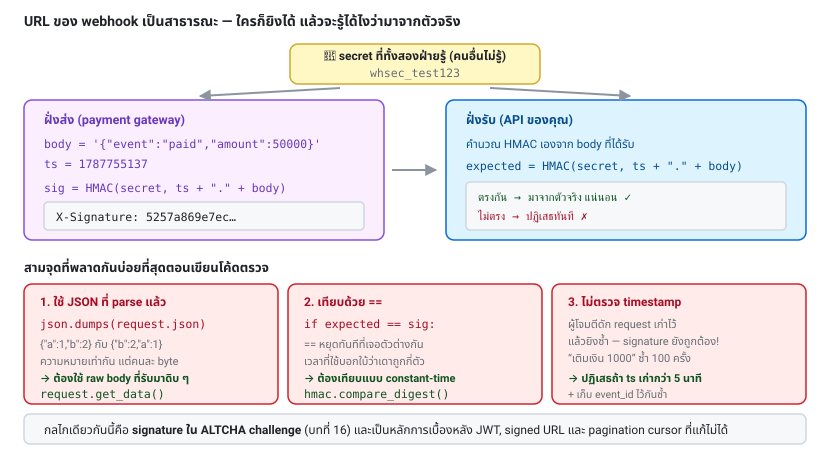

# บทที่ 13 · Webhook และ HMAC Signature

> บทนี้เชื่อมสองเรื่องเข้าด้วยกัน: การรับ callback จากระบบอื่น (เช่น payment gateway)
> และ **signature ใน ALTCHA challenge** ที่คุณจะเจอใน[บทที่ 16](16-altcha-pow.md) — มันคือกลไกเดียวกัน

## 13.1 Webhook คืออะไร {#s13-1}

แทนที่คุณจะถามซ้ำ ๆ ว่า "จ่ายเงินสำเร็จหรือยัง" ให้เขายิงมาบอกเมื่อเกิดเหตุ

```
Polling (สิ้นเปลือง)              Webhook (ดีกว่า)
  คุณ → มีอะไรใหม่ไหม? → ไม่มี      เขา → POST /webhooks/payment → คุณ
  คุณ → มีอะไรใหม่ไหม? → ไม่มี           (เฉพาะตอนมีเหตุจริง)
  คุณ → มีอะไรใหม่ไหม? → มี!
```

**ปัญหาคือ: จะรู้ได้ยังไงว่า request ที่เข้ามาที่ `/webhooks/payment` มาจากเขาจริง**

URL ของคุณเป็นสาธารณะ ใครก็ยิงได้ ถ้าเชื่อทุกอย่างที่เข้ามา ก็จะมีคนยิง
`{"status":"paid","amount":1000000}` มาให้คุณ

## 13.2 HMAC คืออะไร {#s13-2}

**HMAC = Hash-based Message Authentication Code**
ลายเซ็นที่คำนวณจาก (ข้อความ + กุญแจลับที่ทั้งสองฝ่ายรู้)

```
signature = HMAC-SHA256(secret_key, message)
```

คุณสมบัติ:

- ใครไม่มี `secret_key` **สร้าง signature ที่ถูกต้องไม่ได้**
- ถ้า message ถูกแก้แม้แต่ byte เดียว signature จะเปลี่ยนทั้งหมด
- **เป็นทางเดียว** — ถอด message กลับจาก signature ไม่ได้

**HMAC ต่างจาก hash เปล่า ๆ ยังไง**: `sha256(message)` ใครก็คำนวณได้
แต่ `HMAC(key, message)` ต้องมี key
(และ HMAC ยังกันการโจมตีแบบ length-extension ที่ `sha256(key + message)` มีปัญหาด้วย)

## 13.3 ตรวจ signature ของ webhook ที่รับเข้ามา {#s13-3}

```python
import hmac, hashlib, time

def verify_webhook(raw_body: bytes, header_sig: str, header_ts: str, secret: bytes) -> bool:
    # 1. กัน replay: timestamp ต้องไม่เก่าเกิน 5 นาที
    if abs(time.time() - int(header_ts)) > 300:
        return False

    # 2. คำนวณ signature จาก timestamp + body ดิบ
    signed_payload = f"{header_ts}.".encode() + raw_body
    expected = hmac.new(secret, signed_payload, hashlib.sha256).hexdigest()

    # 3. เทียบแบบ constant-time
    return hmac.compare_digest(expected, header_sig)
```

**สามจุดที่พลาดกันบ่อยที่สุด:**

### จุดที่ 1: ต้องใช้ raw body ไม่ใช่ JSON ที่ parse แล้ว

```python
# ❌ ผิด — parse แล้ว serialize ใหม่ ได้ byte ไม่เหมือนเดิม
body = json.dumps(request.json)

# ✅ ถูก — ใช้ byte ดิบที่รับมาตรง ๆ
body = request.get_data()
```

`{"a":1,"b":2}` กับ `{"b": 2, "a": 1}` มีความหมายเท่ากันใน JSON
แต่เป็นคนละ byte → คนละ signature

ใน framework ส่วนใหญ่ต้องตั้งค่าพิเศษเพื่อเก็บ raw body ไว้ก่อน parse

### จุดที่ 2: ต้องเทียบแบบ constant-time

```python
if expected == header_sig:            # ❌ timing attack ได้
if hmac.compare_digest(expected, s):  # ✅
```

`==` จะหยุดทันทีที่เจอตัวอักษรต่างกัน ทำให้เวลาที่ใช้บอกใบ้ว่า
"เดาถูกกี่ตัวแล้ว" ผู้โจมตีที่วัดเวลาแม่นพอจะไล่เดาทีละตัวได้

### จุดที่ 3: ต้องกัน replay ด้วย timestamp

ถ้าไม่มี timestamp ผู้โจมตีที่ดัก request เก่าได้ (แม้ signature ถูกต้อง)
จะยิงซ้ำได้เรื่อย ๆ เช่น "เติมเงิน 1000 บาท" ซ้ำ 100 ครั้ง

ทางที่ดีกว่า: เก็บ event id ที่ประมวลผลแล้วไว้ด้วย เพื่อ **idempotent** จริง ๆ



## 13.4 ตัวอย่างของจริง {#s13-4}

**Stripe:**
```
Stripe-Signature: t=1735689600,v1=5257a869e7ecebeda32affa62cdca3fa...
```
signed payload = `{timestamp}.{raw_body}`

**GitHub:**
```
X-Hub-Signature-256: sha256=7d38cdd689735b008b3c702edd92eea23791c5f6
```
signed payload = `{raw_body}` เฉย ๆ (ไม่มี timestamp — มี `X-GitHub-Delivery` เป็น id ให้ทำ dedup แทน)

**ทดลองสร้าง signature ด้วย curl + openssl:**

```bash
SECRET='whsec_test123'
BODY='{"event":"payment.succeeded","amount":50000}'
TS=$(date +%s)

SIG=$(printf '%s.%s' "$TS" "$BODY" \
      | openssl dgst -sha256 -hmac "$SECRET" -hex \
      | sed 's/^.* //')

curl -X POST http://127.0.0.1:8080/webhooks/payment \
     -H "X-Timestamp: $TS" \
     -H "X-Signature: $SIG" \
     -H 'Content-Type: application/json' \
     --data-raw "$BODY"
```

ใช้ `--data-raw` ไม่ใช่ `-d` เพราะ `-d` จะตัด newline ออกทำให้ byte ไม่ตรง

## 13.5 กลไกเดียวกันนี้ในฝั่ง server: signed challenge {#s13-5}

ตอนนี้กลับมาดู PoW challenge ของ lab (และของ ALTCHA จริง):

```json
{
  "algorithm": "SHA-256",
  "challenge": "b5ecfd92c...",
  "maxNumber": 50000,
  "salt": "876372ce72f610b4?expires=1787755137",
  "signature": "3f8a2b..."      ← HMAC ของ server
}
```

จาก [lab/server.py](../lab/server.py):

```python
signature = hmac.new(HMAC_KEY, challenge.encode(), hashlib.sha256).hexdigest()
```

**ทำไมต้องมี signature ตรงนี้**: ถ้าไม่มี ผู้โจมตีจะ**สร้าง challenge ง่าย ๆ ขึ้นมาเอง**
แล้วส่งคำตอบมาให้ server ตรวจ:

```
ไม่มี signature:  ผู้โจมตีสร้าง challenge ที่ number=1 → แก้ใน 1 ไมโครวินาที → ผ่าน!
                   PoW ไม่มีความหมายเลย

มี signature:     ผู้โจมตีสร้าง challenge เองได้ แต่เซ็นไม่ได้ (ไม่มี HMAC_KEY)
                   → ต้องขอ challenge จาก server เท่านั้น → ต้องจ่าย CPU จริง
```

นี่คือเหตุผลที่ payload ต้องส่ง `signature` กลับมาด้วย — เพื่อพิสูจน์ว่า
"โจทย์ข้อนี้เป็นโจทย์ที่ server ออกให้จริง"

### รูปแบบเดียวกันนี้ใช้ได้กับอะไรอีก

- **Stateless token ที่ไม่ต้องเก็บ DB**: `data.HMAC(key, data)` — นี่คือหลักการของ JWT
- **Signed URL / pre-signed download link**: `?expires=...&sig=...`
- **Pagination cursor ที่ client แก้ไม่ได้** ([บทที่ 12](12-api-design-practices.md))
- **Password reset token**
- **CSRF token แบบ stateless** (double-submit pattern)

ทุกกรณีใช้สูตรเดียวกัน: **ข้อมูล + วันหมดอายุ + HMAC** = ให้ client ถือไว้ได้อย่างปลอดภัย
โดย server ไม่ต้องจำอะไรเลย

```python
def sign(data: str, ttl: int, key: bytes) -> str:
    payload = f"{data}|{int(time.time()) + ttl}"
    sig = hmac.new(key, payload.encode(), hashlib.sha256).hexdigest()
    return f"{payload}|{sig}"

def unsign(token: str, key: bytes) -> str | None:
    try:
        data, exp, sig = token.rsplit("|", 2)
    except ValueError:
        return None
    expected = hmac.new(key, f"{data}|{exp}".encode(), hashlib.sha256).hexdigest()
    if not hmac.compare_digest(expected, sig):
        return None
    if int(exp) < time.time():
        return None
    return data
```

> ข้อจำกัดที่ต้องรู้: signed token แบบนี้ **เพิกถอนก่อนหมดอายุไม่ได้**
> (ปัญหาเดียวกับ JWT ใน[บทที่ 10](10-jwt-deep-dive.md)) จึงควรตั้ง TTL สั้น ๆ

## 13.6 ออกแบบ webhook ที่คุณ *ส่ง* ให้คนอื่น {#s13-6}

ถ้า API ของคุณต้องยิง webhook ไปหาลูกค้า:

- [ ] เซ็นด้วย HMAC + timestamp ในทุก request
- [ ] ให้ลูกค้าหมุน secret ได้ (รองรับ 2 secret พร้อมกันช่วงเปลี่ยนผ่าน)
- [ ] ใส่ `event_id` ที่ไม่ซ้ำ เพื่อให้ปลายทาง dedup ได้
- [ ] retry แบบ exponential backoff เมื่อปลายทางไม่ตอบ 2xx
      (เช่น 1m, 5m, 30m, 2h, 6h แล้วเลิก)
- [ ] มีหน้าให้ดูประวัติการส่ง + ปุ่มส่งซ้ำด้วยมือ
- [ ] timeout สั้น (5-10 วิ) — ปลายทางควรตอบ 200 ทันทีแล้วค่อยไปทำงานเบื้องหลัง
- [ ] เอกสารระบุ IP ต้นทางให้ลูกค้า allowlist ได้

## 13.7 รับ webhook อย่างปลอดภัย — checklist {#s13-7}

- [ ] ตรวจ signature **ก่อน** parse หรือทำอะไรกับข้อมูล
- [ ] ใช้ raw body ในการคำนวณ
- [ ] `hmac.compare_digest` ไม่ใช่ `==`
- [ ] ตรวจ timestamp กัน replay
- [ ] dedup ด้วย event id (เก็บ id ที่ประมวลผลแล้ว)
- [ ] ตอบ 200 ให้เร็ว แล้วเอางานหนักไปเข้าคิว
- [ ] อย่าเชื่อข้อมูลใน webhook 100% — เรื่องสำคัญ (เช่นยอดเงิน)
      ให้ยิงกลับไปถาม API ต้นทางยืนยันอีกที
- [ ] endpoint นี้ต้องเป็น HTTPS

## แบบฝึกหัด

1. เพิ่ม endpoint `POST /webhooks/payment` ใน [lab/server.py](../lab/server.py)
   ที่ตรวจ HMAC signature + timestamp ตามหัว[ข้อ 13.3](#s13-3)
2. ยิงเข้าไปด้วยคำสั่งใน[ข้อ 13.4](#s13-4) ให้ผ่าน
3. แก้ body ทีหลังคำนวณ signature แล้วยิง — ต้องถูกปฏิเสธ
4. ยิง request เดิมซ้ำหลังผ่านไป 6 นาที — ต้องถูกปฏิเสธเพราะ timestamp เก่า
5. ลองเปลี่ยน `hmac.compare_digest` เป็น `==` แล้วอธิบายว่าเปิดช่องอะไร
6. เขียนฟังก์ชัน `sign`/`unsign` ใน[ข้อ 13.5](#s13-5) แล้วใช้ทำ pagination cursor ที่ client แก้ไม่ได้
7. อ่าน `make_challenge` และ `verify_payload` ใน lab แล้วตอบว่า:
   ถ้าเอา `signature` ออกจากระบบ ผู้โจมตีจะทำอะไรได้บ้าง

***
[⬅ API Design ที่ดี](12-api-design-practices.md) · [สารบัญ](../README.md) · [Authorization และ BOLA/IDOR ➡](24-authorization-and-bola.md)
