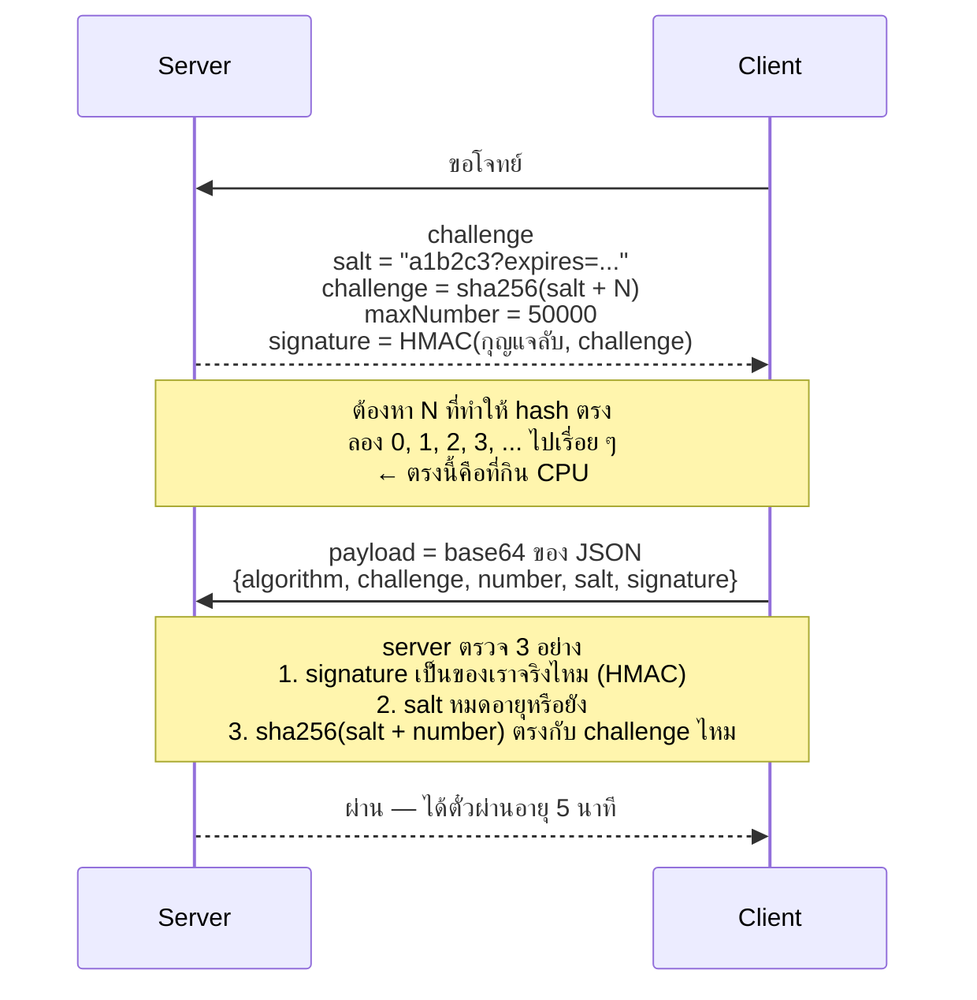
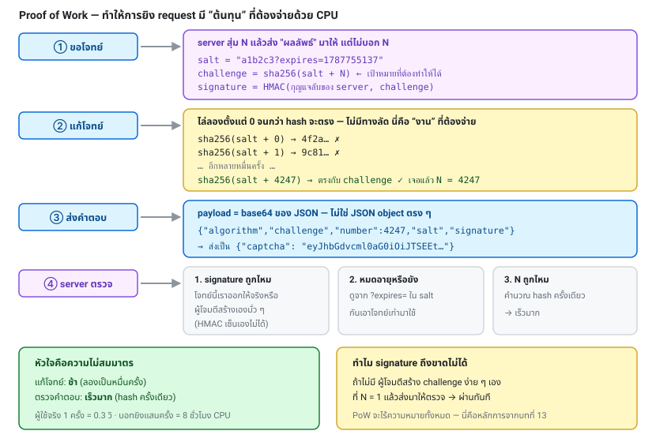

# บทที่ 16 · ALTCHA และ Proof of Work

> บทนี้เจาะ ALTCHA ซึ่งเป็น CAPTCHA แบบ Proof of Work ที่เจอบ่อยขึ้นเรื่อย ๆ
> และจะชี้จุดที่ตัวอย่างตามอินเทอร์เน็ตมักเข้าใจคลาดเคลื่อน

## 16.1 PoW ทำงานยังไง



**จุดที่ต้องเข้าใจ:** server **ไม่ต้องจำ**อะไรเลยระหว่างสองขั้นนี้
เพราะ signature ทำหน้าที่พิสูจน์ว่า challenge เป็นของจริง (หลักการจากบทที่ 13)



## 16.2 ⚠️ ความเข้าใจผิดที่พบบ่อยที่สุด

ตัวอย่างโค้ดที่เจอตามบล็อกและคำแนะนำทั่วไปมักเขียนแบบนี้:

```bash
payload = {"algorithm":..., "challenge":..., "number":..., "salt":..., "signature":...}
--data "{\"captcha\":$CAPTCHA_PAYLOAD}"      # ส่ง JSON object ตรง ๆ
```

**นี่ไม่ตรงกับ ALTCHA จริง** — widget ของ ALTCHA ส่ง `ev.detail.payload` เป็น
**base64 string ของ JSON** ไม่ใช่ JSON object

```json
// ที่ ALTCHA ส่งจริง
{"captcha": "eyJhbGdvcml0aG0iOiJTSEEtMjU2IiwiY2hhbGxlbmdlIjoi..."}

// ไม่ใช่แบบนี้
{"captcha": {"algorithm": "SHA-256", "challenge": "..."}}
```

สังเกตได้จาก payload ตัวจริงที่เห็นใน DevTools — ค่าที่ขึ้นต้นด้วย
`eyJ...` คือ base64 ของ `{"` นั่นแหละ (ลองสังเกตไว้: **เห็น `eyJ` ขึ้นต้นเมื่อไร
ให้เดาไว้ก่อนเลยว่าเป็น base64 ของ JSON**)

lab server ทำตามรูปแบบที่ถูกต้อง ลองยิงแบบผิดดูได้:

```bash
curl -s http://127.0.0.1:8080/api/solution \
     -H 'Content-Type: application/json' \
     --json '{"captcha": {"algorithm": "SHA-256"}}' | jq -r .error
```

## 16.3 โครงสร้าง challenge

```json
{
  "algorithm": "SHA-256",
  "challenge": "b5ecfd92c8f4...",
  "maxNumber": 50000,
  "salt": "876372ce72f610b4?expires=1787755137",
  "signature": "3f8a2b..."
}
```

| field | คืออะไร |
|-------|---------|
| `algorithm` | อัลกอริทึม hash (`SHA-256` ปกติ) |
| `challenge` | ค่า hash เป้าหมาย (hex) |
| `maxNumber` | ขอบเขตบนของ N ที่ต้องลอง |
| `salt` | ค่าสุ่มที่นำหน้า N ก่อน hash — มักมี `?expires=` ต่อท้าย |
| `signature` | HMAC ของ `challenge` ด้วยกุญแจลับของ server |

> ⚠️ **ชื่อ field ต่างกันตาม version/implementation**
> `altcha-lib` บางเวอร์ชันใช้ `maxnumber` (ตัวเล็กหมด) แทน `maxNumber`
> **อย่าเดา — ยิง `curl` ดู JSON จริงจากเว็บของคุณก่อนเสมอ:**
> ```bash
> curl -s 'https://yoursite/captcha/challenge/62025269' | jq
> ```

## 16.4 แก้โจทย์

```python
for n in range(max_number + 1):
    if hashlib.sha256(f"{salt}{n}".encode()).hexdigest() == challenge:
        return n
```

แค่นี้จริง ๆ — ไล่ลองตั้งแต่ 0 จนเจอ ไม่มีทางลัด (นั่นคือประเด็นของ PoW)

ดูโค้ดเต็มที่ [lab/solve_pow.py](../lab/solve_pow.py) — มีการปรับให้เร็วขึ้นเล็กน้อย
โดยเทียบ `digest()` (bytes) แทน `hexdigest()` (string) และ encode salt ไว้ล่วงหน้า

**เวลาที่ใช้โดยเฉลี่ย = maxNumber / 2 ครั้งของการ hash**
Python ทำได้ราว 1-2 ล้าน hash/วินาที ดังนั้น `maxNumber=200000` ใช้เวลาไม่ถึง 0.2 วินาที

## 16.5 สร้าง payload

```python
payload = {
    "algorithm": challenge["algorithm"],
    "challenge": challenge["challenge"],
    "number": number,          # ← คำตอบที่หาได้
    "salt": challenge["salt"],
    "signature": challenge["signature"],
}
b64 = base64.b64encode(json.dumps(payload, separators=(",", ":")).encode()).decode()
```

จากนั้นส่ง:

```json
{"captcha": "<b64>"}
```

> บาง implementation ใส่ `"took"` (เวลาที่ใช้เป็นมิลลิวินาที) เข้าไปใน payload ด้วย
> server ส่วนใหญ่ไม่ตรวจ field นี้ แต่ถ้าเว็บคุณตรวจ ก็ต้องใส่ให้ครบ
> — **วิธีเช็คที่ชัวร์ที่สุด: ดู Request Payload จริงใน DevTools** (บทที่ 14)

## 16.6 flow เต็มด้วย curl

```bash
bash lab/solutions/pow-flow.sh
```

ทำ 4 ขั้น:

```bash
B=http://127.0.0.1:8080
JAR=$(mktemp)

# 1. ขอโจทย์
curl -fsS -c "$JAR" -b "$JAR" "$B/api/challenge" -o /tmp/ch.json
jq '{algorithm, maxNumber, salt}' /tmp/ch.json

# 2. แก้
PAYLOAD=$(python3 lab/solve_pow.py < /tmp/ch.json)

# 3. ส่งคำตอบ — ใช้ jq สร้าง JSON ให้ปลอดภัย (บทที่ 6)
BODY=$(jq -nc --arg p "$PAYLOAD" '{captcha: $p}')
curl -fsS -c "$JAR" -b "$JAR" -H 'Content-Type: application/json' \
     --data "$BODY" "$B/api/solution" | jq

# 4. ใช้สิทธิ์ที่ได้มา
curl -fsS -b "$JAR" "$B/api/protected" | jq '{ok, note}'
```

**จุดสำคัญ: ขั้นที่ 4 ผ่านได้เพราะ cookie ที่ได้จากขั้นที่ 3**
PoW ไม่ได้ปกป้อง endpoint โดยตรง — มันแลกเป็น "ตั๋วผ่าน" ที่มีอายุจำกัด
(lab ตั้งไว้ 5 นาที) นี่คือรูปแบบที่ระบบจริงใช้กัน

## 16.7 ALTCHA v1 vs v2

| | v1 (legacy) | v2 |
|---|------------|-----|
| หลักการ | หา N ที่ `hash(salt+N) == challenge` | ซับซ้อนกว่า มีหลายโหมด |
| challenge JSON | `{algorithm, challenge, maxNumber, salt, signature}` | โครงสร้างต่างออกไป |
| ยังใช้กันไหม | ✅ ยังเจอเยอะ | ✅ ใหม่กว่า |

JSON ที่มีหน้าตาแบบนี้ (`{algorithm, challenge, maxNumber, salt, signature}`)
คือ **v1**

> **คำแนะนำที่จริงใจที่สุด**: อย่าไปนั่งเดา protocol จากเอกสาร
> ให้ทำสองอย่างนี้แทน
>
> 1. **ดู Request Payload จริงใน DevTools** ว่า widget ส่งอะไรออกไป — นี่คือความจริง
> 2. **อ่าน source ของ `altcha-lib`** เวอร์ชันเดียวกับที่เว็บคุณใช้
>    (`solveChallenge` / `verifySolution`)
>
> เอกสารอาจล้าสมัย แต่ traffic จริงกับ source code ไม่โกหก

หาเวอร์ชันที่เว็บคุณใช้:

```bash
curl -s https://yoursite/page | grep -oE '[^"]*altcha[^"]*\.(js|mjs)'
```

## 16.8 ถ้าคุณเป็นคน *ทำ* ระบบ PoW เอง

จาก [lab/server.py](../lab/server.py) — จุดที่ต้องทำให้ครบ:

- [ ] `signature` = HMAC ของ challenge ด้วยกุญแจที่ไม่หลุด (ห้ามใช้ hash เปล่า)
- [ ] `salt` มีวันหมดอายุ และตรวจจริง
- [ ] **`salt` สร้างด้วย CSPRNG** (`secrets` ไม่ใช่ `random`)
- [ ] เทียบด้วย `hmac.compare_digest` ไม่ใช่ `==`
- [ ] **กันใช้ซ้ำ** — เก็บ challenge ที่ถูกใช้แล้วไว้จนหมดอายุ
      (⚠️ lab ยังไม่ได้ทำข้อนี้ ดูแบบฝึกหัดข้อ 5)
- [ ] ตั้ง `maxNumber` ให้พอดี: ยากไปผู้ใช้มือถือเก่ารอนาน ง่ายไปไม่มีความหมาย
      (แนะนำเริ่มที่ 50,000-200,000 แล้ววัดผลจริง)
- [ ] ปรับ difficulty ตามความเสี่ยง (บทที่ 15)
- [ ] **PoW ไม่ใช่การยืนยันตัวตน** — ต้องมี rate limit ควบคู่เสมอ

**ข้อ "กันใช้ซ้ำ" สำคัญมาก**: ถ้าไม่ทำ ผู้โจมตีแก้โจทย์ครั้งเดียว
แล้วเอา payload เดิมยิงซ้ำหมื่นครั้งได้จนกว่า salt จะหมดอายุ — PoW ก็ไร้ความหมายทันที

## 16.9 ข้อจำกัดที่ต้องยอมรับ

| ประเด็น | ความจริง |
|---------|----------|
| PoW กันบอทได้ไหม | **ไม่** — แค่ทำให้แพงขึ้น |
| ถ้าบอทยอมจ่าย | ก็ผ่านได้ตามปกติ |
| CPU ไม่เท่ากัน | เซิร์ฟเวอร์ทำได้เร็วกว่ามือถือเก่าหลายสิบเท่า |
| แล้วยังควรใช้ไหม | **ควร** — เพราะไม่กวนผู้ใช้ ไม่ละเมิดความเป็นส่วนตัว และตัดบอทถูก ๆ ออกได้เยอะ |

ใช้ PoW เป็น**ชั้นหนึ่ง**ใน defense in depth ไม่ใช่กำแพงเดียว

## แบบฝึกหัด

1. รัน `bash lab/solutions/pow-flow.sh` ให้ผ่าน
2. decode payload กลับมาดูว่ามีอะไรข้างใน:
   ```bash
   curl -s http://127.0.0.1:8080/api/challenge | python3 lab/solve_pow.py | base64 -d | jq
   ```
3. ลองส่ง payload ที่แก้ `number` ให้ผิด — server บอกว่าอะไร
4. ลองส่ง payload ที่แก้ `signature` — บอกว่าอะไร แล้วต่างจากข้อ 3 อย่างไร
5. **แก้ lab ให้กันการใช้ซ้ำ**: เก็บ `challenge` ที่ผ่านแล้วไว้ใน set
   แล้วปฏิเสธถ้าเจอซ้ำ ทดสอบด้วยการยิง payload เดิมสองครั้ง
6. ขอ challenge ที่ยากขึ้นแล้วจับเวลา:
   ```bash
   time (curl -s 'http://127.0.0.1:8080/api/challenge?difficulty=2000000' | python3 lab/solve_pow.py > /dev/null)
   ```
   ลองหลายค่าแล้วพล็อตความสัมพันธ์ระหว่าง difficulty กับเวลา
7. เขียน solver ด้วยภาษาอื่น (Go/Rust/C) แล้วเทียบความเร็วกับ Python
   — ตัวเลขนี้บอกอะไรเกี่ยวกับประสิทธิภาพของ PoW ในการกันบอท

***
[⬅ CAPTCHA และสถาปัตยกรรม Anti-bot](15-captcha-and-antibot.md) · [สารบัญ](../README.md) · [Playwright เบื้องต้น ➡](17-playwright-basics.md)
