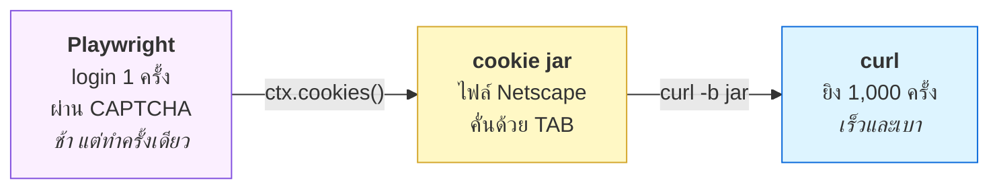
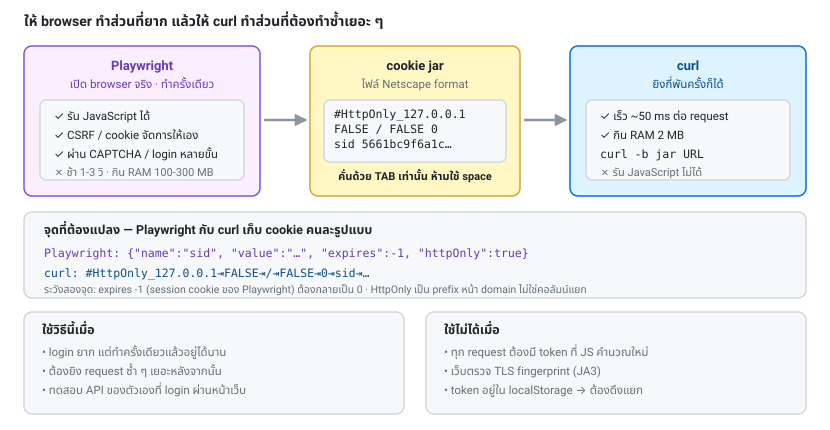

# บทที่ 18 · จาก Playwright สู่ curl — เทคนิคลูกผสม

> เทคนิคที่ใช้งานได้จริงที่สุดในคอร์สนี้:
> **ให้ browser ทำส่วนที่ยาก แล้วให้ curl ทำส่วนที่ต้องทำซ้ำเยอะ ๆ**

## 18.1 ปัญหาและทางออก

| | Playwright | curl |
|---|-----------|------|
| login/CSRF/CAPTCHA ที่ซับซ้อน | ✅ ง่ายมาก | ❌ ต้องแกะเอง |
| ความเร็วต่อ request | ❌ 1-3 วินาที | ✅ 50 มิลลิวินาที |
| หน่วยความจำ | ❌ 100-300 MB | ✅ 2 MB |
| ยิง 1,000 request | ❌ ช้ามาก | ✅ สบาย |

**ทางออก: ใช้ทั้งคู่**





## 18.2 ดึง cookie ออกจาก Playwright

```python
cookies = context.cookies()
```

ได้ list ของ dict หน้าตาแบบนี้:

```python
[{
    "name": "sid",
    "value": "5661bc9f6a1c...",
    "domain": "127.0.0.1",
    "path": "/",
    "expires": -1,              # -1 = session cookie
    "httpOnly": True,
    "secure": False,
    "sameSite": "Lax",
}]
```

หรือเก็บทั้งชุด (cookie + localStorage) ลงไฟล์:

```python
context.storage_state(path="state.json")
```

```json
{
  "cookies": [ ... ],
  "origins": [
    {"origin": "http://127.0.0.1:8080",
     "localStorage": [{"name": "token", "value": "abc"}]}
  ]
}
```

**`storage_state` ครอบคลุมกว่า `cookies()`** เพราะเว็บสมัยใหม่หลายเจ้าเก็บ token
ไว้ใน `localStorage` แทน cookie — ถ้าดึงแต่ cookie แล้ว curl ยังไม่ผ่าน ให้มาดูตรงนี้

## 18.3 แปลงเป็น cookie jar ให้ curl อ่านได้

นี่คือใจกลางของบทนี้ — โค้ดเต็มอยู่ที่
[lab/solutions/playwright_cookies.py](../lab/solutions/playwright_cookies.py)

```python
def cookies_to_netscape(cookies: list[dict]) -> str:
    lines = ["# Netscape HTTP Cookie File", ""]
    for c in cookies:
        domain = c["domain"]
        expires = int(c.get("expires", -1))
        if expires < 0:
            expires = 0                              # session cookie
        fields = [
            domain,
            "TRUE" if domain.startswith(".") else "FALSE",   # include subdomains
            c.get("path", "/"),
            "TRUE" if c.get("secure") else "FALSE",
            str(expires),
            c["name"],
            c["value"],
        ]
        prefix = "#HttpOnly_" if c.get("httpOnly") else ""
        lines.append(prefix + "\t".join(fields))       # ← TAB เท่านั้น
    return "\n".join(lines) + "\n"
```

**สี่จุดที่ต้องระวัง:**

| จุด | รายละเอียด |
|-----|-----------|
| **TAB ไม่ใช่ space** | ถ้าใช้ space curl จะเงียบ ๆ ไม่อ่านให้ ตรวจด้วย `cat -A` ต้องเห็น `^I` |
| **`expires = -1` → `0`** | Playwright ใช้ `-1` แทน session cookie แต่ Netscape ใช้ `0` |
| **leading dot** | `.example.com` = รวม subdomain → คอลัมน์ที่ 2 เป็น `TRUE` |
| **HttpOnly** | ต้องมี prefix `#HttpOnly_` หน้า domain ไม่ใช่คอลัมน์แยก |

ทางเลือกที่ง่ายกว่าถ้ามี cookie ไม่กี่ตัว — ส่งเป็น string ตรง ๆ:

```python
header = "; ".join(f"{c['name']}={c['value']}" for c in cookies)
# curl -b "sid=abc; theme=dark"
```

แต่วิธีนี้เสีย path/domain/expiry ไป ใช้ได้เมื่อยิงโดเมนเดียวเท่านั้น

## 18.4 ลองของจริง

**โหมด demo (ไม่ต้องติดตั้ง Playwright)** — ดูว่าตัวแปลงทำงานยังไง:

```bash
python3 lab/solutions/playwright_cookies.py --demo
```

```
# Netscape HTTP Cookie File
#HttpOnly_127.0.0.1	FALSE	/	FALSE	0	sid	demo123abc
.example.com	TRUE	/	TRUE	2000000000	theme	dark
```

**โหมดเต็ม** (ต้องมี Playwright):

```bash
pip install playwright && playwright install chromium
python3 lab/solutions/playwright_cookies.py
```

จะเห็น: Playwright login → แปลง cookie → curl เข้า `/dashboard` ได้โดยไม่ต้อง login ซ้ำ

## 18.5 ทางกลับกัน: จาก curl ไป Playwright

บางทีคุณ login ด้วย curl ไว้แล้ว อยากเอา session ไปเปิดใน browser

```python
def netscape_to_playwright(path: str) -> list[dict]:
    cookies = []
    for line in open(path):
        http_only = line.startswith("#HttpOnly_")
        if http_only:
            line = line[len("#HttpOnly_"):]
        elif line.startswith("#") or not line.strip():
            continue

        parts = line.rstrip("\n").split("\t")
        if len(parts) != 7:
            continue
        domain, include_sub, cpath, secure, expires, name, value = parts

        cookies.append({
            "name": name,
            "value": value,
            "domain": domain,
            "path": cpath,
            "expires": int(expires) if expires != "0" else -1,
            "httpOnly": http_only,
            "secure": secure == "TRUE",
            "sameSite": "Lax",
        })
    return cookies

context.add_cookies(netscape_to_playwright("cookies.txt"))
```

## 18.6 ใช้ storage_state ซ้ำ — ไม่ต้อง login ทุกครั้ง

```python
from pathlib import Path

STATE = Path("state.json")

with sync_playwright() as p:
    browser = p.chromium.launch()

    if STATE.exists():
        context = browser.new_context(storage_state=str(STATE))   # กลับมาพร้อม session เดิม
    else:
        context = browser.new_context()
        page = context.new_page()
        # ... login ...
        context.storage_state(path=str(STATE))
```

**ต้องมีการตรวจว่า session ยังใช้ได้ไหม** เพราะมันหมดอายุได้:

```python
page = context.new_page()
page.goto(f"{BASE_URL}/dashboard")
if "login" in page.url or page.title() == "401":
    # session หมดอายุ → login ใหม่
    ...
```

> ⚠️ `state.json` มี session ที่ใช้งานได้จริงอยู่ข้างใน — **ใส่ใน `.gitignore`
> และ `chmod 600`** อย่า commit เด็ดขาด

## 18.7 กรณีที่ token อยู่ใน localStorage ไม่ใช่ cookie

เว็บสมัยใหม่จำนวนมากเก็บ Bearer token ไว้ใน `localStorage`
— curl ไม่มี localStorage ต้องดึงค่าออกมาแล้วส่งเป็น header เอง

```python
token = page.evaluate("() => localStorage.getItem('access_token')")
print(token)
```

```bash
curl -H "Authorization: Bearer $TOKEN" 'https://api.example.com/v1/me'
```

หรือดึงจาก `storage_state`:

```python
state = context.storage_state()
for origin in state["origins"]:
    for item in origin["localStorage"]:
        if item["name"] == "access_token":
            print(item["value"])
```

## 18.8 สคริปต์ลูกผสมแบบเต็ม

```python
#!/usr/bin/env python3
"""Playwright ผ่านด่าน → curl ทำงานหนัก"""
import json, subprocess, tempfile
from pathlib import Path
from playwright.sync_api import sync_playwright

BASE = "http://127.0.0.1:8080"

def get_session() -> tuple[Path, str | None]:
    """login ด้วย browser จริง คืน (cookie jar, token จาก localStorage)"""
    jar = Path(tempfile.mkstemp(suffix=".txt")[1])
    with sync_playwright() as p:
        browser = p.chromium.launch()
        ctx = browser.new_context()
        page = ctx.new_page()

        page.goto(f"{BASE}/login")
        page.fill("input[name='username']", "myuser")
        page.fill("input[name='password']", "mypass")
        page.click("button[type='submit']")
        page.wait_for_url("**/dashboard")

        token = page.evaluate("() => localStorage.getItem('access_token')")
        jar.write_text(cookies_to_netscape(ctx.cookies()))
        browser.close()
    return jar, token

def fetch(jar: Path, path: str) -> str:
    """ยิงด้วย curl — เร็วและเบา ทำซ้ำได้เป็นพัน"""
    return subprocess.run(
        ["curl", "-fsS", "-b", str(jar), f"{BASE}{path}"],
        capture_output=True, text=True, check=True,
    ).stdout

jar, token = get_session()          # ช้า ทำครั้งเดียว
try:
    for i in range(1, 6):           # เร็ว ทำกี่รอบก็ได้
        print(fetch(jar, f"/api/books?tag=curl")[:60])
finally:
    jar.unlink(missing_ok=True)     # ลบ session ทิ้งเมื่อเสร็จ
```

## 18.9 เมื่อไรควรใช้แบบผสม เมื่อไรไม่ควร

**ควรใช้เมื่อ:**
- login/CAPTCHA ซับซ้อนแต่ทำครั้งเดียวแล้วอยู่ได้นาน
- ต้องยิง request ซ้ำ ๆ หลังจากนั้นเยอะ
- ทดสอบ API ของตัวเองที่มีขั้นตอน login ผ่านหน้าเว็บ

**ไม่ควรใช้เมื่อ:**
- ทุก request ต้องมี token ที่คำนวณด้วย JS ใหม่ทุกครั้ง → ใช้ Playwright ล้วน
- เว็บตรวจ TLS fingerprint (JA3) → curl จะถูกจับได้แม้มี cookie ถูกต้อง
- session ผูกกับ browser fingerprint → cookie อย่างเดียวไม่พอ

**ถ้า cookie ถูกต้องแต่ curl ยังไม่ผ่าน ให้ไล่ตรวจตามนี้:**

1. cookie ครบทุกตัวไหม (บางตัวถูกตั้งจาก subdomain อื่น)
2. token อยู่ใน localStorage หรือเปล่า (ข้อ 18.7)
3. มี header พิเศษที่ JS ใส่ให้ไหม เช่น `X-CSRF-Token` (ดู DevTools บทที่ 14)
4. server เช็ค `User-Agent` / `Referer` / `Origin` ไหม → ใส่ให้ตรงกับตอนที่ browser ยิง
5. เป็น TLS fingerprint ไหม → ถ้าใช่ ต้องกลับไปใช้ Playwright

## 18.10 ความปลอดภัย

- cookie jar และ `state.json` = **credential ที่ใช้งานได้จริง**
- ใส่ใน `.gitignore` เสมอ + `chmod 600`
- ใช้ `tempfile.mkstemp()` แล้วลบทิ้งเมื่อเสร็จ (ดูตัวอย่างในข้อ 18.8)
- อย่าส่งไฟล์เหล่านี้ให้ใคร รวมถึงอย่าแปะใน issue/chat

## แบบฝึกหัด

1. รัน `python3 lab/solutions/playwright_cookies.py --demo` แล้วตรวจด้วย
   `cat -A` ว่าคั่นด้วย tab จริง
2. ติดตั้ง Playwright แล้วรันโหมดเต็ม ให้ curl เข้า `/dashboard` ได้สำเร็จ
3. เขียนฟังก์ชัน `netscape_to_playwright` (ข้อ 18.5) แล้วทดสอบไป-กลับ:
   Playwright → jar → Playwright ได้ cookie เท่าเดิมไหม
4. แก้ `/spa` ใน [lab/server.py](../lab/server.py) ให้เก็บ token ไว้ใน `localStorage`
   แล้วเขียนสคริปต์ที่ดึงออกมาส่งให้ curl เป็น Bearer header
5. วัดเวลา: ยิง `/api/books` 50 ครั้งด้วย Playwright เทียบกับด้วย curl
   ต่างกันกี่เท่า
6. เขียนสคริปต์ที่ใช้ `state.json` ซ้ำได้ และตรวจว่า session หมดอายุแล้ว login ใหม่ให้เอง

***
[⬅ Playwright เบื้องต้น](17-playwright-basics.md) · [สารบัญ](../README.md) · [ดัก traffic ของ mobile app ➡](19-mitmproxy-mobile-traffic.md)
