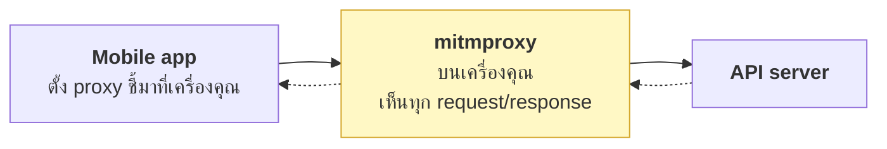

# บทที่ 19 · ดัก traffic ของ mobile app

> DevTools ใช้ได้กับเบราว์เซอร์เท่านั้น
> บทนี้คือวิธี "เปิด DevTools" ให้กับแอปมือถือที่คุณพัฒนาเอง

> ⚠️ **ขอบเขต**: บทนี้เขียนสำหรับการ debug **แอปและ API ของคุณเอง**
> หรือระบบที่คุณได้รับอนุญาตเป็นลายลักษณ์อักษรให้ทดสอบ ([บทที่ 22](22-ethics-and-limits.md))

## 19.1 ทำไมต้องมี {#s19-1}

เวลาแอปยิง API แล้วพัง คุณอยากรู้ว่า:

- แอปส่งอะไรไปจริง ๆ (header? body? token ใบไหน?)
- server ตอบอะไรกลับมาจริง ๆ
- ลำดับ request เป็นอย่างไร (โดยเฉพาะตอน refresh token)
- ทำไม request นี้ถึงช้า

log ฝั่ง server บอกได้ครึ่งเดียว เพราะบางที request ไปไม่ถึงด้วยซ้ำ

## 19.2 mitmproxy คืออะไร {#s19-2}

proxy ที่นั่งตรงกลางระหว่างแอปกับ server แล้วถอด TLS ให้ดูได้



ทำได้เพราะคุณ**ติดตั้ง CA certificate ของ mitmproxy ลงในเครื่องทดสอบเอง**
— แอปจึงเชื่อว่า mitmproxy คือ server ตัวจริง

> นี่คือเหตุผลที่[บทที่ 7](07-tls-https.md) บอกว่า certificate สำคัญ: การ "ดักดู" TLS ได้
> ต้องอาศัยการที่เครื่องเชื่อ CA ที่คุณติดตั้งเอง ถ้าไม่มีขั้นตอนนี้ ทำไม่ได้

## 19.3 ติดตั้ง {#s19-3}

```bash
pip install mitmproxy
# หรือ
sudo apt install mitmproxy
```

ได้มา 3 คำสั่ง:

| คำสั่ง | หน้าตา | เหมาะกับ |
|-------|--------|---------|
| `mitmproxy` | TUI ใน terminal | ดูสด ๆ interactive |
| `mitmweb` | หน้าเว็บ คล้าย DevTools | ✅ ใช้ง่ายที่สุดสำหรับคนเริ่มต้น |
| `mitmdump` | พิมพ์ออก stdout | บันทึกลงไฟล์ / เขียนสคริปต์ |

```bash
mitmweb --listen-port 8080
# เปิด http://127.0.0.1:8081 เพื่อดู
```

## 19.4 ตั้งค่าเครื่องทดสอบ {#s19-4}

**ขั้นที่ 1 — หา IP ของเครื่องคุณ**

```bash
ip -4 addr show | grep -oP 'inet \K192\.168\.\d+\.\d+'
```

**ขั้นที่ 2 — ตั้ง proxy บนมือถือ** (ต้องอยู่ Wi-Fi วงเดียวกัน)

- Android: Settings → Wi-Fi → กดค้างที่เครือข่าย → Modify → Proxy: Manual
- iOS: Settings → Wi-Fi → (i) → Configure Proxy → Manual

ใส่ IP เครื่องคุณ + port `8080`

**ขั้นที่ 3 — ติดตั้ง CA certificate**

เปิด <http://mitm.it> บนมือถือ (ต้องผ่าน proxy แล้ว) แล้วเลือกระบบของคุณ

- **iOS**: ติดตั้ง profile แล้ว **ต้องไปเปิด** Settings → General → About →
  Certificate Trust Settings → เปิดสวิตช์ให้ mitmproxy ด้วย (ขั้นนี้คนลืมบ่อยที่สุด)
- **Android 7+**: user CA ไม่ถูกเชื่อโดยแอปโดยอัตโนมัติแล้ว — ดูข้อถัดไป

## 19.5 Android 7+ — ปัญหาที่ต้องเจอแน่นอน {#s19-5}

ตั้งแต่ Android 7 (API 24) แอปจะเชื่อเฉพาะ **system CA** ไม่เชื่อ CA ที่ผู้ใช้ติดตั้ง
เว้นแต่แอปจะประกาศไว้เอง

**ทางแก้สำหรับแอปของคุณเอง (แนะนำที่สุด):**

สร้าง `res/xml/network_security_config.xml`:

```xml
<?xml version="1.0" encoding="utf-8"?>
<network-security-config>
    <!-- ใช้เฉพาะ build debug เท่านั้น -->
    <debug-overrides>
        <trust-anchors>
            <certificates src="system" />
            <certificates src="user" />
        </trust-anchors>
    </debug-overrides>
</network-security-config>
```

แล้วอ้างใน `AndroidManifest.xml`:

```xml
<application android:networkSecurityConfig="@xml/network_security_config" ...>
```

> ใช้ `<debug-overrides>` ไม่ใช่ `<base-config>` เพราะมันจะมีผลเฉพาะ
> `android:debuggable="true"` — build ที่ปล่อยขึ้น store จะไม่ได้รับผลกระทบ
> **นี่คือวิธีที่ปลอดภัยที่สุด** อย่าใส่ `user` CA ใน production config เด็ดขาด

ทางเลือกอื่น: ใช้ emulator ที่ไม่มี Google Play (rootable) แล้วติดตั้ง CA
เข้าไปใน system store โดยตรง

## 19.6 Certificate pinning — ปัญหาที่คุณสร้างเอง {#s19-6}

ถ้าคุณทำ pinning ตาม[บทที่ 7](07-tls-https.md) ไว้ **mitmproxy จะใช้ไม่ได้** (ซึ่งถูกต้องแล้ว —
นั่นคือหน้าที่ของ pinning)

**ทางออกที่ถูกต้อง: ปิด pinning เฉพาะ debug build**

```kotlin
// Android + OkHttp
val builder = OkHttpClient.Builder()
if (!BuildConfig.DEBUG) {
    builder.certificatePinner(
        CertificatePinner.Builder()
            .add("api.myapp.com", "sha256/AAAA...")
            .add("api.myapp.com", "sha256/BBBB...")   // backup pin!
            .build()
    )
}
```

**อย่าใช้ Frida/objection เพื่อ bypass pinning ของแอปตัวเอง** — มันเปลืองเวลา
ในเมื่อคุณแก้ที่ source ได้ (เครื่องมือพวกนั้นมีไว้สำหรับ pentest แอปที่ไม่มี source
ซึ่งต้องมีการอนุญาตเป็นลายลักษณ์อักษร)

## 19.7 ใช้งาน mitmproxy {#s19-7}

**กรองเฉพาะ API ของคุณ:**

```bash
mitmweb --listen-port 8080 --set "view_filter=~d api.myapp.com"
```

filter ที่ใช้บ่อย:

| filter | ความหมาย |
|--------|----------|
| `~d api.myapp.com` | เฉพาะโดเมนนี้ |
| `~u /v1/auth` | URL มีคำนี้ |
| `~m POST` | เฉพาะ POST |
| `~c 401` | เฉพาะที่ตอบ 401 |
| `~t json` | เฉพาะ content-type JSON |
| `~d api.myapp.com & ~c 401` | รวมเงื่อนไข |

**บันทึกไว้ดูทีหลัง:**

```bash
mitmdump -w session.mitm                        # บันทึก
mitmdump -nr session.mitm                       # เปิดอ่าน
mitmdump -nr session.mitm "~c 401"              # กรองตอนอ่าน
```

**ส่งออกเป็นคำสั่ง curl** — ใน mitmweb คลิกขวาที่ flow → Export → curl
ได้คำสั่งที่เอาไปเล่นซ้ำใน terminal ได้ทันที (เหมือน Copy as cURL ใน[บทที่ 14](14-devtools-to-curl.md))

## 19.8 เขียนสคริปต์แต่ง traffic {#s19-8}

จุดแข็งที่สุดของ mitmproxy — ทดสอบ error handling ของแอปได้โดยไม่ต้องแก้ server

```python
# save as chaos.py แล้วรัน: mitmdump -s chaos.py
import time
from mitmproxy import http

def request(flow: http.HTTPFlow) -> None:
    # ซ่อน token ในหน้าจอ log
    if "Authorization" in flow.request.headers:
        flow.request.headers["Authorization"] = "Bearer [redacted-in-view]"

def response(flow: http.HTTPFlow) -> None:
    # บังคับให้ /v1/me ตอบ 401 เพื่อทดสอบ refresh flow
    if flow.request.path.startswith("/v1/me"):
        flow.response = http.Response.make(
            401, b'{"error":"token_expired"}',
            {"Content-Type": "application/json"},
        )

    # จำลองเน็ตช้า
    if flow.request.path.startswith("/v1/heavy"):
        time.sleep(5)
```

**สถานการณ์ที่ควรทดสอบด้วยวิธีนี้** (อ้างอิง[บทที่ 11](11-mobile-api-auth-design.md)-12):

| จำลอง | ทดสอบว่าแอป... |
|-------|----------------|
| ตอบ 401 ทุกครั้ง | ไม่วน refresh ไม่รู้จบ |
| ตอบ 401 พร้อมกันหลาย request | single-flight ทำงาน ไม่ทำลาย token family |
| ตอบ 403 | **ไม่** พยายาม refresh |
| ตอบ 429 + `Retry-After: 30` | รอจริงตามที่บอก |
| ตัด response กลางคัน | retry แล้วไม่สร้างข้อมูลซ้ำ (idempotency) |
| หน่วง 30 วินาที | timeout อย่างสุภาพ ไม่ค้าง |
| ตอบ HTML แทน JSON | ไม่ crash |
| ตอบ 426 app_update_required | แสดงหน้าให้อัปเดต |

การทดสอบพวกนี้หาบั๊กได้เยอะมาก และทำที่อื่นยาก

## 19.9 ทางเลือกอื่น {#s19-9}

| เครื่องมือ | จุดเด่น |
|-----------|---------|
| **mitmproxy** | ฟรี, สคริปต์ได้, CLI | 
| **Charles Proxy** | UI ดี, ใช้ง่าย (เสียเงิน) |
| **Proxyman** | UI สวย, macOS/iOS ดีมาก |
| **Flipper** (Meta) | ฝังใน RN/Android app โดยตรง ไม่ต้องตั้ง proxy |
| **Chucker** (Android) | แสดง log ใน app เอง สะดวกมากตอน dev |
| `adb logcat` | ดู log ธรรมดา ไม่เห็น body |

**สำหรับ dev ประจำวัน Chucker/Flipper สะดวกกว่า** — ไม่ต้องตั้ง proxy ทุกครั้ง
ใช้ mitmproxy เมื่อต้องการแทรกแซง traffic หรือดูของที่ไม่ได้ผ่าน HTTP client ของแอป

## 19.10 ความปลอดภัย — ทำแล้วต้องเก็บกวาด {#s19-10}

- [ ] **ถอด CA ของ mitmproxy ออกจากเครื่องเมื่อเสร็จ** — ถ้าลืมไว้
      ใครก็ตามที่ได้ private key ของ CA นั้นจะดัก traffic ของเครื่องคุณได้ทั้งหมด
- [ ] ปิด proxy setting ใน Wi-Fi เมื่อเลิกใช้
- [ ] อย่าใช้เครื่องส่วนตัวที่มีบัญชีจริง — ใช้เครื่องทดสอบหรือ emulator
- [ ] ไฟล์ `.mitm` ที่บันทึกไว้มี token จริง — `chmod 600` + ใส่ `.gitignore`
- [ ] อย่ารัน mitmproxy บนเครือข่ายสาธารณะโดยไม่จำกัด IP ที่ต่อได้
      (`--listen-host 192.168.1.x`)

## แบบฝึกหัด

1. ติดตั้ง mitmproxy แล้วรัน `mitmweb` ยิง curl ผ่านมันดู:
   ```bash
   curl -x http://127.0.0.1:8080 -k http://127.0.0.1:8080/api/books
   ```
   (หรือใช้พอร์ตอื่นถ้าชนกับ lab server)
2. ตั้ง proxy บนมือถือ/emulator แล้วดู traffic ของแอปคุณเอง
3. เขียนสคริปต์ mitmproxy ที่บังคับให้ `/api/me` ตอบ 401 ทุกครั้ง
   แล้วดูว่าแอปคุณวน refresh หรือไม่
4. เขียนสคริปต์ที่หน่วง response 10 วินาที — แอปคุณ timeout อย่างสุภาพไหม
5. ส่งออก request หนึ่งเป็นคำสั่ง curl แล้วเล่นซ้ำใน terminal
6. ตรวจ checklist [ข้อ 19.10](#s19-10) ให้ครบหลังทดลองเสร็จ

***
[⬅ จาก Playwright สู่ curl](18-playwright-cookies-to-curl.md) · [สารบัญ](../README.md) · [ชั้นใต้ HTTP ➡](31-tcpip-and-tcpdump.md)
