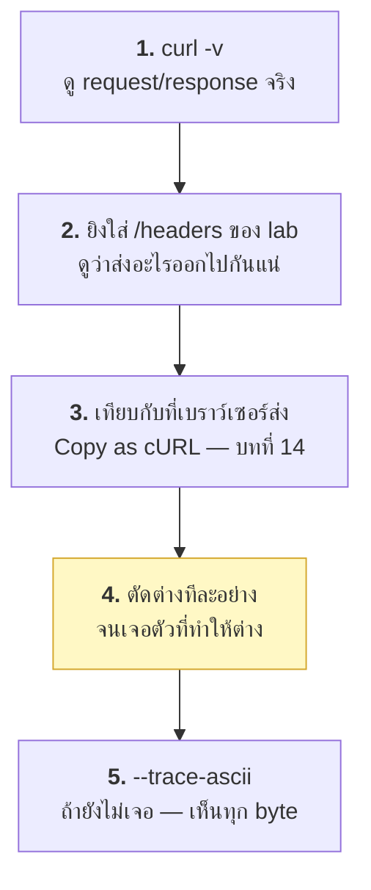

# บทที่ 21 · Debug และกับดักที่เจอบ่อย

> บทนี้ออกแบบให้เปิดหาเวลาติดปัญหา ไม่ต้องอ่านรวดเดียว

## 21.1 ขั้นตอนวินิจฉัยมาตรฐาน

เจอปัญหาแล้วทำตามลำดับนี้ อย่าเดา:



**ขั้นที่ 4 คือหัวใจ** — อย่าแก้หลายอย่างพร้อมกัน เปลี่ยนทีละอย่างแล้วทดสอบ

```bash
# เทคนิค: ยิงใส่ตัวเองเพื่อดูว่าส่งอะไรจริง
curl [options ทั้งหมดที่สงสัย] http://127.0.0.1:8080/headers | jq '.headers'
```

## 21.2 ตารางอาการ → สาเหตุ

### ปัญหาการเชื่อมต่อ

| อาการ | สาเหตุที่พบบ่อย | ตรวจยังไง |
|-------|-----------------|-----------|
| `Connection refused` (exit 7) | server ไม่ได้เปิด / port ผิด | `ss -tlnp \| grep 8080` |
| `Could not resolve host` (exit 6) | DNS / พิมพ์ชื่อผิด | `dig example.com` |
| `Operation timed out` (exit 28) | firewall ตัด / server ค้าง | `--connect-timeout 3 -v` |
| ค้างไม่ตอบ ไม่ error | ไม่ได้ตั้ง timeout | ใส่ `--max-time` เสมอ |

### ปัญหา TLS

| อาการ | สาเหตุ | แก้ |
|-------|--------|-----|
| `unable to get local issuer certificate` | server ส่ง chain ไม่ครบ | ตั้งค่า server ให้ส่ง full chain ([บทที่ 7](07-tls-https.md)) |
| `certificate has expired` | cert หมดอายุ | ต่ออายุ |
| `SSL_ERROR_SYSCALL` | TLS version/cipher ไม่ตรง | `--tlsv1.2 -v` |
| ทำงานในเบราว์เซอร์แต่ curl ไม่ได้ | เบราว์เซอร์มี intermediate cert แคชไว้ | ปัญหาอยู่ที่ server ไม่ใช่ curl |

### ปัญหา auth / session

| อาการ | สาเหตุ |
|-------|--------|
| 401 ทั้งที่มี token | token หมดอายุ / ลืมคำว่า `Bearer ` นำหน้า / เว้นวรรคเกิน |
| 403 ทั้งที่ token ถูก | ไม่มีสิทธิ์ (ไม่ใช่ปัญหา auth) — อย่า refresh |
| ได้ 403 CSRF ทั้งที่ token ถูก | ลืม `-b` ส่ง cookie / token คนละ session |
| login ผ่านแต่หน้าถัดไปไม่ผ่าน | ลืม `-c` ตอน POST → cookie ใหม่หาย |
| ใช้ได้ครั้งแรก ครั้งที่สองพัง | token ใช้ครั้งเดียว / refresh rotation ทำงาน |
| refresh แล้วทุกอย่างพังหมด | refresh ซ้อนกัน → reuse detection เพิกถอน family ([บทที่ 11](11-mobile-api-auth-design.md)) |

### ปัญหาข้อมูล

| อาการ | สาเหตุ |
|-------|--------|
| ภาษาไทยเป็น `หน` | charset ผิด ([บทที่ 6](06-encoding-and-charset.md)) |
| `+` กลายเป็น space | ใช้ `-d` แทน `--data-urlencode` |
| `&` ทำให้ field เพี้ยน | ไม่ได้ encode |
| body ที่ได้เป็นตัวอักษรมั่ว | gzip — ใส่ `--compressed` |
| server บอก "invalid JSON" | ลืม `-H 'Content-Type: application/json'` |
| ไฟล์ที่อัปโหลดขนาดผิด | ใช้ `-d` แทน `--data-binary` |
| shell พังตอนใส่ URL | ลืมใส่ `'...'` รอบ URL ที่มี `&` |

### ปัญหา redirect

| อาการ | สาเหตุ |
|-------|--------|
| ได้ HTML ว่าง ๆ + 302 | ลืม `-L` |
| POST กลายเป็น POST ซ้ำที่ปลายทาง | ใส่ `-X POST` คู่กับ `-L` ([บทที่ 5](05-redirects-and-headers.md)) |
| cookie หายหลัง redirect | ลืม `-b`/`-c` |
| วนไม่รู้จบ | redirect loop — ใส่ `--max-redirs 5` |

### ปัญหาที่เกิดเฉพาะกับบอท

| อาการ | สาเหตุ |
|-------|--------|
| curl ได้ 403 แต่เบราว์เซอร์ผ่าน | User-Agent / TLS fingerprint ([บทที่ 15](15-captcha-and-antibot.md)) |
| ได้ HTML ว่างเปล่า | เนื้อหาสร้างด้วย JS → ต้องใช้ Playwright ([บทที่ 17](17-playwright-basics.md)) |
| ทำงานได้สักพักแล้ว 429 | rate limit — ใส่ `sleep` และเคารพ `Retry-After` |
| ได้หน้า CAPTCHA | ระบบ anti-bot ทำงาน ([บทที่ 15](15-captcha-and-antibot.md)) |

## 21.3 เครื่องมือ debug

```bash
# ระดับ 1 - ดู header
curl -v URL

# ระดับ 2 - ดูทุก byte รวม body ขาออก
curl --trace-ascii /dev/stdout URL

# ระดับ 3 - ดู binary ด้วย
curl --trace trace.bin URL

# แยก header ออกไฟล์
curl -D headers.txt -o body.txt URL

# ดูเวลาแต่ละช่วง
curl -s -o /dev/null -w 'dns=%{time_namelookup} tcp=%{time_connect} tls=%{time_appconnect} ttfb=%{time_starttransfer} total=%{time_total}\n' URL
```

**เครื่องมือดู request จากภายนอก:**

- `http://127.0.0.1:8080/headers` — lab ของคุณเอง (ดีที่สุด ไม่ส่งข้อมูลออกนอก)
- <https://webhook.site> — ได้ URL ชั่วคราว ยิงไปแล้วดูได้
  ⚠️ **อย่าส่ง token จริงไป** เพราะข้อมูลอยู่บนเซิร์ฟเวอร์คนอื่น
- `nc -l 8081` — รับ request ดิบ ๆ ดูได้ทันที ([ภาคผนวก A](A1-netcat.md))

```bash
# ดู raw request ที่ curl ส่งจริง
nc -l 8081 &
curl -d 'a=b' http://127.0.0.1:8081/test
```

## 21.4 กับดักที่ทำให้เสียเวลามากที่สุด 10 อันดับ

**1. `-X POST` กับ `-L`** — POST ซ้ำที่ปลายทาง ([บทที่ 5](05-redirects-and-headers.md))

**2. ลืม `-c` ตอน POST** — cookie ใหม่ที่ server ตั้งหลัง login หายไป

```bash
curl -b jar -c jar ...   # ✅ ทั้งอ่านและเขียน ทุกครั้ง
```

**3. `-d` กับค่าที่มีอักขระพิเศษ** — ใช้ `--data-urlencode` เป็นค่าเริ่มต้น

**4. ลืม `-H 'Content-Type: application/json'`** — `-d` ตั้งเป็น urlencoded ให้อัตโนมัติ

**5. `echo` เติม newline** — `echo -n` ตอนคำนวณ hash/base64

```bash
echo    'abc' | sha256sum    # hash ของ "abc\n"  ← ผิด
echo -n 'abc' | sha256sum    # hash ของ "abc"    ← ถูก
printf '%s' 'abc' | sha256sum  # ปลอดภัยที่สุด
```

**6. ไม่ใส่ `-f`** — HTTP 500 ถูกนับเป็นสำเร็จ (exit 0)

**7. ไม่ใส่ `--max-time`** — สคริปต์ค้างตลอดกาลใน cron

**8. cookie jar ไม่ได้คั่นด้วย TAB** — เขียนเองแล้ว curl เงียบ ๆ ไม่อ่าน ([บทที่ 18](18-playwright-cookies-to-curl.md))

**9. ตัวแปรไม่ใส่ quote** — ค่าที่มี space ทำให้พังแบบงง ๆ

**10. refresh token ซ้อนกัน** — บั๊กอันดับหนึ่งของ mobile app ที่ทำ rotation
([บทที่ 11](11-mobile-api-auth-design.md)) แก้ด้วย single-flight

## 21.5 checklist เมื่อ "curl ไม่ได้ แต่เบราว์เซอร์ได้"

ไล่ตามลำดับนี้ ส่วนใหญ่จบที่ 3 ข้อแรก:

- [ ] 1. มี cookie ครบไหม (`-b`) — บาง cookie ถูกตั้งจากหน้าอื่นก่อนหน้า
- [ ] 2. มี CSRF token / hidden field ครบไหม
- [ ] 3. token อยู่ใน localStorage หรือเปล่า ([บทที่ 18](18-playwright-cookies-to-curl.md))
- [ ] 4. `User-Agent` ถูกเช็คไหม
- [ ] 5. `Referer` / `Origin` ถูกเช็คไหม
- [ ] 6. มี custom header (`X-...`) ที่ JS ใส่ให้ไหม
- [ ] 7. `Content-Type` ตรงกับที่เบราว์เซอร์ส่งไหม
- [ ] 8. เนื้อหาถูกสร้างด้วย JS หรือเปล่า → Playwright
- [ ] 9. มี request ก่อนหน้าที่ต้องยิงก่อนไหม (ดูลำดับใน DevTools)
- [ ] 10. TLS fingerprint → curl ทำไม่ได้ ต้องใช้ browser จริง

**วิธีที่เร็วที่สุด:** Copy as cURL จาก DevTools แล้วยิงดู
- ถ้าผ่าน → ค่อยตัด header ทีละอันหาว่าอันไหนจำเป็น
- ถ้าไม่ผ่าน → cookie/token หมดอายุแล้ว หรือมี request ก่อนหน้าที่ขาดไป

## 21.6 Debug ฝั่ง server (API ของคุณเอง)

เมื่อ mobile app บอกว่า "ยิงไปแล้วแต่ไม่ได้ผล":

```
1. request มาถึง server ไหม        → access log
2. ผ่าน auth middleware ไหม         → log ที่ middleware
3. body ที่รับมาหน้าตายังไง          → log (ต้อง redact ความลับ!)
4. ตอบอะไรกลับไป                    → response log + request_id
5. แอปได้รับอะไร                     → mitmproxy (บทที่ 19)
```

**สิ่งที่ต้องมีเพื่อ debug ได้:**

- `X-Request-ID` ที่ไหลผ่านทุกชั้นและอยู่ใน log ทุกบรรทัด ([บทที่ 12](12-api-design-practices.md))
- log ที่มี: timestamp, request_id, user_id, method, path, status, duration
- **ไม่มี**: token, password, `Authorization` header เต็ม ๆ

**endpoint สำหรับ debug ที่มีประโยชน์มาก** (ปิดใน production หรือใส่ auth):

```python
# echo กลับทุกอย่างที่รับมา - เหมือน /headers ของ lab
```

## 21.7 เมื่อทุกอย่างดูถูกแต่ยังพัง

```bash
# 1. เทียบ byte ต่อ byte
curl --trace-ascii a.txt [คำสั่งที่ใช้ได้]
curl --trace-ascii b.txt [คำสั่งที่ใช้ไม่ได้]
diff a.txt b.txt

# 2. ตรวจว่ามี character ที่มองไม่เห็นไหม
echo "$TOKEN" | cat -A          # เห็น ^M (\r) หรือ $ ท้ายบรรทัด
echo "$TOKEN" | xxd | tail -2

# 3. ตรวจว่าตัวแปรมีค่าจริงไหม
echo "TOKEN=[${TOKEN}]"          # วงเล็บช่วยให้เห็น space
declare -p TOKEN
```

**อาการคลาสสิก: `\r` ท้ายบรรทัด** เกิดจากไฟล์ที่มาจาก Windows
หรือค่าที่ `grep` มาจาก HTTP header (header จบด้วย `\r\n`)

```bash
TOKEN=$(grep ... | tr -d '\r')      # ตัดทิ้งเสมอ
```

## แบบฝึกหัด

1. ทำให้แต่ละอาการในหัวข้อ 21.2 เกิดขึ้นจริงกับ lab server อย่างน้อย 5 อย่าง
2. ใช้ `nc -l 8081` แล้วยิง curl ใส่ ดู raw request ที่ส่งจริง
3. เทียบ `echo 'abc' | sha256sum` กับ `echo -n 'abc' | sha256sum`
   แล้วอธิบายว่าทำไมเรื่องนี้ทำให้ HMAC ผิด
4. สร้างสถานการณ์ที่ค่าตัวแปรมี `\r` ติดมา แล้วหาให้เจอด้วย `cat -A`
5. ใช้ `--trace-ascii` เทียบสองคำสั่งที่ต่างกันแค่ `-d` กับ `--data-urlencode`
6. เปิด lab server แล้วปิดกลางคัน — สคริปต์ของคุณจัดการอย่างไร ควรจัดการอย่างไร

***
[⬅ Concurrency และ async](33-concurrency-and-async.md) · [สารบัญ](../README.md) · [netcat (`nc`) ➡](A1-netcat.md)
