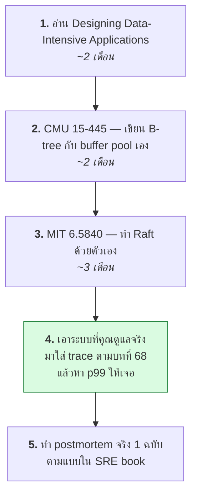
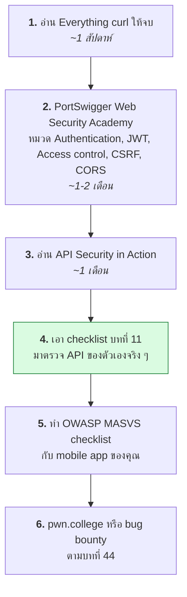
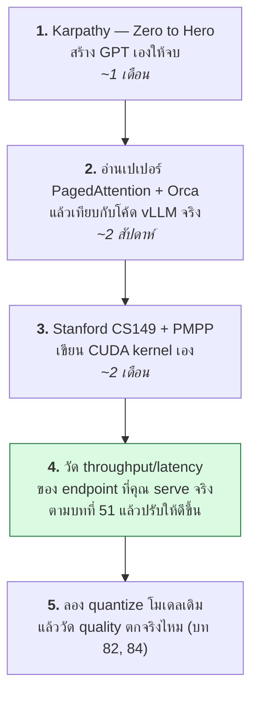

# บทที่ 23 · เรื่องพวกนี้เขาสอนกันในวิชาไหน

> คำถามที่คุณถามระหว่างทาง: "นักศึกษา computer science ได้เรียนไหม"
> คำตอบสั้น ๆ คือ **ได้เรียนบางส่วน แต่ไม่ครบ และส่วนที่ขาดคือส่วนที่ใช้ทำงานจริงมากที่สุด**

บทนี้เป็นบทสุดท้ายของเล่ม ทำหน้าที่สองอย่าง: บอกว่าเนื้อหาแต่ละส่วนไปตรงกับ
วิชาไหนในหลักสูตร และบอกว่า **ถ้าจะไปต่อจากตรงนี้ควรอ่านอะไร**
รายการทั้งหมดในบทนี้เรียงตามลำดับที่แนะนำให้อ่าน ไม่ใช่เรียงตามชื่อเสียง

## 23.1 แผนที่: เรื่องไหนอยู่ในวิชาอะไร {#s23-1}

### ส่วนที่ 1-2 · HTTP, curl, API และ Authentication

| บทในเล่มนี้ | วิชาในหลักสูตร CS/CPE | ปกติเรียนปีไหน |
|--------------|------------------------|----------------|
| 01 HTTP พื้นฐาน | **เครือข่ายคอมพิวเตอร์** (Computer Networks) | ปี 3 |
| 02 curl | ❌ **ไม่มีวิชาไหนสอน** | — |
| 03-05 form, cookie, session, redirect | **การพัฒนาเว็บ** (Web Programming) | ปี 2-3 |
| 06 encoding, UTF-8 | **โครงสร้างข้อมูล / ระบบปฏิบัติการ** (แตะนิดเดียว) | ปี 2 |
| 07 TLS/HTTPS | **ความมั่นคงปลอดภัย / วิทยาการเข้ารหัส** | ปี 3-4 |
| 08 JSON API | **การพัฒนาเว็บ / วิศวกรรมซอฟต์แวร์** | ปี 3 |
| 09-10 auth, JWT | **ความมั่นคงปลอดภัยของระบบ** (ถ้ามีเปิด) | ปี 4 |
| 53 OAuth/OIDC · 54 Passkey | ❌ **แทบไม่มีที่ไหนสอน** — มีแต่ในงานจริง | — |
| 11 mobile auth design | ❌ **แทบไม่มีที่ไหนสอน** | — |
| 12 API design | **วิศวกรรมซอฟต์แวร์** (ผิวเผิน) | ปี 3 |
| 13 HMAC, signature | **วิทยาการเข้ารหัสลับ** (Cryptography) | ปี 4 |

### ส่วนที่ 3 · ออกแบบระบบให้อยู่รอด

| บทในเล่มนี้ | วิชาในหลักสูตร CS/CPE | ปกติเรียนปีไหน |
|--------------|------------------------|----------------|
| 24 authorization, BOLA | **ความมั่นคงปลอดภัยของระบบ** (สอนทฤษฎี access control ไม่สอนบั๊กจริง) | ปี 4 |
| 25 injection, SSRF, upload | **ความมั่นคงปลอดภัยเว็บ** (ถ้ามีเปิด) | ปี 4 |
| 26 proxy, cache, CDN | ❌ **ไม่มี** — คาบเกี่ยวเครือข่ายกับ web แต่ไม่มีใครรับ | — |
| 27 database performance · 71 transaction/isolation | **ระบบฐานข้อมูล** (Database Systems) — ACID/isolation สอนแน่ แต่ index tuning ไม่ค่อยสอน | ปี 3 |
| 28, 68 observability, tracing | ❌ **ไม่มี** — เป็นวัฒนธรรมของงาน production | — |
| 29, 69 real-time, SSE, WebSocket | **เครือข่าย / การพัฒนาเว็บ** (แตะนิดเดียว) | ปี 3 |
| 56 background job, queue | **ระบบกระจาย** (Distributed Systems) | ปี 4 |
| 57 scaling out | **ระบบกระจาย / สถาปัตยกรรมซอฟต์แวร์** | ปี 4 |

### ส่วนที่ 4 · เครื่องมือของคนทำงาน

| บทในเล่มนี้ | วิชาในหลักสูตร CS/CPE | ปกติเรียนปีไหน |
|--------------|------------------------|----------------|
| 30 git | ❌ **ไม่มีวิชาไหนสอนจริงจัง** — ใช้เป็นก็เพราะทำโปรเจกต์ | — |
| 20 shell scripting | **ระบบปฏิบัติการ** (แตะนิดเดียว) | ปี 2 |
| 32 pytest | **การทดสอบซอฟต์แวร์ / วิศวกรรมซอฟต์แวร์** | ปี 3-4 |
| 55 CI/CD | ❌ **แทบไม่มี** — บางที่มีในวิชา DevOps | — |
| 67 profiling | **การวิเคราะห์ประสิทธิภาพ** (หายาก) | ปี 4 |
| 33 concurrency, async | **ระบบปฏิบัติการ / การเขียนโปรแกรมขนาน** | ปี 3 |
| 21 debugging | ❌ **ไม่มีวิชาไหนสอนอย่างเป็นระบบ** | — |
| A1 netcat | ❌ **ไม่มี** | — |

### ส่วนที่ 5 · Automation และ Anti-bot

| บทในเล่มนี้ | วิชาในหลักสูตร CS/CPE | ปกติเรียนปีไหน |
|--------------|------------------------|----------------|
| 14 DevTools | ❌ **ไม่มี** — เรียนรู้เอง | — |
| 15-16 CAPTCHA, PoW | **ความมั่นคงปลอดภัย** (บางที่พูดถึงตอนสอน blockchain) | ปี 4 |
| 17-18 Playwright | **การทดสอบซอฟต์แวร์** (ถ้ามี) | ปี 3-4 |
| 19 proxy/mitm | **ความมั่นคงปลอดภัยเครือข่าย** (ตอนสอน MITM attack) | ปี 4 |

### ส่วนที่ 6 · ชั้นใต้ HTTP และระบบปฏิบัติการ

| บทในเล่มนี้ | วิชาในหลักสูตร CS/CPE | ปกติเรียนปีไหน |
|--------------|------------------------|----------------|
| 31 TCP/IP, tcpdump | **เครือข่ายคอมพิวเตอร์** ✅ สอนครบที่สุดในเล่มนี้ | ปี 3 |
| 35 Linux internals | **ระบบปฏิบัติการ** ✅ (process, syscall, scheduler) | ปี 3 |
| 36 permission, namespace, container | **ระบบปฏิบัติการ / ความมั่นคงปลอดภัยของระบบ** | ปี 3-4 |
| 37 memory, buffer overflow | **องค์ประกอบคอมพิวเตอร์ / ความมั่นคงปลอดภัยระบบ** ✅ | ปี 3-4 |
| 63 reverse engineering | **ความมั่นคงปลอดภัย** (มีเฉพาะบางที่) | ปี 4 |
| 64 FFI, binding | ❌ **ไม่มี** — คาบเกี่ยวภาษาโปรแกรมกับ OS | — |
| 65 linking, loading | **คอมไพเลอร์ / ระบบปฏิบัติการ** (มักข้าม) | ปี 3-4 |
| 38 crypto ภาคปฏิบัติ | **วิทยาการเข้ารหัสลับ** (เน้นคณิตศาสตร์มากกว่าการใช้งาน) | ปี 4 |

### ส่วนที่ 7 · Malware และการตั้งรับ

| บทในเล่มนี้ | วิชาในหลักสูตร CS/CPE | ปกติเรียนปีไหน |
|--------------|------------------------|----------------|
| 39-40 malware และการวิเคราะห์ | **มัลแวร์และการวิเคราะห์** (มีเฉพาะหลักสูตร security โดยตรง) | ปี 4 / ป.โท |
| 41 detection & response | ❌ **ไม่มี** — เป็นทักษะของ SOC | — |
| 42 supply chain | ❌ **แทบไม่มี** — เพิ่งเป็นประเด็นหลังปี 2020 | — |
| 58 cloud security | ❌ **ไม่มี** — บางที่มีวิชา cloud computing แต่ไม่เน้นความปลอดภัย | — |
| 59 network defense | **ความมั่นคงปลอดภัยเครือข่าย** | ปี 4 |

### ส่วนที่ 8 · GPU และ AI Infrastructure

| บทในเล่มนี้ | วิชาในหลักสูตร CS/CPE | ปกติเรียนปีไหน |
|--------------|------------------------|----------------|
| 46 GPU 101 · 50 multi-GPU | **การประมวลผลขนาน / สถาปัตยกรรมคอมพิวเตอร์** | ปี 4 / ป.โท |
| 47 VRAM, KV cache | ❌ **ไม่มี** — เป็นความรู้ของงาน LLM serving | — |
| 78 สถาปัตยกรรม LLM | **การเรียนรู้เชิงลึก** (Deep Learning) ✅ สอน transformer แน่ | ปี 4 / ป.โท |
| 79-82 vLLM, spec decoding, serving, eval | ❌ **ไม่มี** — ใหม่เกินกว่าจะเข้าหลักสูตร | — |
| 66 training/fine-tuning | **การเรียนรู้ของเครื่อง / Deep Learning** | ปี 4 |
| 72 MLOps | ❌ **แทบไม่มี** — บางที่มีเป็นวิชาเลือก | — |
| 49 GPU บน container/k8s | ❌ **ไม่มี** | — |
| 51 GPU observability, cost | ❌ **ไม่มี** | — |
| 83 CUDA kernel, FlashAttention | **การเขียนโปรแกรมขนาน / GPU computing** (มีเฉพาะบางที่) | ปี 4 / ป.โท |
| 84 quantization, numerics | **การคำนวณเชิงตัวเลข** สอน floating point แต่ไม่สอน INT8/FP8 ของ LLM | ปี 2-4 |
| 85 parallelism ขั้นสูง | ❌ **ไม่มี** — อยู่ในเปเปอร์กับโค้ดของ framework | — |
| 52 AI system security | ❌ **ไม่มี** — สาขาที่เพิ่งเกิด | — |

### ส่วนที่ 9 · คิดอย่างเป็นระบบ

| บทในเล่มนี้ | วิชาในหลักสูตร CS/CPE | ปกติเรียนปีไหน |
|--------------|------------------------|----------------|
| 73 หลักการออกแบบโค้ด | **วิศวกรรมซอฟต์แวร์** (สอนหลักการ ไม่ค่อยได้ฝึกกับโค้ดใหญ่จริง) | ปี 3 |
| 74 สถาปัตยกรรมซอฟต์แวร์ | **สถาปัตยกรรมซอฟต์แวร์** (ถ้ามีเปิด) | ปี 4 |
| 75 ทฤษฎีการคำนวณ | **ทฤษฎีการคำนวณ / อัลกอริทึม** ✅ สอนครบและเข้มข้น | ปี 2-3 |
| 76 functional programming | **หลักภาษาโปรแกรม** (Programming Languages) ✅ | ปี 3 |
| 77 ออกแบบระบบจากศูนย์ | ❌ **ไม่มี** — เป็นข้อสอบสัมภาษณ์ ไม่ใช่วิชา | — |
| 60 GRC, compliance | **จริยธรรม / กฎหมายคอมพิวเตอร์** (ผิวเผิน) | ปี 4 |
| 61 digital forensics | **นิติวิทยาศาสตร์ดิจิทัล** (มีเฉพาะหลักสูตร security) | ปี 4 |
| 62 VPN, Tor, tunneling | **ความมั่นคงปลอดภัยเครือข่าย** | ปี 4 |
| 34 threat modeling | ❌ **แทบไม่มี** — สอน checklist มากกว่าสอนคิดเอง | — |
| 22 จริยธรรม | **จริยธรรมวิชาชีพคอมพิวเตอร์** | ปี 4 |
| 43-45 เส้นทางอาชีพ, CTF, home lab | ❌ **ไม่มี** | — |

**ข้อสังเกต: ช่องที่เขียนว่า ❌ คือเรื่องที่ใช้ทำงานจริงบ่อยที่สุด**
มหาวิทยาลัยสอน "ทำไม" (ทฤษฎี TCP/IP, ทฤษฎีการเข้ารหัส, ทฤษฎีการคำนวณ)
ส่วน "ทำยังไง" (curl, DevTools, git, การ debug ของจริง, การอ่าน flame graph)
มักต้องเรียนรู้เองหรือเรียนตอนทำงาน

นี่ไม่ใช่ข้อบกพร่องของหลักสูตรเสมอไป — ทฤษฎีอยู่ได้ 30 ปี ส่วนเครื่องมือเปลี่ยนทุก 3 ปี
แต่ก็ทำให้บัณฑิตจำนวนมากรู้ทฤษฎี TCP แต่ยิง `curl -v` ไม่เป็น

**และมีอีกแบบที่น่าสนใจกว่า: ช่อง ❌ ในส่วนที่ 8 ไม่ได้ ❌ เพราะไม่สำคัญ
แต่เพราะเรื่องมันใหม่กว่าหลักสูตร** ความรู้เรื่อง PagedAttention หรือ FP8
ยังอยู่ในเปเปอร์กับ source code ของ framework ไม่ได้ตกตะกอนลงตำราเรียน
ซึ่งแปลว่าใครอ่านเปเปอร์กับโค้ดเป็นก็ตามทันได้เท่ากันหมด ไม่ว่าจบที่ไหน

## 23.2 วิชาที่ควรตามหาถ้าเรียนอยู่ {#s23-2}

| ชื่อวิชา (ไทย/อังกฤษ) | ได้อะไรจากเล่มนี้เพิ่ม |
|----------------------|------------------------|
| เครือข่ายคอมพิวเตอร์ / Computer Networks | บท 01, 05, 07, 26, 31, 59, 62 |
| ระบบปฏิบัติการ / Operating Systems | บท 33, 35, 36, 37, 65 |
| ระบบฐานข้อมูล / Database Systems | บท 27, 71 |
| ระบบกระจาย / Distributed Systems | บท 12, 56, 57, 68, 77 |
| ความมั่นคงปลอดภัยคอมพิวเตอร์ / Computer Security | บท 07, 09-11, 13, 15, 24-25, 34, 58-59 |
| วิทยาการเข้ารหัสลับ / Cryptography | บท 06, 07, 13, 16, 38, 54 |
| การพัฒนาเว็บ / Web Application Development | บท 03-05, 08, 12, 29, 69 |
| วิศวกรรมซอฟต์แวร์ / Software Engineering | บท 12, 30, 32, 55, 73, 74 |
| การทดสอบซอฟต์แวร์ / Software Testing | บท 17-19, 32 |
| หลักภาษาโปรแกรม / Programming Languages | บท 64, 76 |
| คอมไพเลอร์ / Compilers | บท 63, 65 |
| ทฤษฎีการคำนวณ, อัลกอริทึม / Theory, Algorithms | บท 75 |
| สถาปัตยกรรมคอมพิวเตอร์ / Computer Architecture | บท 37, 46, 67, 83, 84 |
| การประมวลผลขนาน / Parallel Computing | บท 33, 50, 83, 85 |
| การเรียนรู้เชิงลึก / Deep Learning | บท 66, 78, 82 |
| นิติวิทยาศาสตร์ดิจิทัล / Digital Forensics | บท 40, 41, 61 |

> ถ้าเลือกวิชาเลือกได้แค่ 3 ตัวและอยากทำงานสาย backend/platform:
> **ระบบปฏิบัติการ · ระบบฐานข้อมูล · ระบบกระจาย** — สามตัวนี้ให้ผลตอบแทนสูงสุด
> เพราะเป็นความรู้ที่เปลี่ยนช้าและใช้ทุกวัน

## 23.3 หนังสือ {#s23-3}

### เริ่มที่นี่ (ต่อยอดจากส่วนที่ 1-2 โดยตรง)

| หนังสือ | เรื่อง | หมายเหตุ |
|---------|-------|----------|
| **[Everything curl](https://everything.curl.dev/)** | curl ทั้งเล่ม | **ฟรี** เขียนโดยผู้สร้าง curl เอง — ตรงกับเล่มนี้ที่สุด |
| **[MDN Web Docs — HTTP](https://developer.mozilla.org/en-US/docs/Web/HTTP)** | HTTP reference | ฟรี ดีที่สุดสำหรับเปิดหา |
| **[High Performance Browser Networking](https://hpbn.co/)** (Grigorik) | TCP, TLS, HTTP/2, WebSocket | **ฟรีทั้งเล่ม** — ต่อจาก[บทที่ 7](07-tls-https.md), [26](26-proxy-caching-cdn.md), [69](69-websocket-sse-deep.md) |
| **HTTP: The Definitive Guide** (Gourley & Totty) | HTTP เชิงลึก | เก่า (2002) แต่พื้นฐานยังใช้ได้ดี |
| **[Pro Git](https://git-scm.com/book/en/v2)** | git | **ฟรี** — บทที่ 10 (internals) ทำให้[บทที่ 30](30-git.md) กระจ่าง |

### ระบบและ backend (ส่วนที่ 3-4)

| หนังสือ | ตรงกับบท | หมายเหตุ |
|---------|----------|----------|
| **Designing Data-Intensive Applications** (Kleppmann) | 12, 27, 56, 57, 71, 77 | ✅ **ถ้าอ่านได้เล่มเดียวในหมวดนี้ เลือกเล่มนี้** |
| **[Operating Systems: Three Easy Pieces](https://pages.cs.wisc.edu/~remzi/OSTEP/)** | 33, 35, 36 | **ฟรี** — อ่านง่ายกว่าตำรา OS ทั่วไปมาก |
| **Computer Systems: A Programmer's Perspective** (Bryant & O'Hallaron) | 35, 37, 65, 67 | ตำราที่เชื่อมโค้ดกับฮาร์ดแวร์ได้ดีที่สุด |
| **The Linux Programming Interface** (Kerrisk) | 35, 36 | หนา 1,500 หน้า ใช้เป็น reference ไม่ต้องอ่านรวด |
| **Database Internals** (Petrov) | 27, 71 | B-tree, WAL, replication — ข้างในของ DB |
| **SQL Performance Explained** (Winand) + [use-the-index-luke.com](https://use-the-index-luke.com/) | 27 | index tuning โดยเฉพาะ เว็บฟรี |
| **Systems Performance** (Brendan Gregg) | 51, 67 | ✅ วิธีคิดเรื่อง performance ทั้งระบบ (USE method) |
| **[Site Reliability Engineering](https://sre.google/books/)** (Google) | 28, 55, 68 | **ฟรี** — SLO, error budget, postmortem |
| **Observability Engineering** (Majors et al.) | 68 | trace, high-cardinality, ต่อจากบท 68 |
| **Release It!** (Nygard) | 12, 57 | circuit breaker, bulkhead — pattern กันระบบล่ม |
| **Building Microservices** (Newman) | 57, 74 | แยกบริการเมื่อไหร่ และราคาที่ต้องจ่าย |

### ออกแบบซอฟต์แวร์และวิธีคิด (ส่วนที่ 9)

| หนังสือ | ตรงกับบท | หมายเหตุ |
|---------|----------|----------|
| **A Philosophy of Software Design** (Ousterhout) | 73 | ✅ บาง อ่านจบใน 2 วัน เปลี่ยนวิธีเขียนโค้ดได้จริง |
| **Refactoring** (Fowler, ฉบับที่ 2) | 73 | แคตตาล็อกของการแก้โค้ดโดยไม่ให้พัง |
| **Working Effectively with Legacy Code** (Feathers) | 32, 73 | วิธีใส่เทสต์ในโค้ดที่ไม่มีเทสต์ |
| **The Pragmatic Programmer** (ฉบับครบรอบ 20 ปี) | ทั้งส่วนที่ 4 | นิสัยของคนทำงาน |
| **Fundamentals of Software Architecture** (Richards & Ford) | 74 | trade-off ของแต่ละสถาปัตยกรรม |
| **Grokking Simplicity** (Normand) | 76 | FP สำหรับคนที่ไม่ได้เขียน Haskell |
| **[Structure and Interpretation of Computer Programs](https://mitp-content-server.mit.edu/books/content/sectbyfn/books_pres_0/6515/sicp.zip/index.html)** | 76 | **ฟรี** คลาสสิก — อ่านช้า ๆ |
| **[Crafting Interpreters](https://craftinginterpreters.com/)** (Nystrom) | 65, 75, 76 | **ฟรี** — เขียน interpreter เองจบเล่ม |
| **Introduction to the Theory of Computation** (Sipser) | 75 | ตำรามาตรฐาน อ่านง่ายกว่าที่คิด |
| **The Algorithm Design Manual** (Skiena) | 75 | ใช้งานได้จริงกว่า CLRS สำหรับคนทำงาน |
| **Threat Modeling** (Shostack) | 34 | ที่มาของ STRIDE |

### ความปลอดภัย (ส่วนที่ 5-7)

| หนังสือ | ตรงกับบท | หมายเหตุ |
|---------|----------|----------|
| **API Security in Action** (Madden) | 09-13, 24-25 | ✅ ตรงกับเล่มนี้มากที่สุด — token, OAuth, mobile |
| **Real-World Cryptography** (Wong) | 07, 13, 38, 54 | ✅ crypto แบบใช้งานจริง ไม่เน้นคณิตศาสตร์ |
| **The Web Application Hacker's Handbook** (Stuttard & Pinto) | 24-25 | คัมภีร์สาย web security — หนา แต่คุ้ม |
| **OAuth 2 in Action** (Richer & Sanso) | 53 | ถ้าจะทำ OAuth เต็มรูปแบบ |
| **Serious Cryptography** (Aumasson) | 38 | crypto เชิงลึกกว่า Real-World Cryptography |
| **[Building Secure and Reliable Systems](https://sre.google/books/building-secure-reliable-systems/)** (Google) | 34, 41, 58 | **ฟรี** — security กับ reliability เป็นเรื่องเดียวกัน |
| **Practical Malware Analysis** (Sikorski & Honig) | 39-40 | ✅ มาตรฐานของสายวิเคราะห์มัลแวร์ มี lab ให้ทำ |
| **Practical Binary Analysis** (Andriesse) | 63, 65 | ELF, disassembly, taint analysis |
| **Attacking Network Protocols** (Forshaw) | 19, 31, 59 | วิเคราะห์และโจมตีโปรโตคอลที่ไม่ใช่ HTTP |
| **The Art of Memory Forensics** (Ligh et al.) | 61 | dump RAM แล้วอ่านให้ออก |
| **The Practice of Network Security Monitoring** (Bejtlich) | 41, 59 | วิธีคิดของ SOC |
| **Container Security** (Liz Rice) | 36, 49, 58 | namespace, cgroup, และช่องโหว่ของ container |
| **Practical Cloud Security** (Dotson) | 58 | IAM, การแบ่งบัญชี, การตอบสนองบนคลาวด์ |

### GPU และ AI Infrastructure (ส่วนที่ 8)

หมวดนี้หนังสือตามไม่ทันของจริง — **เปเปอร์กับเอกสารของ framework สำคัญกว่าหนังสือ**
(ดู 23.4) แต่พื้นฐานที่ยังอยู่ได้นานคือ:

| หนังสือ | ตรงกับบท | หมายเหตุ |
|---------|----------|----------|
| **Programming Massively Parallel Processors** (Hwu, Kirk, El Hajj) | 46, 83 | ✅ ตำรามาตรฐานของ CUDA — อ่านคู่กับบท 83 |
| **[Dive into Deep Learning](https://d2l.ai/)** | 66, 78 | **ฟรี** มีโค้ดรันได้ทุกบท |
| **[The Ultra-Scale Playbook](https://huggingface.co/spaces/nanotron/ultrascale-playbook)** (Hugging Face) | 50, 85 | **ฟรี** — DP/TP/PP/EP อธิบายพร้อมตัวเลขจริง |
| **Designing Machine Learning Systems** (Chip Huyen) | 72, 82 | ระบบ ML ในโลกจริง ไม่ใช่ notebook |
| **AI Engineering** (Chip Huyen) | 81, 82 | ยุคหลัง LLM — prompt, eval, RAG, fine-tune |
| **Deep Learning** (Goodfellow, Bengio, Courville) | 78 | ทฤษฎีพื้นหลัง อ่าน[ฟรีออนไลน์](https://www.deeplearningbook.org/) |

**ถ้าจะซื้อแค่ 3 เล่มสำหรับคนทำ API ที่ต้องดูแล LLM ด้วย:**
_Designing Data-Intensive Applications_ + _API Security in Action_ +
_Programming Massively Parallel Processors_

## 23.4 เอกสารมาตรฐาน สเปก และเปเปอร์ (ฟรีทั้งหมด) {#s23-4}

### ความปลอดภัย

| แหล่ง | ใช้ตอนไหน |
|-------|-----------|
| **[OWASP Cheat Sheet Series](https://cheatsheetseries.owasp.org/)** | ✅ เปิดก่อนออกแบบทุกฟีเจอร์ที่เกี่ยวกับ security |
| ↳ Authentication, Session Management, REST Security, JWT, Password Storage | บท 09-13 |
| ↳ [Authorization](https://cheatsheetseries.owasp.org/cheatsheets/Authorization_Cheat_Sheet.html) · [SSRF](https://cheatsheetseries.owasp.org/cheatsheets/Server_Side_Request_Forgery_Prevention_Cheat_Sheet.html) · [File Upload](https://cheatsheetseries.owasp.org/cheatsheets/File_Upload_Cheat_Sheet.html) | บท 24-25 |
| ↳ [Bot Management and Anti-Automation](https://cheatsheetseries.owasp.org/cheatsheets/Bot_Management_and_Anti_Automation_Cheat_Sheet.html) | บท 15 |
| **[OWASP ASVS](https://owasp.org/www-project-application-security-verification-standard/)** | checklist ตรวจระบบก่อนขึ้น production |
| **[OWASP MASVS](https://mas.owasp.org/)** | ✅ มาตรฐานความปลอดภัย **mobile app** โดยเฉพาะ |
| **[OWASP API Security Top 10](https://owasp.org/API-Security/)** | 10 ช่องโหว่ API ที่พบบ่อยที่สุด — บท 24-25 |
| **[OWASP Top 10 for LLM Applications](https://genai.owasp.org/)** | บท 52 — prompt injection, ข้อมูลรั่วผ่านโมเดล |
| **[MITRE ATT&CK](https://attack.mitre.org/)** | บท 39-41 — ภาษากลางที่ใช้เรียกพฤติกรรมผู้โจมตี |
| **[NIST CSF 2.0](https://www.nist.gov/cyberframework)** · [SP 800-61](https://csrc.nist.gov/pubs/sp/800/61/r3/final) | บท 60 (กรอบความเสี่ยง), บท 41+61 (incident response) |
| **[CIS Benchmarks](https://www.cisecurity.org/cis-benchmarks)** | บท 36, 58 — ตั้งค่า OS/container/cloud ให้แข็ง |
| **[SLSA](https://slsa.dev/)** · **[Sigstore](https://www.sigstore.dev/)** | บท 42 — supply chain, การเซ็น artifact |
| **[พ.ร.บ.คุ้มครองข้อมูลส่วนบุคคล (PDPA)](https://www.pdpc.or.th/)** | บท 60 — ฉบับจริง อ่านเองอย่าเชื่อสรุปของใคร |

### สเปกและ RFC

| แหล่ง | ใช้ตอนไหน |
|-------|-----------|
| **RFC [9110](https://www.rfc-editor.org/rfc/rfc9110)** HTTP semantics · **[9111](https://www.rfc-editor.org/rfc/rfc9111)** caching · **[9112](https://www.rfc-editor.org/rfc/rfc9112)** HTTP/1.1 | บท 01, 05, 26 |
| **RFC [9113](https://www.rfc-editor.org/rfc/rfc9113)** HTTP/2 · **[9114](https://www.rfc-editor.org/rfc/rfc9114)** HTTP/3 | บท 26, 31 |
| **RFC [8446](https://www.rfc-editor.org/rfc/rfc8446)** TLS 1.3 | บท 07, 38 |
| **RFC [6265](https://www.rfc-editor.org/rfc/rfc6265)** Cookie | บท 04 |
| **RFC [7519](https://www.rfc-editor.org/rfc/rfc7519)** JWT · **[8725](https://www.rfc-editor.org/rfc/rfc8725)** JWT BCP | บท 10 |
| **RFC [6749](https://www.rfc-editor.org/rfc/rfc6749)** OAuth 2.0 · **[9700](https://www.rfc-editor.org/rfc/rfc9700)** OAuth Security BCP · **[7636](https://www.rfc-editor.org/rfc/rfc7636)** PKCE | บท 53 |
| **[WebAuthn (W3C)](https://www.w3.org/TR/webauthn-3/)** | บท 54 |
| **RFC [6455](https://www.rfc-editor.org/rfc/rfc6455)** WebSocket · **[9457](https://www.rfc-editor.org/rfc/rfc9457)** Problem Details | บท 69, 12 |
| **[OpenAPI Specification](https://spec.openapis.org/)** · **[JSON Schema](https://json-schema.org/)** · **[SemVer](https://semver.org/)** | บท 12, 55 |
| **[The Twelve-Factor App](https://12factor.net/)** | บท 28, 55 — สั้น อ่านจบใน 30 นาที |

### เอกสารเครื่องมือที่ควรอ่านจริง ๆ ไม่ใช่แค่ค้น

| แหล่ง | ตรงกับบท |
|-------|----------|
| **[PostgreSQL docs](https://www.postgresql.org/docs/current/)** — โดยเฉพาะหมวด Performance Tips และ `EXPLAIN` | 27, 71 |
| **[OpenTelemetry docs](https://opentelemetry.io/docs/)** · **[Prometheus docs](https://prometheus.io/docs/)** | 28, 68 |
| **[Kubernetes docs](https://kubernetes.io/docs/)** · **[NVIDIA GPU Operator](https://docs.nvidia.com/datacenter/cloud-native/gpu-operator/latest/index.html)** · **[MIG User Guide](https://docs.nvidia.com/datacenter/tesla/mig-user-guide/)** | 49 |
| **[CUDA C++ Programming Guide](https://docs.nvidia.com/cuda/cuda-c-programming-guide/)** · **[Nsight Systems](https://docs.nvidia.com/nsight-systems/)** | 46, 83 |
| **[vLLM docs](https://docs.vllm.ai/)** + [source บน GitHub](https://github.com/vllm-project/vllm) | 79-81, 85 |
| **[PyTorch docs](https://pytorch.org/docs/stable/index.html)** · **[Hugging Face Transformers](https://huggingface.co/docs/transformers/)** | 66, 78 |
| **[Playwright docs](https://playwright.dev/python/docs/intro)** · **[pytest docs](https://docs.pytest.org/)** | 17-18, 32 |
| **[ALTCHA docs](https://altcha.org/docs/)** + [source](https://github.com/altcha-org/altcha-lib) | 16 |

> RFC อ่านยากตอนแรก แต่เป็นแหล่งความจริงสุดท้าย เวลาที่เอกสารสองที่ขัดแย้งกัน
> ให้เชื่อ RFC — และเวลาที่ RFC กับพฤติกรรมจริงของ server ขัดแย้งกัน
> ให้เชื่อ `curl -v` (บทที่ 21 เตือนไว้แล้ว)

### เปเปอร์ที่อยู่เบื้องหลังส่วนที่ 8

เนื้อหาส่วนที่ 8 ส่วนใหญ่มาจากเปเปอร์ที่ยังไม่ตกตะกอนลงตำรา อ่านตามลำดับนี้:

| เปเปอร์ | ตรงกับบท |
|---------|----------|
| **Attention Is All You Need** (Vaswani et al., 2017) | 78 |
| **FlashAttention** 1/2/3 (Dao et al., 2022-2024) | 83 |
| **Efficient Memory Management for LLM Serving with PagedAttention** (Kwon et al., 2023) | 79 |
| **Orca: Continuous batching** (Yu et al., OSDI 2022) | 48, 79 |
| **Fast Inference from Transformers via Speculative Decoding** (Leviathan et al., 2023) | 80 |
| **LLM.int8(), GPTQ, AWQ, SmoothQuant** | 84 |
| **Megatron-LM** (tensor parallel) · **ZeRO** (Rajbhandari et al.) | 85 |
| **DistServe / Splitwise** — แยก prefill กับ decode | 85 |
| **LoRA** (Hu et al., 2021) | 66 |

หาได้บน [arXiv](https://arxiv.org/) ทุกฉบับ วิธีอ่านเปเปอร์ให้เร็ว:
อ่าน abstract → ดูรูปทุกรูป → อ่านหัวข้อ evaluation → ค่อยกลับไปอ่านวิธีการ
ถ้ายังไม่เข้าใจให้ไปอ่าน implementation จริงในโค้ดของ vLLM

## 23.5 คอร์สออนไลน์ {#s23-5}

### พื้นฐานระบบ (ฟรีทั้งหมด มี lab ให้ทำ)

| คอร์ส | เรื่อง | ตรงกับบท |
|-------|-------|----------|
| **[MIT Missing Semester](https://missing.csail.mit.edu/)** | shell, git, debugging, เครื่องมือที่ไม่มีใครสอน | 20, 21, 30 |
| **Stanford CS144** — Computer Networking | เขียน TCP เองด้วย C++ | 01, 31 |
| **MIT 6.1810** (เดิม 6.S081) — Operating System Engineering | แก้ kernel xv6 เอง | 35, 36 |
| **CMU 15-213** — Intro to Computer Systems | lab ชุด CSAPP (bomb, attack, malloc) | 37, 65, 67 |
| **CMU 15-445** — Database Systems (Andy Pavlo, YouTube) | เขียน buffer pool + B-tree เอง | 27, 71 |
| **MIT 6.5840** (เดิม 6.824) — Distributed Systems | ทำ Raft เองด้วย Go | 56, 57, 77 |
| **Stanford CS149** — Parallel Computing | ✅ พื้นฐานก่อนไปบท 83 | 33, 83 |

### ความปลอดภัย

| คอร์ส | เรื่อง | ตรงกับบท |
|-------|-------|----------|
| **[PortSwigger Web Security Academy](https://portswigger.net/web-security)** | ✅ **ฟรี มี lab ให้เจาะจริง** ดีที่สุดสำหรับ web security | 09-13, 24-25 |
| **[pwn.college](https://pwn.college/)** (ASU) | binary exploitation ตั้งแต่ศูนย์ | 37, 63 |
| **[OpenSecurityTraining2](https://ost2.fyi/)** | assembly, x86, malware — ฟรีและลึก | 40, 63 |
| **[Malware Unicorn workshops](https://malwareunicorn.org/#/workshops)** | reverse engineering มัลแวร์ | 40 |
| **MIT 6.858** — Computer Systems Security | วิดีโอ + lab | 36, 37 |
| **[Hacker101](https://www.hacker101.com/)** | ฟรี จาก HackerOne | 44 |
| **[TryHackMe](https://tryhackme.com/) / [HackTheBox](https://www.hackthebox.com/)** | ฝึกมือ มีทั้งฟรีและเสียเงิน | 44, 45 |

### AI / GPU

| คอร์ส | เรื่อง | ตรงกับบท |
|-------|-------|----------|
| **[Neural Networks: Zero to Hero](https://karpathy.ai/zero-to-hero.html)** (Karpathy) | ✅ สร้าง GPT จากศูนย์ทีละบรรทัด | 78 |
| **Stanford CS336** — Language Modeling from Scratch | เทรน tokenizer ถึง serving ครบวงจร | 66, 78, 82 |
| **[GPU MODE](https://www.youtube.com/@GPUMODE)** (เดิม CUDA MODE) | บรรยาย CUDA kernel, Triton, FlashAttention | 83 |
| **[fast.ai](https://course.fast.ai/)** | deep learning เชิงปฏิบัติ | 66 |
| **[NVIDIA DLI](https://www.nvidia.com/en-us/training/)** | คอร์สสั้นมี GPU ให้ใช้ (บางคอร์สฟรี) | 46, 83 |

**สองอันที่ผมแนะนำที่สุดในหัวข้อนี้:**
**PortSwigger Web Security Academy** (ฟรี ครอบคลุม ลงมือจริง) และ
**Karpathy — Neural Networks: Zero to Hero** (ทำให้บทที่ 78 เปลี่ยนจาก "รู้ชื่อ" เป็น "เข้าใจ")

## 23.6 Certificate (ถ้าสนใจสายอาชีพ) {#s23-6}

| Cert | เหมาะกับ | ตรงกับส่วน |
|------|----------|-----------|
| **CompTIA Security+** | พื้นฐานความปลอดภัย เริ่มต้นดี | 5-7 |
| **Burp Suite Certified Practitioner** | web security เชิงปฏิบัติ ราคาไม่แพง | 5 |
| **OSCP** | pentest จริงจัง สอบ 24 ชั่วโมง ยากและมีชื่อเสียง | 5-7 |
| **eWPT / eWPTX** | web pentest | 5 |
| **GIAC (GCFA, GREM)** | forensics / reverse engineering — แพงมาก มักให้บริษัทออกให้ | 7, 9 |
| **CKA / CKAD / CKS** (Kubernetes) | งาน platform และ GPU cluster | 4, 8 |
| **AWS/GCP/Azure — Solutions Architect หรือ Security Specialty** | งานคลาวด์ | 7 |
| **CISSP** | สาย GRC และตำแหน่งบริหาร (ต้องมีประสบการณ์ 5 ปี) | 9 |

> cert ไม่จำเป็นสำหรับงาน dev ทั่วไป — portfolio, home lab ([บทที่ 45](45-home-lab.md))
> และ CTF write-up มีค่ากว่าในหลายกรณี
> แต่ถ้าจะเข้าสาย security โดยตรง OSCP ยังเป็นใบเบิกทางที่คนยอมรับ
> รายละเอียดว่าใบไหนคุ้มไม่คุ้มอยู่ใน[บทที่ 43.4](43-security-roles-and-paths.md#s43-4)

## 23.7 เส้นทางต่อจากเล่มนี้ {#s23-7}

เล่มนี้กว้างโดยตั้งใจ — เพื่อให้เห็นแผนที่ก่อนเลือกทาง **ขั้นต่อไปควรแคบและลึก**
เลือกหนึ่งเส้นทางแล้วเดินให้จบ ดีกว่าเดินสามเส้นทางพร้อมกันครึ่ง ๆ กลาง ๆ

### เส้นทาง A · Backend / Platform Engineer

### เส้นทาง B · Security

### เส้นทาง C · GPU / AI Infrastructure

**ข้อ 4 ของทุกเส้นทางสำคัญที่สุด** — ความรู้จะติดตัวก็ต่อเมื่อเอาไปใช้กับของจริง
ที่คุณเป็นเจ้าของ และมีคนเดือดร้อนถ้ามันพัง

## 23.8 นิสัยที่ทำให้เก่งขึ้นเรื่อย ๆ {#s23-8}

- **เปิด DevTools Network tab ทิ้งไว้** ตอนใช้เว็บทั่วไป แล้วสังเกตว่าเขาทำอะไร
- **แปลง request ที่เจอเป็น curl** ทุกครั้งที่สงสัย — 5 นาทีต่อครั้ง แต่ทบต้นเร็วมาก
- **อ่าน source ของ library ที่ใช้** โดยเฉพาะส่วน auth
  พอชินแล้วจะพบว่าอ่าน source ของ vLLM หรือ PostgreSQL ก็ใช้ทักษะเดียวกัน
- **วัดก่อนเดาเสมอ** — ทั้งเรื่อง query ช้า ([บท 27](27-database-and-performance.md)),
  โค้ดช้า ([บท 67](67-profiling.md)) และ GPU ([บท 51](51-gpu-observability-and-cost.md))
  สัญชาตญาณเรื่อง performance ของทุกคนผิดพอ ๆ กัน
- **เขียนบันทึกทุกครั้งที่แก้บั๊กยาก ๆ ได้** — บันทึกสั้น ๆ วันนี้ คือคอร์สของตัวเองในอีกหนึ่งปี
- **ทำ lab ของตัวเอง** เวลาอยากเข้าใจอะไร สร้าง server เล็ก ๆ ที่จำลองพฤติกรรมนั้น
  แล้วทดลองกับมัน — เร็วกว่าอ่านเอกสารมาก (นี่คือวิธีที่ `lab/server.py` ทั้งตัวเกิดขึ้น)
- **อ่าน postmortem ของบริษัทอื่น** — Cloudflare, GitHub, AWS เขียนไว้ละเอียด
  และเป็นวิธีเรียนรู้จากความผิดพลาดที่ไม่ต้องจ่ายราคาเอง

## 23.9 ตามให้ทันโดยไม่จมข่าว {#s23-9}

ส่วนที่ 8 ของเล่มนี้จะเก่าเร็วที่สุด ส่วนที่ 1-2 จะเก่าช้าที่สุด
**อย่าพยายามตามทุกอย่าง** — เลือกไม่กี่แหล่งแล้วอ่านสม่ำเสมอ

| แหล่ง | อ่านบ่อยแค่ไหน | ได้อะไร |
|-------|----------------|---------|
| **[Julia Evans](https://jvns.ca/)** (และ wizard zines) | เมื่อมีโพสต์ | อธิบายเรื่องระบบยาก ๆ ให้เข้าใจง่ายที่สุดในอินเทอร์เน็ต |
| **[Brendan Gregg](https://www.brendangregg.com/)** | เมื่อมีโพสต์ | performance, eBPF, flame graph |
| **[Cloudflare Blog](https://blog.cloudflare.com/)** | สัปดาห์ละครั้ง | HTTP, TLS, DDoS, postmortem ของจริง |
| **[Google Project Zero](https://googleprojectzero.blogspot.com/)** | เดือนละครั้ง | ช่องโหว่ระดับลึกพร้อมวิธีคิด |
| **CVE/NVD + [GitHub Advisory](https://github.com/advisories)** | ตั้ง alert ตาม dependency ที่ใช้ | บท 42 |
| **[vLLM blog](https://blog.vllm.ai/)** · [PyTorch blog](https://pytorch.org/blog/) · [NVIDIA Developer blog](https://developer.nvidia.com/blog/) | สัปดาห์ละครั้ง | ส่วนที่ 8 ทั้งส่วน |
| **[Hugging Face Papers](https://huggingface.co/papers)** | สัปดาห์ละครั้ง | คัดเปเปอร์ LLM ที่คนสนใจจริง |
| **release notes ของเครื่องมือที่คุณใช้** | ทุกครั้งที่อัปเกรด | ✅ คุ้มที่สุดต่อเวลาที่ใช้ — และกันเซอร์ไพรส์ตอน deploy |

> เกณฑ์ที่ใช้ได้ดี: ถ้าอ่านข่าวหนึ่งชิ้นแล้วตอบไม่ได้ว่า
> "มันเปลี่ยนสิ่งที่ฉันทำพรุ่งนี้ยังไง" — ข่าวนั้นข้ามได้

## แบบฝึกหัด

1. ดูตารางใน 23.1 แล้วหาว่ามีกี่บทในเล่มนี้ที่วิชาในหลักสูตรของคุณ **ไม่ได้สอนเลย**
   — เขียนรายการนั้นไว้ นั่นคือช่องว่างที่ต้องปิดด้วยตัวเอง
2. เลือก 1 หนังสือจาก 23.3 ที่ตรงกับงานที่คุณทำอยู่ แล้วอ่านบทแรกภายในสัปดาห์นี้
3. สมัคร PortSwigger Web Security Academy แล้วทำ lab หมวด Authentication ให้ครบ
4. เปิด OWASP MASVS แล้วเช็ค mobile app ของคุณว่าผ่านกี่ข้อ
5. อ่าน RFC 6265 (Cookie) ส่วนที่ 4.1 แล้วเทียบกับ[บทที่ 4](04-cookies-sessions.md) ว่าตรงกันไหม
6. เอา checklist ใน[บทที่ 11.11](11-mobile-api-auth-design.md#s11-11) มาตรวจ API ของคุณ
   แล้วเขียนรายการสิ่งที่ต้องแก้
7. เลือกเปเปอร์ 1 ฉบับจากรายการใน 23.4 อ่านด้วยวิธี abstract → รูป → evaluation
   แล้วเขียนสรุป 5 บรรทัดว่ามันแก้ปัญหาอะไรและแลกอะไรไป
8. เลือกเส้นทาง A/B/C ใน 23.7 หนึ่งเส้น แล้วเขียนวันที่จริงลงปฏิทินสำหรับข้อ 1 และข้อ 2
   — แผนที่ไม่มีวันที่คือความตั้งใจ ไม่ใช่แผน

***

## จบเล่มแล้ว 🎉

คุณผ่านมา 85 บท ตั้งแต่ "HTTP คืออะไร" จนถึง PagedAttention กับ FP8

เส้นเรื่องทั้งเล่มมีอยู่เส้นเดียว: **ทุกชั้นของระบบเปิดดูได้** — คำขอ HTTP เปิดดูได้ด้วย
`curl -v` แพ็กเก็ตเปิดดูได้ด้วย `tcpdump` โปรเซสเปิดดูได้ด้วย `strace` โค้ดที่ช้าเปิดดูได้
ด้วย profiler และ GPU ที่ใช้เวลาไปกับอะไรก็เปิดดูได้ด้วย Nsight
สิ่งที่เปลี่ยนไปตลอด 85 บทไม่ใช่หลักการ มีแค่เครื่องมือที่ใช้เปิด

สิ่งที่ควรติดตัวไปจากเล่มนี้มีสามอย่าง:

- **วัด อย่าเดา** — ทุกตัวเลขในเล่มนี้มาจากการรันจริง เพราะนั่นเป็นมาตรฐานเดียว
  ที่เชื่อถือได้ ใช้มาตรฐานเดียวกันนี้กับงานของคุณ
- **เปิดดูข้างในได้เสมอ** — ถ้ายังไม่รู้ว่าเปิดยังไง แปลว่ายังไม่รู้จักเครื่องมือ
  ไม่ใช่ว่ามันเปิดไม่ได้
- **ความรู้จะติดตัวตอนเอาไปใช้กับของจริง** ไม่ใช่ตอนอ่านจบ

ถ้ายังไม่รู้จะเริ่มตรงไหน: กลับไปที่[บทที่ 45](45-home-lab.md) เปิดแล็บของตัวเองขึ้นมา
แล้วพังมันให้ดูสักครั้ง

ขอให้สนุกกับการรื้อของครับ

***
[⬅ สร้างห้องแล็บของตัวเอง](45-home-lab.md) · [สารบัญ](../README.md) · [Lab Server ➡](../lab/README.md)
