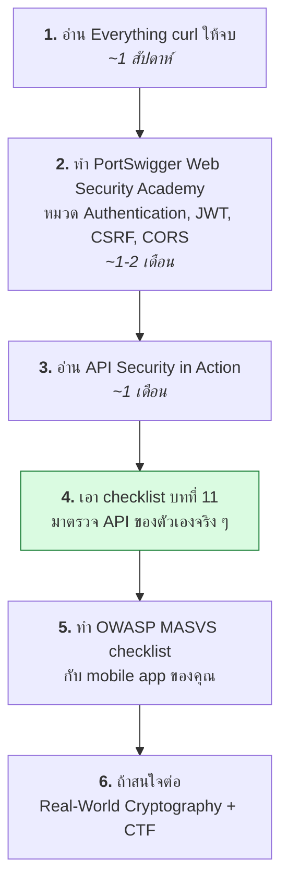

# บทที่ 23 · เรื่องพวกนี้เขาสอนกันในวิชาไหน

> คำถามที่คุณถามระหว่างทาง: "นักศึกษา computer science ได้เรียนไหม"
> คำตอบสั้น ๆ คือ **ได้เรียนบางส่วน แต่ไม่ครบ และส่วนที่ขาดคือส่วนที่ใช้ทำงานจริงมากที่สุด**

## 23.1 แผนที่: เรื่องไหนอยู่ในวิชาอะไร

| บทในคอร์สนี้ | วิชาในหลักสูตร CS/CPE | ปกติเรียนปีไหน |
|--------------|------------------------|----------------|
| 01 HTTP พื้นฐาน | **เครือข่ายคอมพิวเตอร์** (Computer Networks) | ปี 3 |
| 02 curl | ❌ **ไม่มีวิชาไหนสอน** | — |
| 03-05 form, cookie, session, redirect | **การพัฒนาเว็บ** (Web Programming) | ปี 2-3 |
| 06 encoding, UTF-8 | **โครงสร้างข้อมูล / ระบบปฏิบัติการ** (แตะนิดเดียว) | ปี 2 |
| 07 TLS/HTTPS | **ความมั่นคงปลอดภัย / วิทยาการเข้ารหัส** | ปี 3-4 |
| 08 JSON API | **การพัฒนาเว็บ / วิศวกรรมซอฟต์แวร์** | ปี 3 |
| 09-10 auth, JWT | **ความมั่นคงปลอดภัยของระบบ** (ถ้ามีเปิด) | ปี 4 |
| 11 mobile auth design | ❌ **แทบไม่มีที่ไหนสอน** | — |
| 12 API design | **วิศวกรรมซอฟต์แวร์** (ผิวเผิน) | ปี 3 |
| 13 HMAC, signature | **วิทยาการเข้ารหัสลับ** (Cryptography) | ปี 4 |
| 14 DevTools | ❌ **ไม่มี** — เรียนรู้เอง | — |
| 15-16 CAPTCHA, PoW | **ความมั่นคงปลอดภัย** (บางที่พูดถึงตอนสอน blockchain) | ปี 4 |
| 17-18 Playwright | **การทดสอบซอฟต์แวร์** (ถ้ามี) | ปี 3-4 |
| 19 proxy/mitm | **ความมั่นคงปลอดภัยเครือข่าย** (ตอนสอน MITM attack) | ปี 4 |
| 20 shell scripting | **ระบบปฏิบัติการ** (แตะนิดเดียว) | ปี 2 |
| 21 debugging | ❌ **ไม่มีวิชาไหนสอนอย่างเป็นระบบ** | — |
| 22 จริยธรรม | **จริยธรรมวิชาชีพคอมพิวเตอร์** | ปี 4 |

**ข้อสังเกต: ช่องที่เขียนว่า ❌ คือเรื่องที่ใช้ทำงานจริงบ่อยที่สุด**
มหาวิทยาลัยสอน "ทำไม" (ทฤษฎี TCP/IP, ทฤษฎีการเข้ารหัส) ส่วน "ทำยังไง"
(curl, DevTools, การ debug ของจริง) มักต้องเรียนรู้เองหรือเรียนตอนทำงาน

นี่ไม่ใช่ข้อบกพร่องของหลักสูตรเสมอไป — ทฤษฎีอยู่ได้ 30 ปี ส่วนเครื่องมือเปลี่ยนทุก 3 ปี
แต่ก็ทำให้บัณฑิตจำนวนมากรู้ทฤษฎี TCP แต่ยิง `curl -v` ไม่เป็น

## 23.2 วิชาที่ควรตามหาถ้าเรียนอยู่

| ชื่อวิชา (ไทย/อังกฤษ) | ได้อะไรจากคอร์สนี้เพิ่ม |
|----------------------|------------------------|
| เครือข่ายคอมพิวเตอร์ / Computer Networks | บท 01, 05, 07 |
| ความมั่นคงปลอดภัยคอมพิวเตอร์ / Computer Security | บท 07, 09-11, 13, 15 |
| วิทยาการเข้ารหัสลับ / Cryptography | บท 06, 07, 13, 16 |
| การพัฒนาเว็บ / Web Application Development | บท 03-05, 08, 12 |
| วิศวกรรมซอฟต์แวร์ / Software Engineering | บท 12, 17, 20 |
| ระบบกระจาย / Distributed Systems | บท 12 (idempotency, retry) |
| การทดสอบซอฟต์แวร์ / Software Testing | บท 17-19 |

## 23.3 หนังสือ

### ระดับเริ่มต้น — เริ่มที่นี่

| หนังสือ | เรื่อง | หมายเหตุ |
|---------|-------|----------|
| **[Everything curl](https://everything.curl.dev/)** | curl ทั้งเล่ม | **ฟรี** เขียนโดยผู้สร้าง curl เอง — ตรงกับคอร์สนี้ที่สุด |
| **[MDN Web Docs — HTTP](https://developer.mozilla.org/en-US/docs/Web/HTTP)** | HTTP reference | ฟรี ดีที่สุดสำหรับเปิดหา |
| **HTTP: The Definitive Guide** (Gourley & Totty) | HTTP เชิงลึก | เก่า (2002) แต่พื้นฐานยังใช้ได้ดี |

### ระดับกลาง

| หนังสือ | เรื่อง |
|---------|-------|
| **Computer Networking: A Top-Down Approach** (Kurose & Ross) | ตำราเครือข่ายมาตรฐาน เริ่มจาก HTTP ลงไปหา TCP — เหมาะกับคนที่มาจากเว็บ |
| **API Design Patterns** (JJ Geewax) | ตรงกับบทที่ 12 มาก |
| **Web API Design** / **RESTful Web APIs** (Richardson) | ออกแบบ API |
| **Designing Data-Intensive Applications** (Kleppmann) | ระบบขนาดใหญ่ idempotency, consistency |

### ระดับสูง / ความปลอดภัย

| หนังสือ | เรื่อง |
|---------|-------|
| **The Web Application Hacker's Handbook** (Stuttard & Pinto) | คัมภีร์ของสาย web security — หนา แต่คุ้ม |
| **Real-World Cryptography** (David Wong) | ✅ **แนะนำที่สุดสำหรับคุณ** — HMAC, TLS, signature แบบใช้งานจริง ไม่เน้นคณิตศาสตร์ |
| **Serious Cryptography** (Aumasson) | crypto เชิงลึกกว่า |
| **API Security in Action** (Neil Madden) | ✅ ตรงกับบทที่ 9-13 มากที่สุด token, OAuth, mobile |
| **OAuth 2 in Action** (Richer & Sanso) | ถ้าจะทำ OAuth เต็มรูปแบบ |

**ถ้าจะซื้อแค่ 2 เล่มสำหรับงานที่คุณทำอยู่: _API Security in Action_ + _Real-World Cryptography_**

## 23.4 เอกสารมาตรฐานและ cheat sheet (ฟรีทั้งหมด)

| แหล่ง | ใช้ตอนไหน |
|-------|-----------|
| **[OWASP Cheat Sheet Series](https://cheatsheetseries.owasp.org/)** | ✅ เปิดก่อนออกแบบทุกฟีเจอร์ที่เกี่ยวกับ security |
| ↳ Authentication, Session Management, REST Security, JWT, Password Storage | ตรงกับบท 09-13 |
| ↳ [Bot Management and Anti-Automation](https://cheatsheetseries.owasp.org/cheatsheets/Bot_Management_and_Anti_Automation_Cheat_Sheet.html) | ตรงกับบท 15 |
| **[OWASP ASVS](https://owasp.org/www-project-application-security-verification-standard/)** | checklist ตรวจระบบก่อนขึ้น production |
| **[OWASP MASVS](https://mas.owasp.org/)** | ✅ มาตรฐานความปลอดภัย **mobile app** โดยเฉพาะ |
| **[OWASP API Security Top 10](https://owasp.org/API-Security/)** | 10 ช่องโหว่ API ที่พบบ่อยที่สุด |
| **[ALTCHA docs](https://altcha.org/docs/)** + [source](https://github.com/altcha-org/altcha-lib) | บทที่ 16 |
| **[Playwright docs](https://playwright.dev/python/docs/intro)** | บท 17-18 |
| **RFC** ([9110](https://www.rfc-editor.org/rfc/rfc9110) HTTP semantics, [6749](https://www.rfc-editor.org/rfc/rfc6749) OAuth 2.0, [7519](https://www.rfc-editor.org/rfc/rfc7519) JWT, [6265](https://www.rfc-editor.org/rfc/rfc6265) Cookie) | เมื่อต้องการคำตอบที่แน่นอนที่สุด |

> RFC อ่านยากตอนแรก แต่เป็นแหล่งความจริงสุดท้าย เวลาที่เอกสารสองที่ขัดแย้งกัน
> ให้เชื่อ RFC

## 23.5 คอร์สออนไลน์

| คอร์ส | เรื่อง |
|-------|-------|
| **Stanford CS144** — Computer Networking | ฟรี มี lab ให้เขียน TCP เอง |
| **MIT 6.858** — Computer Systems Security | ฟรี วิดีโอ + lab |
| **[PortSwigger Web Security Academy](https://portswigger.net/web-security)** | ✅ **ฟรี มี lab ให้เจาะจริง** — ดีที่สุดสำหรับ web security |
| **[Hacker101](https://www.hacker101.com/)** | ฟรี จาก HackerOne |
| **[TryHackMe](https://tryhackme.com/) / [HackTheBox](https://www.hackthebox.com/)** | ฝึกมือ มีทั้งฟรีและเสียเงิน |

**PortSwigger Web Security Academy คือสิ่งที่ผมแนะนำที่สุดในตารางนี้** —
ฟรีทั้งหมด มี lab ให้ลงมือจริง ครอบคลุม auth, JWT, CSRF, CORS ตรงกับบท 09-13

## 23.6 Certificate (ถ้าสนใจสายอาชีพ)

| Cert | เหมาะกับ |
|------|----------|
| **CompTIA Security+** | พื้นฐานความปลอดภัย เริ่มต้นดี |
| **Burp Suite Certified Practitioner** | web security เชิงปฏิบัติ ราคาไม่แพง |
| **OSCP** | pentest จริงจัง สอบ 24 ชั่วโมง ยากและมีชื่อเสียง |
| **eWPT / eWPTX** | web pentest |

> cert ไม่จำเป็นสำหรับงาน dev ทั่วไป — portfolio และ CTF write-up มีค่ากว่าในหลายกรณี
> แต่ถ้าจะเข้าสาย security โดยตรง OSCP ยังเป็นใบเบิกทางที่คนยอมรับ

## 23.7 เส้นทางต่อจากคอร์สนี้

จบคอร์สนี้แล้ว ผมแนะนำตามลำดับนี้:

**ข้อ 4 สำคัญที่สุด** — ความรู้จะติดตัวก็ต่อเมื่อเอาไปใช้กับของจริงที่คุณเป็นเจ้าของ

## 23.8 นิสัยที่ทำให้เก่งขึ้นเรื่อย ๆ

- **เปิด DevTools Network tab ทิ้งไว้** ตอนใช้เว็บทั่วไป แล้วสังเกตว่าเขาทำอะไร
- **แปลง request ที่เจอเป็น curl** ทุกครั้งที่สงสัย — 5 นาทีต่อครั้ง แต่ทบต้นเร็วมาก
- **อ่าน source ของ library ที่ใช้** โดยเฉพาะส่วน auth
- **เขียนบันทึกทุกครั้งที่แก้บั๊กยาก ๆ ได้** — บันทึกสั้น ๆ วันนี้ คือคอร์สของตัวเองในอีกหนึ่งปี
- **ทำ lab ของตัวเอง** เวลาอยากเข้าใจอะไร สร้าง server เล็ก ๆ ที่จำลองพฤติกรรมนั้น
  แล้วทดลองกับมัน — เร็วกว่าอ่านเอกสารมาก

## แบบฝึกหัด

1. เลือก 1 หนังสือจาก 23.3 แล้วอ่านบทแรกภายในสัปดาห์นี้
2. สมัคร PortSwigger Web Security Academy แล้วทำ lab หมวด Authentication ให้ครบ
3. เปิด OWASP MASVS แล้วเช็ค mobile app ของคุณว่าผ่านกี่ข้อ
4. อ่าน RFC 6265 (Cookie) ส่วนที่ 4.1 แล้วเทียบกับบทที่ 4 ว่าตรงกันไหม
5. เอา checklist ในบทที่ 11.11 มาตรวจ API ของคุณ แล้วเขียนรายการสิ่งที่ต้องแก้

***

## จบส่วนพื้นฐานแล้ว 🎉

คุณผ่านมา 23 บทตั้งแต่ "HTTP คืออะไร" จนถึงการออกแบบ authentication ให้ mobile API
และการ reverse-engineer flow ของ CAPTCHA

บทที่เหลือของหนังสือเจาะลึกต่อไปอีกสามด้าน:

- **การออกแบบระบบให้อยู่รอด** — authorization, injection/SSRF, ฐานข้อมูล, observability
- **เครื่องมือของคนทำงาน** — git, TCP/IP, การเขียนเทสต์, concurrency
- **ความปลอดภัยในภาพกว้าง** — ระบบปฏิบัติการ, malware, เส้นทางอาชีพ

ดูสารบัญด้านซ้ายว่าอยากไปเรื่องไหนก่อน

***
[⬅ สร้างห้องแล็บของตัวเอง](45-home-lab.md) · [สารบัญ](../README.md) · [Lab Server ➡](../lab/README.md)
