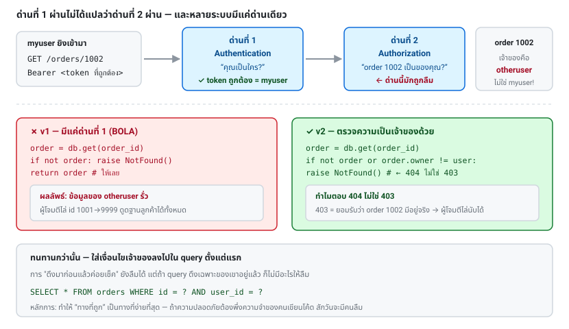

# บทที่ 24 · Authorization และ BOLA/IDOR

> บท 09-11 สอนว่า **"คุณเป็นใคร"** (authentication)
> บทนี้สอน **"คุณแตะข้อมูลชิ้นนี้ได้ไหม"** (authorization) — คนละเรื่องกันโดยสิ้นเชิง
>
> และนี่คือช่องโหว่**อันดับ 1** ของ OWASP API Security Top 10

## 24.1 ปัญหาในหนึ่งภาพ {#s24-1}

```
GET /v1/orders/1002
Authorization: Bearer <token ที่ถูกต้องของ myuser>

  ↓ server ตรวจ token → ผ่าน ✅ "คนนี้คือ myuser จริง"
  ↓ server ส่งข้อมูล order 1002 กลับไป

แต่ order 1002 เป็นของ otheruser 😱
```

**token ถูกต้อง ไม่ได้แปลว่ามีสิทธิ์ดูของชิ้นนั้น**

ช่องโหว่นี้มีสองชื่อที่ใช้แทนกันได้:

- **IDOR** (Insecure Direct Object Reference) — ชื่อเดิม
- **BOLA** (Broken Object Level Authorization) — ชื่อใน OWASP API Security Top 10 (API1)



## 24.2 ทำไมถึงพบบ่อยมากใน mobile API {#s24-2}

1. **แอปส่ง id ตรง ๆ มา** — `GET /orders/1002` เป็นรูปแบบที่เป็นธรรมชาติที่สุด
2. **นักพัฒนาคิดว่า "แอปเราส่งเฉพาะ id ของตัวเองอยู่แล้ว"** — แต่คนที่ใช้ curl ส่งอะไรก็ได้
   (ย้อนกลับไปกฎเหล็กใน[บทที่ 15](15-captcha-and-antibot.md): **อย่าให้ความปลอดภัยขึ้นกับ client**)
3. **middleware ตรวจ auth ให้แล้ว** — ทำให้รู้สึกว่า "ปลอดภัยแล้ว" ทั้งที่ middleware
   ตรวจได้แค่ว่า token ใช้ได้ ไม่รู้เรื่องความเป็นเจ้าของข้อมูล
4. **หาไม่เจอด้วย scanner อัตโนมัติ** — เพราะ scanner ไม่รู้ว่าข้อมูลไหนควรเป็นของใคร

## 24.3 ลองเจาะ lab ด้วยตัวเอง {#s24-3}

lab มีสองเวอร์ชันให้เทียบกัน

```bash
B=http://127.0.0.1:8080

# login เป็น myuser (เจ้าของ order 1001, 1003)
A=$(curl -s --json '{"username":"myuser","password":"mypass"}' $B/api/token | jq -r .access_token)

# order 1002 เป็นของ otheruser — ลองดูสิ
curl -s -H "Authorization: Bearer $A" $B/api/v1/orders/1002 | jq
```

```json
{
  "data": {"id": 1002, "owner": "otheruser", "item": "API Security in Action", "amount": 189000},
  "warning": "endpoint นี้มีช่องโหว่ BOLA"
}
```

**ข้อมูลของคนอื่นรั่วออกมาแล้ว** ทั้งที่ token ถูกต้องทุกประการ

เวอร์ชันที่แก้แล้ว:

```bash
curl -s -H "Authorization: Bearer $A" $B/api/v2/orders/1002 | jq
# → {"error": "not_found", "message": "ไม่พบคำสั่งซื้อนี้"}

curl -s -H "Authorization: Bearer $A" $B/api/v2/orders/1001 | jq .data.item
# → "Everything curl"   (ของตัวเอง ดูได้ปกติ)
```

**ผู้โจมตีตัวจริงจะไม่หยุดที่ id เดียว** — เขาจะไล่ทั้งช่วง:

```bash
for id in $(seq 1001 1004); do
    printf '%s: ' "$id"
    curl -s -H "Authorization: Bearer $A" "$B/api/v1/orders/$id" | jq -c '.data.item // .error'
done
```

นี่คือเหตุผลที่ช่องโหว่นี้อันตราย — ดูดข้อมูลลูกค้าทั้งฐานได้ในไม่กี่นาที

## 24.4 วิธีแก้: ตรวจความเป็นเจ้าของทุกครั้ง {#s24-4}

```python
def get_order(order_id: int, current_user: str):
    order = db.get_order(order_id)

    # ❌ ผิด — ตรวจแค่ว่ามีอยู่จริง
    if not order:
        raise NotFound()
    return order

    # ✅ ถูก — ตรวจว่าเป็นของคนที่ขอด้วย
    if not order or order.owner != current_user:
        raise NotFound()        # ← สังเกตว่าตอบ 404 ไม่ใช่ 403
    return order
```

### ทำไมตอบ 404 ไม่ใช่ 403

```
403 "คุณไม่มีสิทธิ์ดู order 1002"  → บอกผู้โจมตีว่า order 1002 มีอยู่จริง
404 "ไม่พบ"                        → ไม่บอกอะไรเลย
```

ถ้าตอบ 403 ผู้โจมตีจะไล่หาได้ว่า id ไหนมีข้อมูลอยู่ (**object enumeration**)
ซึ่งเป็นข้อมูลที่มีค่าในตัวมันเอง เช่น รู้จำนวนลูกค้า หรือรู้ว่าคนนี้เป็นลูกค้าหรือเปล่า

> เป็นหลักการเดียวกับ "ตอบ error เท่ากันเสมอ" ตอน login ใน[บทที่ 11.10](11-mobile-api-auth-design.md#s11-10)

**ข้อยกเว้น**: ในระบบที่ผู้ใช้ *รู้อยู่แล้ว* ว่าทรัพยากรนั้นมีอยู่ (เช่นเอกสารที่แชร์กันในทีม
แต่คุณไม่ได้อยู่ในทีมนั้น) การตอบ 403 ชัดเจนกว่าและช่วยผู้ใช้มากกว่า

## 24.5 วิธีที่ทนทานกว่า: query ให้ปลอดภัยตั้งแต่ต้น {#s24-5}

การ "ดึงมาก่อนแล้วค่อยเช็ค" ยังพลาดได้ถ้าลืมเช็ค ทางที่ดีกว่าคือ
**ใส่เงื่อนไขเจ้าของลงไปใน query เลย**

```python
# ❌ ดึงมาก่อน แล้วค่อยเช็ค (ลืมได้)
order = db.query("SELECT * FROM orders WHERE id = ?", order_id)
if order.owner != user: ...

# ✅ ดึงเฉพาะที่เป็นของเขาตั้งแต่แรก
order = db.query(
    "SELECT * FROM orders WHERE id = ? AND user_id = ?", order_id, user.id
)
if not order:
    raise NotFound()
```

ยิ่งดีขึ้นไปอีก: **ทำให้ทุก query ผ่าน scope ของผู้ใช้เสมอ**

```python
class UserScope:
    """ทุก query ที่ออกจากที่นี่ ถูกจำกัดที่ user คนนี้แล้วโดยอัตโนมัติ"""
    def __init__(self, user_id):
        self.user_id = user_id

    def orders(self):
        return Order.where(user_id=self.user_id)

# ใช้งาน — ไม่มีทางลืมเช็คเพราะไม่มีทางเข้าถึง order ของคนอื่นได้เลย
scope = UserScope(current_user.id)
order = scope.orders().find(order_id)
```

**หลักการ: ทำให้ "ทางที่ถูก" เป็นทางที่ง่ายที่สุด** ถ้าการเขียนโค้ดที่ปลอดภัย
ต้องอาศัยการที่ทุกคนจำได้ทุกครั้ง สักวันจะมีคนลืม

## 24.6 BOLA ซ่อนอยู่ที่ไหนได้อีก {#s24-6}

อย่าตรวจแค่ `GET /resource/{id}` — จุดที่คนลืมบ่อย:

| จุด | ตัวอย่าง |
|-----|----------|
| **Nested resource** | `GET /orders/1001/items/55` — เช็ค order แล้ว แต่ลืมเช็คว่า item 55 อยู่ใน order นั้นจริง |
| **PATCH/DELETE** | คนมักเช็คแค่ตอน GET ลืมตอนแก้/ลบ ซึ่งอันตรายกว่า |
| **Bulk operation** | `POST /orders/bulk-delete` กับ `{"ids": [1001,1002,...]}` — ต้องเช็คทุก id |
| **ไฟล์** | `GET /files/report.pdf` หรือ `GET /avatars/{user_id}.jpg` |
| **Query parameter** | `GET /orders?user_id=2` — ผู้ใช้ส่ง user_id เองได้! |
| **ค่าที่ซ่อนใน body** | `PATCH /orders/1001` กับ `{"user_id": 999}` (ดู mass assignment [บทที่ 25](25-input-validation-and-injection.md)) |
| **Export / รายงาน** | endpoint ที่ดึงข้อมูลเป็นชุด มักถูกลืม |
| **Webhook / callback** | `GET /webhooks/{id}/deliveries` |
| **GraphQL** | ตรวจที่ resolver ของแต่ละ field ไม่ใช่แค่ที่ query ชั้นบนสุด |

**กฎง่าย ๆ: ทุกที่ที่มี id มาจาก client คือจุดที่ต้องตรวจ**

## 24.7 UUID ไม่ใช่การป้องกัน {#s24-7}

ใน[บทที่ 12](12-api-design-practices.md) ผมแนะนำ UUID/ULID แทน auto-increment ซึ่งดีจริง — **แต่เพื่อคนละเหตุผล**

```
auto-increment (1, 2, 3...)  → เดา id คนอื่นได้ทันที
UUID                          → เดายาก แต่ id รั่วออกไปได้เสมอ
```

id หลุดออกไปได้ง่ายกว่าที่คิด: จาก URL ที่ผู้ใช้ก๊อปแชร์, จาก log, จาก `Referer`,
จาก response ของ endpoint อื่น, จากรูปที่แชร์

**UUID = ลดโอกาสถูกไล่เดา (defense in depth) ไม่ใช่การควบคุมสิทธิ์**
ยังต้องเช็คความเป็นเจ้าของเสมอ

## 24.8 ญาติของ BOLA ที่ควรรู้จักด้วย {#s24-8}

### BFLA — Broken Function Level Authorization (API5)

ผู้ใช้ธรรมดาเรียก endpoint ของ admin ได้

```bash
# แอปไม่แสดงปุ่มนี้ให้ user ธรรมดา แต่ endpoint ยังเปิดอยู่
curl -X DELETE -H "Authorization: Bearer $USER_TOKEN" $B/v1/admin/users/42
```

**การซ่อนปุ่มใน UI ไม่ใช่การควบคุมสิทธิ์** — ต้องเช็ค role ที่ server ทุก endpoint

### BOPLA — Broken Object Property Level Authorization (API3)

มีสิทธิ์ดู object นั้น แต่ไม่ควรเห็น/แก้ทุก field

```json
// ผู้ใช้ดู profile ตัวเองได้ แต่ไม่ควรเห็น field พวกนี้
{"id": 1, "name": "...", "password_hash": "...", "internal_risk_score": 88}
```

**ทางแก้: ใช้ serializer ที่ระบุ field ชัดเจน อย่าโยน object จาก DB ออกไปตรง ๆ**

```python
# ❌
return jsonify(user.__dict__)

# ✅ allowlist
return jsonify({"id": user.id, "name": user.name, "email": user.email})
```

## 24.9 ออกแบบระบบสิทธิ์ {#s24-9}

| รูปแบบ | เหมาะกับ | ตัวอย่าง |
|--------|----------|----------|
| **Ownership check** | ระบบส่วนใหญ่ | `order.owner == user` |
| **RBAC** (ตาม role) | มีบทบาทชัดเจน | `user.role in ("admin", "staff")` |
| **ABAC** (ตามคุณสมบัติ) | เงื่อนไขซับซ้อน | "แก้ได้ถ้าสถานะยัง draft และเป็นเจ้าของ" |
| **ReBAC** (ตามความสัมพันธ์) | แชร์กันเป็นทีม/องค์กร | Google Zanzibar, OpenFGA |

**เริ่มจาก ownership check ก่อนเสมอ** อย่าเพิ่งไปสร้างระบบสิทธิ์ที่ซับซ้อน
ถ้ายังไม่มีความต้องการจริง — แต่ให้เขียนโค้ดในที่เดียว (ฟังก์ชัน `can(user, action, object)`)
เพื่อให้ขยายได้ทีหลังโดยไม่ต้องไล่แก้ทั้งระบบ

```python
def can(user, action: str, obj) -> bool:
    """จุดเดียวที่ตัดสินใจเรื่องสิทธิ์ทั้งระบบ - test ง่าย แก้ง่าย audit ง่าย"""
    if user.role == "admin":
        return True
    if isinstance(obj, Order):
        return obj.user_id == user.id and (action == "read" or obj.status == "draft")
    return False
```

## 24.10 ทดสอบว่ามีช่องโหว่ไหม {#s24-10}

**การทดสอบ BOLA ต้องมี 2 บัญชี** — สร้าง token ของทั้งคู่ แล้วเอาของ A ไปแตะของ B

```bash
#!/usr/bin/env bash
# ทดสอบ BOLA อัตโนมัติ — เอาไปใส่ CI ได้
set -euo pipefail
B=http://127.0.0.1:8080

token() {
    curl -s --json "$(jq -nc --arg u "$1" --arg p "$2" '{username:$u,password:$p}')" \
        "$B/api/token" | jq -r .access_token
}

A_TOKEN=$(token myuser mypass)
FAIL=0

# order 1002 และ 1004 เป็นของ otheruser — myuser ต้องเข้าไม่ได้
for id in 1002 1004; do
    for ver in v1 v2; do
        code=$(curl -s -o /dev/null -w '%{http_code}' \
               -H "Authorization: Bearer $A_TOKEN" "$B/api/$ver/orders/$id")
        if [[ "$code" == "200" ]]; then
            echo "❌ BOLA: $ver/orders/$id เข้าถึงได้ด้วย token ของ myuser"
            FAIL=1
        else
            echo "✅ $ver/orders/$id → HTTP $code"
        fi
    done
done
exit $FAIL
```

**เขียนเทสต์แบบนี้ให้ทุก endpoint ที่รับ id** แล้วใส่ใน CI — นี่คือวิธีเดียว
ที่จะมั่นใจได้ว่าโค้ดใหม่ไม่เปิดช่องกลับมาอีก

## 24.11 Checklist {#s24-11}

- [ ] ทุก endpoint ที่รับ id จาก client มีการตรวจความเป็นเจ้าของ
- [ ] ตรวจครบทั้ง GET / PATCH / PUT / DELETE ไม่ใช่แค่ GET
- [ ] nested resource ตรวจความสัมพันธ์ครบทุกชั้น
- [ ] bulk operation ตรวจทุก id ในลิสต์
- [ ] endpoint ที่รับ `user_id` เป็น parameter — เช็คว่าตรงกับ token
- [ ] ตอบ 404 (ไม่ใช่ 403) เมื่อไม่ใช่ของเขา เพื่อกัน enumeration
- [ ] endpoint ของ admin ตรวจ role ที่ server ไม่ใช่แค่ซ่อนปุ่มใน UI
- [ ] response ใช้ allowlist ของ field ไม่โยน DB object ออกไปตรง ๆ
- [ ] logic เรื่องสิทธิ์อยู่ในที่เดียว (`can()`) ไม่กระจายทั่วโค้ด
- [ ] มีเทสต์ BOLA ด้วย 2 บัญชี อยู่ใน CI
- [ ] log ทุกครั้งที่มีคนพยายามเข้าถึงของที่ไม่ใช่ของตัวเอง (สัญญาณการโจมตี)

## แบบฝึกหัด

1. เจาะ `/api/v1/orders/1002` ด้วย token ของ myuser ให้สำเร็จ แล้วอ่านโค้ด
   `api_order` ใน [lab/server.py](../lab/server.py) ว่า v1 กับ v2 ต่างกันบรรทัดไหน
2. เขียนลูปที่ไล่ id 1001-1004 แล้วดูว่า v1 รั่วอะไรบ้าง
3. รันสคริปต์ทดสอบใน[ข้อ 24.10](#s24-10) แล้วยืนยันว่า v1 fail และ v2 pass
4. เพิ่ม endpoint `PATCH /api/v2/orders/{id}` ที่แก้ `item` ได้ — พร้อมตรวจสิทธิ์ให้ถูก
   แล้วลองแก้ order ของ otheruser ดูว่าถูกปฏิเสธ
5. เพิ่ม `GET /api/v2/orders?user_id=` แล้วตอบคำถาม: ถ้าเชื่อ `user_id` ที่ client ส่งมา
   จะเกิดอะไรขึ้น ควรทำอย่างไรแทน
6. เขียนฟังก์ชัน `can(user, action, obj)` แล้ว refactor `api_order` ให้เรียกใช้
7. เพิ่ม role `admin` ที่ดู order ได้ทุกใบ แล้วเขียนเทสต์ว่า user ธรรมดายังดูไม่ได้

***
[⬅ Webhook และ HMAC Signature](13-webhooks-and-hmac.md) · [สารบัญ](../README.md) · [Input validation, Injection, SSRF แล ➡](25-input-validation-and-injection.md)
