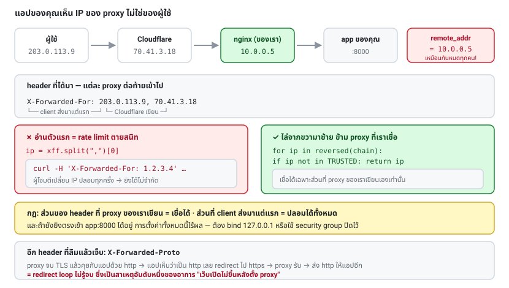

# บทที่ 26 · Reverse proxy, X-Forwarded-For, Caching และ CDN

> บทที่ 12 บอกให้ทำ rate limit ตาม IP
> บทนี้บอกว่า **ถ้าไม่รู้เรื่อง `X-Forwarded-For` rate limit นั้นจะไม่ทำงาน**
> — หรือแย่กว่านั้นคือบล็อกผู้ใช้ทั้งโลกพร้อมกัน

## 26.1 ของจริงไม่มีใครให้ app แตะอินเทอร์เน็ตตรง ๆ

```
ผู้ใช้ ──▶ CDN/WAF ──▶ Load Balancer ──▶ nginx ──▶ app ของคุณ
        (Cloudflare)     (ALB)        (reverse proxy)  (:8000)
```

reverse proxy ทำหน้าที่: จบ TLS, กระจายโหลด, บีบอัด, เสิร์ฟ static file,
จำกัดขนาด request, และกรอง traffic ก่อนถึงแอป

**ผลข้างเคียงที่ต้องรู้: แอปของคุณจะเห็น IP ของ proxy ไม่ใช่ของผู้ใช้**

## 26.2 ปัญหา IP — ลองด้วยตัวเอง

```bash
B=http://127.0.0.1:8080

curl -s $B/api/echo-ip | jq
curl -s -H 'X-Forwarded-For: 203.0.113.9' $B/api/echo-ip | jq -c '{remote_addr, x_forwarded_for}'
```

```json
{"remote_addr": "127.0.0.1", "x_forwarded_for": "203.0.113.9"}
```

ในของจริง `remote_addr` จะเป็น IP ของ nginx (เช่น `10.0.0.5`) **เหมือนกันหมดทุกคน**
ถ้าเอาไปทำ rate limit → ผู้ใช้ทุกคนแชร์โควตาเดียวกัน → ระบบล่มด้วยตัวเอง

### หน้าตาของ header

```
X-Forwarded-For: 203.0.113.9, 70.41.3.18, 150.172.238.178
                 └─ ผู้ใช้จริง ─┘  └─ proxy1 ─┘  └─ proxy2 ─┘
```

แต่ละ proxy **ต่อท้าย** IP ของคนที่คุยกับมันเข้าไป

มาตรฐานใหม่กว่าคือ `Forwarded` (RFC 7239) แต่ `X-Forwarded-For` ยังใช้กันแพร่หลายกว่ามาก

## 26.3 ⚠️ ห้ามเชื่อ X-Forwarded-For ทั้งก้อน

```bash
# ใครก็ปลอมได้ในหนึ่งบรรทัด
curl -H 'X-Forwarded-For: 1.2.3.4' https://api.myapp.com/v1/login
```

ถ้าคุณอ่านตัวแรกของ header มาใช้ทำ rate limit **ผู้โจมตีเปลี่ยน IP ปลอมทุก request
แล้วยิงได้ไม่จำกัด** — rate limit ตายสนิท

### วิธีที่ถูกต้อง: นับจากขวามาซ้าย

```python
TRUSTED_PROXIES = [ipaddress.ip_network("10.0.0.0/8")]   # proxy ของเราเอง

def client_ip(remote_addr: str, xff_header: str | None) -> str:
    """
    ไล่จากขวา (ใกล้เราที่สุด) มาซ้าย ข้าม IP ที่เป็น proxy ที่เราเชื่อ
    ตัวแรกที่ไม่ใช่ proxy ของเรา = IP จริงของผู้ใช้
    """
    if not xff_header:
        return remote_addr

    chain = [p.strip() for p in xff_header.split(",")]
    for candidate in reversed(chain):
        try:
            ip = ipaddress.ip_address(candidate)
        except ValueError:
            break                                    # ค่าเสีย = หยุด
        if not any(ip in net for net in TRUSTED_PROXIES):
            return str(ip)                           # เจอ IP จริง
    return remote_addr
```

**หลักการ: ส่วนของ header ที่ proxy ของเราเขียนเองเท่านั้นที่เชื่อได้
ส่วนที่ client ส่งมาแต่แรกปลอมได้ทั้งหมด**

**ตั้งค่าให้ถูกในแต่ละที่:**

| ระบบ | ตั้งอย่างไร |
|------|------------|
| nginx | `set_real_ip_from 10.0.0.0/8;` + `real_ip_header X-Forwarded-For;` |
| Express | `app.set('trust proxy', 1)` — **ตัวเลขคือจำนวน proxy ห้ามใส่ `true`** |
| Django | ใช้ `django-ipware` อย่าอ่าน `HTTP_X_FORWARDED_FOR` เอง |
| Cloudflare | ใช้ `CF-Connecting-IP` (เชื่อได้เพราะ CF เขียนทับเสมอ) + จำกัดให้รับเฉพาะ IP ของ CF |
| ALB/ELB | ตัวสุดท้ายก่อน proxy ของ AWS |

> **`trust proxy: true` ใน Express = เชื่อทุก header ที่ส่งมา** = ช่องโหว่
> ต้องใส่จำนวนชั้นของ proxy ที่มีจริง

**ที่สำคัญที่สุด: ปิดไม่ให้คนยิงตรงเข้า app ได้** ถ้ายังเข้า `app:8000` ตรงได้
การตั้งค่าอะไรก็ไร้ผล — bind ที่ `127.0.0.1` หรือใช้ security group



## 26.4 Header อื่นที่ proxy ส่งมา

| Header | บอกอะไร | ทำไมสำคัญ |
|--------|---------|-----------|
| `X-Forwarded-For` | IP ผู้ใช้ | rate limit, log, geo |
| `X-Forwarded-Proto` | `http` หรือ `https` | **แอปคิดว่าเป็น http แล้วสร้าง URL ผิด / redirect วน** |
| `X-Forwarded-Host` | Host เดิม | สร้าง absolute URL ให้ถูก |
| `X-Real-IP` | IP ผู้ใช้ (nginx) | ทางเลือกของ XFF |
| `CF-Connecting-IP` | IP ผู้ใช้ (Cloudflare) | เชื่อได้กว่า XFF ถ้าจำกัด IP ต้นทาง |

**`X-Forwarded-Proto` เป็นสาเหตุอันดับหนึ่งของ redirect loop** — proxy จบ TLS แล้ว
คุยกับแอปด้วย http แอปเห็นว่าเป็น http เลย redirect ไป https → proxy รับ → ส่ง http
ให้แอปอีก → วนไม่จบ

## 26.5 Caching — ประหยัดเน็ตผู้ใช้มือถือ

### Cache-Control

```http
Cache-Control: no-store                      # ห้ามเก็บเลย (ข้อมูลอ่อนไหว/ส่วนตัว)
Cache-Control: no-cache                      # เก็บได้ แต่ต้องถามก่อนใช้ทุกครั้ง
Cache-Control: private, max-age=60           # เก็บได้เฉพาะที่ client 60 วินาที
Cache-Control: public, max-age=31536000, immutable   # static file ที่มี hash ในชื่อ
Cache-Control: public, max-age=60, stale-while-revalidate=300
```

| directive | ความหมาย |
|-----------|----------|
| `private` | เฉพาะเบราว์เซอร์/แอปเก็บได้ **CDN ห้ามเก็บ** |
| `public` | CDN เก็บได้ |
| `max-age=N` | สดอยู่ N วินาที |
| `no-store` | ห้ามเขียนลง disk เลย |
| `stale-while-revalidate` | ใช้ของเก่าไปก่อนระหว่างที่ดึงใหม่เบื้องหลัง (UX ดีมาก) |
| `immutable` | ไม่มีวันเปลี่ยน ไม่ต้องถามซ้ำ |

> ⚠️ **ข้อมูลที่ผูกกับผู้ใช้ต้องเป็น `private` เสมอ** ถ้าเผลอใส่ `public`
> CDN จะเอา response ของ user A ไปเสิร์ฟให้ user B — เป็นเหตุการณ์ที่เกิดขึ้นจริงบ่อย
>
> **กฎ: endpoint ที่ต้องใช้ `Authorization` header → `Cache-Control: private`
> หรือ `no-store` เท่านั้น**

### ETag และ 304 — ลองในlab

```bash
B=http://127.0.0.1:8080

# ครั้งแรก: ได้ข้อมูลเต็ม + ETag
ET=$(curl -s -D - -o /dev/null $B/api/cached | grep -i '^etag' | tr -d '\r' | awk '{print $2}')
echo "ETag: $ET"

# ครั้งที่สอง: ส่ง ETag กลับไปถาม
curl -s -o /dev/null -w 'HTTP %{http_code}  ได้ %{size_download} bytes\n' \
     -H "If-None-Match: $ET" $B/api/cached
```

```
HTTP 304  ได้ 0 bytes
```

**ข้อมูลเดิมไม่ถูกส่งซ้ำเลย** ผู้ใช้มือถือประหยัดทั้งเน็ตและแบต

โค้ดฝั่ง server (ดู `api_cached` ใน [lab/server.py](../lab/server.py)):

```python
etag = '"' + hashlib.sha256(body).hexdigest()[:16] + '"'
if self.headers.get("If-None-Match") == etag:
    return self.send_response(304)      # ไม่ส่ง body
```

**ETag vs Last-Modified:**

| | ETag | Last-Modified |
|---|------|---------------|
| แม่นยำ | ✅ ตรวจเนื้อหาจริง | ⚠️ ละเอียดแค่ระดับวินาที |
| ต้นทุน | ต้องคำนวณ hash | ถูกกว่า |
| header ที่ client ส่งกลับ | `If-None-Match` | `If-Modified-Since` |

**strong vs weak ETag**: `W/"abc"` = weak หมายถึง "เนื้อหาเทียบเท่ากัน"
ใช้ได้เมื่อมีความต่างเล็กน้อยที่ไม่สำคัญ (เช่นลำดับ field)

### ETag ยังใช้กัน lost update ได้ด้วย

```bash
curl -X PATCH -H "If-Match: $ETAG" --json '{"item":"..."}' $B/api/v2/orders/1001
# → 412 Precondition Failed ถ้ามีคนอื่นแก้ไปก่อนแล้ว
```

เป็น **optimistic locking** ที่ทำงานผ่าน HTTP โดยตรง — ป้องกันกรณีสองคนแก้พร้อมกัน
แล้วคนที่บันทึกทีหลังทับงานของคนแรก

## 26.6 CDN

CDN เก็บสำเนาไว้ตามจุดต่าง ๆ ทั่วโลก ผู้ใช้ในไทยดึงจากเซิร์ฟเวอร์ในสิงคโปร์
แทนที่จะข้ามไปอเมริกา

**สิ่งที่ควรผ่าน CDN:** static file, รูป, ไฟล์ที่ผู้ใช้ดาวน์โหลด, response
สาธารณะที่ไม่เปลี่ยนบ่อย

**สิ่งที่ไม่ควร:** endpoint ที่ผูกกับผู้ใช้, endpoint ที่เปลี่ยนตลอด

### เรื่องที่ต้องระวัง

**Cache key** — CDN ตัดสินว่า "เป็น request เดียวกัน" จากอะไร (ปกติคือ URL)
ถ้า response ต่างกันตาม header ต้องบอกด้วย `Vary`:

```http
Vary: Accept-Language, Accept-Encoding
```

**อย่าใส่ `Vary: *` หรือ `Vary: User-Agent`** เพราะ cache จะแตกเป็นล้านชิ้นจนไร้ประโยชน์

**Cache poisoning** — ถ้า response เปลี่ยนตาม header ที่ไม่ได้อยู่ใน cache key
ผู้โจมตีอาจยัด response ที่เป็นอันตรายเข้าไปให้คนอื่นได้

**Purge/invalidation** — ต้องมีวิธีล้าง cache เมื่อข้อมูลเปลี่ยน
ทางที่ง่ายกว่าคือ **ใส่ hash ในชื่อไฟล์** (`app.a1b2c3.js`) แล้วตั้ง `immutable`
— ไม่ต้อง purge เลยเพราะไฟล์ใหม่คือชื่อใหม่

## 26.7 nginx ตัวอย่างสำหรับ API

```nginx
upstream app { server 127.0.0.1:8000; keepalive 32; }

server {
    listen 443 ssl http2;
    server_name api.myapp.com;

    ssl_protocols TLSv1.2 TLSv1.3;
    add_header Strict-Transport-Security "max-age=31536000" always;

    client_max_body_size 10m;          # กัน payload ยักษ์ (บทที่ 25)

    # เชื่อ XFF เฉพาะจาก proxy ของเรา
    set_real_ip_from 10.0.0.0/8;
    real_ip_header X-Forwarded-For;
    real_ip_recursive on;

    location / {
        proxy_pass http://app;
        proxy_set_header Host              $host;
        proxy_set_header X-Real-IP         $remote_addr;
        proxy_set_header X-Forwarded-For   $proxy_add_x_forwarded_for;
        proxy_set_header X-Forwarded-Proto $scheme;   # ← กัน redirect loop
        proxy_set_header X-Request-ID      $request_id;

        proxy_http_version 1.1;
        proxy_set_header Connection "";    # เปิด keep-alive ไปยัง app
        proxy_read_timeout 30s;
    }

    location /api/stream {
        proxy_pass http://app;
        proxy_buffering off;               # ← SSE ต้องปิด buffer ไม่งั้นข้อมูลค้าง
        proxy_read_timeout 3600s;
    }
}
```

**`$proxy_add_x_forwarded_for` ต่อท้าย ไม่ใช่เขียนทับ** — ถ้าใช้ `$remote_addr`
เฉย ๆ จะเสีย chain ไป

## 26.8 Connection reuse — เรื่องที่มีผลกับ mobile มาก

การเปิดการเชื่อมต่อใหม่ทุกครั้งแพงมากบนมือถือ (DNS + TCP + TLS handshake
อาจใช้ 300-500 ms บน 4G)

```bash
# วัดผลด้วยตัวเอง: 3 request แยกกัน vs 3 request ในการเชื่อมต่อเดียว
curl -s -o /dev/null -w 'แยก: %{time_total}\n' https://example.com/ https://example.com/ https://example.com/
```

- **ฝั่ง client**: ใช้ HTTP client ที่มี connection pool (OkHttp, `requests.Session`,
  `httpx.Client`) **อย่าสร้าง client ใหม่ทุก request** — นี่คือบั๊กประสิทธิภาพ
  ที่พบบ่อยที่สุดใน mobile app
- **ฝั่ง server**: เปิด `keepalive` ทั้งขาเข้าและขาไป app

**HTTP/2** ช่วยมากเพราะยิงหลาย request พร้อมกันบนการเชื่อมต่อเดียวได้
(ไม่มี head-of-line blocking แบบ HTTP/1.1) — เปิดที่ nginx ด้วย `listen 443 ssl http2;`

```bash
curl -sI --http2 https://example.com | head -1        # HTTP/2 200
curl -sI --http3 https://example.com | head -1        # ถ้า curl รองรับ
```

## 26.9 Checklist

- [ ] app ไม่เปิดให้ยิงตรงจากอินเทอร์เน็ต (bind `127.0.0.1` / security group)
- [ ] อ่าน client IP ผ่าน library ที่รู้จัก trusted proxy ไม่ใช่อ่าน header ดิบ
- [ ] rate limit ใช้ IP ที่ผ่านการตรวจแล้ว ไม่ใช่ตัวแรกของ XFF
- [ ] ส่ง `X-Forwarded-Proto` และแอปอ่านค่านี้ (กัน redirect loop)
- [ ] endpoint ที่ต้อง auth ตั้ง `Cache-Control: private` หรือ `no-store`
- [ ] endpoint ที่ข้อมูลไม่ค่อยเปลี่ยนมี ETag + รองรับ 304
- [ ] static file มี hash ในชื่อ + `immutable`
- [ ] `Vary` ตรงกับสิ่งที่ทำให้ response ต่างกันจริง
- [ ] `client_max_body_size` ตั้งไว้
- [ ] SSE/WebSocket ปิด `proxy_buffering`
- [ ] เปิด HTTP/2 และ keep-alive ทั้งสองฝั่ง

## แบบฝึกหัด

1. ยิง `/api/echo-ip` พร้อม `X-Forwarded-For` ปลอม ๆ แล้วดูว่า server เห็นอะไร
2. เขียนฟังก์ชัน `client_ip()` ตามข้อ 26.3 แล้วทดสอบกับ chain หลายชั้น
   รวมถึงกรณีที่ผู้โจมตีใส่ IP ปลอมนำหน้า
3. ทดสอบ ETag: ยิง `/api/cached` สองครั้ง ดูว่าครั้งที่สองได้ 0 bytes จริง
4. เพิ่ม `Cache-Control: private, max-age=60` ให้ `/api/me` แล้วอธิบายว่า
   ทำไมห้ามใช้ `public`
5. เพิ่มการรองรับ `If-Match` ให้ `PATCH /api/v2/orders/{id}` แล้วทดสอบว่าได้ 412
   เมื่อ ETag ไม่ตรง
6. ตั้ง nginx ตามข้อ 26.7 หน้า lab server แล้วยิงผ่านมัน ดูว่า `/api/echo-ip`
   รายงาน IP ถูกต้องไหม
7. วัดความต่างของเวลาระหว่างการยิง 10 request แบบแยกการเชื่อมต่อ กับแบบ reuse
   (`curl` ยิงหลาย URL ในคำสั่งเดียวจะ reuse ให้เอง)

***
[⬅ Input validation, Injection, SSRF แล](25-input-validation-and-injection.md) · [สารบัญ](../README.md) · [Database และ Performance ของ API ➡](27-database-and-performance.md)
