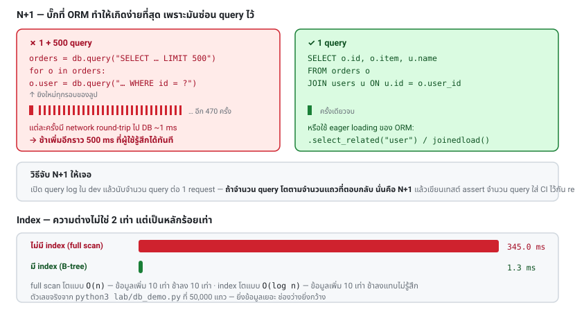

# บทที่ 27 · Database และ Performance ของ API

> API ส่วนใหญ่ไม่ได้ช้าเพราะภาษาที่ใช้เขียน
> แต่ช้าเพราะ **สิ่งที่เกิดขึ้นระหว่างแอปกับฐานข้อมูล**

รันตัวอย่างทั้งบทนี้ได้เลย:

```bash
python3 lab/db_demo.py
```

## 27.1 N+1 query — ปัญหาอันดับหนึ่ง {#s27-1}

```python
orders = db.query("SELECT id, user_id, item FROM orders LIMIT 500")
for o in orders:
    o.user_name = db.query("SELECT name FROM users WHERE id = ?", o.user_id)  # ← 500 query
```

1 query กลายเป็น **501 query** ORM ทำให้เกิดเรื่องนี้ง่ายมากเพราะมันซ่อนไว้:

```python
for order in Order.objects.all():
    print(order.user.name)        # ← แต่ละรอบยิง query เงียบ ๆ
```

**ผลลัพธ์จริงจาก lab:**

```
❌ N+1  (1 query + 500 query ในลูป)      0.9 ms
✅ JOIN  (query เดียว)                   0.2 ms
→ JOIN เร็วกว่า 4.5 เท่า
```

**ตัวเลขนี้ยังหลอกตาอยู่มาก** เพราะ sqlite อยู่ในหน่วยความจำเดียวกับโปรแกรม
ของจริง DB อยู่คนละเครื่อง แต่ละ query มี network round-trip ~1 ms:

```
500 query × 1 ms = ช้าขึ้นอีก 500 ms   ← ผู้ใช้รู้สึกได้ทันที
```

### วิธีแก้

```python
# 1. JOIN
db.query("SELECT o.id, o.item, u.name FROM orders o JOIN users u ON u.id = o.user_id")

# 2. ดึงทีเดียวด้วย IN (...) แล้วจับคู่ในโค้ด — ดีเมื่อ JOIN ทำให้ข้อมูลบวม
user_ids = {o.user_id for o in orders}
users = {u.id: u for u in db.query("SELECT * FROM users WHERE id IN (...)", user_ids)}
for o in orders:
    o.user_name = users[o.user_id].name

# 3. ใช้ eager loading ของ ORM
Order.objects.select_related("user")        # Django - JOIN
Order.objects.prefetch_related("items")     # Django - query ที่สองด้วย IN
session.query(Order).options(joinedload(Order.user))   # SQLAlchemy
```

**วิธีจับ N+1:** เปิด query logging ใน dev แล้วนับจำนวน query ต่อ 1 request
ถ้าจำนวน query โตตามจำนวนแถวที่ตอบกลับ = N+1

```python
# Django
LOGGING = {"loggers": {"django.db.backends": {"level": "DEBUG"}}}
```

**ทำให้เป็นเทสต์อัตโนมัติ** — assert ว่า endpoint นี้ใช้ query ไม่เกิน N ครั้ง
แล้วใส่ใน CI จะกัน regression ได้ดีกว่ามานั่งจับทีหลัง

## 27.2 Index {#s27-2}

```
❌ ไม่มี index (full table scan)      345.0 ms
✅ มี index                             1.3 ms
→ เร็วกว่า 271 เท่า
```

ไม่ใช่ 2 เท่า แต่ **271 เท่า** และยิ่งข้อมูลเยอะยิ่งต่างมากขึ้นเรื่อย ๆ:

| แถว | ไม่มี index | มี index (B-tree) |
|-----|-------------|-------------------|
| 1,000 | เร็ว | เร็ว |
| 100,000 | ช้า | เร็ว |
| 10,000,000 | ใช้ไม่ได้ | ยังเร็วอยู่ |

full scan โตแบบ **O(n)** ส่วน index โตแบบ **O(log n)**

### ควรใส่ index ที่ไหน

- ทุกคอลัมน์ที่อยู่ใน `WHERE`
- ทุก foreign key (`user_id`, `order_id`)
- คอลัมน์ที่ใช้ `ORDER BY` โดยเฉพาะเมื่อคู่กับ `LIMIT`
- คอลัมน์ที่ใช้ `JOIN`

### Composite index — ลำดับสำคัญมาก

```sql
CREATE INDEX idx_orders_user_created ON orders(user_id, created_at);
```

index นี้ช่วยได้กับ:
- ✅ `WHERE user_id = 5`
- ✅ `WHERE user_id = 5 ORDER BY created_at`
- ❌ `WHERE created_at > '...'` (ไม่มี user_id นำหน้า — **ใช้ไม่ได้**)

**กฎ leftmost prefix**: index ใช้ได้เมื่อ query ใช้คอลัมน์จากซ้ายไปขวาตามลำดับ
เรียงคอลัมน์ที่ใช้ `=` ไว้หน้า ตามด้วยคอลัมน์ที่ใช้ช่วง/เรียง

### ตรวจว่า DB ใช้ index จริงไหม

```sql
EXPLAIN ANALYZE SELECT ... ;         -- PostgreSQL
EXPLAIN SELECT ... ;                 -- MySQL
EXPLAIN QUERY PLAN SELECT ... ;      -- SQLite
```

จาก lab:

```
query plan: SEARCH orders USING COVERING INDEX idx_orders_user (user_id=?)
```

คำที่ต้องมองหา:

| เห็นคำนี้ | แปลว่า |
|-----------|--------|
| `SCAN` / `Seq Scan` | ❌ อ่านทั้งตาราง |
| `SEARCH` / `Index Scan` | ✅ ใช้ index |
| `COVERING INDEX` / `Index Only Scan` | ✅✅ ตอบได้จาก index ไม่ต้องแตะตารางเลย |

### index ไม่ได้ฟรี

- ทุก `INSERT`/`UPDATE`/`DELETE` ต้องอัปเดต index ด้วย → เขียนช้าลง
- กินพื้นที่ดิสก์
- **index ที่ไม่มีใครใช้คือภาระล้วน ๆ** — ตรวจด้วย `pg_stat_user_indexes` แล้วลบทิ้ง

สร้าง index บนตารางใหญ่ต้องใช้ `CREATE INDEX CONCURRENTLY` (PostgreSQL)
ไม่งั้นตารางถูกล็อกและ API ล่มระหว่างนั้น



## 27.3 อย่าดึงสิ่งที่ไม่ได้ใช้ {#s27-3}

```
❌ SELECT *                   4.8 ms
✅ เลือกเฉพาะที่ใช้            2.1 ms
```

`SELECT *` แย่กว่าที่ตัวเลขบอก เพราะมันยัง:
- ทำให้ **covering index ใช้ไม่ได้** (ต้องกลับไปอ่านตาราง)
- ดึงคอลัมน์ TEXT/BLOB ใหญ่ ๆ ที่ไม่ได้ใช้ผ่านสาย
- **พังเงียบ ๆ เมื่อมีคนเพิ่มคอลัมน์** — และอาจทำให้ field ลับหลุดออก API
  (โยงกับ BOPLA [บทที่ 24.8](24-authorization-and-bola.md#s24-8))

โยงกับ[บทที่ 12](12-api-design-practices.md): `?fields=id,title` ให้แอปเลือกเองว่าจะเอาอะไร ประหยัดทั้ง
เวลา DB และเน็ตของผู้ใช้

## 27.4 Connection pool {#s27-4}

การเปิดการเชื่อมต่อ DB ใหม่แพงมาก (TCP + auth + session setup ~5-50 ms)

```python
# ❌ เปิดใหม่ทุก request
conn = psycopg2.connect(DSN)

# ✅ ใช้ pool
from psycopg_pool import ConnectionPool
pool = ConnectionPool(DSN, min_size=5, max_size=20)
```

**ขนาด pool ที่เหมาะสม** — จุดที่คนตั้งผิดบ่อย: **ใหญ่ไปแย่กว่าเล็กไป**

```
pool_size ≈ (จำนวน core ของ DB × 2) + จำนวน disk
```

PostgreSQL รับ connection ได้จำกัด (`max_connections` ปกติ 100)
ถ้ามี 10 instance × pool 50 = 500 connection → DB ปฏิเสธการเชื่อมต่อ → ระบบล่ม

**ถ้ามีหลาย instance ให้ใช้ PgBouncer** คั่นกลาง

**ต้องตั้ง timeout เสมอ:**

```python
pool = ConnectionPool(DSN, max_size=20, timeout=5)     # รอ connection ไม่เกิน 5 วิ
```

ไม่งั้นเมื่อ pool หมด request จะรอไปเรื่อย ๆ จนกองกันแล้วล่มทั้งระบบ

## 27.5 Transaction {#s27-5}

```python
with db.transaction():
    account.debit(100)
    other.credit(100)          # ถ้าพังตรงนี้ บรรทัดบนถูก rollback ทั้งคู่
```

**สองกฎที่สำคัญที่สุด:**

**1. transaction ต้องสั้นที่สุด** — อย่าเรียก API ภายนอกอยู่ใน transaction

```python
# ❌ ถือ lock ไว้ 3 วินาทีระหว่างรอ API ปลายทาง
with db.transaction():
    order = create_order()
    payment_api.charge(order)      # ← ช้า และอาจ timeout
    order.mark_paid()

# ✅ แยกออกมา
with db.transaction():
    order = create_order(status="pending")
result = payment_api.charge(order)          # นอก transaction
with db.transaction():
    order.update(status="paid" if result.ok else "failed")
```

**2. ระวัง deadlock** — ถ้าโค้ดสองที่ล็อกแถวคนละลำดับกันจะค้างทั้งคู่
แก้ด้วยการ **ล็อกตามลำดับเดียวกันเสมอ** (เช่นเรียงตาม id)

**Isolation level**: ค่าเริ่มต้น (`READ COMMITTED` ใน PostgreSQL) พอสำหรับงานส่วนใหญ่
ถ้าต้องอ่านแล้วเขียนโดยห้ามมีใครแทรก ใช้ `SELECT ... FOR UPDATE`

## 27.6 Migration ตอนที่มีแอปเก่าใช้อยู่ {#s27-6}

**ปัญหาเฉพาะของ mobile: ผู้ใช้บางคนใช้แอปเวอร์ชันปีที่แล้ว**
คุณจึงเปลี่ยน schema แบบหักดิบไม่ได้

**Expand → Migrate → Contract** — เปลี่ยนทีละขั้น โดยแต่ละขั้นเข้ากันได้ทั้งเก่าและใหม่:

```
1. Expand    เพิ่มคอลัมน์ใหม่ (nullable) — โค้ดเก่ายังทำงานได้
2. Dual write เขียนทั้งคอลัมน์เก่าและใหม่พร้อมกัน
3. Backfill  ย้ายข้อมูลเก่ามาใส่คอลัมน์ใหม่ (ทำเป็นชุดเล็ก ๆ)
4. Switch    เปลี่ยนโค้ดให้อ่านจากคอลัมน์ใหม่
5. Contract  ลบคอลัมน์เก่า — หลังจากแน่ใจว่าไม่มีใครใช้แล้ว
```

**สิ่งที่ห้ามทำในระบบที่มีคนใช้อยู่:**

- ❌ ลบ/เปลี่ยนชื่อคอลัมน์ในขั้นตอนเดียว
- ❌ `ALTER TABLE` ที่ล็อกตารางใหญ่นาน ๆ (ใช้ `pt-online-schema-change` / `gh-ost` แทน)
- ❌ เพิ่มคอลัมน์ `NOT NULL` โดยไม่มี default
- ❌ backfill ทั้งตารางใน transaction เดียว

**migration ต้องกลับได้** — เขียน `down` ไว้เสมอ และทดสอบว่ามันทำงานจริง

## 27.7 อะไรที่ไม่ควรอยู่ใน request {#s27-7}

**งานที่นานเกิน 1 วินาที ควรไปอยู่เบื้องหลัง**

```
POST /v1/reports  →  202 Accepted + {"job_id": "..."}
GET  /v1/jobs/{id} →  {"status": "processing" | "done", "result_url": "..."}
```

หรือแจ้งกลับด้วย push notification ([บทที่ 29](29-realtime-push-and-offline.md))

งานที่ควรเข้าคิว: ส่งอีเมล/SMS, ประมวลผลรูป, สร้างรายงาน, เรียก API ภายนอกที่ช้า,
งานที่ต้อง retry

เครื่องมือ: Celery + Redis (Python), BullMQ (Node), Sidekiq (Ruby),
หรือ SQS/Cloud Tasks

**งานเบื้องหลังต้อง idempotent** เพราะ queue ส่วนใหญ่รับประกันแค่ "at least once"
— งานเดิมอาจถูกรันซ้ำ (โยงกับ Idempotency-Key [บทที่ 12](12-api-design-practices.md))

## 27.8 วัดผลก่อนแก้ {#s27-8}

**อย่าเดาว่าอะไรช้า — วัด**

```bash
# วัดจากฝั่ง client (บทที่ 2)
curl -s -o /dev/null -w 'ttfb=%{time_starttransfer} total=%{time_total}\n' "$URL"

# load test
docker run --rm -i grafana/k6 run - <<'EOF'
import http from 'k6/http';
export const options = { vus: 50, duration: '30s' };
export default function () { http.get('http://host.docker.internal:8080/api/books'); }
EOF
```

**ดู p95/p99 ไม่ใช่ค่าเฉลี่ย** — ค่าเฉลี่ย 100 ms ฟังดูดี แต่ถ้า p99 = 5 วินาที
แปลว่าผู้ใช้ 1 ใน 100 คนรอ 5 วินาที ซึ่งเยอะมากเมื่อมีผู้ใช้เป็นแสน

**ลำดับการหาสาเหตุ:**

```
1. ช้าที่ network หรือที่ server?     → เทียบ time_starttransfer กับ time_connect
2. ช้าที่ app หรือที่ DB?             → ดู APM / trace (บทที่ 28)
3. ช้าที่ query ไหน?                  → slow query log
4. query นั้นช้าเพราะอะไร?             → EXPLAIN ANALYZE
```

เปิด **slow query log** ไว้ตลอดใน production:

```sql
-- PostgreSQL
ALTER SYSTEM SET log_min_duration_statement = '200ms';
```

## 27.9 Checklist {#s27-9}

**Query**
- [ ] ไม่มี N+1 (นับจำนวน query ต่อ request ใน dev)
- [ ] มีเทสต์ที่ assert จำนวน query ของ endpoint สำคัญ
- [ ] ทุก FK และคอลัมน์ใน WHERE/ORDER BY มี index
- [ ] `EXPLAIN` ยืนยันว่าใช้ index จริงในคิวรีหลัก
- [ ] ไม่มี `SELECT *` ใน endpoint ที่ยิงบ่อย
- [ ] มี pagination ทุก endpoint ที่คืนรายการ ([บทที่ 12](12-api-design-practices.md))

**Connection**
- [ ] ใช้ connection pool ขนาดเหมาะสม (ไม่ใหญ่เกิน)
- [ ] มี timeout ทั้งการขอ connection และการรัน query
- [ ] นับ `pool_size × จำนวน instance` แล้วยังไม่เกิน `max_connections`

**Transaction & migration**
- [ ] transaction สั้น ไม่มี API call ข้างใน
- [ ] ล็อกตามลำดับเดียวกันเสมอ
- [ ] migration ใช้ expand/contract ไม่หักดิบ
- [ ] ทดสอบ migration กับข้อมูลขนาดใกล้เคียง production

**อื่น ๆ**
- [ ] งานที่นานเกิน 1 วินาทีอยู่ใน background job
- [ ] background job idempotent
- [ ] เปิด slow query log
- [ ] เคยทำ load test และรู้ว่า p95/p99 เท่าไร

## แบบฝึกหัด

1. รัน `python3 lab/db_demo.py` แล้วดูตัวเลขบนเครื่องคุณ
2. เปลี่ยน `N_ORDERS` เป็น 500,000 แล้วรันใหม่ — อันไหนช้าขึ้นเป็นเส้นตรง
   อันไหนแทบไม่เปลี่ยน
3. เพิ่มการทดลอง composite index: `(user_id, amount)` แล้วทดสอบว่า
   `WHERE amount > X` (ไม่มี user_id) ใช้ index ได้ไหม
4. ใช้ `EXPLAIN QUERY PLAN` กับคิวรีในโปรเจกต์จริงของคุณ หา `SCAN` ให้เจอ
5. เปิด query log ใน dev แล้วนับจำนวน query ของ endpoint ที่ยิงบ่อยที่สุด
6. เขียน endpoint ใน lab ที่มี N+1 โดยเจตนา แล้ววัดเวลาก่อน-หลังแก้
7. ทำ load test ด้วย k6 กับ lab server แล้วดู p95

***
[⬅ Reverse proxy, X-Forwarded-For, Cach](26-proxy-caching-cdn.md) · [สารบัญ](../README.md) · [Observability และ Deployment ➡](28-observability-and-deployment.md)
