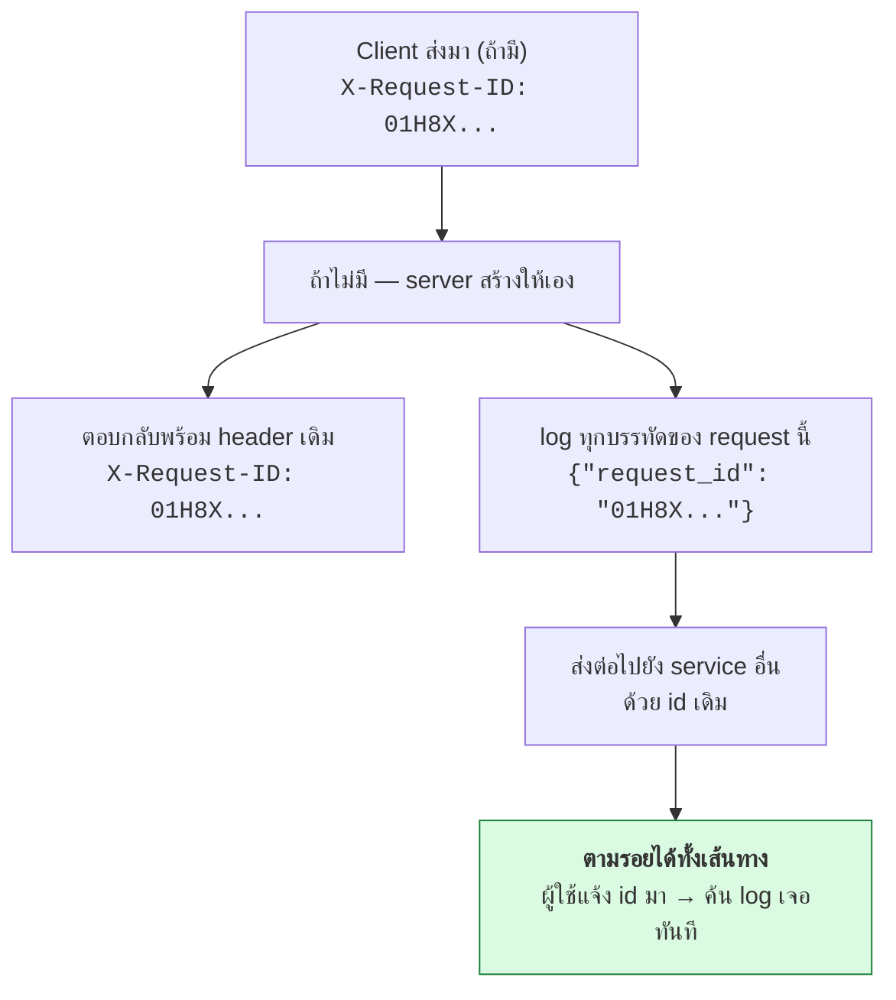

# บทที่ 28 · Observability และ Deployment

> คำถามที่ต้องตอบให้ได้ภายใน 5 นาที เมื่อผู้ใช้แจ้งว่า "แอปใช้ไม่ได้":
> **มันพังจริงไหม พังที่ไหน พังตั้งแต่เมื่อไร และกระทบกี่คน**
>
> ถ้าตอบไม่ได้ แปลว่าระบบคุณยังไม่มี observability

## 28.1 สามเสาหลัก {#s28-1}

| เสา | ตอบคำถาม | เครื่องมือ |
|-----|----------|-----------|
| **Logs** | "เกิดอะไรขึ้นกับ request นี้" | JSON log + log aggregator |
| **Metrics** | "ระบบโดยรวมสุขภาพเป็นยังไง" | Prometheus + Grafana |
| **Traces** | "เวลา 3 วินาทีนั้นหมดไปกับอะไร" | OpenTelemetry + Jaeger/Tempo |

เริ่มจาก **logs** ก่อน (คุ้มที่สุดต่อแรงที่ลง) แล้วค่อยเพิ่ม metrics และ traces

## 28.2 Structured logging {#s28-2}

```python
# ❌ log ที่ค้นหาไม่ได้
print(f"User {user} ordered {item}")

# ✅ JSON — กรอง/นับ/แจ้งเตือนได้
log.info("order_created", extra={
    "request_id": request_id,
    "user_id": user.id,
    "order_id": order.id,
    "amount": order.amount,
    "duration_ms": 42,
})
```

```json
{"ts":"2026-08-27T10:30:00Z","level":"info","event":"order_created",
 "request_id":"req_01H8X","user_id":42,"order_id":1001,"duration_ms":42}
```

**ทำไม JSON**: หาคำตอบได้ทันทีโดยไม่ต้องเขียน regex

```
event="order_created" AND amount > 100000 AND duration_ms > 1000
```

### field ที่ทุก log ควรมี

| field | ทำไม |
|-------|------|
| `ts` | ISO 8601 UTC ([บทที่ 12](12-api-design-practices.md)) |
| `level` | debug/info/warn/error |
| `event` | ชื่อเหตุการณ์แบบคงที่ ไม่ใช่ประโยคที่เปลี่ยนได้ |
| `request_id` | **ผูกทุกบรรทัดของ request เดียวกันเข้าด้วยกัน** |
| `user_id` | ตามรอยผู้ใช้ที่แจ้งปัญหา |
| `service`, `version` | รู้ว่าเวอร์ชันไหนพัง |

### ⚠️ สิ่งที่ห้ามเข้า log เด็ดขาด

```python
SENSITIVE = {"password", "token", "access_token", "refresh_token",
             "authorization", "api_key", "secret", "card_number", "cvv"}

def redact(d: dict) -> dict:
    return {k: ("[redacted]" if k.lower() in SENSITIVE else v) for k, v in d.items()}
```

**ที่มักหลุดโดยไม่ตั้งใจ:**
- ยัด request body ทั้งก้อนลง log ตอน debug แล้วลืมเอาออก
- log URL เต็มที่มี `?api_key=` ([บทที่ 9](09-authentication.md) — อีกเหตุผลที่ไม่ควรใส่ key ใน query)
- stack trace ที่มีค่าตัวแปร
- log `Authorization` header ทั้งบรรทัด

**ถ้า token หลุดลง log ให้ถือว่ามันรั่วแล้ว** — ต้องเพิกถอนและหมุนใหม่
เพราะ log ถูกส่งต่อไปยังระบบอื่น ถูก backup และมีคนเข้าถึงได้มากกว่าที่คิด

## 28.3 Request ID — ของขวัญที่ให้ตัวเองในอนาคต {#s28-3}



**ผู้ใช้แจ้งปัญหาพร้อม request_id → ค้น log เจอทันทีว่าเกิดอะไรขึ้น**

ให้ mobile app แสดง request_id ในหน้า error ด้วย (ตัวเล็ก ๆ มุมจอ)
หรือแนบไปในปุ่ม "รายงานปัญหา"

```python
# middleware
def middleware(request):
    rid = request.headers.get("X-Request-ID") or f"req_{uuid7()}"
    request.state.request_id = rid          # ใช้ contextvar จะสะดวกกว่า
    response = handler(request)
    response.headers["X-Request-ID"] = rid
    return response
```

> ⚠️ **อย่าเชื่อ request_id ที่ client ส่งมาแบบไม่ตรวจ** — จำกัดความยาวและ
> อนุญาตเฉพาะ `[A-Za-z0-9_-]` ไม่งั้นเป็นช่องทาง log injection ([บทที่ 25.3](25-input-validation-and-injection.md#s25-3))

## 28.4 Metrics — RED และ USE {#s28-4}

**RED** สำหรับ API (ดูจากมุมผู้ใช้):

| ตัว | คือ | ตั้ง alert เมื่อ |
|-----|-----|------------------|
| **R**ate | request/วินาที | ตกฮวบ (แปลว่าคนเข้าไม่ได้) |
| **E**rrors | สัดส่วน 5xx | > 1% |
| **D**uration | p50/p95/p99 | p95 > เป้าหมาย |

**USE** สำหรับทรัพยากร: Utilization, Saturation, Errors
(CPU, memory, disk, connection pool)

```python
from prometheus_client import Counter, Histogram

REQUESTS = Counter("http_requests_total", "", ["method", "path", "status"])
LATENCY = Histogram("http_request_duration_seconds", "", ["method", "path"])
```

> ⚠️ **ระวัง cardinality ระเบิด** — อย่าใช้ค่าที่มีได้ไม่จำกัดเป็น label
> ใช้ `path="/orders/{id}"` (route pattern) ไม่ใช่ `path="/orders/1001"`
> ไม่งั้น Prometheus จะมีเมตริกเป็นล้านเส้นแล้วล่ม

**metric ระดับธุรกิจสำคัญไม่แพ้ metric ระดับเทคนิค:**
จำนวนคน login สำเร็จ/ล้มเหลว, ออเดอร์ต่อชั่วโมง, การ refresh token,
**จำนวนครั้งที่ตรวจพบ refresh token reuse** ([บทที่ 11](11-mobile-api-auth-design.md))

## 28.5 Distributed tracing {#s28-5}

```
POST /v1/orders                                    [████████████ 850ms]
├─ auth.verify_token                               [█ 12ms]
├─ db.select_user                                  [█ 8ms]
├─ payment_api.charge                              [████████ 600ms]  ← เจอตัวการ
├─ db.insert_order                                 [█ 15ms]
└─ queue.publish                                   [█ 5ms]
```

**trace ตอบคำถาม "ช้าตรงไหน" ได้ในภาพเดียว** ซึ่ง log ทำไม่ได้

```python
from opentelemetry import trace
tracer = trace.get_tracer(__name__)

with tracer.start_as_current_span("payment.charge") as span:
    span.set_attribute("order.id", order.id)
    result = payment_api.charge(order)
```

ใช้ **OpenTelemetry** เพราะเป็นมาตรฐานกลาง — เปลี่ยน backend
(Jaeger, Tempo, Datadog) ได้โดยไม่ต้องแก้โค้ด และ auto-instrument
library ยอดนิยมให้ฟรี

ในระบบเล็ก ๆ trace อาจยังไม่คุ้ม — เริ่มจากบันทึก `duration_ms` แยกส่วน
ลงใน log ก่อนก็ได้ผลใกล้เคียง

## 28.6 Alert ที่มีประโยชน์ {#s28-6}

**alert ที่ดี = มีคนต้องลงมือทำอะไรบางอย่าง** ถ้าไม่ต้องทำอะไร นั่นคือ dashboard ไม่ใช่ alert

```yaml
- alert: HighErrorRate
  expr: rate(http_requests_total{status=~"5.."}[5m]) / rate(http_requests_total[5m]) > 0.01
  for: 5m                      # ต้องเป็นจริงต่อเนื่อง 5 นาที กัน alert หลอก
```

**ควรตั้ง alert:**
- error rate > 1%
- p95 latency เกินเป้า
- health check ล้มเหลว
- **cert ใกล้หมดอายุ (30 วัน)** ← กันเหตุที่เจอบ่อยที่สุดอย่างหนึ่ง
- disk เหลือ < 20%
- connection pool เกือบเต็ม
- คิวงานค้างสะสม
- **refresh token reuse ถูกตรวจพบผิดปกติ** (อาจมีการโจมตี)

**Alert fatigue คือศัตรู** — ถ้า alert ดังบ่อยจนคนเริ่มเมิน มันแย่กว่าไม่มี alert
ทบทวนทุกเดือนว่าอันไหนดังแล้วไม่มีใครทำอะไร แล้วลบทิ้ง

## 28.7 Health check {#s28-7}

**ต้องมี 3 แบบ แยกกัน** (ตามแนวคิดของ Kubernetes):

```python
@app.get("/health/live")     # แค่ process ยังอยู่ไหม — ห้ามแตะ DB
def live():
    return {"status": "ok"}

@app.get("/health/ready")    # พร้อมรับ traffic ไหม — เช็ค dependency
def ready():
    checks = {"db": check_db(), "redis": check_redis()}
    ok = all(checks.values())
    return JSONResponse({"status": "ok" if ok else "degraded", "checks": checks},
                        status_code=200 if ok else 503)

@app.get("/health/startup")  # เริ่มเสร็จหรือยัง (สำหรับแอปที่บูตนาน)
def startup(): ...
```

**ความต่างที่สำคัญ:**
- `live` ล้มเหลว → **รีสตาร์ท** container
- `ready` ล้มเหลว → **เอาออกจาก load balancer** แต่ไม่รีสตาร์ท

ถ้าเอา DB check ไปใส่ใน `live` แล้ว DB ล่มชั่วครู่ → ทุก pod ถูกรีสตาร์ทพร้อมกัน
→ เปลี่ยนปัญหาเล็กเป็นปัญหาใหญ่

`/health` ไม่ควรต้อง auth แต่**ไม่ควรเปิดเผยรายละเอียดภายใน**
(เวอร์ชัน library, hostname, connection string)

## 28.8 Graceful shutdown {#s28-8}

ตอน deploy เวอร์ชันใหม่ **ห้ามตัด request ที่กำลังทำงานอยู่ทิ้ง**

```
1. รับสัญญาณ SIGTERM
2. ตอบ /health/ready เป็น 503     ← LB หยุดส่ง traffic ใหม่มา
3. รอ (LB ใช้เวลาสังเกต ~5-15 วินาที)
4. ทำ request ที่ค้างอยู่ให้เสร็จ
5. ปิด connection pool / flush log
6. ออกจากโปรแกรม
```

```python
import signal

shutting_down = False

def handle_sigterm(*_):
    global shutting_down
    shutting_down = True        # /health/ready จะเริ่มตอบ 503

signal.signal(signal.SIGTERM, handle_sigterm)
```

ตั้ง `terminationGracePeriodSeconds` ให้นานพอ (30-60 วินาที)

**ทดสอบด้วย:** ยิง load ค้างไว้แล้ว deploy — ต้องไม่มี request ไหนได้ 502

## 28.9 Deploy ให้ปลอดภัย {#s28-9}

| กลยุทธ์ | ทำยังไง | เหมาะกับ |
|---------|---------|---------|
| **Rolling** | เปลี่ยนทีละ instance | ค่าเริ่มต้นที่ดี |
| **Blue-green** | ยกชุดใหม่ขึ้นทั้งชุด แล้วสลับ | rollback เร็วมาก |
| **Canary** | ส่ง traffic 5% ไปเวอร์ชันใหม่ก่อน | ระบบใหญ่ ความเสี่ยงสูง |

**Feature flag แยกการ deploy ออกจากการเปิดใช้ฟีเจอร์:**

```python
if flags.enabled("new_checkout", user):
    return new_checkout()
return old_checkout()
```

deploy โค้ดขึ้นไปก่อนโดยยังปิดอยู่ → เปิดให้ 1% → ค่อย ๆ เพิ่ม →
**ถ้ามีปัญหาปิดได้ทันทีโดยไม่ต้อง deploy ใหม่**

สำคัญเป็นพิเศษกับ mobile เพราะแอปเวอร์ชันใหม่ต้องรอ store review
แต่ flag ฝั่ง server เปลี่ยนได้ทันที

**Rollback ต้องซ้อมไว้** — รู้ว่ากดอะไร ใช้เวลากี่นาที และ **migration ที่ทำไปแล้ว
ต้องเข้ากันได้กับโค้ดเวอร์ชันเก่า** ([บทที่ 27.6](27-database-and-performance.md#s27-6) — นี่คือเหตุผลที่ต้อง expand/contract)

## 28.10 Config และ secret {#s28-10}

**ตาม 12-factor: config มาจาก environment ไม่ใช่ไฟล์ในโค้ด**

```python
DATABASE_URL = os.environ["DATABASE_URL"]     # ไม่มีค่า = crash ตั้งแต่บูต ← ดี
DEBUG = os.environ.get("DEBUG") == "1"
```

**crash ตั้งแต่ตอนบูตดีกว่าพังตอนมีผู้ใช้** — validate config ทั้งหมดตอนเริ่มโปรแกรม

| ที่เก็บ secret | ความเห็น |
|----------------|----------|
| Vault / AWS Secrets Manager / GCP Secret Manager | ✅ ดีที่สุด — หมุนอัตโนมัติได้ |
| Kubernetes Secret | ⚠️ base64 ไม่ใช่การเข้ารหัส ([บทที่ 6](06-encoding-and-charset.md)) ต้องเปิด encryption at rest |
| env var จาก CI | ⚠️ พอใช้ได้ |
| ไฟล์ `.env` ใน git | ❌ **ห้ามเด็ดขาด** |

**ต้องหมุน secret ได้โดยไม่ downtime** — รองรับสองค่าพร้อมกันช่วงเปลี่ยนผ่าน
(หลักการเดียวกับ backup pin ใน[บทที่ 7](07-tls-https.md) และ webhook secret ใน[บทที่ 13](13-webhooks-and-hmac.md))

## 28.11 Checklist {#s28-11}

**Logging**
- [ ] JSON structured log
- [ ] `request_id` ในทุกบรรทัด และตอบกลับใน header
- [ ] redact ความลับ + มีเทสต์ว่า token ไม่หลุดลง log
- [ ] log level ปรับได้โดยไม่ต้อง deploy

**Metrics & tracing**
- [ ] RED metrics ครบ (rate, error, duration แบบ p95/p99)
- [ ] label ไม่มี cardinality ระเบิด
- [ ] มี metric ระดับธุรกิจ ไม่ใช่แค่เทคนิค

**Alert**
- [ ] error rate, latency, health, cert expiry, disk, queue
- [ ] ทุก alert มีคนรับผิดชอบและมี runbook
- [ ] ทบทวน alert ที่ดังแล้วไม่มีใครทำอะไร

**Deployment**
- [ ] `/health/live` และ `/health/ready` แยกกันชัดเจน
- [ ] graceful shutdown ทำงานจริง (ทดสอบด้วย load ค้าง)
- [ ] rollback ซ้อมแล้ว รู้ว่าใช้เวลากี่นาที
- [ ] migration เข้ากันได้กับโค้ดเวอร์ชันก่อนหน้า
- [ ] feature flag สำหรับฟีเจอร์เสี่ยง
- [ ] config จาก env + validate ตอนบูต
- [ ] secret อยู่ใน secret manager และหมุนได้

## แบบฝึกหัด

1. เพิ่ม `X-Request-ID` ให้ [lab/server.py](../lab/server.py):
   อ่านจาก header ถ้ามี ไม่มีก็สร้าง แล้วใส่ทั้งใน response และใน log
2. เปลี่ยน `log_message` ของ lab ให้พิมพ์ JSON บรรทัดเดียวพร้อม
   `request_id`, `method`, `path`, `status`, `duration_ms`
3. เขียนฟังก์ชัน `redact()` แล้วทดสอบว่า `Authorization` ไม่หลุดลง log
4. เพิ่ม `/health/live` และ `/health/ready` โดย `ready` เช็คว่า
   จำนวน session ยังไม่เกินขีดจำกัด
5. เพิ่ม graceful shutdown: จับ SIGTERM แล้วให้ `ready` ตอบ 503
   ทดสอบด้วยการยิง load แล้วส่งสัญญาณ
6. ยิง lab แล้วนับ p95 ของ latency จาก log ที่คุณเพิ่ม
   (คำใบ้: `jq -s 'map(.duration_ms) | sort | .[(length*0.95|floor)]'`)
7. ตอบตัวเอง: ถ้าตอนนี้ผู้ใช้แจ้งว่าแอปพัง คุณใช้เวลากี่นาทีกว่าจะรู้สาเหตุ

***
[⬅ Database และ Performance](27-database-and-performance.md) · [สารบัญ](../README.md) · [Observability เจาะลึก ➡](68-observability-deep.md)
