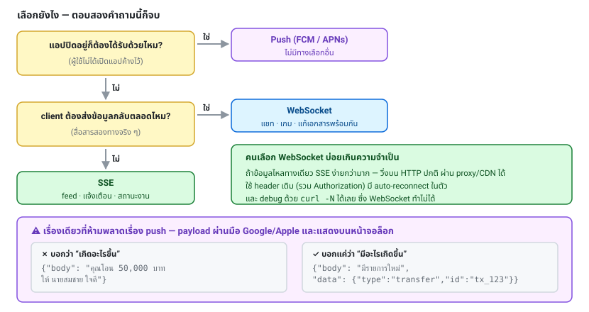
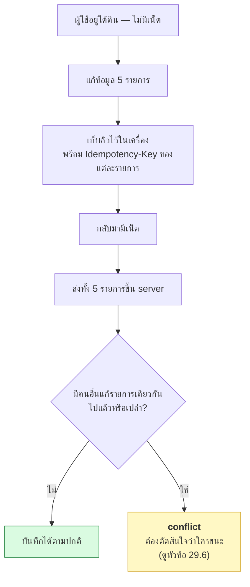

# บทที่ 29 · Push, Real-time, Upload และ Offline

> สี่ฟีเจอร์ที่ mobile app แทบทุกตัวต้องใช้ และไม่มีอยู่ในบทก่อนหน้า

## 29.1 เลือกวิธีสื่อสารแบบ real-time {#s29-1}

| วิธี | ทิศทาง | ใช้เมื่อ | ต้นทุน |
|------|--------|---------|--------|
| **Polling** | client ถาม | ข้อมูลเปลี่ยนช้า | สิ้นเปลืองที่สุด |
| **Long polling** | client ถาม แต่ server ค้างไว้ | ไม่มีทางเลือกอื่น | ปานกลาง |
| **SSE** | server → client ทางเดียว | ✅ feed, แจ้งเตือน, สถานะงาน | ถูก ทำง่าย |
| **WebSocket** | สองทาง | ✅ แชท, เกม, collaborative editing | แพงกว่า ซับซ้อนกว่า |
| **Push (FCM/APNs)** | server → เครื่อง | ✅ **แอปปิดอยู่ก็ถึง** | ผ่าน Google/Apple |

**หลักการเลือก:**

```
แอปปิดอยู่ต้องได้รับด้วยไหม?
  ใช่  → Push notification (ไม่มีทางเลือกอื่น)
  ไม่  → ต้องส่งจาก client ไป server ตลอดเวลาไหม?
           ใช่  → WebSocket
           ไม่  → SSE
```

**คนเลือก WebSocket บ่อยเกินความจำเป็น** ถ้าข้อมูลไหลทางเดียว SSE ง่ายกว่ามาก:
วิ่งบน HTTP ปกติ ผ่าน proxy/CDN ได้ มี auto-reconnect ในตัว ใช้ header เดิม
(รวมถึง `Authorization`) และ debug ด้วย `curl` ได้



## 29.2 Server-Sent Events {#s29-2}

ลองใน lab:

```bash
curl -N 'http://127.0.0.1:8080/api/stream?count=3'
```

```
event: tick
data: {"seq": 1, "ts": 1787789918}

event: tick
data: {"seq": 2, "ts": 1787789919}

event: done
data: {}
```

`-N` = ปิด buffer เห็นข้อมูลทันทีที่มาถึง ([บทที่ 8](08-json-api-and-jq.md))

**รูปแบบ SSE:**

```
event: tick              ← ชื่อ event (ไม่บังคับ)
id: 42                   ← id สำหรับ resume (ไม่บังคับ แต่ควรมี)
retry: 3000              ← บอก client ให้ retry ใน 3 วินาที
data: {"seq": 1}         ← ข้อมูล
                         ← บรรทัดว่าง = จบก้อนนี้
```

**`id:` สำคัญกว่าที่คิด** — เมื่อการเชื่อมต่อหลุด เบราว์เซอร์จะส่ง
`Last-Event-ID` กลับมาให้อัตโนมัติ ทำให้ส่งต่อจากจุดที่ค้างได้
โดยไม่ต้องเริ่มใหม่หรือส่งซ้ำ

โค้ดฝั่ง server (ดู `api_stream` ใน [lab/server.py](../lab/server.py)):

```python
self.send_header("Content-Type", "text/event-stream; charset=utf-8")
self.send_header("Cache-Control", "no-cache")
...
self.wfile.write(f"event: tick\ndata: {data}\n\n".encode())
self.wfile.flush()          # ← ต้อง flush ทุกครั้ง ไม่งั้นค้างใน buffer
```

**สามกับดักของ SSE:**

1. **proxy buffer** — nginx จะเก็บ response ไว้จนเต็มก่อนส่ง
   ต้องตั้ง `proxy_buffering off` ([บทที่ 26.7](26-proxy-caching-cdn.md#s26-7))
2. **timeout** — proxy ตัดการเชื่อมต่อที่เงียบนานเกินไป
   → ส่ง heartbeat (`: ping\n\n` — บรรทัดที่ขึ้นต้นด้วย `:` คือ comment) ทุก 30 วินาที
3. **จำนวนการเชื่อมต่อ** — แต่ละ client กิน 1 connection ค้างไว้
   ต้องใช้ async server (ASGI/uvicorn) ไม่ใช่ worker แบบ thread ต่อ request

## 29.3 WebSocket {#s29-3}

```
GET /ws HTTP/1.1
Upgrade: websocket
Connection: Upgrade
Sec-WebSocket-Key: dGhlIHNhbXBsZSBub25jZQ==
        ↓
HTTP/1.1 101 Switching Protocols     ← หลังจากนี้ไม่ใช่ HTTP แล้ว
```

**ประเด็นที่ต้องคิดเมื่อใช้ WebSocket:**

| เรื่อง | รายละเอียด |
|-------|-----------|
| **Authentication** | เบราว์เซอร์ใส่ custom header ไม่ได้ตอน handshake → ส่ง token เป็นข้อความแรกหลังต่อ หรือใช้ ticket ที่ขอจาก REST ก่อน (**อย่าใส่ token ใน query string** — [บทที่ 9](09-authentication.md)) |
| **Token หมดอายุ** | connection ค้างอยู่ข้ามช่วงที่ token หมดอายุ → ต้องมีกลไก re-auth ระหว่างทาง |
| **Origin check** | WebSocket **ไม่มี CORS** ต้องตรวจ `Origin` เอง ไม่งั้นเว็บอื่นเปิด connection มาได้ |
| **Scale หลาย server** | client A ต่อ server 1, client B ต่อ server 2 → ต้องมี pub/sub (Redis) คั่นกลาง |
| **Reconnect** | ต้องเขียนเอง (ต่างจาก SSE) + exponential backoff ([บทที่ 12](12-api-design-practices.md)) |
| **Heartbeat** | ping/pong เพื่อรู้ว่าอีกฝั่งยังอยู่ |
| **Backpressure** | ถ้า client รับช้ากว่าที่ส่ง → buffer บวมจนหน่วยความจำเต็ม |

## 29.4 Push notification {#s29-4}

**นี่คือทางเดียวที่จะส่งข้อความถึงผู้ใช้ตอนแอปปิดอยู่**

```
Server ของคุณ ──▶ FCM (Android) / APNs (iOS) ──▶ เครื่องผู้ใช้
```

### Device token lifecycle

```
1. แอปขออนุญาตจากผู้ใช้
2. ได้ device token จาก FCM/APNs
3. ส่ง token มาเก็บที่ server (ผูกกับ user + device)
4. token เปลี่ยนได้เอง! → แอปต้องส่งค่าใหม่มาทุกครั้งที่เปลี่ยน
5. ผู้ใช้ logout / ถอนแอป → ลบ token
```

**ข้อ 4 คือจุดที่พลาดบ่อยที่สุด** — token หมุนเองเมื่อผู้ใช้ติดตั้งใหม่,
กู้เครื่องจาก backup, หรือล้างข้อมูลแอป ถ้าไม่อัปเดต ผู้ใช้จะไม่ได้รับแจ้งเตือนเลย
โดยที่ไม่มีใครรู้

**ต้องเก็บกวาด token ที่ตายแล้ว** — FCM ตอบ `UNREGISTERED`, APNs ตอบ `410 Gone`
→ ลบออกจากฐานข้อมูลทันที ไม่งั้นจะสะสมจนส่งช้าและเปลืองโควตา

### ⚠️ ความปลอดภัยของ payload

```json
// ❌ ข้อมูลอ่อนไหวใน push — แสดงบนหน้าจอล็อก และผ่านเซิร์ฟเวอร์ของ Google/Apple
{"title": "โอนเงินสำเร็จ", "body": "คุณโอน 50,000 บาท ให้ นายสมชาย ใจดี"}

// ✅ ส่งแค่สัญญาณ ให้แอปไปดึงรายละเอียดเอง
{"title": "มีรายการใหม่", "data": {"type": "transfer", "id": "tx_123"}}
```

หลักการ: **push บอกว่า "มีอะไรเกิดขึ้น" ไม่ใช่ "เกิดอะไรขึ้น"**
แอปเปิดขึ้นมาแล้วค่อยยิง API ดึงรายละเอียดด้วย token ของตัวเอง

**เรื่องอื่นที่ควรทำ:**
- **ต้องเป็น idempotent** — push อาจถูกส่งซ้ำ ใส่ `notification_id` ให้แอป dedup
- **ไม่รับประกันการส่งถึง** — อย่าใช้ push เป็นกลไกหลักในการ sync ข้อมูล
- **เคารพการตั้งค่าของผู้ใช้** — ให้ปิดแจ้งเตือนแต่ละประเภทได้
- **จัดกลุ่ม** อย่าส่ง 50 notification รวดเดียว
- **ระวัง timezone** — อย่าส่งตอนตี 3 ของผู้ใช้ ([บทที่ 12](12-api-design-practices.md): เก็บ UTC แต่รู้ timezone ผู้ใช้)

## 29.5 อัปโหลดไฟล์ระดับใช้งานจริง {#s29-5}

`-F 'file=@x.jpg'` ใน[บทที่ 3](03-html-forms.md) ใช้ได้กับไฟล์เล็ก แต่ของจริงมีปัญหา:
ไฟล์ใหญ่กินหน่วยความจำ server, เน็ตมือถือหลุดกลางคัน, และ server ต้องรับ
traffic ทั้งหมดโดยไม่จำเป็น

### วิธีที่ดีกว่า: presigned URL

```
1. แอป → POST /v1/uploads  {"filename": "photo.jpg", "size": 2048576, "type": "image/jpeg"}
2. server ตรวจสิทธิ์ + ขนาด + ชนิด แล้วขอ presigned URL จาก S3
3. server → แอป  {"upload_url": "https://s3...?X-Amz-Signature=...", "file_id": "f_123"}
4. แอป → S3 โดยตรง (PUT)          ← ไม่ผ่าน server ของคุณเลย
5. แอป → POST /v1/uploads/f_123/complete
6. server ตรวจว่าไฟล์มาถึงจริง ขนาดตรง แล้วประมวลผลต่อ
```

**ข้อดี:** server ไม่ต้องรับ traffic, ขยายได้ไม่จำกัด, ผู้ใช้อัปโหลดเร็วกว่า
(S3 มี edge ใกล้กว่า)

**ข้อควรระวัง:**
- presigned URL ต้อง **หมดอายุเร็ว** (5-15 นาที)
- **จำกัดขนาดใน policy ของ presigned URL** ไม่ใช่แค่เชื่อค่า `size` ที่แอปบอก
- ขั้นตอนที่ 6 ต้องตรวจไฟล์จริงเสมอ (magic bytes — [บทที่ 25.5](25-input-validation-and-injection.md#s25-5))
  **อย่าเชื่อว่าแอปอัปโหลดสิ่งที่บอกไว้**
- ตั้ง lifecycle rule ลบไฟล์ที่อัปโหลดค้าง (ขั้นที่ 4 สำเร็จแต่ไม่มีขั้นที่ 5)

### Resumable upload — จำเป็นสำหรับมือถือ

เน็ตมือถือหลุดบ่อย ไฟล์ 50 MB ที่หลุดตอน 90% แล้วต้องเริ่มใหม่ = ประสบการณ์แย่มาก

- **S3 multipart upload** — แบ่งเป็นชิ้นละ 5+ MB อัปโหลดขนานกัน ชิ้นไหนพังส่งใหม่แค่ชิ้นนั้น
- **tus.io** — โปรโตคอลมาตรฐานสำหรับ resumable upload
- ทำเองด้วย `Content-Range` ก็ได้ แต่ใช้ของที่มีอยู่แล้วดีกว่า

## 29.6 Offline-first และการ sync {#s29-6}

เรื่องใหญ่ที่สุดของ mobile ที่ backend ต้องออกแบบรองรับ



### สามอย่างที่ backend ต้องมี

**1. Idempotency** ([บทที่ 12](12-api-design-practices.md)) — แอปส่งซ้ำได้โดยไม่เกิดข้อมูลซ้ำ

```bash
POST /v1/orders
Idempotency-Key: <uuid ที่แอปสร้างตอนผู้ใช้กดปุ่ม ไม่ใช่ตอนส่ง>
```

**สำคัญ: key ต้องสร้างตอนผู้ใช้ลงมือ** แล้วเก็บไว้กับข้อมูลที่รอส่ง
ถ้าสร้างตอนจะส่ง การ retry จะได้ key ใหม่ทุกครั้ง = ไร้ประโยชน์

**2. ID ที่ client สร้างเองได้**

```json
{"id": "01H8XK3M...", "item": "...", "created_at": "..."}
```

ใช้ **UUID v7 หรือ ULID** — เรียงตามเวลาได้และไม่ชนกัน
ทำให้แอปสร้างรายการแสดงผลได้ทันทีโดยไม่ต้องรอ server ตอบ (optimistic UI)

**3. Delta sync**

```
GET /v1/sync?since=2026-08-27T10:00:00Z&cursor=...
→ {"changes": [...], "deletions": ["id1","id2"], "next_cursor": "...", "server_time": "..."}
```

- ส่งเฉพาะสิ่งที่เปลี่ยน ไม่ใช่ทั้งหมด
- **ต้องมี `deletions`** ไม่งั้นแอปไม่มีทางรู้ว่าอะไรถูกลบ
  (นี่คือเหตุผลที่ต้อง soft delete — [บทที่ 12](12-api-design-practices.md))
- ใช้ **server_time ไม่ใช่ device time** เพราะนาฬิกาเครื่องผู้ใช้อาจเพี้ยน
- ตอบเป็นชุด ๆ ด้วย cursor สำหรับคนที่ offline นาน

### Conflict resolution

| กลยุทธ์ | ทำยังไง | เหมาะกับ |
|---------|---------|---------|
| **Last-write-wins** | ใครเขียนทีหลังชนะ | ง่ายสุด แต่ข้อมูลหายได้ |
| **Server wins** | server ถูกเสมอ | ข้อมูลที่ server เป็นเจ้าของ |
| **Client wins** | ของในเครื่องถูกเสมอ | ข้อมูลส่วนตัว |
| **Merge ราย field** | แก้คนละ field = รวมกันได้ | ✅ ดีสำหรับ form |
| **ให้ผู้ใช้เลือก** | แสดงทั้งสองเวอร์ชัน | ข้อมูลสำคัญ |
| **CRDT** | โครงสร้างที่รวมกันเองได้ | collaborative editing |

**ใช้ version/ETag ตรวจ conflict** (โยงกับ[บทที่ 26.5](26-proxy-caching-cdn.md#s26-5)):

```bash
PATCH /v1/orders/1001
If-Match: "v3"
→ 412 Precondition Failed    ถ้ามีคนแก้ไปเป็น v4 แล้ว
```

แล้วให้แอปตัดสินใจว่าจะ merge หรือถามผู้ใช้

**เริ่มจาก last-write-wins + version check ก่อน** อย่าเพิ่งไป CRDT
ถ้ายังไม่มีความต้องการจริง — แต่เก็บ `updated_at` และ `version` ไว้ตั้งแต่วันแรก
เพราะเพิ่มทีหลังยาก

## 29.7 Checklist {#s29-7}

**Real-time**
- [ ] เลือกวิธีตามความต้องการจริง (SSE พอไหมก่อนจะไป WebSocket)
- [ ] SSE: ปิด `proxy_buffering`, มี heartbeat, มี `id:` สำหรับ resume
- [ ] WebSocket: ตรวจ `Origin`, auth หลัง handshake, มี pub/sub ถ้าหลาย server
- [ ] reconnect มี exponential backoff + jitter

**Push**
- [ ] อัปเดต device token ทุกครั้งที่เปลี่ยน
- [ ] ลบ token ที่ตายแล้ว (UNREGISTERED / 410)
- [ ] payload ไม่มีข้อมูลอ่อนไหว
- [ ] มี notification_id ให้ dedup
- [ ] ผู้ใช้ปิดแจ้งเตือนแต่ละประเภทได้
- [ ] เคารพ timezone ของผู้ใช้

**Upload**
- [ ] ไฟล์ใหญ่ใช้ presigned URL ไม่ผ่าน API server
- [ ] presigned URL หมดอายุเร็ว + จำกัดขนาดใน policy
- [ ] ตรวจไฟล์จริงหลังอัปโหลด ([บทที่ 25.5](25-input-validation-and-injection.md#s25-5))
- [ ] resumable สำหรับไฟล์ใหญ่
- [ ] ลบไฟล์ที่อัปโหลดค้าง

**Offline**
- [ ] รองรับ `Idempotency-Key` ที่สร้างตอนผู้ใช้ลงมือ
- [ ] client สร้าง id เองได้ (UUID v7 / ULID)
- [ ] มี delta sync endpoint ที่ส่ง deletions ด้วย
- [ ] ใช้ server time ไม่ใช่ device time
- [ ] มี version/ETag ตรวจ conflict
- [ ] soft delete เพื่อให้ sync การลบได้

## แบบฝึกหัด

1. ยิง `curl -N 'http://127.0.0.1:8080/api/stream?count=5'` แล้วสังเกตว่าข้อมูลทยอยมา
   จากนั้นลองเอา `-N` ออก — ต่างกันอย่างไร
2. เพิ่ม `id:` และ heartbeat (`: ping`) ให้ `api_stream` ใน [lab/server.py](../lab/server.py)
3. เพิ่มการรองรับ `Last-Event-ID` ให้ stream ส่งต่อจากจุดที่ค้าง
4. เพิ่ม `POST /api/uploads` ที่คืน "presigned URL ปลอม" (URL ที่มี HMAC + expires
   ตาม[บทที่ 13](13-webhooks-and-hmac.md)) แล้วเขียน endpoint ที่รับไฟล์เฉพาะเมื่อ signature ถูกต้อง
5. เพิ่ม `GET /api/sync?since=` ที่คืนเฉพาะ order ที่เปลี่ยนหลังเวลานั้น พร้อม `deletions`
6. เพิ่ม `version` ให้ order แล้วทำ `If-Match` → ตอบ 412 เมื่อไม่ตรง
7. ออกแบบ flow การ sync ของแอปคุณเป็นผัง: ผู้ใช้แก้ตอน offline 3 รายการ
   แล้วกลับมามีเน็ตพร้อมกับที่มีคนอื่นแก้รายการเดียวกันไปแล้ว

***

## จบส่วนการออกแบบระบบแล้ว 🎉

ถึงตรงนี้คุณผ่านเรื่องการออกแบบ API ครบแล้ว — ตั้งแต่ "HTTP คืออะไร"
จนถึงระบบที่รองรับผู้ใช้จริง

ส่วนถัดไปเป็นเรื่อง**เครื่องมือของคนทำงาน** (git, TCP/IP, การเขียนเทสต์)
และ**ความปลอดภัยในภาพกว้าง** (ระบบปฏิบัติการ, malware, เส้นทางอาชีพ)

**สิ่งที่ควรทำต่อทันที** — ตามลำดับความคุ้มค่า:

1. เอา checklist [บทที่ 11.11](11-mobile-api-auth-design.md#s11-11) (auth)
   และ [บทที่ 24.11](24-authorization-and-bola.md#s24-11) (BOLA) ไปตรวจ API จริงของคุณ
   — **สองอันนี้คือช่องโหว่ที่พบบ่อยที่สุดและเสียหายมากที่สุด**
2. เขียนเทสต์ BOLA ด้วย 2 บัญชี ใส่ CI
3. เพิ่ม `request_id` + structured log ([บทที่ 28](28-observability-and-deployment.md))
   — จะช่วยคุณทุกวันหลังจากนี้
4. รัน `python3 lab/db_demo.py` แล้วไปดูว่า API ของคุณมี N+1 ตรงไหน
5. ทำแบบฝึกหัดใน [lab/README.md](../lab/README.md) ที่ยังค้างอยู่

***
[⬅ Observability และ Deployment](28-observability-and-deployment.md) · [สารบัญ](../README.md) · [Git ➡](30-git.md)
