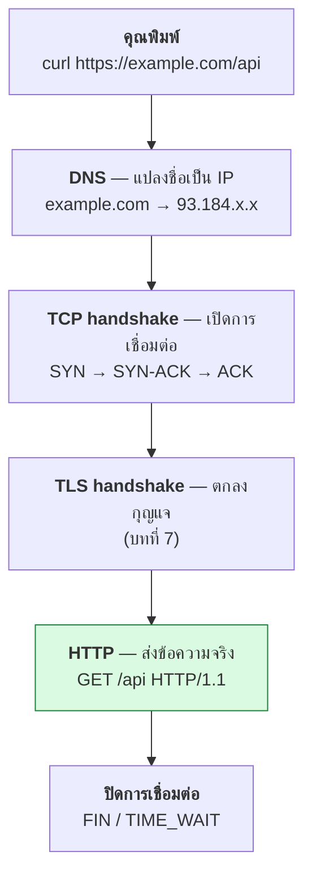
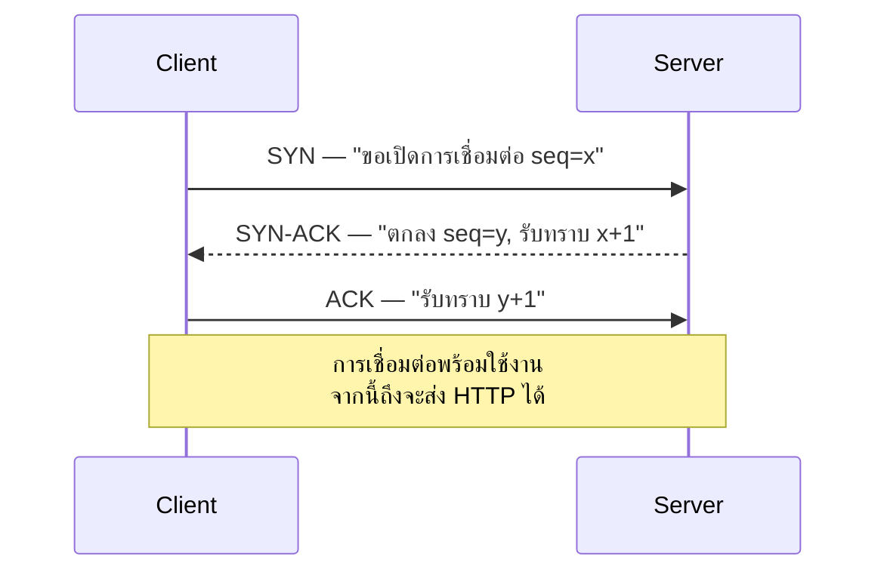
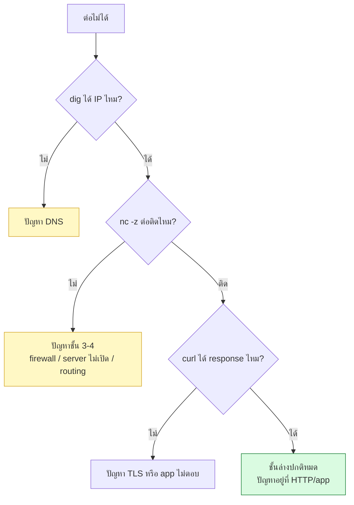

# บทที่ 31 · ชั้นใต้ HTTP — TCP/IP และ tcpdump

> [บทที่ 1](01-http-basics.md) บอกว่า `Trying 127.0.0.1:8080...` กับ `Connected` **ยังไม่ใช่ HTTP**
> บทนี้คือเรื่องที่เกิดขึ้นในสองบรรทัดนั้น
>
> รู้ชั้นนี้แล้วคุณจะแยกออกทันทีว่า "แอปช้า" เป็นปัญหาของโค้ด หรือของเครือข่าย

## 31.1 OSI 7 ชั้น — ต้องรู้แค่ไหน {#s31-1}

คำตอบตรง ๆ: **รู้ไว้เป็นคำศัพท์ ไม่ต้องท่องเป็นโมเดล**

OSI เป็นโมเดลจากยุค 1980 ที่**ไม่มีใครสร้างระบบตามจริง ๆ** อินเทอร์เน็ตทั้งหมด
สร้างบน **TCP/IP model ซึ่งมี 4 ชั้น** แต่ศัพท์ OSI ยังติดปากคนในวงการ

| OSI | TCP/IP | ตัวอย่างจริง | คุณเจอตอนไหน |
|-----|--------|--------------|--------------|
| 7 Application | Application | **HTTP**, DNS, TLS | ทั้งคอร์สนี้ |
| 6 Presentation | ↑ | (ไม่มีจริง — TLS/encoding ปนอยู่ชั้นอื่น) | — |
| 5 Session | ↑ | (ไม่มีจริง) | — |
| 4 Transport | Transport | **TCP**, UDP, QUIC | บทนี้ |
| 3 Network | Internet | **IP**, ICMP, routing | บทนี้ |
| 2 Data Link | Link | Ethernet, Wi-Fi, MAC | ไม่ค่อยเจอถ้าไม่ทำ network |
| 1 Physical | ↑ | สายทองแดง, ไฟเบอร์, คลื่น | — |

**ทำไมต้องรู้ศัพท์นี้** — เพราะคนพูดกันแบบนี้:

| คำที่ได้ยิน | แปลว่า |
|-------------|--------|
| "L7 load balancer" | กระจายโหลดโดย**อ่าน HTTP** ได้ (เช่นดู path, header) — nginx |
| "L4 load balancer" | กระจายโหลดโดยดูแค่ **IP + port** เร็วกว่าแต่โง่กว่า |
| "L2 switch" | สลับ frame ตาม MAC address |
| "L3/L4 DDoS" | ถล่มด้วย packet ดิบ ๆ ไม่ใช่ HTTP request |
| "L7 attack" | ถล่มด้วย HTTP request จริง (แพงกว่าสำหรับ server) |

> **สรุป:** จำแค่ว่า **L4 = TCP/port** และ **L7 = HTTP/application** ก็พอใช้งานได้ 95%
> ส่วนชั้น 5 กับ 6 ของ OSI **ไม่มีอยู่จริงในทางปฏิบัติ** อย่าเสียเวลาท่อง

## 31.2 การเดินทางของ request หนึ่งครั้ง {#s31-2}



**สี่ขั้นแรกเกิดขึ้นก่อนที่ HTTP จะเริ่มพูดสักคำ** — และบนมือถือ 4G
สี่ขั้นนี้อาจกิน 300-500 ms ซึ่งมากกว่าเวลาที่ server ใช้ประมวลผลเสียอีก

นี่คือเหตุผลที่ **connection reuse สำคัญมาก** ([บทที่ 26.8](26-proxy-caching-cdn.md#s26-8)) — ยิงครั้งที่สอง
บนการเชื่อมต่อเดิม ข้ามขั้น B, C, D ไปได้เลย

## 31.3 TCP handshake — สามขั้นตอน {#s31-3}



**ทำไมต้องสามขั้น** — เพื่อให้ทั้งสองฝั่งยืนยันว่า *ส่งได้* และ *รับได้*
ถ้าสองขั้นจะรู้แค่ว่าฝั่งเดียวรับได้

**สิ่งที่ตามมาในชีวิตจริง:**

| อาการ | สาเหตุที่ชั้น TCP |
|-------|-------------------|
| `Connection refused` ทันที | ปลายทางตอบ RST — ไม่มีใคร listen ที่ port นั้น |
| ค้างนานแล้วค่อย timeout | packet หายไปเงียบ ๆ (firewall drop) — ไม่มีใครตอบ |
| ต่อติดแต่ไม่มีข้อมูลมา | ชั้น TCP ปกติ ปัญหาอยู่ที่ HTTP หรือ app |

**`nc -z` (ภาคผนวก A) ทดสอบแค่ handshake นี้** — ถ้าผ่าน แปลว่าชั้น 3-4 ปกติ
ปัญหาอยู่ชั้นบน

## 31.4 ดูของจริงด้วย `ss` — ไม่ต้องเป็น root {#s31-4}

`ss` (socket statistics) คือ `netstat` เวอร์ชันใหม่ที่เร็วกว่ามาก

```bash
ss -tlnp                    # ดูว่ามีอะไร listen อยู่บ้าง
ss -tnp                     # การเชื่อมต่อที่ established
ss -s                       # สรุปทั้งเครื่อง
ss -tan state time-wait     # กรองตามสถานะ
```

| Flag | ความหมาย |
|------|----------|
| `-t` | TCP เท่านั้น |
| `-u` | UDP |
| `-l` | เฉพาะที่ listen อยู่ |
| `-n` | ไม่ต้องแปลงเลข port เป็นชื่อ (เร็วกว่า) |
| `-p` | บอกว่า process ไหนเป็นเจ้าของ |
| `-a` | ทั้งหมด |

**ผลจริงจากเครื่องที่รัน lab server:**

```bash
ss -s
```

```
Total: 1767
TCP:   246 (estab 33, closed 186, orphaned 0, timewait 1)
```

```bash
ss -tan | awk '{print $1}' | sort | uniq -c | sort -rn
```

```
     33 ESTAB
     27 LISTEN
      4 TIME-WAIT
```

## 31.5 สถานะของ TCP ที่ต้องรู้จัก {#s31-5}

| สถานะ | แปลว่า | เจอเมื่อ |
|-------|--------|---------|
| `LISTEN` | รอรับการเชื่อมต่อ | server ที่เปิดอยู่ |
| `ESTAB` | กำลังใช้งาน | ระหว่างคุยกัน |
| `TIME-WAIT` | ปิดแล้วแต่ยังจองไว้ ~60 วินาที | **ฝั่งที่ปิดก่อน** |
| `CLOSE-WAIT` | อีกฝั่งปิดแล้ว **แต่แอปเรายังไม่ปิด** | ⚠️ มักเป็นบั๊กในโค้ด |
| `SYN-SENT` | ส่ง SYN แล้วรอตอบ | ปลายทางไม่ตอบ |

**`TIME-WAIT` เยอะไม่ใช่บั๊ก** — เป็นกลไกปกติของ TCP ที่กันไม่ให้ packet เก่า
จากการเชื่อมต่อที่ปิดไปแล้วมาปนกับการเชื่อมต่อใหม่ที่ใช้ port เดียวกัน

**แต่ `CLOSE-WAIT` เยอะคือบั๊ก** — แปลว่าโค้ดของคุณ**ลืมปิด connection**
เจอบ่อยมากในโค้ดที่ไม่ได้ใช้ `with` หรือลืม `.close()` ปล่อยไว้นาน ๆ
file descriptor จะหมด แล้ว server จะรับ connection ใหม่ไม่ได้เลย

```bash
# ตรวจว่าแอปเรารั่วไหม
ss -tan state close-wait | wc -l
```

## 31.6 tcpdump — เห็นทุก packet {#s31-6}

`tcpdump` คือ `nc -l` ในระดับที่ต่ำกว่า — มันเห็น **ทุก packet** ที่วิ่งผ่าน
รวมถึงของ process อื่นด้วย

**ต้องใช้ sudo** เพราะการดัก packet เป็นสิทธิ์ระดับระบบ:

```bash
tcpdump -i lo -c 1
```

```
tcpdump: lo: You don't have permission to perform this capture on that device
(socket: Operation not permitted)
```

ให้สิทธิ์ถาวรโดยไม่ต้อง sudo ทุกครั้ง (ทำครั้งเดียว):

```bash
sudo setcap cap_net_raw,cap_net_admin=eip "$(which tcpdump)"
```

### คำสั่งที่ใช้จริง

```bash
# ดู traffic ของ lab server
sudo tcpdump -i lo -n port 8080

# เห็นเนื้อหาเป็นข้อความด้วย (-A) — พิสูจน์ว่า HTTP เป็น text (บทที่ 1.9)
sudo tcpdump -i lo -n -A port 8080

# บันทึกไว้เปิดใน Wireshark ทีหลัง
sudo tcpdump -i any -n -w capture.pcap port 8080

# อ่านไฟล์ที่บันทึกไว้
tcpdump -n -r capture.pcap
```

| Flag | ทำอะไร |
|------|--------|
| `-i lo` | ดักที่ interface ไหน (`lo` = localhost, `any` = ทุกอัน) |
| `-n` | ไม่ต้อง resolve DNS/ชื่อ port — **ใส่เสมอ ไม่งั้นช้าและรก** |
| `-c N` | จับ N packet แล้วหยุด |
| `-A` | แสดง payload เป็น ASCII |
| `-X` | แสดงเป็น hex + ASCII |
| `-w file` | เขียนลงไฟล์ (.pcap) |
| `-s 0` | จับทั้ง packet ไม่ตัด |

### ตัวกรอง (BPF)

```bash
port 8080                  # port ใดก็ได้ที่เป็น 8080
src host 10.0.0.5          # มาจาก IP นี้
dst port 443               # ไปที่ port 443
tcp[tcpflags] & tcp-syn != 0   # เฉพาะ SYN — ดูว่าใครพยายามต่อ
'port 8080 and not host 127.0.0.1'
```

**อ่าน output แบบนี้:**

```
10:30:01.123 IP 127.0.0.1.54321 > 127.0.0.1.8080: Flags [S], seq 12345
10:30:01.124 IP 127.0.0.1.8080 > 127.0.0.1.54321: Flags [S.], seq 67890, ack 12346
10:30:01.124 IP 127.0.0.1.54321 > 127.0.0.1.8080: Flags [.], ack 67891
```

`[S]` = SYN, `[S.]` = SYN-ACK, `[.]` = ACK — **นั่นคือ handshake สามขั้นใน[ข้อ 31.3](#s31-3)**
ส่วน `[P.]` = PSH-ACK (ส่งข้อมูลจริง), `[F.]` = FIN, `[R]` = RST

## 31.7 Wireshark — เมื่อ tcpdump ไม่พอ {#s31-7}

`tcpdump` เก่งเรื่องจับ ส่วน `Wireshark` เก่งเรื่อง**วิเคราะห์**

```bash
sudo tcpdump -i any -n -w capture.pcap port 8080   # จับบนเซิร์ฟเวอร์
# แล้วเปิด capture.pcap ใน Wireshark บนเครื่องตัวเอง
```

สิ่งที่ Wireshark ทำได้และ tcpdump ทำไม่ได้:

- **Follow TCP Stream** — ต่อ packet ทั้งหมดเป็นบทสนทนาเดียว อ่านง่ายมาก
- **Statistics → Conversations** — ใครคุยกับใคร ปริมาณเท่าไร
- แสดง retransmission, packet loss, RTT เป็นกราฟ
- ถอด TLS ได้ถ้ามี key (ตั้ง `SSLKEYLOGFILE`)

```bash
# ให้ curl/Chrome เขียน key ออกมา แล้ว Wireshark ถอด TLS ได้
export SSLKEYLOGFILE=~/tls-keys.log
curl https://example.com
```

> ⚠️ ไฟล์ key นี้ถอดรหัส traffic ของคุณได้ทั้งหมด — ลบทิ้งเมื่อเสร็จ

## 31.8 DNS — จุดที่พังบ่อยกว่าที่คิด {#s31-8}

```bash
dig example.com                    # ดูผลลัพธ์เต็ม
dig +short example.com             # เอาแค่ IP
dig example.com @8.8.8.8           # ถาม DNS server ตัวอื่นเทียบ
dig +trace example.com             # ไล่ดูตั้งแต่ root
resolvectl status                  # เครื่องเราใช้ DNS ตัวไหน
```

**ปัญหา DNS ที่เจอบ่อย:**

| อาการ | สาเหตุ |
|-------|--------|
| เว็บเข้าได้บ้างไม่ได้บ้าง | DNS ตอบหลาย IP บางตัวตาย |
| แก้ DNS แล้วยังไม่เปลี่ยน | TTL ยังไม่หมด / cache ที่ OS หรือ browser |
| ช้าตอนเริ่มทุกครั้ง | DNS ช้า — ดูจาก `curl -w '%{time_namelookup}'` ([บทที่ 2.4](02-curl-basics.md#s2-4)) |
| ในเครื่องได้ ใน container ไม่ได้ | container ใช้ DNS คนละตัว |

**โยงกับความปลอดภัย:** DNS rebinding ที่พูดถึงใน[บทที่ 25.4](25-input-validation-and-injection.md#s25-4) อาศัยการที่
ชื่อเดียวกัน resolve เป็น IP ต่างกันในแต่ละครั้ง — นั่นคือเหตุผลที่ต้อง
**ตรวจ IP หลัง resolve แล้วยิงไปที่ IP นั้นตรง ๆ**

## 31.9 เครื่องมืออื่นที่ควรมีในมือ {#s31-9}

| เครื่องมือ | ใช้ตอน |
|-----------|--------|
| `ping` | ปลายทางยังมีชีวิตไหม (แต่หลายที่ block ICMP) |
| `traceroute` / `mtr` | packet ไปตายที่ hop ไหน — `mtr` ดีกว่าเพราะดูต่อเนื่อง |
| `ss` | สถานะ socket บนเครื่องเรา |
| `lsof -i :8080` | process ไหนถือ port นี้อยู่ |
| `tcpdump` | ดู packet |
| `nmap` | สแกนว่าเปิด port อะไรบ้าง (**เครื่องตัวเองเท่านั้น** — [บทที่ 22](22-ethics-and-limits.md)) |
| `curl -w` | วัดเวลาแต่ละช่วง ([บทที่ 2.4](02-curl-basics.md#s2-4)) |

**ลำดับการวินิจฉัยเมื่อ "ต่อไม่ได้":**



## 31.10 UDP กับ QUIC — ทำไมเริ่มสำคัญ {#s31-10}

**HTTP/3 ไม่ได้วิ่งบน TCP แล้ว** — มันวิ่งบน **QUIC ซึ่งอยู่บน UDP**

| | TCP | QUIC (UDP) |
|---|-----|-----------|
| handshake | 3 ขั้น + TLS แยก | รวม TLS ในตัว เร็วกว่า |
| packet หาย | บล็อกทั้ง stream (head-of-line blocking) | เฉพาะ stream ที่หาย |
| เปลี่ยนเครือข่าย (Wi-Fi → 4G) | **ขาด ต้องต่อใหม่** | ต่อเนื่องได้ (connection ID) |
| ดักดูด้วย tcpdump | ตรงไปตรงมา | เข้ารหัสเกือบหมด แม้แต่ header |

ข้อที่ 3 สำคัญมากกับ mobile app — ผู้ใช้เดินออกจากบ้าน Wi-Fi ตัดไป 4G
บน TCP คือการเชื่อมต่อขาดทันที บน QUIC ไปต่อได้

## แบบฝึกหัด

1. รัน `ss -tlnp | grep 8080` ขณะ lab server เปิดอยู่ — เห็น process อะไร
2. ยิง `curl` ใส่ lab server แล้วรัน `ss -tan | awk '{print $1}' | sort | uniq -c`
   ทันที — เห็นสถานะอะไรบ้าง
3. ให้สิทธิ์ tcpdump ด้วย `setcap` แล้วจับ handshake:
   ```bash
   tcpdump -i lo -n -c 10 port 8080 &
   curl -s http://127.0.0.1:8080/api/books > /dev/null
   ```
   หา `[S]`, `[S.]`, `[.]` ให้เจอ
4. ใช้ `tcpdump -i lo -n -A port 8080` แล้วยิง curl — **อ่าน HTTP request
   ได้จากในนั้นไหม** เทียบกับสิ่งที่ `nc` ดักได้ใน[บทที่ 1.9](01-http-basics.md#s1-9)
5. ลอง `curl -w 'dns=%{time_namelookup} tcp=%{time_connect} tls=%{time_appconnect}\n'`
   กับเว็บนอกสัก 3 เว็บ — ช่วงไหนกินเวลามากที่สุด
6. เขียนสคริปต์ที่เปิด connection ไป lab server แล้ว**ไม่ปิด** จากนั้นดู
   `ss -tan state close-wait` — เห็นการรั่วไหม
7. ใช้ `mtr 1.1.1.1` (หรือ `traceroute`) ดูว่า packet ผ่านกี่ hop กว่าจะถึง
8. ตอบตัวเอง: ถ้า `nc -z` ต่อติดแต่ `curl` timeout ปัญหาน่าจะอยู่ชั้นไหน

***
[⬅ ดัก traffic ของ mobile app](19-mitmproxy-mobile-traffic.md) · [สารบัญ](../README.md) · [Linux internals ที่คนทำ API ต้องรู้ ➡](35-linux-internals.md)
