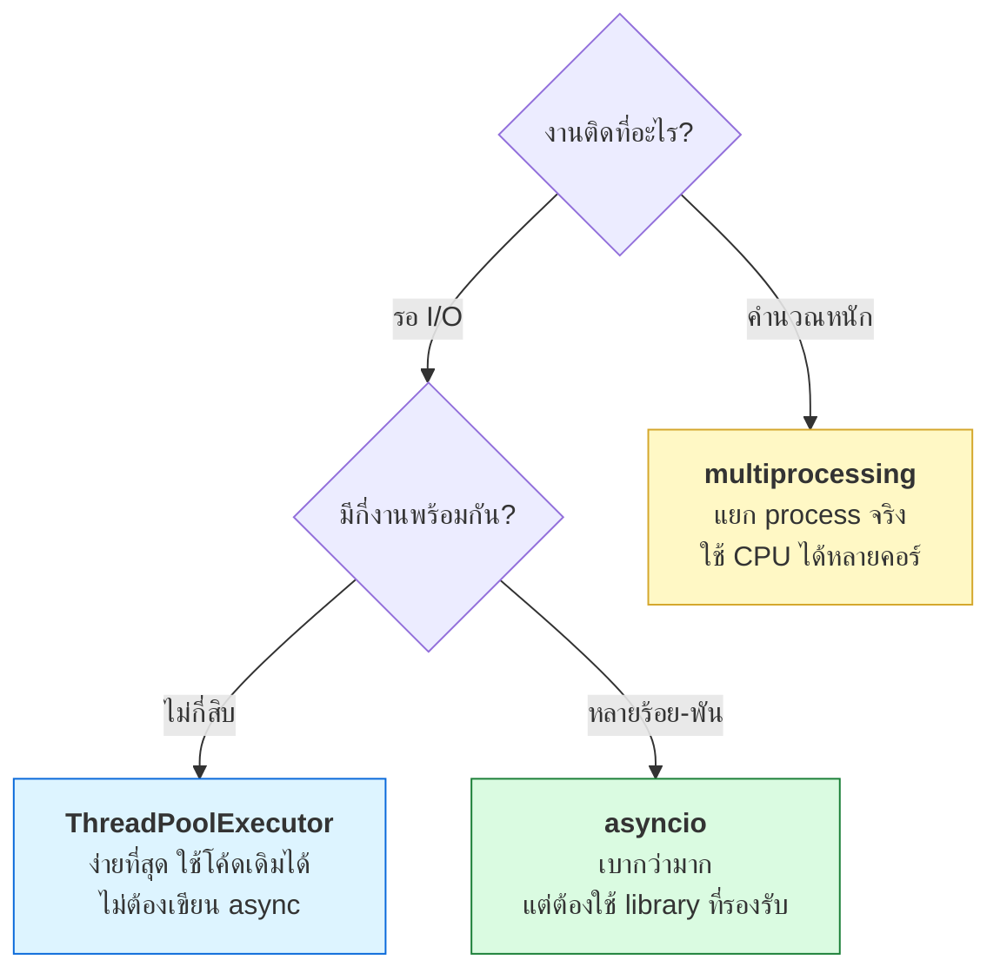

# บทที่ 33 · Concurrency และ async

> ได้ประโยชน์ทั้งสองด้านของงานคุณ — ฝั่งที่**ยิง** request และฝั่งที่**รับ** request
>
> และเป็นคำตอบว่าทำไม[บทที่ 29](29-realtime-push-and-offline.md) ถึงบอกว่า SSE ต้องใช้ ASGI

## 33.1 ปัญหาที่ concurrency แก้

```
ยิง 100 request แบบทีละอัน   ยิงพร้อมกัน 20 เส้น
100 × 200ms = 20 วินาที       ~1 วินาที
```

**ทำไมถึงเร็วขึ้นได้ทั้งที่ CPU เท่าเดิม** — เพราะเวลา 200ms นั้น CPU
**ไม่ได้ทำอะไรเลย** มันแค่รอ network ระหว่างรอก็ยิงเส้นอื่นได้

นี่คือความต่างที่ต้องเข้าใจก่อนอย่างอื่น:

| ชนิดงาน | ติดที่ไหน | แก้ด้วย |
|---------|-----------|---------|
| **I/O-bound** — ยิง HTTP, อ่าน DB, อ่านไฟล์ | รอ | **async / thread** ✅ |
| **CPU-bound** — แก้ PoW ([บทที่ 16](16-altcha-pow.md)), ประมวลผลรูป | คำนวณ | **process หลายตัว** |

> ⚠️ **ใช้ async กับงาน CPU-bound ไม่ได้ช่วยอะไรเลย** — ยังช้าเท่าเดิม
> แถมบล็อก event loop ทำให้งานอื่นค้างด้วย

## 33.2 สามวิธีใน Python



**GIL (Global Interpreter Lock)** คือเหตุผลที่ thread ใน Python ไม่ช่วยงาน CPU —
มีแค่ thread เดียวที่รัน Python bytecode ได้ในเวลาหนึ่ง **แต่ตอนรอ I/O มันปล่อย GIL**
thread จึงยังช่วยงาน I/O ได้เต็มที่

## 33.3 วิธีที่ง่ายที่สุด — ThreadPoolExecutor

ถ้ามีโค้ดที่ใช้ `requests` อยู่แล้ว วิธีนี้แทบไม่ต้องแก้อะไร

```python
from concurrent.futures import ThreadPoolExecutor
import requests

BASE = "http://127.0.0.1:8080"

def fetch(book_id: int) -> tuple[int, int]:
    r = requests.get(f"{BASE}/api/books", params={"tag": "curl"}, timeout=5)
    return book_id, r.status_code

with ThreadPoolExecutor(max_workers=10) as pool:
    for book_id, status in pool.map(fetch, range(1, 51)):
        print(book_id, status)
```

**ใช้ `Session` เดียวร่วมกันเพื่อให้ reuse connection** ([บทที่ 26.8](26-proxy-caching-cdn.md)):

```python
import threading

_local = threading.local()

def session() -> requests.Session:
    """หนึ่ง Session ต่อหนึ่ง thread — requests.Session ไม่ thread-safe เต็มร้อย"""
    if not hasattr(_local, "s"):
        _local.s = requests.Session()
    return _local.s

def fetch(path: str):
    return session().get(f"{BASE}{path}", timeout=5)
```

## 33.4 asyncio — เมื่อมีงานเยอะจริง

```python
import asyncio
import httpx

BASE = "http://127.0.0.1:8080"

async def main():
    # limits = connection pool — ตั้งให้พอดี ไม่ใช่ยิ่งเยอะยิ่งดี
    limits = httpx.Limits(max_connections=20, max_keepalive_connections=10)

    async with httpx.AsyncClient(base_url=BASE, limits=limits, timeout=5) as client:
        tasks = [client.get("/api/books", params={"tag": "curl"}) for _ in range(100)]
        results = await asyncio.gather(*tasks, return_exceptions=True)

    ok = sum(1 for r in results if not isinstance(r, Exception) and r.status_code == 200)
    print(f"สำเร็จ {ok}/{len(results)}")

asyncio.run(main())
```

**`return_exceptions=True` สำคัญ** — ถ้าไม่ใส่ พอมี task เดียวพัง `gather` จะโยน
exception ทันทีและ**ทิ้ง task ที่เหลือ** ผลลัพธ์ที่ทำไปแล้วหายหมด

### สามคำที่ต้องแยกให้ออก

| คำ | คืออะไร |
|----|---------|
| `async def` | ประกาศว่าฟังก์ชันนี้หยุดรอได้ (coroutine) |
| `await` | "หยุดตรงนี้ ปล่อยให้งานอื่นทำ แล้วค่อยกลับมา" |
| `asyncio.gather` | รันหลาย coroutine พร้อมกัน รอให้ครบ |

**กฎเหล็ก: ห้ามเรียกโค้ด blocking ใน async function**

```python
async def bad():
    requests.get(url)        # ❌ บล็อก event loop ทั้งหมดค้างรอด้วย
    time.sleep(1)            # ❌ เหมือนกัน

async def good():
    await client.get(url)    # ✅
    await asyncio.sleep(1)   # ✅
    # ถ้าจำเป็นต้องเรียกของ blocking จริง ๆ
    await asyncio.to_thread(blocking_function, arg)
```

## 33.5 จำกัดความเร็ว — สำคัญกว่าความเร็ว

**ยิงเร็วที่สุดที่ทำได้ = พฤติกรรมของบอทที่แย่** ([บทที่ 22.4](22-ethics-and-limits.md)) และจะโดน 429 อยู่ดี

```python
class Limiter:
    """ให้มีงานทำพร้อมกันได้ไม่เกิน N และเว้นระยะระหว่างการยิง"""
    def __init__(self, concurrency: int, min_interval: float = 0.0):
        self._sem = asyncio.Semaphore(concurrency)
        self._interval = min_interval
        self._last = 0.0
        self._lock = asyncio.Lock()

    async def __aenter__(self):
        await self._sem.acquire()
        if self._interval:
            async with self._lock:
                wait = self._last + self._interval - asyncio.get_running_loop().time()
                if wait > 0:
                    await asyncio.sleep(wait)
                self._last = asyncio.get_running_loop().time()

    async def __aexit__(self, *exc):
        self._sem.release()


limiter = Limiter(concurrency=5, min_interval=0.2)   # 5 เส้น, ห่างกัน 200ms

async def polite_get(client, path):
    async with limiter:
        return await client.get(path)
```

**`Semaphore` คือเครื่องมือหลัก** — จำกัดจำนวนงานที่ทำพร้อมกัน
ถ้าไม่มีตัวนี้ `gather` กับ 10,000 task จะเปิด connection พร้อมกัน 10,000 เส้น
แล้วทั้งเครื่องคุณและ server ปลายทางจะล่มพร้อมกัน

## 33.6 Retry ที่ถูกต้อง

โยงกับ[บทที่ 12.5](12-api-design-practices.md) และ 20.6 — คราวนี้ในเวอร์ชัน async

```python
import random

async def get_with_retry(client, path, max_attempts=5):
    for attempt in range(max_attempts):
        try:
            r = await client.get(path)
        except (httpx.TimeoutException, httpx.ConnectError):
            if attempt == max_attempts - 1:
                raise
        else:
            if r.status_code == 429:
                # เคารพ Retry-After ที่ server บอก อย่าเดาเอง
                wait = float(r.headers.get("Retry-After", 2 ** attempt))
                await asyncio.sleep(wait)
                continue
            if r.status_code < 500:
                return r          # 2xx/4xx = ผลสรุปแล้ว ไม่ต้อง retry
            # 5xx = ลองใหม่ได้

        # exponential backoff + jitter (กัน thundering herd — บทที่ 12.5)
        await asyncio.sleep(min(2 ** attempt, 30) + random.random())

    raise RuntimeError(f"ล้มเหลวหลังลอง {max_attempts} ครั้ง: {path}")
```

**อย่า retry 4xx** (ยกเว้น 429) — ส่งผิดกี่ครั้งก็ผิดเหมือนเดิม
และ **อย่า retry POST ที่ไม่ idempotent** ถ้าไม่มี `Idempotency-Key`

## 33.7 ฝั่ง server — ทำไม SSE ต้องใช้ ASGI

นี่คือคำตอบของ[บทที่ 29.2](29-realtime-push-and-offline.md) ข้อ 3

| แบบ | หนึ่ง request กิน | รับพร้อมกันได้ |
|-----|-------------------|----------------|
| **WSGI** (Flask/Django แบบเดิม) + thread | 1 thread (~8 MB stack) | หลักร้อย |
| **ASGI** (FastAPI/Starlette) + async | 1 coroutine (~KB) | หลักหมื่น |

**SSE และ WebSocket เปิดการเชื่อมต่อค้างไว้เป็นนาที ๆ** — ถ้าใช้ WSGI แบบ
thread ต่อ request ผู้ใช้ 500 คนก็กิน 500 thread แล้ว server ตาย

lab server ในคอร์สนี้ใช้ `ThreadingHTTPServer` ซึ่งเป็นแบบ thread —
**ใช้เรียนได้ แต่ห้ามเอาไป production**

```python
# FastAPI — endpoint แบบ async
@app.get("/v1/orders/{order_id}")
async def get_order(order_id: int, user = Depends(current_user)):
    return await db.fetch_order(order_id, user.id)   # ← ต้อง await ได้ทั้งสาย
```

> ⚠️ **ใช้ FastAPI แต่เรียก DB แบบ blocking = ไม่ได้อะไรเลย**
> ถ้า driver ฐานข้อมูลไม่รองรับ async (เช่น `psycopg2` ธรรมดา) event loop
> จะค้างทุกครั้งที่ query — ต้องใช้ `asyncpg`/`psycopg3 async` หรือ
> ห่อด้วย `asyncio.to_thread`

## 33.8 Connection pool — ตั้งให้พอดี

โยงกับ[บทที่ 27.4](27-database-and-performance.md) โดยตรง

```
pool ของ client × จำนวน instance  ≤  max_connections ของ DB
```

**ตัวอย่างที่ทำให้ระบบล่ม:**

```
10 instance × pool 50 = 500 connection
PostgreSQL max_connections = 100
→ instance ที่ 3 เป็นต้นไปต่อไม่ได้เลย
```

**ใหญ่ไปแย่กว่าเล็กไป** เพราะ:
- DB ปฏิเสธการเชื่อมต่อ = ระบบล่มทันที
- pool เล็กไป = แค่ช้าลง คิวรอ

ต้องตั้ง **timeout ของการรอ connection** ด้วยเสมอ ไม่งั้น request จะกองรอไม่รู้จบ

## 33.9 Backpressure — เมื่อผลิตเร็วกว่าที่บริโภคได้

```python
# ❌ อ่านทุกอย่างเข้าหน่วยความจำก่อน
tasks = [fetch(u) for u in urls]        # urls มี 1 ล้านตัว → ระเบิด
await asyncio.gather(*tasks)

# ✅ ทยอยทำเป็นชุด
async def in_batches(urls, size=100):
    for i in range(0, len(urls), size):
        yield await asyncio.gather(*(fetch(u) for u in urls[i:i+size]))
```

หรือใช้ `asyncio.Queue` ที่มี `maxsize` — พอคิวเต็ม ฝั่งผลิตจะถูกบล็อกเอง

**นี่คือปัญหาเดียวกับ WebSocket backpressure ใน[บทที่ 29.3](29-realtime-push-and-offline.md)** — ถ้า client
รับช้ากว่าที่คุณส่ง buffer จะบวมจนหน่วยความจำเต็ม

## 33.10 Debug โค้ด async

```python
asyncio.run(main(), debug=True)     # เตือนเมื่อมี coroutine ที่บล็อกนานเกินไป
```

| ปัญหา | อาการ | แก้ |
|-------|-------|-----|
| เรียก blocking ใน async | ทุกอย่างช้าพร้อมกัน ไม่ใช่แค่จุดเดียว | หา `requests`/`time.sleep` ให้เจอ |
| ลืม `await` | ได้ coroutine object แทนผลลัพธ์ | Python เตือน `coroutine was never awaited` |
| task พังเงียบ | ไม่มี error แต่ผลไม่ครบ | `return_exceptions=True` แล้วตรวจผล |
| ค้างไม่จบ | ไม่มีอะไรเกิดขึ้น | ตั้ง timeout ทุกจุด `asyncio.wait_for` |

## 33.11 ⚠️ อย่าลืมมารยาท

ทุกอย่างในบทนี้ทำให้คุณยิงได้เร็วขึ้นมาก **ซึ่งแปลว่าทำให้ระบบคนอื่นล่มได้ง่ายขึ้นมากด้วย**

- ยิงเว็บของคนอื่น → เริ่มที่ 1-2 เส้น + หน่วง 1 วินาที ([บทที่ 22.4](22-ethics-and-limits.md))
- เคารพ `429` และ `Retry-After` เสมอ
- หยุดทันทีเมื่อเจอ 5xx ติดกัน — อาจเป็นเพราะคุณทำให้เขาล่ม
- ทดสอบความเร็วสูงกับ **lab ของตัวเองเท่านั้น**

## แบบฝึกหัด

1. เขียนสคริปต์ยิง `/api/books` 100 ครั้งแบบทีละอัน จับเวลา จากนั้นเปลี่ยนเป็น
   `ThreadPoolExecutor(max_workers=10)` เทียบเวลา
2. ทำเวอร์ชัน `asyncio` + `httpx` แล้วเทียบทั้งสามวิธี
3. ใช้ `Limiter` ในข้อ 33.5 จำกัดที่ 5 เส้น ห่างกัน 200ms แล้วยืนยันด้วย
   `ss -tan | grep 8080 | wc -l` ว่าไม่เกิน 5 จริง
4. **พิสูจน์ว่า async ไม่ช่วยงาน CPU** — เอา `solve_pow` จาก
   [lab/solve_pow.py](../lab/solve_pow.py) มารันด้วย `asyncio.gather` 4 ตัว
   เทียบกับ `ProcessPoolExecutor` 4 process
5. เขียนโค้ดที่ลืม `await` แล้วดูว่า Python เตือนว่าอะไร
6. ใช้ `nc` ทำ server ที่ตอบ `429` + `Retry-After: 3` (ภาคผนวก A.6)
   แล้วทดสอบว่า `get_with_retry` รอจริง 3 วินาที
7. ยิง `/api/stream` (SSE) พร้อมกัน 50 เส้นด้วย async แล้วดูว่า lab server
   แบบ thread รับไหวไหม — ดูจำนวน thread ด้วย `ls /proc/<pid>/task | wc -l`

***
[⬅ เขียนเทสต์ให้ API](32-testing-with-pytest.md) · [สารบัญ](../README.md) · [Debug และกับดักที่เจอบ่อย ➡](21-debugging-and-pitfalls.md)
