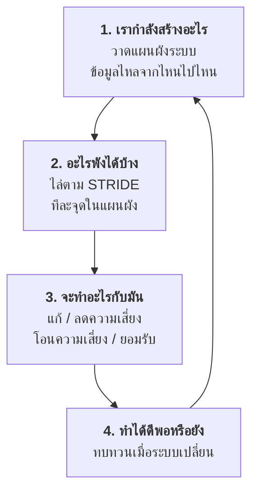
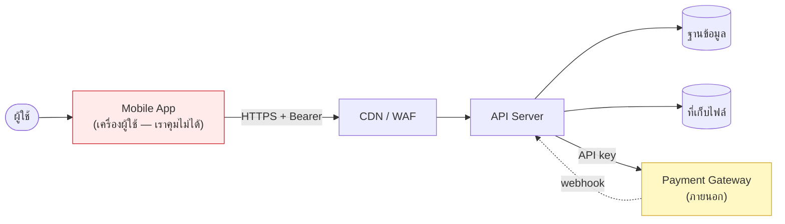
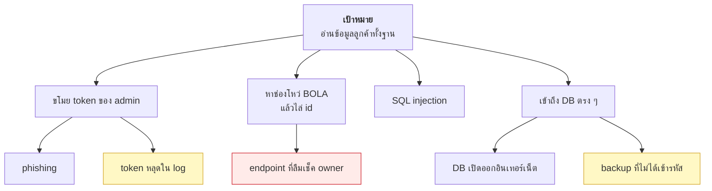

# บทที่ 34 · Threat modeling — คิดเองเป็น ไม่ใช่ท่อง checklist

> [บทที่ 11](11-mobile-api-auth-design.md), 24, 25 ให้ checklist ไว้เยอะ — แต่ **checklist มีวันหมดอายุ**
> และมันไม่ครอบคลุมระบบเฉพาะของคุณ
>
> บทนี้สอนวิธีสร้าง checklist ของตัวเอง

## 34.1 ทำไม checklist อย่างเดียวไม่พอ {#s34-1}

| ปัญหาของ checklist | ตัวอย่าง |
|--------------------|----------|
| ไม่รู้จักระบบของคุณ | ไม่มีข้อไหนบอกว่า "ระวังฟีเจอร์แชร์ลิงก์ของคุณ" |
| ล้าสมัย | OWASP Top 10 ปรับทุก 3-4 ปี ภัยใหม่มาเร็วกว่านั้น |
| ทำให้เลิกคิด | ติ๊กครบ 20 ข้อแล้วรู้สึกปลอดภัย ทั้งที่ช่องโหว่จริงอยู่ข้อที่ 21 |

**Threat modeling คือการนั่งถามตัวเองอย่างเป็นระบบว่า "อะไรพังได้บ้าง"**
ก่อนที่คนอื่นจะถามแทนคุณ

ไม่ต้องใช้เครื่องมือแพง ๆ — กระดาษแผ่นเดียวกับเวลาหนึ่งชั่วโมงก็ได้ผลแล้ว

## 34.2 สี่คำถามที่ต้องตอบ {#s34-2}



นี่คือกรอบของ [Threat Modeling Manifesto](https://www.threatmodelingmanifesto.org/)
ซึ่งเรียบง่ายและใช้ได้จริงกว่าวิธีที่ซับซ้อนกว่านี้

## 34.3 ขั้นที่ 1 — วาดว่าข้อมูลไหลไปไหน {#s34-3}

**อย่าเริ่มจากรายการภัย เริ่มจากแผนผัง** เพราะภัยเกิดที่ "รอยต่อ"



**เส้นประแดงคือ "เขตแดนความไว้ใจ" (trust boundary)** — จุดที่ข้อมูลข้ามจาก
พื้นที่ที่เราคุมได้ ไปสู่พื้นที่ที่เราคุมไม่ได้

| เขตแดน | ทำไมสำคัญ |
|--------|-----------|
| ผู้ใช้ → แอป | ผู้ใช้ป้อนอะไรก็ได้ |
| **แอป → API** | **แอปอยู่บนเครื่องผู้ใช้ = ศัตรูอาจคุมมันอยู่** ([บทที่ 15.8](15-captcha-and-antibot.md#s15-8)) |
| API → DB | injection ([บทที่ 25.2](25-input-validation-and-injection.md#s25-2)) |
| **ภายนอก → API** (webhook) | ใครก็ยิงได้ ([บทที่ 13](13-webhooks-and-hmac.md)) |
| API → ภายนอก | SSRF ([บทที่ 25.4](25-input-validation-and-injection.md#s25-4)) |

> **ภัยเกือบทั้งหมดเกิดที่เขตแดนพวกนี้** — วาดให้ครบแล้วคุณจะรู้ว่าต้องตรวจตรงไหน

## 34.4 ขั้นที่ 2 — STRIDE {#s34-4}

ไล่ทีละจุดในแผนผัง ถามด้วย 6 คำนี้

| ตัวอักษร | ภัย | ถามว่า | ป้องกันด้วย |
|----------|-----|--------|-------------|
| **S**poofing | ปลอมตัว | ใครแกล้งเป็นคนอื่นได้ไหม | authentication (บท 9-11) |
| **T**ampering | แก้ข้อมูล | ใครแก้ข้อมูลระหว่างทาง/ในที่เก็บได้ไหม | TLS, HMAC (บท 7, 13) |
| **R**epudiation | ปฏิเสธความรับผิด | พิสูจน์ได้ไหมว่าใครทำอะไร | log ที่แก้ไม่ได้ (บท 28) |
| **I**nformation disclosure | ข้อมูลรั่ว | ใครเห็นสิ่งที่ไม่ควรเห็นไหม | **BOLA** (บท 24), encryption |
| **D**enial of service | ทำให้ล่ม | ใครทำให้ระบบใช้ไม่ได้ไหม | rate limit (บท 12, 15) |
| **E**levation of privilege | ยกระดับสิทธิ์ | ผู้ใช้ธรรมดากลายเป็น admin ได้ไหม | authorization (บท 24) |

### ตัวอย่างจริง — ไล่ STRIDE ที่ endpoint เดียว

`POST /v1/orders` (สร้างคำสั่งซื้อ)

| | ภัยที่นึกออก | มีแล้วหรือยัง |
|---|-------------|---------------|
| **S** | ใช้ token ที่ขโมยมา | ✅ token อายุสั้น + rotation (บท 11) |
| **S** | ปลอม webhook ยืนยันการจ่ายเงิน | ✅ HMAC signature (บท 13) |
| **T** | แก้ราคาใน request ให้เป็น 1 บาท | ❓ **server คำนวณราคาเองหรือเชื่อ client?** |
| **R** | ลูกค้าอ้างว่าไม่ได้สั่ง | ❓ log พอไหม ใครแก้ log ได้บ้าง |
| **I** | ดู order ของคนอื่นด้วยการเดา id | ✅ ownership check (บท 24) |
| **D** | ยิงสร้าง order รัว ๆ | ❓ มี rate limit ที่ endpoint นี้ไหม |
| **E** | ส่ง `"role": "admin"` มาใน body | ❓ **mass assignment** (บท 25.6) |

**ช่องที่เป็น ❓ คือผลลัพธ์ของการทำ threat modeling** — สี่ข้อที่คุณอาจไม่ได้คิดถึง
ถ้าไล่แค่ checklist

**ข้อ T เป็นคลาสสิกที่สุด** — API ที่รับ `{"item_id": 1, "price": 100}` แล้ว
บันทึกราคาตามที่ client บอก คือช่องโหว่ที่พบจริงในระบบ e-commerce จำนวนมาก
**ราคาต้องมาจากฐานข้อมูลเสมอ ไม่ใช่จาก client**

## 34.5 ขั้นที่ 3 — จัดลำดับ แล้วตัดสินใจ {#s34-5}

ไม่ใช่ทุกภัยที่ต้องแก้ **จัดลำดับด้วยสองแกน**

```
         ผลกระทบสูง
              │
   แก้ทันที   │   แก้ก่อน
              │
──────────────┼────────────── โอกาสเกิด
              │
   ยอมรับ     │   วางแผนแก้
              │
         ผลกระทบต่ำ
```

**สี่ทางเลือกที่มีเสมอ:**

| ทางเลือก | ตัวอย่าง |
|----------|----------|
| **แก้** (mitigate) | เพิ่ม ownership check |
| **โอน** (transfer) | ใช้ payment gateway แทนเก็บเลขบัตรเอง |
| **หลีกเลี่ยง** (avoid) | ตัดฟีเจอร์ "ดึงรูปจาก URL" ทิ้ง เลี่ยง SSRF ทั้งก้อน |
| **ยอมรับ** (accept) | ความเสี่ยงต่ำ ต้นทุนแก้สูง — **แต่ต้องบันทึกไว้ว่าตัดสินใจแล้ว** |

> **"ยอมรับ" ต่างจาก "ไม่รู้"** — การเขียนไว้ว่า "เรารู้ว่ามีความเสี่ยงนี้
> และเลือกยอมรับเพราะ X" คือการตัดสินใจที่ถูกต้องได้ ส่วนการไม่เคยคิดถึงมันไม่ใช่

## 34.6 คิดแบบผู้โจมตี — attack tree {#s34-6}

ตั้งเป้าหมายของผู้โจมตีไว้บนสุด แล้วแตกลงมาว่าไปถึงได้ทางไหนบ้าง



**ประโยชน์ของการวาดแบบนี้:** มันเผยทางที่คุณไม่ได้ป้องกัน
เช่น **backup ที่ไม่ได้เข้ารหัส** — คนมักป้องกัน DB อย่างดีแล้วลืมว่า backup
คือสำเนาของข้อมูลเดียวกันที่มักเก็บไว้หลวม ๆ กว่ามาก

## 34.7 ทำจริงกับ lab server {#s34-7}

ลองไล่ดูว่า lab server ของเรามีอะไรบ้าง (ดู "จุดที่ตั้งใจทำไม่ครบ" ใน
[lab/README.md](../lab/README.md))

| ภัย | STRIDE | สถานะใน lab |
|-----|--------|-------------|
| ไม่มี rate limit ที่ `/api/token` | D | ❌ ยิงเดารหัสได้ไม่จำกัด |
| PoW payload ใช้ซ้ำได้ | S, D | ❌ แก้โจทย์ครั้งเดียวยิงได้หมื่นครั้ง |
| `/api/v1/orders` ไม่เช็ค owner | I | ❌ **โดยเจตนา** ไว้สอน[บทที่ 24](24-authorization-and-bola.md) |
| `/api/fetch` ไม่ตรวจ URL | I | ❌ **โดยเจตนา** ไว้สอน[บทที่ 25](25-input-validation-and-injection.md) |
| password เก็บเป็น plain text | I | ❌ ของจริงต้อง Argon2 |
| ไม่มี log เลย | R | ❌ สืบสวนอะไรไม่ได้ |

**นี่คือรูปแบบผลลัพธ์ที่ควรได้จากการทำ threat modeling** — ตารางเดียวที่บอกว่า
รู้อะไรแล้ว ยังไม่ได้ทำอะไร และอันไหนจงใจ

## 34.8 ทำเมื่อไร และใช้เวลาเท่าไร {#s34-8}

| จังหวะ | ใช้เวลา |
|--------|---------|
| ก่อนเริ่มเขียนฟีเจอร์ใหม่ที่แตะข้อมูลอ่อนไหว | 30-60 นาที |
| เมื่อเพิ่ม integration ภายนอก | 30 นาที |
| ทบทวนทั้งระบบ | ปีละครั้ง |
| **หลังเกิดเหตุจริง** | ทันที |

**อย่ารอให้สมบูรณ์แบบ** — threat model ที่ทำ 1 ชั่วโมงแล้วเจอ 3 ช่องโหว่
มีค่ากว่าที่วางแผนจะทำอย่างละเอียดแล้วไม่เคยได้ทำ

**เก็บไว้ใน git ข้างโค้ด** ([บทที่ 30](30-git.md)) เป็นไฟล์ `THREATS.md` ธรรมดา
จะได้ทบทวนและเห็นว่าเปลี่ยนไปอย่างไร

## 34.9 กับดักของการทำ threat modeling {#s34-9}

| กับดัก | แก้ |
|--------|-----|
| ไล่รายการภัยโดยไม่มีแผนผัง | วาดก่อนเสมอ |
| หมกมุ่นกับภัยที่เท่แต่ไม่น่าเกิด | ถามว่า "ใครจะทำ และได้อะไร" |
| ลืมภัยจากคนใน | พนักงานที่ลาออกยังมีสิทธิ์อยู่ไหม |
| ลืม availability | ระบบที่ปลอดภัยแต่ล่มก็ใช้ไม่ได้ |
| ทำครั้งเดียวแล้วจบ | ระบบเปลี่ยน ภัยเปลี่ยน |
| ทำคนเดียว | คนอื่นเห็นมุมที่คุณมองข้าม |

## 34.10 เชื่อมกับทั้งคอร์ส {#s34-10}

threat modeling คือ**เส้นด้ายที่ร้อยทุกบทเข้าด้วยกัน**

| ถ้าเจอภัย | ไปอ่านบท |
|-----------|----------|
| ปลอมตัว / token | 9, 10, **11** |
| ดูข้อมูลคนอื่น | **24** |
| ข้อมูลนำเข้าไม่น่าไว้ใจ | **25** |
| ยิงถล่ม | 12, **15** |
| ข้อมูลระหว่างทาง | **7**, 13 |
| สืบสวนไม่ได้ | **28** |
| ของที่ client คุม | **15.8** |

## แบบฝึกหัด

1. วาดแผนผังข้อมูลของ API ที่คุณกำลังทำจริง ระบุ trust boundary ให้ครบ
2. เลือก endpoint ที่สำคัญที่สุด 1 อัน แล้วไล่ STRIDE ทั้ง 6 ข้อ เขียนเป็นตาราง
3. ตรวจข้อ T กับ API ของคุณ: **มีที่ไหนที่เชื่อตัวเลขจาก client ไหม**
   (ราคา, จำนวน, ส่วนลด, user_id)
4. วาด attack tree ของเป้าหมาย "อ่านข้อมูลผู้ใช้ทั้งฐาน" — มีกี่ทาง
   และคุณปิดไปแล้วกี่ทาง
5. เขียน `THREATS.md` ในโปรเจกต์คุณ ลงรายการที่เจอพร้อมการตัดสินใจ
   (แก้ / ยอมรับ / วางแผน) แล้ว commit ลง git
6. ทำแบบเดียวกับ lab server แล้วเทียบกับตารางใน[ข้อ 34.7](#s34-7) — เจออะไรที่ผมไม่ได้ลิสต์ไหม
7. ถามคำถามยาก: **ถ้าคุณเป็นผู้โจมตีที่มีเวลา 1 สัปดาห์และรู้ว่าระบบคุณเขียนด้วยอะไร
   คุณจะเริ่มจากตรงไหน**

***
[⬅ การระบุตัวตนบนอินเทอร์เน็ต](62-anonymity-and-tunneling.md) · [สารบัญ](../README.md) · [จริยธรรมและขอบเขต ➡](22-ethics-and-limits.md)
