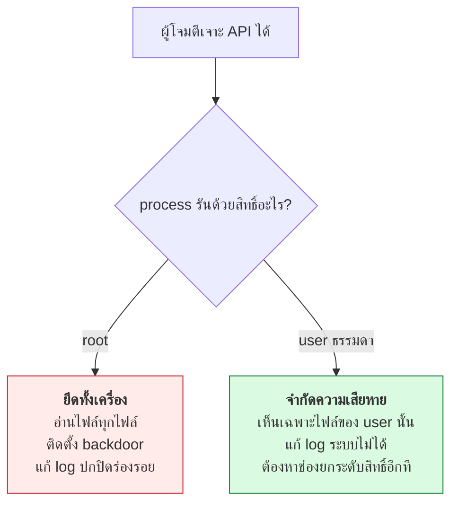
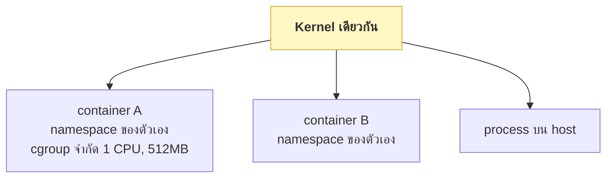

# บทที่ 36 · สิทธิ์และการแยกส่วน

> หลักการเดียวของทั้งบท: **ให้สิทธิ์น้อยที่สุดเท่าที่ทำงานได้** (least privilege)
>
> ถ้าโปรแกรมถูกเจาะ ความเสียหายจะจำกัดอยู่แค่สิ่งที่มันมีสิทธิ์ทำ

## 36.1 สิทธิ์ไฟล์แบบดั้งเดิม {#s36-1}

```bash
ls -l lab/server.py
```

```
-rw-rw-r-- 1 student1 student1 24576 Aug 27 19:52 lab/server.py
 │└┬┘└┬┘└┬┘   └──┬───┘ └──┬───┘
 │ │  │  │      เจ้าของ  กลุ่ม
 │ │  │  └── คนอื่น: อ่านได้
 │ │  └───── กลุ่ม: อ่าน+เขียน
 │ └──────── เจ้าของ: อ่าน+เขียน
 └────────── ชนิด: - ไฟล์ธรรมดา, d โฟลเดอร์, l symlink
```

| ตัวเลข | สิทธิ์ | ความหมายกับไฟล์ | ความหมายกับ**โฟลเดอร์** |
|--------|--------|------------------|--------------------------|
| 4 | `r` | อ่านเนื้อหา | **ดูรายชื่อไฟล์ข้างใน** |
| 2 | `w` | แก้ไข | **สร้าง/ลบไฟล์ข้างใน** |
| 1 | `x` | รันได้ | **เข้าไปในโฟลเดอร์ได้** |

> **`x` ของโฟลเดอร์คือจุดที่คนงงที่สุด** — ถ้าไม่มี `x` คุณเข้าไปในโฟลเดอร์ไม่ได้
> แม้จะรู้ชื่อไฟล์ข้างในก็ตาม และ **`w` ของโฟลเดอร์ให้สิทธิ์ลบไฟล์ข้างใน
> แม้ไฟล์นั้นจะไม่ใช่ของคุณ**

### ตัวเลขที่ควรจำ

```bash
chmod 600 ~/.env          # เจ้าของอ่าน/เขียน คนอื่นไม่เห็นเลย ← secret
chmod 644 index.html      # เจ้าของแก้ได้ คนอื่นอ่านได้
chmod 700 ~/private/      # โฟลเดอร์ส่วนตัว
chmod 755 script.sh       # รันได้ทุกคน แก้ได้เจ้าของ
```

**`600` คือสิทธิ์ของทุกอย่างที่เป็นความลับ** — cookie jar ([บทที่ 20.3](20-shell-scripting-for-curl.md#s20-3)),
`.env`, private key, `state.json` ของ Playwright ([บทที่ 18.10](18-playwright-cookies-to-curl.md#s18-10))

```bash
umask 077       # ไฟล์ใหม่ที่สร้างจะเป็น 600 อัตโนมัติ
```

## 36.2 อย่ารันเป็น root {#s36-2}



```bash
# สร้าง user เฉพาะสำหรับ service — ไม่มี shell ไม่มี home
sudo useradd --system --no-create-home --shell /usr/sbin/nologin myapi
sudo chown -R myapi:myapi /srv/myapi
```

**"แต่ผมต้อง bind port 80"** — นั่นคือเหตุผลเดียวที่คนมักอ้างว่าต้องใช้ root
แก้ได้สามทางโดยไม่ต้องเป็น root:

```bash
# 1. ให้เฉพาะสิทธิ์ที่ต้องการ (ดูข้อ 36.3)
sudo setcap cap_net_bind_service=+ep /srv/myapi/.venv/bin/python

# 2. ให้ systemd เปิด socket ให้ (socket activation)
# 3. ให้ nginx ฟัง 80/443 แล้ว proxy ไป 8000 ← ที่นิยมที่สุด (บทที่ 26)
```

## 36.3 Capabilities — แยก "อำนาจของ root" เป็นชิ้น ๆ {#s36-3}

เดิม Linux มีแค่สองระดับ: root ทำได้ทุกอย่าง / ไม่ใช่ root ทำอะไรไม่ได้เลย
**capabilities แบ่งอำนาจนั้นเป็นชิ้นย่อย ๆ ให้แจกทีละอย่างได้**

```bash
capsh --print | head -3
getcap /usr/bin/ping
```

| Capability | ให้ทำอะไร | ตัวอย่างที่เจอในคอร์สนี้ |
|------------|-----------|--------------------------|
| `cap_net_bind_service` | bind port < 1024 | server ที่ต้องฟัง 80/443 |
| `cap_net_raw` | ส่ง packet ดิบ | **`tcpdump`, `ping`** ([บทที่ 31.6](31-tcpip-and-tcpdump.md#s31-6)) |
| `cap_net_admin` | ตั้งค่าเครือข่าย | firewall, interface |
| `cap_sys_ptrace` | ดู process อื่น | **`strace`** ([บทที่ 35.7](35-linux-internals.md#s35-7)) |
| `cap_dac_override` | ข้ามการตรวจสิทธิ์ไฟล์ | ⚠️ เกือบเท่ากับ root |

**นี่คือคำสั่งที่[บทที่ 31](31-tcpip-and-tcpdump.md) ให้ใช้กับ tcpdump:**

```bash
sudo setcap cap_net_raw,cap_net_admin=eip "$(which tcpdump)"
```

หลังจากนี้ `tcpdump` ดัก packet ได้โดยไม่ต้อง `sudo` — **แต่ยังทำอย่างอื่น
ของ root ไม่ได้** นั่นคือความต่างที่สำคัญ

> ⚠️ **capability บางตัวเท่ากับ root กลาย ๆ** — `cap_sys_admin`, `cap_dac_override`,
> `cap_sys_ptrace` ให้แล้วแทบไม่ต่างจากให้ root ตรวจให้ดีก่อนแจก

## 36.4 setuid — ดาบสองคม {#s36-4}

```bash
find /usr/bin -perm -4000 -type f | head -5
```

```
/usr/bin/newgrp
/usr/bin/gpasswd
/usr/bin/su
/usr/bin/passwd
/usr/bin/sudo
```

**ไฟล์เหล่านี้รันด้วยสิทธิ์ของ *เจ้าของไฟล์* ไม่ใช่คนที่เรียก** — `passwd`
เป็นของ root จึงเขียน `/etc/shadow` ได้ ทั้งที่คุณเรียกมันในฐานะ user ธรรมดา

**นี่คือช่องทางยกระดับสิทธิ์อันดับหนึ่ง** — ถ้ามีช่องโหว่ในโปรแกรม setuid
ผู้โจมตีได้ root ทันที

```bash
# ตรวจว่าเครื่องมีอะไร setuid ผิดปกติไหม
find / -perm -4000 -type f 2>/dev/null
```

**อย่าเขียนโปรแกรม setuid เอง** — ใช้ `sudo` ที่มี policy ชัดเจน หรือ capability แทน

## 36.5 Namespace — พื้นฐานของ container {#s36-5}

**container ไม่ใช่ VM** มันคือ process ธรรมดาที่ถูกจำกัดมุมมองด้วย namespace

```bash
ls -l /proc/$PID/ns/
```

```
cgroup -> cgroup:[4026531835]
ipc    -> ipc:[4026531839]
mnt    -> mnt:[4026531832]
net    -> net:[4026531833]
pid    -> pid:[4026531836]
```

| Namespace | แยกอะไร | ผลที่เห็น |
|-----------|---------|-----------|
| `pid` | ตาราง process | ใน container เห็น PID 1 เป็นแอปตัวเอง |
| `net` | เครือข่าย | มี interface, IP, port ของตัวเอง |
| `mnt` | ระบบไฟล์ | เห็นแค่ไฟล์ใน image |
| `user` | ผู้ใช้ | **root ใน container = user ธรรมดาข้างนอก** |
| `ipc`, `uts` | หน่วยความจำร่วม, hostname | |

**`cgroup` เป็นคนละเรื่องกับ namespace** — namespace จำกัดว่า *เห็นอะไร*
ส่วน cgroup จำกัดว่า *ใช้ทรัพยากรได้เท่าไร* (CPU, RAM, I/O)



**เพราะใช้ kernel ร่วมกัน container จึงแยกได้ไม่ขาดเท่า VM** — ช่องโหว่ระดับ
kernel หลุดออกจาก container ได้ ถ้าต้องการการแยกที่แข็งกว่านี้ต้องใช้ VM
หรือ gVisor / Firecracker

## 36.6 Container ให้ปลอดภัย {#s36-6}

```dockerfile
FROM python:3.12-slim

# สร้าง user ธรรมดา — อย่ารันเป็น root ใน container
RUN useradd --system --no-create-home --uid 10001 appuser

WORKDIR /srv
COPY --chown=appuser:appuser requirements.txt .
RUN pip install --no-cache-dir -r requirements.txt
COPY --chown=appuser:appuser . .

USER appuser                       # ← สำคัญที่สุด
EXPOSE 8000
CMD ["python", "-m", "myapi"]
```

```bash
docker run \
  --user 10001:10001 \
  --read-only \                       # ระบบไฟล์อ่านอย่างเดียว
  --tmpfs /tmp \                      # ยกเว้น /tmp
  --cap-drop=ALL \                    # ตัด capability ทั้งหมด
  --security-opt no-new-privileges \  # ห้ามยกระดับสิทธิ์
  --memory 512m --cpus 1 \            # cgroup limit
  myapi
```

| ตั้งค่า | กันอะไร |
|---------|---------|
| `USER` ไม่ใช่ root | ผู้โจมตีไม่ได้ root ใน container |
| `--read-only` | เขียน backdoor ลงระบบไฟล์ไม่ได้ |
| `--cap-drop=ALL` | ตัดอำนาจพิเศษทั้งหมด |
| `no-new-privileges` | setuid ใช้ไม่ได้ ([ข้อ 36.4](#s36-4)) |
| `--memory` | container เดียวกิน RAM หมดเครื่องไม่ได้ |

**สิ่งที่ห้ามทำเด็ดขาด:**

```bash
docker run --privileged ...              # ❌ เท่ากับ root บน host
docker run -v /var/run/docker.sock:... # ❌ คุม docker ได้ = คุมเครื่องได้
docker run -v /:/host ...                # ❌ เห็นระบบไฟล์ทั้งเครื่อง
```

## 36.7 Secret ใน container {#s36-7}

```dockerfile
ENV API_TOKEN=sk_live_xxx        # ❌ ติดอยู่ใน image layer ตลอดกาล
```

**`docker history` เปิดดูได้** และ image ที่ push ขึ้น registry ก็มีมันติดไปด้วย

```bash
docker history --no-trunc myimage | grep -i token
```

**วิธีที่ถูก:**

```bash
docker run --env-file /etc/myapi/env myapi     # ไฟล์ chmod 600 บน host
# หรือ mount secret เข้ามาเป็นไฟล์
docker run -v /run/secrets/token:/run/secrets/token:ro myapi
```

Kubernetes: ใช้ Secret **แต่ต้องรู้ว่า Secret ของ k8s เป็นแค่ base64
ไม่ใช่การเข้ารหัส** ([บทที่ 6.5](06-encoding-and-charset.md#s6-5)) — ต้องเปิด encryption at rest ด้วย

## 36.8 SELinux / AppArmor {#s36-8}

ชั้นบังคับเพิ่มเติมที่ทำงาน**เหนือ**สิทธิ์ปกติ — แม้ไฟล์จะให้สิทธิ์อ่านได้
ถ้า policy ไม่อนุญาตก็ยังอ่านไม่ได้

```bash
aa-status                    # AppArmor (Ubuntu/Debian)
getenforce                   # SELinux (RHEL/Fedora)
```

**เวลาเจอ "permission denied" ที่อธิบายไม่ได้ ให้นึกถึงสองตัวนี้:**

```bash
sudo dmesg | grep -i 'apparmor\|avc:  denied'
sudo ausearch -m avc -ts recent     # SELinux
```

> ⚠️ **อย่าปิดมันเพื่อแก้ปัญหา** (`setenforce 0`) — นั่นคือการถอดเกราะออก
> ให้เขียน policy ให้ถูกแทน

## 36.9 Checklist สำหรับ API ของคุณ {#s36-9}

- [ ] service รันด้วย user เฉพาะ ไม่ใช่ root และไม่ใช่ user ส่วนตัวของคุณ
- [ ] ไฟล์ secret เป็น `600` และเจ้าของคือ user ของ service
- [ ] ไม่มี secret ใน `ENV` ของ Dockerfile หรือใน image
- [ ] container ตั้ง `USER`, `--cap-drop=ALL`, `no-new-privileges`
- [ ] มี memory/CPU limit
- [ ] ระบบไฟล์ read-only เท่าที่ทำได้
- [ ] ไม่มี `--privileged` และไม่ mount docker socket
- [ ] ถ้าต้อง bind port ต่ำ ใช้ capability หรือ reverse proxy ไม่ใช่ root
- [ ] ตรวจว่าไม่มีไฟล์ setuid แปลกปลอมบนเครื่อง
- [ ] backup ก็ต้องมีสิทธิ์เข้มเท่าข้อมูลต้นฉบับ (โยงกับ attack tree [บทที่ 34.6](34-threat-modeling.md#s34-6))

## แบบฝึกหัด

1. ดู `ls -l` ของ `lab/server.py` แล้วอ่านสิทธิ์ให้ออกทีละตัวอักษร
2. สร้างโฟลเดอร์แล้วเอา `x` ออก (`chmod 600 dir/`) — ยังเข้าไปดูไฟล์ข้างในได้ไหม
   ทั้งที่รู้ชื่อไฟล์
3. `chmod 600` ไฟล์ cookie jar ที่สร้างจาก[บทที่ 4](04-cookies-sessions.md) แล้วตรวจด้วย `ls -l`
4. รัน `getcap $(which ping)` — ทำไม `ping` ถึงส่ง ICMP ได้โดยไม่ต้อง sudo
5. ให้ capability กับ `tcpdump` ตาม[ข้อ 36.3](#s36-3) แล้วยืนยันว่าดัก packet ได้โดยไม่ sudo
   จากนั้นลอง `tcpdump` อ่านไฟล์ของ root — ทำได้ไหม (ควรไม่ได้)
6. หาไฟล์ setuid ทั้งเครื่องด้วย `find / -perm -4000 -type f 2>/dev/null`
   แล้วเลือกมา 1 ตัว อธิบายว่าทำไมมันต้อง setuid
7. เขียน Dockerfile ให้ lab server ตาม[ข้อ 36.6](#s36-6) แล้วรันด้วย `--cap-drop=ALL`
   ทดสอบว่ายังทำงานได้
8. ลองใส่ `ENV SECRET=abc123` ใน Dockerfile แล้วหาให้เจอด้วย `docker history`

***
[⬅ Linux internals ที่คนทำ API ต้องรู้](35-linux-internals.md) · [สารบัญ](../README.md) · [หน่วยความจำและช่องโหว่คลาสสิก ➡](37-memory-and-classic-exploits.md)
