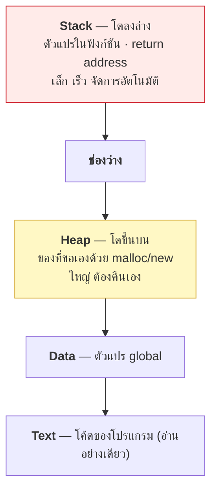
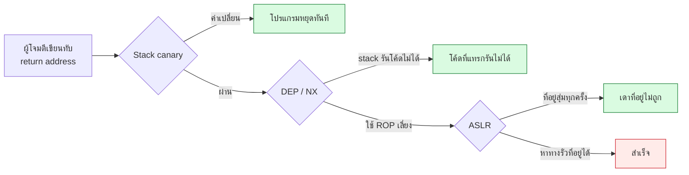

# บทที่ 37 · หน่วยความจำและช่องโหว่คลาสสิก

> บทนี้อธิบายว่า **buffer overflow ทำงานอย่างไร** และทำไมภาษาสมัยใหม่
> ถึงไม่ค่อยเจอปัญหานี้
>
> เป้าหมายคือ **เข้าใจเพื่อป้องกันและอ่าน CVE ให้ออก** ไม่ใช่เพื่อเขียน exploit

## 37.1 ทำไมคนเขียน Python ต้องรู้เรื่องนี้ {#s37-1}

คุณอาจคิดว่า "ผมเขียน Python ไม่ต้องสนใจ memory" — จริงบางส่วน แต่:

| เหตุผล | ตัวอย่าง |
|--------|----------|
| **Python รันบน C** | ช่องโหว่ใน CPython, OpenSSL, zlib กระทบคุณโดยตรง |
| **อ่าน CVE ให้ออก** | "heap overflow in libwebp" — ควรรู้ว่าร้ายแค่ไหน ต้องรีบแพตช์ไหม |
| **dependency เป็น C** | `cryptography`, `pillow`, `lxml` ล้วนมี C อยู่ข้างใน |
| **เข้าใจว่าทำไมต้องแพตช์** | ไม่ใช่แค่ "เขาบอกให้อัปเดต" |

**Heartbleed, Log4Shell, XZ backdoor** — ทั้งสามเรื่องกระทบคนที่ไม่ได้เขียน C เลย

## 37.2 หน่วยความจำของโปรแกรมหน้าตาอย่างไร {#s37-2}



**Stack คือจุดที่ช่องโหว่คลาสสิกเกิด** เพราะมันเก็บ **return address** —
ที่อยู่ที่โปรแกรมจะกระโดดกลับไปเมื่อฟังก์ชันจบ

## 37.3 Stack buffer overflow — กลไก {#s37-3}

```c
void greet(char *name) {
    char buf[16];           // จองไว้ 16 byte บน stack
    strcpy(buf, name);      // ❌ คัดลอกโดยไม่ตรวจความยาว
    printf("Hi %s\n", buf);
}
```

```
stack ปกติ                      หลังใส่ชื่อยาว 40 ตัว
┌────────────────────┐          ┌────────────────────┐
│ buf[16]            │          │ AAAAAAAAAAAAAAAA   │
├────────────────────┤          ├────────────────────┤
│ saved frame ptr    │          │ AAAAAAAA           │  ← ทับ
├────────────────────┤          ├────────────────────┤
│ return address     │ ← กลับไป │ 0x41414141         │  ← ทับ! 💥
└────────────────────┘  ที่เดิม  └────────────────────┘
```

**พอฟังก์ชันจบ โปรแกรมกระโดดไปที่ `0x41414141`** ซึ่งเป็นค่าที่ผู้โจมตีเลือก
ถ้าเขาชี้ไปที่โค้ดที่เขาแทรกไว้ = **รันโค้ดอะไรก็ได้บนเครื่องคุณ**

**ต้นตอคือฟังก์ชันที่ไม่ตรวจความยาว:**

| ❌ อันตราย | ✅ ใช้แทน |
|-----------|-----------|
| `strcpy` | `strncpy` / `strlcpy` |
| `sprintf` | `snprintf` |
| `gets` | `fgets` (`gets` ถูกถอดออกจากมาตรฐาน C แล้ว) |
| `strcat` | `strncat` |

## 37.4 การป้องกันที่มีอยู่แล้วในระบบสมัยใหม่ {#s37-4}

**นี่คือเหตุผลที่ buffer overflow ไม่ได้ทำง่าย ๆ อีกต่อไป**



| การป้องกัน | ทำอะไร |
|-----------|--------|
| **Stack canary** | วางค่าสุ่มไว้ก่อน return address ถ้าถูกทับ = ตรวจจับได้ |
| **DEP / NX** | หน่วยความจำที่เขียนได้ ห้ามรันเป็นโค้ด |
| **ASLR** | สุ่มตำแหน่งของ stack/heap/library ทุกครั้งที่รัน |
| **RELRO** | ทำตาราง function pointer เป็นอ่านอย่างเดียว |
| **FORTIFY_SOURCE** | คอมไพเลอร์แทรกการตรวจความยาวให้ |

```bash
# ตรวจว่าไบนารีเปิดการป้องกันครบไหม
checksec --file=/usr/bin/curl        # ถ้ามี checksec
cat /proc/sys/kernel/randomize_va_space   # 2 = ASLR เต็มรูปแบบ
```

**ผลลัพธ์:** ผู้โจมตีต้องเจาะทีละชั้น มักต้องมี**ช่องโหว่ที่สองที่ทำให้ที่อยู่รั่ว**
ก่อนถึงจะใช้ช่องโหว่แรกได้ — ยากขึ้นมาก แต่ **ไม่ใช่เป็นไปไม่ได้**

## 37.5 ช่องโหว่หน่วยความจำชนิดอื่น {#s37-5}

| ชนิด | เกิดอะไร | ตัวอย่างดัง |
|------|----------|-------------|
| **Heap overflow** | ล้นใน heap ทับ metadata ของ allocator | หลาย CVE ใน image library |
| **Use-after-free** | ใช้ตัวชี้ที่คืนหน่วยความจำไปแล้ว | ช่องโหว่เบราว์เซอร์ส่วนใหญ่ |
| **Double free** | คืนซ้ำสองครั้ง | |
| **Integer overflow** | `size + 1` วนกลับเป็น 0 → จองน้อยเกิน | นำไปสู่ overflow อีกที |
| **Off-by-one** | เขียนเกินไป 1 byte | เจอบ่อยกว่าที่คิด |
| **Format string** | `printf(user_input)` | อ่าน/เขียนหน่วยความจำได้ |
| **Out-of-bounds read** | อ่านเกินขอบเขต | **Heartbleed** |

### Heartbleed — ตัวอย่างที่เข้าใจง่ายที่สุด

OpenSSL มีฟีเจอร์ heartbeat: client ส่งข้อความมาพร้อมบอกความยาว
server ส่งกลับตามความยาวนั้น

```
client ส่ง: ข้อความ "hi" (2 byte) แต่บอกว่ายาว 65535 byte
server ตอบ: "hi" + อีก 65533 byte ที่อยู่ถัดไปในหน่วยความจำ
            ← ซึ่งอาจมี private key, password, session token ของคนอื่น
```

**บั๊กคือการไม่ตรวจว่าความยาวที่ client บอกตรงกับข้อมูลจริงไหม** —
หลักการเดียวกับ `Content-Length` ที่โกหกใน[บทที่ 1](01-http-basics.md) แบบฝึกหัดข้อ 7
และเป็นตัวอย่างสมบูรณ์แบบของกฎใน[บทที่ 25](25-input-validation-and-injection.md): **อย่าเชื่อข้อมูลจาก client**

## 37.6 ภาษาที่ปลอดภัยต่อหน่วยความจำ {#s37-6}

| ภาษา | ปลอดภัยไหม | ทำไม |
|------|-----------|------|
| C, C++ | ❌ | โปรแกรมเมอร์จัดการเอง |
| **Rust** | ✅ | ownership ตรวจตอนคอมไพล์ ไม่เสียความเร็ว |
| Go, Java, C# | ✅ | garbage collector + ตรวจขอบเขต |
| **Python, JS** | ✅ | แต่ **ตัว interpreter เขียนด้วย C** |

**~70% ของช่องโหว่ร้ายแรงใน Microsoft และ Chrome เป็นเรื่องหน่วยความจำ** —
นี่คือเหตุผลที่หน่วยงานความมั่นคงหลายประเทศออกมาแนะนำให้ย้ายไปภาษาที่
memory-safe

**แต่ Python ไม่ได้แปลว่าปลอดภัยจากทุกอย่าง:**

```python
import ctypes                    # ⚠️ เรียก C ได้ตรง ๆ = เสียความปลอดภัยทันที
import pickle
pickle.loads(user_data)          # ⚠️ รันโค้ดอะไรก็ได้ (บทที่ 25.7)
```

## 37.7 สิ่งที่ทำได้จริงในฐานะคนทำ API {#s37-7}

คุณคงไม่ได้เขียน C แต่คุณ**ใช้** C อยู่ตลอด

```bash
# 1. รู้ว่าใช้อะไรอยู่บ้าง
pip list
.venv/bin/pip list --format=freeze > requirements.lock

# 2. สแกนช่องโหว่ (บทที่ 25.8)
pip-audit
npm audit --production

# 3. อัปเดต OS library ด้วย ไม่ใช่แค่ package ของภาษา
sudo apt update && sudo apt upgrade
apt list --upgradable | grep -iE 'openssl|zlib|libc'
```

**สาม library ที่ควรรีบแพตช์เป็นพิเศษ** เพราะทุกอย่างพึ่งพามัน:
`openssl`, `zlib`, `glibc`

**อ่าน CVE ให้เป็น:**

```
CVE-2024-XXXX  CVSS 9.8  Remote code execution in libfoo
                    │         │
                    │         └── ร้ายแรงที่สุด — รันโค้ดจากระยะไกล
                    └── 9.0-10 = critical, แพตช์ทันที
```

| ถามตัวเอง | ทำไม |
|-----------|------|
| เราใช้ library นี้ไหม | อาจไม่กระทบเลย |
| **เวอร์ชันไหน** | ช่องโหว่มักอยู่ในช่วงเวอร์ชันเฉพาะ |
| **ผู้โจมตีเข้าถึงได้ไหม** | ช่องโหว่ในโค้ดที่ไม่มีใครเรียกถึง = ความเสี่ยงต่ำ |
| มีแพตช์แล้วหรือยัง | ถ้ายัง มี workaround ไหม |

## 37.8 ⚠️ ขอบเขตของบทนี้ {#s37-8}

บทนี้อธิบาย**กลไก**เพื่อให้คุณป้องกันและประเมินความเสี่ยงได้
**ไม่ได้สอนวิธีเขียน exploit** และการนำไปใช้กับระบบของคนอื่นโดยไม่ได้รับอนุญาต
ผิดกฎหมาย ([บทที่ 22.2](22-ethics-and-limits.md#s22-2))

**ถ้าอยากฝึกจริงจัง มีสนามที่ถูกกฎหมาย:**

| ที่ไหน | เนื้อหา |
|--------|---------|
| [pwn.college](https://pwn.college/) | ฟรี สอนตั้งแต่ศูนย์ถึงระดับสูง |
| [Nightmare](https://guyinatuxedo.github.io/) | binary exploitation แบบมี write-up |
| [Exploit Education](https://exploit.education/) | VM ที่ตั้งใจให้เจาะ |
| picoCTF, HackTheBox | โจทย์ CTF หมวด pwn |

การฝึกพวกนี้ต้องใช้ **ห้องแล็บที่แยกออกจากเครื่องใช้งานจริง** ([บทที่ 45](45-home-lab.md))

## แบบฝึกหัด

1. ตรวจว่าเครื่องคุณเปิด ASLR ไหม: `cat /proc/sys/kernel/randomize_va_space`
2. รันคำสั่งนี้สองครั้ง แล้วดูว่าที่อยู่เปลี่ยนไหม (นั่นคือ ASLR ทำงาน):
   ```bash
   cat /proc/self/maps | head -3
   ```
3. ติดตั้ง `checksec` แล้วตรวจ `/usr/bin/curl` ว่าเปิดการป้องกันครบไหม
4. รัน `pip-audit` ใน `.venv` ของโปรเจกต์นี้ — มีอะไรต้องอัปเดตไหม
5. หา CVE ของ `openssl` ในปีที่ผ่านมา 1 รายการ แล้วตอบ 4 คำถามใน[ข้อ 37.7](#s37-7)
6. อ่านคำอธิบาย Heartbleed แล้วเขียนสรุปด้วยคำของตัวเอง 3 บรรทัด
   ว่ามันเหมือนกับบั๊ก `Content-Length` ที่โกหกอย่างไร
7. ตอบตัวเอง: `pickle.loads()` กับข้อมูลจากผู้ใช้ อันตรายกว่าหรือน้อยกว่า
   buffer overflow และเพราะอะไร

***
[⬅ สิทธิ์และการแยกส่วน](36-permissions-and-isolation.md) · [สารบัญ](../README.md) · [Cryptography ภาคปฏิบัติ ➡](38-crypto-in-practice.md)
