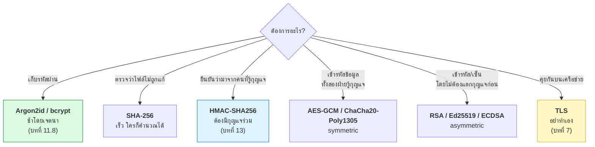

# บทที่ 38 · Cryptography ภาคปฏิบัติ

> คุณใช้ crypto มาตลอดคอร์สแล้ว — TLS (บท 7), HMAC (บท 13), hash ใน PoW (บท 16),
> Argon2 (บท 11)
>
> บทนี้ร้อยทุกอย่างเข้าด้วยกัน และตอบว่า **อันไหนใช้ตอนไหน**

## 38.1 กฎข้อเดียวที่สำคัญที่สุด {#s38-1}

> ## อย่าประดิษฐ์ crypto เอง
>
> และอย่า "ปรับนิดหน่อย" จากของที่มีอยู่ด้วย

**ไม่ใช่เพราะคุณไม่เก่งพอ** — แต่เพราะ crypto พังในแบบที่**มองไม่เห็น**
โค้ดที่ผิดยังทำงานได้ปกติ เข้ารหัสได้ ถอดได้ ทดสอบผ่าน แต่มีช่องโหว่ที่
คนรู้จริงเจาะได้ใน 10 นาที

| แทนที่จะเขียนเอง | ใช้ |
|------------------|-----|
| Python | `cryptography` (ไม่ใช่ `pycrypto` ที่เลิกดูแลแล้ว) |
| Node | `node:crypto`, `libsodium` |
| Go | `crypto/*` ใน stdlib |
| ทุกภาษา | **libsodium** — ออกแบบมาให้ใช้ผิดยาก |

## 38.2 แผนที่: อยากได้อะไร ใช้อะไร {#s38-2}



## 38.3 Hash — และความเข้าใจผิดที่อันตรายที่สุด {#s38-3}

```bash
echo -n 'hello' | sha256sum
```

**คุณสมบัติของ hash:** ทางเดียว, ขนาดคงที่, เปลี่ยน 1 bit ผลเปลี่ยนหมด

| ใช้ทำอะไร | ตัวที่ควรใช้ |
|-----------|-------------|
| ตรวจความถูกต้องของไฟล์ | SHA-256 |
| ลายนิ้วมือของข้อมูล (ETag — บท 26.5) | SHA-256 |
| Proof of Work (บท 16) | SHA-256 |
| **เก็บรหัสผ่าน** | ❌ **ห้ามใช้ SHA-256** |

> ## ⚠️ SHA-256 ห้ามใช้เก็บรหัสผ่าน
>
> **เพราะมันเร็วเกินไป** — GPU ลองได้หลายพันล้านครั้งต่อวินาที
> รหัสผ่านที่คนทั่วไปใช้จะถูกเดาแตกในไม่กี่นาที
>
> ต้องใช้ **Argon2id / bcrypt / scrypt** ซึ่งออกแบบให้**ช้าโดยเจตนา**
> และปรับความช้าได้ ([บทที่ 11.8](11-mobile-api-auth-design.md#s11-8))

**MD5 และ SHA-1 ตายแล้ว** — สร้างข้อมูลสองชุดที่ hash ตรงกันได้จริงแล้ว
(collision) ห้ามใช้กับอะไรที่เกี่ยวกับความปลอดภัย

## 38.4 HMAC — hash + กุญแจ {#s38-4}

```python
import hmac, hashlib
sig = hmac.new(key, message, hashlib.sha256).hexdigest()
```

**ต่างจาก hash เปล่า ๆ ตรงที่ต้องมีกุญแจ** — ใครไม่มีกุญแจสร้าง signature ไม่ได้

คุณใช้มันมาแล้วสามที่ในคอร์สนี้:

| ที่ไหน | ทำอะไร |
|--------|--------|
| [บทที่ 13](13-webhooks-and-hmac.md) | ตรวจว่า webhook มาจากตัวจริง |
| [บทที่ 16](16-altcha-pow.md) | `signature` ใน ALTCHA challenge — พิสูจน์ว่าโจทย์เป็นของ server |
| [บทที่ 12](12-api-design-practices.md) | pagination cursor ที่ client แก้ไม่ได้ |

**สองกฎที่ห้ามลืม** (จาก[บทที่ 13.3](13-webhooks-and-hmac.md#s13-3)):

```python
# ✅ เทียบแบบ constant-time เสมอ
hmac.compare_digest(expected, received)

# ❌ == บอกใบ้ว่าเดาถูกกี่ตัวจากเวลาที่ใช้
expected == received
```

และ **อย่าใช้ `sha256(key + message)` เอง** — มีช่องโหว่ชื่อ length-extension
ที่ HMAC ออกแบบมาแก้โดยเฉพาะ

## 38.5 Symmetric — กุญแจเดียว เข้าและถอด {#s38-5}

```python
from cryptography.hazmat.primitives.ciphers.aead import AESGCM
import os

key = AESGCM.generate_key(bit_length=256)
aes = AESGCM(key)

nonce = os.urandom(12)                       # ต้องไม่ซ้ำ!
ct = aes.encrypt(nonce, b"ข้อมูลลับ", None)
pt = aes.decrypt(nonce, ct, None)
```

**ใช้ AEAD เท่านั้น** — `AES-GCM` หรือ `ChaCha20-Poly1305`

**AEAD = เข้ารหัส + ตรวจความถูกต้องในตัวเดียว** ถ้าใครแก้ ciphertext
การถอดจะล้มเหลวทันที

> ⚠️ **`AES-CBC` เปล่า ๆ ไม่ตรวจความถูกต้อง** — ผู้โจมตีแก้ ciphertext ได้
> แล้ว plaintext ที่ได้ก็เปลี่ยนตาม (padding oracle attack) **อย่าใช้ถ้าไม่ได้
> คู่กับ HMAC** และถ้าต้องคิดเรื่องนี้เอง แปลว่าควรใช้ AEAD แทน

> ⚠️ **nonce ห้ามซ้ำกับกุญแจเดียวกันเด็ดขาด** — ถ้าซ้ำ ความปลอดภัยของ GCM
> พังทั้งหมด ใช้ `os.urandom(12)` ทุกครั้ง หรือใช้ตัวนับที่ไม่มีวันวนซ้ำ

## 38.6 Asymmetric — กุญแจคู่ {#s38-6}

```
public key   → แจกได้  → ใช้ "เข้ารหัส" และ "ตรวจลายเซ็น"
private key  → เก็บลับ → ใช้ "ถอดรหัส" และ "เซ็น"
```

| ต้องการ | ใช้กุญแจไหน |
|---------|-------------|
| ส่งความลับให้ใคร | เข้ารหัสด้วย **public key ของเขา** |
| พิสูจน์ว่าเราเป็นคนส่ง | เซ็นด้วย **private key ของเรา** |

**ที่คุณเจอมาแล้ว:**

- **TLS certificate** (บท 7) — server เซ็นด้วย private key, คุณตรวจด้วย public key ของ CA
- **JWT แบบ RS256** (บท 10.3) — auth server เซ็น, service อื่นตรวจได้โดยไม่ต้องมีอำนาจออก token
- **SSH key** (บท 30.9)

**เลือกอัลกอริทึม:**

| ใช้ | ขนาดกุญแจ | ความเห็น |
|-----|-----------|----------|
| **Ed25519** | 256 bit | ✅ เร็ว เล็ก ปลอดภัย ใช้ผิดยาก — **เลือกตัวนี้ถ้าเลือกได้** |
| ECDSA P-256 | 256 bit | ใช้ได้ แต่พังถ้า nonce ซ้ำ |
| RSA | **≥ 3072 bit** | ยังใช้กันเยอะ แต่ช้าและกุญแจใหญ่ |

**asymmetric ช้ากว่า symmetric มาก** — ของจริงจึงใช้ผสมกัน: ใช้ asymmetric
แลกกุญแจ symmetric แล้วเข้ารหัสข้อมูลจริงด้วย symmetric **นี่คือสิ่งที่ TLS ทำ**

## 38.7 ความสุ่ม — จุดที่พังบ่อยและเงียบ {#s38-7}

```python
import random, secrets

random.randint(0, 999999)        # ❌ เดาได้ ถ้ารู้ seed
secrets.token_urlsafe(32)        # ✅ ใช้กับทุกอย่างที่เป็นความลับ
secrets.token_hex(16)
secrets.compare_digest(a, b)
```

**`random` ออกแบบมาสำหรับการจำลอง ไม่ใช่ความปลอดภัย** — ถ้าเห็นผลลัพธ์
พอสมควรจะทำนายค่าถัดไปได้

**ใช้ `secrets` กับ:** token, session id, salt, รหัสผ่านชั่วคราว, OTP,
CSRF token, nonce, **และ salt ของ PoW ใน `lab/server.py`**

```python
# lab/server.py ใช้ถูกแล้ว
salt = secrets.token_hex(8) + "?expires=..."
HMAC_KEY = secrets.token_bytes(32)
```

## 38.8 การจัดการกุญแจ — ส่วนที่ยากที่สุด {#s38-8}

**อัลกอริทึมแทบไม่เคยพัง — การจัดการกุญแจพังตลอด**

| หลักการ | ทำอย่างไร |
|---------|-----------|
| **หนึ่งกุญแจหนึ่งหน้าที่** | กุญแจเซ็น JWT ≠ กุญแจเข้ารหัส DB ≠ กุญแจ webhook |
| **อย่าเก็บในโค้ด** | secret manager ([บทที่ 28.10](28-observability-and-deployment.md#s28-10)) |
| **หมุนได้โดยไม่ downtime** | รองรับสองกุญแจพร้อมกันช่วงเปลี่ยนผ่าน |
| **มี `kid`** | บอกว่าใช้กุญแจใบไหน ([บทที่ 10.3](10-jwt-deep-dive.md#s10-3)) |
| **จำกัดคนเข้าถึง** | ใครอ่านได้บ้าง มี log ไหม |
| **มีแผนเมื่อกุญแจรั่ว** | ซ้อมไว้ก่อน ไม่ใช่คิดตอนเกิดเหตุ |

**การหมุนกุญแจแบบไม่ downtime:**

```python
KEYS = {"2026-02": b"...", "2026-01": b"..."}   # ใหม่, เก่า
CURRENT = "2026-02"

def sign(data):
    return CURRENT, hmac.new(KEYS[CURRENT], data, hashlib.sha256).hexdigest()

def verify(kid, data, sig):
    key = KEYS.get(kid)
    if not key:
        return False
    return hmac.compare_digest(
        hmac.new(key, data, hashlib.sha256).hexdigest(), sig)
```

**เซ็นด้วยกุญแจใหม่ ตรวจได้ทั้งใหม่และเก่า** — พอ token เก่าหมดอายุหมดแล้ว
ค่อยเอากุญแจเก่าออก (หลักการเดียวกับ backup pin ใน[บทที่ 7.6](07-tls-https.md#s7-6) และ webhook
secret ใน[บทที่ 13.6](13-webhooks-and-hmac.md#s13-6))

## 38.9 ข้อผิดพลาดที่พบบ่อยที่สุด {#s38-9}

| ผิด | ทำไมผิด | แก้ |
|-----|---------|-----|
| ใช้ SHA-256 เก็บรหัสผ่าน | เร็วเกินไป | Argon2id (บท 11.8) |
| เทียบ signature ด้วย `==` | timing attack | `compare_digest` |
| ใช้ `random` สร้าง token | เดาได้ | `secrets` |
| nonce/IV ซ้ำ | ทำลายความปลอดภัยของ AEAD | `os.urandom` ทุกครั้ง |
| **คิดว่า base64 คือการเข้ารหัส** | ไม่ใช่เลย (บท 6.5) | เข้ารหัสจริง |
| **คิดว่า JWT เข้ารหัส payload** | ไม่ (บท 10.2) | อย่าใส่ความลับใน JWT |
| ใช้ ECB mode | เห็นรูปแบบของข้อมูล | AEAD |
| กุญแจเดียวใช้ทุกอย่าง | รั่วที่เดียวพังหมด | แยกตามหน้าที่ |
| หมุนกุญแจไม่ได้ | เมื่อรั่วจะแก้ไม่ทัน | ออกแบบตั้งแต่แรก |

## 38.10 Post-quantum — ต้องกังวลตอนนี้ไหม {#s38-10}

**คำตอบสั้น: ยัง แต่เริ่มติดตามได้**

ควอนตัมคอมพิวเตอร์ที่ใช้งานได้จริงจะทำลาย RSA และ ECC (ไม่กระทบ AES-256
กับ SHA-256 มากนัก) — ยังไม่มีในวันนี้ แต่มีความเสี่ยงชื่อ
**"harvest now, decrypt later"** คือเก็บ traffic ที่เข้ารหัสไว้ก่อน
รอถอดในอนาคต

| ถ้าข้อมูลของคุณ | ควรทำ |
|-----------------|-------|
| หมดความสำคัญใน 1-2 ปี | ไม่ต้องทำอะไร |
| ต้องเป็นความลับ 10+ ปี | เริ่มดู hybrid key exchange (มีใน TLS 1.3 แล้ว) |

NIST ประกาศมาตรฐาน post-quantum ชุดแรกแล้ว (ML-KEM, ML-DSA) —
**รอ library รองรับ อย่าเอามาใช้เองตอนนี้** (กลับไปที่กฎ[ข้อ 38.1](#s38-1))

## 38.11 Checklist {#s38-11}

- [ ] รหัสผ่านใช้ Argon2id หรือ bcrypt cost 12+ ไม่ใช่ hash เปล่า
- [ ] token / salt / nonce สร้างด้วย `secrets` ไม่ใช่ `random`
- [ ] เทียบ signature ด้วย `compare_digest` ทุกที่
- [ ] เข้ารหัสใช้ AEAD (AES-GCM / ChaCha20-Poly1305)
- [ ] nonce ไม่ซ้ำกับกุญแจเดิม
- [ ] ไม่มี MD5 / SHA-1 ในเส้นทางความปลอดภัย
- [ ] กุญแจแยกตามหน้าที่ ไม่ใช้ตัวเดียวทุกอย่าง
- [ ] กุญแจอยู่ใน secret manager ไม่ใช่ในโค้ด
- [ ] หมุนกุญแจได้โดยไม่ downtime (รองรับ 2 กุญแจ + `kid`)
- [ ] ไม่มีใครในทีมเขียนอัลกอริทึม crypto เอง
- [ ] TLS 1.2 ขั้นต่ำ ([บทที่ 7.8](07-tls-https.md#s7-8))

## แบบฝึกหัด

1. เทียบเวลา: `sha256` กับ `argon2` hash รหัสผ่านเดียวกัน 100 ครั้ง — ต่างกันกี่เท่า
   และทำไมความช้าถึงเป็นข้อดี
2. เขียนโค้ดที่ใช้ `random.randint` สร้าง token 10 ตัว — มองเห็นรูปแบบไหม
   ถ้าตั้ง `random.seed(42)` ก่อน
3. ใช้ `hmac.compare_digest` กับ `==` เทียบ string ยาว ๆ วัดเวลาหลาย ๆ ครั้ง
   — เห็นความต่างของเวลาไหม
4. เข้ารหัสข้อความด้วย AES-GCM แล้วลองแก้ ciphertext 1 byte — ถอดได้ไหม
5. ใช้ nonce ซ้ำสองครั้งกับกุญแจเดียวกันแล้วอ่านเอกสารว่าทำไมอันตราย
6. อ่าน `make_challenge` ใน [lab/server.py](../lab/server.py) แล้วตอบว่า
   ใช้ `secrets` ครบทุกที่ที่ควรใช้ไหม
7. ออกแบบวิธีหมุน `HMAC_KEY` ของ lab server โดยที่ challenge ที่ออกไปแล้ว
   ยังตรวจผ่านได้ (คำใบ้: [ข้อ 38.8](#s38-8))

***
[⬅ หน่วยความจำและช่องโหว่คลาสสิก](37-memory-and-classic-exploits.md) · [สารบัญ](../README.md) · [มัลแวร์ทำงานอย่างไร ➡](39-how-malware-works.md)
