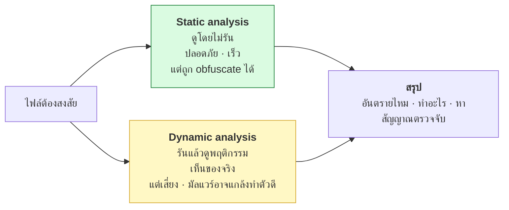
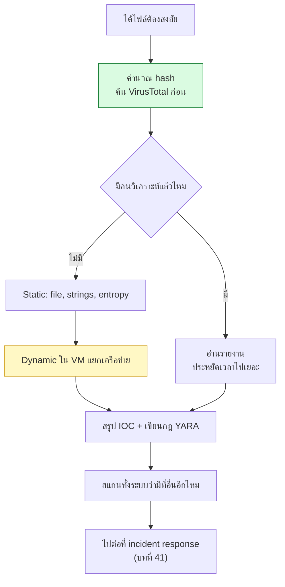

# บทที่ 40 · การวิเคราะห์มัลแวร์เบื้องต้น

> ทักษะนี้ตอบคำถามที่คุณจะเจอจริงในฐานะคนดูแลระบบ:
> **"ไฟล์นี้ปลอดภัยไหม"** และ **"เครื่องนี้โดนอะไรไป"**
>
> ⚠️ ทุกอย่างในบทนี้ต้องทำใน**แล็บที่แยกออกจากเครื่องใช้งานจริง** — อ่าน[ข้อ 40.1](#s40-1) ก่อน

## 40.1 ⚠️ ความปลอดภัยของตัวคุณเองมาก่อน {#s40-1}

**อย่ารันไฟล์ต้องสงสัยบนเครื่องที่คุณใช้ทำงาน ไม่ว่ากรณีใด**

| กฎ | เหตุผล |
|----|--------|
| ใช้ VM ที่ **แยกเครือข่าย** | มัลแวร์ที่หลุดออกไปคือปัญหาของคุณ |
| **ปิด shared folder / clipboard** | ทางหลุดที่คนลืมบ่อยที่สุด |
| ใช้ **snapshot** แล้วย้อนกลับทุกครั้ง | ไม่ต้องเชื่อว่าลบสะอาดแล้ว |
| ตั้งชื่อไฟล์ให้รันไม่ได้ | `sample.exe` → `sample.exe_` |
| เก็บใน zip ที่ใส่รหัส `infected` | มาตรฐานที่วงการใช้กัน |
| **อย่าใช้บัญชีจริงในแล็บ** | ไม่มี credential อะไรให้ขโมย |

```bash
# แล็บขั้นต่ำ: VM ที่ไม่มีเครือข่ายเลย
# VirtualBox: Settings → Network → Not attached
# แล้วเอาไฟล์เข้าทาง ISO อ่านอย่างเดียว
```

**ถ้าจำเป็นต้องมีเครือข่ายเพื่อดู C2** ให้ใช้เครือข่ายจำลอง (INetSim, FakeNet-NG)
ที่ตอบทุก request โดยไม่ต่อออกอินเทอร์เน็ตจริง

> **ทำไมห้ามต่อเน็ตจริง** — นอกจากมัลแวร์อาจแพร่ออกไป มันยังจะ**บอกคนคุมว่า
> มีคนกำลังวิเคราะห์อยู่** แล้วเขาจะเปลี่ยนโครงสร้างทันที
>
> รายละเอียดการสร้างแล็บเต็มรูปแบบอยู่ใน[บทที่ 45](45-home-lab.md)

## 40.2 สองแนวทาง {#s40-2}



**เริ่มจาก static เสมอ** — ได้ข้อมูลเยอะโดยไม่เสี่ยงเลย

## 40.3 Static analysis — เครื่องมือพื้นฐาน {#s40-3}

เครื่องมือเหล่านี้มีอยู่ในเครื่องคุณแล้ว

```bash
file sample                    # ไฟล์ชนิดอะไรจริง ๆ (ไม่ดูนามสกุล)
sha256sum sample               # ลายนิ้วมือ — เอาไปค้นต่อ
strings -n 8 sample | less     # ข้อความที่อ่านออกในไฟล์
xxd sample | head              # ดู byte ดิบ (บทที่ 1.9)
```

**`strings` คือเครื่องมือที่ให้ผลตอบแทนสูงสุดต่อความพยายาม** — มักเจอ:

```
http://evil.example/gate.php          ← C2 URL
/tmp/.hidden/                          ← ที่ซ่อนไฟล์
cmd.exe /c whoami                      ← คำสั่งที่จะรัน
Mozilla/5.0 (compatible; Bot/1.0)      ← User-Agent ที่ใช้ (บทที่ 5.7)
-----BEGIN PUBLIC KEY-----             ← กุญแจสำหรับเข้ารหัส (ransomware)
```

**ELF บน Linux:**

```bash
readelf -h sample              # header — สถาปัตยกรรม, entry point
readelf -d sample              # library ที่ต้องใช้
objdump -d sample | head -50   # disassemble
nm -D sample                   # symbol ที่เรียกจากภายนอก
ldd sample                     # ⚠️ อย่าใช้กับไฟล์ต้องสงสัย — มันอาจรันโค้ด
```

> ⚠️ **`ldd` รันโปรแกรมจริงในบางกรณี** ใช้ `readelf -d` แทนเสมอเมื่อวิเคราะห์มัลแวร์

**สัญญาณว่าไฟล์ถูก pack** ([บทที่ 39.7](39-how-malware-works.md#s39-7)):

```bash
# entropy สูงมาก = ถูกบีบอัด/เข้ารหัส
python3 -c "
import sys,math,collections
d=open(sys.argv[1],'rb').read()
c=collections.Counter(d)
e=-sum((n/len(d))*math.log2(n/len(d)) for n in c.values())
print(f'entropy = {e:.2f}  (>7.0 = น่าจะถูก pack)')
" sample
```

```bash
strings sample | wc -l     # ถ้าน้อยผิดปกติ = ถูก pack
```

## 40.4 Dynamic analysis — ดูพฤติกรรม {#s40-4}

**เครื่องมือที่คุณรู้จักแล้วทั้งหมดจากบทก่อน ๆ**

| อยากรู้ | ใช้ | เรียนมาแล้วที่ |
|---------|-----|----------------|
| เรียก syscall อะไร | `strace -f` | [บทที่ 35.7](35-linux-internals.md#s35-7) |
| เปิดไฟล์ไหน | `strace -e trace=openat` | [บทที่ 35.7](35-linux-internals.md#s35-7) |
| ต่อเน็ตไปไหน | `tcpdump`, `ss` | [บทที่ 31.4](31-tcpip-and-tcpdump.md#s31-4), 31.6 |
| เปิด fd อะไรค้าง | `ls /proc/$PID/fd` | [บทที่ 35.1](35-linux-internals.md#s35-1) |
| ฝังตัวตรงไหน | ตรวจจุดใน[บทที่ 39.5](39-how-malware-works.md#s39-5) | [บทที่ 39.5](39-how-malware-works.md#s39-5) |
| สร้าง process ลูกอะไร | `ps -ef --forest` | [บทที่ 35.3](35-linux-internals.md#s35-3) |

```bash
# วิเคราะห์แบบครบใน VM ที่ไม่มีเน็ต
strace -f -o trace.txt ./sample_          # syscall ทั้งหมด
grep -E 'openat|connect|execve' trace.txt # กรองที่น่าสนใจ

# ก่อน-หลัง เทียบกัน
find / -newer /tmp/marker -type f 2>/dev/null   # ไฟล์อะไรใหม่บ้าง
```

**เทคนิค snapshot diff** — ถ่ายภาพระบบก่อนและหลัง แล้วเทียบ

```bash
# ก่อนรัน
ls -laR ~ > before.txt; crontab -l > cron_before.txt
systemctl list-units --type=service > svc_before.txt

# ...รัน sample...

diff <(ls -laR ~) before.txt
diff <(systemctl list-units --type=service) svc_before.txt
```

## 40.5 Sandbox อัตโนมัติ {#s40-5}

ก่อนจะลงมือเอง **ลองส่งเข้า sandbox สาธารณะก่อน** — ประหยัดเวลามาก

| บริการ | ให้อะไร |
|--------|---------|
| [VirusTotal](https://virustotal.com) | ผล AV หลายสิบเจ้า + ข้อมูลจากคนอื่นที่เคยเจอ |
| [Hybrid Analysis](https://hybrid-analysis.com) | รายงานพฤติกรรมละเอียด |
| [ANY.RUN](https://any.run) | ดูแบบโต้ตอบได้ |
| **CAPE / Cuckoo** | ติดตั้งเองในแล็บ ข้อมูลไม่ออกไปไหน |

> ## ⚠️ อย่าอัปโหลดไฟล์ขององค์กรขึ้น sandbox สาธารณะ
>
> **ไฟล์ที่อัปโหลดกลายเป็นสาธารณะ** — ถ้าไฟล์นั้นมีข้อมูลลูกค้า, สัญญา,
> หรือ credential ภายใน คุณเพิ่งทำข้อมูลรั่วด้วยตัวเอง
>
> **ค้นด้วย hash ก่อนเสมอ** — ได้ข้อมูลโดยไม่ต้องอัปโหลดอะไรเลย:
> ```bash
> sha256sum sample    # เอา hash ไปค้นใน VirusTotal
> ```

## 40.6 YARA — เขียนกฎตรวจจับเอง {#s40-6}

YARA คือภาษาสำหรับเขียน "ลายเซ็น" ของมัลแวร์ ใช้กันทั่ววงการ

```yara
rule Suspicious_Downloader_Shell
{
    meta:
        description = "สคริปต์ที่ดาวน์โหลดแล้วรันทันที"
        author      = "ทีมเรา"
        date        = "2026-08-27"

    strings:
        $curl_pipe = /curl\s+[^\n|]{0,80}\|\s*(ba)?sh/
        $wget_pipe = /wget\s+[^\n|]{0,80}\|\s*(ba)?sh/
        $b64       = /base64\s+-d\s*\|\s*(ba)?sh/

    condition:
        any of them
}
```

```bash
yara -r rules.yar /var/www/          # สแกนทั้งโฟลเดอร์
yara -s rules.yar sample             # แสดงว่า match ตรงไหน
```

**ใช้ YARA ทำอะไรได้จริง:**

- สแกนเซิร์ฟเวอร์หา web shell ([บทที่ 39.9](39-how-malware-works.md#s39-9))
- ตรวจไฟล์ที่ผู้ใช้อัปโหลด (ต่อยอดจาก[บทที่ 25.5](25-input-validation-and-injection.md#s25-5))
- หาไฟล์ที่คล้ายกับตัวอย่างที่เคยเจอ

**เขียนกฎที่ดี:**

| ควร | ไม่ควร |
|-----|--------|
| จับ**พฤติกรรมหรือโครงสร้าง** | จับ hash เดียว (เปลี่ยนนิดเดียวก็หลุด) |
| ใช้หลายเงื่อนไขประกอบกัน | เงื่อนไขเดียวกว้าง ๆ → false positive ท่วม |
| ใส่ `meta` บอกที่มา | กฎที่ไม่มีใครรู้ว่าทำไมมี |
| ทดสอบกับไฟล์ปกติก่อน | ปล่อยขึ้น production เลย |

## 40.7 ผลลัพธ์ที่ต้องได้ — IOC {#s40-7}

เป้าหมายของการวิเคราะห์ไม่ใช่ความรู้ แต่คือ **สิ่งที่เอาไปตรวจจับต่อได้**

**IOC (Indicator of Compromise)** = ร่องรอยที่บอกว่าโดนแล้ว

| ชนิด | ตัวอย่าง | ความทนทาน |
|------|----------|-----------|
| Hash ของไฟล์ | `sha256:abc...` | ⭐ ต่ำ — เปลี่ยน 1 byte ก็หลุด |
| ชื่อไฟล์ / path | `/tmp/.X11-unix/.sys` | ⭐⭐ |
| IP / โดเมน C2 | `evil.example` | ⭐⭐ เปลี่ยนได้ |
| **พฤติกรรม** | "ดาวน์โหลดแล้ว pipe เข้า bash" | ⭐⭐⭐⭐ **ทนที่สุด** |

**"Pyramid of Pain"** — ยิ่งเป็น IOC ที่ผู้โจมตีเปลี่ยนยาก ยิ่งมีค่า
hash เปลี่ยนได้ในวินาที แต่การเปลี่ยน**วิธีทำงาน**ต้องเขียนใหม่

> **นี่คือเหตุผลที่[บทที่ 41](41-detection-and-response.md) เน้นการตรวจจับที่พฤติกรรม (IOA) มากกว่า IOC**

## 40.8 กระบวนการทำงานจริง {#s40-8}



**ขั้นที่ 8 คือขั้นที่คนลืมบ่อยที่สุด** — เจอมัลแวร์ที่เครื่องหนึ่งแล้ว
**ต้องสมมติว่าเครื่องอื่นก็อาจโดน** ไม่ใช่ลบแล้วจบ

## 40.9 เมื่อพบว่าเซิร์ฟเวอร์ถูกเจาะ {#s40-9}

> ## ⚠️ เครื่องที่ถูกเจาะแล้ว = เชื่อถือไม่ได้อีกต่อไป
>
> **ทางเลือกเดียวที่ปลอดภัยคือติดตั้งใหม่** ไม่ใช่ "ลบไฟล์แล้วใช้ต่อ"
>
> เพราะคุณไม่มีทางรู้ว่าเขาฝังอะไรไว้อีกบ้าง — rootkit ในเคอร์เนล,
> ไบนารีระบบที่ถูกแทนที่, key ใน `authorized_keys`

**ลำดับที่ถูกต้อง:**

1. **อย่าเพิ่งปิดเครื่อง** — หน่วยความจำมีหลักฐานที่หายเมื่อปิด
2. **ตัดเครือข่าย** (ถอดสาย / ปิด security group) แต่ยังเปิดเครื่องอยู่
3. **เก็บหลักฐาน** — snapshot ดิสก์, dump หน่วยความจำ, คัดลอก log ออกไปที่อื่น
4. วิเคราะห์จากสำเนา ไม่ใช่จากเครื่องจริง
5. หาว่าเข้ามาได้ยังไง (**ถ้าไม่รู้ ติดตั้งใหม่แล้วก็โดนซ้ำ**)
6. ติดตั้งใหม่ + แพตช์ช่องทางนั้น
7. **หมุน credential ทุกตัวที่เครื่องนั้นเคยแตะ** ([บทที่ 38.8](38-crypto-in-practice.md#s38-8))

## แบบฝึกหัด

> ใช้ไฟล์ปกติในเครื่องเป็นตัวฝึก — **ยังไม่ต้องหามัลแวร์จริงมา**

1. รัน `file`, `strings -n 8`, `readelf -d` กับ `/usr/bin/curl`
   — เห็น library อะไรบ้าง เห็นข้อความอะไรที่บอกได้ว่ามันทำอะไร
2. คำนวณ entropy ของ `/usr/bin/curl` กับไฟล์ `.tar.gz` เทียบกัน — ต่างกันอย่างไร
3. `strings /usr/bin/curl | grep -iE 'http|user-agent|ssl'` — เจออะไรบ้าง
4. ใช้ `strace -f -e trace=openat,connect curl http://127.0.0.1:8080/api/books`
   แล้วสรุปพฤติกรรมของ curl เป็นภาษาคน
5. ทำ snapshot diff: บันทึกสถานะ `~`, cron, service ก่อน แล้วรัน `lab/server.py`
   จากนั้น diff — เห็นอะไรเปลี่ยนบ้าง
6. เขียนกฎ YARA จับสคริปต์ที่มี `curl ... | bash` แล้วทดสอบกับไฟล์ที่คุณสร้างเอง
7. เขียนกฎ YARA จับ web shell PHP อย่างง่าย (มองหา `eval(`, `base64_decode(`,
   `$_POST[` ในไฟล์เดียวกัน) แล้วทดสอบว่าไม่ match ไฟล์ PHP ปกติ
8. ออกแบบแล็บของคุณ: จะใช้ VM อะไร ตั้งเครือข่ายยังไง เอาไฟล์เข้า-ออกยังไง
   (เทียบกับ[บทที่ 45](45-home-lab.md) ทีหลัง)

***
[⬅ มัลแวร์ทำงานอย่างไร](39-how-malware-works.md) · [สารบัญ](../README.md) · [การตรวจจับและตอบสนอง ➡](41-detection-and-response.md)
