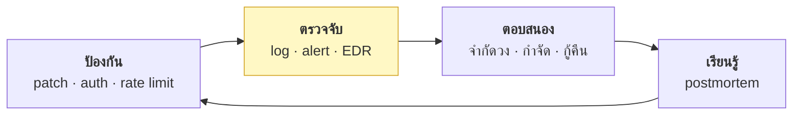
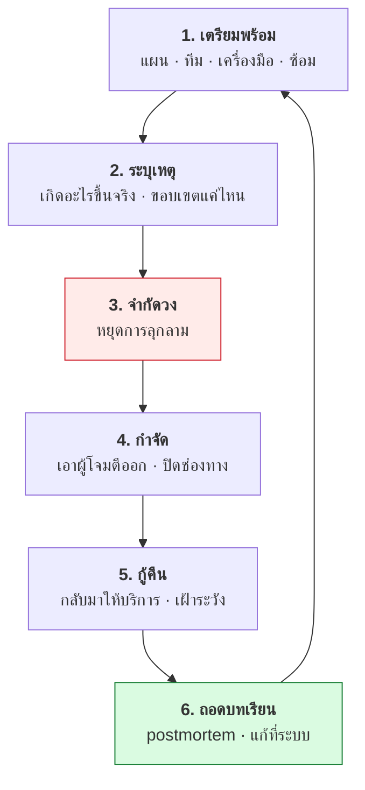

# บทที่ 41 · การตรวจจับและตอบสนอง

> คำถามที่ต้องตอบให้ได้: **"ถ้าโดนตอนนี้ คุณจะรู้ตัวเมื่อไร"**
>
> ค่าเฉลี่ยของโลกคือ **หลายสิบวัน** — และส่วนใหญ่รู้เพราะคนอื่นมาบอก
> ไม่ใช่เพราะระบบตรวจเจอเอง

## 41.1 ป้องกันอย่างเดียวไม่พอ {#s41-1}



**สมมติว่าวันหนึ่งจะโดน** แล้วถามว่า:

| คำถาม | ถ้าตอบไม่ได้ แปลว่า |
|-------|---------------------|
| จะรู้ตัวได้อย่างไร | ไม่มีการตรวจจับ |
| รู้แล้วจะทำอะไรก่อน | ไม่มีแผน |
| ใครตัดสินใจ | จะสับสนตอนเกิดเหตุจริง |
| กู้คืนได้ในกี่ชั่วโมง | ไม่เคยทดสอบ backup |

## 41.2 IOC vs IOA — ความต่างที่สำคัญ {#s41-2}

| | IOC (Indicator of **Compromise**) | IOA (Indicator of **Attack**) |
|---|-----------------------------------|-------------------------------|
| จับอะไร | ร่องรอยของสิ่งที่รู้จักแล้ว | **พฤติกรรม**ที่น่าสงสัย |
| ตัวอย่าง | hash, IP, โดเมน | "web server สร้าง shell ลูก" |
| จับของใหม่ได้ไหม | ❌ | ✅ |
| False positive | ต่ำ | สูงกว่า |

**ตัวอย่าง IOA ที่ควรตั้ง alert:**

```
web server (www-data) รัน bash/sh เป็น process ลูก        ← web shell (บท 39.9)
process ใน /tmp หรือ /dev/shm ต่อเน็ตออกไป                ← มัลแวร์ทั่วไป
มีการเพิ่มบรรทัดใน ~/.ssh/authorized_keys                  ← backdoor (บท 39.5)
บัญชีเดียว login สำเร็จจาก 2 ประเทศห่างกันใน 10 นาที        ← credential ถูกขโมย
CPU 100% ต่อเนื่องบน server ที่ปกติว่าง                    ← cryptominer
คน ๆ เดียวดึงข้อมูลลูกค้า 50,000 ราย ตอนตี 3               ← ขโมยข้อมูล
refresh token reuse ถูกตรวจพบพุ่งผิดปกติ                   ← บทที่ 11.4
```

**ข้อสุดท้ายมาจากระบบที่คุณสร้างเองใน[บทที่ 11](11-mobile-api-auth-design.md)** — reuse detection ไม่ได้แค่
ป้องกัน มันเป็น**สัญญาณเตือน**ด้วย ถ้ามันดังบ่อยผิดปกติแปลว่ามีคนกำลังเล่นงานคุณ

## 41.3 Log คืออะไรที่ต้องมีก่อนอย่างอื่น {#s41-3}

**ถ้าไม่มี log คุณสืบสวนอะไรไม่ได้เลย** — นี่คือเหตุผลที่ `R` ใน STRIDE
([บทที่ 34.4](34-threat-modeling.md#s34-4)) สำคัญ

| แหล่ง log | ตอบคำถามอะไร |
|-----------|--------------|
| **auth log** (`/var/log/auth.log`) | ใครล็อกอิน สำเร็จ/ล้มเหลว |
| **application log** ([บทที่ 28.2](28-observability-and-deployment.md#s28-2)) | ใครทำอะไรในระบบ |
| **web/access log** | request อะไรเข้ามาบ้าง |
| **audit log** (`auditd`) | ใครแตะไฟล์ไหน รันคำสั่งอะไร |
| **network flow** | เครื่องไหนคุยกับใคร |
| **DNS log** | เครื่องถามหาโดเมนอะไร (จับ C2 — [บทที่ 39.6](39-how-malware-works.md#s39-6)) |

```bash
# ตรวจเบื้องต้นบน Linux
grep 'Failed password' /var/log/auth.log | wc -l
grep 'Accepted' /var/log/auth.log | tail -20
last -20                                    # ใครล็อกอินล่าสุด
journalctl -u ssh --since "24 hours ago" | grep -i 'invalid user' | head
```

### สามกฎของ log ที่ใช้สืบสวนได้จริง

**1. ส่งออกไปที่อื่นทันที (centralized)**

> ผู้โจมตีที่ได้ root จะ**ลบ log** เป็นอย่างแรก log ที่อยู่บนเครื่องที่ถูกเจาะ
> เชื่อถือไม่ได้ — ต้องส่งไป log server ที่เขียนได้อย่างเดียว (append-only)

**2. เวลาต้องตรงกัน** — ทุกเครื่องต้อง sync NTP และเก็บเป็น **UTC**
([บทที่ 12.9](12-api-design-practices.md#s12-9)) ไม่งั้นเรียงลำดับเหตุการณ์ข้ามเครื่องไม่ได้

**3. เก็บนานพอ** — ถ้าค่าเฉลี่ยการรู้ตัวคือ 200 วัน แต่คุณเก็บ log 7 วัน
ตอนรู้ตัวก็ไม่มีอะไรให้ดูแล้ว

## 41.4 EDR / XDR — ทำไมถึงแทน antivirus {#s41-4}

| | Antivirus แบบเดิม | EDR |
|---|-------------------|-----|
| จับอะไร | ไฟล์ที่รู้จัก (signature) | **พฤติกรรมของ process** |
| Fileless (บท 39.7) | ❌ ไม่เห็น | ✅ เห็น |
| Living off the land | ❌ `bash` เป็นโปรแกรมปกติ | ✅ เห็นว่าใครเรียกอะไร |
| หลังตรวจเจอ | ลบไฟล์ | **ย้อนดูได้ว่าเกิดอะไรขึ้นก่อนหน้า** |

**ความสามารถที่สำคัญที่สุดของ EDR คือ "ย้อนดูได้"** — เจอปัญหาวันนี้
แล้วย้อนดูได้ว่าเมื่อ 3 วันก่อนมันเข้ามาทางไหน

**ทางเลือกโอเพนซอร์ส:**

| เครื่องมือ | ทำอะไร |
|-----------|--------|
| **Wazuh** | EDR/SIEM ครบวงจร ฟรี |
| **osquery** | ถามสถานะเครื่องด้วย SQL |
| **auditd** | บันทึก syscall ระดับเคอร์เนล |
| **Falco** | ตรวจพฤติกรรมใน container/k8s |
| **Suricata / Zeek** | ตรวจที่ชั้นเครือข่าย |

```sql
-- osquery: หา process ที่รันจาก /tmp
SELECT p.pid, p.name, p.path, p.cmdline
FROM processes p
WHERE p.path LIKE '/tmp/%' OR p.path LIKE '/dev/shm/%';
```

```bash
# auditd: เฝ้าไฟล์สำคัญ
sudo auditctl -w /etc/passwd -p wa -k passwd_changes
sudo auditctl -w /root/.ssh/authorized_keys -p wa -k ssh_backdoor
sudo ausearch -k ssh_backdoor
```

## 41.5 ตั้ง alert ให้มีประโยชน์ {#s41-5}

โยงกับ[บทที่ 28.6](28-observability-and-deployment.md#s28-6) — **alert ที่ดีต้องมีคนต้องลงมือทำ**

| ระดับ | ตัวอย่าง | ตอบสนอง |
|-------|----------|---------|
| 🔴 **วิกฤต** | มี key ใหม่ใน `authorized_keys` ของ root | ปลุกคนกลางดึก |
| 🟠 **สูง** | login สำเร็จหลังล้มเหลว 50 ครั้ง | ดูภายในชั่วโมง |
| 🟡 **กลาง** | process ใหม่ใน `/tmp` ต่อเน็ต | ดูภายในวัน |
| ⚪ **ข้อมูล** | login นอกเวลาทำการ | ไว้ดูตอนสืบสวน |

> **Alert fatigue คือสาเหตุอันดับหนึ่งที่ทีมพลาดเหตุจริง** — ถ้า alert
> ดังวันละ 200 ครั้ง วันที่ดังจริงจะถูกกลืนหายไป
>
> **ทบทวนทุกเดือน** ว่า alert ไหนดังแล้วไม่มีใครทำอะไร → ปรับหรือลบทิ้ง

## 41.6 กระบวนการ Incident Response {#s41-6}

กรอบมาตรฐาน 6 ขั้น (NIST / SANS)



### ขั้นที่สำคัญที่สุดคือขั้นที่ 1 — เตรียมพร้อม

**สิ่งที่ต้องเตรียม *ก่อน* เกิดเหตุ:**

- [ ] รายชื่อคนติดต่อ + ใครมีอำนาจตัดสินใจ "ปิดระบบ"
- [ ] **ช่องทางสื่อสารสำรอง** (ถ้า Slack/อีเมลบริษัทถูกยึด จะคุยกันทางไหน)
- [ ] รู้ว่าระบบไหนสำคัญที่สุด (จาก threat model — [บทที่ 34](34-threat-modeling.md))
- [ ] วิธีตัดเครื่องออกจากเครือข่ายอย่างรวดเร็ว
- [ ] **ซ้อมแล้วอย่างน้อยปีละครั้ง** (tabletop exercise)

### ขั้นที่ 3 — จำกัดวง: จุดที่ต้องตัดสินใจเร็วและถูก

| ทำ | อย่าทำ |
|----|--------|
| ตัดเครือข่าย (แต่**ยังเปิดเครื่อง**) | ปิดเครื่อง — หลักฐานในหน่วยความจำหาย |
| เพิกถอน token/session ทั้งหมด | ลบไฟล์ทันที — ทำลายหลักฐาน |
| หมุน credential ที่เกี่ยวข้อง | บอกผู้โจมตีว่าเรารู้แล้ว (ถ้ายังไม่พร้อม) |
| เก็บ snapshot ไว้ก่อน | ใช้เครื่องที่ถูกเจาะสืบสวนตัวเอง |

> **การหมุน token ทั้งระบบทำได้เร็วแค่ไหน** — ถ้าคุณทำตาม[บทที่ 11](11-mobile-api-auth-design.md)
> (`logout-all`, refresh rotation) คำตอบคือ "ทันที" ถ้าไม่ได้ทำ
> คำตอบอาจเป็น "ทำไม่ได้เลย"

### ขั้นที่ 6 — postmortem แบบไม่โทษคน

```markdown
# Postmortem: ข้อมูล order รั่ว 2026-08-27

## เกิดอะไรขึ้น
เวลา 14:02 พบว่า endpoint /v1/orders/{id} ไม่ตรวจ owner ...

## เส้นเวลา
14:02  ลูกค้าแจ้งว่าเห็น order ของคนอื่น
14:15  ยืนยันได้ว่าเป็นบั๊กจริง
14:20  ปิด endpoint ชั่วคราว
...

## ทำไมถึงเกิด (ไล่ 5 Why)
- endpoint ใหม่ไม่มีการตรวจ owner
- → ไม่มีเทสต์ BOLA สำหรับ endpoint ใหม่
- → checklist code review ไม่มีข้อนี้
- → ไม่มีใครรู้ว่าต้องมี

## สิ่งที่ทำได้ดี
- log มี request_id ทำให้ไล่ได้ว่ากระทบใครบ้างใน 20 นาที

## สิ่งที่จะแก้ (พร้อมผู้รับผิดชอบและกำหนดเวลา)
- [ ] เพิ่มเทสต์ BOLA ทุก endpoint ที่รับ id — @dev — 3 วัน
- [ ] เพิ่มข้อนี้ใน PR template — @lead — 1 วัน
```

> **"blameless" ไม่ได้แปลว่าไม่มีใครรับผิดชอบ** — แปลว่าเรามองหา
> **ข้อบกพร่องของระบบ** ไม่ใช่หาคนผิด เพราะถ้าโทษคน ครั้งหน้าจะไม่มีใครกล้ารายงาน

## 41.7 ตรวจเบื้องต้นเมื่อสงสัยว่าเซิร์ฟเวอร์โดน {#s41-7}

```bash
# 1. ใครอยู่ในเครื่องตอนนี้
w; last -20; lastb -20 2>/dev/null | head

# 2. process แปลก ๆ
ps auxf | less
ls -l /proc/*/exe 2>/dev/null | grep -E 'deleted|/tmp|/dev/shm'   # ⚠️ สัญญาณชัด

# 3. เครือข่าย
ss -tunp | grep ESTAB
ss -tlnp                                    # มีอะไร listen เพิ่มไหม

# 4. จุดฝังตัว (บทที่ 39.5)
cat ~/.ssh/authorized_keys /root/.ssh/authorized_keys 2>/dev/null
crontab -l; sudo crontab -l
ls -la /etc/cron.d/ /etc/systemd/system/

# 5. ไฟล์ที่เพิ่งเปลี่ยน
find /etc /usr/bin /usr/sbin -mtime -7 -type f 2>/dev/null | head -30

# 6. บัญชีที่ถูกเพิ่ม
awk -F: '$3 >= 1000 {print $1, $3, $7}' /etc/passwd
grep -v ':\*\|:!' /etc/shadow | cut -d: -f1     # บัญชีที่ตั้งรหัสผ่านได้
```

**`/proc/*/exe` ที่ชี้ไปที่ `(deleted)` คือสัญญาณที่ชัดที่สุดอันหนึ่ง** —
มัลแวร์จำนวนมากลบไฟล์ตัวเองหลังรัน แต่ process ยังอยู่

> ⚠️ **ถ้าเครื่องถูก rootkit เครื่องมือบนเครื่องนั้นโกหกได้ทั้งหมด**
> `ps` อาจถูกแทนที่ให้ซ่อน process ของผู้โจมตี — ต้องตรวจจากภายนอก
> (mount ดิสก์ไปดูจากเครื่องอื่น หรือดู network จาก switch)

## 41.8 Checklist เตรียมพร้อม {#s41-8}

- [ ] log ส่งออกไป centralized และ**เขียนทับไม่ได้**
- [ ] ทุกเครื่อง sync เวลา (NTP) และเก็บเป็น UTC
- [ ] เก็บ log นานพอ (อย่างน้อย 90 วัน)
- [ ] มี alert สำหรับ IOA ใน[ข้อ 41.2](#s41-2) อย่างน้อย 3 ข้อ
- [ ] มีรายชื่อผู้ติดต่อ + ช่องทางสำรอง
- [ ] รู้ว่าใครมีอำนาจสั่งปิดระบบ
- [ ] **หมุน credential ทั้งระบบได้ภายใน 1 ชั่วโมง**
- [ ] backup ผ่านกฎ 3-2-1-1-0 และ**เคยทดสอบกู้จริง**
- [ ] ซ้อม incident อย่างน้อยปีละครั้ง
- [ ] มี `security.txt` ให้คนภายนอกแจ้งเหตุได้ ([บทที่ 22.6](22-ethics-and-limits.md#s22-6))

## แบบฝึกหัด

1. ดู `/var/log/auth.log` — มี `Failed password` กี่ครั้งใน 24 ชั่วโมง
   มาจาก IP ไหนมากที่สุด
2. รันคำสั่งตรวจทั้ง 6 ข้อใน[ข้อ 41.7](#s41-7) บนเครื่องคุณ — มีอะไรที่อธิบายไม่ได้ไหม
3. ตรวจ `ls -l /proc/*/exe | grep deleted` — เจออะไรไหม แล้วมันคืออะไร
4. ติดตั้ง `auditd` แล้วเฝ้า `~/.ssh/authorized_keys` จากนั้นลองแก้ไฟล์
   แล้วดูว่า `ausearch` จับได้ไหม
5. เขียนกฎตรวจจับ (เป็นภาษาคนก็ได้) สำหรับ IOA 3 ข้อแรกใน[ข้อ 41.2](#s41-2)
6. **เขียนแผน incident response ของคุณเอง 1 หน้า** — ใครติดต่อใคร
   ตัดระบบยังไง หมุน credential ยังไง
7. ซ้อมบนโต๊ะ: สมมติว่ามีคนแจ้งว่าเห็นข้อมูลลูกค้าคนอื่นในแอปคุณ
   เขียนสิ่งที่จะทำใน 60 นาทีแรก เรียงตามลำดับ
8. เพิ่ม structured log + `request_id` ให้ lab server (แบบฝึกหัดค้างจาก[บทที่ 28](28-observability-and-deployment.md))
   แล้วลองสืบสวนย้อนหลังว่า request ไหนทำอะไร

***
[⬅ การวิเคราะห์มัลแวร์เบื้องต้น](40-malware-analysis-basics.md) · [สารบัญ](../README.md) · [Supply chain security ➡](42-supply-chain-security.md)
