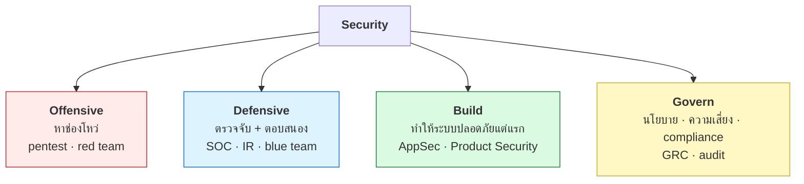

# บทที่ 43 · งานสาย security ทำอะไรกันจริง ๆ

> คุณอ่านมาถึงบทนี้แล้วมีทักษะจริงในมือหลายอย่าง — บทนี้ตอบว่า
> **ทักษะเหล่านั้นตรงกับงานอะไรในตลาด** และอะไรที่ยังขาด
>
> เขียนสำหรับคนที่กำลังคิดว่าจะไปทางไหน หรือกำลังแนะนำนักศึกษา

## 43.1 ภาพรวม — security ไม่ใช่อาชีพเดียว {#s43-1}

คนทั่วไปคิดว่า "ทำ security" คือแฮ็ก ซึ่งเป็นแค่เศษเสี้ยวเดียวของงานจริง



> ## ความจริงที่ขัดกับภาพจำ
>
> **ตำแหน่งงานฝั่งตั้งรับ (Defensive + Build) มีมากกว่าฝั่งบุกหลายเท่า**
>
> องค์กรจ้าง pentester ปีละไม่กี่ครั้ง แต่ต้องมีคนเฝ้าระบบทุกวัน
> และต้องมีคนเขียนโค้ดให้ปลอดภัยตลอดเวลา

## 43.2 แต่ละสายทำอะไรจริง ๆ ในหนึ่งวัน {#s43-2}

| ตำแหน่ง | วันหนึ่งทำอะไร | ทักษะหลัก | บทในเล่มนี้ |
|---------|---------------|-----------|-------------|
| **Penetration Tester** | ทดสอบระบบตามขอบเขตที่ตกลง เขียนรายงาน | web/API, network, การเขียนรายงาน | 24, 25, 15-19 |
| **Red Team** | จำลองผู้โจมตีจริงระยะยาว ทดสอบว่า**ทีมตรวจจับได้ไหม** | social engineering, การหลบเลี่ยง | 39, 41 |
| **SOC Analyst** | ดู alert คัดว่าอันไหนจริง ยกระดับเคส | log, SIEM, การจัดลำดับ | 28, 41 |
| **Incident Response** | เข้าไปตอนเกิดเหตุ ควบคุม กู้คืน สืบสวน | forensics, timeline, ความสงบ | 40, 41 |
| **AppSec / Product Security** | รีวิวโค้ด ออกแบบ threat model ทำ SDLC | เขียนโค้ดเป็น + คิดแบบผู้โจมตี | 24-25, 34, 42 |
| **Security Engineer** | สร้างระบบป้องกัน อัตโนมัติ | infra, CI/CD, การเขียนโปรแกรม | 28, 35-36, 42 |
| **GRC / Audit** | นโยบาย มาตรฐาน ตรวจสอบ | ISO 27001, การสื่อสาร | 22, 34 |
| **Malware Analyst** | แกะตัวอย่าง หา IOC | reverse engineering, OS ลึก | 37, 39-40 |

> ## สายที่คนมองข้ามแต่โตเร็วที่สุด — AppSec
>
> **ถ้าคุณเขียนโค้ดเป็นอยู่แล้ว นี่คือทางที่สั้นที่สุด**
>
> องค์กรหาคนที่ *"เข้าใจโค้ดจริง ๆ และคิดแบบผู้โจมตีได้"* ยากมาก
> เพราะคนเขียนโค้ดมักไม่คิดเรื่องความปลอดภัย
> ส่วนคนสาย security มักเขียนโค้ด production ไม่เป็น
>
> **คนที่ทำได้ทั้งสองอย่างมีน้อย** และเป็นตำแหน่งที่จ่ายดี

## 43.3 ทักษะที่เล่มนี้ให้ และที่ยังขาด {#s43-3}

**สิ่งที่คุณมีแล้วจากหนังสือเล่มนี้:**

| ทักษะ | ระดับ | จากบท |
|-------|-------|-------|
| HTTP / API ลึกถึงระดับ byte | 🟢 ใช้งานได้จริง | 1-13 |
| Authorization / BOLA | 🟢 | 24 |
| Injection / SSRF | 🟢 | 25 |
| TCP/IP + tcpdump | 🟡 พื้นฐานแน่น | 31 |
| Linux internals + สิทธิ์ | 🟡 | 35-36 |
| Malware + detection | 🟡 เข้าใจหลักการ | 39-41 |
| Supply chain | 🟢 | 42 |
| Threat modeling | 🟢 | 34 |

**สิ่งที่ยังต้องไปหาเพิ่ม:**

| ขาดอะไร | ไปเรียนที่ไหน |
|---------|--------------|
| Active Directory / Windows | ห้องแล็บ Windows — องค์กรจริงใช้ AD แทบทั้งหมด |
| Cloud (AWS/Azure/GCP) IAM | บัญชีฟรีทดลอง + เอกสารของผู้ให้บริการ |
| Reverse engineering ลึก | Ghidra + crackme ([บทที่ 40](40-malware-analysis-basics.md)) |
| การเขียนรายงาน | ฝึกจาก CTF write-up ([บทที่ 44](44-ctf-and-legal-practice.md)) |
| ทำงานกับคน | 🔴 **ตัวที่สำคัญที่สุดและสอนในหนังสือไม่ได้** |

> ## ทักษะที่ตัดสินความก้าวหน้าจริง ๆ ไม่ใช่ทักษะเทคนิค
>
> งาน security แทบทั้งหมดคือ**การโน้มน้าวให้คนอื่นแก้ของ** —
> คุณเจอช่องโหว่ แต่คนที่ต้องแก้คือทีมพัฒนาที่มีงานล้นมืออยู่แล้ว
>
> คนที่เขียนรายงานให้อ่านรู้เรื่อง จัดลำดับความสำคัญเป็น
> และไม่ทำให้อีกฝ่ายรู้สึกโง่ — **ก้าวหน้าเร็วกว่าคนที่เก่งเทคนิคกว่าแต่คุยไม่รู้เรื่อง**

## 43.4 Certificate — อันไหนคุ้ม อันไหนไม่ {#s43-4}

**ความจริงก่อน:** cert ไม่ได้ทำให้คุณเก่งขึ้น มันช่วยให้**ผ่านด่านคัดกรอง**
ซึ่งมีค่าจริงตอนยังไม่มีประสบการณ์

| Cert | เน้นอะไร | ราคาโดยประมาณ | คุ้มเมื่อไร |
|------|----------|--------------|-------------|
| **CompTIA Security+** | พื้นฐานกว้าง | 💰 | เริ่มต้น / ต้องใช้ยื่นงานราชการ |
| **OSCP** | 🔥 **ลงมือจริง 24 ชม.** | 💰💰💰 | อยากเข้าสาย offensive จริงจัง |
| **CRTO** | red team, AD | 💰💰 | ถูกกว่า OSCP เน้น AD |
| **eJPT / PNPT** | pentest ระดับต้น-กลาง | 💰-💰💰 | ทางเลือกที่ถูกกว่า OSCP |
| **GIAC (GCIH, GCIA)** | defensive ลึก | 💰💰💰💰 | ถ้านายจ้างออกให้ |
| **CISSP** | บริหาร ต้องมีประสบการณ์ 5 ปี | 💰💰💰 | ตอนขึ้นระดับหัวหน้า |
| **CEH** | ท่องจำเยอะ | 💰💰 | ⚠️ ใช้ผ่าน HR ได้ แต่ชุมชนไม่ค่อยนับ |

> ## ถ้าเลือกได้แค่อย่างเดียวและมีเวลาจำกัด
>
> **อย่าเพิ่งซื้อ cert — ทำโปรเจกต์ที่จับต้องได้ก่อน**
>
> ```
> GitHub ที่มีเครื่องมือที่คุณเขียนเอง + write-up ที่อธิบายได้
>       > cert ใบเดียวโดยไม่มีอะไรให้ดู
> ```
>
> ผู้สัมภาษณ์ถามได้ลึกกว่ามากถ้ามีของจริงให้คุย และคุณตอบได้ดีกว่ามาก
> เพราะคุณทำมาเอง
>
> **cert คุ้มที่สุดตอนที่บริษัทออกเงินให้**

## 43.5 เส้นทางที่เป็นจริงได้จากจุดที่คุณอยู่ {#s43-5}

**ถ้ามาจากสาย data science / dev (แบบผู้อ่านเล่มนี้ส่วนใหญ่):**

```
ทักษะที่มี: เขียนโค้ดเป็น · เข้าใจระบบ · อ่าน log เป็น
        ↓
เส้นทางที่สั้นที่สุด:  AppSec  หรือ  Security Engineer
        ↓
เพราะสองสายนี้ต้องการ "คนที่เขียนโค้ดเป็นจริง ๆ" ซึ่งหายาก
```

**ถ้ามาจากสาย infra / sysadmin:**

```
ทักษะที่มี: Linux · เครือข่าย · การดูแลระบบ
        ↓
เส้นทางที่สั้นที่สุด:  SOC  →  Incident Response  หรือ  Security Engineer
```

**ถ้าเป็นนักศึกษาที่ยังไม่มีประสบการณ์:**

```
1. เล่น CTF ให้ต่อเนื่อง (บทที่ 44)  ← สร้าง portfolio ได้ฟรี
2. เขียน write-up ทุกครั้ง            ← ฝึกสื่อสาร ซึ่งขาดกันมาก
3. ทำ home lab (บทที่ 45)            ← มีของจริงให้คุยตอนสัมภาษณ์
4. หา internship SOC                 ← ประตูที่เปิดง่ายที่สุด
```

## 43.6 สำหรับอาจารย์ — สอนอะไรให้นักศึกษา {#s43-6}

ถ้าคุณกำลังออกแบบวิชาหรือแนะนำนักศึกษา นี่คือสิ่งที่**ตลาดขาดจริง**

| สิ่งที่ตลาดขาด | ทำไมถึงขาด |
|----------------|------------|
| คนที่เขียนโค้ดเป็น**และ**คิดเรื่องความปลอดภัย | หลักสูตรมักแยกสองเรื่องนี้ออกจากกัน |
| คนที่อ่าน log แล้วตั้งสมมติฐานเป็น | ต้องฝึกกับข้อมูลจริง ไม่ใช่ข้อสอบ |
| คนที่เขียนรายงานให้ผู้บริหารอ่านรู้เรื่อง | แทบไม่มีใครสอน |
| คนที่เข้าใจ cloud + container | เนื้อหาเปลี่ยนเร็วกว่าหลักสูตร |

> **ข้อเสนอที่ได้ผลที่สุด:** ให้นักศึกษาทำระบบขึ้นมาจริง แล้วให้เพื่อนอีกกลุ่ม
> พยายามเจาะ จากนั้นสลับกันเขียนรายงาน
>
> ได้ทั้งทักษะบุก ตั้งรับ และการสื่อสาร ในโจทย์เดียว — และใช้ lab
> ของเล่มนี้เป็นจุดเริ่มได้เลย

## แบบฝึกหัด

1. เลือก 3 ตำแหน่งจากตาราง[ข้อ 43.2](#s43-2) แล้วหาประกาศงานจริงมาอ่าน
   — เขาขออะไรบ้างที่คุณยังไม่มี
2. เขียนรายการทักษะของตัวเองเทียบกับตาราง[ข้อ 43.3](#s43-3) — ขาดอะไรมากที่สุด
3. หาคนที่ทำงานสายนี้จริงหนึ่งคน แล้วขอคุย 30 นาที
   (LinkedIn / งาน meetup) — ถามว่าวันหนึ่งทำอะไรบ้าง
4. เขียน write-up ของแบบฝึกหัดที่ยากที่สุดในเล่มนี้ ให้คนที่ไม่รู้เรื่องอ่านรู้เรื่อง
5. ตอบตัวเอง: คุณอยากทำงานที่ **หาช่องโหว่** หรือ **ทำให้ระบบไม่มีช่องโหว่**
   — สองอย่างนี้เป็นคนละอาชีพ

***
[⬅ จริยธรรมและขอบเขต](22-ethics-and-limits.md) · [สารบัญ](../README.md) · [ฝึกอย่างถูกกฎหมาย ➡](44-ctf-and-legal-practice.md)
