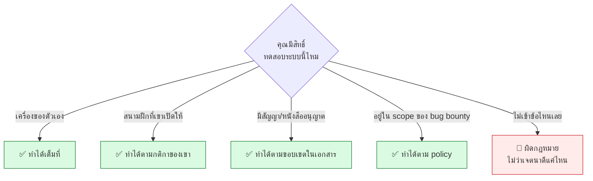

# บทที่ 44 · ฝึกอย่างถูกกฎหมาย — CTF และ bug bounty

> บทที่ 22 บอกว่า **อะไรที่ทำไม่ได้** บทนี้ตอบว่า **แล้วฝึกที่ไหนได้บ้าง**
>
> เพราะทักษะในเล่มนี้ต้องฝึกกับเป้าจริงถึงจะขึ้น — และมีที่ให้ฝึก
> อย่างถูกกฎหมายเยอะกว่าที่คนคิดมาก

## 44.1 เส้นแบ่งที่ต้องชัดในหัวก่อน



> ## กฎข้อเดียวที่ต้องจำ
>
> **"เจตนาดี" ไม่ใช่ข้อยกเว้นทางกฎหมาย**
>
> ในไทย พ.ร.บ. คอมพิวเตอร์ฯ มาตรา 5-7 ครอบคลุมการเข้าถึงระบบโดยมิชอบ
> — **ไม่ได้ดูว่าคุณตั้งใจจะช่วยหรือเปล่า**
>
> การสแกนเว็บของหน่วยงานเพื่อ "จะได้แจ้งเขา" คือความเสี่ยงทางกฎหมายของคุณ
> ไม่ใช่บริการสาธารณะ

**กรณีสีเทาที่คนพลาดบ่อย:**

| ทำอะไร | ปลอดภัยไหม |
|--------|-----------|
| เปิดเว็บ กด F12 ดู request ตัวเอง | ✅ ดูของที่เบราว์เซอร์คุณได้มาอยู่แล้ว |
| แก้ `?id=1` เป็น `?id=2` แล้วเห็นข้อมูลคนอื่น | ⚠️ **บังเอิญเจอ ≠ ได้รับอนุญาตให้ค้นต่อ** — หยุดแล้วแจ้ง |
| รัน `nmap` ใส่เว็บที่ไม่ใช่ของเรา | 🔴 |
| ลอง SQL injection กับเว็บหน่วยงาน | 🔴 |
| ดาวน์โหลดข้อมูลที่รั่วมาดู "เพื่อยืนยัน" | 🔴 ยิ่งหนัก |

## 44.2 สนามฝึกที่เปิดให้ฟรี

**เริ่มจากในเครื่องตัวเองก่อน — เร็วที่สุดและไม่มีความเสี่ยงเลย**

| สนาม | เหมาะกับ | ค่าใช้จ่าย |
|------|---------|-----------|
| **lab ของเล่มนี้** | HTTP, API, auth, BOLA, SSRF | ฟรี |
| **OWASP Juice Shop** | web ครบทุกช่องโหว่คลาสสิก | ฟรี (Docker) |
| **DVWA / WebGoat** | web พื้นฐาน มีระดับความยาก | ฟรี (Docker) |
| **PortSwigger Web Security Academy** | 🔥 **ดีที่สุดสำหรับ web** มีทฤษฎี+แล็บ | ฟรีทั้งหมด |
| **TryHackMe** | เริ่มต้น มีเส้นทางเรียนชัด | ฟรีบางส่วน |
| **Hack The Box** | ยากขึ้น เหมือนของจริงกว่า | ฟรีบางส่วน |
| **OverTheWire (Bandit)** | Linux + shell พื้นฐาน | ฟรี |
| **pwn.college** | ระบบปฏิบัติการ + binary ลึก | ฟรี |
| **picoCTF** | นักเรียน/นักศึกษา เริ่มต้นดี | ฟรี |

> **ถ้าต้องเลือกที่เดียว:** [PortSwigger Web Security Academy](https://portswigger.net/web-security)
> — ฟรีทั้งหมด อธิบายทฤษฎีดีมาก และแล็บอิงช่องโหว่จริงที่พบในงาน
>
> ต่อยอดจากบทที่ 24-25 ของเล่มนี้ได้ตรง ๆ

## 44.3 CTF — ฝึกอะไร และไม่ได้ฝึกอะไร

**CTF** (Capture The Flag) คือการแข่งหาช่องโหว่ในโจทย์ที่จัดเตรียมไว้
เพื่อหา "flag" ซึ่งเป็นข้อความลับ

| ประเภท | ทำอะไร | ตรงกับบทไหน |
|--------|--------|-------------|
| **Web** | ช่องโหว่เว็บ/API | 24, 25 |
| **Pwn / Binary** | บัฟเฟอร์ล้น, ROP | 37 |
| **Reverse** | แกะโปรแกรม | 40 |
| **Crypto** | ระบบเข้ารหัสที่ใช้ผิด | 38 |
| **Forensics** | แกะไฟล์ ดู packet capture | 31, 40 |
| **OSINT** | หาข้อมูลจากแหล่งเปิด | — |

> ## ⚠️ CTF ≠ งานจริง
>
> | CTF | งานจริง |
> |-----|---------|
> | รู้ว่ามีช่องโหว่แน่นอน | **ส่วนใหญ่ไม่มีอะไรเลย** |
> | โจทย์ถูกออกแบบให้แก้ได้ | ระบบไม่ได้ถูกออกแบบมาให้คุณ |
> | เจอ flag = จบ | **เจอช่องโหว่ = งานเพิ่งเริ่ม** ต้องเขียนรายงาน |
> | ทำคนเดียวได้ | ต้องคุยกับทีมพัฒนา |
>
> **CTF ฝึกความคิดและเทคนิคได้ดีมาก แต่ไม่ฝึกความอดทนกับระบบที่น่าเบื่อ
> และไม่ฝึกการสื่อสาร** — สองอย่างที่กินเวลางานจริงมากที่สุด

**วิธีเล่นให้ได้ประโยชน์สูงสุด:**

1. **เขียน write-up ทุกครั้ง** แม้แก้ไม่ได้ — เขียนว่าลองอะไรไปแล้ว
2. **อ่าน write-up ของคนอื่นหลังจบ** — จะเห็นวิธีคิดที่ตัวเองไม่มี
3. **อย่าเพิ่งเปิดเฉลย** ให้ติดอย่างน้อย 30 นาทีก่อน
4. **ทำเป็นทีม** ถ้าเป็นไปได้ — ได้ฝึกอธิบายให้คนอื่นฟัง

## 44.4 Bug bounty — ของจริงที่ถูกกฎหมาย

โปรแกรมที่เจ้าของระบบ**เชิญ**ให้คนทั่วไปมาหาช่องโหว่ แล้วจ่ายรางวัล

| แพลตฟอร์ม | จุดเด่น |
|-----------|---------|
| **HackerOne** | ใหญ่ที่สุด มีโปรแกรมเยอะ |
| **Bugcrowd** | มีโปรแกรมสำหรับมือใหม่ |
| **Intigriti** | เน้นยุโรป |
| **VDP** ของแต่ละองค์กร | ไม่มีเงิน แต่ถูกกฎหมายและได้ประสบการณ์ |

### อ่าน policy ให้ครบก่อนยิงอะไรทั้งสิ้น

ทุกโปรแกรมมีหน้า policy ที่ระบุ:

```
✅ In scope      : โดเมนไหน API ไหนที่ทดสอบได้
🔴 Out of scope  : อะไรที่ห้ามแตะ (มักมีระบบ production ที่สำคัญ)
🔴 ห้ามทำ        : DoS, social engineering, spam, ทดสอบด้วยบัญชีคนอื่น
📝 วิธีรายงาน    : ส่งยังไง ต้องมีอะไรบ้าง
⏱️ Safe harbor   : เขารับรองว่าจะไม่ฟ้อง ถ้าคุณอยู่ในกติกา
```

> **`Safe harbor` คือย่อหน้าที่สำคัญที่สุด** — ถ้าโปรแกรมไม่มีข้อนี้
> แปลว่าเขาไม่ได้รับรองว่าจะไม่ดำเนินคดี **อย่าเข้าร่วม**

### ความจริงเรื่องรายได้

```
คนส่วนใหญ่ที่เริ่ม bug bounty  →  ได้ 0 บาท ในหลายเดือนแรก
```

**เพราะเป้าที่ง่ายถูกคนอื่นเก็บไปหมดแล้ว** โปรแกรมดัง ๆ มีคนสแกนทุกวัน

| คาดหวังแบบไหนถึงจะไม่ผิดหวัง |
|------------------------------|
| ✅ ใช้ฝึกกับระบบจริงอย่างถูกกฎหมาย |
| ✅ สร้าง portfolio ที่พิสูจน์ได้ |
| ✅ ฝึกเขียนรายงาน (ทักษะที่ขาดที่สุด — บทที่ 43) |
| ❌ อย่าคาดหวังเป็นรายได้หลักในปีแรก |

**เริ่มที่โปรแกรมใหม่หรือ VDP ที่ยังไม่มีคนแห่ไป** มีโอกาสเจอมากกว่ามาก

## 44.5 เจอช่องโหว่โดยบังเอิญ — ทำอย่างไร

เกิดขึ้นได้จริง เช่นแก้ URL ตัวเองแล้วเห็นข้อมูลคนอื่น (บทที่ 24)

```
1. หยุดทันที          ← อย่าค้นต่อเพื่อ "ดูว่าลึกแค่ไหน"
2. อย่าดาวน์โหลด      ← การเก็บข้อมูลไว้ทำให้สถานะคุณแย่ลง
3. บันทึกเท่าที่จำเป็น  ← URL + เวลา + ภาพหน้าจอที่ปิดบังข้อมูลคนอื่น
4. หาช่องทางแจ้ง      ← security.txt, security@, หรือ ThaiCERT
5. แจ้งแบบเป็นกลาง     ← บอกสิ่งที่เจอ ไม่เรียกร้อง ไม่ขู่
6. ให้เวลาเขาแก้       ← 90 วันเป็นมาตรฐานสากล
7. อย่าเปิดเผยก่อนแก้  ← ทั้งในทวิตเตอร์และในกลุ่มเพื่อน
```

```bash
# หลายองค์กรประกาศช่องทางไว้ที่นี่
curl -s https://example.com/.well-known/security.txt
```

> ## ⚠️ อย่าทำแม้ตั้งใจดี
>
> - ❌ ทดสอบเพิ่มเติมเพื่อ "ยืนยันความร้ายแรง"
> - ❌ เข้าถึงข้อมูลคนอื่นเพื่อเป็นหลักฐาน
> - ❌ บอกว่า "ถ้าไม่แก้จะเปิดเผย" — **นี่เข้าข่ายกรรโชก**
> - ❌ ขอค่าตอบแทนถ้าเขาไม่มีโปรแกรม bug bounty
>
> ในไทย ให้แจ้งผ่าน **ThaiCERT / NCSA** ได้ถ้าติดต่อเจ้าของระบบไม่ได้

## 44.6 สร้าง portfolio จากการฝึก

สิ่งที่ผู้สัมภาษณ์อยากเห็น เรียงตามน้ำหนัก:

| หลักฐาน | น้ำหนัก | ได้จากไหน |
|---------|---------|-----------|
| **เครื่องมือที่เขียนเอง** | ⭐⭐⭐⭐⭐ | แก้ปัญหาที่เจอจริงตอนฝึก |
| **write-up ที่อธิบายชัด** | ⭐⭐⭐⭐⭐ | CTF, แล็บ |
| **รายงานช่องโหว่จริง** | ⭐⭐⭐⭐ | bug bounty, VDP |
| **home lab ที่มีเอกสาร** | ⭐⭐⭐⭐ | บทที่ 45 |
| อันดับใน CTF | ⭐⭐⭐ | การแข่ง |
| cert | ⭐⭐ | บทที่ 43.4 |

> **write-up ที่ดีมีค่ามากกว่าที่คนคิด** — มันพิสูจน์สองอย่างพร้อมกัน:
> คุณแก้ปัญหาได้ **และ** คุณอธิบายให้คนอื่นเข้าใจได้
>
> ซึ่งข้อสองคือสิ่งที่หาคนได้ยากกว่าข้อแรกมาก

## แบบฝึกหัด

1. ทำแล็บของ PortSwigger หมวด **Access control** ให้ครบ
   แล้วเทียบกับที่เรียนในบทที่ 24
2. ติดตั้ง OWASP Juice Shop ด้วย Docker แล้วหาช่องโหว่ให้ได้ 5 ข้อ
   ```bash
   docker run --rm -p 3000:3000 bkimminich/juice-shop
   ```
3. เข้าร่วม CTF สักรายการ แล้ว**เขียน write-up แม้จะแก้ไม่ได้**
4. เปิด policy ของโปรแกรม bug bounty สัก 3 โปรแกรม
   — หาย่อหน้า safe harbor ให้เจอ
5. ลอง `curl -s https://<เว็บที่คุณใช้บ่อย>/.well-known/security.txt`
   — มีกี่เว็บที่มี
6. เขียนอีเมลแจ้งช่องโหว่ (สมมติ) ให้อ่านแล้วไม่เหมือนคำขู่
   ให้เพื่อนอ่านแล้วถามว่ารู้สึกอย่างไร
7. ตอบตัวเอง: ถ้าพรุ่งนี้คุณบังเอิญเจอข้อมูลนักศึกษารั่วจากระบบของมหาวิทยาลัย
   คุณจะทำอะไรเป็นขั้นที่ 1, 2, 3

***
[⬅ งานสาย security ทำอะไรกันจริง ๆ](43-security-roles-and-paths.md) · [สารบัญ](../README.md) · [สร้างห้องแล็บของตัวเอง ➡](45-home-lab.md)
