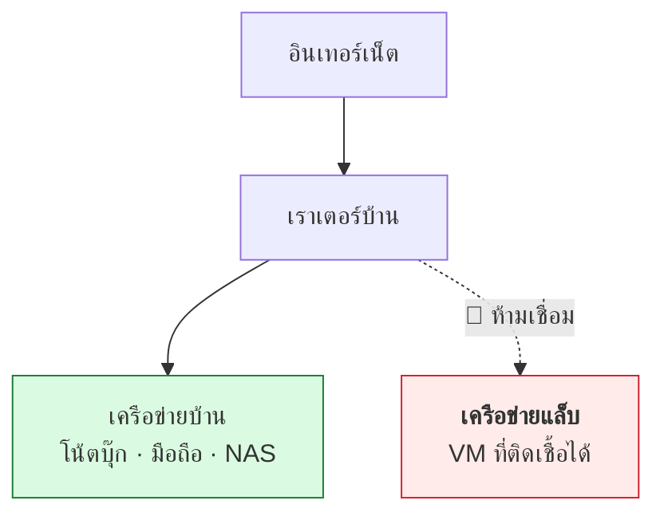

# บทที่ 45 · สร้างห้องแล็บของตัวเอง

> ทุกอย่างในเล่มนี้ต้องลงมือทำถึงจะติด และการลงมือทำต้องมี**ที่ที่พังได้**
>
> บทนี้สอนสร้างสนามที่แยกจากเครือข่ายบ้าน/ที่ทำงาน — ให้รันมัลแวร์จริงได้
> โดยไม่ทำให้เครื่องอื่นเดือดร้อน

## 45.1 ระดับของห้องแล็บ — เริ่มจากที่ถูกที่สุด

**คุณไม่ต้องซื้ออะไรเลยเพื่อเริ่ม**

| ระดับ | ใช้อะไร | ทำอะไรได้ | ต้นทุน |
|-------|---------|-----------|--------|
| **0** | Docker บนเครื่องตัวเอง | เว็บ, API, บริการต่าง ๆ | ฟรี |
| **1** | VM หลายตัว (VirtualBox/KVM) | เครือข่ายจำลอง, AD, มัลแวร์ | ฟรี |
| **2** | เครื่องเก่าที่มีอยู่ + Proxmox | แล็บที่เปิดค้างได้ | ฟรี (ถ้ามีเครื่อง) |
| **3** | mini PC + VLAN switch | แยกเครือข่ายจริง | 💰💰 |

> **ระดับ 0-1 ครอบคลุมทุกอย่างในหนังสือเล่มนี้แล้ว** อย่าเพิ่งซื้ออะไร
> จนกว่าจะรู้ว่าติดขัดตรงไหนจริง ๆ

## 45.2 กฎความปลอดภัยที่ห้ามละเมิด



| กฎ | ทำไม |
|----|------|
| **แล็บห้ามเห็นเครือข่ายบ้าน** | มัลแวร์สแกนหาเพื่อนบ้านเป็นอย่างแรก |
| **แล็บไม่ควรต่อเน็ตโดยไม่จำเป็น** | กัน C2 ติดต่อกลับ ([บทที่ 39](39-how-malware-works.md)) |
| **snapshot ก่อนทุกการทดลอง** | กู้กลับได้ใน 10 วินาที |
| **ห้ามใช้รหัสผ่านจริงในแล็บ** | เครื่องแล็บถือว่าถูกยึดแล้วเสมอ |
| **ห้าม mount โฟลเดอร์เครื่องจริง** | ransomware เข้ารหัสข้ามได้ทันที |
| **แยก USB / clipboard** | ทางลัดที่คนลืมปิด |

> ## ⚠️ ข้อที่พลาดกันบ่อยที่สุด
>
> **VirtualBox แบบ NAT ยังเห็นเครือข่ายบ้านได้** — ต้องตั้งเป็น
> **Internal Network** หรือ **Host-only** ถึงจะตัดขาดจริง
>
> ```bash
> # ทดสอบว่าแยกจริงไหม — รันจากใน VM
> ping -c2 192.168.1.1        # เราเตอร์บ้าน — ต้องไม่ตอบ
> ping -c2 8.8.8.8            # อินเทอร์เน็ต — ต้องไม่ตอบ (ถ้าตั้งใจตัดเน็ต)
> ```
>
> **ถ้าอันไหนตอบ = ยังแยกไม่สำเร็จ อย่าเพิ่งรันมัลแวร์**

## 45.3 ระดับ 0 — Docker Compose ใน 5 นาที

เหมาะกับการฝึกเรื่องเว็บ/API ซึ่งเป็นเนื้อหาส่วนใหญ่ของเล่มนี้

```yaml
# lab-compose.yml
services:
  juice-shop:
    image: bkimminich/juice-shop
    ports: ["3000:3000"]

  dvwa:
    image: vulnerables/web-dvwa
    ports: ["8081:80"]

  # เป้าฝึก network scanning
  target:
    image: nginx:alpine
    networks: [labnet]

  # เครื่องมือ — เข้าไปทำงานจากในนี้
  kali:
    image: kalilinux/kali-rolling
    command: sleep infinity
    networks: [labnet]

networks:
  labnet:
    internal: true        # ← สำคัญ: ตัดขาดจากอินเทอร์เน็ต
```

```bash
docker compose -f lab-compose.yml up -d
docker compose -f lab-compose.yml exec kali bash

# ในนั้น
apt update && apt install -y nmap curl
nmap -sV target
```

> **`internal: true` คือบรรทัดที่สำคัญที่สุด** — มันสร้างเครือข่ายที่
> container คุยกันเองได้ แต่ออกอินเทอร์เน็ตไม่ได้

**ล้างทิ้งเมื่อเสร็จ:**

```bash
docker compose -f lab-compose.yml down -v
```

## 45.4 ระดับ 1 — VM สำหรับงานที่ต้องแยกจริง

Docker แชร์ kernel กับ host ([บทที่ 36](36-permissions-and-isolation.md)) — **ไม่พอสำหรับรันมัลแวร์**
งานแบบนั้นต้อง VM

| ใช้ทำอะไร | ระบบที่แนะนำ |
|-----------|-------------|
| เครื่องผู้โจมตี | Kali หรือ Parrot |
| เป้า Linux | Metasploitable 2/3, Ubuntu ธรรมดา |
| เป้า Windows | Windows evaluation (ฟรี 90 วัน จาก Microsoft) |
| วิเคราะห์มัลแวร์ | **FlareVM** (Windows) + REMnux (Linux) |
| ดู traffic | REMnux ตั้งเป็น gateway ปลอม |

**ตั้งค่าเครือข่ายให้ถูก:**

```
VirtualBox : Internal Network ชื่อ "labnet"
KVM/virsh  : isolated network (ไม่มี forward mode)
Proxmox    : Linux bridge ที่ไม่ผูกกับ NIC จริง
```

> ## เทคนิคที่ทำให้วิเคราะห์มัลแวร์ได้จริง — INetSim
>
> มัลแวร์ส่วนใหญ่ไม่ทำอะไรถ้าต่อเน็ตไม่ได้ ([บทที่ 39.4](39-how-malware-works.md))
> แต่การให้ต่อเน็ตจริงก็อันตราย
>
> **ทางออก:** ตั้ง REMnux เป็นเกตเวย์แล้วรัน `inetsim` ซึ่ง**ปลอมเป็น
> อินเทอร์เน็ตทั้งอินเทอร์เน็ต** — ตอบ DNS ทุกชื่อ ตอบ HTTP ทุก URL
>
> มัลแวร์เชื่อว่าต่อเน็ตได้ จึงแสดงพฤติกรรมจริงออกมา
> ในขณะที่ traffic ทั้งหมดวนอยู่ในแล็บ

## 45.5 แล็บสำหรับ GPU / AI (ส่วนที่ 8)

ถ้าจะฝึกเนื้อหา[บทที่ 46](46-gpu-101.md)-52 ต้องการอีกแบบหนึ่ง

| อยากฝึกอะไร | ต้องมีอะไร | ทำบน RTX ทั่วไปได้ไหม |
|-------------|-----------|----------------------|
| VRAM / KV cache (บท 47) | GPU ใบเดียว | ✅ |
| vLLM / batching (บท 48) | GPU ใบเดียว | ✅ |
| **HAMi แบ่ง GPU** (บท 49) | GPU + k3s | ✅ **GeForce ก็ได้** |
| `LD_PRELOAD` interception | ไม่ต้องมี GPU ด้วยซ้ำ | ✅ |
| **MIG** | การ์ด datacenter/RTX PRO | ❌ |
| **vGPU** | การ์ดที่รองรับ + hypervisor + license | ❌ |
| multi-GPU / NCCL (บท 50) | ≥2 ใบ | ⚠️ ต้องมีสองใบ |

**ตั้ง k3s + HAMi บนเครื่องเดียวเพื่อฝึก[บทที่ 49](49-gpu-on-containers-and-k8s.md):**

```bash
# 1. k3s แบบ node เดียว
curl -sfL https://get.k3s.io | sh -
sudo k3s kubectl get nodes

# 2. ต่อ NVIDIA runtime เข้า containerd ของ k3s
sudo nvidia-ctk runtime configure --runtime=containerd \
  --config=/var/lib/rancher/k3s/agent/etc/containerd/config.toml
sudo systemctl restart k3s

# 3. HAMi ผ่าน helm
helm repo add hami-charts https://project-hami.github.io/HAMi/
helm install hami hami-charts/hami -n kube-system
```

> **นี่คือวิธีตอบคำถาม "ภาควิชาดูแลเองไหวไหม" โดยไม่ต้องเดา**
> — ถ้าทำได้ใน 2-3 วัน ก็ทำเองได้ ถ้าติดหนึบ ก็รู้แล้วว่าควรจ่ายค่าคนดูแล
>
> และ**การ์ด GeForce ที่มีอยู่ก็พอสำหรับทดสอบส่วนนี้** เพราะ HAMi
> เป็นซอฟต์แวร์ล้วน ไม่เลือกรุ่นการ์ด ([บทที่ 49.3](49-gpu-on-containers-and-k8s.md))

## 45.6 ทำให้แล็บมีค่าตอนสัมภาษณ์

แล็บที่ไม่มีเอกสารคือแล็บที่เล่าไม่ได้

**เก็บ 4 อย่างนี้ไว้ใน repo:**

```
lab/
├── README.md          ← แผนผังเครือข่าย + มีอะไรบ้าง + ทำไมตั้งแบบนี้
├── compose/           ← ไฟล์ที่ใช้สร้างขึ้นมาใหม่ได้
├── notes/             ← สิ่งที่ทดลองและผลที่ได้
└── writeups/          ← เจอช่องโหว่อะไร แก้ยังไง
```

> **สิ่งที่ทำให้ผู้สัมภาษณ์ประทับใจไม่ใช่ขนาดของแล็บ**
> แต่คือ **"ทำไมคุณถึงตั้งแบบนี้"**
>
> คนที่อธิบายได้ว่าเลือก internal network เพราะอะไร แยก VLAN ทำไม
> เจอปัญหาอะไรแล้วแก้ยังไง — แสดงว่าเข้าใจจริง ไม่ได้ทำตาม tutorial

**ทำให้ทุกอย่างสร้างใหม่ได้จากไฟล์** ([บทที่ 30](30-git.md)) — ถ้าแล็บพัง
แล้วสร้างใหม่ได้ใน 10 นาที คุณจะกล้าทดลองมากขึ้นมาก

## 45.7 Checklist ก่อนรันอะไรที่น่าสงสัย

- [ ] snapshot ล่าสุดถ่ายแล้ว
- [ ] เครือข่ายเป็น internal/host-only — ทดสอบ `ping` เราเตอร์บ้านแล้วไม่ตอบ
- [ ] ไม่มี shared folder ไปยังเครื่องจริง
- [ ] clipboard และ drag-drop ปิดแล้ว
- [ ] USB passthrough ปิดแล้ว
- [ ] ไม่มีรหัสผ่านหรือ token จริงอยู่ใน VM
- [ ] รู้ว่าจะกู้กลับอย่างไรถ้าพัง
- [ ] ถ้าต้องให้มัลแวร์ "เห็นเน็ต" ใช้ INetSim ไม่ใช่เน็ตจริง

## แบบฝึกหัด

1. สร้าง `lab-compose.yml` ในข้อ 45.3 แล้วยืนยันว่า container
   ในเครือข่าย `internal` ออกเน็ตไม่ได้จริง
2. สร้าง VM สองตัวใน internal network แล้วให้ตัวหนึ่ง `nmap` อีกตัว
3. ทดสอบการแยกเครือข่าย: จาก VM ลอง `ping` เราเตอร์บ้าน — ต้องไม่ตอบ
   ถ้าตอบ ให้แก้จนกว่าจะไม่ตอบ
4. ถ่าย snapshot แล้วลองทำ VM พังโดยตั้งใจ จากนั้นกู้กลับ — ใช้เวลากี่วินาที
5. ติดตั้ง k3s + HAMi ตามข้อ 45.5 แล้วสร้าง pod ที่จำกัด VRAM 4 GB
   — จองเกินแล้วเกิดอะไรขึ้น
6. เขียน `lab/README.md` ของตัวเอง พร้อมแผนผังเครือข่าย
   ให้คนอื่นอ่านแล้วสร้างตามได้
7. ตอบตัวเอง: ถ้ามัลแวร์ในแล็บหลุดออกไปเครือข่ายบ้านได้ จะรู้ตอนไหน
   — และควรเพิ่มอะไรเพื่อให้รู้เร็วขึ้น

***
[⬅ ฝึกอย่างถูกกฎหมาย](44-ctf-and-legal-practice.md) · [สารบัญ](../README.md) · [เรื่องพวกนี้เขาสอนกันในวิชาไหน ➡](23-where-to-learn-more.md)
