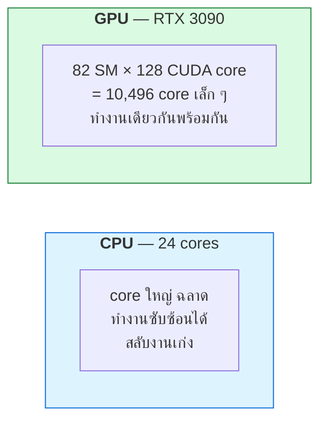
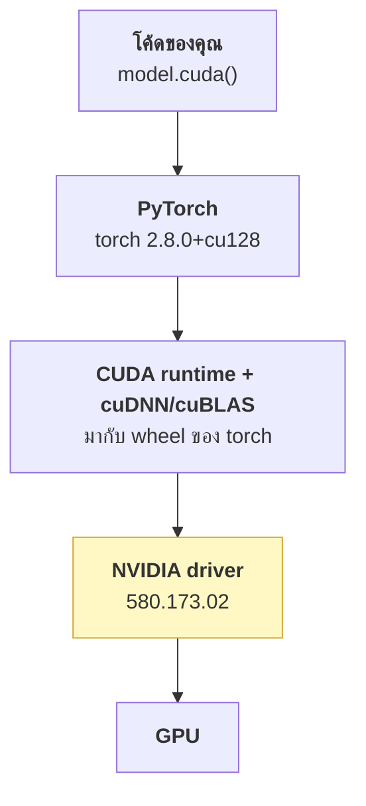

# บทที่ 46 · GPU 101 สำหรับคนที่มาจาก data science

> คุณใช้ GPU มาแล้ว — `model.cuda()` แล้วมันก็เร็วขึ้น
> บทนี้อธิบายว่า **ข้างในเกิดอะไรขึ้น** และทำไมบางครั้งมันไม่เร็วขึ้น
>
> ทุกตัวเลขในบทนี้วัดจาก **RTX 3090** จริง รันตามได้เลย

## 46.1 GPU ต่างจาก CPU อย่างไร {#s46-1}



| | CPU | GPU |
|---|-----|-----|
| จำนวน core | สิบ ๆ | **หลักพัน-หมื่น** |
| ความสามารถต่อ core | สูง | ต่ำ |
| เก่งเรื่อง | logic แตกแขนง, latency ต่ำ | **ทำเลขเดียวกันกับข้อมูลจำนวนมาก** |
| แย่เรื่อง | งานขนานมหาศาล | `if/else` ที่แตกต่างกันในแต่ละ thread |

**Matrix multiply คือสิ่งที่ GPU เกิดมาเพื่อทำ** — และ deep learning
ก็คือ matrix multiply ต่อกันเป็นชั้น ๆ นั่นคือเหตุผลทั้งหมดที่ GPU
กลายเป็นหัวใจของ AI

```bash
python3 -c "
import torch
p = torch.cuda.get_device_properties(0)
print(f'{p.name}: {p.multi_processor_count} SM, {p.total_memory/1024**3:.1f} GiB')
"
```

```
NVIDIA GeForce RTX 3090: 82 SM, 23.5 GiB
```

## 46.2 อ่าน `nvidia-smi` ให้เป็น {#s46-2}

```bash
nvidia-smi
watch -n 1 nvidia-smi                    # ดูต่อเนื่อง
nvidia-smi --query-gpu=index,name,memory.total,memory.used,utilization.gpu,temperature.gpu,power.draw --format=csv
```

```
index, name, memory.total, memory.used, memory.free, utilization.gpu, temperature.gpu, power.draw
0, NVIDIA GeForce RTX 3090, 24576 MiB, 856 MiB, 23252 MiB, 0 %, 52, 21.33 W
```

| ค่า | ความหมาย | ระวังอะไร |
|-----|----------|-----------|
| `memory.used` | VRAM ที่ถูกจอง | **ตัวเลขนี้คือขีดจำกัดจริงของคุณ** |
| `utilization.gpu` | % ของเวลาที่มี kernel ทำงาน | ⚠️ **หลอกตา** — ดู[ข้อ 46.7](#s46-7) |
| `temperature.gpu` | อุณหภูมิ | >83°C จะเริ่มลดความเร็วเอง |
| `power.draw / limit` | กำลังไฟ | ชน limit = ถูกจำกัดความเร็ว |

```bash
# ใครใช้ GPU อยู่บ้าง (คล้าย ss -tlnp ของบทที่ 31)
nvidia-smi --query-compute-apps=pid,process_name,used_memory --format=csv
```

## 46.3 ชั้นซอฟต์แวร์ — เวลาพังต้องรู้ว่าพังชั้นไหน {#s46-3}



**กฎที่ต้องจำ: driver ต้องใหม่กว่าหรือเท่ากับ CUDA ที่ torch ต้องการ**
(ย้อนกลับไม่ได้ — driver เก่ากับ CUDA ใหม่ = พัง)

```bash
nvidia-smi | head -3          # เวอร์ชัน driver + CUDA สูงสุดที่รองรับ
python3 -c "import torch; print(torch.__version__, torch.version.cuda)"
```

| error ที่เจอ | สาเหตุจริง |
|--------------|-----------|
| `CUDA driver version is insufficient` | driver เก่าเกินไป → อัปเดต driver |
| `no CUDA-capable device is detected` | ไม่เห็นการ์ด → ตรวจ `lspci`, driver, permission |
| `torch.cuda.is_available() == False` | ติดตั้ง torch เวอร์ชัน CPU-only |
| `CUDA out of memory` | **VRAM ไม่พอ — [บทที่ 47](47-gpu-memory-and-kv-cache.md)** |

> **ไม่ต้องติดตั้ง CUDA toolkit แยก** ถ้าใช้ `pip install torch` — wheel
> มี CUDA runtime มาให้แล้ว ที่ต้องมีบนเครื่องคือ **driver** เท่านั้น

## 46.4 VRAM คือทรัพยากรที่หมดก่อนเสมอ {#s46-4}

**นี่คือความต่างที่สำคัญที่สุดจากการเขียนโปรแกรมปกติ** — บน CPU คุณมี RAM 46 GB
และมี swap แต่บน GPU คุณมี **23.5 GiB และไม่มี swap** พอหมดคือ crash

```python
import torch
def mb(x): return x / 1024**2

torch.cuda.empty_cache()
print(f"เริ่มต้น  allocated={mb(torch.cuda.memory_allocated()):.1f} MB")

x = torch.zeros(1024, 1024, 256, dtype=torch.float16, device='cuda')
print(f"จอง 512MB allocated={mb(torch.cuda.memory_allocated()):.1f} MB")

del x
torch.cuda.empty_cache()
print(f"หลังคืน  allocated={mb(torch.cuda.memory_allocated()):.1f} MB")
```

```
เริ่มต้น  allocated=0.0 MB
จอง 512MB allocated=512.0 MB
หลังคืน  allocated=0.0 MB
```

**`allocated` vs `reserved` — ต่างกันและสำคัญ:**

| ค่า | คืออะไร |
|-----|---------|
| `memory_allocated()` | tensor ของคุณใช้จริงเท่าไร |
| `memory_reserved()` | PyTorch จองจาก GPU ไว้เท่าไร (รวม cache) |
| `nvidia-smi` เห็น | `reserved` + CUDA context |

PyTorch **ไม่คืน VRAM ให้ GPU ทันทีที่คุณ `del`** — มันเก็บไว้ใน pool
เพื่อใช้ซ้ำ (เร็วกว่ามาก) `empty_cache()` คือคำสั่งคืนจริง

> ⚠️ **`empty_cache()` ไม่ได้แก้ OOM** — มันแค่คืน cache ที่ว่างอยู่แล้ว
> ถ้า tensor ยังถูกอ้างอิงอยู่ มันไม่หายไปไหน คนมักเรียกมันแบบเชื่อว่าเป็นยาวิเศษ

## 46.5 ค่าใช้จ่ายที่มองไม่เห็น — CUDA context {#s46-5}

```python
# วัดว่าแค่เริ่มใช้ CUDA กินไปเท่าไร
torch.cuda.init(); torch.zeros(1, device='cuda')
```

**ผลจริงบน RTX 3090:**

```
ก่อนสร้าง context: 839 MiB
หลังสร้าง context: 1147 MiB
→ กินไป ~308 MiB โดยที่ยังไม่ได้โหลดอะไรเลย
```

**CUDA context + cuBLAS/cuDNN kernel กินราว 300-600 MB ต่อ process**

ผลที่ตามมา:

- **VRAM ที่ใช้ได้จริง ≈ 23.5 − 0.3 − ที่ระบบ/จอใช้อยู่**
- **รันหลาย process บน GPU เดียว = จ่ายค่า context หลายรอบ** — นี่คือเหตุผล
  ที่การเสิร์ฟด้วย process เดียวที่ batch หลาย request ดีกว่าหลาย process
  (จะเจอเต็ม ๆ ใน[บทที่ 48](48-serving-llm.md))

## 46.6 ตัวเลขที่เปลี่ยนวิธีคิด — bandwidth {#s46-6}

```python
# วัด PCIe vs VRAM bandwidth
h = torch.empty(n, dtype=torch.float16, pin_memory=True)
d = torch.empty(n, dtype=torch.float16, device='cuda')
d.copy_(h)      # host → device ผ่าน PCIe
d.clone()       # device → device ใน VRAM
```

**ผลจริงบน RTX 3090:**

```
host → device (PCIe):    23.5 GB/s
device → device (VRAM): 388.1 GB/s     ← เร็วกว่า 16 เท่า
```

> ## กฎทองของ GPU: **ย้ายข้อมูลให้น้อยที่สุด**
>
> การคำนวณบน GPU เร็วมาก แต่ **การขนข้อมูลเข้า-ออกช้า**
> โปรแกรมที่ช้าส่วนใหญ่ไม่ได้ช้าเพราะคำนวณไม่ทัน แต่ช้าเพราะรอข้อมูล

**สิ่งที่ตามมาในทางปฏิบัติ:**

```python
# ❌ ย้ายไป-มาทุกรอบ
for batch in loader:
    x = batch.cuda()
    y = model(x)
    result.append(y.cpu())      # ← ดึงกลับทุกรอบ

# ✅ เก็บบน GPU ให้นานที่สุด แล้วค่อยดึงทีเดียว
outs = []
for batch in loader:
    outs.append(model(batch.cuda()))
result = torch.cat(outs).cpu()  # ← ดึงครั้งเดียว
```

**`pin_memory=True` ใน DataLoader** ทำให้ copy เร็วขึ้นจริง เพราะหน่วยความจำ
ที่ถูก pin ทำ DMA ได้โดยตรง

## 46.7 ⚠️ `utilization.gpu` หลอกตา {#s46-7}

**นี่คือกับดักอันดับหนึ่งของคนเริ่มทำ GPU infra**

```
utilization.gpu = % ของเวลาที่มี "kernel อย่างน้อยหนึ่งตัว" ทำงานอยู่
```

**มันไม่ได้บอกว่าใช้ GPU ได้คุ้มแค่ไหน** — kernel ที่ใช้ core แค่ 1% จาก 10,496 core
ก็ทำให้ตัวเลขนี้เป็น 100% ได้

| เห็น 100% แต่ | ความจริง |
|---------------|----------|
| kernel เล็กมากทำงานถี่ ๆ | ใช้ GPU ได้แค่เศษเสี้ยว |
| รอข้อมูลจาก PCIe | GPU ว่างแต่ตัวเลขไม่บอก |
| batch เล็กเกินไป | core ส่วนใหญ่ว่าง |

**ตัวชี้วัดที่มีความหมายจริง:**

| วัดอะไร | บอกอะไร |
|---------|---------|
| **Throughput** (token/s, images/s) | ← สิ่งที่คุณสนใจจริง |
| **VRAM ที่ใช้** | ขีดจำกัดจริง |
| SM occupancy (DCGM) | core ถูกใช้จริงแค่ไหน |
| Tensor Core utilization | ใช้หน่วยคำนวณเฉพาะทางไหม |

> **[บทที่ 51](51-gpu-observability-and-cost.md) จะลงรายละเอียดเรื่องนี้** — และมันคือเหตุผลเดียวกับ[บทที่ 28.4](28-observability-and-deployment.md#s28-4)
> ที่บอกว่า metric ที่ผิดทำให้ตัดสินใจผิด

## 46.8 ชนิดข้อมูล — ตัวแปรที่มีผลมากที่สุดต่อ VRAM {#s46-8}

| dtype | byte/ค่า | ใช้ตอนไหน |
|-------|----------|-----------|
| `float32` | 4 | ค่าเริ่มต้นเดิม — **เปลืองโดยไม่จำเป็นสำหรับ inference** |
| `float16` | 2 | มาตรฐานของ inference |
| `bfloat16` | 2 | ✅ ช่วงตัวเลขกว้างกว่า fp16 — **เลือกตัวนี้ถ้าการ์ดรองรับ** |
| `int8` | 1 | quantized |
| `int4` | 0.5 | quantized หนัก |

**ลด dtype ครึ่งหนึ่ง = VRAM ลดครึ่งหนึ่ง** ซึ่งเป็นวิธีที่ได้ผลเร็วที่สุด
เมื่อ VRAM ไม่พอ

```python
model = model.half()                              # fp16
model = model.to(torch.bfloat16)                  # bf16
```

> **RTX 3090 (Ampere, cc 8.6) รองรับ bf16** — ตรวจได้ด้วย
> `torch.cuda.is_bf16_supported()`

## 46.9 Tensor Core — หน่วยคำนวณที่ต้องใช้ให้เป็น {#s46-9}

GPU สมัยใหม่มีวงจรเฉพาะสำหรับ matrix multiply เรียกว่า **Tensor Core**
ซึ่งเร็วกว่า CUDA core ธรรมดาหลายเท่า **แต่ใช้ได้เฉพาะเงื่อนไขบางอย่าง**

```python
# เปิดให้ใช้ TF32 บน matmul (Ampere ขึ้นไป)
torch.backends.cuda.matmul.allow_tf32 = True
torch.backends.cudnn.allow_tf32 = True

# หรือใช้ mixed precision
with torch.autocast('cuda', dtype=torch.bfloat16):
    out = model(x)
```

**ขนาดของ tensor มีผล** — มิติที่หารด้วย 8 (fp16) หรือ 16 ลงตัวจะใช้
Tensor Core ได้เต็มที่ นี่คือเหตุผลที่โมเดลมักออกแบบให้มิติเป็นเลขกลม ๆ

## 46.10 คำสั่งที่ควรจำ {#s46-10}

```bash
nvidia-smi                                    # ภาพรวม
watch -n1 nvidia-smi                          # ดูต่อเนื่อง
nvidia-smi --query-compute-apps=pid,used_memory --format=csv   # ใครใช้อยู่
nvidia-smi -q -d MEMORY,UTILIZATION,POWER     # รายละเอียด
nvidia-smi --gpu-reset -i 0                   # รีเซ็ต (ต้องไม่มี process ใช้)
nvidia-smi topo -m                            # topology (สำคัญตอนหลายการ์ด — บทที่ 50)
```

```python
torch.cuda.is_available()
torch.cuda.device_count()
torch.cuda.get_device_properties(0)
torch.cuda.memory_allocated() / 1024**3
torch.cuda.max_memory_allocated() / 1024**3   # จุดพีค — สำคัญกว่าค่าปัจจุบัน
torch.cuda.reset_peak_memory_stats()
```

**`max_memory_allocated()` คือค่าที่ควรดูตอนหา OOM** — ไม่ใช่ค่าปัจจุบัน
เพราะ OOM เกิดที่จุดพีค

## แบบฝึกหัด

1. รัน `nvidia-smi --query-gpu=...` แบบใน[ข้อ 46.2](#s46-2) บนเครื่องคุณ แล้วจดค่า
   `memory.total` กับ `memory.free` ไว้ — จะใช้ใน[บทที่ 47](47-gpu-memory-and-kv-cache.md)
2. วัดว่า CUDA context บนเครื่องคุณกินเท่าไร (โค้ดใน[ข้อ 46.5](#s46-5))
3. วัด bandwidth PCIe vs VRAM ([ข้อ 46.6](#s46-6)) — ต่างกันกี่เท่า
4. จอง tensor ขนาดต่าง ๆ แล้วเทียบ `memory_allocated()` กับที่ `nvidia-smi` เห็น
   — ต่างกันเท่าไร ทำไม
5. เปลี่ยน `float32` เป็น `bfloat16` กับ tensor เดิม — VRAM ลดลงกี่เปอร์เซ็นต์
6. เขียนลูปที่ย้ายข้อมูล CPU↔GPU ทุกรอบ เทียบกับแบบที่เก็บบน GPU
   — จับเวลาต่างกันเท่าไร
7. เปิด `watch -n1 nvidia-smi` ไว้แล้วรันงานที่ batch เล็กมาก ๆ
   — `utilization.gpu` เป็นเท่าไร แล้ว throughput จริงเป็นเท่าไร
8. ใช้ `torch.cuda.max_memory_allocated()` หาจุดพีคของสคริปต์ที่คุณเขียนอยู่

***
[⬅ ออกแบบเครือข่ายให้ป้องกันได้](59-network-defense.md) · [สารบัญ](../README.md) · [VRAM และ KV cache ➡](47-gpu-memory-and-kv-cache.md)
