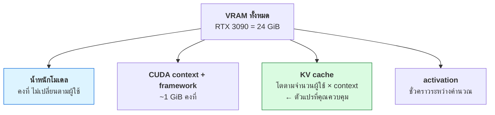
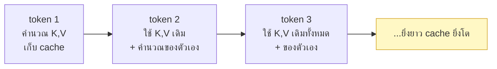
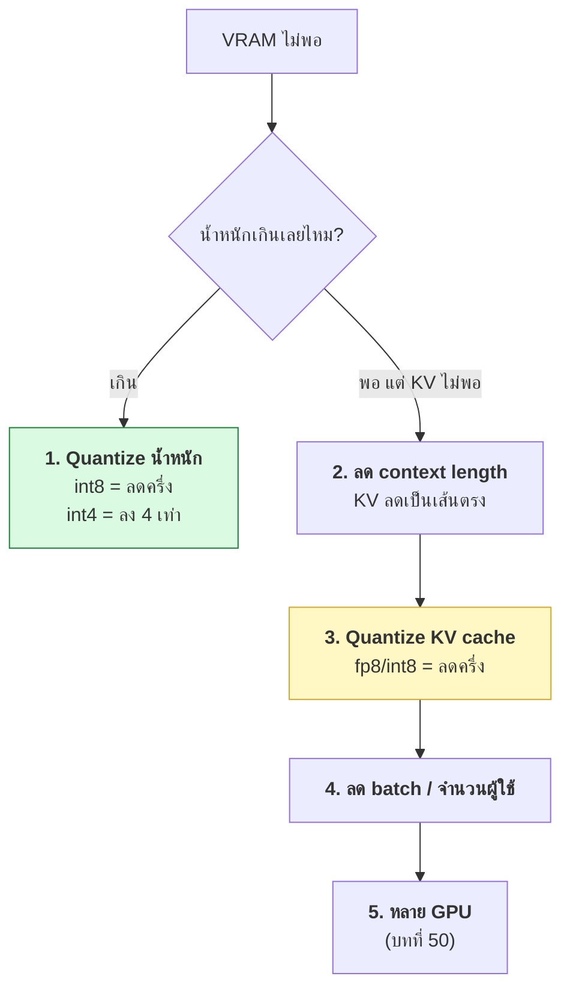

# บทที่ 47 · VRAM และ KV cache — คำนวณให้เป็น

> นี่คือบทที่สำคัญที่สุดของส่วน GPU
>
> เพราะมันเปลี่ยนคำถามที่ตอบไม่ได้ — "การ์ดนี้รันโมเดลนี้ได้ไหม",
> "เสิร์ฟได้กี่คน", "ต้องซื้อการ์ดเพิ่มไหม" — ให้กลายเป็น **เลขคณิต**

lab ของบทนี้อยู่ที่ [lab/gpu/vram_calc.py](../lab/gpu/vram_calc.py) — รันได้เลย

## 47.1 VRAM ถูกใช้ไปกับอะไรบ้าง {#s47-1}



| ส่วน | โตตามอะไร | ควบคุมได้ไหม |
|------|-----------|---------------|
| น้ำหนักโมเดล | ขนาดโมเดล × dtype | เลือกโมเดล/quantize |
| CUDA context | คงที่ ~0.3-0.6 GiB/process (บท 46.5) | รวม process |
| **KV cache** | **ผู้ใช้ × context length** | **← หัวใจของบทนี้** |
| activation | batch × ขนาด | batch size |

**KV cache คือส่วนเดียวที่โตตามจำนวนผู้ใช้** — จึงเป็นตัวที่กำหนดว่า
คุณเสิร์ฟได้กี่คนพร้อมกัน

### วัด CUDA context ด้วยตัวเอง

แถวที่สองในตารางเป็นค่าที่คนมองข้ามบ่อย เพราะมันหายไป**ก่อน**ที่คุณจะโหลดอะไรเลย
วัดได้ตรง ๆ:

```python
import subprocess, torch

def used():
    o = subprocess.run(["nvidia-smi", "--query-gpu=memory.used",
                        "--format=csv,noheader,nounits"],
                       capture_output=True, text=True).stdout
    return int(o.splitlines()[0])

b = used();  print(f"ก่อนสร้าง CUDA context : {b} MiB")
torch.zeros(1, device="cuda")                      # แค่นี้ก็สร้าง context แล้ว
c = used();  print(f"หลังสร้าง context      : {c} MiB   (+{c-b} MiB)")
x = torch.zeros(256*1024*1024, dtype=torch.float32, device="cuda")   # 1 GiB
d = used();  print(f"หลังจอง tensor 1024 MiB: {d} MiB   (+{d-c} MiB)")
```

ผลจริงบน RTX 3090 (driver 580.173.02, PyTorch 2.8):

```
ก่อนสร้าง CUDA context : 619 MiB
หลังสร้าง context      : 927 MiB   (+308 MiB)
หลังจอง tensor 1024 MiB: 1951 MiB   (+1024 MiB)
```

**`torch.zeros(1)` กิน 308 MiB** — ยังไม่ได้โหลดโมเดล ยังไม่ได้คำนวณอะไร
ส่วนการจอง tensor จริงตรงเป๊ะตามที่ขอ

> ## ทำไมตัวเลขนี้สำคัญตอนแบ่ง GPU
>
> ยิ่งแบ่งโควตาเล็ก overhead ยิ่งกินสัดส่วนมาก
>
> | โควตา | เหลือใช้จริง | เสียไป |
> |-------|--------------|--------|
> | 2 GB | ~1.7 GB | **17%** |
> | 8 GB | ~7.6 GB | 4% |
> | 24 GB | ~23.6 GB | 1% |
>
> และถ้าแบ่งให้ 20 คน — **308 MiB × 20 = 6 GiB หายไปเฉย ๆ** ก่อนใครจะได้ทำงาน
> เป็นต้นทุนที่ต้องนับตอนวางแผนห้องแล็บ ([บทที่ 49](49-gpu-on-containers-and-k8s.md))
>
> **ตอนคุยกับผู้ขายให้ถามว่าโควตาที่เสนอมานับรวม context นี้หรือยัง**

## 47.2 น้ำหนักโมเดล — ตัวเลขง่ายที่สุด {#s47-2}

```
VRAM ของน้ำหนัก = จำนวนพารามิเตอร์ × byte ต่อค่า
```

| dtype | byte/ค่า | Llama-3 8B | Llama-3 70B |
|-------|----------|------------|-------------|
| fp32 | 4 | 30 GiB | 260 GiB |
| **fp16 / bf16** | 2 | **15 GiB** | 130 GiB |
| int8 | 1 | 7.5 GiB | 65 GiB |
| int4 | 0.5 | 3.7 GiB | 33 GiB |

**สูตรลัดที่ใช้ในหัว:** โมเดล `N` พันล้านพารามิเตอร์ที่ fp16 กิน **`2N` GiB**

- 8B → 16 GiB
- 70B → 140 GiB (**การ์ด 24 GiB ใบเดียวโหลดไม่ได้ ต้องหลายใบ — [บทที่ 50](50-multi-gpu-and-networking.md)**)

**นี่คือคำตอบแรกของ "รันได้ไหม"** — ถ้าน้ำหนักอย่างเดียวเกิน VRAM ก็จบเลย
ยังไม่ต้องคิดเรื่อง KV cache

## 47.3 KV cache — ทำไมมันถึงมีอยู่ {#s47-3}

ตอน LLM สร้างข้อความ มันทำทีละ token และแต่ละ token ต้อง "มองย้อน"
ไปที่ token ก่อนหน้าทั้งหมด (attention)

**ถ้าไม่มี cache** — token ที่ 1000 ต้องคำนวณ Key/Value ของ token ที่ 1-999
ใหม่ทั้งหมด แล้ว token ที่ 1001 ก็คำนวณ 1-1000 ใหม่อีก... ช้าแบบ O(n²)

**KV cache** เก็บ Key และ Value ของทุก token ที่คำนวณไปแล้ว ไว้ใช้ซ้ำ
— แลก**หน่วยความจำ**กับ**ความเร็ว**



> **นี่คือ trade-off เดียวกับ cache ทุกชนิดในคอร์สนี้** — ETag (บท 26.5),
> idempotency (บท 12.4), connection pool (บท 27.4) ล้วนแลกหน่วยความจำ
> กับความเร็ว KV cache ก็เหมือนกัน

## 47.4 สูตร KV cache — หัวใจของทั้งบท {#s47-4}

```
KV cache ต่อ 1 token = 2 × layers × kv_heads × head_dim × bytes
                       ↑
                   K และ V
```

**ไล่ทีละตัวกับ Llama-3 8B (fp16):**

| ตัวแปร | ค่า | มาจากไหน |
|--------|-----|----------|
| 2 | 2 | เก็บทั้ง Key และ Value |
| layers | 32 | จำนวนชั้นของโมเดล |
| kv_heads | 8 | **KV head (ไม่ใช่ 32!)** — ดู[ข้อ 47.5](#s47-5) |
| head_dim | 128 | hidden 4096 ÷ 32 heads |
| bytes | 2 | fp16 |

```
2 × 32 × 8 × 128 × 2 = 131,072 byte = 128 KiB ต่อ token
```

**ต่อ 1 sequence ที่ context 4,096 tokens:**

```
128 KiB × 4,096 = 512 MiB ต่อผู้ใช้ 1 คน
```

## 47.5 GQA — ทำไม kv_heads ถึงน้อยกว่า heads {#s47-5}

โมเดลรุ่นเก่า (เช่น Llama-2 7B) มี `kv_heads = heads` แต่รุ่นใหม่ใช้
**GQA (Grouped Query Attention)** ที่ให้หลาย query head **แชร์ KV head เดียวกัน**

| โมเดล | heads | kv_heads | ผลต่อ KV cache |
|-------|-------|----------|----------------|
| Llama-2 7B (MHA) | 32 | 32 | เต็ม |
| **Llama-3 8B (GQA)** | 32 | **8** | **ลง 4 เท่า** |
| Qwen2.5 7B (GQA) | 28 | 4 | ลง 7 เท่า |

> **นี่คือเหตุผลที่โมเดลใหม่เสิร์ฟได้มากกว่าบนการ์ดเดิม** — ไม่ใช่แค่โมเดลเก่ง
> ขึ้น แต่ออกแบบให้ KV cache เล็กลงด้วย ถ้าคุณดูแต่จำนวนพารามิเตอร์
> จะพลาดจุดนี้

## 47.6 ประกอบทุกอย่าง — เสิร์ฟได้กี่คน {#s47-6}

```
จำนวนผู้ใช้พร้อมกัน = (VRAM − น้ำหนัก − context overhead) ÷ (KV cache ต่อ sequence)
```

**Llama-3 8B บน RTX 3090 (24 GiB), context 4,096:**

```
VRAM ทั้งหมด              24.00 GiB
− น้ำหนักโมเดล (fp16)     14.90 GiB
− CUDA context + framework 0.98 GiB
= เหลือให้ KV cache        8.12 GiB

8.12 GiB ÷ 0.50 GiB/คน = ~16 คนพร้อมกัน
```

**รันเองแล้วดู:**

```bash
python3 lab/gpu/vram_calc.py --model llama3-8b
```

lab อ่าน VRAM จากการ์ดในเครื่องคุณให้อัตโนมัติ ถ้าไม่มี GPU ใส่ `--vram 24`

## 47.7 ตารางที่เปลี่ยนวิธีตัดสินใจ {#s47-7}

```bash
python3 lab/gpu/vram_calc.py
```

```
VRAM 24.0 GiB · น้ำหนัก fp16 · KV fp16 · context 4,096

  โมเดล                    น้ำหนัก   KV/token   พร้อมกัน
  ──────────────────────────────────────────────────────
  Llama-3 8B                14.9 GiB      128 KiB         16
  Llama-3 70B              130.4 GiB      320 KiB โหลดไม่ได้
  Qwen2.5 7B                14.2 GiB       56 KiB         40
  Qwen2.5 14B               27.6 GiB      192 KiB โหลดไม่ได้
  Gemma 2 9B                17.1 GiB      294 KiB          5
  Phi-3 mini 3.8B            7.1 GiB      384 KiB         10
```

**อ่านตารางนี้ให้เป็นคือทักษะหลักของ AI infra:**

- **Qwen2.5 7B เสิร์ฟได้ 40 คน แต่ Llama-3 8B ได้แค่ 16** — ทั้งที่ขนาดพอ ๆ กัน
  เพราะ Qwen ใช้ kv_heads = 4 (GQA แน่นกว่า)
- **Gemma 2 9B เสิร์ฟได้แค่ 5 คน** — KV cache ต่อ token สูงถึง 294 KiB
- **Phi-3 mini เล็กแต่ KV cache ใหญ่** — เพราะไม่ได้ใช้ GQA (kv_heads = 32)

> **ขนาดโมเดลไม่ได้บอกว่าเสิร์ฟได้กี่คน** — KV cache ต่างหากที่บอก
> นี่คือสิ่งที่คนดูแต่จำนวนพารามิเตอร์มองข้าม

## 47.8 เมื่อ VRAM ไม่พอ — 5 ทางแก้ เรียงตามผลกระทบ {#s47-8}



**ลองเทียบด้วย lab:**

```bash
# น้ำหนัก fp16 + KV fp16, context 4096 → 16 คน
python3 lab/gpu/vram_calc.py --model llama3-8b

# quantize ทั้งคู่เป็น int8, context 8192 → 31 คน แถม context ยาวขึ้น
python3 lab/gpu/vram_calc.py --model llama3-8b --dtype int8 --kv-dtype int8 --ctx 8192
```

| ทางแก้ | ได้อะไร | เสียอะไร |
|--------|---------|----------|
| Quantize น้ำหนัก int8 | น้ำหนักลงครึ่ง | คุณภาพลดเล็กน้อย |
| Quantize น้ำหนัก int4 | น้ำหนักลง 4 เท่า | คุณภาพลดชัดขึ้น |
| ลด context | KV ลดเป็นเส้นตรง | รับ prompt ยาวไม่ได้ |
| Quantize KV cache | KV ลงครึ่ง | คุณภาพลดเล็กน้อย |
| หลาย GPU | VRAM รวมกัน | ซับซ้อน + ต้นทุน (บท 50) |

## 47.9 activation และ prefill — ที่คนลืม {#s47-9}

สูตรข้างบนคิดแค่ **น้ำหนัก + KV cache** แต่ยังมีอีกสองอย่างที่กิน VRAM
เป็นพัก ๆ:

**Activation** — หน่วยความจำชั่วคราวระหว่างคำนวณแต่ละชั้น มากตอน batch ใหญ่

**Prefill vs decode** — LLM มีสองเฟส:

| เฟส | ทำอะไร | VRAM |
|-----|--------|------|
| **Prefill** | ประมวลผล prompt ทั้งก้อนทีเดียว | พีคสูง (ยิ่ง prompt ยาวยิ่งสูง) |
| **Decode** | สร้าง token ทีละตัว | คงที่ (แค่ KV cache โตขึ้นทีละนิด) |

> **OOM มักเกิดตอน prefill ของ prompt ยาว** ไม่ใช่ตอน decode
> — เผื่อ VRAM ไว้สำหรับพีคนี้เสมอ อย่าจองจนเต็มพอดี
> (นี่คือเหตุผลที่ `--gpu-memory-utilization` ของ vLLM ไม่ควรตั้ง 1.0 — [บทที่ 48](48-serving-llm.md))

## 47.10 ทำไมการคำนวณนี้ยังไม่ใช่ทั้งหมด {#s47-10}

lab นี้ให้ตัวเลข**ประมาณ**ที่ดีพอสำหรับวางแผน แต่ของจริงมีตัวแปรอีก:

- **PagedAttention (vLLM)** ทำให้ KV cache ใช้ VRAM คุ้มกว่านี้มาก — ไม่เสียเศษ
  ([บทที่ 48](48-serving-llm.md))
- **fragmentation** ทำให้ใช้ได้จริงน้อยกว่าที่คำนวณ
- **kernel แต่ละตัว**จองต่างกัน

**แต่การประมาณที่แม่น 80% ในหัวได้ทันที มีค่ากว่าตัวเลขเป๊ะที่ต้องรันจริงก่อน**
— เวลามีคนถามในที่ประชุมว่า "การ์ดนี้ไหวไหม" คุณตอบได้เลย

## 47.11 สรุปเป็นขั้นตอนที่ใช้ได้จริง {#s47-11}

```
1. น้ำหนัก = 2 × (พันล้านพารามิเตอร์) GiB  [ที่ fp16]
   → เกิน VRAM? จบ ต้อง quantize หรือหลาย GPU

2. เหลือ = VRAM − น้ำหนัก − 1 GiB (overhead)

3. KV/token = 2 × layers × kv_heads × head_dim × 2 byte
   → หาจาก config ของโมเดล (ดู kv_heads ไม่ใช่ heads!)

4. คนพร้อมกัน = เหลือ ÷ (KV/token × context)

5. เผื่อ prefill peak ไว้ ~10-20%
```

## แบบฝึกหัด

1. รัน `python3 lab/gpu/vram_calc.py` บนเครื่องคุณ — เสิร์ฟ Llama-3 8B ได้กี่คน
2. คำนวณ KV cache ต่อ token ของ Llama-3 8B ด้วยมือ แล้วเทียบกับที่ lab บอก
3. เปรียบเทียบ Qwen2.5 7B กับ Llama-3 8B — ทำไม Qwen เสิร์ฟได้มากกว่าทั้งที่
   ขนาดใกล้กัน (ดู kv_heads)
4. ใช้ `--ctx` ลอง 2048, 4096, 8192, 16384 กับ Llama-3 8B — จำนวนคนเปลี่ยนยังไง
   ความสัมพันธ์เป็นเส้นตรงไหม
5. หาว่าต้อง quantize แค่ไหน Llama-3 70B ถึงจะโหลดบน 24 GiB ได้
   (`--dtype int4 --vram 24`)
6. เพิ่มโมเดลใหม่เข้า `MODELS` ใน [lab/gpu/vram_calc.py](../lab/gpu/vram_calc.py)
   โดยหาค่าจาก config.json ของโมเดลนั้นบน Hugging Face
7. โหลดโมเดลจริงด้วย transformers แล้วเทียบ `torch.cuda.max_memory_allocated()`
   กับที่ lab คำนวณ — ต่างกันเท่าไร เพราะอะไร
8. ตอบคำถามแบบที่จะโดนถามจริง: "มีงบซื้อการ์ด 24 GiB ได้ 1 ใบ อยากเสิร์ฟ
   Llama-3 8B ให้ 30 คนพร้อมกัน ต้องทำอะไรบ้าง" — ใช้ lab หาคำตอบ

***
[⬅ GPU 101](46-gpu-101.md) · [สารบัญ](../README.md) · [Serving LLM ให้เป็น API ➡](48-serving-llm.md)
