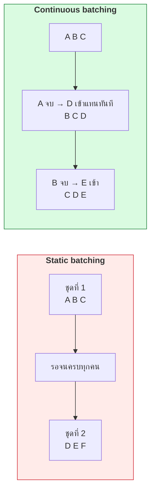
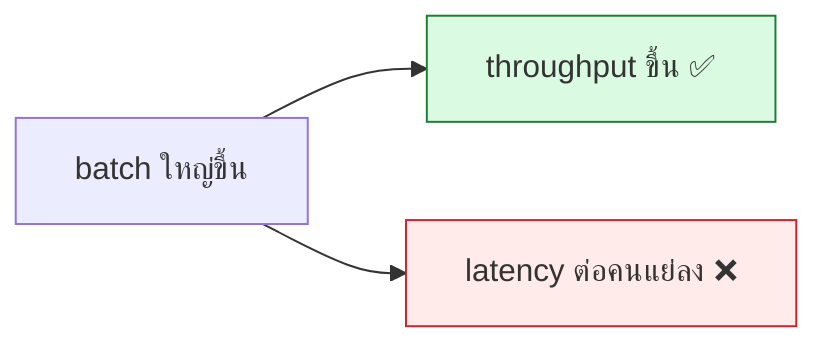
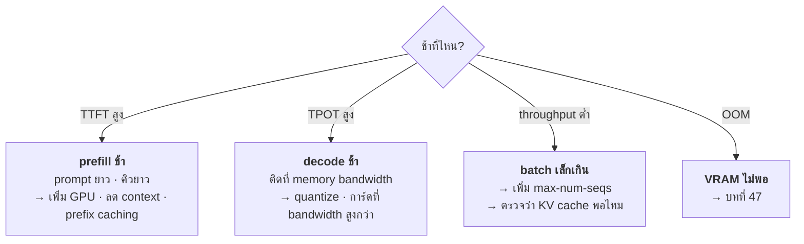

# บทที่ 48 · Serving LLM ให้เป็น API

> [บทที่ 47](47-gpu-memory-and-kv-cache.md) ตอบว่า "เสิร์ฟได้กี่คน" — บทนี้ตอบว่า **"ทำยังไงให้ได้เท่านั้นจริง"**
>
> และอธิบายว่าทำไม `model.generate()` ใน loop ถึงเปลือง GPU มหาศาล

lab ของบทนี้: [lab/gpu/batching_demo.py](../lab/gpu/batching_demo.py) — รันบน GPU คุณได้เลย

## 48.1 ปัญหาของการเสิร์ฟทีละ request {#s48-1}

โค้ดที่คนสาย data science เขียนตอนแรกมักหน้าตาแบบนี้:

```python
@app.post("/generate")
def generate(prompt: str):
    inputs = tokenizer(prompt, return_tensors="pt").to("cuda")
    out = model.generate(**inputs, max_new_tokens=256)   # ❌ ทีละคน
    return tokenizer.decode(out[0])
```

**มันทำงานได้ แต่ใช้ GPU ได้ไม่ถึง 5%**

รันดูเองว่าทำไม:

```bash
python3 lab/gpu/batching_demo.py
```

**ผลจริงบน RTX 3090:**

```
 batch     เวลา/รอบ      throughput   เทียบ batch=1
     1      0.31 ms         3180 seq/s          1.0×
     8      0.37 ms        21755 seq/s          6.8×
    32      0.36 ms        88572 seq/s         27.9×
   128      0.62 ms       205093 seq/s         64.5×
```

> ## batch 128 ให้ throughput 64 เท่า โดยใช้เวลาต่อรอบเพิ่มแค่ 2 เท่า
>
> **เพราะตอน batch เล็ก GPU ว่างเกือบทั้งใบ** — 82 SM × 128 core = 10,496 core
> แต่งานของ 1 sequence ใช้ไปไม่กี่เปอร์เซ็นต์
>
> การเสิร์ฟทีละคนคือการเผาการ์ดราคาแสนทิ้ง

## 48.2 Static batching และปัญหาของมัน {#s48-2}

ทางแก้แรกที่คนนึกออกคือ "รอสะสม request แล้วยิงพร้อมกัน"

```python
# static batching — รอให้ครบ 8 คน แล้วประมวลผลทีเดียว
batch = collect_requests(n=8, timeout=50)
outputs = model.generate(batch)     # ทุกคนต้องรอคนที่ช้าที่สุด
```

**สองปัญหาที่ทำให้มันไม่พอ:**

### ปัญหาที่ 1 — padding

sequence ในชุดเดียวกันต้องยาวเท่ากัน จึงต้อง pad ให้เท่าตัวที่ยาวสุด

```
ความยาวจริงรวม                     9,728 tokens
ยาวสุดในชุด                        4,096 tokens
ต้อง pad เป็น                     65,536 tokens
เสียเปล่า                         55,808 tokens  (85%)

เวลาเมื่อ pad                      30.84 ms
เวลาถ้าไม่ต้อง pad                  4.85 ms
ช้ากว่า                              6.4×
```

**เสียการคำนวณไป 85%** กับการคูณเลขศูนย์ — และในการเสิร์ฟจริง ความยาว
prompt ของผู้ใช้ต่างกันมากกว่านี้อีก

### ปัญหาที่ 2 — หัวขบวนรอท้ายขบวน

```mermaid
gantt
    title Static batching — ทุกคนรอคนที่ช้าที่สุด
    dateFormat X
    axisFormat %s
    section req A (10 tokens)
    ทำงาน  :0, 10
    รอเปล่า :crit, 10, 100
    section req B (30 tokens)
    ทำงาน  :0, 30
    รอเปล่า :crit, 30, 100
    section req C (100 tokens)
    ทำงาน  :0, 100
```



**req A เสร็จตั้งแต่ token ที่ 10 แต่ต้องรอถึง 100** — ทั้งช่องนั้นว่างเปล่า
และ request ใหม่ก็เข้ามาแทนไม่ได้จนกว่าทั้งชุดจะจบ

## 48.3 Continuous batching — ทางแก้ที่ใช้กันจริง {#s48-3}

แทนที่จะจัด batch เป็นชุด ๆ **จัดคิวใหม่ทุก ๆ token ที่สร้าง**



**request ที่เสร็จแล้วออกทันที และ request ใหม่เสียบเข้ามาแทนที่ในรอบถัดไป**
— GPU ไม่มีช่องว่าง

ผลลัพธ์: throughput สูงขึ้น **2-4 เท่า** เทียบกับ static batching ในโหลดจริง

## 48.4 PagedAttention — หัวใจของ vLLM {#s48-4}

ปัญหาที่เหลืออยู่คือ **KV cache กินหน่วยความจำแบบเสียเศษ**

```
วิธีเดิม: จองล่วงหน้าตาม max_length ให้แต่ละ request

request A: จอง 4096 tokens  แต่ใช้จริง 200  → เสีย 95%
request B: จอง 4096 tokens  แต่ใช้จริง 1500 → เสีย 63%
```

**PagedAttention ยืมแนวคิด virtual memory paging ของระบบปฏิบัติการมาใช้**
(หลักการเดียวกับที่คุณเจอใน[บทที่ 36.5](36-permissions-and-isolation.md#s36-5))

| | หน่วยความจำแบบเดิม | Paging |
|---|-------------------|--------|
| จองอย่างไร | block ใหญ่ต่อเนื่อง | **page เล็ก ๆ กระจายที่ไหนก็ได้** |
| เสียเศษ | เยอะ | น้อยมาก |
| แชร์ระหว่าง request | ไม่ได้ | **ได้** (prompt เดียวกันใช้ page ร่วมกัน) |

**ผลที่ได้จริง:**

- ใช้ VRAM ที่มีอยู่ได้คุ้มขึ้นมาก → เสิร์ฟได้มากกว่าที่คำนวณใน[บทที่ 47](47-gpu-memory-and-kv-cache.md)
- **prefix caching** — หลาย request ที่ขึ้นต้นด้วย system prompt เดียวกัน
  ใช้ KV cache ก้อนเดียวร่วมกัน (ประหยัดมากในงานจริงที่มี system prompt ยาว)

## 48.5 ใช้ vLLM จริง {#s48-5}

```bash
pip install vllm            # ใน venv (บทที่ 32.2)
```

```bash
# เปิดเป็น API server ที่เข้ากันได้กับ OpenAI API
python -m vllm.entrypoints.openai.api_server \
  --model meta-llama/Meta-Llama-3-8B-Instruct \
  --dtype bfloat16 \
  --max-model-len 4096 \
  --gpu-memory-utilization 0.90
```

**ยิงด้วย curl ได้เลย** — ทุกอย่างที่เรียนมาตั้งแต่[บทที่ 1](01-http-basics.md) ใช้ได้ทันที:

```bash
curl -s http://localhost:8000/v1/completions \
  -H 'Content-Type: application/json' \
  -d '{"model":"meta-llama/Meta-Llama-3-8B-Instruct",
       "prompt":"อธิบาย TCP handshake สั้น ๆ",
       "max_tokens":128}' | jq -r '.choices[0].text'

# streaming — ใช้ -N เหมือน SSE ในบทที่ 29.2
curl -N http://localhost:8000/v1/completions \
  -H 'Content-Type: application/json' \
  -d '{"model":"...","prompt":"...","max_tokens":128,"stream":true}'
```

> **vLLM พูด SSE** สำหรับ streaming — ความรู้[บทที่ 29](29-realtime-push-and-offline.md) ใช้ได้ตรง ๆ
> รวมถึงเรื่อง `proxy_buffering off` ถ้าวางหลัง nginx ([บทที่ 26.7](26-proxy-caching-cdn.md#s26-7))

## 48.6 พารามิเตอร์ที่ต้องตั้งให้ถูก {#s48-6}

| พารามิเตอร์ | ทำอะไร | ตั้งยังไง |
|-------------|--------|-----------|
| `--gpu-memory-utilization` | จองกี่ % ของ VRAM | **0.85-0.92** ไม่ใช่ 1.0 |
| `--max-model-len` | context สูงสุด | เท่าที่ต้องใช้จริง ([บทที่ 47](47-gpu-memory-and-kv-cache.md)) |
| `--max-num-seqs` | จำนวน sequence พร้อมกันสูงสุด | ปรับตามผลวัด |
| `--dtype` | ชนิดน้ำหนัก | `bfloat16` ถ้าการ์ดรองรับ |
| `--quantization` | quantize น้ำหนัก | `awq`, `gptq` เมื่อ VRAM ไม่พอ |
| `--kv-cache-dtype` | quantize KV cache | `fp8` ลด KV ครึ่งหนึ่ง |
| `--enable-prefix-caching` | แชร์ KV ของ prefix | เปิดถ้ามี system prompt ยาว |
| `--tensor-parallel-size` | ใช้กี่ GPU | [บทที่ 50](50-multi-gpu-and-networking.md) |

> ## ⚠️ `--gpu-memory-utilization 1.0` = OOM แน่นอน
>
> เพราะ **prefill peak** ([บทที่ 47.9](47-gpu-memory-and-kv-cache.md#s47-9)) ต้องการที่ว่างชั่วคราว
> ถ้าจองไว้เต็ม 100% พอเจอ prompt ยาวก็ระเบิด
>
> **เริ่มที่ 0.90 แล้วค่อยขยับ** และเผื่อไว้ถ้ามี process อื่นใช้การ์ดร่วมด้วย

**`--max-model-len` มีผลกับ throughput โดยตรง** — ตั้ง 32768 ทั้งที่ผู้ใช้จริง
ใช้แค่ 2048 แปลว่าคุณจอง KV cache เผื่อไว้เยอะเกินจนเสิร์ฟได้น้อยคน
(กลับไปดูเลขใน[บทที่ 47.7](47-gpu-memory-and-kv-cache.md#s47-7))

## 48.7 ทางเลือกอื่นนอกจาก vLLM {#s48-7}

| เครื่องมือ | จุดเด่น | เหมาะกับ |
|-----------|---------|----------|
| **vLLM** | throughput สูง, PagedAttention, ใช้ง่าย | ✅ ค่าเริ่มต้นที่ดี |
| **TensorRT-LLM** | เร็วที่สุดบนการ์ด NVIDIA | เมื่อรีดประสิทธิภาพสุดทาง |
| **SGLang** | เร็ว, เก่งเรื่อง structured output | งานที่มี schema |
| **Triton Inference Server** | เสิร์ฟหลายโมเดล หลาย framework | ระบบใหญ่ที่มีหลายโมเดล |
| **llama.cpp / Ollama** | รันบน CPU ได้, ง่ายมาก | เครื่องเล็ก, prototype |
| **TGI** (HuggingFace) | เข้ากับ ecosystem HF | ทีมที่ใช้ HF อยู่แล้ว |

**เริ่มที่ vLLM** — ถ้ายังไม่พอค่อยไป TensorRT-LLM ซึ่งเร็วกว่าแต่ตั้งค่ายากกว่ามาก

## 48.8 วัดผลให้ถูกตัว {#s48-8}

**อย่าวัดแค่ "เร็วไหม"** — LLM serving มีสองตัวชี้วัดที่ขัดแย้งกัน

| ตัวชี้วัด | ความหมาย | ใครสนใจ |
|-----------|----------|---------|
| **TTFT** (Time To First Token) | รอกี่วินาทีกว่าจะเห็นตัวอักษรแรก | **ผู้ใช้** |
| **TPOT** (Time Per Output Token) | สร้าง token ถัดไปเร็วแค่ไหน | ผู้ใช้ (ความลื่น) |
| **Throughput** | token/วินาที รวมทุกคน | **คนจ่ายค่าไฟ** |
| **Goodput** | throughput ที่ยัง**ผ่าน SLA** | ← ตัวที่ควรใช้จริง |



> **นี่คือ trade-off เดียวกับ[บทที่ 12.5](12-api-design-practices.md#s12-5)** (rate limit / batching) และ[บทที่ 33.9](33-concurrency-and-async.md#s33-9)
> (backpressure) — ระบบที่รับงานเยอะเกินจะช้าลงจนทุกคนแย่

**วัดด้วยเครื่องมือของ vLLM:**

```bash
python -m vllm.entrypoints.openai.api_server --model ... &

# benchmark ที่มากับ vllm
python benchmarks/benchmark_serving.py \
  --backend vllm --model ... \
  --num-prompts 200 --request-rate 10
```

หรือใช้เครื่องมือ HTTP ทั่วไปที่คุณรู้จักแล้ว:

```bash
# วัด TTFT ด้วย curl (บทที่ 2.4)
curl -s -o /dev/null -w 'ttft=%{time_starttransfer} total=%{time_total}\n' \
  -N http://localhost:8000/v1/completions -d '{...,"stream":true}'
```

## 48.9 อะไรคือคอขวดกันแน่ {#s48-9}



**ข้อสำคัญที่คนสาย data science มักไม่รู้: decode ติดที่ memory bandwidth ไม่ใช่ compute**

ตอนสร้าง token ทีละตัว GPU ต้องอ่านน้ำหนักโมเดลทั้งก้อนจาก VRAM ทุกครั้ง —
Llama-3 8B ที่ bf16 = 15 GiB ต่อ 1 token

```
RTX 3090 มี bandwidth ~936 GB/s
936 GB/s ÷ 15 GiB = ~62 token/s เป็นเพดานทางทฤษฎีของ batch=1
```

**นี่คือเหตุผลที่ batching สำคัญมาก** — อ่านน้ำหนักครั้งเดียวใช้ได้กับทั้ง batch
ทำให้ token/s รวมสูงขึ้นมากโดยไม่ต้องอ่านซ้ำ

## 48.10 เอา API มาต่อกับความรู้เดิม {#s48-10}

vLLM ให้ HTTP API มา — **ทุกบทในส่วนที่ 1-3 ใช้ได้ทันที**

| เรื่อง | ทำอะไรกับ LLM API |
|--------|-------------------|
| Authentication (บท 9-11) | API key / Bearer token หน้า vLLM |
| Rate limiting (บท 12.5) | **สำคัญมาก** — 1 request กิน GPU นานกว่า API ปกติมาก |
| Timeout (บท 2.5) | ตั้งให้ยาวพอ generation ยาว ๆ |
| SSE (บท 29.2) | streaming response |
| Reverse proxy (บท 26.7) | `proxy_buffering off` ไม่งั้น streaming ค้าง |
| Observability (บท 28) | [บทที่ 51](51-gpu-observability-and-cost.md) |
| Idempotency (บท 12.4) | request ที่ retry แล้วเสีย GPU ซ้ำ |

```nginx
location /v1/ {
    proxy_pass http://127.0.0.1:8000;
    proxy_buffering off;              # ← จำเป็นสำหรับ streaming
    proxy_read_timeout 600s;          # generation ยาวได้
}
```

> **rate limit ของ LLM ต้องคิดต่างจาก API ทั่วไป** — จำกัดตาม
> **token ไม่ใช่จำนวน request** เพราะ request เดียวที่ขอ 4000 token
> กิน GPU มากกว่า request ที่ขอ 50 token ถึง 80 เท่า

## 48.11 Checklist ก่อนขึ้น production {#s48-11}

- [ ] วัด TTFT / TPOT / throughput ที่โหลดจริง ไม่ใช่แค่ยิงทีละครั้ง
- [ ] `--gpu-memory-utilization` ≤ 0.92 และทดสอบด้วย prompt ยาวสุดที่รับ
- [ ] `--max-model-len` ตั้งเท่าที่ใช้จริง ไม่ใช่ค่าสูงสุดของโมเดล
- [ ] เปิด prefix caching ถ้ามี system prompt ยาว
- [ ] rate limit **ตาม token** ไม่ใช่ตาม request
- [ ] timeout ทั้งฝั่ง client, proxy, และ server สอดคล้องกัน
- [ ] `proxy_buffering off` ถ้ามี nginx คั่น
- [ ] มี health check แยก live/ready ([บทที่ 28.7](28-observability-and-deployment.md#s28-7))
- [ ] วัด **cost per 1M tokens** ไม่ใช่แค่ utilization ([บทที่ 51](51-gpu-observability-and-cost.md))
- [ ] ทดสอบว่าเมื่อคิวเต็ม ระบบตอบ 429 ไม่ใช่ค้าง ([บทที่ 33.9](33-concurrency-and-async.md#s33-9))

## แบบฝึกหัด

1. รัน `python3 lab/gpu/batching_demo.py` — batch เท่าไรที่ throughput เริ่มอิ่มตัว
   บนการ์ดคุณ
2. ดูผลการทดลองที่ 2 — ถ้าความยาว prompt ของผู้ใช้จริงต่างกันมาก
   static batching เสียเปล่ากี่เปอร์เซ็นต์
3. เทียบผลการทดลองที่ 3 กับตาราง dtype ใน[บทที่ 46.8](46-gpu-101.md#s46-8) — ตรงกันไหม
4. ติดตั้ง vLLM แล้วเสิร์ฟโมเดลเล็ก (เช่น `Qwen/Qwen2.5-1.5B-Instruct`)
   บน RTX 3090 แล้วยิงด้วย `curl`
5. ลอง `--gpu-memory-utilization` ที่ 0.5, 0.9, 0.99 แล้วดูว่า
   `--max-num-seqs` ที่รับได้ต่างกันแค่ไหน
6. ยิงด้วย `stream: true` แล้ววัด TTFT ด้วย `curl -w '%{time_starttransfer}'`
7. ยิงพร้อมกัน 20 request ด้วย `asyncio` ([บทที่ 33](33-concurrency-and-async.md)) แล้วเทียบ throughput
   กับการยิงทีละอัน
8. คำนวณเพดาน token/s จาก memory bandwidth ของการ์ดคุณ ([ข้อ 48.9](#s48-9))
   แล้วเทียบกับที่วัดได้จริงตอน batch=1

***
[⬅ VRAM และ KV cache](47-gpu-memory-and-kv-cache.md) · [สารบัญ](../README.md) · [แบ่ง GPU ให้หลายคนใช้ ➡](49-gpu-on-containers-and-k8s.md)
