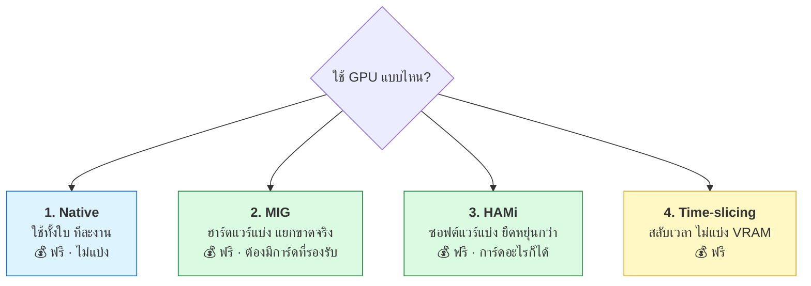
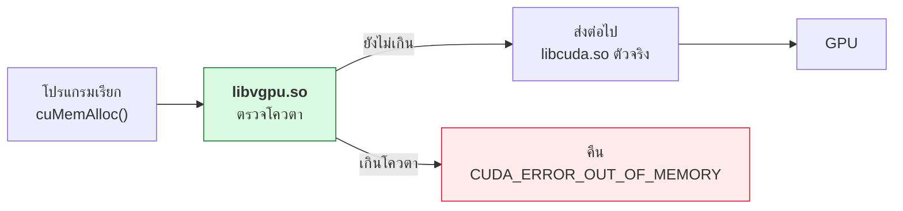
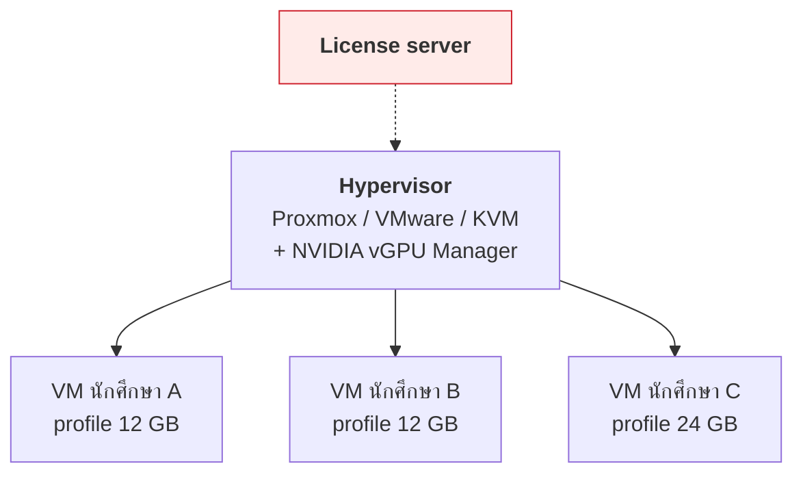
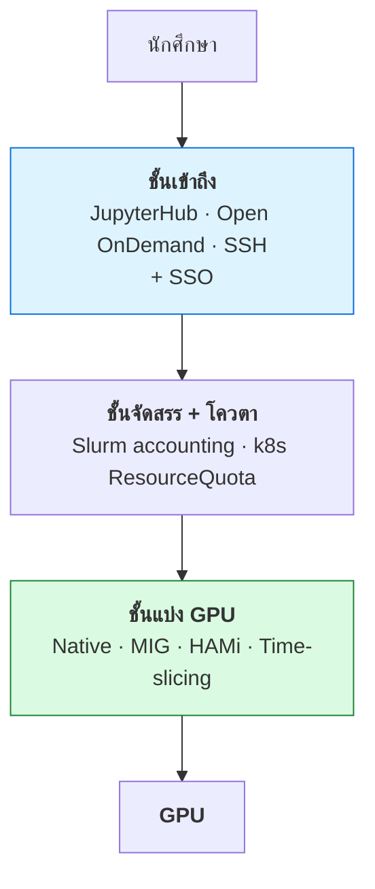

# บทที่ 49 · แบ่ง GPU ให้หลายคนใช้

> คำถามที่ต้องตอบ: **"มี GPU 1 ใบ ให้คน 20 คนใช้ ทำยังไง"**
>
> คำตอบมี 4 โหมดหลัก ต้นทุนต่างกันตั้งแต่ฟรีจนถึงหลักล้าน
> และ **บางโหมดเลือกได้เฉพาะตอนซื้อการ์ด — แก้ทีหลังไม่ได้**

## 49.1 ก่อนอื่น — คุณต้องการ "แบ่ง" จริงหรือเปล่า

คนส่วนใหญ่ที่บอกว่าอยากแบ่ง GPU จริง ๆ แล้วเจอปัญหาข้อใดข้อหนึ่งใน 3 ข้อนี้

| ปัญหาจริง | ทางแก้ที่ถูก | ต้องแบ่ง GPU ไหม |
|-----------|--------------|------------------|
| "คนหนึ่งรัน notebook ค้างไว้ คนอื่นใช้ไม่ได้" | **คิวงาน + time limit** (Slurm) | ❌ ไม่ต้อง |
| "อยากให้ทุกคนได้ VRAM เท่า ๆ กัน ห้ามแย่ง" | **MIG หรือ HAMi** | ✅ ต้อง |
| "งานเล็กหลายงาน ใช้ GPU ไม่คุ้ม" | **Time-slicing / MPS** | ⚠️ แบ่งแบบอ่อน |

> **ข้อแรกพบบ่อยที่สุด และแก้ได้ฟรี** — อย่าเพิ่งจ่ายค่า license ไปแก้ปัญหา
> ที่ scheduler แก้ได้

## 49.2 สี่โหมดการใช้ GPU



**เทียบให้เห็นความต่างที่สำคัญที่สุด:**

| | Native | MIG | HAMi | Time-slicing |
|---|--------|-----|------|--------------|
| **แยก VRAM** | — | ✅ ฮาร์ดแวร์ | ✅ ซอฟต์แวร์ | ❌ **แย่งกัน** |
| **แยก compute** | — | ✅ แยก SM จริง | ⚠️ จำกัดเป็น % | ❌ สลับกันใช้ |
| ความละเอียดในการแบ่ง | — | ตาม profile ที่กำหนด | **กำหนดเป็น GB ได้อิสระ** | — |
| ต้องมีการ์ดพิเศษ | ❌ | ✅ **เฉพาะบางรุ่น** | ❌ ใช้ได้ทุกรุ่น | ❌ |
| ต้องมี Kubernetes | ❌ | ❌ | ✅ **ต้องมี** | ✅ |
| license | ฟรี | ฟรี | ฟรี | ฟรี |
| ความแข็งของ isolation | — | ⭐⭐⭐⭐⭐ | ⭐⭐⭐ | ⭐ |

> **ทั้งสี่โหมดไม่ต้องจ่ายค่า license เลยสักบาท** — ค่า license จะเข้ามาเมื่อ
> ต้องการ **vGPU** ซึ่งเป็นคนละเรื่อง (ดูข้อ 49.10)

## 49.3 โควตาถูกบังคับที่ "ชั้นไหน"

ก่อนลงรายละเอียดแต่ละโหมด ต้องเข้าใจแผนที่ก่อน — เพราะทั้งสี่โหมดต่างกันที่
**จุดที่ไปดักเท่านั้น** ไม่ได้ต่างกันที่แนวคิด

### เส้นทางจริงจากโปรแกรมถึงชิป

```
PyTorch
   |  cudaMalloc()                        <- CUDA Runtime API
   v
libcudart.so.12                           (มากับ pip wheel)
   |  cuMemAlloc()                        <- CUDA Driver API
   v
libcuda.so.580.173.02                     (มากับ driver)
   |                                      <== HAMi ดักตรงนี้
   |  ioctl(fd, ...)
   v
/dev/nvidia0                              <== cgroup ตรวจตอน open() เท่านั้น
   |
   v
kernel driver                             <== time-slicing สลับ context ตรงนี้
   |
   v
ตัวชิป GPU                                <== MIG แบ่งตรงนี้ (ฮาร์ดแวร์)
```

ตรวจของจริงบนเครื่องคุณได้:

```bash
python3 -c "
import torch, os
torch.zeros(1, device='cuda')
print(open(f'/proc/{os.getpid()}/maps').read())
" | grep -o '/[^ ]*libcud[^ ]*\|/[^ ]*libnvidia[^ ]*' | sort -u
```

```
/usr/lib/x86_64-linux-gnu/libcuda.so.580.173.02
/usr/lib/x86_64-linux-gnu/libnvidia-ml.so.580.173.02
/home/.../nvidia/cuda_runtime/lib/libcudart.so.12
```

> ## จุดที่คนสับสนบ่อย — `cudaMalloc` กับ `cuMemAlloc` ไม่ใช่ตัวเดียวกัน
>
> | Library | API | ฟังก์ชัน | มาจากไหน |
> |---|---|---|---|
> | `libcudart.so` | **Runtime API** | `cudaMalloc()` | pip wheel ของ PyTorch |
> | `libcuda.so` | **Driver API** | `cuMemAlloc()` | ตัว driver ของ host |
>
> **HAMi ดักที่ Driver API ชั้นล่าง** เพราะดักที่เดียวได้ครบทุก framework —
> PyTorch, TensorFlow, JAX, CUDA C ล้วนลงมาที่ `libcuda.so` หมด

### ทำไม cgroup ถึงจำกัด VRAM ไม่ได้

นี่เป็นคำถามที่ถูกถามบ่อย และคำตอบอยู่ที่ **cgroup ไม่ใช่ชั้นที่ทุก call วิ่งผ่าน**

```
open("/dev/nvidia0")  --->  cgroup ตรวจตรงนี้ ครั้งเดียว
                                   |
                             ผ่านแล้วได้ file descriptor
                                   v
ioctl(fd)   ioctl(fd)   ioctl(fd)   ...   <- ไม่ผ่าน cgroup อีกเลย
```

**เป็นยามหน้าประตู ไม่ใช่ยามเดินตาม** — ตรวจตอนเข้าครั้งเดียว เข้าไปแล้วขอ VRAM
เท่าไรก็ได้ ดังนั้น cgroup ตัดได้แค่ *"เปิดการ์ดใบไหนได้บ้าง"*
ไม่มีทางตัด *"ใช้ได้เท่าไร"*

นี่คือกลไกที่ `docker run --gpus '"device=0"'` ใช้ — และเป็นเหตุผลที่มันแบ่ง
VRAM ให้ไม่ได้

### vGPU อยู่นอกกองนี้ทั้งกอง

vGPU ไม่ได้แทรกเป็นชั้นในกองข้างบน แต่ **โคลนกองทั้งกองเข้าไปไว้ใน VM**

```
+-- Guest VM (นักศึกษาได้เครื่องทั้งเครื่อง) ----------+
|   PyTorch -> libcudart -> libcuda (guest driver)      |
|   -> /dev/nvidia0 -> guest kernel driver              |
+-------------------------+-----------------------------+
                          |  PCI จำลอง (VFIO / mdev)
========================= | ========== ขอบเขตของเครื่อง
+-------------------------v-----------------------------+
|  Host — Proxmox / VMware / KVM                        |
|    NVIDIA vGPU Manager   <== บังคับโควตา + ตรวจ license|
|    -> host kernel driver -> ตัวชิป GPU                |
+-------------------------------------------------------+
```

**ทุกอย่างในกรอบบนคือเส้นทางปกติทั้งหมด** — vGPU ไม่ได้แก้อะไรในนั้นเลย
มันแค่ยกไปไว้ใน VM แล้วสร้างชั้นบังคับใหม่ข้างล่าง

### แกนที่อธิบายว่าทำไมบางอันฟรีบางอันไม่ฟรี

เรียงตามว่า **ตัวบังคับอยู่ใกล้ผู้ใช้แค่ไหน**

| กลไก | ตัวบังคับอยู่ที่ไหน | ผู้ใช้แตะได้ไหม | ราคา |
|------|---------------------|-----------------|------|
| **HAMi** | ใน process ของผู้ใช้เอง (`LD_PRELOAD`) | ⚠️ ในทางทฤษฎีได้ | ฟรี |
| **cgroup** | kernel ของเครื่องเดียวกัน | ❌ | ฟรี |
| **Time-slicing** | driver ของเครื่องเดียวกัน | ❌ | ฟรี |
| **MIG** | ในซิลิกอนของชิป | ❌ | ฟรี |
| **vGPU** | host คนละเครื่องกับผู้ใช้ | ❌ | 💰 **ต้องจ่าย** |

> **HAMi เอายามไปวางไว้ในบ้านของผู้เช่า ส่วน vGPU วางยามไว้นอกรั้ว**
>
> ผู้เช่าที่ตั้งใจโกงเอายามในบ้านตัวเองออกได้ (`unset LD_PRELOAD`)
> แต่ทำอะไรยามนอกรั้วไม่ได้ เพราะอยู่คนละเครื่อง
>
> **ในห้องแล็บนักศึกษา ข้อนี้ไม่ใช่ปัญหา** — คนที่ถอด `LD_PRELOAD`
> เพื่อแย่ง VRAM เพื่อนคือเรื่องวินัย ไม่ใช่เรื่องเทคนิค และเห็นได้จาก log
>
> จะเป็นปัญหาก็ต่อเมื่อผู้ใช้เป็นคนนอกที่ไม่รู้จักกัน เช่นเปิดให้บุคคลภายนอกเช่า

## 49.4 ⚠️ MIG มีเฉพาะบางการ์ด — ตรวจก่อนซื้อ

**MIG ติดมากับ driver อยู่แล้ว ไม่ต้องซื้อ license เพิ่ม** — ขอแค่ฮาร์ดแวร์รองรับ

| การ์ด | MIG | หมายเหตุ |
|-------|-----|----------|
| GeForce (RTX 3090, 4090) | ❌ | ไม่รองรับทั้ง MIG และ vGPU |
| RTX A6000 (Ampere) | ❌ | สาย workstation ไม่มี MIG |
| RTX 6000 Ada | ❌ | เหมือนกัน |
| **A100 / A30 / H100 / H200** | ✅ | สาย datacenter |
| **RTX PRO 6000 Blackwell** | ✅ | สาย RTX PRO รุ่นแรกที่มี MIG |

### ⚠️ "รองรับ MIG" ไม่ได้แปลว่า "แบ่งได้ละเอียด"

profile ที่มีจริงบน **RTX PRO 6000 Blackwell (96 GB)**:

| Profile | VRAM | ได้กี่ instance |
|---------|------|----------------|
| `1g.24gb` | 24 GB | สูงสุด **4** |
| `2g.48gb` | 48 GB | สูงสุด 2 |
| `4g.96gb` | 96 GB | 1 |

**สไลซ์เล็กที่สุดคือ 24 GB และตัดได้มากสุด 4 ชิ้น**
เทียบกับ A100 80GB ที่ตัดได้ `1g.10gb` ถึง **7 ชิ้น** — รุ่นนี้หยาบกว่ามาก

ผลที่ตามมาโดยตรงกับโจทย์ห้องเรียน:

| อยากได้ | MIG ทำได้ไหม |
|---------|--------------|
| นักศึกษาคนละ 8 GB | ❌ ขั้นต่ำ 24 GB |
| 10 คนใช้พร้อมกัน | ❌ สูงสุด 4 คน |
| แบ่งไม่เท่ากัน | ⚠️ มีคอมโบเดียวที่ใช้ได้จริง — `48 + 24 + 24` |

> **นี่คือจุดที่ทำให้หลายที่เลือก HAMi ทั้งที่การ์ดรองรับ MIG** — ไม่ใช่เพราะ
> MIG ไม่ดี แต่เพราะความละเอียดไม่พอกับโจทย์ที่มีคนใช้พร้อมกันเยอะ

**ตรวจของจริงเสมอ อย่าเชื่อตาราง:**

```bash
nvidia-smi -q | grep -iA2 'MIG Mode'
```

```
    MIG Mode
        Current                                        : N/A     ← ไม่รองรับ
        Pending                                        : N/A
```

`N/A` = แบ่งแบบ MIG ไม่ได้ · `Enabled/Disabled` = รองรับ

```bash
nvidia-smi mig -lgip        # ดูว่าแบ่งได้กี่ profile ขนาดไหนบ้าง
```

> ## เหตุผลที่ต้องตรวจก่อนตัดสินใจซื้อ
>
> ถ้าการ์ดรองรับ MIG → ได้ **hard isolation ฟรี** บน bare metal
> ถ้าไม่รองรับ → เหลือทางเลือก **HAMi** (ฟรี แต่ isolation อ่อนกว่า)
> หรือ **vGPU** (แข็ง แต่ต้องซื้อ license + hypervisor)

## 49.5 พื้นฐานที่ต้องมีก่อน — NVIDIA Container Toolkit

ไม่ว่าจะเลือกโหมดไหน ถ้าใช้ container ต้องมีตัวนี้

```bash
curl -fsSL https://nvidia.github.io/libnvidia-container/gpgkey \
  | sudo gpg --dearmor -o /usr/share/keyrings/nvidia-container-toolkit-keyring.gpg
sudo apt update && sudo apt install -y nvidia-container-toolkit
sudo nvidia-ctk runtime configure --runtime=docker
sudo systemctl restart docker
```

**ทดสอบว่าใช้ได้:**

```bash
docker run --rm --gpus all nvidia/cuda:12.4.0-base-ubuntu22.04 \
  nvidia-smi --query-gpu=name,memory.total --format=csv
```

```
name, memory.total [MiB]
NVIDIA GeForce RTX 3090, 24576 MiB
```

**สิ่งที่ toolkit ทำ** คือ mount driver, device node (`/dev/nvidia*`) และ library
เข้าไปใน container — **container ใช้ driver ของ host เสมอ ไม่มี driver ของตัวเอง**

> ⚠️ เวอร์ชัน CUDA ใน container ต้องไม่ใหม่กว่าที่ driver ของ host รองรับ
> (บทที่ 46.3) — อัปเดต driver บน host กระทบทุก container พร้อมกัน

## 49.6 โหมดที่ 1 — Native

ใช้ GPU ทั้งใบ ทีละงาน ไม่แบ่งอะไรเลย

```bash
docker run --gpus all ...                    # ทุกใบ
docker run --gpus '"device=0,1"' ...         # ใบที่ 0 กับ 1
CUDA_VISIBLE_DEVICES=0 python train.py       # เลือกด้วย env var
```

**ฟังดูเรียบง่ายเกินไป แต่เป็นคำตอบที่ถูกบ่อยกว่าที่คิด**

| เหมาะกับ | ไม่เหมาะกับ |
|----------|-------------|
| งาน training ที่ต้องใช้ VRAM ทั้งใบ | หลายคนต้องใช้พร้อมกันจริง ๆ |
| งานที่ต้องการ performance สูงสุด | GPU ว่างบ่อย |
| **จับคู่กับ Slurm ให้จัดคิว** ← ที่นิยมที่สุดในมหาวิทยาลัย | |

**Native + Slurm คือสูตรมาตรฐานของ HPC** — ไม่แบ่ง GPU แต่จัดคิวให้ใช้ทีละคน
พร้อม time limit บังคับ (ดูข้อ 49.12)

## 49.7 โหมดที่ 2 — MIG (ฮาร์ดแวร์แบ่ง)

GPU ถูกแบ่งเป็นหลาย instance ที่ **แยก SM, แยก VRAM, แยกเส้นทาง L2 cache**
ในระดับฮาร์ดแวร์จริง

```bash
# 1. เปิด MIG mode (ต้องไม่มี process ใช้ GPU อยู่)
sudo nvidia-smi -i 0 -mig 1

# 2. ดู profile ที่แบ่งได้
sudo nvidia-smi mig -lgip

# 3. สร้าง instance
sudo nvidia-smi mig -cgi 1g.24gb,1g.24gb,1g.24gb,1g.24gb -C

# 4. ดูผล — ได้ MIG device พร้อม UUID
nvidia-smi -L

# 5. ให้ container ใช้เฉพาะ instance เดียว
docker run --rm --gpus '"device=MIG-<uuid>"' nvidia/cuda:12.4.0-base nvidia-smi
```

ชื่อ profile อ่านแบบนี้: `1g.24gb` = 1 GPU slice + VRAM 24 GB
(ตัวอย่างข้างบนคือแบ่ง RTX PRO 6000 เป็น 4 ส่วนเท่ากัน)

**ข้อดี:** isolation แข็งที่สุดที่ทำได้โดยไม่ต้องจ่าย license — process ใน
instance หนึ่งพัง ไม่กระทบ instance อื่นเลย

**ข้อจำกัดที่ต้องรู้ก่อนวางแผน:**

| ข้อจำกัด | ผลกระทบจริง |
|----------|-------------|
| **แบ่งได้เฉพาะขนาดที่ profile กำหนด** | อยากได้ 5 GB แต่ profile มีแค่ 12/24/48 → ทำไม่ได้ |
| เปลี่ยน profile ต้องหยุดงานทั้งหมด | ปรับสัดส่วนกลางเทอมไม่ได้ |
| **1 process ใช้ได้ 1 instance** | งานที่ต้องการ GPU เต็มใบต้องปิด MIG ก่อน |
| มีเฉพาะการ์ด datacenter/RTX PRO | ตัดสินตอนซื้อ |

> **ข้อ 3 สำคัญกับห้องแล็บมาก** — ถ้านักศึกษาบางคนต้อง fine-tune โมเดลใหญ่
> ที่ใช้ VRAM ทั้งใบ MIG จะขวางทาง ต้องวางแผนว่าจะสลับโหมดอย่างไร

## 49.8 โหมดที่ 3 — HAMi (ซอฟต์แวร์แบ่ง)

**[HAMi](https://github.com/Project-HAMi/HAMi)** (Heterogeneous AI Computing
Virtualization Middleware) เป็นโครงการโอเพนซอร์สระดับ **CNCF Incubating**
ที่แบ่ง GPU ด้วยซอฟต์แวร์บน Kubernetes

> **ระดับ Incubating หมายความว่าอะไร** — CNCF มี 3 ขั้น Sandbox → Incubating →
> Graduated การขึ้นชั้น Incubating ต้องผ่าน security audit และพิสูจน์ว่ามีการใช้งาน
> จริงใน production หลายองค์กร
>
> ปัจจุบันมีผู้ใช้ **70+ องค์กร** รวมถึง LinkedIn, SAP, Huawei, Baidu AI Cloud
> และรองรับ 13 ยี่ห้อ ไม่ใช่แค่ NVIDIA (AMD, AWS Neuron, Huawei Ascend, ...)
>
> **นี่เป็นข้อมูลที่ควรใช้ตอนประเมินความเสี่ยง** — ถ้าจะทำเอง คุณไม่ได้พึ่ง
> โครงการที่คนเดียวดูแลอยู่

**มันแก้ข้อจำกัดใหญ่ที่สุดของ MIG — ความยืดหยุ่น**

```yaml
apiVersion: v1
kind: Pod
metadata:
  name: student-01
spec:
  containers:
    - name: jupyter
      image: jupyter/tensorflow-notebook
      resources:
        limits:
          nvidia.com/gpu: 1              # ขอ GPU 1 "ใบ"
          nvidia.com/gpumem: 8000        # แต่ใช้ VRAM ได้แค่ 8000 MiB
          nvidia.com/gpucores: 30        # และใช้ compute ได้ 30%
```

**กำหนดเป็นตัวเลขอิสระได้** — 3 GB, 5 GB, 8 GB ก็ได้ ไม่ต้องตามตาราง profile

### มันทำงานอย่างไร — 4 จังหวะ

```
① คุณเขียน pod spec ขอ nvidia.com/gpumem: 8000
        |
② HAMi scheduler เลือกว่าลงเครื่องไหน การ์ดใบไหน
        |    (บวกโควตาทุก pod บนใบนั้น ต้องไม่เกิน VRAM จริง)
        v
③ HAMi device plugin ยัด libvgpu.so เข้า container
        |    + ตั้ง LD_PRELOAD ให้ชี้ไปที่มัน
        |    + บอกมันว่าโควตาเท่าไร
        v
④ ตอนรัน — libvgpu.so ดักทุกการเรียก CUDA
```

**หัวใจอยู่ที่จังหวะ ③** PyTorch ไม่ได้คุยกับ GPU ตรง ๆ มันเรียกฟังก์ชันใน
`libcuda.so` (ข้อ 49.3) ส่วน `LD_PRELOAD` คือกลไกของ Linux ที่สั่งว่า
**"โหลด library นี้ก่อนเพื่อน"** ถ้ามีฟังก์ชันชื่อซ้ำกับของจริง ตัวมันจะถูกเรียกแทน



**VRAM กับ compute ใช้กลไกคนละแบบ** — ต่างกันมากและควรแยกให้ออก

| | ดักฟังก์ชันอะไร | บังคับยังไง | แข็งแค่ไหน |
|---|---|---|---|
| **VRAM** | `cuMemAlloc` / `cuMemFree` | นับยอด เกินแล้วคืน OOM | ✅ **hard limit** |
| **VRAM (รายงาน)** | `cuMemGetInfo` | โกหกว่าการ์ดมีแค่เท่าโควตา | — |
| **compute** | `cuLaunchKernel` | วัด % แล้วหน่วงการส่ง kernel | ⚠️ **คุมค่าเฉลี่ย** |

แถวที่สองสำคัญกว่าที่คิด — ทำให้ `torch.cuda.mem_get_info()` เห็น 8 GB
**PyTorch จึงเชื่อว่าการ์ดใบนี้มี 8 GB จริง ๆ** และปรับกลยุทธ์ cache ตามนั้น

> **NVML เป็นอีกเส้นที่ต้องดักแยก** — `nvidia-smi` ไม่ได้ใช้ `libcuda.so`
> แต่ใช้ `libnvidia-ml.so` ถ้าดักแค่เส้นเดียว ตัวเลขที่ผู้ใช้เห็นจะไม่ตรงกับ
> ที่บังคับจริง

### ลองของจริง — LD_PRELOAD ใน 20 บรรทัด

กลไกนี้ฟังดูเป็นเวทมนตร์ แต่เขียนเองได้ และ**รันได้แม้บนเครื่องที่ไม่มี GPU**

```bash
cd lab/gpu/ldpreload_quota && make demo
```

```
=== รันปกติ ===
ขอครั้งที่ 1 (25 MB) → สำเร็จ
...
ขอครั้งที่ 8 (25 MB) → สำเร็จ

=== รันโดยมี shim ดักไว้ ===
ขอครั้งที่ 1 (25 MB) → สำเร็จ
ขอครั้งที่ 2 (25 MB) → สำเร็จ
ขอครั้งที่ 3 (25 MB) → สำเร็จ
ขอครั้งที่ 4 (25 MB) → สำเร็จ      ← ครบ 100 MB พอดี
  [shim] ปฏิเสธ 25 MB (ใช้ไป 100/100 MB)
ขอครั้งที่ 5 (25 MB) → OOM
```

**โปรแกรมเดิม ไม่ได้แก้โค้ดสักบรรทัด** — ใส่ `LD_PRELOAD` เข้าไปอย่างเดียว
จาก 8 ครั้งสำเร็จหมด กลายเป็นตายที่ครั้งที่ 5

ตัวอย่างนี้ดัก `malloc` เพราะไม่ต้องมี GPU — **HAMi ทำแบบเดียวกันเป๊ะ
แค่เปลี่ยนเป็น `cuMemAlloc`**

### เทียบกับ MIG ตรง ๆ

| | MIG | HAMi |
|---|-----|------|
| บังคับด้วยอะไร | **ฮาร์ดแวร์** | **ซอฟต์แวร์** (ดัก CUDA API) |
| ความละเอียด | ตาม profile เท่านั้น | **กำหนดเป็น MiB ได้อิสระ** |
| ใช้กับการ์ดอะไรได้ | เฉพาะรุ่นที่รองรับ | **ทุกรุ่น รวม GeForce** |
| ต้องมี Kubernetes | ไม่ต้อง | **ต้องมี** |
| fault isolation | ✅ แยกขาด | ⚠️ อยู่ใน context เดียวกัน |
| ป้องกันคนตั้งใจเลี่ยงได้ไหม | ✅ ได้ | ⚠️ **เป็นซอฟต์แวร์ เลี่ยงได้ในทางทฤษฎี** |
| performance overhead | ~0 | เล็กน้อย |

### ความต่างที่ลึกกว่าขนาด — "จองขาด" กับ "จองเพดาน"

ความละเอียดเป็นแค่อาการ **สาเหตุจริงคือปรัชญาการจองที่ต่างกัน**

```
MIG   = จองขาด    นักศึกษาได้ 24 GB ตลอดเวลาที่ instance เปิดอยู่
                  แม้ตอนนั่งพิมพ์โค้ด นั่งอ่าน error นั่งกินข้าว
                  -> VRAM ก้อนนั้นตายอยู่ตรงนั้น ไม่มีใครใช้ได้

HAMi  = จองเพดาน  นักศึกษาได้ "ไม่เกิน" 8 GB
                  VRAM ถูกใช้จริงเฉพาะตอนที่โปรแกรมจองจริง
```

**ในห้องแล็บ นักศึกษาใช้ GPU จริงราว 10-20% ของเวลาที่เปิดค้างไว้**
ที่เหลือคือเขียนโค้ด อ่าน error รอ debug

MIG ทำให้ 80% ของการ์ดถูกจองไว้เฉย ๆ — ต้นทุนที่ไม่ปรากฏในสเปก แต่เห็นตอนใช้จริง

> ⚠️ **แต่ข้อได้เปรียบนี้จะหายไปถ้าห้าม oversubscribe** — ถ้า scheduler บังคับว่า
> ผลรวมโควตาทุกคนต้องไม่เกิน VRAM จริง ก็กลายเป็นการจองขาดเหมือน MIG
> เพียงแต่ละเอียดกว่า
>
> **เป็นคำถามที่ต้องถามผู้ขายให้ชัด** — และไม่มีคำตอบที่ถูกเสมอ
> ยอมให้จองเกิน = ใช้การ์ดคุ้มขึ้น แต่มีโอกาสชนกันตอนทุกคนบังเอิญใช้พร้อมกัน

> ## เลือกอย่างไรระหว่าง MIG กับ HAMi
>
> **MIG** — เมื่อต้องการ isolation ที่แข็งจริง และการ์ดรองรับ
> เหมาะกับ **inference ใน production** ที่ต้องการ performance คงที่แน่นอน
>
> **HAMi** — เมื่อต้องการ **ความยืดหยุ่น** หรือการ์ดไม่รองรับ MIG
> เหมาะกับ **ห้องแล็บ/งานวิจัย** ที่ความต้องการแต่ละคนไม่เท่ากันและเปลี่ยนบ่อย
>
> **HAMi เป็นซอฟต์แวร์** จึงเหมาะกับสภาพแวดล้อมที่ผู้ใช้ไม่ได้เป็นศัตรูกัน —
> นักศึกษาในภาควิชาเดียวกันใช้ได้สบาย แต่ถ้าเป็น multi-tenant ที่ไม่ไว้ใจกันเลย
> MIG ปลอดภัยกว่า

**ข้อจำกัดที่ต้องยอมรับ:** ต้องมี Kubernetes ซึ่งเป็นชั้นความซับซ้อนเพิ่ม
ถ้าภาควิชาไม่มีใครดูแล k8s ได้ นี่คือต้นทุนที่ต้องนับ

## 49.9 โหมดที่ 4 — Time-slicing

GPU สลับกันทำงานให้แต่ละ process เหมือน CPU สลับ process (บทที่ 35.3)

> ## ⚠️ ก่อนอื่น — GPU มัน time-slice อยู่แล้วโดยธรรมชาติ
>
> จุดที่คนเข้าใจผิดบ่อยคือคิดว่า time-slicing เป็นฟีเจอร์ที่ต้อง "เปิด"
>
> **ไม่ใช่** — เวลามีสอง process ใช้ GPU ใบเดียวกัน driver ก็สลับ context ให้อยู่แล้ว
> ลองได้เลยโดยไม่ต้องตั้งอะไร:
>
> ```bash
> python train_a.py &
> python train_b.py &
> ```
>
> ดังนั้น `replicas: 4` ข้างล่าง **ไม่ได้ทำอะไรกับ GPU เลย** — มันแค่บอก
> Kubernetes ว่าวาง pod บน node นี้ได้ 4 ตัวแทนที่จะเป็น 1
> **เป็นใบอนุญาตให้เข้าห้อง ไม่ใช่กำแพงกั้นในห้อง**

```yaml
# k8s device plugin config
version: v1
sharing:
  timeSlicing:
    resources:
      - name: nvidia.com/gpu
        replicas: 4          # 1 GPU ประกาศเป็น 4 "ใบ"
```

> ## ⚠️ Time-slicing ไม่แบ่ง VRAM
>
> ทั้ง 4 process เห็น VRAM ก้อนเดียวกันทั้ง 24 GB
> **ถ้าคนหนึ่งจองหมด คนอื่น OOM ทันที**
>
> มันแค่แชร์ **เวลาประมวลผล** ไม่ได้ให้ isolation

**เหมาะกับ:** งาน inference เล็ก ๆ ที่รู้แน่ว่าใช้ VRAM น้อยและคุมได้
**ไม่เหมาะกับ:** ห้องแล็บนักศึกษาที่ไม่รู้ว่าใครจะรันอะไร

### HAMi ไม่ใช่ "ทางเลือกแทน" time-slicing — มันสร้างทับ

หัวข้อ 49.8 กับ 49.9 วางเรียงกันเหมือนเป็นทางเลือกที่เท่ากัน **ซึ่งทำให้เข้าใจผิด**

```
                   time-slicing            HAMi
                   ------------            ----
scheduler ปล่อยเข้า     ✅ (replicas)        ✅
                            |                  |
cuMemAlloc(20 GB)      ผ่านฉลุย          <- ดักไว้ -> OOM
                            |                  |
ยิง kernel รัว ๆ        ยิงได้เต็มที่       <- หน่วงตามโควตา
                            |                  |
driver สลับ context         ✅                ✅   <- เหมือนกัน
```

**บรรทัดล่างสุดเหมือนกันทั้งคู่** — HAMi ก็พึ่ง time-slicing ของ driver
ในการแบ่งเวลาประมวลผลเหมือนกัน สิ่งที่มันเพิ่มคือ **สองด่านข้างบน**

ผลต่างที่เห็นจริงเมื่อนักศึกษาเผลอตั้ง `--batch-size` ใหญ่เกิน:

| | Time-slicing | HAMi |
|---|---|---|
| เขาจอง VRAM 40 GB | ✅ **สำเร็จ** | ❌ OOM ที่โควตาตัวเอง |
| เพื่อนอีก 11 คน | 💀 **OOM ตามกันหมด** | 😀 ไม่รู้สึกอะไร |
| ใครเจ็บ | **คนที่ไม่ผิด** | **คนที่ทำ** |

**นี่คือเหตุผลทั้งหมดที่ห้องแล็บควรใช้ HAMi ไม่ใช่ time-slicing เปล่า ๆ**

## 49.10 นอกเหนือจากสี่โหมด — MPS และ vGPU

### MPS (Multi-Process Service)

ให้หลาย process รัน kernel บน GPU **พร้อมกันจริง** (ไม่ใช่สลับกัน)

```bash
export CUDA_MPS_PIPE_DIRECTORY=/tmp/nvidia-mps
nvidia-cuda-mps-control -d
export CUDA_MPS_ACTIVE_THREAD_PERCENTAGE=25    # จำกัด % compute
```

**ยังไม่แบ่ง VRAM เหมือนกัน** และ process หนึ่งพังอาจกระทบตัวอื่น —
เหมาะกับงาน production ที่คุมได้ ไม่ใช่ multi-tenant

### vGPU — ตัวเดียวที่ต้องจ่าย license

virtualize GPU ให้ **VM** แต่ละตัวเห็นเป็น GPU ของตัวเอง



**สิ่งที่ vGPU ให้ที่ MIG/HAMi ให้ไม่ได้:** นักศึกษาได้ **VM เต็มรูปแบบ**
ลง OS เอง พังแล้ว reset ได้ และ live migration ข้ามเครื่องได้

**ต้องมีครบ 3 อย่าง:** การ์ดที่รองรับ + hypervisor + license

> **vGPU มี 2 แบบที่คิดเงินต่างกัน**
> — **vWS (Virtual Workstation)** สำหรับงานกราฟิก เช่น CAD/SolidWorks
> — **vCS / vApp** สำหรับงาน compute
>
> ถ้างานคือ AI/compute ล้วน ๆ **ไม่ต้องซื้อ license สายกราฟิก**

## 49.11 ต้องจ่าย NVIDIA AI Enterprise เมื่อไร

คำถามนี้ทำให้หลายที่จ่ายเงินเกินความจำเป็น เพราะผู้ขายมักเสนอ
**NVIDIA AI Enterprise (NVAIE)** พ่วงมากับการ์ด

### กฎข้อเดียวที่ต้องจำ

```
bare metal + container  (MIG / HAMi / time-slicing)  ->  ไม่ต้องมี license
VM + vGPU                                            ->  ต้องมี NVAIE
```

**เอกสารของ NVIDIA เองระบุว่า license ถูกบังคับตอน deploy vGPU ให้ VM:**

> *"The NVIDIA AI Enterprise license is enforced through software when you
> deploy NVIDIA vGPU for Compute VMs" — software enforces one license per
> vGPU assigned to a VM*

คำสำคัญคือ **VMs** — การบังคับเกิดที่ชั้น hypervisor เท่านั้น ตรงกับแผนที่ใน
ข้อ 49.3 ที่ vGPU เป็นกลไกเดียวที่อยู่คนละเครื่องกับผู้ใช้

ส่วน [คู่มือ MIG](https://docs.nvidia.com/datacenter/tesla/mig-user-guide/deployment-considerations.html)
ระบุแค่ข้อกำหนดของ driver กับ OS — **ไม่มีการพูดถึง license หรือค่าธรรมเนียมใด ๆ**
MIG มากับ driver ปกติ

### vCS ถูกยุบเข้า NVAIE แล้ว

เดิม vGPU สายคำนวณขายเป็น **vCS (Virtual Compute Server)** แยกต่างหาก
ปัจจุบัน [NVIDIA ระบุว่า](https://docs.nvidia.com/ai-enterprise/release-7/latest/infra-software/vgpu.html)
vGPU for Compute **licensed ผ่าน NVAIE ทางเดียว**

ถ้าเจอเอกสารเก่าที่พูดถึง vCS แยก — นั่นคือข้อมูลที่ล้าสมัยแล้ว

### สิ่งที่ NVAIE ยังกั้นอยู่แม้บน bare metal

**license ไม่ได้กั้นแค่ vGPU** — ยังกั้นของอีก 2 อย่างที่ไม่เกี่ยวกับการแบ่ง GPU

| ได้จาก NVAIE | จำเป็นไหมถ้าไม่มี |
|---|---|
| **vGPU for Compute guest driver** | จำเป็น ถ้าจะใช้ VM |
| **NGC container ที่ถูก gate ไว้** (NIM, enterprise framework) | ไม่จำเป็น — ใช้ vLLM/PyTorch จาก PyPI ได้ |
| **enterprise support ที่มี SLA** | แล้วแต่นโยบาย |

**CUDA, PyTorch, vLLM, container ทั่วไป ใช้ได้ปกติโดยไม่ต้องมี license**

### ⚠️ Blackwell ไม่แถม NVAIE

การ์ดบางรุ่นแถม NVAIE มากับ serial number อยู่แล้ว — H100 PCIe/NVL และ
H200 NVL แถมมา 5 ปี **แต่การ์ดตระกูล Blackwell ไม่แถม**

**ถามผู้ขายให้ชัดว่า SKU ที่เสนอมาแถม NVAIE ด้วยไหม** ถ้าแถมก็ไม่ต้องคิดเรื่องนี้เลย

> ## คำถามที่ควรถามผู้ขายเรื่อง license
>
> - [ ] ระบบที่เสนอรันบน **bare metal + container** หรือ **VM + vGPU**
> - [ ] ถ้า bare metal — ยืนยันเป็นลายลักษณ์อักษรว่า**ไม่ต้องมี NVAIE**
> - [ ] SKU ที่เสนอ **แถม NVAIE มาด้วยไหม** กี่ปี
> - [ ] ถ้าอนาคตอยากใช้ NIM หรือ NGC container ต้องซื้อเพิ่มไหม

## 49.12 ชั้นที่แยกต่างหาก — Scheduler

**Scheduler ไม่ใช่วิธีแบ่ง GPU แต่เป็นวิธีจัดคิวว่าใครได้ใช้เมื่อไร**
และมันแก้ปัญหาข้อแรกในตาราง 49.1 ได้ฟรี

```bash
srun --gres=gpu:1 --time=02:00:00 python train.py
sbatch --gres=gpu:1 --time=04:00:00 --mem=32G train.sh
squeue
```

**Slurm accounting — จำกัดชั่วโมงต่อคนได้ในตัว:**

```bash
# ให้แต่ละกลุ่มใช้ได้ไม่เกิน 100 ชั่วโมง GPU ต่อเดือน
sacctmgr modify account cs101 set GrpTRESMins=gres/gpu=6000

# ดูว่าใครใช้ไปเท่าไร
sreport cluster AccountUtilizationByUser start=2026-08-01 end=now -t Hours --tres=gres/gpu
```

> ## 🔴 กับดักที่ทำให้สองคำสั่งข้างบนไม่ทำงาน
>
> **Slurm ไม่ได้เก็บสถิติ GPU มาให้ตั้งแต่แรก** ค่าเริ่มต้นของ
> `AccountingStorageTRES` คือ:
>
> ```
> cpu,mem,energy,node,billing,fs/disk,vmem,pages
> ```
>
> **ไม่มี `gres/gpu`** — บนคลัสเตอร์ที่ GPU เป็นทรัพยากรหายากที่สุด
> เรากลับเก็บทุกอย่างยกเว้นตัวที่สำคัญที่สุด
>
> อาการที่จะเจอ:
>
> | คำสั่ง | ผลที่ได้ |
> |---|---|
> | `sreport --tres=gres/gpu` | `fatal: No valid TRES given` |
> | `sacctmgr ... GrpTRESMins=gres/gpu=6000` | **รับคำสั่งเงียบ ๆ แต่ไม่บังคับอะไรเลย** |
>
> แถวที่สองอันตรายกว่า — **คุณจะคิดว่าตั้งโควตาแล้ว ทั้งที่ไม่มีผล**
>
> แก้ที่ `slurm.conf`:
>
> ```
> AccountingStorageTRES=gres/gpu
> ```
>
> Slurm จะ**ต่อท้ายรายการเดิม** ไม่ได้แทนที่ ผลจริงที่ได้บนคลัสเตอร์ RTX 5090:
>
> ```
> cpu,mem,energy,node,billing,fs/disk,vmem,pages,gres/gpu,gres/gpumem,gres/gpuutil
> ```
>
> มันเติม `gpumem` กับ `gpuutil` ให้เองด้วย — ทำให้ดูย้อนหลังได้ว่า
> **ใครขอ GPU ไปแล้วใช้จริงกี่เปอร์เซ็นต์**
>
> ⚠️ **มีผลกับ job ที่รันหลังจากนี้เท่านั้น ย้อนหลังไม่ได้** — ยิ่งตั้งช้า
> ยิ่งเสียข้อมูลไปเปล่า ๆ

### ลำดับการติดตั้ง accounting ที่ห้ามสลับ

`sacctmgr` **อ่าน `slurm.conf` ไม่ใช่ `slurmdbd.conf`** เพื่อดูว่าใช้ plugin ไหน

```
1. MariaDB + database
2. slurmdbd.conf → start slurmdbd
3. slurm.conf: AccountingStorageType=accounting_storage/slurmdbd → restart
4. sacctmgr add cluster / account / user      ← ต้องหลังข้อ 3
5. AccountingStorageEnforce=associations      ← ต้องหลังข้อ 4
```

ถ้าทำข้อ 4 ก่อนข้อ 3 จะได้:

```
You are not running a supported accounting_storage plugin
```

และถ้าเปิดข้อ 5 ทั้งที่ user ยังไม่มี association **คนนั้นจะ submit job
ไม่ได้เลย** (`Invalid account or account/partition combination specified`)
— เป็นวิธีที่แอดมินล็อกทีมตัวเองออกจากคลัสเตอร์บ่อยที่สุด

| ได้ | ไม่ได้ |
|-----|--------|
| ✅ คิวยุติธรรม (fair share) | ❌ หลายคนใช้ GPU เดียวกันพร้อมกันไม่ได้ |
| ✅ **time limit บังคับ** งานค้างถูกฆ่าเอง | ❌ ต้องเรียนรู้คำสั่ง (ถ้าไม่มี Web UI) |
| ✅ **โควตาชั่วโมงต่อคน/กลุ่ม** | |
| ✅ รายงานการใช้งานย้อนหลัง | |

**อยากได้ Web UI** → [Open OnDemand](https://openondemand.org/) ครอบ Slurm
ให้ใช้ผ่านเว็บได้ รวมถึงเปิด Jupyter จากในนั้น

## 49.13 ตารางตัดสินใจ

| สถานการณ์ | ควรใช้ |
|-----------|--------|
| นักศึกษารันงาน ใช้ทีละคนได้ | **Native + Slurm** |
| ต้องการ VRAM คงที่ · การ์ดรองรับ MIG · เน้น production | **MIG** |
| ต้องการ VRAM คงที่ · แบ่งละเอียด · ความต้องการเปลี่ยนบ่อย | **HAMi** |
| การ์ดไม่รองรับ MIG · ไม่อยากจ่าย license | **HAMi** หรือ **Slurm** |
| นักศึกษาต้องมี VM ของตัวเอง ลง OS เอง | **vGPU** (ต้องจ่าย) |
| inference หลายงานเล็กที่คุมได้ | **Time-slicing** หรือ **MPS** |
| training ที่ต้องใช้ GPU เต็มใบ | **Native — ห้ามแบ่ง** |

## 49.14 คำถามก่อนตัดสินใจซื้อ

**ถามตัวเองก่อน:**

- [ ] นักศึกษาจะทำอะไร — เรียน/inference (VRAM น้อย) หรือ fine-tune (VRAM เยอะ)
- [ ] ใช้พร้อมกันจริงกี่คน หรือแค่ไม่อยากให้ค้างคิว
- [ ] **มีใครดูแลระบบต่อระยะยาว** ← คำถามที่สำคัญที่สุด
- [ ] ถ้าใช้ Slurm ซึ่งฟรี ปัญหาที่มีอยู่หายไปไหม
- [ ] มีคนดูแล Kubernetes ได้ไหม (ถ้าจะใช้ HAMi)

**ถามผู้ขายให้ได้คำตอบเป็นลายลักษณ์อักษร:**

- [ ] **SKU นี้รองรับ MIG ไหม** — ขอ demo `nvidia-smi mig -lgip` บนของจริง
- [ ] ซอฟต์แวร์ที่เสนอ ทำอะไรที่ HAMi/Slurm/JupyterHub ทำไม่ได้บ้าง
- [ ] license คิดต่อ GPU / ต่อ user / ต่อปี — ต้นทุนปีที่ 2-3 เท่าไร
- [ ] **ถ้าผู้ขายหยุดให้บริการ ระบบยังใช้ต่อได้ไหม**
- [ ] ผูกกับ license server ออนไลน์หรือเปล่า ถ้าเน็ตล่มเกิดอะไรขึ้น

> **ใช้ [lab/gpu/vram_calc.py](../lab/gpu/vram_calc.py) หาคำตอบข้อแรก** — ถ้ารู้ว่า
> นักศึกษาใช้โมเดลอะไร คำนวณได้เลยว่าต้องการ VRAM ต่อคนเท่าไร
> แล้วย้อนกลับมาดูว่าควรแบ่งกี่ส่วน หรือไม่ควรแบ่งเลย

## 49.15 ประกอบเป็นระบบจริง

ไม่ว่าเลือกโหมดไหน ยังต้องมีชั้น "ให้คนเข้าใช้" อยู่ดี



**สินค้าเชิงพาณิชย์มักขายชั้นบนสุด** (Web UI + SSO + dashboard โควตา)
ที่ครอบชั้นล่างซึ่งเป็นโอเพนซอร์สอยู่แล้ว — อาจคุ้มถ้าไม่มีคนดูแล
แต่ควรรู้ว่ากำลังจ่ายค่าอะไร

| ชั้น | ตัวเลือกฟรี |
|------|-------------|
| เข้าถึง + SSO | JupyterHub (OAuth/LDAP), Open OnDemand, code-server |
| จัดคิว + จัดสรร | **Slurm**, [KAI Scheduler](https://github.com/NVIDIA/KAI-Scheduler), Volcano, Kueue |
| โควตาชั่วโมง (training) | **Slurm accounting**, k8s ResourceQuota |
| **โควตา token/ค่าใช้จ่าย (inference)** | **[LiteLLM](https://github.com/BerriAI/litellm)** — budget ต่อ user/team + virtual key |
| แบ่ง GPU | Native, MIG, **HAMi**, time-slicing, MPS |
| monitoring + usage | DCGM Exporter + Prometheus + Grafana (บทที่ 51) |
| แพลตฟอร์มสำเร็จ | Kubeflow, Open Data Hub, Konduktor |

> **ทุกข้อในตารางนี้เป็นของฟรีที่มหาวิทยาลัยทั่วโลกใช้จริง** — คำถามจึงไม่ใช่
> "ทำได้ไหม" แต่คือ **"ใครจะประกอบและดูแลมัน"** ซึ่งเป็นคำถามเรื่องคน ไม่ใช่เรื่องเทคนิค

### ชั้นโควตามีสองแบบ ที่คนมักสับสน

**HAMi บังคับ "ขณะนี้" แต่ไม่รู้เรื่อง "สะสม"**

```
HAMi          →  คุณถือ VRAM เกิน 8 GB ไม่ได้           (ขณะนี้)
HAMi ทำไม่ได้  →  เดือนนี้คุณใช้ไป 40 GPU-hour แล้วนะ    (สะสม)
```

**HAMi ไม่มีแนวคิดเรื่อง "ผู้ใช้" ด้วยซ้ำ** — มันเห็นแค่ pod กับ namespace
การผูก "นักศึกษา 6412345" เข้ากับโควตาจึงต้องมีชั้นบนมาทำ

| ต้องการอะไร | ใช้อะไรฟรี |
|-------------|------------|
| จำกัด VRAM ขณะรัน | **HAMi** |
| จำกัด GPU-hour ต่อเดือน (notebook/training) | **Slurm accounting** — แต่อยู่คนละโลกกับ k8s |
| จำกัด token/ค่าใช้จ่ายต่อคน (inference) | **LiteLLM** — มี budget, spend tracking, รีเซ็ตตามรอบ |

> ⚠️ **ช่องว่างที่ยังเหลือจริง ๆ** คือ *โควตา GPU-hour สะสมบน Kubernetes*
> — Slurm ทำได้ดีแต่ไม่ได้อยู่บน k8s ส่วน k8s `ResourceQuota` จำกัดได้แค่
> "ถือพร้อมกันเท่าไร" ไม่ใช่ "ใช้สะสมไปเท่าไร"
>
> **ถ้าจะจ่ายเงินให้ใคร นี่คือจุดที่คุ้มที่สุด** เพราะเป็นชิ้นเดียวที่ยังต้องประกอบเอง

### หลักฐานว่าชั้นล่างเป็นของสามัญจริง

**NVIDIA ซื้อ Run:ai แล้ว open source แกน scheduler ออกมาเป็น KAI Scheduler**
(Apache 2.0, มีนาคม 2025) — ซึ่งรองรับการขอ GPU เป็นเศษส่วน เช่น `0.25`, `0.5`

```
Run:ai (เชิงพาณิชย์)  =  KAI Scheduler (ฟรี)
                        + Web UI
                        + multi-cluster management
                        + SLA support
```

**โครงสร้างเดียวกับที่เห็นในตลาดทั่วไป** — ตัวแบ่ง/จัดคิว GPU เป็นของสามัญ
ส่วนที่ขายได้คือชั้นบน

> **ใช้ข้อมูลนี้ตอนประเมินข้อเสนอ** — ถ้าแม้แต่ NVIDIA ยังยอมแจกแกน scheduler
> ฟรี แปลว่ามูลค่าไม่ได้อยู่ตรงนั้น คำถามที่ควรถามผู้ขายจึงเป็น
> **"ส่วนที่คุณเขียนเองคืออะไร"** ไม่ใช่ "แบ่ง GPU ได้ละเอียดแค่ไหน"

## แบบฝึกหัด

1. ตรวจว่าการ์ดที่คุณเข้าถึงได้รองรับ MIG ไหม:
   ```bash
   nvidia-smi -q | grep -iA2 'MIG Mode'
   ```
2. ติดตั้ง NVIDIA Container Toolkit แล้วทดสอบว่า container เห็น GPU
3. รัน 2 container พร้อมกันด้วย `--gpus all` แล้วให้ตัวหนึ่งจอง VRAM เยอะ ๆ
   — อีกตัว OOM ไหม (นี่คือสิ่งที่ Native/time-slicing เป็น)
4. เทียบ `--gpus '"device=0"'` กับ `CUDA_VISIBLE_DEVICES=0` — ต่างกันอย่างไร
5. ถ้ามีการ์ดที่รองรับ MIG ลองสร้าง instance แล้ววัดว่า process ใน instance หนึ่ง
   กระทบอีก instance ไหม
6. อ่านเอกสาร HAMi แล้วเขียน Pod spec ที่จำกัด VRAM 4 GB และ compute 25%
7. ใช้ `vram_calc.py` คำนวณว่าการ์ด 96 GB แบ่ง 4 ส่วนกับ 8 ส่วน
   รันโมเดลอะไรได้ต่างกัน แล้วสรุปว่าควรแบ่งกี่ส่วน
8. เขียนตารางเปรียบเทียบต้นทุน 3 ปีของ 3 ทางเลือกสำหรับเคสของคุณเอง:
   Slurm ฟรี / HAMi ฟรี / ซอฟต์แวร์เชิงพาณิชย์
9. ตอบคำถามในข้อ 49.14 ทั้งหมดสำหรับโครงการที่คุณกำลังตัดสินใจอยู่
10. รัน `make demo` ใน [lab/gpu/ldpreload_quota/](../lab/gpu/ldpreload_quota/)
    แล้วแก้ `QUOTA` เป็น 200 MB — ตายที่ครั้งไหน ทำไม
11. เพิ่มการดัก `free()` ใน `quota.c` ให้หักยอดคืน แล้วทดสอบว่าจอง/คืนสลับกันได้
12. ตอบตัวเอง: ถ้านักศึกษาสั่ง `unset LD_PRELOAD` จะเกิดอะไรขึ้น —
    และทำไมข้อนี้ถึงไม่ใช่ปัญหาในห้องเรียน แต่เป็นปัญหาถ้าเปิดให้คนนอกเช่า
13. เปิดเว็บผู้ขายที่ภาควิชากำลังพิจารณา แล้วจับคู่ทุกฟีเจอร์ที่เขาโฆษณา
    กับตารางของฟรีในข้อ 49.15 — เหลือกี่ข้อที่ไม่มีของฟรีทดแทน

***
[⬅ Serving LLM ให้เป็น API](48-serving-llm.md) · [สารบัญ](../README.md) · [หลาย GPU และเครือข่ายระหว่างการ์ด ➡](50-multi-gpu-and-networking.md)
