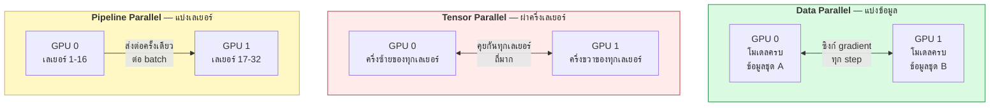
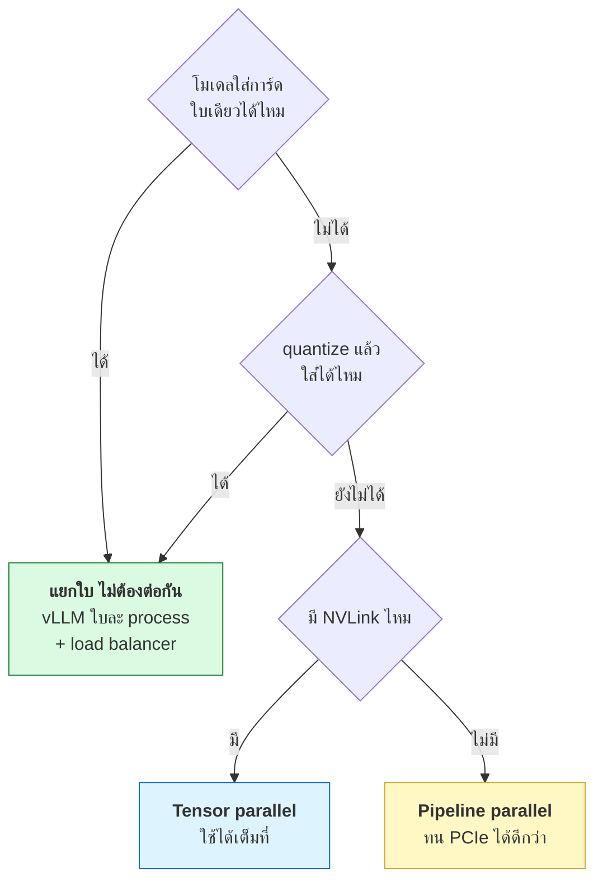

# บทที่ 50 · หลาย GPU และเครือข่ายระหว่างการ์ด

> [บทที่ 47](47-gpu-memory-and-kv-cache.md) บอกว่าโมเดลใหญ่เกิน VRAM ใบเดียว **บทนี้ตอบว่าแล้วยังไงต่อ**
>
> และคำตอบไม่ใช่ "ซื้อเพิ่มอีกใบ" เฉย ๆ — เพราะ **ทางเชื่อมระหว่างการ์ด
> กลายเป็นคอขวดใหม่** ซึ่งเป็นตัวเลขที่ต้องดูก่อนตัดสินใจซื้อ

## 50.1 ถามก่อน — ต้องใช้หลายใบจริงหรือเปล่า {#s50-1}

มีเหตุผลที่ถูกต้องอยู่ 3 ข้อ และแต่ละข้อนำไปสู่คำตอบคนละแบบ

| เหตุผล | ตัวอย่าง | วิธีที่ถูก |
|--------|---------|-----------|
| **โมเดลไม่พอใส่ใบเดียว** | Llama-3 70B fp16 = 140 GiB | **Tensor / Pipeline parallel** |
| **อยากเทรนให้เร็วขึ้น** | โมเดลพอใส่ แต่ข้อมูลเยอะ | **Data parallel** |
| **คนใช้เยอะ** | inference หลายร้อยคน | **หลาย replica แยกกัน — ไม่ต้องต่อกันเลย** |

> ## ข้อสามคือกรณีที่พบบ่อยที่สุด และง่ายที่สุด
>
> ถ้าโมเดลใส่การ์ดใบเดียวได้ **อย่าเอาการ์ดมาต่อกัน** — ให้รัน vLLM แยกใบละ
> process แล้ววาง load balancer ข้างหน้า
>
> ```
> ❌ 4 ใบต่อกันเป็นก้อนเดียว รับ 400 คน   ← ช้ากว่า เพราะเสียเวลาคุยกัน
> ✅ 4 ใบแยกกัน ใบละ 100 คน               ← เร็วกว่า ง่ายกว่า พังทีละใบ
> ```
>
> **การต่อ GPU เข้าด้วยกันมีต้นทุน** ทั้งความเร็วและความซับซ้อน
> ทำเมื่อจำเป็นเท่านั้น

## 50.2 สามวิธีแบ่งงานข้าม GPU {#s50-2}



**สิ่งที่ต่างกันจริง ๆ คือ "คุยกันบ่อยแค่ไหน"**

| วิธี | โมเดลอยู่ที่ไหน | คุยกันเมื่อไร | ต้องการทางเชื่อม |
|------|----------------|--------------|------------------|
| **Data parallel** | ครบทุกใบ | ท้าย step (ซิงก์ gradient) | ปานกลาง |
| **Tensor parallel** | ผ่าแบ่งกัน | **ทุกเลเยอร์ ทุก token** | 🔴 **สูงมาก** |
| **Pipeline parallel** | คนละช่วงเลเยอร์ | ส่งต่อจุดเดียว | 🟢 ต่ำ |

> **Tensor parallel คือตัวที่แพ้ทางเชื่อมช้าที่สุด** — เพราะต้องแลกข้อมูลกัน
> ทุกเลเยอร์ ถ้าการ์ดคุยกันช้า มันจะรอกันจนไม่คุ้มที่จะแบ่ง

## 50.3 NCCL — ตัวที่ทำให้การ์ดคุยกัน {#s50-3}

**NCCL** (NVIDIA Collective Communications Library, อ่านว่า "นิกเกิล")
คือ library ที่ PyTorch เรียกใช้เวลาต้องส่งข้อมูลข้าม GPU

ปฏิบัติการหลักที่ต้องรู้จัก:

| ปฏิบัติการ | ทำอะไร | ใช้ตอนไหน |
|-----------|--------|-----------|
| **all-reduce** | รวมค่าจากทุกใบ แล้วแจกผลกลับทุกใบ | ซิงก์ gradient (data parallel) |
| **all-gather** | เก็บชิ้นส่วนจากทุกใบมาต่อกัน | tensor parallel |
| broadcast | ใบหนึ่งส่งให้ทุกใบ | แจกน้ำหนักตอนเริ่ม |
| reduce-scatter | รวมแล้วแบ่งชิ้นให้แต่ละใบ | ZeRO / FSDP |

**all-reduce คือตัวที่กินเวลามากที่สุดในการเทรนแบบ data parallel**

```
เวลาต่อ step = เวลาคำนวณ + เวลา all-reduce
                              ↑
                    ถ้าตัวนี้โตกว่าตัวซ้าย = เพิ่มการ์ดแล้วไม่เร็วขึ้น
```

> ## กฎที่ควรจำ
>
> **การเพิ่ม GPU ไม่ได้ทำให้เร็วขึ้นเป็นเส้นตรงเสมอ** — ถึงจุดหนึ่งเวลาที่ใช้
> คุยกันจะโตเร็วกว่าเวลาที่ประหยัดได้จากการคำนวณขนาน
>
> นี่คือเหตุผลที่ต้องวัด ไม่ใช่คำนวณเอา ([ข้อ 50.8](#s50-8))

## 50.4 ทางเชื่อม — ตัวเลขที่ต้องเห็นก่อนซื้อ {#s50-4}

นี่คือตารางที่สำคัญที่สุดในบทนี้

| เส้นทาง | แบนด์วิดท์ (ทิศเดียว) | เทียบเป็นเท่า |
|---------|----------------------|--------------|
| **VRAM ในการ์ดตัวเอง** (RTX PRO 6000) | ~1,597 GB/s | **1×** (อ้างอิง) |
| **NVLink** (H100 SXM) | ~450 GB/s | ช้ากว่า 3.5× |
| **PCIe 5.0 x16** | ~64 GB/s | ช้ากว่า **25×** |
| **PCIe 4.0 x16** | ~32 GB/s | ช้ากว่า 50× |
| **InfiniBand NDR** (ข้ามเครื่อง) | ~50 GB/s | ช้ากว่า 32× |
| **Ethernet 10 Gb** | ~1.25 GB/s | ช้ากว่า **1,278×** |

```
      ในการ์ดตัวเอง  ████████████████████████████████  1597 GB/s
      NVLink         █████████                          450 GB/s
      PCIe 5.0       █▌                                  64 GB/s
      PCIe 4.0       ▊                                   32 GB/s
      Ethernet 10G   ·                                  1.25 GB/s
```

**ทุกครั้งที่ข้อมูลออกนอกการ์ด คุณจ่ายค่าปรับอย่างน้อย 25 เท่า**

นี่คือเหตุผลว่าทำไม "แบ่งงานให้คุยกันน้อยที่สุด" ถึงเป็นหลักการหลัก
และทำไม pipeline parallel ถึงทนทางเชื่อมช้าได้ดีกว่า tensor parallel

## 50.5 ดู topology ของเครื่องจริง {#s50-5}

```bash
nvidia-smi topo -m
```

บนเครื่องที่มีการ์ดใบเดียว:

```
        GPU0    CPU Affinity    NUMA Affinity   GPU NUMA ID
GPU0     X      0-23            0               N/A
```

บนเครื่องที่มีหลายใบ จะได้ตารางแบบนี้:

```
        GPU0    GPU1    GPU2    GPU3
GPU0     X      NV4     SYS     SYS
GPU1    NV4      X      SYS     SYS
GPU2    SYS     SYS      X      NV4
GPU3    SYS     SYS     NV4      X
```

**อ่านรหัสให้เป็น:**

| รหัส | แปลว่า | เร็วแค่ไหน |
|------|--------|-----------|
| `X` | ตัวมันเอง | — |
| `NV#` | ต่อผ่าน **NVLink** (# = จำนวนลิงก์) | 🟢 เร็วที่สุด |
| `PIX` | ผ่าน PCIe switch ตัวเดียว | 🟡 ดี |
| `NODE` | ข้าม PCIe host bridge ใน NUMA เดียวกัน | 🟠 ปานกลาง |
| `SYS` | **ข้าม CPU socket** (QPI/UPI) | 🔴 ช้าที่สุด |

> ## `SYS` คือสัญญาณอันตราย
>
> ถ้าการ์ดสองใบที่ต้องคุยกันบ่อยขึ้น `SYS` แปลว่าข้อมูลต้องวิ่งข้าม CPU socket
> ซึ่งช้ากว่า `PIX` หลายเท่า
>
> **แก้ได้โดยไม่ต้องซื้ออะไร** — จับคู่งานให้ใช้การ์ดที่อยู่ใกล้กัน:
>
> ```bash
> CUDA_VISIBLE_DEVICES=0,1 python train.py    # ใช้คู่ที่เป็น NV4
> ```

ตรวจ NVLink แยกต่างหาก:

```bash
nvidia-smi nvlink -s
```

```
GPU 0: NVIDIA GeForce RTX 3090 (UUID: GPU-b54c7e3c-...)
NVML: Unable to retrieve NVLink information as all links are inActive
```

ข้อความนี้แปลว่า **ไม่มี NVLink ที่ใช้งานอยู่** — ซึ่งเป็นเรื่องปกติถ้ามีการ์ดใบเดียว
หรือการ์ดรุ่นที่ไม่มี NVLink

## 50.6 ⚠️ RTX PRO 6000 Blackwell ไม่มี NVLink {#s50-6}

นี่เป็นข้อมูลที่ต้องรู้ก่อนวางแผนซื้อหลายใบ

[สเปกของ RTX PRO 6000 Blackwell Server Edition](https://lenovopress.lenovo.com/lp2263-thinksystem-nvidia-rtx-pro-6000-blackwell-server-edition-pcie-gen5-gpu)
ระบุตรง ๆ ว่า **"NVLink support: No"**

| | RTX PRO 6000 Blackwell |
|---|---|
| VRAM | 96 GB GDDR7 |
| แบนด์วิดท์ VRAM | ~1,597 GB/s |
| **ทางเชื่อมระหว่างการ์ด** | **PCIe 5.0 x16 เท่านั้น (~64 GB/s)** |
| MIG | สูงสุด 4 instance @ 24 GB |
| TDP | 600W (มีรุ่นจำกัด 450W) |

**ผลกระทบจริง:**

| อยากทำ | ทำได้ไหมบนหลายใบ |
|--------|------------------|
| รันหลายโมเดลแยกใบ (inference) | ✅ ไม่กระทบเลย — ไม่ต้องคุยกัน |
| Pipeline parallel | ✅ ใช้ได้ดี — คุยกันน้อย |
| Data parallel (เทรน) | ⚠️ ได้ แต่ scaling ไม่สวย |
| **Tensor parallel โมเดลใหญ่** | 🔴 **ช้าลงมาก** — คอขวดที่ PCIe |

> ## แต่ 96 GB ต่อใบทำให้ปัญหานี้เบาลงเยอะ
>
> เหตุผลหลักที่คนต้องใช้ tensor parallel คือโมเดลไม่พอใส่ใบเดียว
> — แต่ **96 GB ใส่ Llama-3 70B แบบ int8 ได้สบาย** (65 GiB)
>
> ```
> 70B fp16  = 140 GiB  → ต้อง 2 ใบ + tensor parallel  🔴
> 70B int8  =  65 GiB  → ใบเดียวพอ                     ✅
> 8B  fp16  =  16 GiB  → ใบเดียวเหลือเฟือ              ✅
> ```
>
> **ถ้าวางแผนให้ทุกโมเดลใส่ใบเดียวได้ การไม่มี NVLink แทบไม่มีผล**

**สิ่งที่ควรถามผู้ขาย:** เครื่องที่เสนอมาใส่การ์ดกี่ใบ และแต่ละใบได้ PCIe
กี่เลนจริง — บางเมนบอร์ดใส่ได้ 4 ใบ แต่แบ่งเลนเหลือ x8 ต่อใบ
ซึ่งลดแบนด์วิดท์ลงครึ่งหนึ่ง

## 50.7 ข้ามเครื่อง — InfiniBand และ RoCE {#s50-7}

เมื่อการ์ดอยู่คนละเครื่อง ต้องใช้เครือข่าย และ **Ethernet ธรรมดาไม่พอ**

| เทคโนโลยี | หลักการ | ใช้เมื่อไร |
|-----------|---------|-----------|
| **InfiniBand** | เครือข่ายเฉพาะทาง มี RDMA ในตัว | คลัสเตอร์เทรนขนาดใหญ่ |
| **RoCE** | RDMA บน Ethernet ธรรมดา | ถูกกว่า ตั้งค่ายากกว่า |
| Ethernet ปกติ (TCP) | ผ่าน kernel network stack | ❌ ช้าเกินสำหรับเทรน |

**RDMA** (Remote Direct Memory Access) คือหัวใจ — มันให้การ์ดเครื่องหนึ่ง
อ่าน/เขียนหน่วยความจำของอีกเครื่องได้**โดยไม่ผ่าน CPU และไม่ผ่าน kernel**

```
ปกติ:  GPU → CPU → kernel → NIC → เครือข่าย → NIC → kernel → CPU → GPU
RDMA:  GPU ─────────────→ NIC → เครือข่าย → NIC ─────────────→ GPU
```

ตัดขั้นตอนออกได้ทำให้ latency ต่ำลงมากและ CPU ว่างไปทำอย่างอื่น
(เทียบกับเส้นทางของ packet ปกติใน[บทที่ 31](31-tcpip-and-tcpdump.md))

> **สำหรับห้องแล็บมหาวิทยาลัยขนาดเครื่องเดียว เรื่องนี้ยังไม่จำเป็น**
> InfiniBand เริ่มคุ้มเมื่อมีหลายเครื่องที่ต้องเทรนโมเดลเดียวกันพร้อมกัน
> ซึ่งเป็นคนละสเกลกับการให้นักศึกษาใช้ GPU

## 50.8 อย่าเชื่อสเปก — วัดเอง {#s50-8}

ตัวเลขในสเปกคือค่าสูงสุดทางทฤษฎี ของจริงเสมอน้อยกว่า

**วัดแบนด์วิดท์ระหว่างการ์ดด้วย PyTorch:**

```python
import torch, time

def bench(src, dst, mb=512, rounds=20):
    x = torch.empty(mb * 1024 * 1024 // 4, dtype=torch.float32, device=f"cuda:{src}")
    y = torch.empty_like(x, device=f"cuda:{dst}")
    for _ in range(3):                      # warm-up
        y.copy_(x)
    torch.cuda.synchronize()

    t = time.perf_counter()
    for _ in range(rounds):
        y.copy_(x)
    torch.cuda.synchronize()
    dt = time.perf_counter() - t

    print(f"GPU{src} → GPU{dst}: {mb * rounds / dt / 1024:.1f} GB/s")

bench(0, 0)          # ในการ์ดตัวเอง — ควรได้หลักร้อย GB/s
bench(0, 1)          # ข้ามการ์ด — ตัวเลขนี้คือคำตอบจริง
```

**เทียบผลที่ได้กับตาราง[ข้อ 50.4](#s50-4)** ถ้าได้ราว 50 GB/s = PCIe 5.0 ทำงานเต็มที่
ถ้าได้ 20 GB/s ทั้งที่ควรเป็น Gen5 → ตรวจว่าเสียบเลนครบหรือเปล่า

```bash
nvidia-smi --query-gpu=pcie.link.gen.current,pcie.link.width.current --format=csv
```

```
pcie.link.gen.current, pcie.link.width.current
4, 16
```

> ## กับดักที่พบบ่อย
>
> **การ์ดลด PCIe gen ลงเองตอนว่าง (power saving)** — ค่าที่อ่านได้ตอนไม่มีงาน
> อาจต่ำกว่าตอนใช้งานจริง ให้วัดขณะมีโหลด
>
> และ **การ์ดที่เสียบสล็อตล่างของเมนบอร์ดผู้บริโภคมักได้แค่ x4** ทั้งที่สล็อต
> ยาว x16 — ตรวจด้วยคำสั่งข้างบนเสมอ

## 50.9 สรุปเป็นการตัดสินใจ {#s50-9}



| สถานการณ์ | ทำอะไร |
|-----------|--------|
| inference หลายคน โมเดลพอใส่ใบเดียว | **แยกใบ** — ง่ายสุด เร็วสุด |
| โมเดลใหญ่เกิน แต่ quantize ได้ | **quantize** ก่อนคิดเรื่องหลายใบ ([บทที่ 47.8](47-gpu-memory-and-kv-cache.md#s47-8)) |
| ต้อง tensor parallel แต่ไม่มี NVLink | ยอมรับว่าช้า หรือเปลี่ยนเป็น pipeline |
| เทรนข้ามหลายเครื่อง | ต้องมี InfiniBand/RoCE — Ethernet ไม่พอ |

## แบบฝึกหัด

1. รัน `nvidia-smi topo -m` บนเครื่องที่เข้าถึงได้ แล้วแปลผลว่าการ์ดคู่ไหน
   อยู่ใกล้กันที่สุด
2. ตรวจว่าการ์ดกำลังวิ่งที่ PCIe gen เท่าไร กี่เลน แล้วเทียบกับสเปกเมนบอร์ด
   ```bash
   nvidia-smi --query-gpu=pcie.link.gen.current,pcie.link.width.current --format=csv
   ```
3. ถ้ามีการ์ดสองใบ วัดแบนด์วิดท์ข้ามการ์ดด้วยสคริปต์ใน[ข้อ 50.8](#s50-8)
   แล้วเทียบกับค่าทฤษฎี — ได้กี่เปอร์เซ็นต์
4. คำนวณ: Llama-3 70B ที่ int8 (65 GiB) ใส่ RTX PRO 6000 (96 GB) ได้ไหม
   เหลือให้ KV cache เท่าไร ใช้ [vram_calc.py](../lab/gpu/vram_calc.py)
5. ตอบตัวเอง: ทำไม pipeline parallel ถึงทน PCIe ช้าได้ดีกว่า tensor parallel
6. อ่านสเปกการ์ดที่ภาควิชากำลังพิจารณา แล้วหาคำว่า NVLink — มีหรือไม่มี
   และมีผลกับแผนการใช้งานที่วางไว้อย่างไร
7. ถ้าต้องเสนอซื้อเครื่องที่ใส่การ์ด 4 ใบ ให้เขียนคำถามที่ต้องถามผู้ขาย
   เรื่องการแบ่งเลน PCIe

***
[⬅ แบ่ง GPU ให้หลายคนใช้](49-gpu-on-containers-and-k8s.md) · [สารบัญ](../README.md) · [Observability และต้นทุนของ GPU ➡](51-gpu-observability-and-cost.md)
