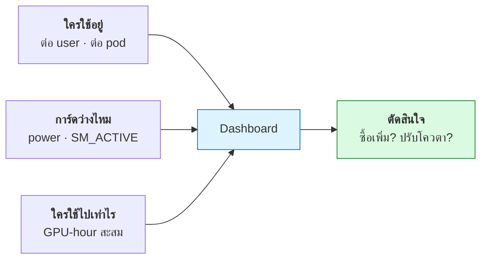

# บทที่ 51 · วัดผล GPU และคิดต้นทุนให้เป็น

> บทที่ 28 สอนวัด API ด้วย RED metrics **บทนี้ทำแบบเดียวกันกับ GPU**
>
> และเริ่มด้วยข่าวร้าย: **ตัวเลขที่ทุกคนดูเป็นอันดับแรก คือตัวที่หลอกที่สุด**

## 51.1 `utilization.gpu` ไม่ได้แปลว่าที่คุณคิด

ทุกคนเปิด `nvidia-smi` แล้วดูเลข `GPU-Util` แล้วสรุปว่า
"100% = ใช้การ์ดเต็มที่แล้ว" — **ผิด**

```
utilization.gpu = "กี่ % ของเวลาที่ผ่านมา มี kernel อย่างน้อย 1 ตัวรันอยู่"
```

**มันนับเวลา ไม่ได้นับงาน** — kernel ที่ใช้ SM ตัวเดียวจาก 82 ตัว
ก็นับเป็น "ยุ่ง" เท่ากับ kernel ที่ใช้ครบทุกตัว

### พิสูจน์ด้วยตัวเลขจริง

```bash
python3 lab/gpu/utilization_demo.py
```

ผลบน RTX 3090:

```
งาน                                  util    power     TFLOPS        รอบ
--------------------------------------------------------------------------
① kernel จิ๋ว ยิงรัว ๆ                 48%      144W       0.00        524
② matmul 8192x8192 (fp16)              98%      344W      65.14      1,262
--------------------------------------------------------------------------

งานที่ ② คำนวณได้มากกว่างานที่ ① ถึง 60,775 เท่า
แต่ utilization ต่างกันไม่ถึง 2 เท่า
```

**อ่านตารางนี้ให้ดี** — งานแรกทำให้การ์ด "ยุ่ง" เกือบครึ่งเวลา
โดยคำนวณได้แทบเป็นศูนย์

ถ้าดูแต่ `utilization.gpu` คุณจะสรุปว่าการ์ดถูกใช้ไปครึ่งหนึ่งแล้ว
ทั้งที่ความจริงคือใช้ความสามารถไปไม่ถึง 0.001%

> ## ตัวชี้ที่เชื่อได้มากกว่า เรียงตามความน่าเชื่อถือ
>
> | ตัวชี้ | บอกอะไร | หาจากไหน |
> |--------|---------|----------|
> | **TFLOPS ที่ทำได้จริง** | 🟢 ตรงที่สุด | วัดเองจากงานจริง |
> | **power draw** | 🟢 ดีมาก — สัมพันธ์กับงานจริง | `power.draw` |
> | `sm__throughput` (DCGM) | 🟡 ดี — % ของ SM ที่ทำงานจริง | DCGM |
> | `memory.used` | 🟡 บอกว่าจองไปเท่าไร ไม่บอกว่าใช้ | `nvidia-smi` |
> | `utilization.gpu` | 🔴 **บอกแค่ว่ามีงานไหม** | `nvidia-smi` |
>
> จากตารางผลจริงข้างบน — **power คือตัวที่แยกสองงานออกจากกันได้ชัดที่สุด**
> (144W กับ 344W) ในขณะที่ utilization แยกไม่ค่อยออก

## 51.2 DCGM — เครื่องมือที่ควรใช้จริง

`nvidia-smi` เหมาะกับการดูเร็ว ๆ แต่ไม่เหมาะกับการเก็บย้อนหลัง
**DCGM** (Data Center GPU Manager) คือของที่ NVIDIA ทำมาเพื่อการนี้

```bash
# ติดตั้ง
sudo apt install -y datacenter-gpu-manager

# ดูค่าที่มีให้เลือก
dcgmi dmon -l

# เฝ้าดูแบบสด
dcgmi dmon -e 1001,1002,1004,155 -c 10
```

**ค่าที่ควรเก็บ:**

| field | ชื่อ | ทำไมต้องเก็บ |
|-------|------|-------------|
| `1001` | `GR_ENGINE_ACTIVE` | เวลาที่ engine ทำงาน (คล้าย utilization) |
| `1002` | `SM_ACTIVE` | **% ของ SM ที่ถูกใช้จริง** ← ดีกว่า utilization |
| `1003` | `SM_OCCUPANCY` | จำนวน warp ต่อ SM |
| `1004` | `TENSOR_ACTIVE` | **Tensor Core ถูกใช้ไหม** ← สำคัญกับ AI |
| `1005` | `DRAM_ACTIVE` | แบนด์วิดท์ VRAM ที่ใช้ |
| `155` | `POWER_USAGE` | กำลังไฟ |
| `203` | `GPU_TEMP` | อุณหภูมิ |

> ## `TENSOR_ACTIVE` คือค่าที่บอกว่าคุณทำถูกหรือเปล่า
>
> ถ้ารันงาน deep learning แล้วค่านี้ต่ำ แปลว่า **ไม่ได้ใช้ Tensor Core**
> ซึ่งมักเกิดจากใช้ fp32 แทน fp16/bf16 (บทที่ 48) — เป็นการทิ้งความเร็วไป
> ครึ่งหนึ่งโดยไม่รู้ตัว

### ต่อเข้า Prometheus + Grafana

```bash
docker run -d --gpus all --rm -p 9400:9400 \
  nvcr.io/nvidia/k8s/dcgm-exporter:latest
curl -s localhost:9400/metrics | grep DCGM_FI_DEV_GPU_UTIL
```

จากนั้นให้ Prometheus scrape port 9400 แล้วต่อ Grafana
— โครงเดียวกับที่บทที่ 28 ใช้กับ API

**สำหรับ Kubernetes** ใช้ [GPU Operator](https://github.com/NVIDIA/gpu-operator)
ซึ่งติดตั้ง DCGM exporter ให้ทุก node อัตโนมัติ

## 51.3 วัดอะไรบ้างสำหรับงาน inference

บทที่ 48 แนะนำ 4 ตัวชี้ ทวนอีกครั้งพร้อมวิธีเก็บ

| ตัวชี้ | ความหมาย | ใครสนใจ |
|--------|----------|---------|
| **TTFT** | Time To First Token | 🧑 ผู้ใช้ — รู้สึกว่าเร็วไหม |
| **TPOT** | Time Per Output Token | 🧑 ผู้ใช้ — ข้อความไหลลื่นไหม |
| **Throughput** | token/วินาที รวมทุกคน | 💰 คนจ่ายเงิน |
| **Goodput** | throughput ที่ยัง**ผ่าน SLA** | ✅ ตัวที่ควรใช้จริง |

> ## ทำไมต้องเป็น goodput ไม่ใช่ throughput
>
> ```
> ตั้งค่า A:  throughput 2,000 tok/s   แต่ TTFT 8 วินาที
> ตั้งค่า B:  throughput 1,400 tok/s   แต่ TTFT 0.9 วินาที
> ```
>
> **A ดูดีกว่าบนกระดาษ แต่ผู้ใช้เกลียด** — ถ้า SLA คือ TTFT < 2 วินาที
> goodput ของ A เท่ากับ **ศูนย์** เพราะไม่มี request ไหนผ่านเกณฑ์เลย
>
> วัด throughput อย่างเดียวจะทำให้คุณปรับจูนไปผิดทาง

**เก็บ percentile ไม่ใช่ค่าเฉลี่ย** (บทที่ 28.4) — p50, p95, p99
เพราะค่าเฉลี่ยซ่อนคนที่รอนานที่สุดไว้

## 51.4 คิดต้นทุนต่อ token

นี่คือตัวเลขที่ผู้บริหารเข้าใจ และเป็นตัวเลขที่ทำให้เปรียบเทียบได้ว่า
**ทำเองคุ้มกว่าซื้อ API หรือเปล่า**

```
ต้นทุนต่อ 1M token = (ต้นทุนการ์ดต่อชั่วโมง ÷ throughput ต่อชั่วโมง) × 1,000,000
```

### คิดต้นทุนการ์ดต่อชั่วโมง

```
ค่าการ์ด + เครื่อง            = 500,000 บาท
อายุใช้งานที่ตัดค่าเสื่อม       = 3 ปี
ชั่วโมงใน 3 ปี                = 3 × 365 × 24 = 26,280 ชม.
                              ────────────────────────
ค่าเสื่อมต่อชั่วโมง            = 19.0 บาท/ชม.

ค่าไฟ (600W × 5 บาท/kWh)      =  3.0 บาท/ชม.
ค่าไฟแอร์ระบายความร้อน (~40%)  =  1.2 บาท/ชม.
                              ────────────────────────
รวม                           ≈ 23.2 บาท/ชม.
```

> ⚠️ **ตัวเลขนี้คิดที่ใช้งาน 100% ตลอด 3 ปี ซึ่งไม่มีทางเป็นจริง**
>
> ถ้าห้องแล็บใช้จริง 20% ของเวลา ต้นทุนต่อชั่วโมง**ที่ใช้จริง**
> คือ 23.2 ÷ 0.2 = **116 บาท/ชม.**
>
> นี่คือตัวเลขที่ควรใช้เปรียบเทียบกับ API เชิงพาณิชย์ — และเป็นเหตุผลที่
> **การทำให้การ์ดไม่ว่าง สำคัญกว่าการซื้อการ์ดเพิ่ม**

### เทียบกับ API

สมมติเสิร์ฟ Llama-3 8B ได้ 1,500 token/วินาที (จากการวัดจริง ไม่ใช่เดา):

```
1 ชั่วโมง = 1,500 × 3,600 = 5.4M token
ต้นทุน    = 23.2 ÷ 5.4    = 4.3 บาท ต่อ 1M token   (ถ้าใช้เต็มเวลา)
                          = 21.5 บาท ต่อ 1M token  (ถ้าใช้ 20%)
```

| ทางเลือก | ต้นทุนต่อ 1M token | หมายเหตุ |
|----------|-------------------|----------|
| ทำเอง ใช้เต็มเวลา | ~4 บาท | ต้องมีงานป้อนตลอด |
| ทำเอง ใช้ 20% | ~22 บาท | สภาพจริงของห้องแล็บ |
| API เชิงพาณิชย์ | แล้วแต่เจ้า/โมเดล | ไม่ต้องดูแลอะไร |

> **จุดคุ้มทุนอยู่ที่ "การ์ดว่างแค่ไหน" ไม่ใช่ "การ์ดแรงแค่ไหน"**
>
> ห้องแล็บที่ใช้ 20% แล้วบ่นว่าต้นทุนสูง แก้ด้วยการ**หางานมาเติมช่วงกลางคืน**
> ได้ผลกว่าซื้อการ์ดแรงขึ้น

## 51.5 ตัวเลขที่ต้องเฝ้าในห้องแล็บจริง



| คำถามของผู้ดูแล | ตัวชี้ที่ตอบได้ |
|-----------------|----------------|
| การ์ดว่างบ่อยไหม | `power.draw` ย้อนหลัง 30 วัน |
| มีใครจอง VRAM ทิ้งไว้เฉย ๆ ไหม | `memory.used` สูง แต่ `SM_ACTIVE` ต่ำ |
| ควรซื้อเพิ่มไหม | เวลารอคิวเฉลี่ย + % เวลาที่การ์ดเต็ม |
| ใครใช้มากที่สุด | GPU-hour สะสมต่อ user |

> ## รูปแบบที่ต้องจับให้ได้ — "จองแล้วไม่ใช้"
>
> ```
> memory.used = 22 GB   ← จองไว้เกือบเต็ม
> SM_ACTIVE   = 2%      ← แต่ไม่ได้คำนวณอะไร
> power.draw  = 90W     ← กินไฟเท่าตอนว่าง
> ```
>
> นี่คือ notebook ที่เปิดค้างไว้แล้วเจ้าของกลับบ้าน — **ปัญหาอันดับหนึ่ง
> ของห้องแล็บมหาวิทยาลัย** และแก้ได้ด้วย time limit ของ scheduler
> ไม่ใช่ด้วยการซื้อการ์ดเพิ่ม (บทที่ 49.1)

## 51.6 คอขวดมักไม่ได้อยู่ที่ GPU

เวลา GPU utilization ต่ำ คนมักสรุปว่า "การ์ดไม่แรงพอ" หรือ "โค้ดเขียนไม่ดี"
**แต่บ่อยที่สุดคือ GPU รอข้อมูล**

### ตัวอย่างจากคลัสเตอร์จริง

คลัสเตอร์ 3 โหนด RTX 5090 เก็บ dataset ไว้บน NAS ผ่าน NFS — วัดได้:

```
เขียนบน NFS              83 MB/s
อ่านจาก NFS             119 MB/s     ← วัดด้วยไฟล์ 4 GB (เกิน page cache)
เขียนบน NVMe ในเครื่อง  4,300 MB/s
                        ─────────
NVMe เร็วกว่า NFS 52 เท่า
```

**ลิงก์เครือข่ายคือ 1 Gbps = 125 MB/s** — NFS อ่านได้ 119 MB/s คือ **95%
ของความจุสายทั้งเส้น** พูดอีกอย่างคือสายเต็มแล้ว

ทีนี้เทียบกับความต้องการจริง:

| งาน | ต้องการข้อมูล |
|---|---|
| เทรน ImageNet บน GPU สมัยใหม่ 1 ใบ | ~110-330 MB/s |
| NFS จ่ายได้ (แชร์กัน 3 โหนด) | **~40 MB/s ต่อโหนด** |

**GPU จะรออ่านข้อมูลเป็นส่วนใหญ่ ไม่ใช่คำนวณ** — และ `utilization.gpu`
จะแสดงเลขต่ำ ๆ ทำให้เข้าใจผิดว่าโมเดลเล็กไปหรือ batch เล็กไป

### วิธีจับว่าติด I/O ไม่ใช่ติด compute

```bash
# ระหว่างเทรน ดูสามค่านี้พร้อมกัน
nvidia-smi --query-gpu=utilization.gpu,power.draw --format=csv -l 2
iostat -x 2          # %util ของดิสก์
nfsiostat 2          # ถ้า dataset อยู่บน NFS
```

| อาการ | แปลว่า |
|---|---|
| GPU util ต่ำ + power ต่ำ + disk/NFS ตัน | 🔴 **ติด I/O** |
| GPU util สูง + power สูง | ✅ ใช้การ์ดคุ้มแล้ว |
| GPU util สูง + power ต่ำ | ⚠️ kernel เล็กเกินไป (ข้อ 51.1) |

**ทางแก้ที่ได้ผลที่สุดคือ stage dataset ลงดิสก์ในเครื่องก่อนเทรน**

```bash
# ใน sbatch script — คัดลอกครั้งเดียวตอนเริ่ม job
rsync -a /mnt/nas/datasets/imagenet/ /local/scratch/$SLURM_JOB_ID/
python train.py --data /local/scratch/$SLURM_JOB_ID/
```

ถ้า dataset ใหญ่กว่าดิสก์ในเครื่อง ค่อยไปดูทางอื่น — WebDataset/แปลงเป็น shard
ขนาดใหญ่เพื่อลด random read, หรือเพิ่มความเร็วเครือข่าย

## 51.7 ⚠️ วัดผิดก็สรุปผิด — วัดให้นานพอ

บทนี้ทั้งบทบอกให้ "วัดอย่าเดา" **แต่การวัดเองก็ผิดได้** และผิดแบบเงียบ ๆ

ตัวอย่างจริงตอนวัดความเร็วอินเทอร์เน็ตของคลัสเตอร์:

```
โหลด 20 MB   จบใน 0.9 วินาที  →  22.2 MB/s  (178 Mbps)
โหลด 50 MB   × 3 รอบ          →  69.2 / 78.5 / 60.5 MB/s  (~555 Mbps)
                                 ─────────
                                 ต่างกัน 3 เท่า
```

**ครั้งแรกผิดเพราะเร็วเกินไป** — TCP เริ่มด้วย congestion window เล็ก
แล้วค่อย ๆ ขยาย (slow start) การโหลดที่จบใน 0.9 วินาทีจึงวัดช่วง
"กำลังเร่งเครื่อง" เกือบทั้งหมด ไม่ได้วัดความเร็วสูงสุดเลย

> ## กฎการวัดที่ใช้ได้กับทุกอย่าง
>
> | วัดอะไร | ต้องระวัง |
> |---|---|
> | **เครือข่าย** | TCP slow start — ให้นานพอ **อย่างน้อย 5-10 วินาที** |
> | **ดิสก์** | page cache — ไฟล์ต้อง**ใหญ่กว่า RAM** หรือ drop cache ก่อน |
> | **GPU** | ต้อง warm-up ก่อน — kernel แรกรวมเวลา compile/โหลด context |
> | **ทุกอย่าง** | วัดหลายรอบ ดูการกระจาย ไม่ใช่ค่าเดียว |
>
> ในบทที่ 48 lab วัด batching ก็ใช้หลักเดียวกัน — มี warm-up ก่อนจับเวลาเสมอ

**และตัวเลขที่ผิดพลาดนำไปสู่ข้อสรุปที่ผิด** — ในเคสนั้นตัวเลขแรกทำให้สรุปว่า
"เน็ตช้ากว่า LAN 5.6 เท่า ไม่ต้องห่วงเรื่องคอขวด" ซึ่งกลับด้านกับความจริง
เมื่อวัดใหม่แล้วพบว่าเน็ตกินความจุ LAN ไปกว่าครึ่ง

## 51.8 ก่อนสรุปว่า "การ์ดไม่พอ"

ตรวจ 5 ข้อนี้ก่อนเสมอ — ส่วนใหญ่ปัญหาไม่ได้อยู่ที่จำนวนการ์ด

- [ ] **การ์ดว่างกี่ % ของเวลา** — ถ้าเกิน 50% ปัญหาคือการจัดคิว ไม่ใช่จำนวน
- [ ] **มี notebook ค้างไหม** — `memory.used` สูงแต่ `SM_ACTIVE` ต่ำ
- [ ] **ใช้ Tensor Core หรือยัง** — `TENSOR_ACTIVE` ต่ำ = ยังใช้ fp32 อยู่
- [ ] **batch size เหมาะสมไหม** — batch เล็กเกินทำให้ throughput ตกหลายสิบเท่า
      (บทที่ 48 วัดได้ 64.5 เท่า)
- [ ] **quantize แล้วหรือยัง** — int8 ให้พื้นที่เพิ่มเท่าตัว (บทที่ 47.8)

**ทั้ง 5 ข้อฟรี** และมักได้ผลมากกว่าการซื้อการ์ดเพิ่มหนึ่งใบ

## แบบฝึกหัด

1. รัน [utilization_demo.py](../lab/gpu/utilization_demo.py) บนการ์ดของคุณ
   — utilization กับ TFLOPS ต่างกันกี่เท่า
2. เปิด `watch -n1 nvidia-smi` แล้วรันงานเทรนจริง — ดู `power.draw`
   เทียบกับ `utilization.gpu` ตัวไหนสะท้อนงานจริงมากกว่า
3. ติดตั้ง `dcgm-exporter` แล้ว `curl localhost:9400/metrics`
   หา `DCGM_FI_PROF_PIPE_TENSOR_ACTIVE`
4. เปลี่ยนโมเดลจาก fp32 เป็น fp16 แล้วดูว่า `TENSOR_ACTIVE` เปลี่ยนไหม
5. คำนวณต้นทุนต่อ 1M token ของการ์ดที่คุณใช้ ด้วยราคาจริงและค่าไฟจริง
6. คำนวณอีกครั้งโดยสมมติว่าใช้จริงแค่ 20% — ต่างกันเท่าไร
   แล้วตอบว่าควรซื้อการ์ดเพิ่ม หรือควรหางานมาเติม
7. เขียน alert rule ที่แจ้งเตือนเมื่อ `memory.used > 80%` แต่ `SM_ACTIVE < 5%`
   ติดต่อกันเกิน 30 นาที (= มีคนจองทิ้งไว้)
8. วัดความเร็วอ่านของที่เก็บ dataset ของคุณ — **ใช้ไฟล์ใหญ่กว่า RAM**
   ```bash
   dd if=/dev/zero of=test.bin bs=1M count=8192 conv=fsync   # เขียน
   dd if=test.bin of=/dev/null bs=1M                          # อ่าน
   ```
   แล้วเทียบกับ 110-330 MB/s ที่การเทรนต้องการ — พอไหม
9. วัดความเร็วเดียวกันบนดิสก์ในเครื่อง (`/tmp` หรือ NVMe) — ต่างกันกี่เท่า
10. วัดความเร็วเน็ตสองครั้ง ครั้งแรกโหลด 20 MB ครั้งที่สองโหลด 200 MB
    — ต่างกันเท่าไร อธิบายว่าทำไม (ข้อ 51.7)
11. ระหว่างเทรนงานจริง เปิด `nvidia-smi -l 2` คู่กับ `iostat -x 2`
    — ตอบว่าติด compute หรือติด I/O

***
[⬅ หลาย GPU และเครือข่ายระหว่างการ์ด](50-multi-gpu-and-networking.md) · [สารบัญ](../README.md) · [ความปลอดภัยของระบบ AI ➡](52-ai-system-security.md)
