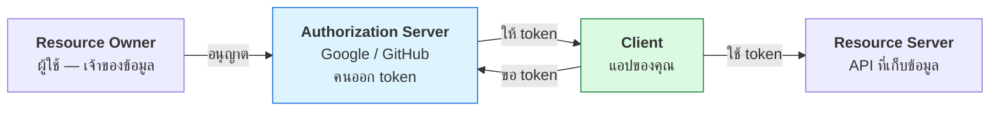
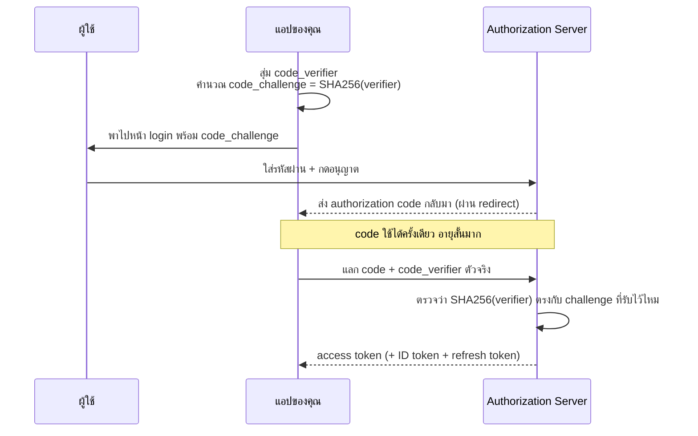
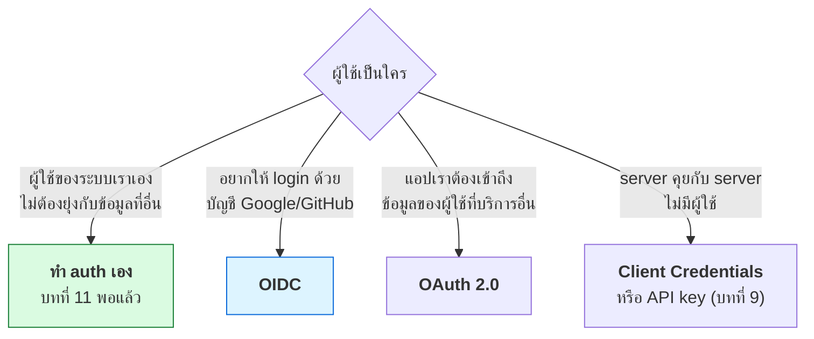

# บทที่ 53 · OAuth 2.0 และ OpenID Connect

> [บทที่ 9](09-authentication.md) ถึง [บทที่ 11](11-mobile-api-auth-design.md) สอนการออก token **ด้วยตัวเอง**
> บทนี้ตอบคำถามที่ต่างออกไป: **"ให้คนอื่นออก token ให้เรา"** ทำงานอย่างไร
>
> ทุกครั้งที่คุณเห็นปุ่ม *"Login with Google"* — นั่นคือ OAuth 2.0 + OIDC

## 53.1 แยกให้ออกก่อน — สองคำที่คนสับสนตลอด {#s53-1}

```
OAuth 2.0            = การมอบ "สิทธิ์"     (authorization)
OpenID Connect (OIDC) = การบอก "คุณคือใคร"  (authentication)
```

| | ตอบคำถามอะไร | ได้อะไรกลับมา |
|---|---|---|
| **OAuth 2.0** | "แอปนี้เข้าถึงข้อมูลอะไรของผู้ใช้ได้บ้าง" | **access token** |
| **OIDC** | "ผู้ใช้คนนี้คือใคร" | **ID token** (เป็น JWT เสมอ) |

**OIDC เป็นชั้นบางๆ ที่วางทับ OAuth 2.0** — ไม่ใช่คนละเรื่อง แต่ต่อยอด

> ## กับดักอันดับหนึ่งของทั้งบท
>
> **อย่าใช้ access token เพื่อยืนยันว่าผู้ใช้เป็นใคร**
>
> access token คือ "ตั๋วเข้าใช้ทรัพยากร" — มันไม่ได้บอกว่าใครถือ และ
> ระบบของคุณไม่มีทางรู้ว่ามันถูกออกให้แอปไหน คนที่ขโมยตั๋วมาก็ใช้ได้เหมือนกัน
>
> **ถ้าอยากรู้ว่าผู้ใช้เป็นใคร ต้องใช้ ID token** ซึ่งมี `aud` (ออกให้แอปไหน)
> และถูกเซ็นให้ตรวจสอบได้ ([บทที่ 10](10-jwt-deep-dive.md))
>
> ช่องโหว่ที่เกิดจากความสับสนนี้เรียกว่า **confused deputy** และเคยทำให้
> ระบบ "Login with Facebook" ของหลายเว็บถูกสวมรอยได้จริง

## 53.2 ตัวละคร 4 ตัว {#s53-2}



**จุดสำคัญที่ทำให้ OAuth มีค่า:** ผู้ใช้พิมพ์รหัสผ่านที่ **Authorization Server
เท่านั้น** แอปของคุณไม่เคยเห็นรหัสผ่านเลย

เทียบกับยุคก่อน OAuth ที่แอปต้องขอ username/password ของ Gmail ผู้ใช้ไปเก็บไว้ —
วิธีนั้นเรียกว่า *password anti-pattern* และเป็นเหตุผลที่ OAuth ถือกำเนิด

## 53.3 Authorization Code + PKCE — flow เดียวที่ควรใช้ {#s53-3}

ปี 2026 **มี flow เดียวที่ยังแนะนำสำหรับแอปใหม่ทุกชนิด**



### ทำไมต้องมี PKCE

**ปัญหา:** authorization code เดินทางกลับมาผ่าน URL ของเบราว์เซอร์ ซึ่งอาจถูก
แอปอื่นบนมือถือดักได้ (แอปร้ายจดทะเบียน URL scheme ซ้ำ) หรือหลุดใน log

**PKCE แก้ด้วยการผูก code กับความลับที่มีแต่แอปตัวจริงรู้** — คนที่ขโมย code
ไปแลกไม่ได้ เพราะไม่มี `code_verifier`

```python
import base64, hashlib, secrets

verifier  = base64.urlsafe_b64encode(secrets.token_bytes(32)).rstrip(b"=").decode()
challenge = base64.urlsafe_b64encode(
    hashlib.sha256(verifier.encode("ascii")).digest()).rstrip(b"=").decode()
```

ค่าจริงที่ได้:

```
code_verifier  = 44cWJ643Ael61RKR4Qq02vP0eXKUPNsc2KQkWMPWWRo   (43 ตัวอักษร)
code_challenge = 11Yu4ecw5l1pLomaHzaSxT2JGNoOqpRatV7Exv9-cBA   (43 ตัวอักษร)
```

**สังเกตว่าใช้ base64url ไม่ใช่ base64 ธรรมดา** และตัด `=` ทิ้ง — เพราะค่านี้
ต้องเดินทางใน URL ([บทที่ 6](06-encoding-and-charset.md))

> **`secrets` ไม่ใช่ `random`** — ตัวหลังเดาค่าถัดไปได้ถ้ารู้ค่าก่อนหน้า
> ซึ่งทำให้ PKCE ไร้ความหมายทันที (เหตุผลเต็ม ๆ อยู่ใน[บทที่ 38](38-crypto-in-practice.md))

## 53.4 flow ที่ตายแล้ว — และทำไม {#s53-4}

| Flow | สถานะ | ทำไม |
|------|-------|------|
| **Authorization Code + PKCE** | ✅ ใช้ตัวนี้ | ปลอดภัยกับทุกชนิดของแอป |
| Implicit | 🔴 **เลิกใช้** | ส่ง token มาใน URL fragment → ติดใน log, history, referrer |
| Resource Owner Password | 🔴 **เลิกใช้** | แอปต้องเห็นรหัสผ่านผู้ใช้ = ทำลายเหตุผลของ OAuth |
| Client Credentials | ✅ | **แต่คนละงาน** — server คุย server ไม่มีผู้ใช้เกี่ยวข้อง |
| Device Code | ✅ | สำหรับอุปกรณ์ที่พิมพ์ยาก (ทีวี, CLI) |

> **ถ้าเจอ tutorial ที่สอน implicit flow ให้ปิดทิ้ง** — มันเก่าเกิน 5 ปีแล้ว
> และ OAuth 2.1 (ฉบับรวบรวมที่กำลังจะเป็นมาตรฐาน) ตัด implicit กับ password
> grant ออกอย่างเป็นทางการ

## 53.5 ID token — ต่างจาก access token ยังไง {#s53-5}

ID token เป็น JWT เสมอ ([บทที่ 10](10-jwt-deep-dive.md)) และ payload หน้าตาแบบนี้:

```json
{
  "iss": "https://accounts.google.com",
  "aud": "myapp.apps.googleusercontent.com",
  "sub": "110169484474386276334",
  "email": "user@example.com",
  "exp": 1774000000
}
```

| claim | หมายถึง | ต้องตรวจไหม |
|-------|---------|-------------|
| `iss` | ใครออก | ✅ ต้องตรงกับ provider ที่คุณเชื่อ |
| `aud` | **ออกให้แอปไหน** | ✅ **ต้องเป็น client_id ของคุณ** |
| `sub` | รหัสผู้ใช้ถาวรของ provider | ✅ ใช้ตัวนี้เป็นคีย์ |
| `exp` | หมดอายุ | ✅ |
| `email` | อีเมล | ⚠️ **ห้ามใช้เป็นคีย์** |

> ## 🔴 สองข้อที่พลาดแล้วโดนสวมรอย
>
> **1. ไม่ตรวจ `aud`** — token ที่ Google ออกให้ *แอปอื่น* ก็เป็น token ที่ถูกต้อง
> ตามลายเซ็นเหมือนกัน ถ้าไม่ตรวจว่าออกให้ใคร ใครก็เอา token จากแอปตัวเอง
> มาสวมรอยในระบบคุณได้
>
> **2. ใช้ `email` เป็นคีย์ผู้ใช้** — อีเมลเปลี่ยนได้ และบาง provider ให้ `email`
> โดยไม่ได้ยืนยัน (`email_verified: false`) ผู้โจมตีสมัครอีเมลเป็นชื่อเหยื่อ
> แล้วเข้าบัญชีเหยื่อได้เลย
>
> **ใช้ `sub` เป็นคีย์เสมอ** และเก็บ `email` ไว้แค่แสดงผล

## 53.6 เก็บ token ไว้ที่ไหน {#s53-6}

นี่คือจุดที่เว็บกับมือถือต่างกัน และเป็นที่มาของบั๊กความปลอดภัยจำนวนมาก

| ที่เก็บ | JS อ่านได้ไหม | ปลอดภัยไหม |
|---------|---------------|------------|
| `localStorage` | ✅ อ่านได้ | 🔴 **XSS ขโมยได้ทันที** |
| `sessionStorage` | ✅ | 🔴 เหมือนกัน |
| **cookie `HttpOnly` + `Secure` + `SameSite`** | ❌ | ✅ **สำหรับเว็บใช้ตัวนี้** |
| Keychain / Keystore | — | ✅ สำหรับมือถือ ([บทที่ 11](11-mobile-api-auth-design.md)) |

**คำแนะนำที่เห็นบ่อยว่า "เก็บ JWT ใน localStorage" คือคำแนะนำที่ผิด** —
มันสะดวกเพราะ JS หยิบไปใส่ header ได้ง่าย แต่แลกมาด้วยการที่ XSS ครั้งเดียว
เท่ากับเสียบัญชีถาวร (ต่อยอดจาก[บทที่ 4](04-cookies-sessions.md) เรื่อง cookie attribute)

**รูปแบบที่แนะนำสำหรับเว็บ — BFF (Backend for Frontend):**

```
เบราว์เซอร์ ──cookie session──> backend ของคุณ ──access token──> API
              (HttpOnly)          (เก็บ token ฝั่ง server)
```

token ไม่เคยไปถึงเบราว์เซอร์เลย — XSS ขโมยได้อย่างมากก็แค่ session cookie
ซึ่งเพิกถอนได้ทันที ต่างจาก token ที่เพิกถอนยาก

## 53.7 ลองดูของจริงด้วย curl {#s53-7}

ทุก provider ที่รองรับ OIDC ต้องประกาศ endpoint ของตัวเองไว้ที่ตำแหน่งมาตรฐาน:

```bash
curl -s https://accounts.google.com/.well-known/openid-configuration | jq '{
  issuer, authorization_endpoint, token_endpoint, jwks_uri
}'
```

```bash
# กุญแจสาธารณะที่ใช้ตรวจลายเซ็น ID token
curl -s https://www.googleapis.com/oauth2/v3/certs | jq '.keys[0] | {kid, alg}'
```

**`kid` ในหัว JWT บอกว่าให้ใช้กุญแจใบไหนตรวจ** — provider หมุนกุญแจเป็นระยะ
โค้ดของคุณจึงต้องดึง JWKS มาใหม่เป็นครั้งคราว ไม่ใช่ hard-code กุญแจไว้
(เรื่อง key rotation อยู่ใน[บทที่ 38](38-crypto-in-practice.md))

## 53.8 เมื่อไรควรใช้ OAuth และเมื่อไรไม่ควร {#s53-8}



> **อย่าใช้ OAuth เพราะมันดูเป็นมืออาชีพ** — ถ้าระบบคุณมีผู้ใช้ของตัวเอง
> ไม่ต้องเชื่อมกับใคร การทำ auth เองตาม[บทที่ 11](11-mobile-api-auth-design.md) ง่ายกว่า ตรวจสอบง่ายกว่า
> และไม่ต้องพึ่งว่า provider จะไม่ล่ม
>
> OAuth มีค่าเมื่อ **ผู้ใช้ไม่ควรต้องบอกรหัสผ่านของบริการอื่นให้คุณ**

## 53.9 checklist ก่อนขึ้น production {#s53-9}

**ฝั่ง client**

- [ ] ใช้ Authorization Code + **PKCE** เท่านั้น (ไม่ใช่ implicit)
- [ ] `state` สุ่มทุกครั้งและตรวจตอนกลับมา — กัน CSRF ([บทที่ 4](04-cookies-sessions.md))
- [ ] `redirect_uri` จดทะเบียนไว้แบบตรงตัว ไม่ใช้ wildcard
- [ ] `code_verifier` สร้างด้วย `secrets` ไม่ใช่ `random`

**ฝั่งตรวจ token**

- [ ] ตรวจลายเซ็นด้วย JWKS ที่ดึงสด ไม่ hard-code กุญแจ
- [ ] ตรวจ `iss` ตรงกับ provider ที่ตั้งใจ
- [ ] **ตรวจ `aud` ตรงกับ client_id ของเรา**
- [ ] ตรวจ `exp` และเผื่อ clock skew เล็กน้อย
- [ ] ใช้ `sub` เป็นคีย์ผู้ใช้ ไม่ใช่ `email`

**ที่เก็บ**

- [ ] เว็บ: cookie `HttpOnly; Secure; SameSite=Lax` — **ไม่ใช่ localStorage**
- [ ] มือถือ: Keychain / Keystore
- [ ] refresh token หมุนทุกครั้งที่ใช้ + ตรวจการใช้ซ้ำ ([บทที่ 11](11-mobile-api-auth-design.md))

## แบบฝึกหัด

1. เปิด `.well-known/openid-configuration` ของ Google, GitHub และ Microsoft
   — endpoint ต่างกันตรงไหน อันไหนไม่รองรับ OIDC เต็มรูปแบบ
2. สร้าง `code_verifier`/`code_challenge` ด้วยโค้ดในข้อ [53.3](#s53-3)
   แล้วยืนยันเองว่า `SHA256(verifier)` ให้ `challenge` จริง
3. เอา ID token จริง (จากแอปทดสอบของตัวเอง) มาถอดด้วย `base64 -d` แล้วอ่าน
   `iss`, `aud`, `sub` — **อย่าเอา token ของ production มาแปะที่ไหน**
4. ตอบตัวเอง: ถ้าระบบคุณตรวจแค่ลายเซ็นแต่ไม่ตรวจ `aud` ผู้โจมตีทำอะไรได้
5. เขียนอธิบายให้เพื่อนฟังใน 3 ประโยคว่า PKCE กันอะไร
6. หาในโค้ดของตัวเอง (หรือโปรเจกต์ที่เคยทำ) ว่ามีที่ไหนเก็บ token ใน
   `localStorage` ไหม — ถ้ามี วางแผนย้าย
7. ระบบที่คุณกำลังทำ ควรใช้ OAuth หรือทำ auth เอง — ตอบด้วยผังในข้อ [53.8](#s53-8)

***
[⬅ JWT เจาะลึก](10-jwt-deep-dive.md) · [สารบัญ](../README.md) · [Passkey และ WebAuthn ➡](54-passkeys-and-webauthn.md)
