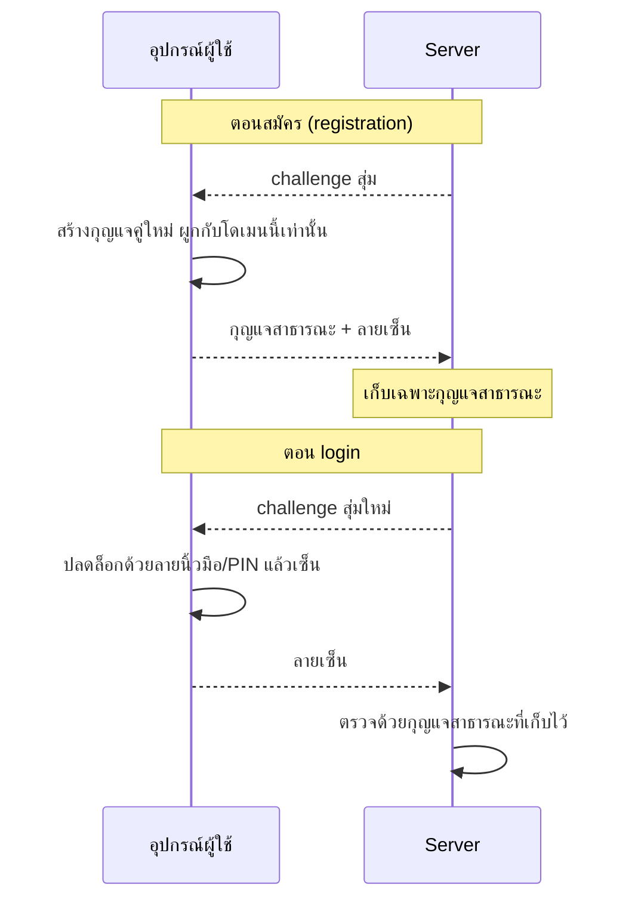
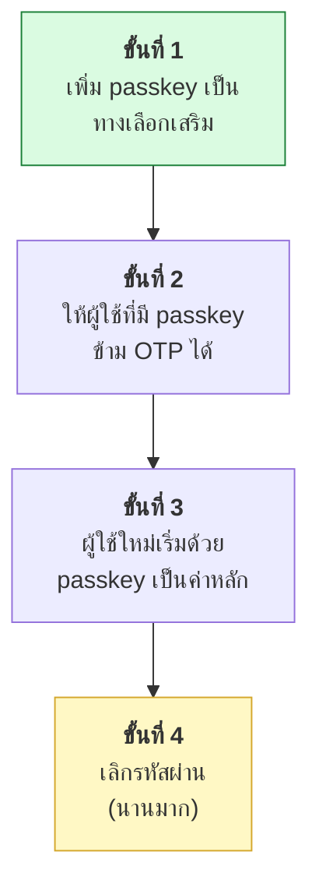

# บทที่ 54 · Passkey และ WebAuthn

> ทั้งเล่มนี้สอนวิธีจัดการรหัสผ่านและ token ให้ปลอดภัย
> บทนี้ตอบคำถามที่ตรงกว่านั้น: **"ไม่ใช้รหัสผ่านเลยได้ไหม"**
>
> คำตอบคือได้ และอุตสาหกรรมกำลังย้ายไปทางนั้นจริง — Apple, Google, Microsoft
> ผลักดันพร้อมกันตั้งแต่ปี 2022

## 54.1 ปัญหาที่รหัสผ่านแก้ไม่ได้ {#s54-1}

| ปัญหา | แก้ด้วยอะไร | ยังเหลืออะไร |
|-------|-------------|--------------|
| รหัสผ่านอ่อน | บังคับความยาว | ผู้ใช้ใช้ซ้ำทุกเว็บ |
| ใช้ซ้ำ | password manager | คนส่วนใหญ่ไม่ใช้ |
| ฐานข้อมูลรั่ว | Argon2 ([บทที่ 38](38-crypto-in-practice.md)) | ยังเดารหัสง่าย ๆ ได้อยู่ |
| **ฟิชชิ่ง** | สอนผู้ใช้ | 🔴 **แก้ไม่ได้** |

**ฟิชชิ่งคือข้อที่ไม่มีทางแก้ด้วยรหัสผ่าน** — ถ้าผู้ใช้พิมพ์รหัสลงเว็บปลอมที่
หน้าตาเหมือนของจริง ต่อให้รหัสยาว 40 ตัวและมี OTP ผู้โจมตีก็ส่งต่อไปเว็บจริง
แบบเรียลไทม์ได้ (**adversary-in-the-middle**)

> ## ทำไม OTP กัน phishing ไม่ได้
>
> ```
> เหยื่อ → เว็บปลอม → เว็บจริง
>          (ส่งต่อรหัส + OTP ทันที ภายในไม่กี่วินาที)
> ```
>
> OTP พิสูจน์แค่ว่า "คนนี้ถือโทรศัพท์" ไม่ได้พิสูจน์ว่า **"กำลังคุยกับเว็บไหน"**
>
> **นี่คือจุดที่ passkey ต่างออกไปโดยสิ้นเชิง**

## 54.2 หลักการ — กุญแจคู่ ไม่ใช่ความลับร่วม {#s54-2}

```
รหัสผ่าน  = ความลับที่ "ทั้งสองฝั่งรู้"    → ฝั่ง server รั่วเมื่อไร จบ
passkey   = กุญแจคู่ ฝั่ง server เก็บแค่
            กุญแจ "สาธารณะ"                → server รั่วก็ไม่มีอะไรให้ขโมย
```

ต่อยอดโดยตรงจาก asymmetric crypto ใน[บทที่ 38](38-crypto-in-practice.md)



**กุญแจส่วนตัวไม่เคยออกจากอุปกรณ์** — ไม่ผ่านเครือข่าย ไม่เข้า server ไม่มีใคร
ดักได้ ต่างจากรหัสผ่านที่ต้องเดินทางไปทุกครั้ง

## 54.3 ทำไมมันกันฟิชชิ่งได้จริง {#s54-3}

นี่คือส่วนสำคัญที่สุดของทั้งบท

**ตอนสร้าง passkey เบราว์เซอร์ผูกกุญแจไว้กับโดเมนถาวร** (`rpId`)

```
สร้างที่  bank.com        → กุญแจใช้ได้เฉพาะ bank.com
เว็บปลอม  bank-secure.com → เบราว์เซอร์ "หากุญแจไม่เจอ"
```

**ผู้ใช้ไม่มีทางเผลอให้กุญแจกับเว็บปลอมได้ เพราะเบราว์เซอร์ไม่ยอมส่งให้ตั้งแต่แรก**

| วิธี | ผู้ใช้เผลอให้เว็บปลอมได้ไหม |
|------|------------------------------|
| รหัสผ่าน | ✅ ได้ (พิมพ์เอง) |
| OTP / SMS | ✅ ได้ (พิมพ์เอง) |
| **Passkey** | ❌ **เบราว์เซอร์ปฏิเสธเอง** |

**ความปลอดภัยไม่ได้ขึ้นกับความระมัดระวังของผู้ใช้อีกต่อไป** — นี่คือความก้าวหน้าจริง

## 54.4 คำศัพท์ที่ต้องแยกให้ออก {#s54-4}

| คำ | คืออะไร |
|----|---------|
| **WebAuthn** | มาตรฐาน API ที่เบราว์เซอร์ให้ JavaScript เรียก |
| **FIDO2** | ชื่อรวมของมาตรฐานทั้งชุด (WebAuthn + CTAP) |
| **CTAP** | โปรโตคอลที่เบราว์เซอร์คุยกับกุญแจฮาร์ดแวร์ |
| **Authenticator** | ตัวเก็บกุญแจ — Face ID, Windows Hello, YubiKey |
| **Passkey** | ชื่อการตลาดของ FIDO2 credential ที่ **sync ข้ามอุปกรณ์ได้** |

> **"Passkey" กับ "security key" ไม่เหมือนกัน**
>
> - **Passkey** ซิงก์ผ่าน iCloud/Google Password Manager — เปลี่ยนเครื่องแล้วยังใช้ได้
> - **Security key** (YubiKey) กุญแจอยู่ในฮาร์ดแวร์ตัวนั้น ทำหายคือหาย
>
> อย่างแรกสะดวกกว่ามาก อย่างหลังปลอดภัยกว่าในสภาพแวดล้อมที่เข้มงวด

## 54.5 ฝั่ง server ต้องเก็บอะไร {#s54-5}

```sql
CREATE TABLE credentials (
    id            BLOB PRIMARY KEY,   -- credential ID จาก authenticator
    user_id       INTEGER NOT NULL,
    public_key    BLOB NOT NULL,      -- ← เก็บแค่กุญแจสาธารณะ
    sign_count    INTEGER NOT NULL,   -- กัน credential ถูกโคลน
    created_at    TIMESTAMP
);
```

**ไม่มีอะไรในตารางนี้ที่ขโมยไปแล้วใช้ login ได้** — ต่างจากตารางรหัสผ่านที่
ต่อให้ hash แล้วก็ยัง brute-force ได้ ([บทที่ 38](38-crypto-in-practice.md))

**สิ่งที่ต้องตรวจตอน login:**

- [ ] ลายเซ็นตรงกับกุญแจสาธารณะที่เก็บไว้
- [ ] `challenge` ตรงกับที่เพิ่งส่งไป และ**ใช้ครั้งเดียว** (กัน replay — [บทที่ 13](13-webhooks-and-hmac.md))
- [ ] `origin` ตรงกับโดเมนจริงของเรา
- [ ] `rpIdHash` ตรงกับโดเมนของเรา
- [ ] `sign_count` เพิ่มขึ้น (ถ้าลดลง = อาจถูกโคลน)

> **อย่าเขียน WebAuthn เอง** — ใช้ library ที่ตรวจครบทุกข้อข้างบน
> (`py_webauthn`, `SimpleWebAuthn`) เหตุผลเดียวกับที่[บทที่ 38](38-crypto-in-practice.md) บอกว่า
> อย่าเขียน crypto เอง

## 54.6 ความจริงที่ต้องยอมรับก่อนใช้ {#s54-6}

passkey ไม่ได้แก้ทุกอย่าง และมีปัญหาเชิงปฏิบัติที่ยังไม่ลงตัว

| ปัญหา | สภาพจริง |
|-------|----------|
| **บัญชีกู้คืน** | ผู้ใช้ทำอุปกรณ์หายหมด → กู้ยังไง |
| ผูกกับ ecosystem | passkey ใน iCloud ย้ายไป Android ยังไม่ราบรื่น |
| ผู้ใช้ไม่เข้าใจ | "passkey คืออะไร" ยังต้องอธิบายอยู่ |
| อุปกรณ์เก่า | เบราว์เซอร์/OS เก่าไม่รองรับ |

> ## 🔴 กับดักการกู้บัญชี
>
> ระบบจำนวนมากทำ passkey อย่างดี **แล้วเปิดช่อง "ลืม passkey? ส่งลิงก์ทางอีเมล"**
>
> เท่ากับความปลอดภัยทั้งระบบตกมาอยู่ที่อีเมล ซึ่งมักป้องกันด้วยรหัสผ่าน
> **ผู้โจมตีจะเลี่ยง passkey แล้วไปเจาะทางนั้นแทนทันที**
>
> นี่คือหลักการที่[บทที่ 34](34-threat-modeling.md) เรียกว่า *ผู้โจมตีเลือกทางที่ง่ายที่สุดเสมอ*
> — ระบบแข็งเท่ากับจุดที่อ่อนที่สุด ไม่ใช่จุดที่แข็งที่สุด

**ทางที่เป็นจริงได้:** ให้ลงทะเบียน passkey อย่างน้อย 2 อัน (โทรศัพท์ + คอมพิวเตอร์)
หรือมีรหัสกู้คืนแบบใช้ครั้งเดียวที่ผู้ใช้พิมพ์เก็บไว้

## 54.7 ควรเริ่มยังไง {#s54-7}



**อย่าเริ่มด้วยการตัดรหัสผ่านทิ้ง** — ผู้ใช้จำนวนมากยังไม่พร้อม และการกู้บัญชี
ยังไม่มีทางออกที่ดีพอ

**จุดที่ได้ผลเร็วที่สุด: ใช้แทน OTP** — ผู้ใช้ได้ความสะดวกทันที (แตะลายนิ้วมือ
แทนพิมพ์เลข 6 หลัก) และคุณได้ phishing resistance ฟรี

## แบบฝึกหัด

1. ลองสมัคร passkey กับ GitHub หรือ Google แล้วสังเกตว่าเบราว์เซอร์ถามอะไรบ้าง
2. เปิด DevTools ตอน login ด้วย passkey — มี request อะไรวิ่งบ้าง
   ต่างจาก login ด้วยรหัสผ่านอย่างไร ([บทที่ 14](14-devtools-to-curl.md))
3. ตอบตัวเอง: ทำไม `curl` ทำ login ด้วย passkey ไม่ได้ (คำใบ้: อยู่ที่ข้อ [54.3](#s54-3))
4. ออกแบบทางกู้บัญชีสำหรับระบบที่ใช้ passkey อย่างเดียว โดย**ห้าม**ใช้อีเมล
5. ระบบที่คุณทำอยู่ ถ้าเพิ่ม passkey จะเริ่มที่ขั้นไหนในผังข้อ [54.7](#s54-7)
6. อ่านตารางข้อ [54.6](#s54-6) แล้วตอบว่าผู้ใช้กลุ่มไหนของคุณจะใช้ passkey ไม่ได้

***
[⬅ OAuth 2.0 และ OpenID Connect](53-oauth-and-oidc.md) · [สารบัญ](../README.md) · [ออกแบบ Authentication ให้ Mobile API ➡](11-mobile-api-auth-design.md)
