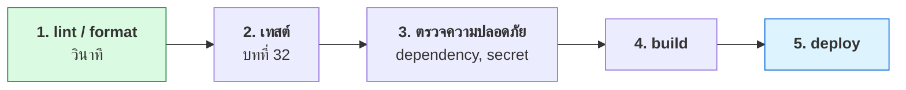

# บทที่ 55 · CI/CD — ท่อที่เชื่อมทุกอย่างเข้าด้วยกัน

> [บทที่ 30](30-git.md) สอน git · [บทที่ 32](32-testing-with-pytest.md) สอนเขียนเทสต์ · [บทที่ 28](28-observability-and-deployment.md) สอน deploy
> **บทนี้คือท่อที่เชื่อมสามอย่างนั้นให้ทำงานเองโดยไม่มีใครลืม**

## 55.1 ปัญหาที่ CI แก้ {#s55-1}

```
"เครื่องผมรันผ่านนะ"        ← ประโยคที่แพงที่สุดในวงการ
"ลืมรันเทสต์ก่อน push"
"deploy แล้วลืมอัปเดต config"
"คนที่ deploy เป็นลาออกไปแล้ว"
```

**CI (Continuous Integration)** = ทุกครั้งที่ push โค้ด มีเครื่องกลางรันเทสต์ให้
**CD (Continuous Delivery/Deployment)** = ถ้าผ่าน ก็เอาขึ้นระบบจริงให้เลย

| | ก่อนมี CI | หลังมี CI |
|---|---|---|
| ใครรันเทสต์ | คนที่จำได้ | ทุก push อัตโนมัติ |
| รันบนอะไร | เครื่องคนเขียน | **เครื่องสะอาดเหมือนกันทุกครั้ง** |
| รู้ว่าพังเมื่อไร | ตอน deploy | ตอน push |

**คุณค่าที่แท้จริงอยู่ที่ "เครื่องสะอาด"** — บั๊กประเภท "ลืมใส่ dependency ใน
requirements.txt" จะโผล่ทันทีบน CI แต่ไม่มีวันโผล่บนเครื่องที่ลงของไว้ครบแล้ว

## 55.2 กายวิภาคของ workflow {#s55-2}

หนังสือเล่มนี้เผยแพร่ด้วย GitHub Actions — ใช้ของจริงเป็นตัวอย่าง

```yaml
name: Publish book to GitHub Pages

on:
  push:
    branches: [main]        # ทำงานเมื่อ push เข้า main
  workflow_dispatch:        # และกดรันเองได้

permissions:                # ← ให้สิทธิ์เท่าที่จำเป็น (บทที่ 36)
  contents: read
  pages: write
  id-token: write

concurrency:                # push ติด ๆ กัน ให้ยกเลิกอันเก่า
  group: pages
  cancel-in-progress: true

jobs:
  build:
    runs-on: ubuntu-latest
    steps:
      - uses: actions/checkout@v4
      - uses: quarto-dev/quarto-actions/setup@v2
        with:
          version: "1.9.38"     # ← ตรึงเวอร์ชัน
      - run: quarto render --to html
      - run: python3 tools/check-mermaid.py
      - uses: actions/upload-pages-artifact@v3
        with:
          path: _book
```

| ส่วน | ทำอะไร |
|------|--------|
| `on` | **เงื่อนไขที่ทำให้เริ่มทำงาน** |
| `permissions` | token ของ workflow ทำอะไรได้บ้าง |
| `concurrency` | กันงานซ้อนกัน |
| `jobs` | งานที่รัน (ขนานกันได้ถ้าไม่ผูก `needs`) |
| `steps` | ขั้นตอนในงานนั้น รันเรียงกัน |

## 55.3 กฎข้อที่หนึ่ง — ตรึงเวอร์ชันทุกอย่าง {#s55-3}

```yaml
version: "1.9.38"       # ✅ ผลลัพธ์เหมือนเดิมทุกครั้ง
version: "latest"       # 🔴 วันหนึ่ง build พังโดยที่ไม่มีใครแก้อะไร
```

**"latest" แปลว่า build ของคุณขึ้นกับว่าวันนี้เขาปล่อยอะไร** — โค้ดเดิม
ผลลัพธ์ต่าง เป็นบั๊กที่หาสาเหตุยากที่สุดประเภทหนึ่ง

เรื่องเดียวกันกับ action เอง:

```yaml
- uses: actions/checkout@v4                    # 🟡 tag เลื่อนได้
- uses: actions/checkout@8f4b7f8...            # ✅ ตรึงด้วย commit hash
```

> ## action คือ dependency — และมันรันในเครื่องที่เห็น secret ของคุณ
>
> `uses: some/action@v1` คือการเอาโค้ดของคนอื่นมารันโดยมีสิทธิ์เข้าถึง
> repository และ secret ทั้งหมด **เจ้าของ tag `v1` ย้าย tag ไปชี้โค้ดใหม่ได้ทุกเมื่อ**
>
> นี่คือ supply chain attack แบบเดียวกับที่[บทที่ 42](42-supply-chain-security.md) อธิบาย เพียงแต่เกิดใน CI
>
> **action ของบุคคลที่สามควรตรึงด้วย commit hash** ส่วน action ทางการของ
> GitHub/vendor ใหญ่ ใช้ tag พอรับได้

## 55.4 Secret ใน CI {#s55-4}

```yaml
- run: ./deploy.sh
  env:
    API_TOKEN: ${{ secrets.API_TOKEN }}     # ✅ ส่งผ่าน env
```

```yaml
- run: ./deploy.sh --token=${{ secrets.API_TOKEN }}   # 🔴 โผล่ใน log ได้
```

| กฎ | เหตุผล |
|----|--------|
| ส่งผ่าน `env` ไม่ใช่ argument | argument โผล่ใน process list และ log |
| อย่า `echo` secret ตอน debug | log ของ CI มักเปิดให้คนในทีมอ่านได้หมด |
| **PR จาก fork ไม่ควรเห็น secret** | ใครก็ส่ง PR ที่พิมพ์ secret ออกมาได้ |
| หมุน secret เมื่อคนออกจากทีม | เหมือนกุญแจสำนักงาน |

> GitHub ปิดบัง secret ใน log ให้อัตโนมัติ **แต่กันได้แค่ค่าตรง ๆ** —
> ถ้าโค้ดคุณ `base64` มันก่อนแล้วพิมพ์ออกมา ระบบจับไม่ได้

## 55.5 CI ควรรันอะไรบ้าง {#s55-5}

เรียงตามลำดับที่ควรทำ — **ให้อันที่เร็วและพังบ่อยอยู่ก่อน**



**เหตุผลของลำดับ: ให้ feedback เร็วที่สุด** — ถ้า lint พังใน 10 วินาที
ไม่ต้องรอเทสต์ 5 นาทีเพื่อรู้

**ตัวอย่างขั้นที่ 3 ที่คุ้มค่าที่สุด:**

```yaml
- name: หา secret ที่เผลอ commit
  uses: gitleaks/gitleaks-action@v2

- name: ตรวจ dependency ที่มีช่องโหว่
  run: pip-audit          # หรือ npm audit
```

**ตัวแรกสำคัญกว่าที่คิด** — [บทที่ 30](30-git.md) บอกว่า secret ที่ commit ไปแล้วอยู่ใน
ประวัติตลอดกาล การจับตั้งแต่ PR จึงถูกกว่าการมาไล่ลบทีหลังมาก

## 55.6 CI ที่ตรวจสิ่งที่มนุษย์ตรวจไม่ไหว {#s55-6}

หนังสือเล่มนี้ใส่ขั้นตอนนี้ไว้ด้วยเหตุผลเฉพาะ:

```yaml
- name: Check mermaid blocks
  run: |
    python3 -m pip install --quiet playwright
    python3 -m playwright install --with-deps chromium
    python3 tools/check-mermaid.py
```

**เพราะ Quarto ไม่บ่นเมื่อ mermaid พัง** — มัน build ผ่านปกติ แล้วหน้าเว็บ
แสดงข้อความ error แทนรูป ถ้าไม่มีใครเปิดดูทุกหน้าก็ไม่มีใครรู้

```
ตรวจ 54 บล็อก · ผ่าน 54 · พัง 0
```

> **นี่คือรูปแบบที่ควรมองหาในโปรเจกต์ของตัวเอง** — อะไรที่ *"พังแบบเงียบ ๆ"*
> คือสิ่งที่ควรให้ CI ตรวจ ส่วนอะไรที่พังแล้วเห็นทันทีอยู่แล้ว ไม่ต้องเสียเวลาตรวจซ้ำ

## 55.7 CD — เมื่อไรควรปล่อยอัตโนมัติ {#s55-7}

| แบบ | อธิบาย | เหมาะกับ |
|-----|--------|----------|
| **Continuous Delivery** | build พร้อม deploy แต่**คนกดปุ่ม** | ระบบที่พังแล้วเสียหายหนัก |
| **Continuous Deployment** | ผ่านเทสต์แล้วขึ้นเลย | เว็บ/เอกสาร ที่ย้อนกลับง่าย |

**เงื่อนไขที่ต้องมีก่อนปล่อยอัตโนมัติ:**

- [ ] เทสต์ครอบคลุมพอที่จะเชื่อได้จริง ([บทที่ 32](32-testing-with-pytest.md))
- [ ] **ย้อนกลับได้เร็ว** — สำคัญกว่าการไม่พังเลย
- [ ] มี health check และ alert ([บทที่ 28](28-observability-and-deployment.md))
- [ ] migration ฐานข้อมูลเป็นแบบ expand/contract ([บทที่ 27](27-database-and-performance.md))

> **ความสามารถในการย้อนกลับมีค่ากว่าความพยายามไม่ให้พัง** — ระบบที่ deploy
> วันละสิบครั้งแล้วย้อนได้ใน 2 นาที มีเวลาล่มรวมน้อยกว่าระบบที่ deploy
> เดือนละครั้งแบบลุ้นระทึก

## 55.8 กับดักที่เจอบ่อย {#s55-8}

| อาการ | สาเหตุจริง |
|-------|-----------|
| "รันบนเครื่องผมผ่าน" | เครื่องมีของที่ไม่ได้อยู่ใน requirements |
| CI ช้าจนไม่มีใครรอ | ไม่ได้ cache dependency · รันทุกอย่างพร้อมกัน |
| **เทสต์พังสลับไปมา** | 🔴 **อันตรายที่สุด** — คนจะเริ่มกด re-run จนชิน แล้วมองข้ามของจริง |
| build ผ่านแต่ระบบพัง | เทสต์ไม่ได้ทดสอบสิ่งที่สำคัญ |
| ไม่มีใครดู CI ที่แดง | ไม่มีคนรับผิดชอบชัด |

**เทสต์ที่พังสลับไปมา (flaky) ต้องแก้หรือลบทันที** — ปล่อยไว้จะทำลายความเชื่อถือ
ของ CI ทั้งระบบ พอคนชินกับสีแดง วันที่พังจริงก็จะไม่มีใครสังเกต

## แบบฝึกหัด

1. เปิด `.github/workflows/` ของ repo ที่คุณใช้อยู่ — มี action ของบุคคลที่สาม
   กี่ตัว ตรึง hash ไว้ไหม
2. เขียน workflow ที่รัน `pytest` ของ[บทที่ 32](32-testing-with-pytest.md) ทุกครั้งที่ push
3. เพิ่มขั้นตอนหา secret ที่เผลอ commit แล้วลองสร้าง branch ที่มี token ปลอม
   — CI จับได้ไหม
4. วัดว่า workflow ใช้เวลากี่วินาที แล้วหาว่าขั้นไหนกินเวลามากที่สุด
5. ตอบตัวเอง: ในระบบของคุณ มีอะไรที่ "พังแบบเงียบ ๆ" ที่ควรให้ CI ตรวจ (ข้อ [55.6](#s55-6))
6. ระบบของคุณย้อน deploy กลับใช้เวลากี่นาที — ถ้าตอบไม่ได้ นั่นคือคำตอบ
7. ตั้ง `permissions:` ใน workflow ให้แคบที่สุดเท่าที่ยังทำงานได้ ([บทที่ 36](36-permissions-and-isolation.md))

***
[⬅ เขียนเทสต์ให้ API](32-testing-with-pytest.md) · [สารบัญ](../README.md) · [Profiling ➡](67-profiling.md)
