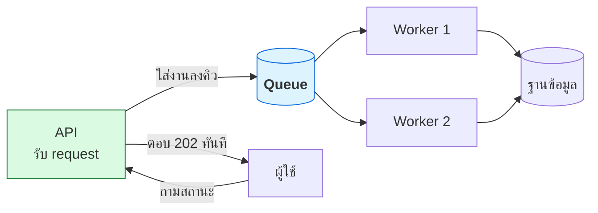

# บทที่ 56 · งานเบื้องหลังและคิวงาน

> [บทที่ 33](33-concurrency-and-async.md) สอนทำหลายอย่างพร้อมกัน**ในโปรเซสเดียว**
> บทนี้ตอบคำถามถัดไป: **"งานที่ช้าเกินกว่าจะให้ผู้ใช้รอ เอาไปไว้ไหน"**

## 56.1 อาการที่บอกว่าถึงเวลาต้องมีคิว {#s56-1}

```python
@app.post("/register")
def register(data):
    user = create_user(data)
    send_welcome_email(user)      # ← 2 วินาที ถ้า SMTP ช้า
    generate_avatar(user)         # ← 5 วินาที
    sync_to_crm(user)             # ← CRM ล่มอยู่ ตอบไม่กลับเลย
    return {"ok": True}           # ผู้ใช้รอ 7 วินาทีเพื่อดูคำว่า ok
```

**ปัญหาไม่ใช่แค่ช้า** — ถ้า CRM ล่ม การสมัครสมาชิกล้มเหลวไปด้วย ทั้งที่
ผู้ใช้ถูกสร้างในฐานข้อมูลเรียบร้อยแล้ว

| อาการ | ต้องมีคิวไหม |
|-------|-------------|
| endpoint ใช้เวลาเกิน ~1 วินาที เพราะรอระบบอื่น | ✅ |
| งานที่ล้มแล้วต้อง retry | ✅ |
| งานตามเวลา (สรุปรายวัน) | ✅ |
| งานที่ผู้ใช้ไม่ต้องรอผล | ✅ |
| คำนวณเร็ว ๆ ในเครื่องตัวเอง | ❌ ไม่ต้อง |

## 56.2 รูปแบบพื้นฐาน {#s56-2}



```python
@app.post("/register")
def register(data):
    user = create_user(data)
    queue.enqueue("send_welcome_email", user.id)   # แค่ฝากงาน
    queue.enqueue("generate_avatar", user.id)
    return {"ok": True, "job_status": f"/jobs/{job.id}"}, 202
```

**`202 Accepted` คือ status code ที่ถูกต้อง** — แปลว่า "รับเรื่องแล้ว แต่ยังไม่เสร็จ"
ต่างจาก `200 OK` ที่แปลว่าเสร็จแล้ว ([บทที่ 1](01-http-basics.md))

## 56.3 กฎเหล็ก — งานอาจถูกรันมากกว่าหนึ่งครั้ง {#s56-3}

นี่คือข้อที่ทำให้ระบบคิวพังบ่อยที่สุด

```
worker ดึงงานมา → ทำเสร็จ → ยังไม่ทัน ack → เครื่องดับ
                                              ↓
                                   คิวคิดว่ายังไม่เสร็จ → ส่งให้ worker อื่น
                                              ↓
                                        อีเมลถูกส่งสองครั้ง
```

| การรับประกัน | ความหมาย | ของจริงเป็นแบบไหน |
|---|---|---|
| at-most-once | ไม่ซ้ำ แต่**อาจหาย** | แทบไม่มีใครใช้ |
| **at-least-once** | ไม่หาย แต่**อาจซ้ำ** | ✅ ระบบส่วนใหญ่ |
| exactly-once | ไม่หายไม่ซ้ำ | ⚠️ แทบเป็นไปไม่ได้จริง |

> ## จึงต้องออกแบบงานให้ทำซ้ำได้โดยผลไม่เปลี่ยน (idempotent)
>
> ```python
> # ❌ รันซ้ำ = ตัดเงินสองรอบ
> def charge(user_id, amount):
>     payment_api.charge(user_id, amount)
>
> # ✅ รันซ้ำกี่ครั้งผลเท่าเดิม
> def charge(user_id, amount, job_id):
>     if db.exists("charges", job_id):
>         return
>     payment_api.charge(user_id, amount, idempotency_key=job_id)
>     db.insert("charges", job_id)
> ```
>
> เป็นหลักการเดียวกับ `Idempotency-Key` ใน[บทที่ 12](12-api-design-practices.md) — และเป็นเหตุผลที่
> API ภายนอกดี ๆ ทุกเจ้ามี field นี้ให้

## 56.4 Retry ให้ถูกวิธี {#s56-4}

```python
@job(retries=5, backoff="exponential", max_delay=600)
def sync_to_crm(user_id):
    ...
```

**Retry ทันทีคือการซ้ำเติมระบบที่กำลังล่ม** — ถ้า CRM ล่มแล้วมีงานค้าง 10,000 งาน
ที่ retry ทุกวินาที คุณกำลังยิง DDoS ใส่เขา และเขาจะไม่มีวันฟื้น

```
ครั้งที่ 1: รอ 1 วิ
ครั้งที่ 2: รอ 2 วิ      ← exponential backoff
ครั้งที่ 3: รอ 4 วิ
ครั้งที่ 4: รอ 8 วิ      + สุ่มเพิ่มเล็กน้อย (jitter)
```

**jitter สำคัญพอ ๆ กับ backoff** — ถ้าทุกงาน retry พร้อมกันเป๊ะ ๆ ระบบปลายทาง
จะโดนกระแทกเป็นระลอกแทนที่จะโดนกระจาย ([บทที่ 20](20-shell-scripting-for-curl.md) มีตัวอย่างใน bash)

### Dead letter queue

```
งานล้มครบ 5 ครั้ง → ย้ายไป DLQ → มีคนมาดูว่าเกิดอะไรขึ้น
```

**ถ้าไม่มี DLQ งานที่พังจะวนอยู่ในคิวตลอดกาล** เรียกว่า *poison message* —
กินทรัพยากร worker ไปเรื่อย ๆ และบังงานอื่น

## 56.5 เลือกเครื่องมือ {#s56-5}

| เครื่องมือ | เหมาะกับ | ข้อควรรู้ |
|---|---|---|
| **Redis + RQ/Celery** | เริ่มต้น · งานทั่วไป | ง่ายที่สุด · ต้องตั้ง persistence ให้ถูก |
| **RabbitMQ** | ต้องการ routing ซับซ้อน · ack แน่นอน | ทนทานกว่า · ตั้งค่าเยอะกว่า |
| **Kafka** | log/event stream ปริมาณมหาศาล | ⚠️ **ไม่ใช่ job queue** คนละแนวคิด |
| **PostgreSQL** (`SELECT FOR UPDATE SKIP LOCKED`) | ปริมาณไม่มาก | ✅ **ไม่ต้องเพิ่มระบบใหม่** |

> ## เริ่มด้วยฐานข้อมูลที่มีอยู่แล้วก็ได้
>
> ถ้างานไม่เกินหลักพันต่อนาที ตารางในฐานข้อมูลเดิมทำได้ดีมาก และได้ transaction
> เดียวกับข้อมูลจริงฟรี ๆ — **ลดจำนวนระบบที่ต้องดูแลลงหนึ่งตัว**
>
> `SKIP LOCKED` ทำให้ worker หลายตัวหยิบงานคนละชิ้นโดยไม่ชนกัน
>
> อย่าเพิ่ง Kafka เพราะเห็นคนอื่นใช้ — มันแก้ปัญหาคนละแบบ

## 56.6 ผู้ใช้จะรู้ผลได้ยังไง {#s56-6}

| วิธี | เหมาะกับ |
|------|---------|
| **Polling** `GET /jobs/{id}` | ง่ายสุด · งานที่รู้ว่าไม่นาน |
| **SSE / WebSocket** | ต้องการเรียลไทม์ ([บทที่ 29](29-realtime-push-and-offline.md)) |
| **Webhook** | แจ้งระบบอื่น ([บทที่ 13](13-webhooks-and-hmac.md)) |
| **Push notification** | มือถือ ([บทที่ 29](29-realtime-push-and-offline.md)) |

```json
GET /jobs/abc123
{ "status": "running", "progress": 0.4, "result": null }
```

**สถานะควรมีอย่างน้อย 4 ค่า:** `queued` · `running` · `done` · `failed`
และตอน `failed` ต้องบอกเหตุผลที่ผู้ใช้เข้าใจได้ ไม่ใช่ stack trace

## 56.7 สิ่งที่ต้องเฝ้า {#s56-7}

ต่อยอดจาก[บทที่ 28](28-observability-and-deployment.md) — คิวมีตัวชี้เฉพาะของมัน

| ตัวชี้ | บอกอะไร | เตือนเมื่อ |
|--------|---------|-----------|
| **queue depth** | งานค้างกี่ชิ้น | โตขึ้นเรื่อย ๆ ไม่ลด |
| **oldest job age** | งานเก่าสุดรออยู่นานแค่ไหน | 🔴 ตัวที่สำคัญที่สุด |
| อัตราล้มเหลว | worker พังบ่อยไหม | สูงผิดปกติ |
| ขนาด DLQ | มีงานที่ไม่มีใครดูไหม | > 0 |

> **queue depth ที่โตขึ้นเรื่อย ๆ แปลว่า worker ช้ากว่างานที่เข้ามา** —
> เพิ่ม worker หรือทำงานให้เร็วขึ้น อย่างใดอย่างหนึ่ง มันจะไม่หายเอง

**อย่าลืมส่ง `X-Request-ID` ต่อเข้าไปในงานด้วย** ([บทที่ 28](28-observability-and-deployment.md)) ไม่งั้นเวลาไล่ปัญหา
จะเชื่อม log ของ API กับ log ของ worker ไม่ได้เลย

## แบบฝึกหัด

1. หา endpoint ในระบบของคุณที่ใช้เวลาเกิน 1 วินาทีเพราะรอระบบอื่น
2. เขียนงานคิวด้วยตารางใน SQLite + `SKIP LOCKED` (หรือ PostgreSQL) — worker
   2 ตัวหยิบงานซ้ำกันไหม
3. ทำให้งานส่งอีเมลเป็น idempotent แล้วทดสอบด้วยการรันซ้ำสองครั้ง
4. ตั้ง retry แบบ exponential + jitter แล้ววาดกราฟว่างาน 1,000 ชิ้น
   retry พร้อมกันกับกระจายกัน ต่างกันแค่ไหน
5. ตอบตัวเอง: ถ้า worker ดับหลังทำงานเสร็จแต่ก่อน ack จะเกิดอะไรขึ้นในระบบคุณ
6. ตั้ง alert สำหรับ "งานเก่าสุดในคิวอายุเกิน 5 นาที" (ข้อ [56.7](#s56-7))
7. เปรียบเทียบ: งานแบบไหนควรอยู่ในคิว งานแบบไหนควรทำใน request เลย

***
[⬅ Push, Real-time, Upload และ Offline](29-realtime-push-and-offline.md) · [สารบัญ](../README.md) · [ขยายระบบออกหลายเครื่อง ➡](57-scaling-out.md)
