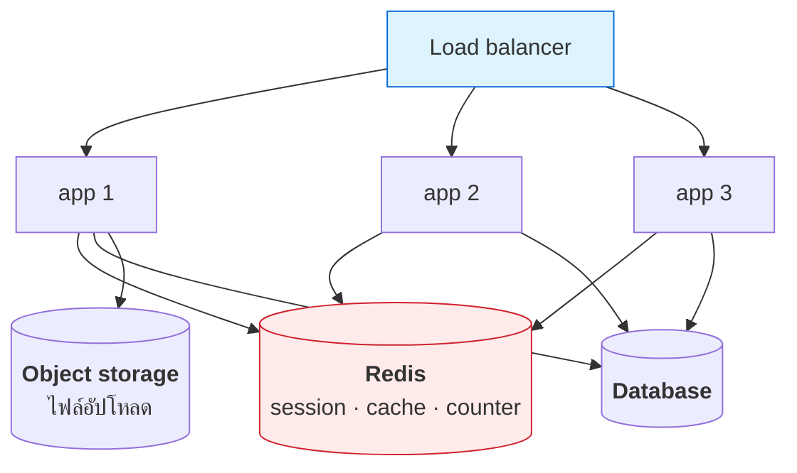

# บทที่ 57 · ขยายระบบออกหลายเครื่อง

> คำถามที่ดูง่ายแต่ตอบยาก: **"พอมีเครื่องที่สอง อะไรพัง"**
>
> คำตอบ: **ทุกอย่างที่คุณเผลอเก็บไว้ในหน่วยความจำของเครื่องเดียว**

## 57.1 เพิ่มเครื่องเป็นทางเลือกสุดท้าย ไม่ใช่ทางแรก {#s57-1}

```
1. หา query ที่ช้า ใส่ index          (บทที่ 27 — วัดได้ 271 เท่า)
2. แคชสิ่งที่คำนวณซ้ำ
3. ย้ายงานหนักไปคิว                   (บทที่ 56)
4. เพิ่มสเปกเครื่อง (scale up)
5. ค่อยเพิ่มจำนวนเครื่อง (scale out)  ← ยากที่สุด แพงที่สุด
```

**ข้อ 5 เพิ่มความซับซ้อนถาวร** — พอมีหลายเครื่องแล้ว ทุกฟีเจอร์หลังจากนั้น
ต้องคิดเรื่อง "แล้วถ้าคนละเครื่องล่ะ" ตลอดไป

> เครื่องเดียวสมัยนี้แรงกว่าที่คนคิดมาก — 32 core / 128 GB รับงานได้เยอะมาก
> **อย่าเพิ่ง scale out เพราะเห็นบริษัทใหญ่เขาทำกัน**

## 57.2 ตัวที่พังทันทีที่มีเครื่องที่สอง {#s57-2}

| เก็บไว้ในหน่วยความจำเครื่องเดียว | พังยังไง |
|---|---|
| **session** | ผู้ใช้ login ที่เครื่อง A แล้ว request ถัดไปไปเครื่อง B → หลุด |
| **cache** | เครื่อง A แคชไว้ เครื่อง B ไม่รู้ → ข้อมูลไม่ตรงกัน |
| **rate limit counter** | นับแยกกัน → 3 เครื่อง = โควตาคูณ 3 |
| **ไฟล์ที่ผู้ใช้อัปโหลด** | อัปที่ A ดาวน์โหลดจาก B ไม่เจอ |
| **scheduled job** | รันพร้อมกันทุกเครื่อง → อีเมลถูกส่ง 3 รอบ |
| WebSocket connection | ผู้ใช้ต่อกับ A แต่ event เกิดที่ B |

**สามข้อแรกเจอกันแทบทุกคน** และมักเจอตอน deploy เครื่องที่สองไปแล้ว

```
โควตา 100 req/นาที · 3 เครื่อง · นับในหน่วยความจำ
  → ผู้ใช้ยิงได้จริง 300 req/นาที
```

## 57.3 หลักการเดียวที่แก้ได้ทั้งหมด — stateless {#s57-3}

```
❌ Stateful : เครื่องจำอะไรบางอย่างที่เครื่องอื่นไม่รู้
✅ Stateless: ทุกเครื่องเหมือนกันหมด · state อยู่ข้างนอก
```



**"เครื่องแอปทุกตัวต้องถูกฆ่าทิ้งแล้วสร้างใหม่ได้ตลอดเวลาโดยไม่มีใครรู้สึก"**
— ถ้าทำข้อนี้ได้ scale out, deploy, ย้ายเครื่อง จะง่ายไปหมด

## 57.4 Sticky session — ทางลัดที่กลายเป็นกับดัก {#s57-4}

ทางแก้ที่ทุกคนคิดถึงก่อน: ให้ LB ส่งผู้ใช้คนเดิมไปเครื่องเดิมเสมอ

```nginx
upstream app { ip_hash; server a; server b; }   # ← ทางลัด
```

| ได้ | เสีย |
|-----|------|
| ไม่ต้องแก้โค้ด | 🔴 **เครื่องดับ = ผู้ใช้กลุ่มนั้นหลุดหมด** |
| | 🔴 โหลดไม่สมดุล — เครื่องหนึ่งเต็ม อีกเครื่องว่าง |
| | 🔴 deploy ทีไรผู้ใช้หลุดทุกที |
| | 🔴 scale ออกไม่ช่วย เพราะคนเดิมยังไปเครื่องเดิม |

**sticky session ซ่อนปัญหาไว้แทนที่จะแก้** — วันที่เครื่องดับจริงคุณจะได้รู้ว่า
มันไม่เคยหายไปไหน

> **ยกเว้นกรณีเดียวที่ sticky มีเหตุผล: LLM ที่ใช้ prefix caching**
> ส่งบทสนทนาเดิมไปเครื่องเดิมเพื่อใช้ KV cache ซ้ำ ([บทที่ 48](48-serving-llm.md)) —
> ตรงนี้ sticky เป็นการ**ปรับให้เร็วขึ้น** ไม่ใช่การซ่อนปัญหา state

## 57.5 Load balancer — อัลกอริทึมสำคัญกว่าที่คิด {#s57-5}

| อัลกอริทึม | หลักการ | เหมาะกับ |
|---|---|---|
| **Round-robin** | วนไปทีละเครื่อง | request สั้นและใกล้เคียงกัน |
| **Least connections** | ส่งไปเครื่องที่งานค้างน้อยสุด | request ยาวไม่เท่ากัน |
| Weighted | เครื่องแรงกว่าได้มากกว่า | เครื่องสเปกต่างกัน |
| IP hash | ผูกตาม IP ผู้ใช้ | ⚠️ sticky (ข้อ [57.4](#s57-4)) |

**round-robin เหมาะกับ API ทั่วไป แต่แย่มากกับงานที่ใช้เวลาไม่เท่ากัน**

### Health check คือสิ่งที่ทำให้ LB มีประโยชน์จริง

```nginx
location /health/ready {
    proxy_pass http://app;
}
```

| ชนิด | ตอบว่าอะไร | LB ควรใช้ตัวไหน |
|------|-----------|-----------------|
| `/health/live` | โปรเซสยังไม่ค้าง | ให้ orchestrator รีสตาร์ท |
| **`/health/ready`** | **พร้อมรับ traffic ไหม** | ✅ **ตัวนี้** |

**ความต่างสำคัญมาก** ([บทที่ 28](28-observability-and-deployment.md)) — ตอนเครื่องกำลังโหลดโมเดลหรือ warm cache
มันยัง `live` แต่ยังไม่ `ready` ถ้า LB ส่งงานมาตอนนั้นผู้ใช้จะเจอ error

> **graceful shutdown ต้องมาคู่กัน** — ตอน deploy เครื่องต้องบอก LB ว่า
> "ไม่ต้องส่งงานมาแล้ว" ก่อน แล้วทำงานที่ค้างให้จบ ค่อยดับ ไม่งั้นทุก deploy
> จะมี request ตายกลางทาง

## 57.6 Redis — state ที่ใช้ร่วมกัน {#s57-6}

| ใช้ทำอะไร | ทำไมต้องเป็น Redis |
|---|---|
| **Session store** | เร็ว · หมดอายุเองได้ (`EXPIRE`) |
| **Cache** | ลดภาระฐานข้อมูล |
| **Rate limit counter** | นับรวมทุกเครื่อง (ข้อ [57.2](#s57-2)) |
| **Distributed lock** | ให้ scheduled job รันเครื่องเดียว |
| Queue เบา ๆ | ([บทที่ 56](56-background-jobs-and-queues.md)) |

```python
# rate limit ที่นับรวมทุกเครื่อง — atomic ในคำสั่งเดียว
count = redis.incr(f"rate:{user_id}:{minute}")
if count == 1:
    redis.expire(f"rate:{user_id}:{minute}", 60)
if count > 100:
    return 429
```

**`INCR` เป็น atomic** — ต่อให้ 3 เครื่องเรียกพร้อมกัน ตัวเลขก็ไม่เพี้ยน
ต่างจากการ `GET` แล้ว `SET` ซึ่งจะชนกัน (race condition — [บทที่ 33](33-concurrency-and-async.md))

### กับดักของ Redis ที่ต้องรู้

| กับดัก | ผลที่ตามมา |
|--------|-----------|
| **คิดว่าข้อมูลไม่หาย** | Redis เป็น in-memory — ตั้ง persistence ไม่ถูก = รีสตาร์ทแล้วหาย |
| ใช้เป็นฐานข้อมูลหลัก | ไม่มี transaction แบบ RDBMS |
| **ไม่ตั้ง `maxmemory-policy`** | 🔴 หน่วยความจำเต็มแล้วเขียนไม่ได้เลย |
| lock ที่ไม่มี timeout | เครื่องที่ถือ lock ดับ → ทุกคนค้างตลอดกาล |
| **Redis กลายเป็น SPOF** | Redis ล่ม = ทุกเครื่องล่มพร้อมกัน |

**ข้อสุดท้ายคือสิ่งที่คนมองข้าม** — คุณกระจายแอปออก 3 เครื่องเพื่อความทนทาน
แล้วเอา state ทั้งหมดไปกองไว้ที่ Redis ตัวเดียว **จุดพังเพียงจุดเดียวก็ยังอยู่
แค่ย้ายที่**

### Cache stampede

```
cache หมดอายุพร้อมกัน → 500 request วิ่งไปถามฐานข้อมูลพร้อมกัน → ฐานข้อมูลล่ม
```

**แก้ด้วย:** สุ่ม TTL ไม่ให้หมดพร้อมกัน · ให้ request แรกเท่านั้นที่ไปคำนวณ
(single-flight) ส่วนที่เหลือรอผล — หลักการเดียวกับ single-flight ของ refresh token
ใน[บทที่ 11](11-mobile-api-auth-design.md)

## 57.7 กรณีพิเศษ — API ที่ใช้ GPU {#s57-7}

**GPU ไม่เหมือนเว็บ และการเพิ่ม LB อย่างเดียวจะไม่ช่วย**

```
API ปกติ    : 1 request = ไม่กี่ ms · ไม่ถือทรัพยากร
API ใช้ GPU : 1 request = หลายวินาที · กิน VRAM ตลอดเวลาที่ทำงาน
```

**ความจุถูกกำหนดโดย VRAM ไม่ใช่ CPU** — คำนวณได้จาก[บทที่ 47](47-gpu-memory-and-kv-cache.md)

```
① Queue + admission control    ← สำคัญที่สุด
② Load balancer
③ Continuous batching          ← จัดการหลายคนใน GPU ใบเดียว
④ GPU
```

**ชั้น ③ คือที่คนมองข้าม** — vLLM รับหลาย request พร้อมกันบนการ์ดใบเดียวได้อยู่แล้ว
([บทที่ 48](48-serving-llm.md)) **ไม่ต้องเปิดหลาย process**

```
❌ 4 process × 1 GPU  → แต่ละตัวกิน CUDA context 308 MiB · แย่ง VRAM · batching ใช้ไม่ได้
✅ 1 process × 1 GPU  → batching รวมทุก request ให้เอง
```

### Backpressure — หลักการเดียวที่ต้องจำ

```
รับ 500 คนบนการ์ดที่รับได้ 40
  → ทุกคนรอ 60 วิ → timeout กันหมด → GPU ทำงานเสียเปล่าทั้งหมด

รับ 40 · ที่เหลือเข้าคิว · เกินคิวตอบ 429 + Retry-After
  → 40 คนได้คำตอบใน 3 วิ · ที่เหลือรู้ตัวว่าต้องรอ
```

**ระบบต้องปฏิเสธหรือให้รอ ไม่ใช่รับทุกคนแล้วช้าเท่ากันหมด** — นี่คือความต่าง
ระหว่าง throughput กับ goodput ([บทที่ 51.3](51-gpu-observability-and-cost.md#s51-3))

> ## ลำดับที่ควรทำสำหรับ API ที่ใช้ GPU
>
> ```
> 1. คำนวณความจุจริง         vram_calc.py → รับได้กี่คนพร้อมกัน
> 2. ตั้ง max_num_seqs ตามนั้น  ให้ vLLM ปฏิเสธเองเมื่อเต็ม
> 3. ใส่คิว + 429 + Retry-After
> 4. ค่อยเพิ่มการ์ด + LB
> ```
>
> **ข้อ 4 มาทีหลังสุดเสมอ** — เพิ่มการ์ดก่อนปรับ 3 ข้อแรก คือการจ่ายเงิน
> แก้ปัญหาที่แก้ได้ฟรี

## 57.8 checklist ก่อนเพิ่มเครื่องที่สอง {#s57-8}

- [ ] session อยู่ใน Redis หรือ cookie ที่เซ็นแล้ว ไม่ใช่หน่วยความจำ
- [ ] rate limit counter อยู่ที่ส่วนกลาง
- [ ] ไฟล์อัปโหลดอยู่ใน object storage ไม่ใช่ดิสก์เครื่อง
- [ ] scheduled job มี distributed lock (ไม่งั้นรันซ้ำทุกเครื่อง)
- [ ] มี `/health/ready` แยกจาก `/health/live`
- [ ] graceful shutdown ทำงานจริง — ทดสอบด้วยการ deploy ตอนมี traffic
- [ ] log มี `X-Request-ID` และบอกได้ว่ามาจากเครื่องไหน ([บทที่ 28](28-observability-and-deployment.md))
- [ ] **ทดสอบด้วยการดับเครื่องหนึ่งตัวตอนมีคนใช้จริง** — ถ้าไม่กล้าทดสอบ
      แปลว่ายังไม่พร้อม

## แบบฝึกหัด

1. รันแอปของคุณสองตัวคนละพอร์ต แล้ววาง nginx ข้างหน้า — login แล้ว refresh
   หลาย ๆ ครั้ง หลุดไหม
2. ถ้าหลุด แก้ด้วยการย้าย session ไป Redis แล้วลองใหม่
3. ตั้ง rate limit ในหน่วยความจำ แล้ววัดว่ายิงได้จริงกี่ครั้งเมื่อมี 2 เครื่อง
4. เขียน distributed lock ด้วย `SET key value NX EX 30` — ถ้าเครื่องที่ถือ lock
   ดับ จะเกิดอะไรขึ้น ทำไมต้องมี `EX`
5. ทำ cache stampede ให้เกิดจริง: ตั้ง TTL เท่ากันแล้วยิงพร้อมกัน 100 request
   — ฐานข้อมูลโดนกี่ครั้ง แล้วแก้ด้วย single-flight
6. ตอบตัวเอง: Redis ของคุณล่มตอนนี้ ระบบเหลืออะไรทำงานได้บ้าง (ข้อ [57.6](#s57-6))
7. ถ้าทำ API ที่ใช้ GPU — คำนวณ `max_num_seqs` ที่ถูกต้องด้วย
   [vram_calc.py](../lab/gpu/vram_calc.py) แล้วเทียบกับค่าที่ตั้งไว้จริง

***
[⬅ งานเบื้องหลังและคิวงาน](56-background-jobs-and-queues.md) · [สารบัญ](../README.md) · [Git — อย่าทำงานโดยไม่มีตาข่ายรองรับ ➡](30-git.md)
