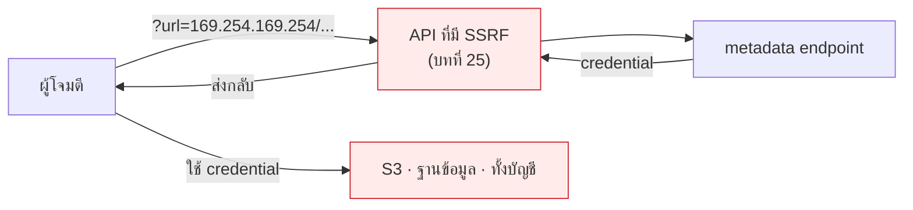

# บทที่ 58 · ความปลอดภัยบนคลาวด์

> [บทที่ 25](25-input-validation-and-injection.md) สอน SSRF ไว้แล้ว **บทนี้จะแสดงว่าช่องโหว่เดิมนั้น
> บนคลาวด์ให้ผลรุนแรงกว่าหลายเท่า** — จากอ่านไฟล์ในเครื่อง กลายเป็นยึดทั้งบัญชี

## 58.1 Shared responsibility — เส้นแบ่งที่คนเข้าใจผิดที่สุด {#s58-1}

```
ผู้ให้บริการดูแล : ฮาร์ดแวร์ · ศูนย์ข้อมูล · hypervisor · เครือข่ายกายภาพ
คุณดูแล          : ข้อมูล · สิทธิ์ · การตั้งค่า · โค้ด · patch ของ OS
```

**"ย้ายขึ้นคลาวด์แล้วปลอดภัยขึ้น" เป็นความเข้าใจผิด** — คุณได้ความปลอดภัยทางกายภาพ
ที่ดีกว่าห้องเซิร์ฟเวอร์ในคณะ แต่**ได้พื้นผิวโจมตีใหม่มาแทน**

| บริการ | ใครดูแล OS | ใครดูแลสิทธิ์ |
|---|---|---|
| VM (EC2, Compute Engine) | **คุณ** | คุณ |
| Container (ECS, Cloud Run) | ผู้ให้บริการ | คุณ |
| Serverless (Lambda) | ผู้ให้บริการ | **คุณ** |
| ฐานข้อมูล managed | ผู้ให้บริการ | **คุณ** |

**สังเกตว่าคอลัมน์ขวาเป็น "คุณ" ทุกแถว** — สิทธิ์คือสิ่งที่ไม่มีใครทำแทนได้
และเป็นที่มาของเหตุการณ์รั่วเกือบทั้งหมด

## 58.2 🔴 SSRF บนคลาวด์ — จากบทที่ 25 สู่การยึดบัญชี {#s58-2}

ทุก VM บนคลาวด์มี **metadata endpoint** ที่ตอบเฉพาะจากในเครื่องเท่านั้น

```bash
# AWS — ที่อยู่นี้เหมือนกันทุกเครื่องทั่วโลก
curl http://169.254.169.254/latest/meta-data/iam/security-credentials/
```

```
AccessKeyId      : ASIA...
SecretAccessKey  : ...
Token            : ...
```

**นั่นคือ credential ของ IAM role ที่เครื่องนั้นถือ** — ใช้ได้ทันทีกับทุกอย่าง
ที่ role นั้นเข้าถึงได้



> ## นี่คือเส้นทางของเหตุการณ์ Capital One (2019)
>
> SSRF ธรรมดาในเว็บแอป → metadata endpoint → credential ของ role →
> อ่าน S3 → **ข้อมูลลูกค้า 100 ล้านราย**
>
> **ช่องโหว่ตั้งต้นคือสิ่งที่[บทที่ 25](25-input-validation-and-injection.md) สอนไปแล้ว** ไม่มีอะไรพิเศษเลย
> สิ่งที่ต่างคือบนคลาวด์มีของมีค่าวางอยู่ที่ปลายทาง

**ทางแก้:**

| ทำอะไร | ผล |
|---|---|
| **บังคับ IMDSv2** (ต้องมี token, ปฏิเสธ GET เปล่า) | ✅ SSRF แบบธรรมดายิงไม่ผ่าน |
| ปิด metadata ถ้าไม่ใช้ | ✅ ดีที่สุด |
| allowlist ปลายทางของ SSRF ([บทที่ 25](25-input-validation-and-injection.md)) | ✅ |
| ให้ role มีสิทธิ์น้อยที่สุด | ✅ จำกัดความเสียหาย |

## 58.3 IAM — least privilege ที่สเกลได้ {#s58-3}

[บทที่ 36](36-permissions-and-isolation.md) สอนหลักการ least privilege บนเครื่องเดียว บนคลาวด์หลักการเดิม
แต่ยากกว่าเพราะมี "ตัวแสดง" เป็นพันและสิทธิ์เป็นหมื่นชนิด

```json
{ "Effect": "Allow", "Action": "s3:*", "Resource": "*" }
```

**นี่คือ policy ที่พบบ่อยที่สุดและอันตรายที่สุด** — มักเกิดจาก "ให้กว้างไว้ก่อน
เดี๋ยวค่อยแคบทีหลัง" ซึ่งไม่เคยมีใครกลับมาทำ

```json
{
  "Effect": "Allow",
  "Action": ["s3:GetObject"],
  "Resource": "arn:aws:s3:::my-bucket/uploads/*"
}
```

| กฎ | เหตุผล |
|---|---|
| ระบุ action เจาะจง ไม่ใช้ `*` | `s3:*` รวม `DeleteBucket` ด้วย |
| ระบุ resource เจาะจง | จำกัดว่าแตะอะไรได้ |
| **ใช้ role ไม่ใช่ access key ถาวร** | key ถาวรรั่วแล้วใช้ได้ตลอดกาล |
| ตรวจสิทธิ์ที่ไม่เคยถูกใช้ | AWS Access Analyzer บอกได้ |

> ## 🔴 access key ถาวรใน git คือเหตุรั่วอันดับหนึ่ง
>
> บอตสแกน GitHub หา `AKIA...` ตลอดเวลา — **มีคนโดนขุดบิตคอยน์ด้วยบัญชีตัวเอง
> ภายในไม่กี่นาทีหลัง commit**
>
> [บทที่ 30](30-git.md) บอกว่า secret ที่ commit แล้วอยู่ในประวัติตลอดกาล
> [บทที่ 55](55-ci-cd.md) บอกให้ CI สแกนหา — สองบทนั้นมีอยู่เพราะเรื่องนี้
>
> **ถ้าหลุดแล้ว: เพิกถอนก่อน แล้วค่อยลบออกจากประวัติ** ลำดับสลับไม่ได้

## 58.4 การตั้งค่าผิดที่ทำให้ข้อมูลรั่วบ่อยที่สุด {#s58-4}

**เกือบทุกข่าว "ข้อมูลรั่วบนคลาวด์" ไม่ใช่การถูกแฮ็ก แต่คือการตั้งค่าผิด**

- [ ] **bucket เปิดสาธารณะ** โดยไม่ตั้งใจ — เปิดให้ CDN แล้วลืมปิด
- [ ] ฐานข้อมูลเปิด public IP ไม่มี firewall
- [ ] security group เปิด `0.0.0.0/0` ที่พอร์ต 22 หรือ 3306
- [ ] snapshot/backup ที่แชร์สาธารณะ
- [ ] log ที่มีข้อมูลส่วนบุคคล เก็บไว้ในที่ที่ทุกคนอ่านได้ ([บทที่ 28](28-observability-and-deployment.md))
- [ ] ไม่เปิด encryption at rest ทั้งที่กดปุ่มเดียว

```bash
# ตรวจ bucket ที่เปิดสาธารณะ
aws s3api get-public-access-block --bucket my-bucket
aws s3api get-bucket-policy-status --bucket my-bucket
```

> **เปิด "Block Public Access" ระดับบัญชี** เป็นสิ่งแรกที่ควรทำ —
> มันกันการเผลอเปิดทีละ bucket ได้ทั้งหมดในคำสั่งเดียว

## 58.5 คลาวด์เปลี่ยนวิธีคิดเรื่องเครือข่าย {#s58-5}

| on-prem | คลาวด์ |
|---|---|
| firewall ที่ขอบเครือข่าย | **security group ติดกับทุก resource** |
| VLAN | VPC + subnet |
| "ข้างในเชื่อถือได้" | 🔴 **สมมติแบบนี้ไม่ได้แล้ว** |

**หลักการที่เปลี่ยนไป: ไม่มี "ข้างใน" ที่ปลอดภัยอีกต่อไป** — service ทุกตัว
ต้องยืนยันตัวตนต่อกัน แม้อยู่ใน VPC เดียวกัน (zero trust)

```
❌ "อยู่ใน VPC เดียวกัน ไม่ต้อง auth"
✅ ทุก request มี identity เสมอ แม้ภายใน
```

เหตุผลตรงกับ[บทที่ 34](34-threat-modeling.md): **ผู้โจมตีที่เข้ามาได้แล้วหนึ่งจุด จะเคลื่อนที่ต่อ**
(lateral movement) ถ้าข้างในไม่มีการตรวจ เขาก็เดินได้ทั้งระบบ

## 58.6 Secret บนคลาวด์ {#s58-6}

```
❌ hard-code ในโค้ด          → บทที่ 30
❌ environment variable ถาวร  → หลุดใน log/crash dump ได้
🟡 ไฟล์ที่ mount เข้ามา       → ดีขึ้น
✅ secret manager + หมุนอัตโนมัติ
```

**สิ่งที่ secret manager ให้ที่วิธีอื่นให้ไม่ได้: การหมุนโดยไม่ต้อง deploy**
และ **log ว่าใครอ่าน secret ไปเมื่อไร** — ซึ่งสำคัญมากตอนสืบสวนเหตุ ([บทที่ 61](61-digital-forensics.md))

## 58.7 ต้นทุนก็เป็นความเสี่ยง {#s58-7}

เรื่องที่ on-prem ไม่มี — **บนคลาวด์ ช่องโหว่แปลงเป็นค่าใช้จ่ายได้โดยตรง**

```
key รั่ว → ผู้โจมตีเปิด GPU instance ขุดเหรียญ → บิลหลักแสนใน 2 วัน
```

- [ ] ตั้ง budget alert **ก่อน** เปิดใช้บริการใด ๆ
- [ ] จำกัด region และชนิด instance ที่เปิดได้ผ่าน policy
- [ ] alert เมื่อมี resource เกิดในที่ที่ไม่ควรมี

**หลักการเดียวกับ backpressure ใน[บทที่ 57](57-scaling-out.md)** — ระบบต้องมีเพดาน
ไม่ใช่ปล่อยให้โตจนพัง

## 58.8 checklist ก่อนขึ้นคลาวด์ {#s58-8}

- [ ] เปิด MFA ที่บัญชี root และ**ห้ามใช้ root ทำงานประจำ**
- [ ] ไม่มี access key ถาวรในโค้ดหรือ CI — ใช้ role/OIDC
- [ ] บังคับ IMDSv2 ทุก instance
- [ ] Block Public Access ระดับบัญชี
- [ ] encryption at rest เปิดทุกที่ที่เปิดได้
- [ ] เปิด audit log (CloudTrail) และ**เก็บไว้ในบัญชีแยก**
- [ ] budget alert ตั้งแล้ว
- [ ] มีคนรู้วิธีเพิกถอน credential ตอนตีสาม

> **ข้อ audit log ในบัญชีแยกสำคัญกว่าที่คิด** — ถ้าผู้โจมตียึดบัญชีได้
> สิ่งแรกที่เขาทำคือลบ log ([บทที่ 39](39-how-malware-works.md) เรื่องการปกปิดร่องรอย)

## แบบฝึกหัด

1. เปิดบัญชีทดลองฟรี แล้วลอง `curl http://169.254.169.254/latest/meta-data/`
   จากใน VM — ได้อะไรบ้าง แล้วเปิด IMDSv2 ลองใหม่
2. เขียน IAM policy ที่ให้อ่านไฟล์ได้เฉพาะโฟลเดอร์เดียวใน bucket เดียว
3. ตรวจ repo ของคุณด้วย `gitleaks` — มี key หลงเหลือไหม
4. ตอบตัวเอง: ถ้า access key ของคุณหลุดตอนนี้ ผู้โจมตีทำอะไรได้บ้าง
   และคุณจะรู้ตัวได้อย่างไร
5. ตั้ง budget alert ที่ 100 บาท แล้วดูว่ามันแจ้งเตือนจริงไหม
6. เทียบ: ระบบ on-prem ของคุณ ([บทที่ 45](45-home-lab.md)) กับบนคลาวด์ อะไรที่คุณ
   ต้องดูแลเพิ่มขึ้น อะไรที่ลดลง

***
[⬅ Supply chain security](42-supply-chain-security.md) · [สารบัญ](../README.md) · [ออกแบบเครือข่ายให้ป้องกันได้ ➡](59-network-defense.md)
