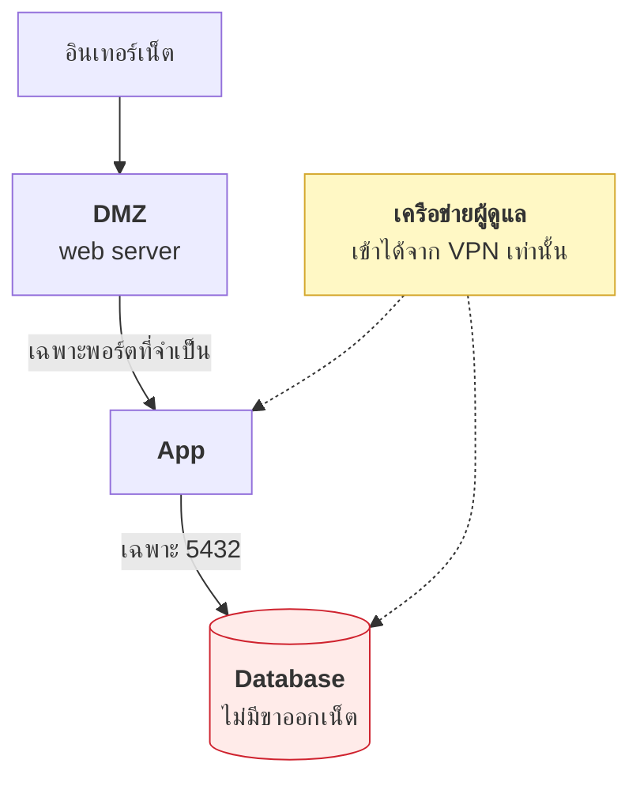

# บทที่ 59 · ออกแบบเครือข่ายให้ป้องกันได้

> [บทที่ 31](31-tcpip-and-tcpdump.md) สอน**ดู** packet · บทนี้สอน**กั้น** packet
> และสอนไล่ว่า **"ทำไมต่อไม่ติด"** — คำถามที่เสียเวลาที่สุดในงานระบบ

## 59.1 หลักการเดียว — สมมติว่าข้างในถูกเจาะแล้ว {#s59-1}

```
❌ แบบเก่า: firewall ที่ขอบ · ข้างในเชื่อใจกันหมด
✅ แบบใหม่: ทุกจุดตรวจ · ข้างในก็ไม่เชื่อ
```

**ทำไมแบบเก่าใช้ไม่ได้แล้ว** — ผู้โจมตีเข้ามาทางอีเมลของพนักงานคนเดียว
แล้วเขาก็อยู่ "ข้างใน" ทันที firewall ที่ขอบไม่ได้ช่วยอะไรเลย

นี่คือเหตุผลของ **network segmentation** — แบ่งเครือข่ายเป็นส่วน ๆ เพื่อให้
คนที่เข้ามาได้จุดหนึ่ง **เดินต่อไม่ได้** (จำกัด lateral movement)



**ข้อที่คนลืมบ่อยที่สุด: ฐานข้อมูลไม่ควรออกอินเทอร์เน็ตได้** — ไม่มีเหตุผลที่
ฐานข้อมูลต้องเรียก `curl` ออกไปข้างนอก และถ้ามันทำได้ นั่นคือทางที่ข้อมูลจะถูกส่งออก

## 59.2 ศัพท์ทิศทางที่ทำให้งง — ingress, egress, N-S, E-W {#s59-ingress}

คำพวกนี้โผล่ในเอกสาร firewall/cloud/k8s ตลอด และสับสนเพราะมันแค่บอก **"ทิศทาง
ของ traffic"** จากมุมมองของสิ่งที่กำลังพูดถึง

```
        ┌─────────────────────────┐
  ─────►│      ระบบของคุณ          │─────►
ingress │   (เซิร์ฟเวอร์/เครือข่าย) │ egress
เข้ามา  └─────────────────────────┘ ออกไป
```

| คำ | แปลว่า | ตัวอย่าง |
|---|---|---|
| **Ingress** | traffic **เข้ามา** หาระบบ | ผู้ใช้เปิดเว็บคุณ |
| **Egress** | traffic **ออกไป** จากระบบ | เซิร์ฟเวอร์เรียก API ภายนอก |

**มุมมองเป็นตัวกำหนด** — request เดียวกันเป็น egress ของเครื่องผู้ใช้
และเป็น ingress ของเซิร์ฟเวอร์คุณ **"เข้า/ออก ของใคร" ต้องถามก่อนเสมอ**

### อีกคู่ — north-south กับ east-west

```
         อินเทอร์เน็ต (ผู้ใช้)
              │  ▲
   North-South │  │   ← traffic เข้า/ออกจากภายนอก
              ▼  │
        ┌─────────────┐   East-West   ┌─────────────┐
        │  Service A   │◄─────────────►│  Service B   │
        └─────────────┘  (ภายในต่อภายใน) └─────────────┘
```

| คำ | คือ | ทำไมสำคัญ |
|---|---|---|
| **North-South** | ภายนอก ⇄ ภายใน (ผู้ใช้ ↔ ระบบ) | firewall ขอบเดิมเฝ้าตรงนี้ |
| **East-West** | ภายใน ⇄ ภายใน (service ↔ service) | 🔴 **จุดที่คนลืมเฝ้า** |

> ## ทำไม east-west คือจุดอ่อน
>
> firewall แบบเก่าเฝ้าแต่ north-south (ขอบเครือข่าย) — พอผู้โจมตีเข้ามาได้
> หนึ่งจุด เขาเดินในแนว east-west จาก service หนึ่งไปอีก service ได้อิสระ
> เพราะ**ไม่มีใครเฝ้า traffic ภายใน** (ตรงกับข้อ [59.1](#s59-1) เรื่อง lateral movement)
>
> นี่คือเหตุผลที่ zero trust ([บทที่ 58.5](58-cloud-security.md#s58-5)) บอกว่า **ต้องเฝ้า
> east-west ด้วย** ไม่ใช่แค่ขอบ

### สรุป — เรื่องนี้เชื่อมกับ "กั้นขาออก" ยังไง

**การกั้น egress คือการควบคุมทิศ "ออก"** ที่แทบไม่มีใครทำ — และเป็นสิ่งที่
บทนี้ย้ำ เพราะมัลแวร์ต้องใช้ egress เพื่อติดต่อ C2 ([บทที่ 39](39-how-malware-works.md)) และส่ง
ข้อมูลออก ([บทที่ 62.6](62-anonymity-and-tunneling.md#s62-6) DNS tunneling)

## 59.3 Firewall บน Linux — nftables {#s59-2}

Ubuntu สมัยใหม่ใช้ **nftables** อยู่ข้างล่าง ส่วน `ufw` และ `iptables` เป็นหน้ากาก

```bash
sudo nft list ruleset          # ดูกฎจริงทั้งหมด
sudo ufw status verbose        # มุมมองที่อ่านง่ายกว่า
```

```bash
# ตัวอย่างจากคลัสเตอร์จริง — เปิดให้เฉพาะเครื่องในกลุ่มคุยกันเอง
sudo ufw allow from 10.10.182.108
sudo ufw allow 8000/tcp        # JupyterHub
sudo ufw default deny incoming
```

| หลัก | เหตุผล |
|---|---|
| **default deny ขาเข้า** | เปิดเฉพาะที่ต้องการ ไม่ใช่ปิดเฉพาะที่กลัว |
| ระบุ source ไม่ใช่แค่พอร์ต | `allow 22` = ทั้งโลก SSH ได้ |
| **พิจารณา default deny ขาออกด้วย** | กัน C2 และการส่งข้อมูลออก ([บทที่ 39](39-how-malware-works.md)) |
| เขียนกฎเป็นไฟล์/IaC | กฎที่พิมพ์มือหายตอนติดตั้งใหม่ |

> **ขาออกคือสิ่งที่แทบไม่มีใครกั้น** — มัลแวร์ทุกตัวต้องติดต่อกลับ C2
> ถ้าเซิร์ฟเวอร์ออกเน็ตได้แค่ไปยัง apt mirror ที่กำหนด beacon ก็ไปไม่ถึงปลายทาง

## 59.4 🔍 ไล่ว่า packet ถูกตัดตรงไหน {#s59-3}

**คำถามที่เสียเวลาที่สุด: "ต่อไม่ติด แต่ไม่รู้ว่าติดที่ไหน"**

ไล่จากล่างขึ้นบน — แต่ละขั้นตัดความเป็นไปได้ออกครึ่งหนึ่ง

```bash
# 1. ปลายทางมีตัวตนไหม (ชั้น IP)
ping -c2 10.10.182.108

# 2. พอร์ตเปิดรออยู่ไหม (ชั้น TCP)
nc -zv 10.10.182.108 8000

# 3. ฝั่งเราส่งออกไปจริงไหม / ปลายทางตอบอะไรกลับ
sudo tcpdump -ni any host 10.10.182.108 and port 8000

# 4. บริการฟังอยู่ที่ interface ไหน  ← พลาดกันบ่อยมาก
ss -lntp | grep 8000
```

**อ่านผลจาก tcpdump ให้เป็น — สามอาการนี้บอกสาเหตุคนละอย่าง:**

| เห็นอะไร | แปลว่า |
|---|---|
| ส่ง `SYN` ออกไป **ไม่มีอะไรตอบเลย** | 🔴 มี firewall **DROP** ทิ้งเงียบ ๆ ระหว่างทาง |
| ได้ `RST` กลับมาทันที | ไม่มีบริการฟังพอร์ตนั้น (หรือ firewall ตั้ง `REJECT`) |
| `SYN` → `SYN-ACK` → ต่อติด | เครือข่ายไม่ใช่ปัญหา — ปัญหาอยู่ที่ชั้นแอป |

> ## `DROP` กับ `REJECT` ต่างกันตรงนี้
>
> - `REJECT` ตอบกลับว่า "ไม่รับ" → ผู้เชื่อมต่อรู้ผลทันที
> - `DROP` เงียบสนิท → ผู้เชื่อมต่อ**รอจนหมดเวลา**
>
> `DROP` ทำให้การสแกนช้าลงมาก จึงนิยมใช้กับขาที่ติดอินเทอร์เน็ต
> **แต่ในเครือข่ายภายในให้ใช้ `REJECT`** ไม่งั้นทีมคุณจะเสียเวลาไล่หาสาเหตุ
> ทุกครั้งที่ตั้งกฎผิด

**ข้อ 4 คือสาเหตุที่พบบ่อยที่สุดและไม่เกี่ยวกับ firewall เลย:**

```
127.0.0.1:8000    ← ฟังแค่ในเครื่อง เครื่องอื่นต่อไม่ได้แน่นอน
0.0.0.0:8000      ← ฟังทุก interface
10.10.182.107:8000 ← ฟังเฉพาะ IP นั้น
```

## 59.5 IDS/IPS — ตรวจจับสิ่งที่ผ่าน firewall เข้ามาแล้ว {#s59-4}

firewall ตอบได้แค่ "อนุญาตหรือไม่" **IDS ตอบว่า "traffic ที่อนุญาตนั้นน่าสงสัยไหม"**

| | ทำอะไร | วางตรงไหน |
|---|---|---|
| **IDS** | ตรวจแล้วแจ้งเตือน | ดูสำเนา traffic |
| **IPS** | ตรวจแล้วบล็อกเลย | คั่นกลางทาง |

```bash
sudo apt install suricata
sudo suricata -i eth0 -c /etc/suricata/suricata.yaml
tail -f /var/log/suricata/fast.log
```

**สิ่งที่ IDS จับได้ดีและ firewall จับไม่ได้:** การสแกนพอร์ต · payload ที่ตรง
กับ signature ที่รู้จัก · **การติดต่อไปยัง C2 ที่รู้จัก** · DNS ที่ผิดปกติ

> ## ⚠️ IDS ที่ไม่มีคนดู = ไฟล์ log ที่กินดิสก์
>
> ปัญหาจริงของ IDS ไม่ใช่การตรวจไม่เจอ แต่คือ **false positive ท่วม**
> จนไม่มีใครอ่าน แล้ววันที่ของจริงมาก็ไม่มีใครเห็น
>
> เป็นอาการเดียวกับ CI ที่แดงตลอดใน[บทที่ 55](55-ci-cd.md) — **สัญญาณเตือนที่ดังตลอดเวลา
> เท่ากับไม่มีสัญญาณเตือน**
>
> เริ่มจาก rule ชุดเล็กที่คุณเข้าใจทุกข้อ ดีกว่าเปิดหมดแล้วไม่อ่านเลย

## 59.6 การเฝ้าดูที่ได้ผลจริงโดยไม่ต้องมี IDS {#s59-5}

สำหรับทีมเล็ก สิ่งเหล่านี้ให้ผลตอบแทนสูงกว่าการติดตั้ง IDS เต็มรูปแบบ

| เฝ้าอะไร | จับอะไรได้ |
|---|---|
| **การเชื่อมต่อขาออกที่ไม่เคยมีมาก่อน** | มัลแวร์ติดต่อ C2 |
| DNS query ไปโดเมนแปลก ๆ | ทางเดียวกัน ([บทที่ 41](41-detection-and-response.md)) |
| login สำเร็จนอกเวลางาน / จาก IP แปลก | บัญชีถูกยึด |
| **บริการที่เปิดพอร์ตใหม่โดยไม่มีใครสั่ง** | backdoor |

```bash
# ทำเป็นงานประจำวัน แล้วเทียบกับเมื่อวาน
ss -lntup | sort > /var/log/ports-$(date +%F).txt
diff /var/log/ports-$(date -d yesterday +%F).txt /var/log/ports-$(date +%F).txt
```

**ความง่ายคือข้อดี** — `diff` สองไฟล์บอกได้ว่ามีพอร์ตใหม่เปิดขึ้น ซึ่งเป็น
สัญญาณที่ตรงและมี false positive ต่ำมาก

## 59.7 ⚠️ ระวังการล็อกตัวเองออก {#s59-6}

**ทุกคนที่ทำงาน firewall ทางไกลเคยล็อกตัวเองออกอย่างน้อยหนึ่งครั้ง**

```bash
# ตั้งตัวกู้ไว้ก่อนแก้กฎ — ถ้าพลาด ระบบคืนค่าเองใน 5 นาที
sudo systemd-run --on-active=300 --unit=fw-rollback \
  nft flush ruleset

# ค่อยแก้กฎ แล้วทดสอบว่ายังเข้าได้
# ถ้าใช้ได้ → ยกเลิกตัวกู้
sudo systemctl stop fw-rollback.timer
```

**หลักการ: ตั้งทางถอยก่อนเสมอ** ใช้ได้กับทุกการเปลี่ยนแปลงที่อาจตัดการเชื่อมต่อ
ตัวเอง — routing, firewall, SSH config

## แบบฝึกหัด

1. รัน `sudo nft list ruleset` บนเครื่องที่มี ufw — กฎที่ ufw สร้างหน้าตาเป็นยังไง
2. ตั้ง `ufw deny out 443` แล้วลอง `curl https://example.com`
   — เห็นอะไรใน `tcpdump` (ข้อ [59.4](#s59-3))
3. เทียบ `DROP` กับ `REJECT`: ตั้งอย่างละพอร์ต แล้ววัดว่า `nc -zv` ใช้เวลาต่างกันเท่าไร
4. หาบริการในเครื่องที่ฟัง `0.0.0.0` ทั้งที่ควรฟังแค่ `127.0.0.1`
5. ทำสคริปต์เทียบพอร์ตที่เปิดวันนี้กับเมื่อวาน (ข้อ [59.6](#s59-5)) แล้วตั้งเป็น cron
6. วาดผังเครือข่ายของระบบคุณ แล้วตอบว่าฐานข้อมูลออกอินเทอร์เน็ตได้ไหม —
   ถ้าได้ ทำไมถึงต้องได้
7. ฝึกตั้งตัวกู้อัตโนมัติในข้อ [59.7](#s59-6) แล้วจงใจตั้งกฎผิด — ระบบคืนค่าเองไหม

***
[⬅ ความปลอดภัยบนคลาวด์](58-cloud-security.md) · [สารบัญ](../README.md) · [GPU 101 ➡](46-gpu-101.md)
