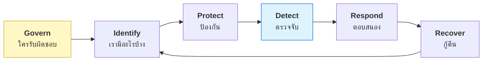

# บทที่ 60 · ความเสี่ยง มาตรฐาน และการปฏิบัติตามกฎ

> ทั้งเล่มนี้สอนภาษาของเครื่อง **บทนี้สอนภาษาที่ใช้คุยกับผู้บริหาร ผู้ตรวจสอบ
> และฝ่ายจัดซื้อ** — ซึ่งเป็นคนที่อนุมัติงบให้คุณ
>
> [บทที่ 43](43-security-roles-and-paths.md) บอกว่าการโน้มน้าวคนอื่นสำคัญกว่าทักษะเทคนิค บทนี้คือภาษานั้น

## 60.1 ทำไมคนเทคนิคควรรู้เรื่องนี้ {#s60-1}

```
คุณ            : "ระบบนี้มี SQL injection ต้องแก้ด่วน"
ผู้บริหาร      : "มันกระทบอะไร ใช้งบเท่าไร เรื่องอื่นรอได้ไหม"
                  ↑
            คำถามที่ตอบด้วยภาษาเทคนิคไม่ได้
```

**GRC = Governance, Risk, Compliance** — ไม่ใช่งานเอกสารไร้สาระ แต่เป็นวิธี
**จัดลำดับว่าจะแก้อะไรก่อน** ในโลกที่ทรัพยากรมีจำกัด

| ถ้าไม่รู้เรื่องนี้ | ผลที่เกิด |
|---|---|
| เสนอแก้ทุกอย่างพร้อมกัน | ไม่ได้งบสักอย่าง |
| อธิบายเป็นศัพท์เทคนิค | ผู้ฟังไม่เข้าใจ = ไม่อนุมัติ |
| ไม่มีเกณฑ์จัดลำดับ | แก้เรื่องที่เสียงดังที่สุด ไม่ใช่เรื่องที่เสี่ยงที่สุด |

## 60.2 ความเสี่ยง = โอกาส × ผลกระทบ {#s60-2}

```
ความเสี่ยง = โอกาสที่จะเกิด × ความเสียหายถ้าเกิด
```

**ประโยชน์ของสูตรนี้คือมันบังคับให้เปรียบเทียบได้**

| ช่องโหว่ | โอกาส | ผลกระทบ | ความเสี่ยง |
|---|---|---|---|
| SQL injection ในหน้า login | สูง | ข้อมูลทั้งฐาน | 🔴 **สูงมาก** |
| XSS ในหน้าที่มีแต่แอดมิน 2 คนเข้า | ต่ำ | ปานกลาง | 🟡 กลาง |
| ช่องโหว่ที่ต้องเข้าห้องเซิร์ฟเวอร์ก่อน | ต่ำมาก | สูง | 🟢 ต่ำ |

**แถวสุดท้ายคือจุดที่คนเทคนิคมักเถียงกับฝ่ายบริหาร** — ช่องโหว่ที่ *รุนแรง*
แต่ *เกิดยาก* อาจไม่ควรแก้ก่อนช่องโหว่ที่ธรรมดากว่าแต่เกิดง่าย

> ## 4 ทางเลือกต่อความเสี่ยง — ไม่ใช่มีแค่ "แก้"
>
> | ทางเลือก | เมื่อไร | ตัวอย่าง |
> |---|---|---|
> | **ลด** (mitigate) | แก้ได้คุ้ม | ใส่ parameterized query |
> | **โอน** (transfer) | มีคนรับแทนได้ | ประกันไซเบอร์ · จ้าง managed service |
> | **ยอมรับ** (accept) | ต้นทุนแก้ > ความเสียหาย | ระบบที่จะปลดใน 3 เดือน |
> | **เลี่ยง** (avoid) | ไม่คุ้มจะทำ | ปิดฟีเจอร์นั้นไปเลย |
>
> **"ยอมรับความเสี่ยง" เป็นคำตอบที่ถูกต้องได้** — แต่ต้องเป็นการตัดสินใจ
> ที่บันทึกไว้ว่าใครยอมรับ ไม่ใช่การเพิกเฉยแล้วแกล้งลืม

## 60.3 NIST CSF — โครงที่ใช้ได้ทันทีโดยไม่ต้องขอใบรับรอง {#s60-3}

**Cybersecurity Framework ของ NIST** แบ่งงานความปลอดภัยเป็น 5 ฟังก์ชัน
(ฉบับ 2.0 เพิ่ม Govern เป็นข้อที่ 6)



**ใช้เป็น checklist ตรวจตัวเองได้เลย** — และหนังสือเล่มนี้ตรงกับฟังก์ชันไหนบ้าง:

| ฟังก์ชัน | คำถามที่ต้องตอบ | บทในเล่มนี้ |
|---|---|---|
| **Identify** | เรามีระบบอะไร ข้อมูลอะไร สำคัญแค่ไหน | [34](34-threat-modeling.md) |
| **Protect** | กันไว้ยังไง | [24](24-authorization-and-bola.md), [25](25-input-validation-and-injection.md), [36](36-permissions-and-isolation.md), [59](59-network-defense.md) |
| **Detect** | จะรู้ได้ยังไงว่าโดน | [28](28-observability-and-deployment.md), [41](41-detection-and-response.md), [59](59-network-defense.md) |
| **Respond** | เกิดแล้วทำอะไร | [41](41-detection-and-response.md) |
| **Recover** | กลับมาให้บริการยังไง | [55](55-ci-cd.md) (ย้อน deploy), backup |

> **ลองตอบทั้ง 5 ข้อสำหรับระบบของคุณตอนนี้** — ข้อที่ตอบไม่ได้เลยคือช่องว่างจริง
> องค์กรส่วนใหญ่แข็งที่ Protect และอ่อนที่ **Detect** อย่างชัดเจน

## 60.4 มาตรฐานที่ควรรู้จักชื่อ {#s60-4}

| มาตรฐาน | คืออะไร | ใครต้องมี |
|---|---|---|
| **ISO/IEC 27001** | ระบบบริหารความมั่นคงสารสนเทศ (ISMS) — **ขอใบรับรองได้** | องค์กรที่ลูกค้าเรียกร้อง |
| **NIST CSF** | โครงคิด ไม่มีใบรับรอง | ใครก็ใช้ได้ฟรี |
| **CIS Controls** | 18 มาตรการเรียงตามลำดับความสำคัญ | ✅ **เริ่มที่นี่ถ้าไม่รู้จะเริ่มตรงไหน** |
| **OWASP Top 10** | ช่องโหว่เว็บที่พบบ่อย | คนทำเว็บทุกคน |
| **PCI DSS** | บังคับถ้าแตะข้อมูลบัตรเครดิต | ร้านค้าออนไลน์ |

> **CIS Controls เรียงมาให้แล้วว่าอะไรควรทำก่อน** — เริ่มจาก 6 ข้อแรก
> (รู้ว่ามีอุปกรณ์/ซอฟต์แวร์อะไร · จัดการสิทธิ์ · ตั้งค่าให้ปลอดภัย · เก็บ log)
> ก็ได้ผลมากกว่าการซื้อเครื่องมือแพง ๆ มาวาง

## 60.5 PDPA — กฎหมายไทยที่คนทำระบบต้องรู้ {#s60-5}

[บทที่ 22](22-ethics-and-limits.md) พูดถึง พ.ร.บ. คอมพิวเตอร์ฯ ไปแล้ว **แต่ยังมีอีกฉบับที่กระทบ
คนทำระบบมากกว่า** — พ.ร.บ. คุ้มครองข้อมูลส่วนบุคคล (PDPA)

| หลักการ | แปลเป็นงานเทคนิค |
|---|---|
| **เก็บเท่าที่จำเป็น** | อย่าเก็บ field ที่ไม่ได้ใช้ · อย่า log ทุกอย่าง |
| **บอกวัตถุประสงค์** | เก็บไปทำอะไร ต้องบอกล่วงหน้า |
| **สิทธิ์เจ้าของข้อมูล** | ต้องมีทางให้เขาขอดู แก้ไข และ**ลบ** |
| **แจ้งเหตุรั่วภายใน 72 ชม.** | ต้องรู้ตัวก่อนถึงจะแจ้งได้ → ต้องมี Detect ([60.3](#s60-3)) |
| **ความปลอดภัยที่เหมาะสม** | เข้ารหัส · จำกัดสิทธิ์ · เก็บ log การเข้าถึง |

> ## ข้อที่กระทบสถาปัตยกรรมมากที่สุด: สิทธิ์ในการลบ
>
> **"ลบข้อมูลผู้ใช้คนนี้ให้หมด" ทำได้จริงไหมในระบบของคุณ**
>
> - อยู่ใน backup ที่เก็บไว้ 1 ปีด้วยไหม
> - อยู่ใน log ที่ส่งไป log server ไหม ([บทที่ 28](28-observability-and-deployment.md))
> - อยู่ใน analytics ของบุคคลที่สามไหม
> - อยู่ใน cache/Redis ไหม ([บทที่ 57](57-scaling-out.md))
>
> **ถ้าไม่ได้ออกแบบไว้แต่แรก ข้อนี้แก้ทีหลังยากมาก** — เป็นเหตุผลที่ควรคิดเรื่อง
> การเก็บข้อมูลตั้งแต่วันแรก ไม่ใช่ตอนมีคนมาขอใช้สิทธิ์

## 60.6 เขียนนโยบายที่คนทำตามได้จริง {#s60-6}

```
❌ "พนักงานต้องใช้รหัสผ่านที่มีความมั่นคงสูง"
   → ไม่มีใครรู้ว่าแปลว่าอะไร ตรวจไม่ได้ บังคับไม่ได้

✅ "รหัสผ่านอย่างน้อย 12 ตัวอักษร · ห้ามใช้ซ้ำกับระบบอื่น ·
    บังคับ MFA กับทุกระบบที่เข้าถึงข้อมูลนักศึกษา"
   → วัดได้ ตรวจได้ ตอบได้ว่าทำตามหรือยัง
```

| นโยบายที่ดี | นโยบายที่ตายแล้ว |
|---|---|
| เจาะจงจนตรวจได้ | ใช้คำว่า "เหมาะสม" "เพียงพอ" |
| บอกว่าใครรับผิดชอบ | ไม่ระบุเจ้าของ |
| มีทางออกเมื่อทำตามไม่ได้ | ห้ามทุกอย่าง → คนหาทางเลี่ยง |
| ทบทวนตามรอบ | เขียนครั้งเดียวเมื่อ 5 ปีก่อน |

**ข้อที่สามสำคัญที่สุด** — นโยบายที่เข้มจนทำงานไม่ได้ จะถูกเลี่ยงทั้งองค์กร
แล้วคุณจะไม่รู้เลยว่าใครทำอะไรอยู่ ซึ่งแย่กว่านโยบายที่หลวมแต่มีคนทำตาม

## 60.7 ใช้จริง — ประเมินข้อเสนอจากผู้ขาย {#s60-7}

**กรณีที่คุณจะได้ใช้เร็วที่สุด: มีคนเสนอขายระบบ**

| คำถาม | ทำไมต้องถาม |
|---|---|
| ข้อมูลเก็บที่ไหน ใครเข้าถึงได้บ้าง | PDPA ([60.5](#s60-5)) |
| มีใบรับรองอะไร ขอดูขอบเขตได้ไหม | **ISO 27001 ครอบแค่บางส่วนขององค์กรได้** |
| เกิดเหตุรั่วแล้วแจ้งเราภายในกี่ชั่วโมง | 72 ชม. เป็นหน้าที่ของ**คุณ** ไม่ใช่เขา |
| ถ้าเลิกสัญญา ข้อมูลเราถูกลบเมื่อไร อย่างไร | exit plan |
| ระบบใช้ open source อะไรบ้าง | ประเมินว่าจ่ายค่าอะไร ([บทที่ 49](49-gpu-on-containers-and-k8s.md)) |
| พึ่งพา license server ออนไลน์ไหม | เน็ตล่มแล้วระบบหยุดไหม |

> **"มี ISO 27001" ไม่ได้แปลว่าทั้งบริษัทผ่าน** — ใบรับรองระบุขอบเขต (scope)
> ไว้เสมอ อาจครอบแค่ศูนย์ข้อมูลแห่งเดียว ไม่รวมทีมพัฒนา **ขอดูเอกสารขอบเขตเสมอ**

## แบบฝึกหัด

1. เขียนความเสี่ยง 5 ข้อของระบบที่คุณดูแล แล้วให้คะแนนโอกาส × ผลกระทบ
   — เรียงลำดับแล้วตรงกับที่คุณกำลังจะแก้ไหม
2. ตอบ 5 ฟังก์ชันของ NIST CSF ([60.3](#s60-3)) สำหรับระบบของคุณ — ข้อไหนตอบไม่ได้
3. อ่าน CIS Controls 6 ข้อแรก แล้วให้คะแนนตัวเองว่าทำได้กี่ข้อ
4. ตอบว่า "ลบข้อมูลผู้ใช้คนนี้ให้หมด" ในระบบคุณต้องแตะกี่ที่ ([60.5](#s60-5))
5. เขียนนโยบายรหัสผ่านของหน่วยงานคุณใหม่ให้ตรวจสอบได้จริง
6. เอาคำถามในข้อ [60.7](#s60-7) ไปใช้กับข้อเสนอที่คุณกำลังพิจารณาอยู่จริง
7. ตอบตัวเอง: ความเสี่ยงข้อไหนของคุณที่ควร **"ยอมรับ"** ไม่ใช่ "แก้"

***
[⬅ ความปลอดภัยของระบบ AI](52-ai-system-security.md) · [สารบัญ](../README.md) · [Digital forensics ➡](61-digital-forensics.md)
