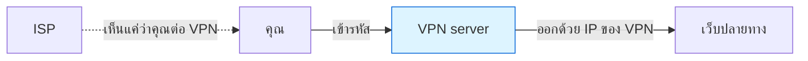

# บทที่ 62 · การระบุตัวตนบนอินเทอร์เน็ต — VPN, Tor และ tunneling

> [บทที่ 15](15-captcha-and-antibot.md) อธิบายว่าระบบ anti-bot แยกแยะคนออกจากบอตได้อย่างไร
> **บทนี้ตอบคำถามที่ตรงกว่านั้น: เขารู้ได้อย่างไรว่าคุณคือคุณ**
>
> และเมื่อเข้าใจกลไก ก็จะเข้าใจว่า VPN กับ Tor ปิดอะไรได้จริง — และปิดอะไรไม่ได้

## 62.1 ตัวระบุตัวตนมีหลายชั้น ไม่ใช่แค่ IP {#s62-1}

```
IP address        → ระบุการเชื่อมต่อ  (เปลี่ยนได้ง่ายที่สุด)
Cookie / storage  → ระบุเบราว์เซอร์
Fingerprint       → ระบุอุปกรณ์      (ไม่ต้องเก็บอะไรไว้ในเครื่อง)
บัญชีที่ล็อกอิน    → ระบุตัวคุณจริง ๆ  ← ชนะทุกอย่างข้างบน
พฤติกรรม          → ระบุแม้เปลี่ยนทุกอย่างข้างบน
```

**คนส่วนใหญ่คิดถึงแค่ชั้นแรก** แล้วสรุปว่า "ใช้ VPN = ไม่มีใครรู้"
ซึ่งผิดอย่างสิ้นเชิงถ้ายังล็อกอินบัญชีเดิม

> ## กฎที่สำคัญที่สุดของทั้งบท
>
> **VPN ซ่อน IP ไม่ได้ซ่อนตัวคุณ**
>
> ถ้าคุณต่อ VPN แล้วล็อกอิน Facebook — Facebook รู้ว่าคุณคือใครทันที
> สิ่งที่เปลี่ยนไปคือ ISP ของคุณมองไม่เห็นว่าคุณเข้าเว็บอะไร เท่านั้น

## 62.2 ชั้นที่ 1 — IP address {#s62-2}

```bash
curl -s https://ifconfig.me          # IP ที่โลกภายนอกเห็น
```

IP บอกอะไรได้: **ISP · ประเทศ/จังหวัดโดยประมาณ · เป็นเน็ตบ้าน มือถือ หรือ
ศูนย์ข้อมูล** — ข้อสุดท้ายสำคัญกับ anti-bot มาก เพราะทราฟฟิกจากศูนย์ข้อมูล
ถูกสงสัยมากกว่าเน็ตบ้านหลายเท่า ([บทที่ 15](15-captcha-and-antibot.md))

**IP ไม่บอก:** คุณเป็นใคร · บ้านเลขที่ (ความแม่นยำระดับเมืองเท่านั้น)

**แต่ ISP รู้** ว่า IP นั้นเป็นของใครในเวลานั้น และเก็บ log ไว้ตามกฎหมาย —
นี่คือจุดที่การสืบสวนเริ่มต้น

## 62.3 ชั้นที่ 2 — fingerprint ที่ไม่ต้องเก็บอะไรในเครื่อง {#s62-3}

**คุณลบ cookie ได้ แต่ลบสิ่งเหล่านี้ไม่ได้**

| ชั้น | เห็นอะไร |
|---|---|
| **TLS (JA3/JA4)** | ลำดับ cipher, extension ที่ client เสนอ → บอกว่าเป็นเบราว์เซอร์อะไร หรือ **curl/Python** |
| HTTP | ลำดับ header, `User-Agent`, `Accept-Language` |
| **เบราว์เซอร์** | ขนาดหน้าจอ · ฟอนต์ที่ติดตั้ง · Canvas/WebGL · timezone |
| TCP/IP | ค่า TTL, window size → เดา OS ได้ |

> ## นี่คือเหตุผลที่ curl ถูกจับได้แม้ปลอม User-Agent
>
> [บทที่ 15](15-captcha-and-antibot.md) บอกว่า anti-bot ดูมากกว่า User-Agent — **ชั้นที่จับได้ชัดที่สุด
> คือ TLS fingerprint** เพราะ curl กับ Chrome เสนอ cipher คนละชุดคนละลำดับ
> ตั้งแต่ก่อนจะส่ง HTTP request ด้วยซ้ำ
>
> ปลอม header ได้ แต่ปลอม TLS handshake ยากกว่ามาก — และเป็นเหตุผลที่
> [บทที่ 17](17-playwright-basics.md) ต้องใช้เบราว์เซอร์จริงแทนการปลอม request

**Canvas fingerprint** — ให้เบราว์เซอร์วาดรูปแล้วดูผลลัพธ์ระดับพิกเซล
GPU/ไดรเวอร์/ฟอนต์ที่ต่างกันให้ผลต่างกันเล็กน้อย พอรวมหลายค่าเข้าด้วยกัน
**ได้ค่าที่แทบไม่ซ้ำกับใคร**

```
ลอง: https://coveryourtracks.eff.org
```

## 62.4 VPN — ปิดอะไรได้จริง {#s62-4}



| | ก่อนใช้ VPN | หลังใช้ VPN |
|---|---|---|
| ISP เห็นว่าคุณเข้าเว็บอะไร | ✅ เห็น | ❌ ไม่เห็น |
| เว็บเห็น IP จริงของคุณ | ✅ | ❌ เห็น IP ของ VPN |
| **VPN เห็นทุกอย่างที่คุณทำ** | — | 🔴 **ใช่** |
| เว็บระบุตัวคุณจากบัญชี/fingerprint | ✅ | ✅ **ยังได้เหมือนเดิม** |

**คุณไม่ได้ลบผู้สังเกตการณ์ คุณแค่ย้ายความไว้ใจจาก ISP ไปที่ผู้ให้บริการ VPN**

> **VPN ฟรีที่ไม่มีรายได้อื่น คือบริการที่คุณเป็นสินค้า** — เขาเห็น traffic
> ทั้งหมดของคุณ และมีแรงจูงใจทางธุรกิจในการใช้ประโยชน์จากมัน

**VPN มีประโยชน์จริงเมื่อ:**

- อยู่บน Wi-Fi สาธารณะที่ไม่ไว้ใจ
- **เข้าถึงเครือข่ายภายในองค์กรจากข้างนอก** ← กรณีที่ใช้กันจริงมากที่สุด
- ไม่อยากให้ ISP เห็นพฤติกรรมการใช้งาน

**VPN ไม่ช่วยเมื่อ:** คุณล็อกอินบัญชีเดิม · เว็บใช้ fingerprint · ปลายทางไม่ใช่ HTTPS

## 62.5 Tor — ต่างจาก VPN ตรงไหน {#s62-5}

```
VPN : คุณ → [เห็นทั้งหมด] → เว็บ            (ไว้ใจจุดเดียว)
Tor : คุณ → A → B → C → เว็บ                (ไม่มีโหนดไหนเห็นครบ)
```

| โหนด | เห็นอะไร |
|---|---|
| **Guard** (แรก) | รู้ว่าคุณคือใคร แต่**ไม่รู้ว่าไปไหน** |
| Middle | ไม่รู้ทั้งสองฝั่ง |
| **Exit** (สุดท้าย) | รู้ว่าไปไหน แต่**ไม่รู้ว่าใคร** |

**ไม่มีโหนดไหนรู้ทั้งต้นทางและปลายทางพร้อมกัน** — นั่นคือหัวใจของ onion routing
และเป็นสิ่งที่ VPN ให้ไม่ได้เพราะ VPN รู้ทั้งสองอย่าง

**ข้อจำกัดที่ต้องรู้:**

| ข้อ | ผล |
|---|---|
| **ช้ากว่ามาก** | วิ่งผ่าน 3 ทอด |
| Exit node เห็น traffic ที่ไม่เข้ารหัส | 🔴 **ต้องใช้ HTTPS เสมอ** |
| หลายเว็บบล็อก Tor | exit node เป็นที่รู้จักหมด |
| **ยังระบุตัวได้ถ้าคุณล็อกอิน** | Tor ไม่ช่วยอะไรเลย |
| ถูกวิเคราะห์ traffic ได้ | ผู้สังเกตที่เห็นทั้งสองปลายเทียบเวลาได้ |

> **Tor Browser ไม่ได้แค่ต่อ Tor** — มันตั้งค่าเบราว์เซอร์ให้ fingerprint
> เหมือนกันหมดทุกคนด้วย ([62.3](#s62-3)) ซึ่งเป็นครึ่งหนึ่งของคุณค่าจริง
> **การเอา Chrome ปกติมาต่อ Tor จึงแทบไม่ช่วยอะไร**

## 62.6 Tunneling — ห่อโปรโตคอลไว้ในอีกโปรโตคอล {#s62-6}

**หลักการเดียวกันทั้งหมด: เอาข้อมูลใส่ซองแล้วส่งผ่านทางที่เปิดอยู่**

### SSH tunnel — เครื่องมือที่ควรใช้เป็น

```bash
# Local forward: พอร์ตในเครื่องเรา → บริการที่ปลายทางเข้าถึงได้
ssh -L 8080:internal-db:5432 user@jump-host
# ต่อ localhost:8080 = ต่อ internal-db:5432 ผ่าน jump-host

# Dynamic: ทำ SOCKS proxy ให้ทั้งเครื่อง
ssh -D 1080 user@jump-host
curl --socks5-hostname localhost:1080 https://internal-site

# Remote forward: เปิดพอร์ตบนเครื่องปลายทาง ชี้กลับมาที่เรา
ssh -R 9000:localhost:3000 user@public-host
```

| แบบ | ใช้ทำอะไร | ความเสี่ยง |
|---|---|---|
| `-L` local | เข้าถึงบริการภายในจากข้างนอก | ปกติ |
| `-D` dynamic | proxy ทั้งเครื่อง | ปกติ |
| **`-R` remote** | ให้ข้างนอกเข้าถึงเครื่องข้างใน | 🔴 **เจาะ firewall ขาเข้าได้** |

> ## `-R` คือสิ่งที่ผู้โจมตีชอบใช้ — และ firewall ขาเข้ากันไม่ได้
>
> เครื่องข้างในเป็นฝ่าย**เชื่อมออก**ไปหาเซิร์ฟเวอร์ข้างนอก แล้วเปิดทางย้อนกลับ
> **firewall ขาเข้าไม่เห็นอะไรผิดปกติเลย เพราะไม่มีการเชื่อมต่อขาเข้า**
>
> นี่คือหลักการเดียวกับ reverse shell และ C2 beaconing ใน[บทที่ 39](39-how-malware-works.md)
> — และเป็นเหตุผลที่[บทที่ 59](59-network-defense.md) ยืนยันว่า **ต้องกั้นขาออกด้วย**

### Tunnel รูปแบบอื่นที่ควรรู้จัก

| แบบ | ห่อใน | ทำไมถูกใช้ |
|---|---|---|
| **WireGuard / OpenVPN** | UDP/TCP | VPN สมัยใหม่ ([62.4](#s62-4)) |
| HTTP CONNECT proxy | HTTP | ผ่าน proxy องค์กร |
| **DNS tunneling** | DNS query | 🔴 DNS มักไม่ถูกกั้น → ใช้ลอบส่งข้อมูลออก |
| ICMP tunneling | ping | เหมือนกัน |

**DNS tunneling คือช่องทางส่งข้อมูลออกที่ตรวจยากที่สุด** — เพราะแทบทุกเครือข่าย
ต้องเปิด DNS ไว้ สัญญาณที่จับได้คือ **query ยาวผิดปกติและถี่ผิดปกติ**
ไปยังโดเมนเดียว ([บทที่ 59.5](59-network-defense.md#s59-5))

## 62.7 สรุปเป็นตาราง — อะไรกันอะไรได้ {#s62-7}

| ต้องการ | VPN | Tor | HTTPS | เบราว์เซอร์แยกโปรไฟล์ |
|---|:---:|:---:|:---:|:---:|
| ISP ไม่เห็นว่าเข้าเว็บอะไร | ✅ | ✅ | ⚠️ เห็นโดเมน | ❌ |
| เว็บไม่เห็น IP จริง | ✅ | ✅ | ❌ | ❌ |
| ไม่ถูกเชื่อมโยงกับบัญชีเดิม | ❌ | ❌ | ❌ | ✅ |
| กันการดักอ่านกลางทาง | ✅ | ✅ | ✅ | ❌ |
| กัน fingerprint | ❌ | ⚠️ Tor Browser | ❌ | ⚠️ |

**ไม่มีเครื่องมือไหนแก้ได้ทุกข้อ** — และแถวที่สามคือแถวที่คนมองข้ามมากที่สุด

## 62.8 ⚠️ ขอบเขตทางกฎหมายและจริยธรรม {#s62-8}

เนื้อหาบทนี้อธิบาย**กลไก** เพื่อให้ป้องกันระบบของตัวเองและเข้าใจความเป็นส่วนตัว
ของตัวเองได้

- ✅ ใช้ VPN/Tor เพื่อความเป็นส่วนตัวของตัวเอง — **ถูกกฎหมายในไทย**
- ✅ เข้าใจ fingerprint เพื่อออกแบบ anti-bot หรือเพื่อป้องกันตัวเอง
- ✅ ใช้ SSH tunnel เข้าเครือข่ายที่คุณมีสิทธิ์
- 🔴 ใช้เพื่อปกปิดตัวตนขณะทำสิ่งผิดกฎหมาย — **ความผิดไม่ได้ลดลง**
- 🔴 ตั้ง tunnel ทะลุ firewall ขององค์กรโดยไม่ได้รับอนุญาต — ผิดนโยบาย
  และอาจผิดกฎหมาย แม้คุณจะเป็นพนักงาน

> **การไม่ถูกระบุตัวตนไม่เท่ากับการไม่ถูกดำเนินคดี** — การสืบสวนจริงใช้หลายชั้น
> ประกอบกัน (บัญชี · การชำระเงิน · พฤติกรรม · ความผิดพลาดครั้งเดียว)
> ตามที่[บทที่ 61](61-digital-forensics.md) อธิบาย ผู้ที่ถูกจับส่วนใหญ่ไม่ได้พลาดที่เทคโนโลยี
> แต่พลาดที่ความสม่ำเสมอ

## แบบฝึกหัด

1. `curl -s https://ifconfig.me` แล้วเทียบกับตอนต่อ VPN — เปลี่ยนไหม
2. เข้า <https://coveryourtracks.eff.org> — เบราว์เซอร์คุณไม่ซ้ำกับกี่คน
3. เทียบ TLS fingerprint ของ `curl` กับ Chrome (จับด้วย `tcpdump` ใน[บทที่ 31](31-tcpip-and-tcpdump.md))
   — ต่างกันตรงไหน
4. ทำ SSH tunnel `-L` เข้าถึงบริการที่ฟังแค่ `127.0.0.1` บนเครื่องอื่น
5. ตอบตัวเอง: ถ้าเครือข่ายคุณกั้นขาเข้าหมดแต่เปิดขาออกอิสระ
   ผู้โจมตียังตั้ง tunnel เข้ามาได้ไหม อย่างไร ([62.6](#s62-6))
6. ดู DNS query ในเครือข่ายคุณด้วย `tcpdump -ni any port 53` — มี query
   ที่ยาวผิดปกติไหม
7. ตอบตัวเอง: ถ้าอยากไม่ให้เว็บหนึ่งเชื่อมโยงคุณกับอีกเว็บหนึ่งได้
   VPN พอไหม ต้องทำอะไรเพิ่ม ([62.7](#s62-7))

***
[⬅ Digital forensics](61-digital-forensics.md) · [สารบัญ](../README.md) · [หลักการออกแบบโค้ด ➡](73-design-principles.md)
