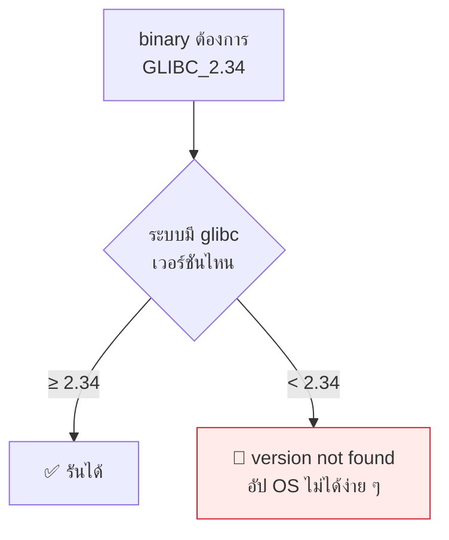

# บทที่ 65 · Linking และ loading — จาก `.o` ถึงโปรแกรมที่รันได้

> [บทที่ 64](64-ffi-and-bindings.md) เรียก `.so` โดยถือว่ามันโหลดมาเองได้ **บทนี้อธิบายว่ามันโหลด
> มาอย่างไร** — และทำไม `ImportError: libcudart.so.11: cannot open` ถึงหลอน
> คนสาย data science ทุกคน

## 65.1 สองจังหวะที่คนสับสน — compile-time กับ run-time {#s65-1}

```
เขียนโค้ด → [compile] → .o → [LINK] → โปรแกรม → [LOAD] → รัน
                               ↑                    ↑
                          static linker         dynamic loader
                          (ตอน build)           (ทุกครั้งที่รัน)
```

**คนมักคิดว่า linking เกิดครั้งเดียวตอน build — ไม่ใช่** dynamic library
ถูก link **ทุกครั้งที่โปรแกรมเริ่มรัน** และนี่คือที่มาของ error ส่วนใหญ่

| จังหวะ | ใครทำ | error ที่เจอ |
|---|---|---|
| **compile-time link** | `ld` (ตอน `gcc`) | `undefined reference to ...` |
| **run-time load** | `ld-linux.so` (ตอนรัน) | `cannot open shared object file` |

**แยกสอง error นี้ให้ออกคือครึ่งหนึ่งของการแก้ปัญหา** — อันแรกคือตอน build
อันหลังคือตอนรัน คนละเครื่องมือ คนละวิธีแก้

## 65.2 static vs dynamic — วัดของจริง {#s65-2}

```bash
gcc -o hello_dyn    hello.c            # dynamic (ปกติ)
gcc -static -o hello_static hello.c    # static
```

ขนาดจริงของโปรแกรม `printf("hi")` ตัวเดียวกัน:

```
    15,960  hello_dyn        ← ยืม libc จากระบบ
   785,360  hello_static     ← ก๊อป libc ใส่มาทั้งก้อน (ใหญ่กว่า 49 เท่า)
```

| | static | dynamic |
|---|---|---|
| ขนาดไฟล์ | 🔴 ใหญ่ | ✅ เล็ก |
| ต้องมี `.so` บนเครื่องปลายทาง | ✅ ไม่ต้อง | ต้องมี |
| อัปเดต libc แล้วได้ผลด้วย | ❌ ต้อง build ใหม่ | ✅ อัตโนมัติ |
| **patch ช่องโหว่ของ libc** | 🔴 ต้อง build ใหม่ทุกโปรแกรม | ✅ อัปเดตที่เดียว |
| แจกไปเครื่องอื่น | ✅ ก๊อปแล้วรันเลย | ต้องมี dependency ครบ |

> **แถวก่อนสุดท้ายคือเหตุผลด้านความปลอดภัยที่สำคัญ** — ตอน libc มีช่องโหว่
> (เช่น Heartbleed ของ OpenSSL — [บทที่ 37](37-memory-and-classic-exploits.md)) dynamic แค่อัปเดต `.so`
> ก้อนเดียวก็ครบทุกโปรแกรม ส่วน static ต้องตามหา build ใหม่ทุกตัวที่ฝังมันไว้
>
> **นี่คือเหตุผลที่ container แบบ static (Go, Rust) ต้อง rebuild เมื่อมี CVE**
> ต่างจากระบบ dynamic ที่ `apt upgrade` ก็จบ

## 65.3 `ldd` — โปรแกรมนี้พึ่งอะไรบ้าง {#s65-3}

```bash
ldd hello_dyn
```

```
linux-vdso.so.1                              ← เคอร์เนล inject ให้ ไม่ใช่ไฟล์จริง
libc.so.6 => /lib/x86_64-linux-gnu/libc.so.6 ← C library
/lib64/ld-linux-x86-64.so.2                  ← ตัว loader เอง
```

```bash
ldd hello_static
```

```
not a dynamic executable                     ← ไม่พึ่งใครเลย ทุกอย่างอยู่ในไฟล์
```

**`ldd` คือคำสั่งแรกที่ควรรันเมื่อ "โปรแกรมรันไม่ขึ้นเพราะหา library ไม่เจอ"**
มันบอกว่าต้องการอะไรและหาเจอไหม (`=> not found` คือตัวที่ขาด)

> ⚠️ **อย่ารัน `ldd` กับ binary ที่ไม่ไว้ใจ** — มันอาจรันโค้ดใน binary นั้น
> ได้ในบางกรณี ใช้ `objdump -p file | grep NEEDED` แทนถ้าแค่อยากดู dependency

## 65.4 symbol — กาวที่เชื่อมทุกอย่าง {#s65-4}

library เชื่อมกันด้วย **symbol** (ชื่อฟังก์ชัน/ตัวแปร)

```bash
nm -D --defined-only libfast.so     # symbol ที่ .so นี้ "ให้"
```

```
0000000000001100 T sum_squares       ← T = ให้ใช้ได้ (exported)
```

```bash
nm -D hello_dyn | grep ' U '          # symbol ที่โปรแกรม "ต้องการ"
```

```
U __libc_start_main@GLIBC_2.34        ← U = undefined ต้องไปหาตอนโหลด
U puts@GLIBC_2.2.5
```

| ตัวอักษร | แปลว่า |
|---|---|
| `T` / `t` | library นี้ **ให้** symbol นี้ (text/code) |
| `U` | **ต้องการ** symbol นี้ ยังหาไม่เจอ |
| `D` / `B` | ตัวแปร (data / bss) |

**dynamic loader ทำงานคือ: จับคู่ `U` ของโปรแกรม กับ `T` ของ library**
ถ้าจับไม่ครบ → `undefined symbol` ตอนรัน

## 65.5 loader หา `.so` จากไหน — ตามลำดับ {#s65-5}

นี่คือความรู้ที่แก้ปัญหา "หา library ไม่เจอ" ได้จริง

```
1. RPATH ที่ฝังใน binary          (ก่อน LD_LIBRARY_PATH — legacy)
2. LD_LIBRARY_PATH                (environment variable)
3. RUNPATH ที่ฝังใน binary        (หลัง LD_LIBRARY_PATH — สมัยใหม่)
4. /etc/ld.so.cache               (ldconfig สร้าง)
5. /lib, /usr/lib                 (ที่มาตรฐาน)
```

**พิสูจน์จริง** — โปรแกรมที่พึ่ง `libfast.so`:

```bash
./needlib
# ./needlib: error while loading shared libraries: libfast.so:
#            cannot open shared object file: No such file or directory

LD_LIBRARY_PATH=. ./needlib      # บอก loader ให้หาในโฟลเดอร์นี้
# exit=25  (3² + 4² = 25) ← รันได้
```

> ## `LD_LIBRARY_PATH` เป็นทางแก้ชั่วคราว ไม่ใช่ทางแก้ถาวร
>
> มันแก้ปัญหาเฉพาะหน้าได้ แต่ถ้าใส่ใน `.bashrc` จะกลายเป็นระเบิดเวลา —
> **ทุกโปรแกรมที่รันจะหา `.so` จาก path นั้นก่อน** รวมถึงตัวที่ไม่ควร
> ทำให้เกิดบั๊ก "รันบนเครื่องผมได้" ที่หาสาเหตุยากมาก
>
> และเป็นช่องโหว่ด้วย — ถ้า path นั้นผู้อื่นเขียนได้ เขาวาง `.so` ปลอมได้
> (หลักการเดียวกับ `LD_PRELOAD` ใน[บทที่ 49](49-gpu-on-containers-and-k8s.md))

## 65.6 rpath — ฝัง path ไว้ในตัว binary {#s65-6}

ทางแก้ที่ถูกกว่า `LD_LIBRARY_PATH` คือฝัง path ไว้ในโปรแกรมเลย

```bash
gcc -o needlib needlib.c -L. -lfast -Wl,-rpath,'$ORIGIN'
./needlib          # รันได้เลย ไม่ต้องตั้ง env
```

**`$ORIGIN` = โฟลเดอร์ที่ตัว binary อยู่** — แปลว่า "หา `.so` ข้าง ๆ ตัวฉันเอง"
ทำให้ก๊อปโปรแกรม + library ไปไว้ที่ไหนก็รันได้

> **นี่คือวิธีที่ PyTorch ใช้** — `.so` ของมันมี `RUNPATH` เป็น `$ORIGIN`
> ชี้ไปโฟลเดอร์ `torch/lib/` ข้าง ๆ กัน จึงหา `libtorch_cpu.so`,
> `libc10.so` เจอเองโดยไม่ต้องตั้ง `LD_LIBRARY_PATH`

## 65.7 🔴 นรก version ของสาย data science {#s65-7}

error ที่ทุกคนเจอ:

```
ImportError: libcudart.so.11.0: cannot open shared object file
OSError: /lib/libc.so.6: version `GLIBC_2.34' not found
```

**สังเกตชื่อ symbol เมื่อกี้: `puts@GLIBC_2.2.5`** — เลขหลัง `@` คือ
**symbol versioning** library ผูกไว้ว่าต้องการ glibc เวอร์ชันไหน



| error | สาเหตุ | ทางแก้ |
|---|---|---|
| `libcudart.so.11: cannot open` | CUDA runtime ไม่ตรงเวอร์ชัน | ลง CUDA ให้ตรง หรือใช้ wheel ที่ bundle มา |
| `GLIBC_2.34 not found` | binary ใหม่เกิน OS | 🔴 อัป OS หรือ build ใหม่ — **แก้ยากที่สุด** |
| `undefined symbol: ...` | library version ไม่ match กัน | ให้ทุกตัวมาจาก build เดียวกัน |
| โหลด `.so` ผิดตัว | มีหลายเวอร์ชันในเครื่อง | `ldd` ดูว่าโหลดตัวไหนจริง |

> ## ทำไม conda/wheel ถึงมีอยู่
>
> ปัญหา version เหล่านี้แก้ยากจน**วงการแก้ด้วยการ bundle library มาให้หมด** —
> wheel ของ PyTorch มี `libcudart`, `libcudnn` ฯลฯ มาในตัว ([บทที่ 65.6](#s65-6)
> `$ORIGIN`) จึงไม่ต้องพึ่ง CUDA ของระบบ
>
> **นี่คือเหตุผลที่ `pip install torch` ตัวใหญ่หลาย GB** — มันขน `.so`
> ของ CUDA มาทั้งชุดเพื่อหนีนรก version ของเครื่องปลายทาง

**คำสั่งวินิจฉัยที่ควรรู้:**

```bash
ldd โปรแกรม | grep 'not found'          # อะไรขาด
objdump -p file | grep NEEDED           # ต้องการ .so อะไรบ้าง (ปลอดภัยกว่า ldd)
LD_DEBUG=libs ./program 2>&1 | head     # ดู loader หา library ยังไงทีละขั้น
strings libc.so.6 | grep GLIBC_ | sort -u | tail   # ระบบมี glibc version อะไรบ้าง
```

## 65.8 สรุปเป็นขั้นตอนแก้ปัญหา {#s65-8}

เมื่อ "โปรแกรม/`import` รันไม่ขึ้นเพราะ library":

```
1. ldd โปรแกรม            → อะไร "not found"
2. หา .so ตัวนั้นอยู่ไหน   → locate / find
3. ตรวจ version           → เวอร์ชันตรงที่ต้องการไหม
4. ถ้าเจอแต่ผิดที่         → rpath หรือ LD_LIBRARY_PATH (ชั่วคราว)
5. ถ้าไม่มีเลย            → ติดตั้ง หรือใช้ wheel ที่ bundle มา
6. ถ้า version ไม่ตรง     → นรก (ข้อ 65.7) — bundle หรือ container
```

**ข้อ 6 คือเหตุผลที่ container มีอยู่** ([บทที่ 36](36-permissions-and-isolation.md)) — แทนที่จะสู้กับ
version ของเครื่องปลายทาง ก็ขนทั้ง environment ไปด้วยเลย

## แบบฝึกหัด

1. คอมไพล์โปรแกรมเดียวกันแบบ static กับ dynamic — ขนาดต่างกันกี่เท่าบนเครื่องคุณ
2. `ldd` โปรแกรมที่คุณใช้บ่อย — มันพึ่ง `.so` กี่ตัว
3. `nm -D` ดู symbol ที่ `libc.so.6` export — มีกี่พัน symbol
4. ทำให้โปรแกรมหา `.so` ไม่เจอ แล้วแก้ด้วย 3 วิธี: `LD_LIBRARY_PATH`, rpath,
   คัดลอกไป `/usr/lib` + `ldconfig`
5. รัน `LD_DEBUG=libs python3 -c "import torch"` — loader หา library กี่ตัว
   จากที่ไหนบ้าง
6. หา glibc version ของเครื่องคุณ แล้วตอบว่า binary ที่ต้องการ `GLIBC_2.40`
   จะรันได้ไหม (ข้อ [65.7](#s65-7))
7. ตอบตัวเอง: ทำไม `pip install torch` ถึงใหญ่หลาย GB — เกี่ยวกับบทนี้อย่างไร

***
[⬅ เรียกข้ามภาษา — FFI และ binding](64-ffi-and-bindings.md) · [สารบัญ](../README.md) · [Cryptography ภาคปฏิบัติ ➡](38-crypto-in-practice.md)
