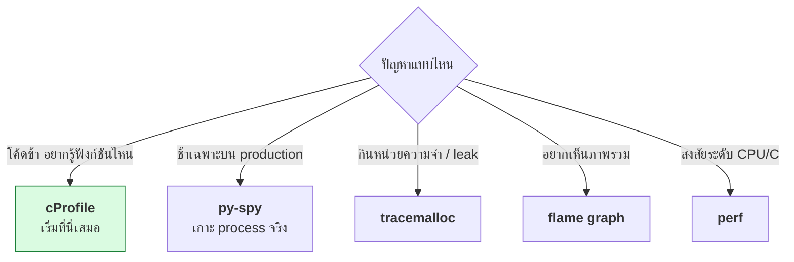

# บทที่ 67 · Profiling — หาจุดที่ช้าจริง ไม่ใช่จุดที่เดา

> [บทที่ 51](51-gpu-observability-and-cost.md) วัดว่า GPU ทำงานคุ้มไหม **บทนี้วัดว่าโค้ดของคุณเองช้าตรงไหน**
>
> กฎข้อเดียวของทั้งบท: **วัดก่อน อย่าเดา** — จุดที่คุณคิดว่าช้า มักไม่ใช่จุดที่ช้าจริง

## 67.1 ทำไมห้ามเดา {#s67-1}

```
"ฉันว่า loop นี้แหละที่ช้า"  →  optimize ไป 2 ชั่วโมง  →  เร็วขึ้น 3%
profiler ชี้ว่าจริง ๆ ช้าที่ query ที่เรียกซ้ำ  →  แก้ 5 นาที  →  เร็วขึ้น 50 เท่า
```

**สัญชาตญาณเรื่อง performance ผิดบ่อยมาก** — คอขวดมักซ่อนอยู่ในที่ที่ไม่คิด
(I/O ที่มองไม่เห็น, ฟังก์ชันที่ถูกเรียกล้านครั้ง, การ serialize)

> **กฎ 80/20 ของ performance** — เวลาส่วนใหญ่หมดไปกับโค้ดส่วนน้อย
> หา "ส่วนน้อย" นั้นให้เจอก่อน แล้ว optimize เฉพาะตรงนั้น
> การ optimize โค้ดที่ไม่ใช่คอขวดคือการเสียเวลาเปล่า

## 67.2 cProfile — จุดเริ่มที่มากับ Python {#s67-2}

ไม่ต้องติดตั้งอะไร ใช้ได้ทันที

```bash
python3 -m cProfile -s tottime slow.py
```

ผลจริง ([lab/profiling/](../lab/profiling/)):

```
2692562 function calls in 0.368 seconds

   ncalls  tottime  percall  cumtime  filename:lineno(function)
2692537/1    0.341    0.000    0.341    slow.py:9(fib)        ← 93% ของเวลาอยู่ที่นี่
        1    0.025    0.025    0.025    slow.py:20(build_list)
```

**อ่านสองคอลัมน์นี้พอ:**

| คอลัมน์ | หมายถึง |
|---|---|
| `ncalls` | ถูกเรียกกี่ครั้ง — **2.69 ล้านครั้ง** คือสัญญาณอันตราย |
| **`tottime`** | เวลาใน**ฟังก์ชันนั้นเอง** ไม่รวมที่มันเรียกต่อ ← หาคอขวดดูตัวนี้ |
| `cumtime` | เวลารวมทั้งที่มันเรียกต่อ — ดูว่า "เส้นทางไหน" ช้า |

> **`tottime` vs `cumtime` ต่างกันตรงนี้** — `main()` มี `cumtime` สูง
> (เพราะมันเรียกทุกอย่าง) แต่ `tottime` ต่ำ (ตัวมันเองไม่ได้ทำงานหนัก)
> **หาคอขวดดู `tottime` · หาเส้นทางดู `cumtime`**

## 67.3 แก้ตามที่ profiler ชี้ — วัดผลจริง {#s67-3}

profiler บอกว่า `fib` ถูกเรียก 2.69 ล้านครั้ง เพราะ recursion คำนวณซ้ำ
แก้ด้วย memoize บรรทัดเดียว:

```python
import functools

@functools.lru_cache(maxsize=None)      # จำผลที่เคยคำนวณ
def fib(n):
    return n if n < 2 else fib(n-1) + fib(n-2)
```

วัดก่อน/หลัง (`make compare`):

```
fib(32) ธรรมดา  :   218.13 ms
fib(32) memoize :     0.0127 ms
เร็วขึ้น 17,211 เท่า
```

**บรรทัดเดียว เร็วขึ้นหลักหมื่นเท่า** — เพราะเปลี่ยนจากคำนวณ 2.69 ล้านครั้ง
เหลือ 33 ครั้ง profiler คือสิ่งที่บอกว่าควรแก้ตรงนี้ ไม่ใช่ตรงอื่น

## 67.4 หา memory ที่ใช้เยอะ — `tracemalloc` {#s67-4}

profiler ข้างบนวัด**เวลา** แต่บางปัญหาคือ**หน่วยความจำ** — stdlib มีให้เหมือนกัน

```python
import tracemalloc
tracemalloc.start()

data = [str(i) * 10 for i in range(100_000)]

cur, peak = tracemalloc.get_traced_memory()
print(f"peak: {peak/1024/1024:.1f} MiB")
for stat in tracemalloc.take_snapshot().statistics("lineno")[:3]:
    print(stat)      # บอกบรรทัดที่จองหน่วยความจำมากที่สุด
```

**ใช้หา memory leak** — ถ่าย snapshot สองจุดแล้ว `.compare_to()` จะเห็นว่า
หน่วยความจำโตขึ้นที่บรรทัดไหนระหว่างสองจุดนั้น

## 67.5 py-spy — profile โปรแกรมที่รันอยู่แล้ว {#s67-5}

cProfile ต้องรันโปรแกรมผ่านมัน **แต่ py-spy เกาะเข้าไปดู process ที่รันอยู่ได้เลย
โดยไม่ต้องแก้โค้ดหรือรีสตาร์ท**

```bash
pip install py-spy

# ดูแบบ top ว่าตอนนี้เวลาหมดไปกับฟังก์ชันไหน
sudo py-spy top --pid 12345

# ถ่าย flame graph จาก process ที่รันอยู่
sudo py-spy record -o profile.svg --pid 12345
```

> ## นี่คือเครื่องมือที่แก้ปัญหา "ช้าเฉพาะบน production"
>
> บั๊ก performance หลายอย่างเกิดเฉพาะตอนโหลดจริง ข้อมูลจริง ซึ่ง reproduce
> บนเครื่อง dev ไม่ได้ — **py-spy เกาะเข้า process จริงบน production ได้โดย
> ไม่ต้องหยุดหรือแก้อะไร** (มี overhead ต่ำมาก)
>
> ต่างจาก cProfile ที่ต้องตัดสินใจ profile ตั้งแต่ตอนรัน

## 67.6 Flame graph — อ่าน profile ด้วยตา {#s67-6}

ตัวเลขเยอะ ๆ อ่านยาก **flame graph เปลี่ยนเป็นภาพ**

```
main ────────────────────────────────────────
  ├── fib ██████████████████████████████ 93%    ← กว้าง = กินเวลาเยอะ
  └── build_list ███ 7%
```

**วิธีอ่าน:**

| แกน | หมายถึง |
|---|---|
| **กว้าง** | ยิ่งกว้าง = ยิ่งกินเวลา ← มองหาแท่งกว้าง |
| สูง (ลึก) | ความลึกของ call stack |
| **ไม่ใช่** เวลาซ้าย→ขวา | เรียงตามชื่อ ไม่ใช่ตามเวลา |

**มองหาที่ราบกว้าง ๆ** — นั่นคือฟังก์ชันที่กินเวลาโดยไม่ได้เรียกใครต่อ
(ทำงานหนักด้วยตัวเอง) คือเป้าหมายของการ optimize

## 67.7 perf — ลงลึกถึงระดับ CPU {#s67-7}

เมื่อ Python profiler ไม่พอ (อยากรู้ว่า cache miss, branch misprediction)
`perf` ของ Linux วัดถึงระดับฮาร์ดแวร์

```bash
perf stat python3 program.py         # นับ event รวม
perf record python3 program.py       # เก็บ sample
perf report                          # ดูผล
```

> ⚠️ **`perf` ต้องการสิทธิ์** — ควบคุมด้วย `/proc/sys/kernel/perf_event_paranoid`
> ถ้าค่าเป็น 2 ขึ้นไป (เครื่องนี้เป็น 4) จะเข้าถึง event ระดับ CPU ไม่ได้
> ต้อง `sudo sysctl kernel.perf_event_paranoid=1` ก่อน
>
> **สำหรับโค้ด Python ทั่วไป cProfile/py-spy พอแล้ว** — `perf` เหมาะกับ
> โค้ด C/extension หรือเมื่อสงสัยว่าปัญหาอยู่ต่ำกว่าระดับ Python
> (ต่อยอดจาก[บทที่ 64](64-ffi-and-bindings.md) เรื่อง `.so`)

## 67.8 เลือกเครื่องมือให้ตรงปัญหา {#s67-8}



| เครื่องมือ | วัดอะไร | ติดตั้ง |
|---|---|---|
| **cProfile** | เวลาต่อฟังก์ชัน | stdlib |
| **tracemalloc** | หน่วยความจำต่อบรรทัด | stdlib |
| **timeit** | เทียบโค้ดสั้น ๆ | stdlib |
| **py-spy** | process ที่รันอยู่ · flame graph | pip |
| **perf** | ระดับ CPU | apt · ต้องสิทธิ์ |

## 67.9 กับดักของการวัด {#s67-9}

| กับดัก | ผล |
|---|---|
| **ไม่ warm-up** | ครั้งแรกรวมเวลา import/compile ([บทที่ 51.7](51-gpu-observability-and-cost.md#s51-7)) |
| วัดครั้งเดียว | ค่าแกว่ง — วัดหลายครั้งดูการกระจาย |
| profiler เพิ่ม overhead | cProfile ทำให้ช้าลง — ดู**สัดส่วน** ไม่ใช่เวลาสัมบูรณ์ |
| optimize จุดที่ไม่ใช่คอขวด | เสียเวลาเปล่า — วัดก่อนเสมอ |
| **CPython optimize ให้แล้ว** | `s += str` เร็วเท่า `join` ในเวอร์ชันใหม่ — อย่าเชื่อคำแนะนำเก่า |

> **แถวสุดท้ายเจอจริงตอนเขียนบทนี้** — ตั้งใจโชว์ว่า `"".join()` เร็วกว่า
> `s += str` แต่วัดแล้วเท่ากัน (1.0x) เพราะ CPython รุ่นใหม่ปรับให้แล้ว
> **นี่คือเหตุผลที่ต้องวัดบนเครื่องและเวอร์ชันจริง** ไม่ใช่เชื่อ blog เก่า

## แบบฝึกหัด

1. `make profile` ใน [lab/profiling/](../lab/profiling/) — ฟังก์ชันไหน `tottime` สูงสุด
2. `make compare` — memoize เร่งได้กี่เท่าบนเครื่องคุณ
3. เอาโค้ดจริงของคุณมารัน cProfile — จุดที่ช้าตรงกับที่คิดไว้ไหม
4. ลง py-spy แล้ว `py-spy top` ใส่ process Python ที่รันอยู่
5. ใช้ tracemalloc หาบรรทัดที่ใช้หน่วยความจำมากที่สุดในโค้ดคุณ
6. เทียบ `s += str(i)` กับ `"".join()` บนเครื่องคุณ — ต่างกันจริงไหม (ข้อ [67.9](#s67-9))
7. ตอบตัวเอง: ครั้งล่าสุดที่คุณ optimize โค้ด ได้วัดก่อนไหม หรือเดา

***
[⬅ CI/CD](55-ci-cd.md) · [สารบัญ](../README.md) · [Concurrency และ async ➡](33-concurrency-and-async.md)
