# บทที่ 68 · Observability เจาะลึก — เมื่อ log อย่างเดียวไม่พอ

> [บทที่ 28](28-observability-and-deployment.md) วาง log, metric, health check ให้ระบบเดียว
> **บทนี้ตอบว่าจะรู้เรื่องได้อย่างไรเมื่อ request หนึ่งวิ่งผ่านสิบบริการ**

## 68.1 สามเสาของ observability {#s68-1}

```
Log     : "เกิดอะไรขึ้น ณ จุดหนึ่ง"        → เหตุการณ์
Metric  : "ตัวเลขรวมเป็นอย่างไรตามเวลา"    → แนวโน้ม
Trace   : "request นี้เดินทางผ่านอะไรบ้าง"  → เส้นทาง
```

| เสา | ตอบคำถาม | ตัวอย่าง |
|---|---|---|
| **Log** ([บทที่ 28](28-observability-and-deployment.md)) | เกิดอะไรตอนนั้น | "user 5 login failed" |
| **Metric** ([บทที่ 51](51-gpu-observability-and-cost.md)) | ภาพรวมเป็นยังไง | p99 latency, error rate |
| **Trace** (บทนี้) | **request นี้ช้าที่ขั้นไหน** | API 5ms → DB 200ms → cache 1ms |

> ## แต่ละเสาตอบคนละคำถาม — ต้องมีครบ
>
> **Metric บอกว่า "ระบบช้า" · Trace บอกว่า "ช้าที่ตรงไหน" · Log บอกว่า "ทำไม"**
>
> มี metric อย่างเดียวจะรู้ว่าพังแต่ไม่รู้ว่าตรงไหน · มี log อย่างเดียว
> จะจมกองข้อความโดยไม่เห็นภาพรวม

## 68.2 ปัญหาที่ log แก้ไม่ได้ — request ข้ามหลายบริการ {#s68-2}

```
ผู้ใช้กด "สั่งซื้อ" → API Gateway → Order Service → Payment → Inventory → DB
                                      ↓ ช้า 3 วินาที
                              log บอกแค่ "Order Service: done"
                              แต่ไม่รู้ว่าช้าที่ Payment หรือ Inventory
```

**ในระบบหลายบริการ log ของแต่ละตัวแยกกัน** — ไม่มีใครเห็นภาพรวมว่า request
เดียวเดินทางอย่างไร นี่คือปัญหาที่ **distributed tracing** แก้

## 68.3 Trace และ span {#s68-3}

```mermaid
gantt
    dateFormat X
    axisFormat %s
    title Trace ของ request เดียว (แต่ละแท่ง = span)
    API Gateway     :0, 210
    Order Service   :5, 200
    Payment call    :20, 60
    Inventory call  :80, 190
    DB query        :100, 185
```



| คำ | คืออะไร |
|---|---|
| **Trace** | เส้นทางทั้งหมดของ request หนึ่ง |
| **Span** | หนึ่งช่วงงาน (เรียก DB, เรียก service อื่น) |
| **Trace ID** | รหัสเดียวที่ติดไปกับ request ตลอดทาง |
| Parent span | span ที่เรียก span นี้ — ทำให้ต่อเป็นต้นไม้ได้ |

**จากภาพเห็นทันทีว่า Inventory call (80→190) คือตัวที่ช้า** ไม่ใช่ Payment
— นี่คือสิ่งที่ log แยก ๆ กันบอกไม่ได้

## 68.4 กุญแจสำคัญ — ส่ง context ต่อข้ามบริการ {#s68-4}

[บทที่ 28](28-observability-and-deployment.md) มี `X-Request-ID` แล้ว **tracing คือการต่อยอดแนวคิดนั้น**
ให้ ID เดินทางข้ามทุกบริการ

```
บริการ A รับ request → ยังไม่มี trace ID → สร้างใหม่: abc123
   ↓ เรียกบริการ B พร้อมส่ง header: traceparent: abc123-span1
บริการ B → เห็น trace ID abc123 → สร้าง span ลูกใต้ span1
   ↓ เรียก DB พร้อม traceparent: abc123-span2
```

**มาตรฐาน W3C Trace Context** — header ชื่อ `traceparent`:

```
traceparent: 00-abc123def456...-00f067aa0ba902b7-01
             │  └── trace ID ──┘ └── span ID ──┘  └ flags
             version
```

```bash
# ดูว่า service ส่ง traceparent ต่อไหม
curl -v https://api.example.com/order 2>&1 | grep -i traceparent
```

> **ถ้าบริการใดบริการหนึ่งไม่ส่ง `traceparent` ต่อ trace จะขาดตรงนั้น** —
> เห็นครึ่งเดียวของเส้นทาง เป็นบั๊กที่พบบ่อยเวลาเพิ่งเริ่มทำ tracing

## 68.5 OpenTelemetry — มาตรฐานกลาง {#s68-5}

เมื่อก่อนแต่ละเจ้ามี SDK ของตัวเอง (Jaeger, Zipkin, Datadog...) ย้ายเจ้าทีก็
เขียนโค้ดใหม่ที **OpenTelemetry (OTel)** คือมาตรฐานกลางที่จบปัญหานั้น

```python
from opentelemetry import trace
tracer = trace.get_tracer(__name__)

@app.post("/order")
def create_order(data):
    with tracer.start_as_current_span("create_order") as span:
        span.set_attribute("user.id", data.user_id)
        span.set_attribute("order.total", data.total)

        with tracer.start_as_current_span("charge_payment"):
            charge(data)                    # span ลูก

        with tracer.start_as_current_span("reserve_stock"):
            reserve(data)
```

```
โค้ดของคุณ → OTel SDK → OTel Collector → ส่งไป Jaeger / Grafana / Datadog
                                          (เปลี่ยนปลายทางได้โดยไม่แก้โค้ด)
```

**จุดขาย: instrument ครั้งเดียว ส่งไปที่ไหนก็ได้** — และมี auto-instrumentation
ที่ดัก HTTP/DB framework ยอดนิยมให้อัตโนมัติโดยแทบไม่ต้องแก้โค้ด

## 68.6 Metric ที่ควรมี — RED และ USE {#s68-6}

[บทที่ 28](28-observability-and-deployment.md) พูดถึง RED แล้ว ทวนพร้อมคู่ของมัน

**RED — สำหรับบริการ (มองจากผู้ใช้):**

| ตัว | คือ | เตือนเมื่อ |
|---|---|---|
| **R**ate | request/วินาที | พุ่งหรือดิ่งผิดปกติ |
| **E**rror | อัตราล้มเหลว | สูงกว่าปกติ |
| **D**uration | latency (p50/p95/p99) | p99 พุ่ง |

**USE — สำหรับทรัพยากร (มองจากเครื่อง):**

| ตัว | คือ | ตัวอย่าง |
|---|---|---|
| **U**tilization | ใช้ไปกี่ % | CPU, VRAM ([บทที่ 51](51-gpu-observability-and-cost.md)) |
| **S**aturation | คิวยาวแค่ไหน | load average, queue depth ([บทที่ 56](56-background-jobs-and-queues.md)) |
| **E**rror | error ของทรัพยากร | disk error, ECC ([บทที่ 51](51-gpu-observability-and-cost.md)) |

> **ใช้ percentile ไม่ใช่ค่าเฉลี่ย** ([บทที่ 28](28-observability-and-deployment.md)) — ค่าเฉลี่ย latency 50ms
> อาจซ่อนผู้ใช้ 1% ที่รอ 5 วินาที **p99 คือตัวที่บอกว่าผู้ใช้ที่แย่ที่สุด
> เจออะไร** ซึ่งคือคนที่จะบ่นและเลิกใช้

## 68.7 Log ให้เชื่อมกับ trace ได้ {#s68-7}

log กับ trace จะทรงพลังเมื่อ**เชื่อมกันได้** — ใส่ trace ID ลงในทุก log

```python
logger.info("payment failed", extra={
    "trace_id": current_trace_id(),      # ← กุญแจเชื่อม
    "user_id": user.id,
    "amount": amount,
})
```

```
เห็น trace ช้าที่ span payment → เอา trace_id ไป grep log → เจอ log บรรทัดที่บอกว่าทำไม
```

**นี่คือ workflow จริงตอน debug production:** metric เตือน → เปิด trace หา
span ที่ช้า → เอา trace ID ไปหา log ที่เกี่ยวข้อง → เจอสาเหตุ **ทั้งสามเสา
ทำงานร่วมกัน**

## 68.8 อย่าเก็บทุกอย่าง — sampling {#s68-8}

trace ทุก request บนระบบที่มีล้าน request/วัน = ข้อมูลมหาศาลและแพง

| กลยุทธ์ | ทำอะไร |
|---|---|
| **Head sampling** | สุ่มเก็บ X% ตั้งแต่ต้น | ง่าย · แต่อาจพลาด error |
| **Tail sampling** | เก็บหลังรู้ผล — **เก็บทุก trace ที่ error/ช้า** | ฉลาดกว่า · ซับซ้อนกว่า |

> **เก็บ trace ที่ error และที่ช้าทั้งหมด · สุ่มเก็บที่ปกติ** — เพราะ
> trace ที่น่าสนใจตอน debug คือตัวที่ผิดปกติ ไม่ใช่ตัวที่ทำงานปกติ
>
> เหมือน IDS ใน[บทที่ 59](59-network-defense.md) — เก็บทุกอย่างแล้วไม่มีใครดู สู้เก็บเฉพาะ
> ที่สำคัญไม่ได้

## 68.9 เริ่มยังไงโดยไม่ over-engineer {#s68-9}

```
1. structured log + X-Request-ID   ← บทที่ 28 · เริ่มที่นี่
2. RED metric + dashboard          ← เห็นว่าพังเมื่อไร
3. p99 alert                       ← รู้ก่อนผู้ใช้บ่น
4. distributed tracing             ← เมื่อมีหลายบริการจริง ๆ
```

> **อย่าเพิ่งลง OpenTelemetry เต็มระบบตั้งแต่มีบริการเดียว** — มันแก้ปัญหา
> "หลายบริการ" ถ้ายังมีตัวเดียว structured log + metric พอแล้ว
> เพิ่ม tracing เมื่อเริ่มมีคำถามว่า "request ช้าที่บริการไหน" จริง ๆ

## แบบฝึกหัด

1. เพิ่ม `X-Request-ID` ให้ทะลุจาก API ไปถึง log ของ worker ([บทที่ 56](56-background-jobs-and-queues.md))
2. `curl -v` เว็บใหญ่ ๆ — มัน return `traceparent` หรือ header ตระกูล trace ไหม
3. วาด trace ของ request หนึ่งในระบบคุณด้วยมือ — span ไหนน่าจะช้าสุด
4. ตั้ง p99 latency alert แทน average — ต่างกันแค่ไหนบนข้อมูลจริง
5. ออกแบบ: log บรรทัดไหนของคุณควรมี trace_id เพื่อให้ debug ได้เร็ว
6. ตอบตัวเอง: ครั้งล่าสุดที่ debug ปัญหา production คุณใช้เสาไหนใน 3 เสา
   — ขาดเสาไหนไปที่ทำให้ช้า

***
[⬅ Observability และ Deployment](28-observability-and-deployment.md) · [สารบัญ](../README.md) · [Push, Real-time, Upload และ Offline ➡](29-realtime-push-and-offline.md)
