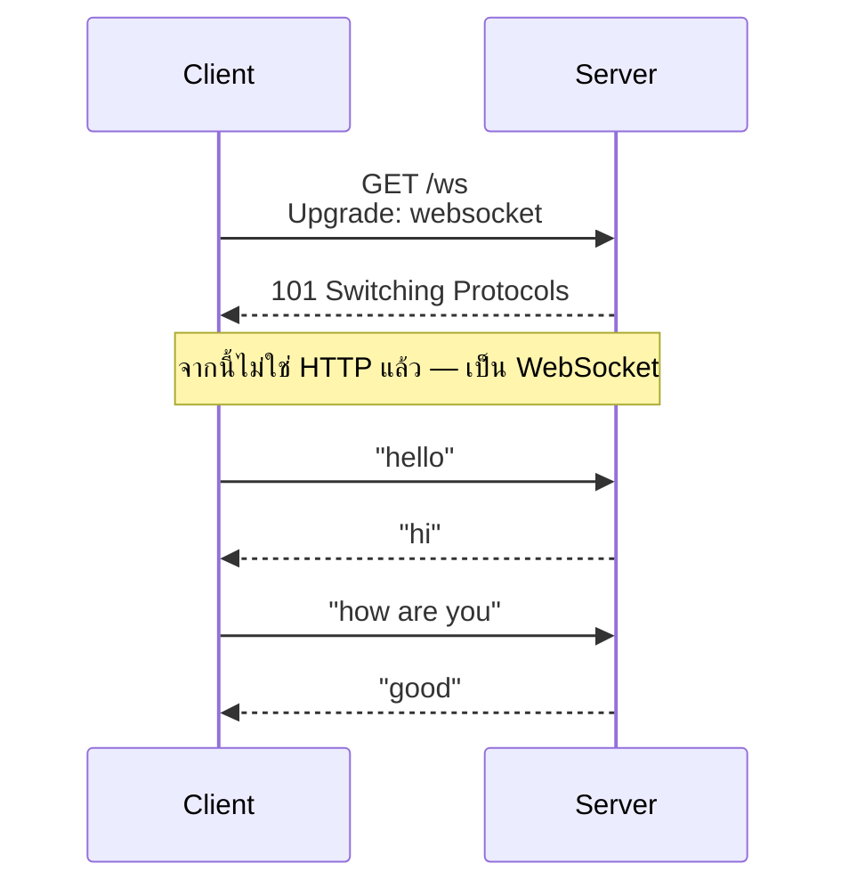
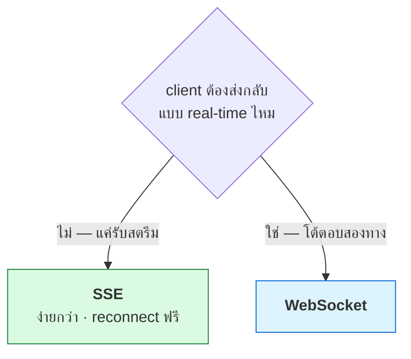

# บทที่ 69 · Real-time เจาะลึก — SSE, WebSocket และการเลือกให้ถูก

> [บทที่ 29](29-realtime-push-and-offline.md) แนะนำ SSE และ WebSocket ไปแล้ว **บทนี้ลงลึกว่าแต่ละอัน
> ทำงานระดับ byte อย่างไร เลือกอย่างไร และพังอย่างไร**
>
> ทุกตัวอย่าง SSE ในบทนี้มาจาก `/api/stream` ของ lab server จริง

## 69.1 สามวิธีส่งข้อมูลจาก server หาผู้ใช้ {#s69-1}

```
Polling    : client ถามซ้ำ ๆ "มีอะไรใหม่ไหม"     ← ง่าย เปลือง
SSE        : server ส่งทางเดียว client ฟังอย่างเดียว ← สตรีม
WebSocket  : สองทาง คุยกันได้ทั้งคู่               ← โต้ตอบ
```

| | ทิศทาง | โปรโตคอล | reconnect อัตโนมัติ |
|---|---|---|---|
| **Polling** | client ถาม | HTTP ปกติ | — |
| **SSE** | server → client | HTTP ธรรมดา | ✅ **มีในตัว** |
| **WebSocket** | ⇄ สองทาง | อัปเกรดจาก HTTP | ❌ ต้องเขียนเอง |

## 69.2 SSE — สตรีมบน HTTP ธรรมดา {#s69-2}

**SSE ไม่ใช่โปรโตคอลใหม่** — เป็น HTTP response ที่ไม่ปิด แล้วส่งข้อมูลเรื่อย ๆ

ดู byte จริงจาก lab server:

```bash
curl -sN 'http://127.0.0.1:8080/api/stream?count=3'
```

```
event: tick
data: {"seq": 1, "ts": 1787945555}

event: tick
data: {"seq": 2, "ts": 1787945555}

event: done
data: {}

```

**รูปแบบง่ายมาก — แค่ text:**

| บรรทัด | ความหมาย |
|---|---|
| `event: tick` | ชื่อ event (ไม่บังคับ) |
| `data: {...}` | ข้อมูล (JSON หรืออะไรก็ได้) |
| **บรรทัดว่าง** | 🔑 **จบหนึ่งก้อน** — คั่นแต่ละ message |
| `id: 42` | ลำดับ (ไม่บังคับ แต่สำคัญ — ข้อ [69.4](#s69-4)) |

header ที่ทำให้เป็น SSE:

```
Content-Type: text/event-stream       ← ตัวบอกว่านี่คือ SSE
Cache-Control: no-cache
```

## 69.3 ฝั่ง client — 3 บรรทัด {#s69-3}

```javascript
const es = new EventSource("/api/stream");
es.addEventListener("tick", e => console.log(JSON.parse(e.data)));
es.onerror = () => console.log("ขาด — เบราว์เซอร์จะ reconnect ให้เอง");
```

> ## SSE มี reconnect อัตโนมัติ — นี่คือจุดขายที่คนมองข้าม
>
> ถ้าการเชื่อมต่อขาด (เน็ตหลุด, server รีสตาร์ท) **เบราว์เซอร์ต่อใหม่ให้เอง**
> โดยไม่ต้องเขียนโค้ด — ต่างจาก WebSocket ที่ต้องจัดการ reconnect เองทั้งหมด
>
> นี่คือเหตุผลที่ SSE เหมาะกับ "สตรีมที่ต้องไม่ขาด" เช่นราคาหุ้น,
> การแจ้งเตือน, **token ที่ไหลออกจาก LLM** ([บทที่ 48](48-serving-llm.md))

## 69.4 SSE ที่ทำถูก — `id` และ reconnect {#s69-4}

**lab server จงใจยังไม่มี `id:`** — ทำให้ reconnect แล้วข้อมูลหาย

```
ปัญหา: ส่งถึง seq 5 → เน็ตขาด → reconnect → server เริ่มใหม่ที่ seq 1
       → client พลาด 6,7,8 หรือได้ซ้ำ
```

**ทางแก้: ใส่ `id:` ทุก message** เบราว์เซอร์จะส่ง `Last-Event-ID` ตอน reconnect

```
id: 5
event: tick
data: {...}
```

```
reconnect → เบราว์เซอร์ส่ง header: Last-Event-ID: 5
server → เริ่มส่งต่อจาก 6 → ไม่มีอะไรหาย
```

> **นี่คือความต่างระหว่าง SSE ที่ใช้ได้จริงกับ demo** — ถ้าไม่มี `id:`
> ทุกการ reconnect จะหายหรือซ้ำ ซึ่งบนเน็ตมือถือที่หลุดบ่อยคือปัญหาใหญ่
> (แบบฝึกหัด 29.2-29.3 ให้เติมส่วนนี้ใน lab)

**heartbeat กัน connection ตาย:**

```
: comment บรรทัดนี้กัน proxy ตัด idle connection
```

proxy และ load balancer ([บทที่ 57](57-scaling-out.md)) มักตัด connection ที่เงียบนานเกินไป
— ส่ง comment (`:`) ทุก ~15 วินาทีกันไว้

## 69.5 WebSocket — สองทางเต็มรูปแบบ {#s69-5}

เมื่อ **client ต้องส่งกลับด้วย** (แชท, เกม, collaborative editing) SSE ไม่พอ



**เริ่มด้วย HTTP แล้ว "อัปเกรด":**

```
GET /ws HTTP/1.1
Upgrade: websocket
Connection: Upgrade
Sec-WebSocket-Key: dGhlIHNhbXBsZSBub25jZQ==

→ HTTP/1.1 101 Switching Protocols       ← หลังบรรทัดนี้ไม่ใช่ HTTP อีกต่อไป
```

**หลัง `101` การเชื่อมต่อ TCP เดิมกลายเป็นช่องทาง 2 ทาง** ส่งข้อมูลได้ทั้งคู่
ตลอดเวลา ต่างจาก HTTP ที่ต้อง request-response เป็นคู่ ๆ ([บทที่ 1](01-http-basics.md))

## 69.6 SSE หรือ WebSocket — เลือกยังไง {#s69-6}



| ใช้ | เลือก |
|---|---|
| LLM streaming token | **SSE** — ทางเดียว, reconnect สำคัญ ([บทที่ 48](48-serving-llm.md)) |
| แจ้งเตือน, feed, ราคา | **SSE** |
| แชท, เกม, ตำแหน่งเรียลไทม์ | **WebSocket** |
| collaborative editing | **WebSocket** |
| อัปเดตสถานะ job | **SSE** ([บทที่ 56](56-background-jobs-and-queues.md)) |

> ## เริ่มด้วย SSE เสมอถ้าเป็นทางเดียว
>
> WebSocket ทรงพลังกว่า แต่**แลกด้วยความซับซ้อน** — reconnect เอง,
> heartbeat เอง, จัดการ state ของ connection เอง, proxy บางตัวไม่รองรับ
>
> **ถ้างานเป็นทางเดียว SSE ให้ผลเท่ากันด้วยโค้ดครึ่งเดียว** — คนมักเลือก
> WebSocket เพราะฟังดูทันสมัยกว่า ทั้งที่ SSE พอ

## 69.7 ปัญหาตอนสเกล — real-time เจอหนักกว่า API ปกติ {#s69-7}

การเชื่อมต่อ real-time **ค้างไว้นาน** ต่างจาก HTTP ที่จบเร็ว — ทำให้เจอปัญหา
ที่ API ปกติไม่เจอ

| ปัญหา | เพราะ |
|---|---|
| **connection กินทรัพยากรค้าง** | แต่ละ connection = 1 file descriptor ค้าง ([บทที่ 35](35-linux-internals.md)) |
| **sticky ไม่ได้ผล** | ผู้ใช้ต่อกับเครื่อง A แต่ event เกิดที่เครื่อง B ([บทที่ 57](57-scaling-out.md)) |
| proxy ตัด idle | ต้อง heartbeat ([69.4](#s69-4)) |
| reconnect พร้อมกัน | server รีสตาร์ท → ทุก client ต่อใหม่พร้อมกัน (thundering herd) |

> ## ปัญหา "event เกิดคนละเครื่อง" คือตัวที่ยากที่สุด
>
> ผู้ใช้ 10,000 คนต่อ WebSocket กระจายบน 3 เครื่อง — พอเกิด event ที่ต้องส่ง
> หาผู้ใช้คนหนึ่ง **เครื่องที่รู้ event อาจไม่ใช่เครื่องที่ผู้ใช้ต่ออยู่**
>
> **ทางแก้: pub/sub ตรงกลาง** (Redis pub/sub, [บทที่ 57](57-scaling-out.md)) — ทุกเครื่อง
> subscribe แล้วเครื่องที่ผู้ใช้ต่ออยู่จะหยิบไปส่งต่อ

```
event เกิดที่เครื่อง B → publish ไป Redis → ทุกเครื่อง subscribe
                                            → เครื่อง A (ที่ผู้ใช้ต่อ) หยิบไปส่ง
```

## 69.8 backpressure — เมื่อ client รับไม่ทัน {#s69-8}

server ส่งเร็วกว่าที่ client รับไหว → ข้อมูลกองใน buffer → หน่วยความจำบวม

```
server ส่ง 1000 msg/วิ · client มือถือเน็ตช้ารับได้ 100/วิ
   → 900 msg/วิ กองใน send buffer → หน่วยความจำ server โต → OOM
```

| ทางแก้ | ทำอะไร |
|---|---|
| ตรวจ buffer เต็ม | ถ้า `send()` block/เต็ม → ตัด connection ช้า ๆ ทิ้ง |
| ทิ้ง message เก่า | บาง use case (ราคาล่าสุด) เก่าแล้วไม่ต้องส่ง |
| ลดอัตราส่ง | ส่งสรุปแทนทุก event |

**หลักการเดียวกับ[บทที่ 57](57-scaling-out.md) เรื่อง backpressure** — ระบบต้องมีทางระบาย
เมื่อรับไม่ทัน ไม่ใช่กองไว้จน OOM

## 69.9 checklist real-time production {#s69-9}

- [ ] SSE: มี `id:` ทุก message + handle `Last-Event-ID` ([69.4](#s69-4))
- [ ] มี heartbeat กัน proxy ตัด idle
- [ ] WebSocket: reconnect logic + exponential backoff ([บทที่ 56](56-background-jobs-and-queues.md))
- [ ] pub/sub ตรงกลางถ้ามีหลายเครื่อง ([69.7](#s69-7))
- [ ] จัดการ backpressure — ไม่ให้ client ช้าทำ server OOM
- [ ] จำกัดจำนวน connection ต่อผู้ใช้ (กัน resource ค้าง)
- [ ] auth ตอนเปิด connection ([บทที่ 9](09-authentication.md)) — และ**ตรวจซ้ำเป็นระยะ**
      เพราะ connection ค้างนานกว่าอายุ token

> **ข้อสุดท้ายคนลืมบ่อย** — WebSocket ที่เปิดค้าง 8 ชั่วโมง แต่ token
> อายุ 15 นาที ([บทที่ 11](11-mobile-api-auth-design.md)) ต้องมีกลไกตรวจสิทธิ์ซ้ำระหว่างทาง
> ไม่ใช่ตรวจแค่ตอนเปิด

## แบบฝึกหัด

1. `curl -sN 'localhost:8080/api/stream?count=5'` — เห็นโครงสร้าง SSE ไหม
   บรรทัดว่างคั่นแต่ละก้อนอยู่ตรงไหน
2. เติม `id:` ให้ `/api/stream` ใน lab server แล้วทดสอบ `Last-Event-ID`
   (แบบฝึกหัด 29.2)
3. เขียนหน้าเว็บที่ใช้ `EventSource` ต่อ `/api/stream` แล้วลองปิด server
   — เบราว์เซอร์ reconnect เองไหม
4. ตอบตัวเอง: feature real-time ที่คุณอยากทำ ต้องการสองทางจริงไหม
   หรือ SSE พอ (ข้อ [69.6](#s69-6))
5. ออกแบบ: ถ้ามี 3 เครื่องและผู้ใช้ต่อ WebSocket กระจายกัน จะส่ง event
   หาผู้ใช้คนหนึ่งอย่างไร (ข้อ [69.7](#s69-7))
6. คำนวณ: 10,000 connection ค้างไว้ = กี่ file descriptor ต่อเครื่อง
   ต้องปรับ `ulimit` ไหม ([บทที่ 35](35-linux-internals.md))

***
[⬅ Push, Real-time, Upload และ Offline](29-realtime-push-and-offline.md) · [สารบัญ](../README.md) · [งานเบื้องหลังและคิวงาน ➡](56-background-jobs-and-queues.md)
